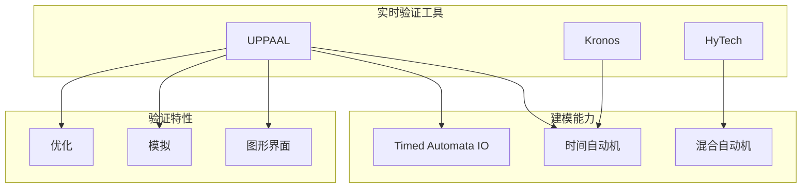
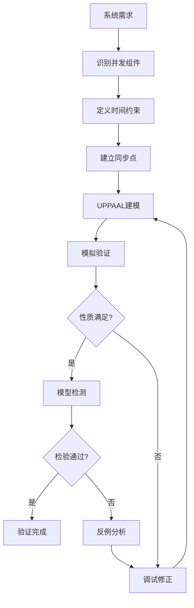
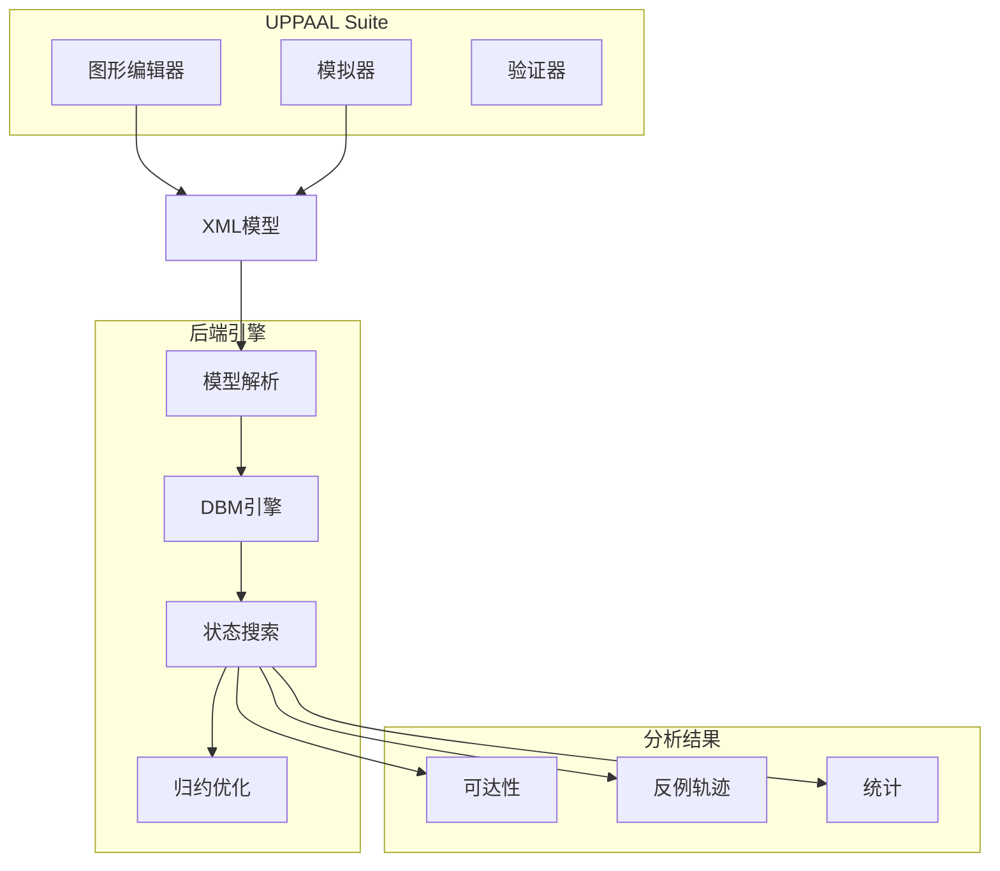
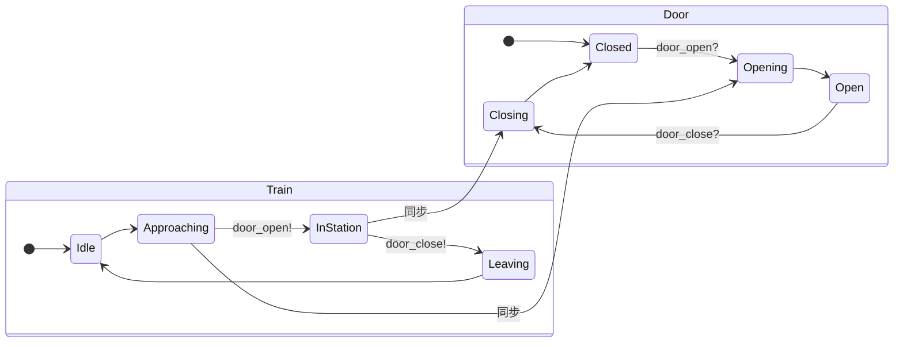
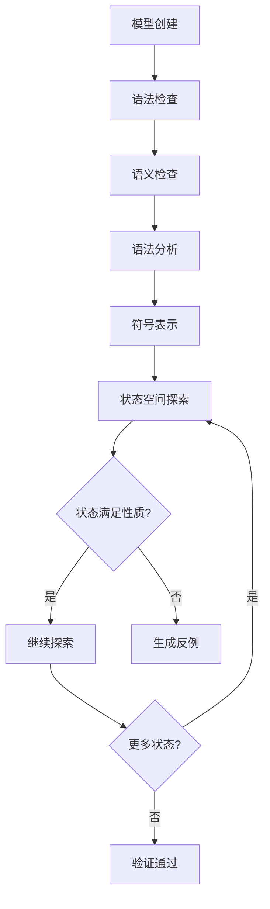

# UPPAAL

> **所属单元**: Tools/Academic | **前置依赖**: [实时模型检测](../../05-verification/02-model-checking/03-realtime-mc.md) | **形式化等级**: L4

## 1. 概念定义 (Definitions)

### 1.1 UPPAAL概述

**Def-T-02-01** (UPPAAL定义)。UPPAAL是用于实时系统建模、验证和模拟的工具套件：

$$\text{UPPAAL} = \text{时间自动机编辑器} + \text{模拟器} + \text{模型检测器}$$

**核心特性**：

- 基于时间自动机网络建模
- 使用约束求解技术（DBM）
- 支持模型检测和优化
- 提供图形化用户界面

**Def-T-02-02** (UPPAAL模型结构)。一个UPPAAL模型由以下部分组成：

$$\mathcal{U} = (\text{Templates}, \text{Global Declarations}, \text{System Definition})$$

- **模板** (Template): 参数化的时间自动机
- **全局声明**: 全局变量、通道、时钟
- **系统定义**: 模板实例化和组合

### 1.2 建模语言

**Def-T-02-03** (UPPAAL语法元素)。

```uppaal
// 模板定义
process TemplateName(const int param) {
    state_id { invariant }  // 位置与不变式

    trans
        source -> target {
            guard,           // 守卫条件
            sync?,           // 同步（接收）
            sync!,           // 同步（发送）
            reset            // 重置（时钟/变量）
        };
}

// 系统定义
system Process1, Process2;
```

**数据类型**：

- **时钟** (`clock`): 非负实数，自动递增
- **有界整数** (`int[min,max]`): 离散变量
- **数组** (`type[N]`): 聚合数据
- **结构体** (`struct`): 复合类型

### 1.3 验证查询

**Def-T-02-04** (UPPAAL查询语言)。

| 查询 | 含义 | 类型 |
|------|------|------|
| `A[] P` | 始终P | 安全性 |
| `E<> P` | 可能P | 可达性 |
| `A<> P` | 最终P | 活性 |
| `P --> Q` | P导致Q | 响应 |
| `A[] not deadlock` | 无死锁 | 进展 |

**Def-T-02-05** (优化查询)。

```uppaal
// 最小代价
minimize: expression

// 边界检查
sup: expression  // 上确界
inf: expression  // 下确界
```

## 2. 属性推导 (Properties)

### 2.1 符号状态空间

**Lemma-T-02-01** (符号状态表示)。UPPAAL使用DBM表示时钟域：

$$Z = \{(l, u) \mid u \models \bigwedge_{i,j} (x_i - x_j \bowtie c_{ij})\}$$

**Lemma-T-02-02** (on-the-fly探索)。UPPAAL采用on-the-fly状态空间探索：

$$\text{可达性} = \mu Z. \text{Init} \cup \text{Succ}(Z)$$

包含检查避免重复探索。

### 2.2 复杂度

**Lemma-T-02-03** (UPPAAL复杂度)。时间自动机可达性检验是PSPACE完全的：

$$\text{Reachability} \in \text{PSPACE}$$

实际中通过抽象和近似技术处理大模型。

## 3. 关系建立 (Relations)

### 3.1 UPPAAL与其他工具对比



### 3.2 应用域映射

| 应用领域 | 典型模型 | 关键性质 |
|----------|----------|----------|
| 实时操作系统 | 调度器 | 截止时间满足 |
| 通信协议 | 握手机制 | 无死锁 |
| 控制系统 | 传感器网络 | 响应时间 |
| 工作流 | 业务流程 | 吞吐量 |

## 4. 论证过程 (Argumentation)

### 4.1 建模方法论



## 5. 形式证明 / 工程论证 (Proof / Engineering Argument)

### 5.1 DBM正确性

**Thm-T-02-01** (DBM操作正确性)。DBM正确表示和操作时钟约束：

$$\text{DBM}(Z) \models \varphi \Leftrightarrow Z \models \varphi$$

**证明要点**：

1. 规范形保证唯一表示
2. Floyd-Warshall闭包保持等价
3. 约束加法和投影正确实现域操作

### 5.2 可达性算法

**Thm-T-02-02** (UPPAAL可达性)。符号可达性算法正确判定可达性：

$$\text{UPPAAL}(M, l_{\text{target}}) = \text{reachable} \Leftrightarrow \exists \rho: s_0 \xrightarrow{*} (l_{\text{target}}, u)$$

## 6. 实例验证 (Examples)

### 6.1 列车门控制

```uppaal
// 列车模板
process Train() {
    state Idle, Approaching, InStation, Leaving;
    init Idle;

    trans
        Idle -> Approaching { guard x >= 100; },
        Approaching -> InStation {
            guard x <= 150;
            sync door_open!;
            assign x = 0;
        },
        InStation -> Leaving {
            guard y >= 20;
            sync door_close!;
        },
        Leaving -> Idle { guard x >= 50; };
}

// 门控制器
process Door() {
    state Closed, Opening, Open, Closing;
    init Closed;

    trans
        Closed -> Opening { sync door_open?; assign z = 0; },
        Opening -> Open { guard z <= 5; },
        Open -> Closing { sync door_close?; assign z = 0; },
        Closing -> Closed { guard z <= 5; };
}

// 系统定义
system Train, Door;

// 验证性质
// A[] not (Train.InStation and Door.Closed)
// Train.Approaching --> Train.InStation
```

### 6.2 Fischer互斥协议

```uppaal
// Fischer协议验证
const int N = 3;
const int DELTA = 2;

typedef int[0,N-1] pid_t;

process Fischer(pid_t pid) {
    clock x;
    state A, B, C, CS;
    init A;

    trans
        A -> B { guard id == 0; assign id = pid + 1, x = 0; },
        B -> C { guard x <= DELTA; },
        C -> CS { guard id == pid + 1 && x > DELTA; assign x = 0; },
        C -> A { guard id != pid + 1; },
        CS -> A { assign id = 0; };
}

// 系统: 3个进程
system Fischer(0), Fischer(1), Fischer(2);

// 互斥性质: A[] (forall(i:pid_t) forall(j:pid_t)
//          Fischer(i).CS && Fischer(j).CS imply i == j)
```

## 7. 可视化 (Visualizations)

### 7.1 UPPAAL架构



### 7.2 时间自动机网络



### 7.3 验证流程



## 8. 引用参考 (References)
