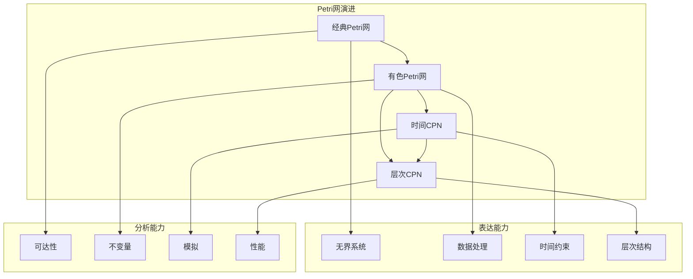
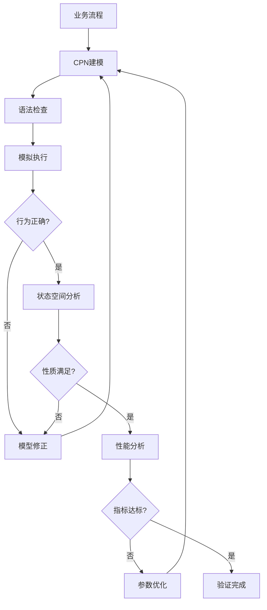
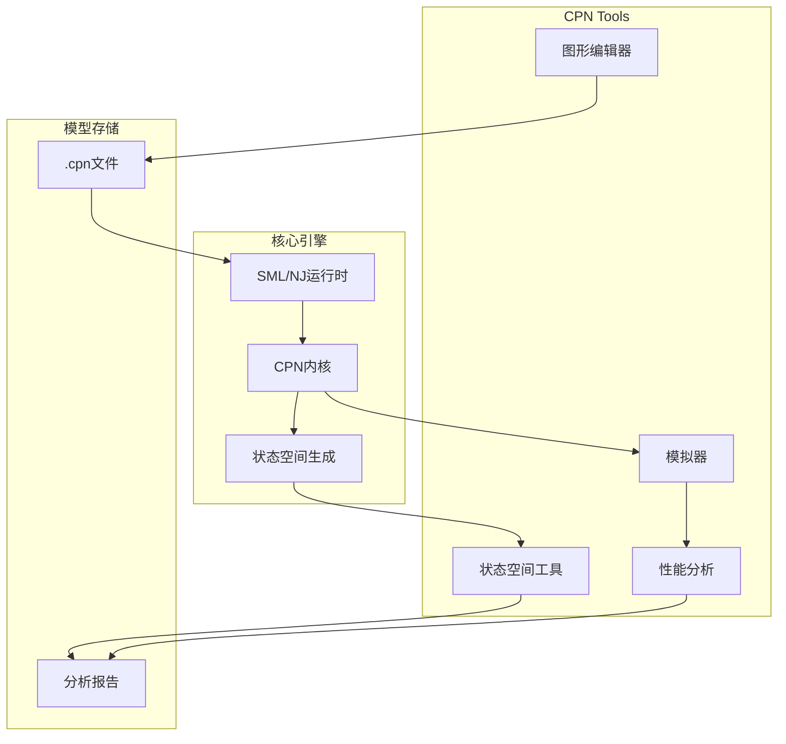
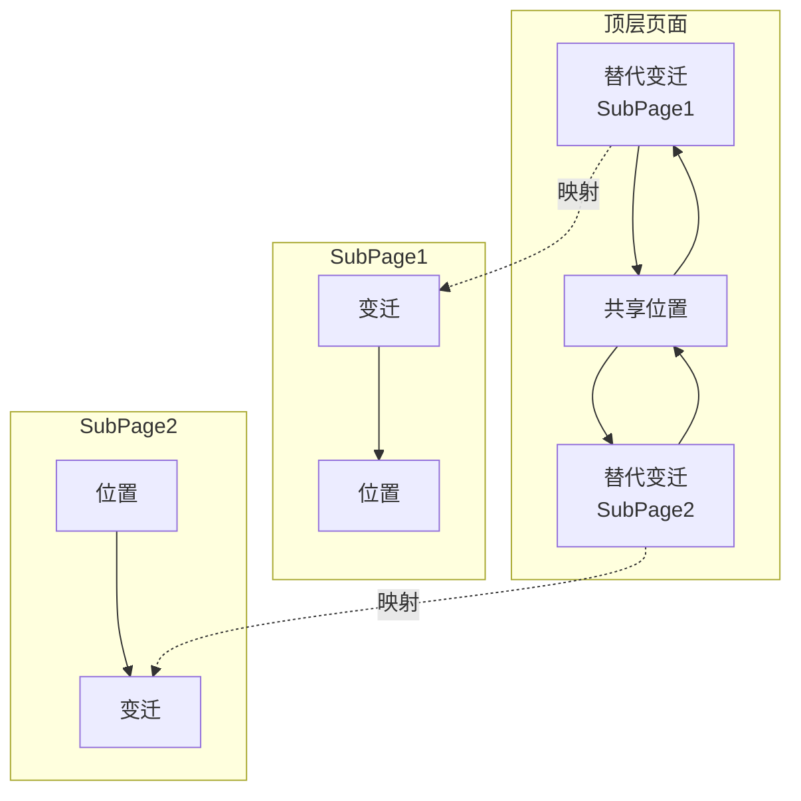

# CPN Tools

> **所属单元**: Tools/Academic | **前置依赖**: [Event-B 精化方法](../../05-verification/01-logic/02-event-b.md) | **形式化等级**: L4

## 1. 概念定义 (Definitions)

### 1.1 有色Petri网

**Def-T-03-01** (有色Petri网 / CPN)。CPN是经典Petri网的扩展，引入数据类型和表达式：

$$\text{CPN} = (\Sigma, P, T, A, N, C, G, E, I)$$

其中：

- **$\Sigma$**: 颜色集合（数据类型）有限集
- **$P$**: 位置有限集
- **$T$**: 变迁有限集
- **$A$**: 弧有限集 ($P \times T \cup T \times P$)
- **$N$**: 节点函数 $A \to P \times T \cup T \times P$
- **$C$**: 颜色函数 $P \to \Sigma$
- **$G$**: 守卫函数 $T \to \text{Expr}$，类型为 $\mathbb{B}$
- **$E$**: 弧表达式函数 $A \to \text{Expr}$
- **$I$**: 初始化函数 $P \to \text{Expr}$

**Def-T-03-02** (颜色集合)。CPN使用标准ML数据类型：

```ml
colset INT = int;
colset STRING = string;
colset PRODUCT = product INT * STRING;
colset LIST = list INT;
colset ENUM = with A | B | C;
```

### 1.2 层次化CPN

**Def-T-03-03** (替代变迁)。CPN支持层次化建模：

$$\text{Hierarchical CPN} = \text{Flat CPN} + \text{Substitution Transitions}$$

- **替代变迁** (Substitution Transition): 映射到子页面
- **端口/插座** (Port/Socket): 层次间连接
- **融合集** (Fusion Set): 跨页面位置融合

### 1.3 时间CPN

**Def-T-03-04** (时间扩展)。时间CPN (Timed CPN) 增加时间戳：

$$\text{Timed CPN} = \text{CPN} + \text{Timestamp}$$

- **全局时钟**: 离散或连续时间
- **令牌时间戳**: `@+delay` 标记可用时间
- **时间守卫**: 变迁使能的时间条件

## 2. 属性推导 (Properties)

### 2.1 CPN分析能力

**Lemma-T-03-01** (状态空间分析)。CPN Tools生成可达状态图：

$$\text{Occurrence Graph} = (V, E, v_0)$$

其中$V$是可达标记集合，$E$是发生序列。

**Lemma-T-03-02** (性能分析)。通过监控器收集统计信息：

- **计数监控器**: 统计变迁发生次数
- **数据监控器**: 记录数据值
- **停止监控器**: 定义停止条件

### 2.2 状态空间约简

**Def-T-03-05** (状态空间约简技术)。CPN Tools提供多种约简：

| 技术 | 描述 | 适用场景 |
|------|------|----------|
| 偏序归约 | 利用独立性减少交错 | 并发系统 |
| 对称归约 | 识别对称结构 | 复制组件 |
| 合并器 | 压缩序列步骤 | 原子动作 |
| 优先权 | 指导搜索顺序 | 特定性质 |

## 3. 关系建立 (Relations)

### 3.1 Petri网家族关系



### 3.2 与BPMN的关系

| 特征 | CPN | BPMN |
|------|-----|------|
| 形式化 | 严格语义 | 描述性 |
| 执行语义 | 明确 | 部分隐含 |
| 分析能力 | 状态空间/性能 | 有限 |
| 建模焦点 | 并发/资源 | 业务流程 |
| 适用阶段 | 设计验证 | 需求分析 |

## 4. 论证过程 (Argumentation)

### 4.1 工作流验证方法论



## 5. 形式证明 / 工程论证 (Proof / Engineering Argument)

### 5.1 CPN行为正确性

**Thm-T-03-01** (CPN发生规则)。变迁$t$在标记$M$下使能的条件：

$$\forall p \in P: E(p, t) \leq M(p) \land G(t) = \text{true}$$

新标记：
$$M'(p) = M(p) - E(p, t) + E(t, p)$$

### 5.2 状态空间有限性

**Thm-T-03-02** (有界CPN可判定性)。对于有界CPN，可达性问题是可判定的：

$$\text{Bounded}(\text{CPN}) \Rightarrow \text{Reachability} \in \text{Decidable}$$

## 6. 实例验证 (Examples)

### 6.1 简单生产者-消费者

```ml
(* 颜色集合声明 *)
colset DATA = with D1 | D2 | D3;
colset INDEX = int with 0..10;

(* 变量声明 *)
var d: DATA;
var i: INDEX;

(* 网结构 *)
(* 位置: Input (DATA list), Buffer (DATA), Output (DATA list) *)
(* 变迁: Produce, Consume *)

(* Produce变迁 *)
(* 输入弧: Input -> Produce: 表达式 `d::input` *)
(* 输出弧: Produce -> Buffer: 表达式 `d` *)
(* 守卫: `length(input) < 10` *)

(* Consume变迁 *)
(* 输入弧: Buffer -> Consume: 表达式 `d` *)
(* 输出弧: Consume -> Output: 表达式 `output @ [d]` *)

(* 初始标记 *)
(* Input: 1`[] *)
(* Buffer: empty *)
(* Output: 1`[] *)
```

### 6.2 协议验证

```ml
(* 停止-等待协议 *)
colset SEQ = int with 0..1;
colset DATA = product SEQ * STRING;
colset ACK = SEQ;

(* 通道 *)
colset CHAN = DATA;

(* 发送方 *)
(* 状态: Ready, Wait *)
(* 变迁: Send, Timeout, AckReceived *)

(* 接收方 *)
(* 状态: Receiving, Delivered *)
(* 变迁: Receive, SendAck *)

(* 验证性质 *)
(* 可达性: 数据正确传递 *)
(* 安全性: 无重复交付 *)
(* 活性: 最终交付 *)
```

## 7. 可视化 (Visualizations)

### 7.1 CPN Tools架构



### 7.2 层次化CPN示例



### 7.3 工作流验证流程


## 8. 引用参考 (References)
