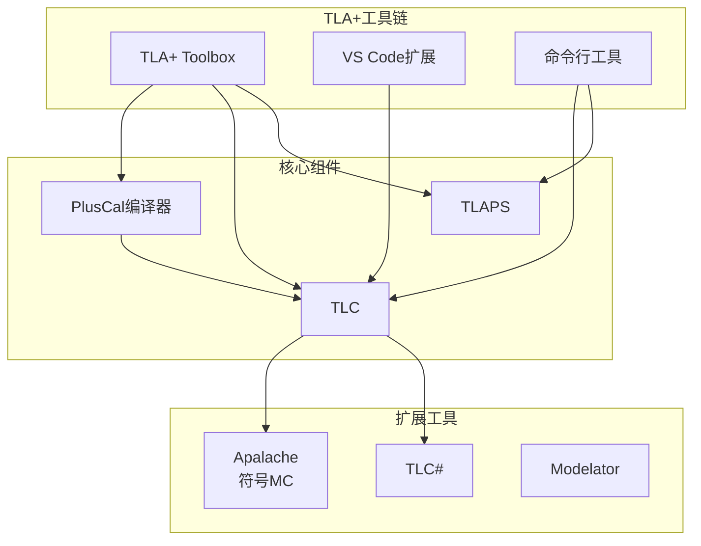
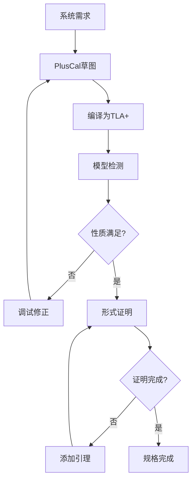
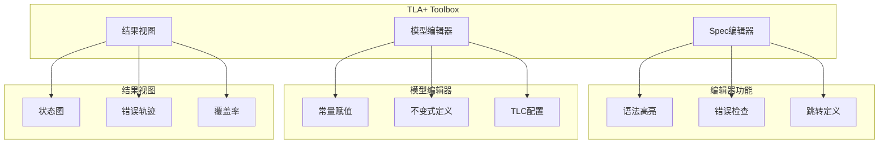
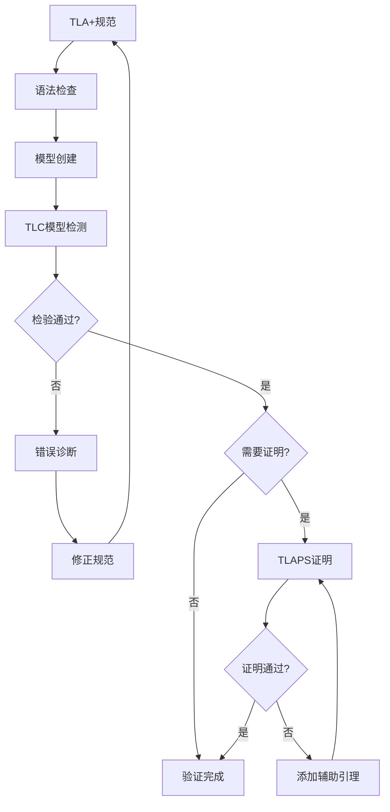
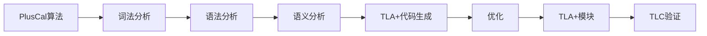

# TLA+ Toolbox

> **所属单元**: Tools/Academic | **前置依赖**: [TLA+ 时序逻辑](../../05-verification/01-logic/01-tla-plus.md) | **形式化等级**: L5

## 1. 概念定义 (Definitions)

### 1.1 TLA+ Toolbox概述

**Def-T-04-01** (TLA+ Toolbox定义)。TLA+ Toolbox是TLA+语言的集成开发环境：

$$\text{TLA+ Toolbox} = \text{TLA+编辑器} + \text{TLC模型检测器} + \text{TLAPS集成} + \text{PlusCal编译器}$$

**Def-T-04-02** (PlusCal算法语言)。PlusCal是伪代码风格的算法描述语言，可编译为TLA+：

```pluscal
--algorithm AlgorithmName
variables
    global_vars = initial_values;

process ProcessName \in ProcessSet
variables
    local_vars;
begin
Label1:
    statements;
Label2:
    statements;
end process;

end algorithm;
```

### 1.2 TLC模型检测器

**Def-T-04-03** (TLC配置)。TLC模型检测需要以下配置：

- **What to check?**: 不变式、时序性质、公平性假设
- **What is the model?**: 常量赋值、状态约束、行为约束
- **How to run?**: 工作者线程数、检查点选项

**Def-T-04-04** (状态空间表示)。TLC使用显式状态表示：

$$\text{State} = \text{变量名} \to \text{值}$$

TLC支持：

- **随机模拟**: 生成随机执行轨迹
- **广度优先搜索**: 系统探索所有可达状态
- **深度优先搜索**: 用于寻找反例

### 1.3 TLAPS证明系统

**Def-T-04-05** (TLAPS架构)。TLA+证明系统支持层次化证明：

$$\text{TLAPS} = \text{证明管理器} + \text{后端证明器} + \text{TLA+编码}$$

**后端证明器**：

- **Zenon**: 自动表证证明器
- **Isabelle/TLA+**: 交互式高阶逻辑证明
- **SMT求解器**: Z3, CVC4用于自动推理
- **Cooper算法**: Presburger算术

## 2. 属性推导 (Properties)

### 2.1 TLC性能特征

**Lemma-T-04-01** (TLC并行化)。TLC支持多工作者并行：

$$\text{Speedup}(n) \approx n \text{ (理想情况)}$$

实际加速受状态空间形状和哈希分布影响。

**Lemma-T-04-02** (对称性约简)。TLC利用对称性减少状态空间：

$$|\text{States}_{\text{reduced}}| \leq \frac{|\text{States}_{\text{full}}|}{|SymmetryGroup|}$$

### 2.2 PlusCal编译

**Def-T-04-06** (PlusCal到TLA+编译)。PlusCal编译过程：

1. **解析**: 识别算法结构
2. **翻译**: 转换为TLA+动作
3. **优化**: 简化生成的TLA+
4. **整合**: 与TLA+模块合并

**PlusCal特性**：

- **过程**: 多进程并发
- **原子块**: `atomic` 或 `await`
- **非确定性**: `either` 或 `with`
- **宏**: 代码复用

## 3. 关系建立 (Relations)

### 3.1 TLA+工具生态系统



### 3.2 与其他工具对比

| 特性 | TLA+ Toolbox | Alloy | Spin |
|------|-------------|-------|------|
| 基础逻辑 | TLA | 关系逻辑 | LTL |
| 建模风格 | 状态机 | 关系约束 | 进程演算 |
| 验证方法 | MC+证明 | SAT求解 | MC |
| 并发模型 | 交错 | 无 | 交错 |
| 工业应用 | 广泛(Amazon) | 学术为主 | 协议验证 |

## 4. 论证过程 (Argumentation)

### 4.1 规格开发工作流



## 5. 形式证明 / 工程论证 (Proof / Engineering Argument)

### 5.1 PlusCal语义正确性

**Thm-T-04-01** (PlusCal编译正确性)。PlusCal算法$C$编译后的TLA+规范$\llbracket C \rrbracket$保持语义：

$$\text{Exec}(C) \cong \text{Behaviors}(\llbracket C \rrbracket)$$

### 5.2 TLC验证完备性

**Thm-T-04-02** (TLC有限状态完备性)。对于有限状态模型，TLC正确判定性质：

$$\text{Finite}(M) \Rightarrow (\text{TLC}(M, \varphi) = \text{pass} \Leftrightarrow M \models \varphi)$$

## 6. 实例验证 (Examples)

### 6.1 PlusCal算法: 互斥

```pluscal
--algorithm Mutex
variables
    flag = [i \in {0,1} |-> FALSE],
    turn = 0;

process Proc \in {0,1}
variables
    other = 1 - self;
begin
L1:
    flag[self] := TRUE;
L2:
    turn := other;
L3:
    await (flag[other] = FALSE) \/ (turn = self);
CS:
    skip;  (* 临界区 *)
L4:
    flag[self] := FALSE;
goto L1;
end process;

end algorithm;
```

### 6.2 TLA+ TLC配置

```tla
------------------------------ MODULE MutexMC ------------------------------
EXTENDS Mutex

ConstProc == {0, 1}

(* TLC配置 *)
(* 常量赋值 *)
ConstProc <- {0, 1}

(* 不变式 *)
Invariant == MutualExclusion

(* 时序性质 *)
Property == Liveness

(* 状态约束 - 限制搜索 *)
StateConstraint ==
    /\ pc[0] \in {"L1", "L2", "L3", "CS", "L4"}
    /\ pc[1] \in {"L1", "L2", "L3", "CS", "L4"}
=============================================================================
```

### 6.3 TLAPS证明示例

```tla
THEOREM Safety == Spec => []MutualExclusion
<1>1. Init => MutualExclusion
    BY DEF Init, MutualExclusion
<1>2. MutualExclusion /\ [Next]_vars => MutualExclusion'
    BY DEF MutualExclusion, Next, vars
<1>3. QED
    BY <1>1, <1>2, PTL
```

## 7. 可视化 (Visualizations)

### 7.1 TLA+ Toolbox界面



### 7.2 TLA+验证流程



### 7.3 PlusCal编译流程



## 8. 引用参考 (References)
