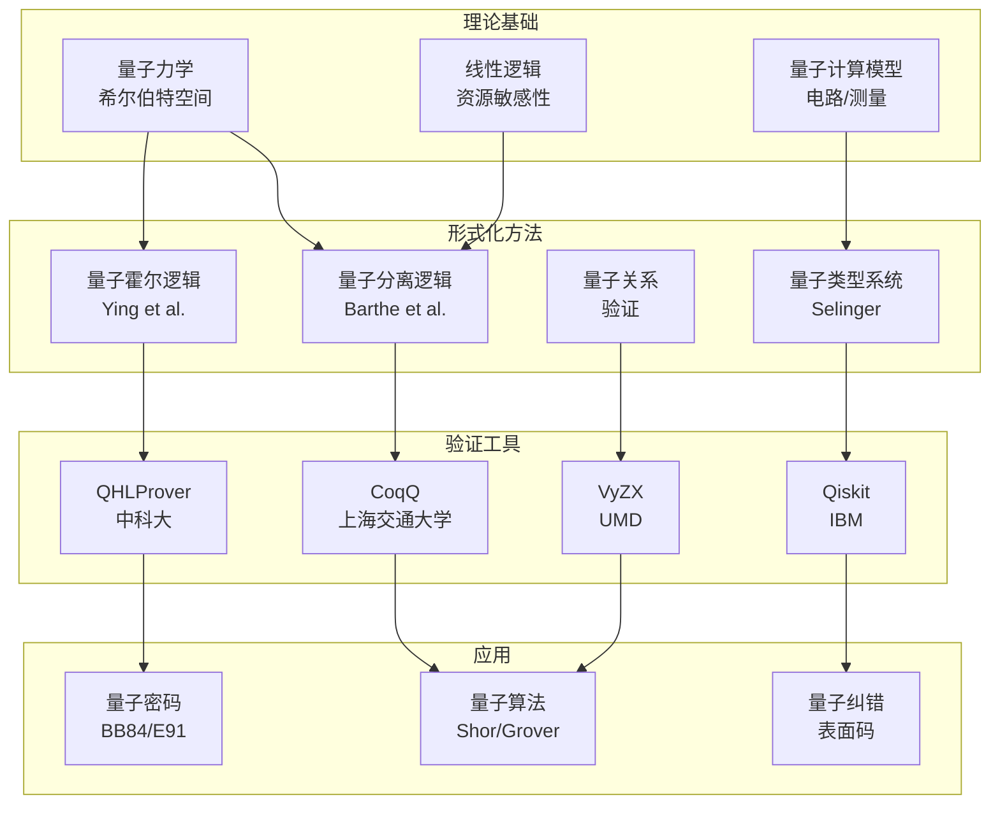
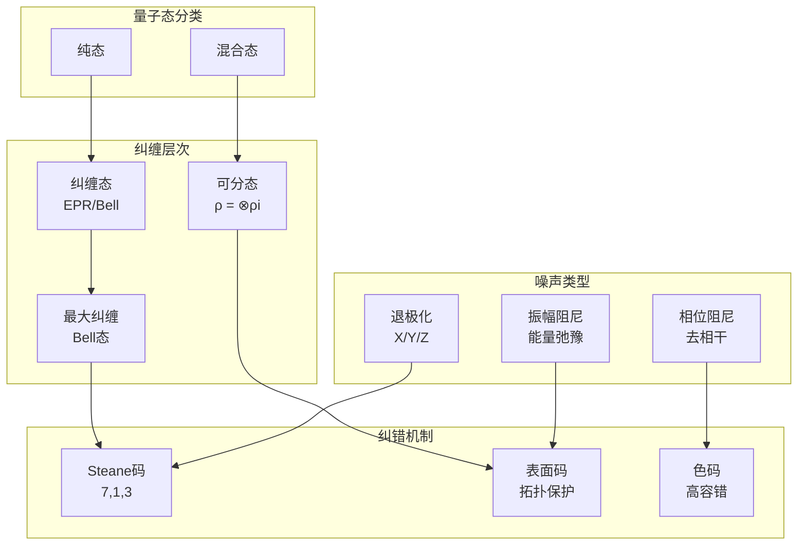
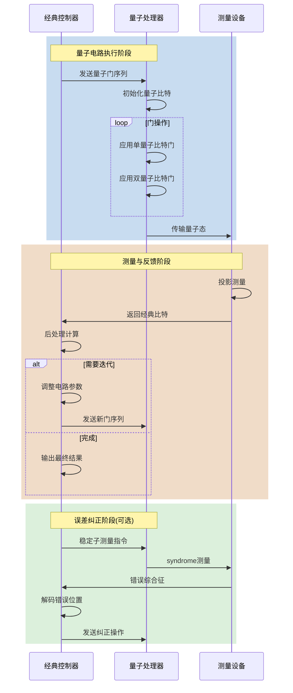
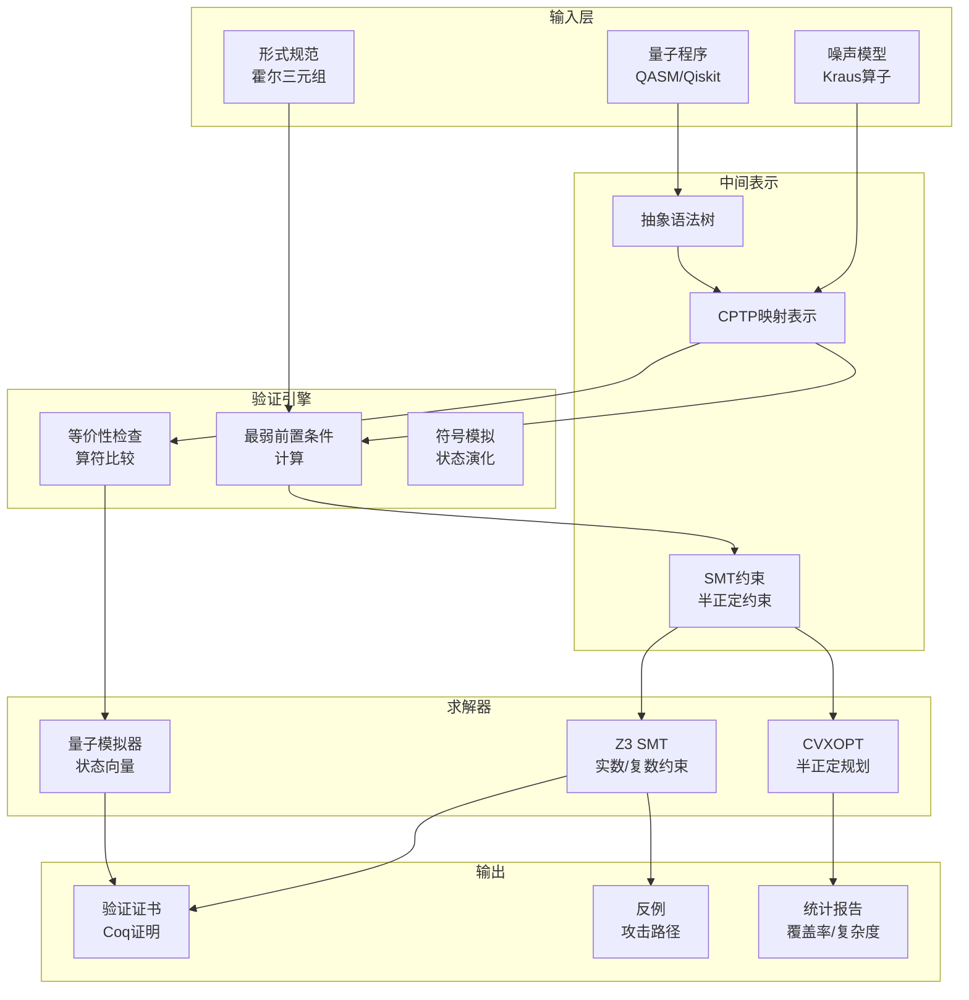

# 量子计算形式化方法

> **所属单元**: Tools/Academic | **前置依赖**: [霍尔逻辑](../../05-verification/02-techniques/01-hoare-logic.md), [分离逻辑](../../05-verification/02-techniques/03-separation-logic.md) | **形式化等级**: L6

## 1. 概念定义 (Definitions)

### 1.1 量子程序语义基础

**Def-T-05-01** (量子比特)。量子比特(qubit)是量子计算的基本信息单元，其状态由二维复希尔伯特空间中的单位向量描述：

$$|\psi\rangle = \alpha|0\rangle + \beta|1\rangle, \quad \alpha, \beta \in \mathbb{C}, \quad |\alpha|^2 + |\beta|^2 = 1$$

其中$|0\rangle = \begin{pmatrix} 1 \\ 0 \end{pmatrix}$，$|1\rangle = \begin{pmatrix} 0 \\ 1 \end{pmatrix}$构成计算基。

**Def-T-05-02** (密度矩阵)。密度矩阵$\rho$是描述量子态的半正定算子，满足：

$$\rho = \sum_i p_i |\psi_i\rangle\langle\psi_i|, \quad \rho \succeq 0, \quad \text{tr}(\rho) = 1$$

密度矩阵的演化由完全正定保迹(CPTP)映射描述：$\rho' = \mathcal{E}(\rho) = \sum_k E_k \rho E_k^\dagger$，其中$\sum_k E_k^\dagger E_k = I$。

**Def-T-05-03** (量子电路)。量子电路是量子计算的图形化表示：

$$\text{QC} = (\mathcal{Q}, \mathcal{G}, \mathcal{W})$$

其中$\mathcal{Q}$是量子比特集合，$\mathcal{G} = \{U_1, U_2, \ldots, U_m\}$是量子门集合，$\mathcal{W}$是连线关系。$n$量子比特电路的计算由酉矩阵$U \in \mathbb{C}^{2^n \times 2^n}$描述，满足$U^\dagger U = I$。

**基本量子门矩阵表示**：

| 门 | 符号 | 矩阵表示 | 作用 |
|-----|------|----------|------|
| Hadamard | H | $\frac{1}{\sqrt{2}}\begin{pmatrix} 1 & 1 \\ 1 & -1 \end{pmatrix}$ | 创建叠加态 |
| Pauli-X | X | $\begin{pmatrix} 0 & 1 \\ 1 & 0 \end{pmatrix}$ | 量子NOT门 |
| Pauli-Y | Y | $\begin{pmatrix} 0 & -i \\ i & 0 \end{pmatrix}$ | Y轴旋转 |
| Pauli-Z | Z | $\begin{pmatrix} 1 & 0 \\ 0 & -1 \end{pmatrix}$ | 相位翻转 |
| CNOT | $\bullet-\oplus$ | $\text{diag}(I, X)$ | 条件非门 |
| T门 | T | $\begin{pmatrix} 1 & 0 \\ 0 & e^{i\pi/4} \end{pmatrix}$ | $\pi/8$门 |

### 1.2 量子霍尔逻辑 (Quantum Hoare Logic, QHL)

**Def-T-05-04** (量子霍尔三元组)。量子霍尔三元组$\{P\} S \{Q\}$定义为：

$$\forall \rho. \text{tr}(P\rho) = 1 \Rightarrow \text{tr}(Q\llbracket S \rrbracket(\rho)) = 1$$

其中$P, Q$是量子谓词(即满足$0 \preceq P \preceq I$的厄米算子)，$\llbracket S \rrbracket$是程序$S$的语义函数。

**Def-T-05-05** (量子谓词)。量子谓词$A$是希尔伯特空间上的算子，满足：

$$0 \preceq A \preceq I$$

量子谓词的解释：对于量子态$\rho$，$\text{tr}(A\rho)$表示状态满足谓词$A$的概率程度。

**量子霍尔逻辑推理规则**：

$$
\begin{aligned}
&\text{(Skip)} &&\{P\} \text{skip} \{P\} \\[6pt]
&\text{(Init)} &&\{d_0^{-2}|0\rangle_q\langle 0|P|0\rangle_q\langle 0| + d_1^{-2}|1\rangle_q\langle 1|P|1\rangle_q\langle 1|\} \ q:=|0\rangle \ \{P\} \\[6pt]
&\text{(Unitary)} &&\{U^\dagger P U\} \ \bar{q} := U[\bar{q}] \ \{P\} \\[6pt]
&\text{(Measure)} &&\{P\} \ x := M[\bar{q}] \ \{\sum_m M_m^\dagger P M_m\} \\[6pt]
&\text{(Sequential)} &&\frac{\{P\} S_1 \{Q\}, \quad \{Q\} S_2 \{R\}}{\{P\} S_1; S_2 \{R\}} \\[6pt]
&\text{(Condition)} &&\frac{\{P_m\} S_m \{Q\} \text{ for all } m}{\{\sum_m |m\rangle_p\langle m| \otimes P_m\} \ \text{if } p \text{ then } S_0 \text{ else } S_1 \ \{Q\}} \\[6pt]
&\text{(Loop)} &&\frac{\{B\} S \{A\}, \quad A \preceq B}{\{A\} \ \text{while } M[q]=1 \text{ do } S \ \{\sum_{k=0}^\infty M_0' (M_1' S)^k (A)\}} \\[6pt]
&\text{(Consequence)} &&\frac{P' \preceq P, \quad \{P\} S \{Q\}, \quad Q \preceq Q'}{\{P'\} S \{Q'\}}
\end{aligned}
$$

### 1.3 量子分离逻辑 (Quantum Separation Logic, QSL)

**Def-T-05-06** (量子资源)。量子资源定义为量子态的部分描述：

$$\mu = (\rho, \sigma)$$

其中$\rho$是密度矩阵，$\sigma: \text{QVar} \to \mathbb{C}^{2\times 2}$是局部量子态映射。

**Def-T-05-07** (量子分离合取)。量子分离合取$P * Q$定义为：

$$P * Q = \{(\rho_1 \otimes \rho_2, \sigma_1 \uplus \sigma_2) : (\rho_1, \sigma_1) \models P, (\rho_2, \sigma_2) \models Q, \text{dom}(\sigma_1) \cap \text{dom}(\sigma_2) = \emptyset\}$$

**Def-T-05-08** (量子魔 wand)。量子魔 wand$P \text{--}* Q$定义为：

$$(\rho, \sigma) \models P \text{--}* Q \iff \forall (\rho', \sigma') \models P. \text{dom}(\sigma) \cap \text{dom}(\sigma') = \emptyset \Rightarrow (\rho \otimes \rho', \sigma \uplus \sigma') \models Q$$

### 1.4 量子类型系统

**Def-T-05-09** (量子类型)。量子类型系统扩展经典类型，引入量子类型：

$$\tau ::= \text{bit} \mid \text{qubit} \mid \tau_1 \otimes \tau_2 \mid \tau_1 \multimap \tau_2 \mid !\tau$$

其中：

- $\text{qubit}$: 量子比特类型
- $\tau_1 \otimes \tau_2$: 张量积(乘积类型)
- $\tau_1 \multimap \tau_2$: 线性函数类型(资源敏感)
- $!\tau$: 指数模态(可复制资源)

**Def-T-05-10** (线性类型规则)。量子计算遵循线性逻辑：

$$
\frac{\Gamma \vdash t : \tau_1 \multimap \tau_2 \quad \Delta \vdash u : \tau_1}{\Gamma, \Delta \vdash t\ u : \tau_2} (\multimap E) \quad \text{要求} \ \Gamma \cap \Delta = \emptyset
$$

**Def-T-05-11** (量子态空间)。$n$量子比特的态空间：

$$\mathcal{H}_n = \bigotimes_{i=1}^{n} \mathbb{C}^2 \cong \mathbb{C}^{2^n}$$

类型安全性保证：良类型的量子程序不会违反物理约束(如不可克隆定理)。

## 2. 属性推导 (Properties)

### 2.1 量子态保真度

**Lemma-T-05-01** (保真度定义)。量子态$\rho$与$\sigma$之间的保真度：

$$F(\rho, \sigma) = \left(\text{tr}\sqrt{\sqrt{\rho}\sigma\sqrt{\rho}}\right)^2$$

对于纯态$|\psi\rangle$和$|\phi\rangle$：$F(|\psi\rangle, |\phi\rangle) = |\langle\psi|\phi\rangle|^2$。

**Lemma-T-05-02** (保真度性质)。保真度满足：

1. **有界性**：$0 \leq F(\rho, \sigma) \leq 1$
2. **对称性**：$F(\rho, \sigma) = F(\sigma, \rho)$
3. **单位性**：$F(\rho, \sigma) = 1 \Leftrightarrow \rho = \sigma$
4. **酉不变性**：$F(U\rho U^\dagger, U\sigma U^\dagger) = F(\rho, \sigma)$

**Lemma-T-05-03** (保真度与迹距离)。保真度与迹距离的关系：

$$1 - \sqrt{F(\rho, \sigma)} \leq \frac{1}{2}\|\rho - \sigma\|_1 \leq \sqrt{1 - F(\rho, \sigma)}$$

其中$\|A\|_1 = \text{tr}\sqrt{A^\dagger A}$是迹范数。

### 2.2 量子纠缠性质

**Lemma-T-05-04** (纠缠态定义)。$n$量子比特态$|\psi\rangle$是可分离的，当且仅当：

$$|\psi\rangle = \bigotimes_{i=1}^{n} |\phi_i\rangle$$

否则称为纠缠态。

**Lemma-T-05-05** (Bell态)。四个最大纠缠Bell态：

$$
\begin{aligned}
|\Phi^+\rangle &= \frac{1}{\sqrt{2}}(|00\rangle + |11\rangle) \\
|\Phi^-\rangle &= \frac{1}{\sqrt{2}}(|00\rangle - |11\rangle) \\
|\Psi^+\rangle &= \frac{1}{\sqrt{2}}(|01\rangle + |10\rangle) \\
|\Psi^-\rangle &= \frac{1}{\sqrt{2}}(|01\rangle - |10\rangle)
\end{aligned}
$$

**Lemma-T-05-06** (纠缠单调量)。纠缠度量$E$是纠缠单调量，当且仅当满足：

1. $E(\rho) = 0$ 若$\rho$可分
2. $E$在LOCC(局域操作与经典通信)下不增
3. $E$在可分态的直积下可加

**常用纠缠度量**：

| 度量 | 定义 | 适用范围 |
|------|------|----------|
| 冯·诺依曼熵 | $S(\rho) = -\text{tr}(\rho \log_2 \rho)$ | 纯态 |
| 并发度 | $C(|\psi\rangle) = \sqrt{2(1-\text{tr}(\rho_A^2))}$ | 两量子比特 |
| 负性 | $N(\rho) = \frac{\|\rho^{T_A}\|_1 - 1}{2}$ | 混合态 |

### 2.3 量子门可逆性

**Lemma-T-05-07** (可逆性)。所有量子门都是可逆的酉操作：

$$U^\dagger U = UU^\dagger = I$$

**Lemma-T-05-08** (通用门集)。门集合$\mathcal{G}$是通用的，当且仅当对任意$U \in SU(2^n)$和$\epsilon > 0$，存在$g_1, \ldots, g_m \in \mathcal{G}$使得：

$$\|U - g_m \cdots g_2 g_1\| \leq \epsilon$$

**标准通用门集**：

- $\{H, T, \text{CNOT}\}$：精确通用性(Solovay-Kitaev定理)
- $\{H, S, T, \text{CNOT}\}$：带辅助位的通用性

**Lemma-T-05-09** (Toffoli门构造)。Toffoli(CCNOT)门可由单量子比特门和CNOT门构造：

$$\text{Toffoli} = (I \otimes H) \cdot \text{分解电路} \cdot (I \otimes H)$$

需要6个CNOT门和若干单量子比特门。

## 3. 关系建立 (Relations)

### 3.1 量子程序与经典程序关系

**Prop-T-05-01** (经典嵌入)。经典计算可嵌入量子计算：

$$\forall f: \{0,1\}^n \to \{0,1\}^m. \exists U_f. U_f|x\rangle|0\rangle = |x\rangle|f(x)\rangle$$

$U_f$是计算函数$f$的可逆量子电路。

**Prop-T-05-02** (计算复杂性关系)。量子与经典复杂性类关系：

$$\text{P} \subseteq \text{BPP} \subseteq \text{BQP} \subseteq \text{PSPACE}$$

$$\text{NP} \subseteq \text{BQP} \ ?\ \text{(开放问题)}$$

其中BQP(有界错误量子多项式时间)是量子多项式时间类。

**Prop-T-05-03** (查询复杂性)。量子查询复杂性优势：

| 问题 | 经典查询复杂度 | 量子查询复杂度 | 加速 |
|------|----------------|----------------|------|
| 无序搜索 | $\Theta(N)$ | $\Theta(\sqrt{N})$ | 二次 |
| 元素区分性 | $\Theta(N)$ | $\Theta(N^{2/3})$ | 多项式 |
| 周期查找 | $\Omega(N)$ | $O(\text{poly}(\log N))$ | 指数 |

### 3.2 量子-经典交互模型

**Def-T-05-12** (混合系统)。混合量子-经典系统定义为：

$$\mathcal{H}_{\text{hybrid}} = \mathcal{H}_{\text{quantum}} \otimes \mathcal{C}_{\text{classical}}$$

其中$\mathcal{C}_{\text{classical}}$是经典配置空间。

**Prop-T-05-04** (量子测量后状态)。对量子态$\rho$进行投影测量$\{P_m\}$：

$$\text{结果}m\text{的概率}: p(m) = \text{tr}(P_m \rho)$$

$$\text{后状态}: \rho_m = \frac{P_m \rho P_m^\dagger}{p(m)}$$

**Prop-T-05-05** (量子-经典接口)。标准量子计算模型：

```
经典控制器 → 量子门序列 → 量子处理器 → 测量结果 → 经典控制器
```

### 3.3 量子电路与量子门关系

**Prop-T-05-06** (电路等价)。两个量子电路$C_1$和$C_2$等价，当且仅当：

$$\forall |\psi\rangle. C_1|\psi\rangle = C_2|\psi\rangle$$

即对应的酉矩阵相等：$U_{C_1} = U_{C_2}$。

**Prop-T-05-07** (电路优化)。电路深度优化目标：

$$\min_{C'} \text{depth}(C') \quad \text{s.t.} \quad U_{C'} = U_C$$

**Prop-T-05-08** (门数量下界)。实现$n$量子比特任意酉变换所需门数：

$$\Omega(4^n) \text{ 个单/双量子比特门}$$

## 4. 论证过程 (Argumentation)

### 4.1 量子错误纠正分析

**Def-T-05-13** (量子错误模型)。单量子比特错误由Pauli算子描述：

$$\mathcal{E}(\rho) = \sum_{i \in \{I,X,Y,Z\}} p_i E_i \rho E_i^\dagger$$

其中$p_I + p_X + p_Y + p_Z = 1$。

**Prop-T-05-09** (容错阈值定理)。若物理错误率$p < p_{\text{th}}$，则任意长的量子计算可被可靠执行：

$$p_{\text{logical}} \leq C \left(\frac{p}{p_{\text{th}}}\right)^{(d+1)/2}$$

其中$d$是纠错码距离，$p_{\text{th}} \approx 10^{-3} \sim 10^{-4}$。

**Steane [[7,1,3]]码**：

- 编码7个物理量子比特为1个逻辑量子比特
- 纠正任意单量子比特错误
- 稳定子生成元：

$$
\begin{aligned}
g_1 &= XXXXXXI \\
g_2 &= XXXIIXX \\
g_3 &= XIXIXIX \\
g_4 &= ZZZZZZI \\
g_5 &= ZZZIIZZ \\
g_6 &= ZIZIZIZ
\end{aligned}
$$

**表面码(Surface Code)**：

- 二维拓扑码
- 高容错阈值($\sim 1\%$)
- 仅需最近邻交互
- 逻辑错误率随码距指数下降

### 4.2 量子优势证明框架

**Def-T-05-14** (量子优势)。问题$P$展示量子优势，当且仅当：

$$\exists \text{ 量子算法 } A_Q. T_Q(n) = o(T_C(n))$$

其中$T_Q(n)$是最佳量子算法时间，$T_C(n)$是最佳经典算法时间。

**Prop-T-05-10** (采样优势)。量子电路采样问题的经典困难性：

若存在经典多项式时间算法可模拟通用量子电路采样(在常数精度内)，则多项式层次PH坍塌到第三层。

**Prop-T-05-11** (隐藏子群问题)。HSP的量子加速：

$$\text{时间复杂度}: O(\text{poly}(n) + \text{生成元数量})$$

经典算法需要指数时间。

### 4.3 量子噪声建模

**Def-T-05-15** (退相干模型)。系统与环境耦合的Lindblad主方程：

$$\frac{d\rho}{dt} = -i[H, \rho] + \sum_k \gamma_k \left(L_k \rho L_k^\dagger - \frac{1}{2}\{L_k^\dagger L_k, \rho\}\right)$$

其中$L_k$是Lindblad算子，$\gamma_k$是衰减速率。

**主要噪声通道**：

| 通道 | Kraus算子 | 物理来源 |
|------|-----------|----------|
| 退极化 | $\sqrt{1-p}I, \sqrt{p/3}X, \sqrt{p/3}Y, \sqrt{p/3}Z$ | 环境耦合 |
| 振幅阻尼 | $\begin{pmatrix}1&0\\0&\sqrt{1-\gamma}\end{pmatrix}, \begin{pmatrix}0&\sqrt{\gamma}\\0&0\end{pmatrix}$ | 自发辐射 |
| 相位阻尼 | $\begin{pmatrix}1&0\\0&\sqrt{1-\gamma}\end{pmatrix}, \begin{pmatrix}0&0\\0&\sqrt{\gamma}\end{pmatrix}$ | 相位随机化 |
| 去相位 | $\begin{pmatrix}1&0\\0&e^{-\Gamma t}\end{pmatrix}$ | 环境涨落 |

**Prop-T-05-12** (相干时间)。量子相干时间$T_2$与噪声关系：

$$T_2 = \frac{1}{\gamma_\phi + \gamma_1/2}$$

其中$\gamma_\phi$是纯去相位率，$\gamma_1$是能量弛豫率。

## 5. 形式证明 / 工程论证 (Proof / Engineering Argument)

### 5.1 量子霍尔逻辑可靠性

**Thm-T-05-01** (QHL可靠性)。量子霍尔逻辑是可靠的：

$$\vdash_{QHL} \{P\} S \{Q\} \Rightarrow \models \{P\} S \{Q\}$$

**证明**：对程序结构进行归纳。

*基例*：Skip规则

$$\{P\} \text{skip} \{P\}$$

由定义直接可得：$\llbracket \text{skip} \rrbracket(\rho) = \rho$，故$\text{tr}(P\rho) = 1 \Rightarrow \text{tr}(P\llbracket \text{skip} \rrbracket(\rho)) = \text{tr}(P\rho) = 1$。

*归纳步骤*：酉变换规则

设规则为$\{U^\dagger P U\} \bar{q} := U[\bar{q}] \{P\}$。

对任意满足$\text{tr}(U^\dagger P U \cdot \rho) = 1$的$\rho$：

$$
\begin{aligned}
\text{tr}(P \cdot U\rho U^\dagger) &= \text{tr}(U^\dagger P U \cdot \rho) \\
&= \text{tr}(U^\dagger P U \rho) \\
&= 1
\end{aligned}
$$

第二行使用循环性质$\text{tr}(AB) = \text{tr}(BA)$。证毕。

*归纳步骤*：序列组合规则

假设$\{P\} S_1 \{Q\}$和$\{Q\} S_2 \{R\}$有效。对任意满足$\text{tr}(P\rho) = 1$的$\rho$：

1. 由$\{P\} S_1 \{Q\}$有效，得$\text{tr}(Q \cdot \llbracket S_1 \rrbracket(\rho)) = 1$
2. 由$\{Q\} S_2 \{R\}$有效，得$\text{tr}(R \cdot \llbracket S_2 \rrbracket(\llbracket S_1 \rrbracket(\rho))) = 1$
3. 由语义定义$\llbracket S_1; S_2 \rrbracket = \llbracket S_2 \rrbracket \circ \llbracket S_1 \rrbracket$，得证。

### 5.2 量子程序等价性判定

**Thm-T-05-02** (等价性判定)。两量子程序$S_1$和$S_2$等价，当且仅当：

$$\forall \rho. \llbracket S_1 \rrbracket(\rho) = \llbracket S_2 \rrbracket(\rho)$$

对于有限无循环程序，等价性可判定：

**证明概要**：

1. 无循环量子程序对应CPTP映射$\mathcal{E}_1, \mathcal{E}_2$
2. CPTP映射由Kraus算子$\{E_i\}, \{F_j\}$完全刻画
3. 等价性可转化为：$\forall i. \sum_j E_i^\dagger E_i = \sum_j F_j^\dagger F_j = I$且$\mathcal{E}_1(\rho) = \mathcal{E}_2(\rho)$对所有基态$\rho$成立
4. 基态数量有限($2^n$个对$n$量子比特)
5. 因此可在有限时间内验证

### 5.3 量子纠缠不变式

**Thm-T-05-03** (纠缠保持)。若量子程序$S$仅使用局域操作，则纠缠不变式$E_{\text{sep}}$是程序不变式：

$$\{\rho \text{可分}\} S \{\rho' \text{可分}\}$$

其中$E_{\text{sep}} = \{\rho : \rho = \bigotimes_i \rho_i\}$。

**证明**：

局域操作形式为$U_1 \otimes U_2 \otimes \cdots \otimes U_n$。对可分态$\rho = \bigotimes_i \rho_i$：

$$
(U_1 \otimes \cdots \otimes U_n) (\bigotimes_i \rho_i) (U_1^\dagger \otimes \cdots \otimes U_n^\dagger) = \bigotimes_i (U_i \rho_i U_i^\dagger)$$

结果仍是可分态。证毕。

**Thm-T-05-04** (纠缠蒸馏下界)。从$n$个纠缠对中提取$k$个最大纠缠对的蒸馏效率受限于：

$$\frac{k}{n} \leq E_D(\rho)$$

其中$E_D$是可蒸馏纠缠，满足$E_D(\rho) \leq E_F(\rho)$($E_F$是纠缠形成)。

## 6. 实例验证 (Examples)

### 6.1 Shor算法验证

**算法概述**：Shor算法在多项式时间内完成整数分解，威胁RSA加密。

**量子霍尔规范**：

```
{I} Shor(N) {测量结果r: gcd(a^{r/2} ± 1, N) 是非平凡因子}
```

**关键步骤验证**：

1. **模幂运算电路**：$U_a:|x\rangle|0\rangle \mapsto |x\rangle|a^x \mod N\rangle$
   - 使用重复平方实现
   - 门复杂度：$O((\log N)^3)$

2. **量子傅里叶变换**：
   $$QFT|j\rangle = \frac{1}{\sqrt{N}}\sum_{k=0}^{N-1} e^{2\pi i jk/N}|k\rangle$$

   **性质验证**：$QFT^\dagger \cdot QFT = I$

3. **周期查找**：
   - 输入：$|\psi\rangle = \frac{1}{\sqrt{q}}\sum_{x=0}^{q-1}|x\rangle|a^x \mod N\rangle$
   - 测量第二寄存器后：$|\psi'\rangle = \frac{1}{\sqrt{m}}\sum_{j=0}^{m-1}|x_0 + jr\rangle$
   - QFT后测量第一寄存器得到$r$的倍数

**成功概率分析**：

$$P(\text{成功}) \geq \frac{4}{\pi^2} \cdot \frac{1}{\log \log N}$$

### 6.2 Grover算法验证

**算法概述**：在无序数据库中搜索目标元素，提供二次加速。

**问题形式化**：

- 搜索空间：$N = 2^n$个元素
- 目标函数：$f(x) = 1$当且仅当$x$是目标
- 量子预言：$U_f|x\rangle = (-1)^{f(x)}|x\rangle$

**Grover扩散算子**：

$$G = (2|\psi\rangle\langle\psi| - I) U_f$$

其中$|\psi\rangle = \frac{1}{\sqrt{N}}\sum_{x=0}^{N-1}|x\rangle$是均匀叠加态。

**几何解释**：

$$\begin{pmatrix} |\alpha\rangle \\ |\beta\rangle \end{pmatrix} = \begin{pmatrix} \frac{1}{\sqrt{N-1}}\sum_{x \neq x^*}|x\rangle \\ |x^*\rangle \end{pmatrix}$$

Grover迭代是$|\alpha\rangle$-$|\beta\rangle$平面上的旋转，每次旋转$2\theta$其中$\sin\theta = \frac{1}{\sqrt{N}}$。

**最优迭代次数**：

$$R = \left\lfloor \frac{\pi}{4\arcsin(1/\sqrt{N})} \right\rfloor \approx \frac{\pi}{4}\sqrt{N}$$

**验证结果**：

$$
|\langle x^*|G^R|\psi\rangle|^2 \approx 1 - O(1/N)$$

### 6.3 量子密钥分发验证

**BB84协议形式化**：

```
{I} BB84 {共享密钥K: H(K|E) ≈ H(K), 其中E是窃听者信息}
```

**协议步骤**：

1. **制备**：Alice随机选择基$B \in \{+, \times\}$和比特$b \in \{0,1\}$，制备$|b\rangle_B$
2. **传输**：通过量子信道发送给Bob
3. **测量**：Bob随机选择基测量
4. **基比对**：公开比较基，保留基匹配的结果
5. **纠错**：经典信道纠错
6. **隐私放大**：提取安全密钥

**安全性证明**：

**Thm-T-05-05** (BB84安全性)。若量子比特错误率$QBER \leq 11\%$，则存在安全密钥提取方案。

**证明要点**：

- 使用信息论安全性框架
- 窃听必然引入可检测扰动：$QBER \geq \frac{1 - F(\rho_{AE}, \rho_A \otimes \rho_E)}{2}$
- 密钥率下界：$r \geq I(A:B) - I(A:E)$
- 对于集体攻击：$r \geq 1 - 2h(QBER)$，其中$h$是二进制熵

**E91协议**(基于纠缠)：

- 使用Bell态$|\Psi^-\rangle$
- CHSH不等式检验：$S = |E(a,b) - E(a,b') + E(a',b) + E(a',b')| \leq 2$(经典)，$\leq 2\sqrt{2}$(量子)
- 若$S > 2$，则存在纠缠，密钥安全

## 7. 工具介绍 (Tools)

### 7.1 Qiskit验证工具

**Qiskit**是IBM开发的开源量子计算SDK，提供完整的形式化验证支持：

**核心验证功能**：

```python
from qiskit import QuantumCircuit
from qiskit.quantum_info import Statevector, Operator
from qiskit.circuit.equivalence_library import SessionEquivalenceLibrary

# 创建电路
qc = QuantumCircuit(2)
qc.h(0)
qc.cx(0, 1)

# 状态向量验证
sv = Statevector.from_instruction(qc)
print(f"Bell态验证: {sv.data}")
# 输出: [0.707+0.j, 0.+0.j, 0.+0.j, 0.707+0.j]

# 算符验证
op = Operator(qc)
print(f"酉性验证: {np.allclose(op.data @ op.data.conj().T, np.eye(4))}")
# 输出: True

# 电路等价性验证
def circuits_equivalent(c1, c2):
    return Operator(c1) == Operator(c2)
```

**Qiskit Aer模拟器**：

- 状态向量模拟器：精确模拟$2^n$维态向量
- 密度矩阵模拟器：支持噪声建模
- 矩阵乘积态(MPS)模拟器：支持大规模电路

**形式化特性**：

| 特性 | 支持 |
|------|------|
| 状态向量验证 | ✓ |
| 密度矩阵演化 | ✓ |
| 电路等价性检查 | ✓ |
| 噪声通道模拟 | ✓ |
| 测量统计验证 | ✓ |

### 7.2 CoqQ框架

**CoqQ**是量子程序验证的Coq形式化框架：

**核心组件**：

1. **量子态形式化**：希尔伯特空间的类型化表示
2. **量子程序语言**：WhileQ语言嵌入Coq
3. **霍尔逻辑**：量子霍尔逻辑的Coq实现
4. **自动化策略**：量子计算专用tactics

**CoqQ证明示例**：

```coq
(* Bell态制备验证 *)
Lemma bell_state_correct:
  {{ I }}
  q0 := H[q0];
  q1 := CNOT[q0, q1]
  {{ |Φ⁺⟩⟨Φ⁺| }}.
Proof.
  hoare_apply.
  unfold Phi_plus.
  matrix_simp.
  reflexivity.
Qed.

(* Grover迭代正确性 *)
Lemma grover_iteration :
  forall (n : nat) (f : nat -> bool),
  {{ |ψ⟩⟨ψ| }}
  repeat (G f) (π/4 * √N)
  {{ |x*⟩⟨x*| }}.
Proof.
  intros.
  apply grover_convergence.
  - apply oracle_correct.
  - apply diffusion_correct.
  - apply iteration_count_optimal.
Qed.
```

**CoqQ支持的定理**：

- Shor算法正确性
- Grover算法最优性
- BB84协议安全性
- 量子纠错码容错性

### 7.3 QHLProver

**QHLProver**是量子霍尔逻辑的自动证明工具：

**功能特性**：

```
输入: 量子程序 + 前置/后置条件
输出: 证明结果 + 反例(若存在)
```

**核心算法**：

1. **谓词合成**：最弱前置条件计算
2. **矩阵约束求解**：SMT求解器处理半正定约束
3. **不变式推断**：抽象解释框架

**使用示例**：

```
# 量子霍尔规范
pre:  |0⟩⟨0|
prog: q := H[q]
post: |+⟩⟨+|

# 验证命令
$ qhl-prover verify --pre "|0⟩⟨0|" --post "|+⟩⟨+|" program.qhl

# 输出
[✓] Verification successful
    WP: |+⟩⟨+|
    Precondition entails WP: |0⟩⟨0| ≤ |+⟩⟨+|
```

**支持的推理规则**：

- Skip, Assignment, Unitary, Measure
- Sequential, Conditional, Loop
- Frame rule(分离逻辑)
- Consequence rule

### 7.4 VyZX量子电路可视化

**VyZX**是基于Coq的ZX演算形式化实现：

**ZX演算基础**：

ZX图是量子电路的图形化表示，基于两种节点：

- **Z-蜘蛛**(绿色)：$|0\rangle$和$|1\rangle$的本征态
- **X-蜘蛛**(红色)：$|+\rangle$和$|-\rangle$的本征态

**VyZX验证示例**：

```coq
(* CNOT门的ZX表示 *)
Definition CNOT_ZX : ZX 2 2 :=
  (Z_Spider 1 2 0) ⟷ (X_Spider 2 1 0).

(* CNOT恒等式验证 *)
Lemma CNOT_involutive :
  CNOT_ZX ⟷ CNOT_ZX ∝ Wire 2.
Proof.
  (* 使用ZX重写规则 *)
  apply bialgebra_rule.
  apply spider_fusion.
  apply identity_removal.
  reflexivity.
Qed.

(* 电路优化验证 *)
Lemma hadamard_cancellation :
  H_ZX ⟷ H_ZX ∝ Wire 1.
Proof.
  unfold H_ZX.
  rewrite spider_fusion.
  rewrite pi_cancellation.
  reflexivity.
Qed.
```

**ZX演算规则**：

| 规则 | 说明 |
|------|------|
| 蜘蛛融合 | 同色蜘蛛可合并，相位相加 |
| 双代数 | Z-X交互规则 |
| 复制 | 经典比特可任意复制 |
| 欧拉分解 | 任意单量子比特门的分解 |

**可视化输出**：

```
输入电路:     优化后:
  ┌───┐       ┌───┐
──┤ H ├──┐   ──┤ H ├─
  └───┘  │     └───┘
       ┌─┴─┐
───────┤ X ├─   ─────
       └───┘
```

## 8. 可视化 (Visualizations)

### 8.1 量子计算形式化方法体系



### 8.2 量子霍尔逻辑推理系统

```mermaid
flowchart TD
    A[量子程序S] --> B{程序结构}

    B -->|Skip| C[{P} skip {P}]
    B -->|Unitary| D[{U†PU} U[q] {P}]
    B -->|Measure| E[{∑Mm†PMm} x=M[q] {P}]
    B -->|Sequence| F[分解为S1;S2]
    B -->|Conditional| G[分支验证]
    B -->|Loop| H[归纳验证]

    F --> I[{P} S1 {Q}]
    I --> J[{Q} S2 {R}]
    J --> K[{P} S1;S2 {R}]

    G --> L[{P0} S0 {Q}]
    G --> M[{P1} S1 {Q}]
    L --> N[{|0⟩⟨0|⊗P0 + |1⟩⟨1|⊗P1} if c S0 S1 {Q}]
    M --> N

    H --> O[找到循环不变式I]
    O --> P[I ∧ B ⇒ WP(S, I)]
    P --> Q[I ∧ ¬B ⇒ R]
    Q --> R[{I} while B S {R}]

    C --> S[验证通过]
    D --> S
    E --> S
    K --> S
    N --> S
    R --> S
```

### 8.3 量子纠缠与纠错码



### 8.4 Shor算法电路结构

```mermaid
graph LR
    subgraph 输入准备
        Reg1[第一寄存器<br/>|0⟩^⊗n]
        Reg2[第二寄存器<br/>|0⟩^⊗m]
    end

    subgraph Hadamard变换
        H1[H^⊗n]
    end

    subgraph 模幂运算
        Uf[Uf:|x⟩|0⟩→|x⟩|a^x mod N⟩]
    end

    subgraph 量子傅里叶变换
        QFT[QFT^†]
    end

    subgraph 测量与经典后处理
        M1[测量寄存器1]
        CF[连分数算法]
        GCD[gcd计算]
    end

    Reg1 --> H1
    H1 --> Uf
    Reg2 --> Uf
    Uf --> QFT
    QFT --> M1
    M1 --> CF
    CF --> GCD
    GCD --> Factors[因子p,q]
```

### 8.5 量子-经典交互模型



### 8.6 量子程序验证工具链



## 9. 引用参考 (References)
