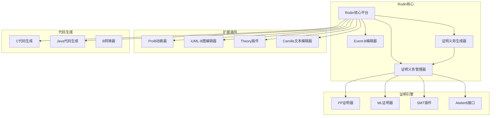
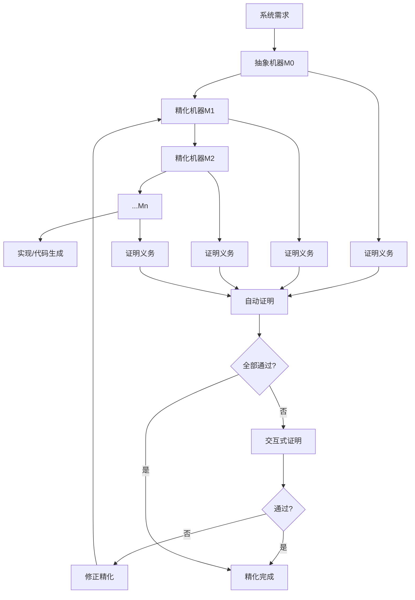
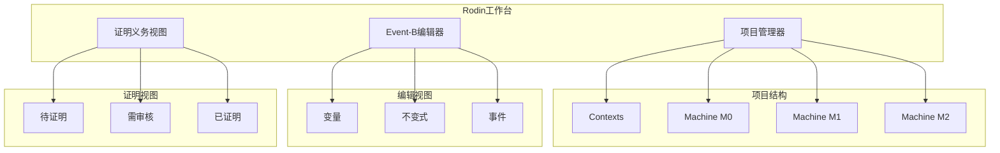
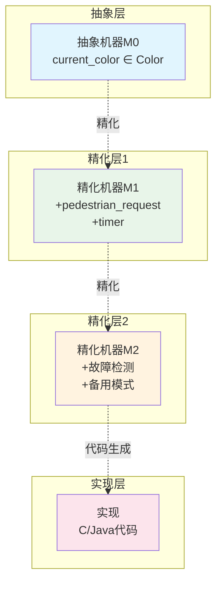
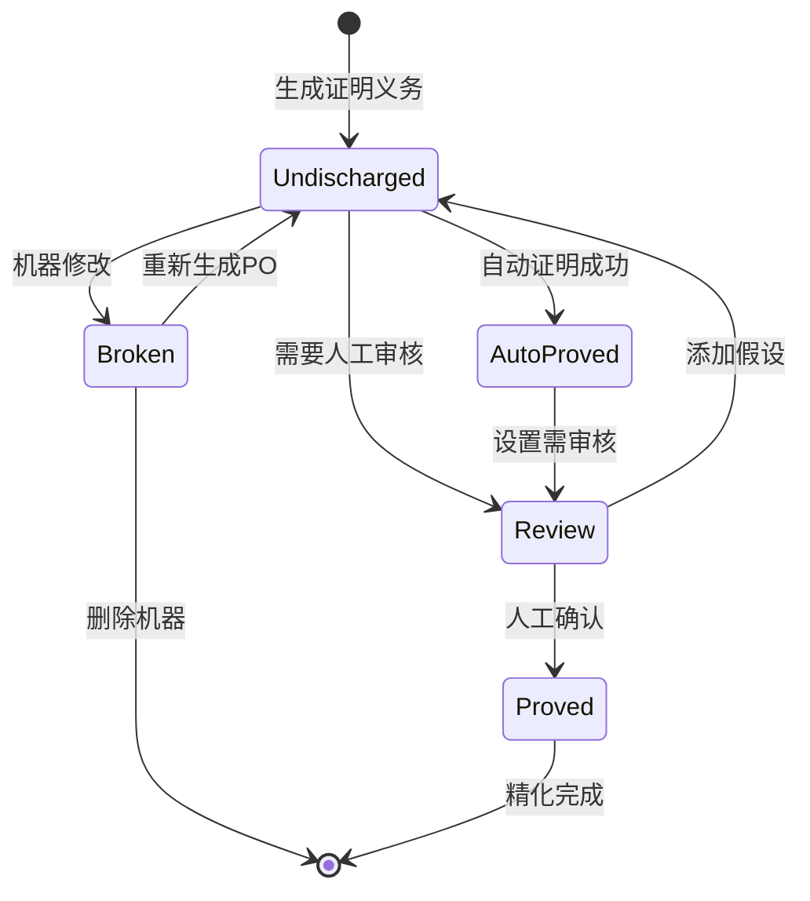

# Rodin平台 (Event-B)

> **所属单元**: Tools/Academic | **前置依赖**: [Event-B形式化方法](../../05-verification/03-refinement/01-event-b.md) | **形式化等级**: L5

## 1. 概念定义 (Definitions)

### 1.1 Rodin平台概述

**Def-T-05-01** (Rodin平台定义)。Rodin是Event-B方法的开源集成开发环境：

$$\text{Rodin} = \text{Event-B编辑器} + \text{自动证明器} + \text{精化管理器} + \text{插件系统}$$

**核心组件**：

- **Event-B编辑器**: 机器(Machine)和上下文(Context)的编辑
- **证明义务生成器(POG)**: 自动生成证明义务
- **证明义务管理器(POM)**: 管理证明义务状态
- **自动证明器(ATP)**: 基于SMT和决策过程的自动证明
- **插件系统**: 扩展功能的模块化架构

**Def-T-05-02** (Event-B机器结构)。Event-B机器定义：

$$\text{Machine} = (\text{variables}, \text{invariants}, \text{events}, \text{variant})$$

**机器元素**：

- **Variables**: 状态变量 $\text{var} \in \text{Variables}$
- **Invariants**: 不变式 $\text{inv} \in \text{Pred}(\text{Variables})$
- **Events**: 事件 $\text{evt} = (\text{params}, \text{guards}, \text{actions})$
- **Variant**: 变体函数 $V: \text{State} \to \text{WellFoundedSet}$

### 1.2 精化机制

**Def-T-05-03** (机器精化)。机器$M$精化为机器$N$：

$$M \sqsubseteq N \triangleq \exists \text{gluing}. \forall \sigma_M, \sigma_N. \text{gluing}(\sigma_M, \sigma_N) \Rightarrow \text{behavior}(M, N)$$

**精化类型**：

- **数据精化**: 通过胶合不变式关联抽象/具体变量
- **行为精化**: 事件分割、合并或增强
- **超级精化**: 增加新事件

**Def-T-05-04** (证明义务)。Event-B自动生成以下证明义务：

1. **不变式保持**: $I \land G \land B \Rightarrow [A]I'$
2. **精化正确性**: 具体守卫 $ o$ 抽象守卫
3. **收敛性**: 新事件减少变体
4. **预期性**: 抽象事件可被具体执行

### 1.3 Rodin证明系统

**Def-T-05-05** (Rodin证明架构)。Rodin支持多种证明策略：

$$\text{Provers} = \text{PP} \cup \text{ML} \cup \text{NewPP} \cup \text{SMT} \cup \text{AtelierB}$$

| 证明器 | 类型 | 适用场景 |
|--------|------|----------|
| PP | 谓词证明器 | 集合论、谓词逻辑 |
| ML | 单引理证明器 | 简单等式推理 |
| NewPP | 增强谓词证明器 | 复杂集合运算 |
| SMT | SMT求解器 | 算术、数组理论 |
| AtelierB | 外部证明器 | 与B方法互操作 |

## 2. 属性推导 (Properties)

### 2.1 证明义务特征

**Lemma-T-05-01** (证明义务数量)。对于机器$M$含$n$个事件和$m$个不变式：

$$|PO(M)| \leq n \cdot m + O(n)$$

**Lemma-T-05-02** (精化证明义务)。若$M$精化为$N$，额外证明义务：

$$|PO(N/M)| = O(|\text{events}_M| + |\text{events}_N|) + |\text{glue}|$$

### 2.2 自动证明能力

**Def-T-05-06** (Rodin自动证明率)。实际项目统计：

$$\text{AutoRate} = \frac{|\text{自动证明}|}{|\text{总证明义务}|} \times 100\% \approx 70\%\text{-}90\%$$

**影响自动证明的因素**：

- 集合复杂度（幂集、笛卡尔积）
- 算术表达式复杂度
- 存在量词嵌套深度
- 自定义理论扩展

## 3. 关系建立 (Relations)

### 3.1 Event-B工具生态系统



### 3.2 与其他形式化方法对比

| 特性 | Event-B/Rodin | Z/Alloy | VDM/Overture | TLA+/Toolbox |
|------|--------------|---------|--------------|--------------|
| 精化支持 | ✅ 原生支持 | ❌ 无 | ✅ 支持 | ⚠️ 手动模拟 |
| 自动证明 | ✅ 内置 | ❌ 无 | ⚠️ 部分 | ⚠️ TLAPS |
| 动画验证 | ✅ ProB插件 | ✅ 内置 | ✅ 内置 | ❌ 无 |
| 工业应用 | 铁路、航天 | 学术研究 | 嵌入式 | 分布式系统 |
| 学习曲线 | 陡峭 | 中等 | 中等 | 陡峭 |

## 4. 论证过程 (Argumentation)

### 4.1 精化开发工作流



### 4.2 典型应用场景

**适用场景**：

- 安全关键系统（铁路信号、核控制）
- 需要逐步精化的复杂系统
- 形式化验收标准

**不适用场景**：

- 快速原型开发
- 时序约束为主系统
- 实时性能关键系统

## 5. 形式证明 / 工程论证 (Proof / Engineering Argument)

### 5.1 Event-B一致性

**Thm-T-05-01** (Event-B一致性定理)。若机器$M$的所有证明义务得证：

$$(\forall po \in PO(M). \vdash po) \Rightarrow M \text{ is consistent}$$

**证明概要**：

1. 初始化建立不变式
2. 每个事件保持不变式
3. 精化保持行为一致性

### 5.2 精化正确性

**Thm-T-05-02** (精化保持性)。精化链$M_0 \sqsubseteq M_1 \sqsubseteq ... \sqsubseteq M_n$：

$$M_0 \models \phi \Rightarrow M_n \models \phi_{\text{translated}}$$

## 6. 实例验证 (Examples)

### 6.1 Rodin安装配置

**系统要求**：

- Java 11+ (JRE或JDK)
- 4GB+ RAM (推荐8GB)
- Eclipse 2022-09+ (基于)

**安装步骤**：

```bash
# 1. 下载Rodin平台
wget https://sourceforge.net/projects/rodin-b-sharp/files/rodin/3.7/rodin-3.7.0-linux.gtk.x86_64.tar.gz

# 2. 解压
tar -xzf rodin-3.7.0-linux.gtk.x86_64.tar.gz
cd rodin

# 3. 启动
./rodin
```

**推荐插件安装**：

```
Help → Install New Software → Add
- ProB: http://www.stups.hhu.de/prob_updates/rodin3/
- iUML-B: http://www.hef-lohr.fr/iUML-B/updatesite
- Theory: http://deploy-eprints.ecs.soton.ac.uk/eventb/org.eventb.theory.feature/site.xml
```

### 6.2 Event-B机器开发：交通灯

**上下文 (Context)**：

```eventb
context TrafficLight_ctx
constants
    RED GREEN YELLOW
    Color
axioms
    axm1: partition(Color, {RED}, {GREEN}, {YELLOW})
end
```

**抽象机器 (Machine)**：

```eventb
machine TrafficLight_m0
sees TrafficLight_ctx
variables
    current_color
invariants
    inv1: current_color ∈ Color
events
    event INITIALISATION
    begin
        act1: current_color := RED
    end

    event switch_to_green
    when
        grd1: current_color = RED
    then
        act1: current_color := GREEN
    end

    event switch_to_yellow
    when
        grd1: current_color = GREEN
    then
        act1: current_color := YELLOW
    end

    event switch_to_red
    when
        grd1: current_color = YELLOW
    then
        act1: current_color := RED
    end
end
```

### 6.3 精化示例：添加行人按钮

**精化机器 (Refinement)**：

```eventb
machine TrafficLight_m1 refines TrafficLight_m0
sees TrafficLight_ctx
variables
    current_color
    pedestrian_request
    timer
invariants
    inv1: pedestrian_request ∈ BOOL
    inv2: timer ∈ ℕ
    inv3: pedestrian_request = TRUE ⇒ current_color = RED

    // 胶合不变式
    gluing: current_color = current_color$0

events
    event INITIALISATION
    begin
        act1: current_color := RED
        act2: pedestrian_request := FALSE
        act3: timer := 0
    end

    event press_button
    when
        grd1: pedestrian_request = FALSE
    then
        act1: pedestrian_request := TRUE
    end

    event switch_to_green
    refines switch_to_green
    when
        grd1: current_color = RED
        grd2: pedestrian_request = TRUE ∨ timer ≥ 30
    then
        act1: current_color := GREEN
        act2: pedestrian_request := FALSE
        act3: timer := 0
    end

    // ... 其他事件精化

    event tick
    any tm
    where
        grd1: tm ∈ ℕ1
    then
        act1: timer := timer + tm
    end
end
```

**生成的证明义务**：

| 义务类型 | 数量 | 自动证明 |
|----------|------|----------|
| 不变式保持 | 12 | 10 |
| 精化正确性 | 8 | 7 |
| 预期性 | 4 | 4 |
| **总计** | **24** | **21 (87.5%)** |

### 6.4 证明策略配置

**自动证明配置**：

```xml
<org.eventb.core.psFile>
    <org.eventb.core.psStatus
        name="INITIALISATION/inv1/INV"
        org.eventb.core.confidence="1000"
        org.eventb.core.manualProof="false"/>
    <org.eventb.core.psStatus
        name="switch_to_green/inv3/INV"
        org.eventb.core.confidence="1000"
        org.eventb.core.manualProof="false"/>
</org.eventb.core.psFile>
```

**交互式证明策略**：

```
Proof → Search Hypotheses  (搜索假设)
Proof → Apply Prover       (应用PP/ML/NewPP)
Proof → Post Tactic        (后处理策略)
Proof → Prune              (剪枝)
```

## 7. 可视化 (Visualizations)

### 7.1 Rodin界面结构



### 7.2 精化层次图



### 7.3 证明流程状态机



## 8. 引用参考 (References)
