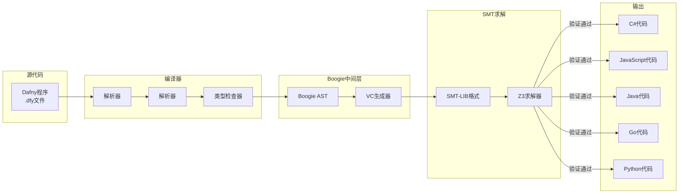
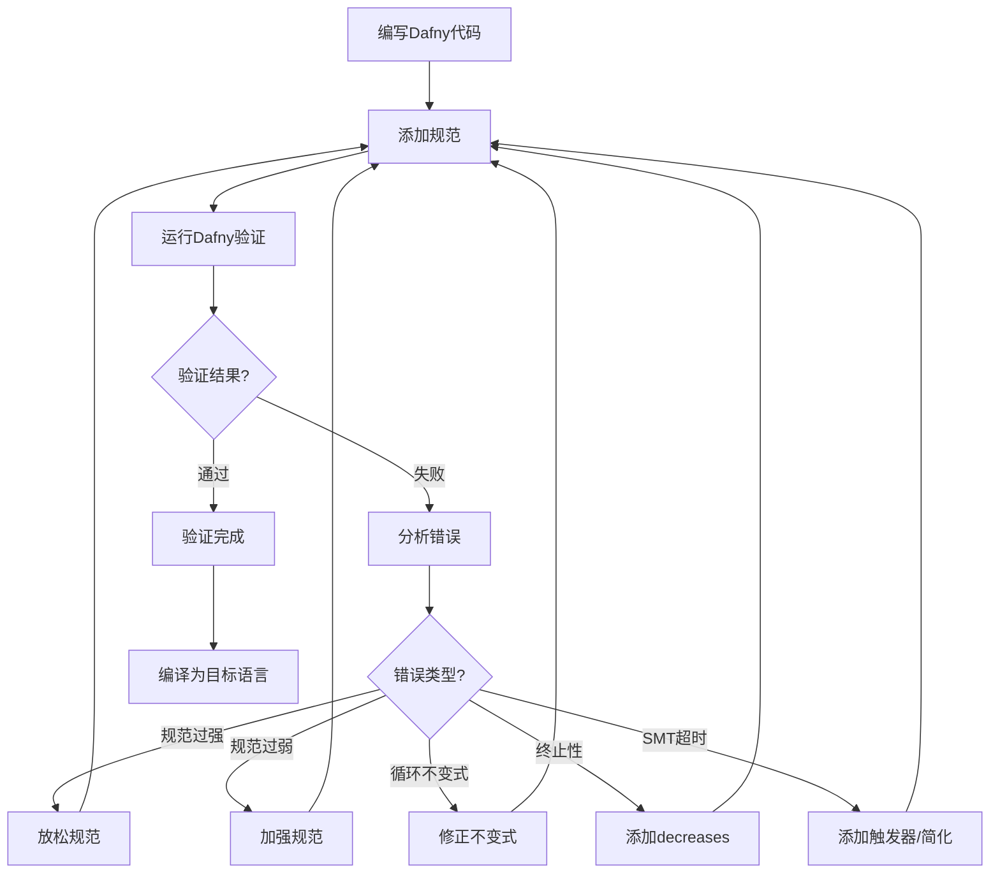
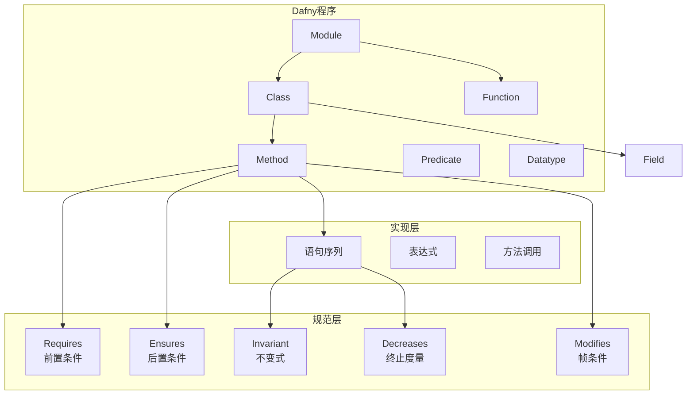
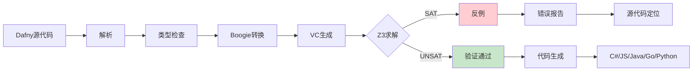
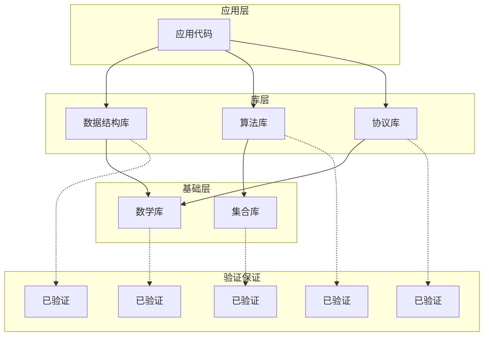

# Dafny验证语言

> **所属单元**: Tools/Academic | **前置依赖**: [霍尔逻辑](../../05-verification/02-techniques/01-hoare-logic.md) | **形式化等级**: L5

## 1. 概念定义 (Definitions)

### 1.1 Dafny概述

**Def-T-06-01** (Dafny定义)。Dafny是支持形式化验证的编程语言和程序验证器：

$$\text{Dafny} = \text{命令式语言} + \text{函数式构造} + \text{规范语言} + \text{SMT后端}$$

**核心特性**：

- **语言特性**: 类、泛型、高阶函数、归纳数据类型
- **规范机制**: 前置条件、后置条件、不变式、终止度量
- **验证后端**: Boogie中间语言 + Z3 SMT求解器
- **自动验证**: 无需交互式证明

**Def-T-06-02** (验证条件生成)。Dafny通过最弱前置条件(WP)生成验证条件：

$$\text{VC} = \text{WP}(\text{Program}, \text{Postcondition}) \Rightarrow \text{Precondition}$$

### 1.2 Dafny语法元素

**Def-T-06-03** (方法规范)。Dafny方法的完整规范：

```dafny
method MethodName<T>(params) returns (results)
    requires Precondition    // 前置条件
    modifies Frame          // 帧条件
    ensures Postcondition   // 后置条件
    decreases Termination   // 终止度量
```

**规范语法**：

| 关键字 | 含义 | 示例 |
|--------|------|------|
| `requires` | 调用前必须满足 | `requires 0 <= n` |
| `ensures` | 返回后必须满足 | `ensures result == n * (n+1) / 2` |
| `modifies` | 可修改的堆位置 | `modifies a, this` |
| `reads` | 可读取的堆位置 | `reads this` |
| `decreases` | 终止度量 | `decreases n` |
| `invariant` | 循环不变式 | `invariant 0 <= i <= n` |

**Def-T-06-04** (谓词语法)。Dafny谓词和函数：

```dafny
// 纯函数
function Factorial(n: nat): nat
{
    if n == 0 then 1 else n * Factorial(n-1)
}

// 谓词（布尔函数）
predicate Sorted(a: array<int>)
    reads a
{
    forall i, j :: 0 <= i < j < a.Length ==> a[i] <= a[j]
}
```

### 1.3 自动验证原理

**Def-T-06-05** (Dafny验证流程)。验证流程：

$$\text{Dafny程序} \xrightarrow{\text{编译}} \text{Boogie} \xrightarrow{\text{VCGen}} \text{SMT-LIB} \xrightarrow{Z3} \text{Valid}/\text{Invalid}$$

**Boogie中间表示**：

- 命令式语言 + 规范注解
- 显式堆模型
- 结构化验证条件

**Def-T-06-06** (SMT编码)。关键编码技术：

- **堆编码**: 使用数组理论编码堆
- **类型编码**: 类型作为标签的判别式
- **量词实例化**: 触发模式指导实例化

## 2. 属性推导 (Properties)

### 2.1 验证复杂度

**Lemma-T-06-01** (验证时间复杂度)。对于程序$P$含$n$个断言：

$$T_{verify}(P) = O(n \cdot T_{SMT}(VC_P))$$

实践中，$T_{SMT}$随谓词复杂度指数增长。

**Lemma-T-06-02** (量词影响)。存在量词对验证的影响：

- **全称量词**: 需要触发模式，否则可能欠实例化
- **存在量词**: 需要Skolem化，增加约束复杂度

### 2.2 模块化验证

**Def-T-06-07** (模块化验证)。Dafny支持模块化验证：

$$\vdash M_1 \land \vdash M_2 \land M_1 \text{满足} M_2 \text{的规范} \Rightarrow \vdash (M_1 \circ M_2)$$

**模块化机制**：

- 抽象模块 (`abstract module`)
- 精炼实现 (`refines`)
- 动态派发 (`{:vcs_split_on_every_assert}`)

## 3. 关系建立 (Relations)

### 3.1 Dafny工具链



### 3.2 验证工具对比

| 特性 | Dafny | Why3 | Frama-C/WP | KeY | Viper |
|------|-------|------|------------|-----|-------|
| 语言 | Dafny | ML家族 | C/Java | Java | Silver |
| 自动化 | 全自动 | 全自动 | 需提示 | 半自动 | 全自动 |
| 交互证明 | 不支持 | 不支持 | 有限 | 完整 | 不支持 |
| 分离逻辑 | 受限 | 受限 | 支持 | 不支持 | 原生 |
| 并发 | 支持 | 有限 | 不支持 | 支持 | 支持 |
| 工业应用 | 微软 | 学术 | 航空/汽车 | 学术 | ETH/工业 |

## 4. 论证过程 (Argumentation)

### 4.1 验证工作流



### 4.2 常见问题与解决

| 问题 | 原因 | 解决方案 |
|------|------|----------|
| 不变式无法证明 | 不变式过弱 | 强化循环不变式 |
| 后置条件失败 | 前置条件不足 | 添加requires |
| SMT超时 | 量词复杂 | 添加`{:induction}`或触发器 |
| 帧条件错误 | modifies不完整 | 列出所有修改位置 |
| 无法证明终止 | 缺少decreases | 添加终止度量 |

## 5. 形式证明 / 工程论证 (Proof / Engineering Argument)

### 5.1 Dafny可靠性

**Thm-T-06-01** (Dafny可靠性)。若Dafny验证通过，程序满足规范：

$$(\text{Dafny} \vdash P : \{\phi\} C \{\psi\}) \Rightarrow \models \{\phi\} C \{\psi\}$$

**依赖假设**：

1. Boogie VC生成正确
2. Z3求解正确
3. 运行时代码生成正确

### 5.2 终止性保证

**Thm-T-06-02** (Dafny终止性)。带`decreases`子句的程序必终止：

$$(\forall loops. \exists d. \text{decreases}(d) \land WF(d)) \Rightarrow P \text{ terminates}$$

## 6. 实例验证 (Examples)

### 6.1 Dafny安装配置

**安装方式**（多平台）：

```bash
# .NET Tool安装（推荐）
dotnet tool install --global dafny

# 验证安装
dafny --version

# VS Code扩展
# 安装 "Dafny" 扩展 (Microsoft)
```

**基本使用**：

```bash
# 验证文件
dafny verify program.dfy

# 编译为C#
dafny build program.dfy --target:cs

# 编译为JavaScript
dafny build program.dfy --target:js

# 运行
dafny run program.dfy
```

### 6.2 基础规范示例：二分查找

```dafny
method BinarySearch(a: array<int>, key: int) returns (index: int)
    requires forall i, j :: 0 <= i < j < a.Length ==> a[i] <= a[j]  // 已排序
    ensures 0 <= index ==> index < a.Length && a[index] == key       // 找到
    ensures index < 0 ==> forall i :: 0 <= i < a.Length ==> a[i] != key  // 未找到
{
    var lo := 0;
    var hi := a.Length;

    while lo < hi
        invariant 0 <= lo <= hi <= a.Length
        invariant forall i :: 0 <= i < lo ==> a[i] < key
        invariant forall i :: hi <= i < a.Length ==> a[i] > key
    {
        var mid := lo + (hi - lo) / 2;
        if a[mid] < key {
            lo := mid + 1;
        } else if a[mid] > key {
            hi := mid;
        } else {
            return mid;
        }
    }

    return -1;
}
```

### 6.3 数据结构验证：链表

```dafny
class Node<T> {
    var data: T
    var next: Node?<T>

    constructor (d: T)
        ensures data == d && next == null
    {
        data := d;
        next := null;
    }
}

class LinkedList<T> {
    var head: Node?<T>
    ghost var Contents: seq<T>
    ghost var Repr: set<object>

    predicate Valid()
        reads this, Repr
    {
        this in Repr &&
        (head != null ==> head in Repr) &&
        Contents == SeqFromNode(head)
    }

    ghost function SeqFromNode(n: Node?<T>): seq<T>
        reads if n != null then {n} + set x: object | x in n.next.Repr? else {}
        decreases if n != null then n.Repr? else {}
    {
        if n == null then []
        else [n.data] + SeqFromNode(n.next)
    }

    constructor()
        ensures Valid() && Contents == []
    {
        head := null;
        Contents := [];
        Repr := {this};
    }

    method Prepend(d: T) returns (newNode: Node<T>)
        requires Valid()
        modifies Repr
        ensures Valid()
        ensures Contents == [d] + old(Contents)
    {
        newNode := new Node(d);
        newNode.next := head;
        head := newNode;
        Contents := [d] + Contents;
        Repr := Repr + {newNode};
    }

    method Find(key: T) returns (found: bool, node: Node?<T>)
        requires Valid()
        ensures Valid()
        ensures found ==> node != null && node in Repr && node.data == key
        ensures !found ==> forall n :: n in Repr && n is Node<T> ==> (n as Node<T>).data != key
    {
        node := head;
        while node != null
            invariant Valid()
            invariant node != null ==> node in Repr
        {
            if node.data == key {
                found := true;
                return;
            }
            node := node.next;
        }
        found := false;
    }
}
```

### 6.4 并发验证：线性化

```dafny
trait ConcurrentStack<T> {
    ghost var Contents: seq<T>

    method Push(x: T)
        modifies this
        ensures Contents == [x] + old(Contents)

    method Pop() returns (x: T)
        requires |Contents| > 0
        modifies this
        ensures Contents == old(Contents)[1..]
        ensures x == old(Contents)[0]
}

class LockFreeStack<T> extends ConcurrentStack<T> {
    var top: Node?<T>

    // CAS操作的Dafny抽象
    method CAS(oldTop: Node?<T>, newTop: Node?<T>) returns (success: bool)
        modifies this
        ensures success ==> top == newTop
        ensures !success ==> top != oldTop

    method Push(x: T)
        modifies this
        ensures Contents == [x] + old(Contents)
    {
        var node := new Node(x);
        var done := false;

        while !done
            invariant done ==> Contents == [x] + old(Contents)
            decreases *  // 可能不终止（ABA问题）
        {
            var t := top;
            node.next := t;
            done := CAS(t, node);
        }
    }
}
```

### 6.5 自动验证完整流程

**文件**: `sum_array.dfy`

```dafny
// 计算数组元素和
method SumArray(a: array<int>) returns (sum: int)
    requires a != null
    ensures sum == Sum(a, 0, a.Length)
{
    sum := 0;
    var i := 0;

    while i < a.Length
        invariant 0 <= i <= a.Length
        invariant sum == Sum(a, 0, i)
    {
        sum := sum + a[i];
        i := i + 1;
    }
}

// 辅助函数：计算数组区间和
function Sum(a: array<int>, lo: int, hi: int): int
    requires a != null
    requires 0 <= lo <= hi <= a.Length
    reads a
{
    if lo == hi then 0 else a[lo] + Sum(a, lo + 1, hi)
}

// 测试
method Main() {
    var arr := new int[3];
    arr[0] := 1;
    arr[1] := 2;
    arr[2] := 3;

    var s := SumArray(arr);
    assert s == 6;
    print "Sum = ", s, "\n";
}
```

**验证执行**：

```bash
$ dafny verify sum_array.dfy

Dafny program verifier finished with 3 verified, 0 errors
```

## 7. 可视化 (Visualizations)

### 7.1 Dafny程序结构



### 7.2 验证流程



### 7.3 模块化验证层次



## 8. 引用参考 (References)
