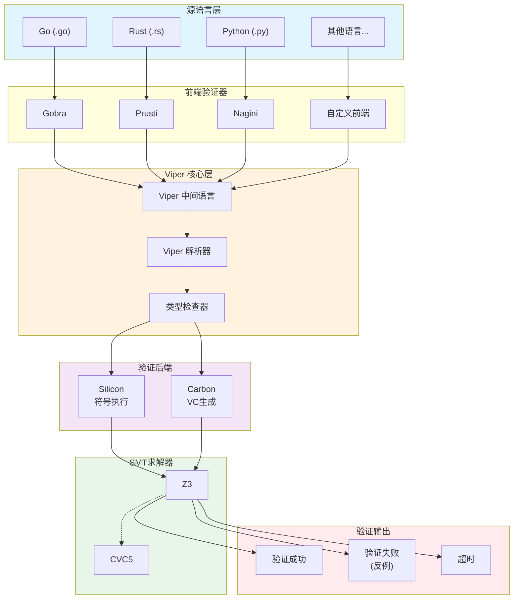
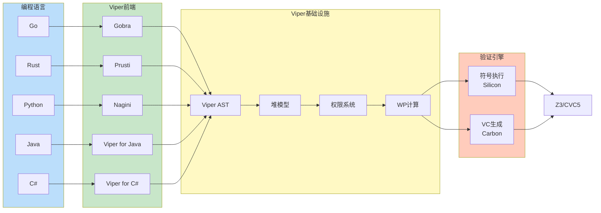
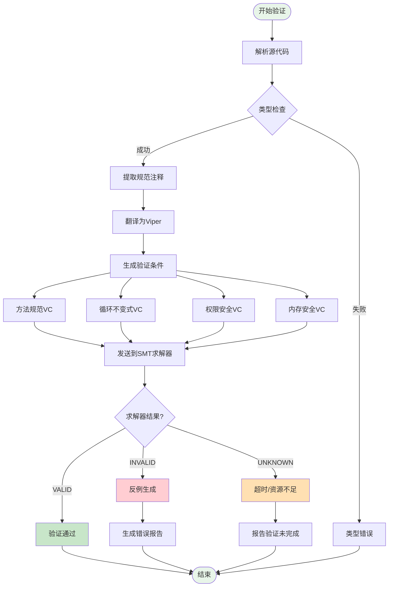
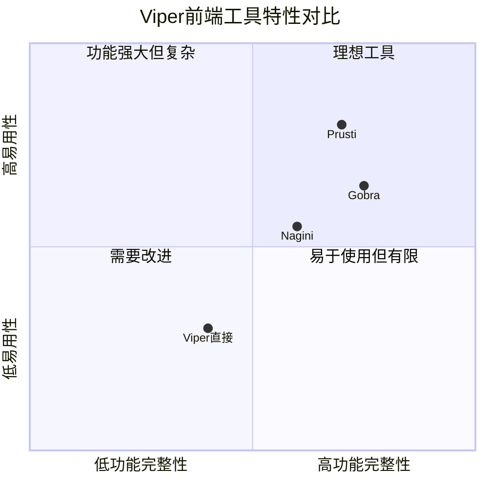
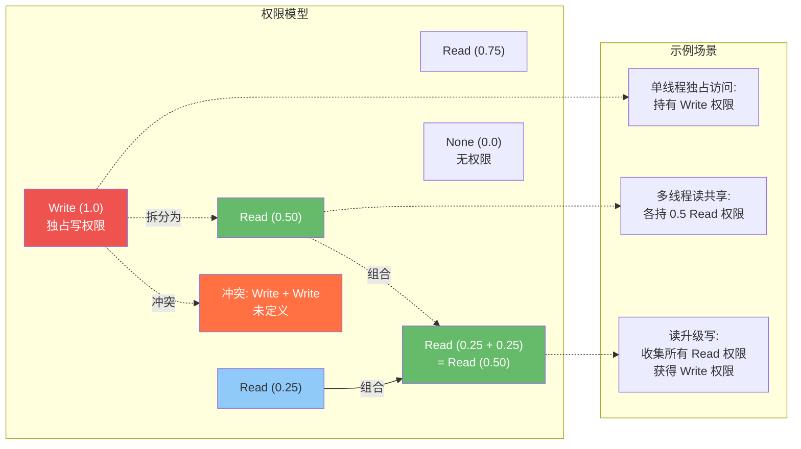

# Viper 验证生态系统

> 所属阶段: formal-methods | 前置依赖: [05-iris-separation-logic.md](05-iris-separation-logic.md) | 形式化等级: L6

## 1. 概念定义 (Definitions)

### 1.1 Viper 验证基础设施概述

**Viper** 是一个模块化的、可扩展的程序验证基础设施，由 ETH Zurich 的编程方法学小组 (Programming Methodology Group) 开发。它作为中间验证语言 (Intermediate Verification Language, IVL)，连接高级编程语言前端与底层自动化推理后端。

> **定义 1.1** (Viper 验证基础设施): `Def-FM-06-01`
>
> Viper 是一个基于分离逻辑和权限逻辑的**中间验证语言 (IVL)**，旨在为多种源语言提供统一、可靠的程序验证基础设施。其核心组件包括：
>
> 1. **Viper 中间语言**: 表达验证所需的核心构造（权限、堆操作、规范）
> 2. **验证器后端**: 基于 weakest precondition 的自动化验证引擎
> 3. **前端编译器**: 将高级语言（Go、Rust、Python）翻译为 Viper
> 4. **SMT 求解器接口**: 与 Z3、CVC5 等求解器集成进行自动化证明

Viper 的设计哲学源于对**模块化验证**的追求：

```
┌─────────────────────────────────────────────────────────────┐
│                    Viper 基础设施架构                        │
├─────────────────────────────────────────────────────────────┤
│  源语言层  │  Go        │  Rust      │  Python    │  ...   │
│            │ (Gobra)    │ (Prusti)   │ (Nagini)   │        │
├────────────┼────────────┼────────────┼────────────┼────────┤
│  前端层    │    语言特定抽象和类型系统映射                       │
├─────────────────────────────────────────────────────────────┤
│  IVL层     │              Viper 中间语言                      │
│            │    权限、堆、规范、控制流的统一表达                 │
├─────────────────────────────────────────────────────────────┤
│  后端层    │    验证条件生成 → SMT求解器 (Z3/CVC5)            │
├─────────────────────────────────────────────────────────────┤
│  结果层    │    验证报告: 成功 / 反例 / 超时 / 失败           │
└─────────────────────────────────────────────────────────────┘
```

### 1.2 中间验证语言 (IVL) 设计理念

中间验证语言在程序验证工具链中扮演关键角色，它解决了以下核心挑战：

**挑战 1: 语言和验证技术的正交分离**

> **定义 1.2** (中间验证语言): `Def-FM-06-02`
>
> 中间验证语言 (IVL) 是一种专门设计的、表达能力足够强的形式化语言，用于：
>
> - 捕获源语言的**语义本质**（内存模型、控制流、副作用）
> - 表达**验证相关构造**（规范、不变式、权限）
> - 支持**模块化推理**（函数摘要、抽象谓词）
> - 便于**自动化验证**（可判定的验证条件生成）

IVL 的核心设计原则：

| 原则 | 说明 | Viper 实现 |
|------|------|-----------|
| **最小充分性** | 只包含验证必需的核心构造 | 权限、堆访问、方法/函数/谓词 |
| **语义透明性** | 每个构造都有清晰的形式语义 | 基于操作语义和分离逻辑 |
| **可组合性** | 支持模块化验证和抽象 | 谓词、函数摘要、抽象字段 |
| **可自动化** | 生成可判定的验证条件 | 支持 SMT 求解器有效处理 |

### 1.3 权限逻辑基础

Viper 的核心创新在于将**权限逻辑 (Permission Logic)** 内建于语言设计中。权限逻辑是分离逻辑的一个变体，专门用于跟踪对资源（特别是堆内存）的访问权限。

> **定义 1.3** (权限): `Def-FM-06-03`
>
> 在 Viper 中，**权限 (Permission)** 表示对特定内存位置的访问权：
>
> **π ∈ Permission ::= write | read | ε**
>
> 其中：
>
> - `write`: 独占写权限（隐含读权限）
> - `read`: 共享读权限（可与其他 `read` 共存）
> - `ε`: 零权限（无任何访问权）

**关键性质**: 权限构成一个**偏序集** (Permission, ≤)，其中：

**ε ≤ read ≤ write**

权限的组合操作（对应分离逻辑的分离合取）定义为：

> **定义 1.4** (权限组合): `Def-FM-06-04`
>
> 权限组合 ⊕: Permission × Permission ⇀ Permission 定义为：
>
> **p₁ ⊕ p₂ =**
>
> - **p₁** if p₁ = p₂ = read
> - **write** if (p₁, p₂) ∈ {(write, ε), (ε, write)}
> - **read** if (p₁, p₂) ∈ {(read, ε), (ε, read)}
> - **ε** if p₁ = p₂ = ε
> - **undefined** otherwise (冲突)

### 1.4 分离逻辑在 Viper 中的实现

Viper 实现了**分数权限分离逻辑 (Fractional Permission Separation Logic)**，这是对传统分离逻辑的扩展，允许更细粒度的权限控制。

> **定义 1.5** (分数权限): `Def-FM-06-05`
>
> **分数权限** 是 Permission 的精细化，用 (0, 1] 之间的实数表示：
>
> **FracPerm = { p ∈ ℝ | 0 < p ≤ 1 }**
>
> 其中：
>
> - p = 1 对应 `write` 权限（独占访问）
> - 0 < p < 1 对应 `read` 权限的部分份额
> - 当多个读权限组合时，其分数之和必须 ≤ 1

**分离逻辑的核心规则在 Viper 中的映射**：

| 分离逻辑规则 | Viper 语法 | 含义 |
|-------------|-----------|------|
| P * Q | `P && Q` | 分离合取：P 和 Q 持有不相交的资源 |
| e ↦ v | `acc(e.f)` | 字段访问权限：对字段 `f` 的写权限 |
| e ↦ v | `acc(e.f, p)` | 带分数的权限：对字段 `f` 的 p 份额权限 |
| ∃x.P | `exists x :: P` | 存在量词 |
| ∀x.P | `forall x :: P` | 全称量词 |


---

## 2. Viper 语言详解

Viper 语言是验证基础设施的核心，提供了表达程序及其规范的丰富构造。

### 2.1 语法和类型系统

Viper 的类型系统围绕**验证需求**设计，支持表达程序状态的各种属性。

**基本类型**：

| 类型 | 语法 | 说明 | 示例 |
|------|------|------|------|
| 布尔型 | `Bool` | 逻辑真值 | `true`, `false` |
| 整型 | `Int` | 数学整数（无界） | `42`, `-7` |
| 引用 | `Ref` | 堆对象引用 | `x`, `this` |
| 权限 | `Perm` | 权限值 | `write`, `none`, `1/2` |
| 序列 | `Seq[T]` | 不可变序列 | `Seq(1, 2, 3)` |
| 集合 | `Set[T]` | 数学集合 | `Set(1, 2, 3)` |
| 多重集 | `Multiset[T]` | 带重复计数 | `Multiset(1, 1, 2)` |
| 映射 | `Map[K, V]` | 有限映射 | `Map(1 := "a")` |

**程序构造**：

```viper
// 字段声明
field val: Int
field next: Ref

// 方法声明
method methodName(parameters) returns (returns)
  requires preconditions    // 前置条件
  ensures postconditions    // 后置条件
{
  // 方法体
}

// 函数声明（纯函数，无副作用）
function functionName(parameters): ReturnType
  requires preconditions
  ensures postconditions

// 谓词声明（抽象断言）
predicate predicateName(parameters) {
  // 谓词体：断言表达式
}
```

### 2.2 权限表达式 (acc)

`acc` (accessibility) 是 Viper 最核心的表达式，用于声明对堆位置的访问权限。

> **定义 2.1** (访问权限表达式): `Def-FM-06-06`
>
> 访问权限表达式 `acc(e.f, p)` 表示：
>
> - 表达式 `e` 求值为有效引用（非 null）
> - 当前验证状态持有对字段 `e.f` 的 p 份额权限
> - 当 p = write（或省略时），获得完整写权限

**权限表达式的变体**：

```viper
// 完整写权限
acc(x.val)           // 等价于 acc(x.val, write)

// 分数权限
acc(x.val, 1/2)      // 一半权限
acc(x.val, p)        // 变量 p 表示的权限（p: Perm）

// 权限条件表达式
acc(x.val, write) ==> x.val > 0   // 权限蕴含

// 多字段权限
acc(x.val) && acc(x.next)         // 分离合取
```

### 2.3 谓词和函数

**谓词 (Predicate)** 提供了抽象的规范机制，允许将复杂断言封装为可重用的单元。

> **定义 2.2** (谓词): `Def-FM-06-07`
>
> 谓词是一个命名的断言抽象，可递归定义，用于表达数据结构的不变式：
>
> ```viper
> predicate valid_list(head: Ref) {
>   head == null ? true :
>     acc(head.val) && acc(head.next) && valid_list(head.next)
> }
> ```

**谓词的展开与折叠**：

```viper
// 展开谓词（获得其定义中的权限）
unfold valid_list(node)

// 折叠谓词（将权限打包回谓词）
fold valid_list(node)

// 带条件的展开/折叠
unfold acc(valid_list(node), 1/2)
fold acc(valid_list(node), 1/2)
```

**函数 (Function)** 是纯计算，无副作用，可以在规范中使用。

```viper
// 纯函数定义
function length(head: Ref): Int
  requires valid_list(head)
  ensures result >= 0
{
  head == null ? 0 : 1 + length(head.next)
}

// 抽象函数（无定义，仅声明）
function capacity(): Int
  ensures result > 0
```

### 2.4 前置/后置条件

前置条件和后置条件是**契约式编程**的核心，Viper 提供了丰富的表达力。

```viper
method insert(head: Ref, value: Int) returns (new_head: Ref)
  // 前置条件：输入列表有效
  requires valid_list(head)
  // 前置条件：对 value 的读权限
  requires acc(value)

  // 后置条件：返回列表有效
  ensures valid_list(new_head)
  // 后置条件：长度增加 1
  ensures length(new_head) == length(head) + 1
  // 后置条件：包含插入的值
  ensures contains(new_head, value)
  // 后置条件：保留原有元素
  ensures forall elem: Int :: contains(head, elem) ==> contains(new_head, elem)
{
  // 方法实现
}
```

**后置条件中的特殊变量**：

| 变量 | 含义 | 用途 |
|------|------|------|
| `result` / `result0`, `result1`... | 返回值 | 引用返回值 |
| `old(e)` | 方法执行前 e 的值 | 表达值的变化 |
| `lhs@Label` | 标签处左值的状态 | 中间断言 |

```viper
method increment(x: Ref)
  requires acc(x.val)
  ensures acc(x.val)
  ensures x.val == old(x.val) + 1    // 值增加 1
{
  x.val := x.val + 1
}
```

### 2.5 循环不变式

循环不变式是验证循环正确性的关键，必须在循环的每次迭代前后保持为真。

> **定义 2.3** (循环不变式): `Def-FM-06-08`
>
> 循环不变式 I 是一个断言，满足：
>
> 1. **初始化**: 循环开始前 I 成立
> 2. **保持**: 若 I 在某次迭代前成立，且循环条件为真，则执行循环体后 I 仍成立
> 3. **终止**: 当循环条件为假时，I 蕴含循环后的后置条件

```viper
method sum_array(arr: Seq[Int], n: Int) returns (sum: Int)
  requires n >= 0 && n <= |arr|
  ensures sum == sumSeq(arr, 0, n)
{
  sum := 0
  var i: Int := 0

  while (i < n)
    invariant i >= 0 && i <= n
    invariant sum == sumSeq(arr, 0, i)    // 累积和正确
  {
    sum := sum + arr[i]
    i := i + 1
  }
}

// 辅助函数定义
function sumSeq(s: Seq[Int], lo: Int, hi: Int): Int
  requires 0 <= lo && lo <= hi && hi <= |s|
{
  lo == hi ? 0 : s[lo] + sumSeq(s, lo + 1, hi)
}
```

**循环中的权限处理**：

```viper
method traverse_list(head: Ref)
  requires valid_list(head)
{
  var current: Ref := head

  while (current != null)
    invariant valid_list(current)
  {
    unfold valid_list(current)
    // 处理 current
    process(current.val)
    current := current.next
  }
}
```


---

## 3. 前端验证器

Viper 的基础设施被多个针对特定编程语言的前端验证器所使用，每个前端都针对源语言的特性进行了定制。

### 3.1 Gobra: Go 语言验证器

**Gobra** 是 ETH Zurich 开发的 Go 语言程序验证器，基于 Viper 基础设施。

> **定义 3.1** (Gobra): `Def-FM-06-09`
>
> Gobra 是一个针对 Go 语言的模块化程序验证器，支持：
>
> - Go 的类型系统和内存模型
> - 指针和结构体验证
> - 通道和 goroutine 的并发验证
> - 接口和类型断言的形式化规范

**Gobra 的规范注释语法**：

```go
// 前置条件
//@ requires 0 <= n
// 后置条件
//@ ensures result == n * (n + 1) / 2
func sum(n int) (result int) {
    result = 0
    var i = 0

    //@ invariant 0 <= i && i <= n
    //@ invariant result == i * (i + 1) / 2
    for i < n {
        i = i + 1
        result = result + i
    }
    return result
}
```

**Gobra 对 Go 特性的支持**：

| Go 特性 | Gobra 支持 | 验证挑战 |
|---------|-----------|---------|
| 指针 | 完整支持 | 别名分析、分离逻辑 |
| 切片 | 支持 | 长度/容量不变式 |
| 映射 | 部分支持 | 键存在性、迭代顺序 |
| 接口 | 支持 | 动态分派验证 |
| 通道 | 支持 | 会话类型、死锁检测 |
| Goroutine | 支持 | 并发权限分离 |

### 3.2 Prusti: Rust 语言验证器

**Prusti** 是 Viper 生态中针对 Rust 语言的验证器，利用 Rust 的所有权系统简化验证。

> **定义 3.2** (Prusti): `Def-FM-06-10`
>
> Prusti 是 Rust 语言的静态验证器，特点包括：
>
> - 利用 Rust 所有权系统减少权限标注
> - 支持泛型和生命周期验证
> - 验证 unsafe Rust 代码的内存安全
> - 与 Rust 生态系统深度集成 (cargo-prusti)

**Prusti 规范示例**：

```rust
use prusti_contracts::*;

// 前置/后置条件
#[requires(0 <= n)]
#[ensures(result == n * (n + 1) / 2)]
pub fn sum(n: i32) -> i32 {
    let mut result = 0;
    let mut i = 0;

    #[invariant(0 <= i && i <= n)]
    #[invariant(result == i * (i + 1) / 2)]
    while i < n {
        i += 1;
        result += i;
    }

    result
}

// 纯函数
#[pure]
#[requires(0 <= index && index < arr.len())]
pub fn get(arr: &[i32], index: usize) -> i32 {
    arr[index]
}
```

**Rust 所有权与 Viper 权限的对应**：

| Rust 概念 | Viper 映射 | 说明 |
|----------|-----------|------|
| `T` (所有权) | `acc(x.f, write)` | 独占写权限 |
| `&T` (共享引用) | `acc(x.f, 1/n)` | 读权限（多引用共享） |
| `&mut T` (可变引用) | `acc(x.f, write)` | 独占写权限（别名限制） |
| `Box<T>` | `acc(x.f, write)` | 堆分配的独占所有权 |
| `Rc<T>` | `acc(x.f, p)` | 引用计数共享 |

### 3.3 Nagini: Python 语言验证器

**Nagini** 是 Viper 生态中针对 Python 的验证器，处理 Python 的动态类型和复杂语义。

> **定义 3.3** (Nagini): `Def-FM-06-11`
>
> Nagini 是 Python 3 的静态验证器，特点：
>
> - 通过类型注解支持静态类型检查
> - 验证 Python 的面向对象特性（类、继承、多态）
> - 支持列表、字典等内置数据结构
> - 处理 Python 的异常和动态特性

**Nagini 规范示例**：

```python
from nagini_contracts.contracts import *

class ListNode:
    def __init__(self, val: int) -> None:
        self.val = val
        self.next = None  # type: Optional[ListNode]
        Ensures(Acc(self.val) and Acc(self.next))
        Ensures(self.val == val and self.next is None)

@Predicate
def valid_list(node: Optional[ListNode]) -> bool:
    return (node is None) or (
        Acc(node.val) and Acc(node.next) and
        valid_list(node.next)
    )

@Requires(valid_list(head))
@Ensures(valid_list(head))
@Ensures(Result() == list_length(head))
def list_length(head: Optional[ListNode]) -> int:
    if head is None:
        return 0
    else:
        Unfold(valid_list(head))
        rest = list_length(head.next)
        Fold(valid_list(head))
        return 1 + rest
```

### 3.4 各前端的特点和对比

| 特性 | Gobra (Go) | Prusti (Rust) | Nagini (Python) |
|------|-----------|---------------|-----------------|
| **开发机构** | ETH Zurich | ETH Zurich (前) | ETH Zurich |
| **活跃状态** | 活跃 | 维护模式 | 活跃 |
| **核心依赖** | Go 类型系统 | Rust 所有权 | Python 类型注解 |
| **并发支持** | Goroutine/Channel | 基于所有权 | 有限支持 |
| **内存模型** | Go 内存模型 | Rust 所有权系统 | Python 对象模型 |
| **规范语法** | `//@` 注释 | `#[attribute]` | 装饰器 |
| **IDE 支持** | VS Code | VS Code/Rust Analyzer | VS Code |
| **主要应用** | 系统软件验证 | 系统编程验证 | 算法/应用验证 |
| **学习曲线** | 中等 | 较低（Rust 所有权）| 较高 |

**前端架构对比图**：

```
┌────────────────────────────────────────────────────────────────┐
│                        前端对比架构                            │
├────────────────────────────────────────────────────────────────┤
│                                                                │
│   ┌─────────────┐    ┌─────────────┐    ┌─────────────┐       │
│   │   Go 源码   │    │  Rust 源码  │    │ Python 源码 │       │
│   │  (.go)      │    │   (.rs)     │    │   (.py)     │       │
│   └──────┬──────┘    └──────┬──────┘    └──────┬──────┘       │
│          │                  │                  │              │
│          ▼                  ▼                  ▼              │
│   ┌─────────────┐    ┌─────────────┐    ┌─────────────┐       │
│   │   Gobra     │    │   Prusti    │    │   Nagini    │       │
│   │  解析器     │    │  解析器     │    │  解析器     │       │
│   │  类型检查   │    │  MIR 提取   │    │  类型推断   │       │
│   │  规范提取   │    │  规范提取   │    │  规范提取   │       │
│   └──────┬──────┘    └──────┬──────┘    └──────┬──────┘       │
│          │                  │                  │              │
│          └──────────────────┼──────────────────┘              │
│                             │                                 │
│                             ▼                                 │
│                    ┌─────────────────┐                        │
│                    │  Viper 中间语言 │                        │
│                    │     (.viper)    │                        │
│                    └────────┬────────┘                        │
│                             │                                 │
│                             ▼                                 │
│                    ┌─────────────────┐                        │
│                    │  Viper 验证器   │                        │
│                    │  (Silicon/Carbon)│                       │
│                    └────────┬────────┘                        │
│                             │                                 │
│                             ▼                                 │
│                    ┌─────────────────┐                        │
│                    │   SMT 求解器    │                        │
│                    │   (Z3/CVC5)     │                        │
│                    └─────────────────┘                        │
│                                                                │
└────────────────────────────────────────────────────────────────┘
```


---

## 4. 验证技术

### 4.1 Weakest Precondition 计算

**最弱前置条件 (Weakest Precondition, WP)** 是 Viper 验证的理论基础。

> **定义 4.1** (最弱前置条件): `Def-FM-06-12`
>
> 对于程序语句 S 和后置条件 Q，最弱前置条件 wp(S, Q) 是满足以下条件的最弱断言 P：
>
> **∀σ. σ ⊨ P ⇒ [[S]]σ ⊨ Q**
>
> 其中 [[S]]σ 表示在状态 σ 上执行 S 后的状态。

**Viper 中的 WP 计算规则**：

```
wp(skip, Q)                          = Q
wp(x := e, Q)                        = Q[e/x]
wp(S1; S2, Q)                        = wp(S1, wp(S2, Q))
wp(if b then S1 else S2, Q)          = (b ==> wp(S1, Q)) && (!b ==> wp(S2, Q))
wp(while b inv I do S, Q)            = I && (I ==> (b ==> wp(S, I) && !b ==> Q))
wp(assert A, Q)                      = A && Q
wp(assume A, Q)                      = A ==> Q
wp(fold acc(P, p), Q)                = P 的展开 ==> Q[减去 P 的权限]
wp(unfold acc(P, p), Q)              = P 的权限添加 && Q[加上 P 的展开]
```

### 4.2 符号执行

**Silicon** 是 Viper 的符号执行后端，通过符号状态空间探索进行验证。

> **定义 4.2** (符号执行): `Def-FM-06-13`
>
> 符号执行是一种程序分析技术，使用**符号值**而非具体值作为输入，构建表示程序所有可能执行路径的**符号执行树**。

**Silicon 的符号执行特点**：

1. **堆的符号表示**: 使用符号堆 Π | Σ 分离纯约束 (Π) 和堆约束 (Σ)

2. **路径条件累积**: 条件分支产生路径条件 pc，用于 SMT 求解

3. **惰性展开**: 谓词按需展开，避免状态空间爆炸

```
符号执行示例:

初始状态: σ₀ = { heap: ∅, store: {}, pc: true }

执行: x := new(); x.f := 5

状态: σ₁ = {
  heap: { o₁.f ↦ 5 },
  store: { x ↦ o₁ },
  pc: true
}

执行: if (x.f > 0) then y := 1 else y := 0

分支1 (pc: 5 > 0 = true):  σ₂ = { ..., store: { ..., y ↦ 1 } }
分支2 (pc: 5 > 0 = false): 不可行路径 (被剪枝)
```

### 4.3 验证条件生成

**Carbon** 是 Viper 的验证条件生成后端，将程序翻译为 Boogie 中间语言。

> **定义 4.3** (验证条件): `Def-FM-06-14`
>
> **验证条件 (Verification Condition, VC)** 是一个逻辑公式，其有效性等价于程序满足其规范。

**VC 生成流程**：

```
┌─────────────────────────────────────────────────────────────┐
│                    验证条件生成流程                          │
├─────────────────────────────────────────────────────────────┤
│                                                             │
│   Viper 程序                                                │
│      │                                                      │
│      ▼                                                      │
│   ┌──────────────────────────────────────┐                 │
│   │  1. 语义编码                          │                 │
│   │     - 堆编码为映射                     │                 │
│   │     - 权限编码为分数                   │                 │
│   │     - 谓词编码为函数                   │                 │
│   └──────────────┬───────────────────────┘                 │
│                  │                                          │
│                  ▼                                          │
│   ┌──────────────────────────────────────┐                 │
│   │  2. Boogie IVL 生成                   │                 │
│   │     - 过程体翻译为命令式代码           │                 │
│   │     - 规范翻译为断言                   │                 │
│   │     - WP 计算显式化                    │                 │
│   └──────────────┬───────────────────────┘                 │
│                  │                                          │
│                  ▼                                          │
│   ┌──────────────────────────────────────┐                 │
│   │  3. Boogie 验证器                     │                 │
│   │     - 生成最终 VC 公式                 │                 │
│   │     - 模块化分解                       │                 │
│   └──────────────┬───────────────────────┘                 │
│                  │                                          │
│                  ▼                                          │
│   ┌──────────────────────────────────────┐                 │
│   │  4. SMT 求解器 (Z3)                   │                 │
│   │     - 证明 VC 有效                     │                 │
│   │     - 或提供反例模型                   │                 │
│   └──────────────────────────────────────┘                 │
│                                                             │
│   结果: 验证成功 / 验证失败(反例) / 超时 / 资源耗尽          │
│                                                             │
└─────────────────────────────────────────────────────────────┘
```

### 4.4 SMT 求解器集成

Viper 依赖 SMT (Satisfiability Modulo Theories) 求解器进行自动化推理。

**支持的 SMT 求解器**：

| 求解器 | 支持状态 | 特点 |
|--------|---------|------|
| **Z3** | 主要支持 | Microsoft 开发，支持丰富理论，性能优秀 |
| **CVC5** | 实验支持 | 支持更多理论组合，某些场景更稳定 |

**编码到 SMT 的关键映射**：

```
Viper 构造          SMT-LIB 编码
─────────────────────────────────────────
Int                 Int (数学整数)
Bool                Bool
Ref                 Int (对象标识符)
Perm                Real (实数，0 < p ≤ 1)
Seq[T]              未解释函数 + 长度
Set[T]              数组理论
acc(e.f, p)         heap_select(heap, e, f) 的权限约束
```

---

## 5. 形式证明

### 5.1 定理: Viper 逻辑的可靠性

> **定理 5.1** (Viper 逻辑可靠性): `Thm-FM-06-01`
>
> Viper 验证系统对于其操作语义是**可靠的 (Sound)**：
>
> **⊢_Viper {P} S {Q}  ⇒  ⊨ {P} S {Q}**
>
> 即：若 Viper 证明程序 S 在前置条件 P 下满足后置条件 Q，则在标准操作语义下该霍尔三元组确实成立。

**证明概要**：

1. **基础**: Viper 的核心逻辑基于已证明可靠的分离逻辑变体

2. **WP 计算正确性**:
   - 通过结构归纳法证明每条语句的 WP 规则保持语义等价性
   - 对于堆操作，使用分离逻辑框架保证局部性

3. **权限系统正确性**:
   - 分数权限的组合规则保证了"无数据竞争"
   - 通过权限代数 (Perm, ⊕, ε) 的形式化保证一致性

4. **SMT 编码正确性**:
   - Boogie 到 SMT 的编码保持语义
   - Z3 对理论片段的判定过程是可靠的

### 5.2 定理: 权限组合的正确性

> **定理 5.2** (权限组合正确性): `Thm-FM-06-02`
>
> Viper 的分数权限组合操作 ⊕ 满足以下代数性质，保证权限管理的正确性：
>
> **交换律**: p₁ ⊕ p₂ = p₂ ⊕ p₁
>
> **结合律**: (p₁ ⊕ p₂) ⊕ p₃ = p₁ ⊕ (p₂ ⊕ p₃)
>
> **单位元**: ε ⊕ p = p
>
> **互斥性**: write ⊕ write 未定义（防止写-写冲突）
>
> **单调性**: p₁ ⊕ p₂ = p ⇒ p₁ ≤ p ∧ p₂ ≤ p

**证明**：

**交换律证明**：
通过穷举 p₁, p₂ 的所有组合情况：

- 若 p₁ = p₂ = read: read ⊕ read = read = read ⊕ read ✓
- 若 (p₁, p₂) = (write, ε): write ⊕ ε = write = ε ⊕ write ✓
- 其他情况类似可证

**结合律证明**：
需证明对所有 p₁, p₂, p₃ ∈ Perm：
LHS = (p₁ ⊕ p₂) ⊕ p₃ = p₁ ⊕ (p₂ ⊕ p₃) = RHS

考虑分数权限表示 p ∈ (0, 1]：
p₁ ⊕ p₂ = { p₁ + p₂  if p₁ + p₂ ≤ 1
          { undefined otherwise

因此：
LHS = { p₁ + p₂ + p₃  if p₁ + p₂ ≤ 1 ∧ p₁ + p₂ + p₃ ≤ 1
    = { undefined      otherwise

RHS = { p₁ + p₂ + p₃  if p₂ + p₃ ≤ 1 ∧ p₁ + p₂ + p₃ ≤ 1
    = { undefined      otherwise

由于加法的结合性，LHS = RHS。∎

### 5.3 定理: 模块化验证的保证

> **定理 5.3** (模块化验证保证): `Thm-FM-06-03`
>
> 对于使用函数摘要和谓词抽象的模块化验证，若满足以下条件：
>
> 1. 每个函数的规范是其最弱前置条件和最强后置条件的近似
> 2. 谓词定义良基（无无限展开）
> 3. 所有调用使用位置满足被调函数的前置条件
>
> 则模块化验证的结果等价于整体程序验证：
>
> **(∀f. verify(f, spec(f))) ⇒ verify(whole_program)**

**证明概要**：

1. **函数摘要的正确性**：
   - 函数 f 的前置条件 Pre_f 和后置条件 Post_f 形成契约
   - 通过霍尔逻辑的 consequence 规则，允许在调用处使用摘要

2. **谓词抽象的可靠性**：
   - 谓词 P 作为抽象断言，其定义提供具体展开
   - fold/unfold 操作保持等价性：P ⊣⊢ body(P)

3. **组合性** (Compositionality)：
   - 分离逻辑的框架规则保证局部推理可组合
   - 若 {P₁} S₁ {Q₁} 和 {P₂} S₂ {Q₂}，则
   - {P₁ *P₂} S₁ ∥ S₂ {Q₁* Q₂}（对于无数据竞争程序）


---

## 6. 实例验证

### 6.1 链表操作验证

**链表节点定义**：

```viper
field val: Int
field next: Ref

// 链表有效性谓词
predicate valid_list(head: Ref) {
  head == null ? true :
    acc(head.val) && acc(head.next) && valid_list(head.next)
}

// 链表长度函数
function length(head: Ref): Int
  requires valid_list(head)
  ensures result >= 0
{
  head == null ? 0 : 1 + length(head.next)
}

// 包含关系函数
function contains(head: Ref, value: Int): Bool
  requires valid_list(head)
{
  head == null ? false :
    (head.val == value) || contains(head.next, value)
}
```

**插入操作验证**：

```viper
method insert(head: Ref, value: Int) returns (new_head: Ref)
  requires valid_list(head)
  ensures valid_list(new_head)
  ensures length(new_head) == length(head) + 1
  ensures contains(new_head, value)
  ensures forall v: Int :: contains(head, v) ==> contains(new_head, v)
{
  new_head := new(*)
  new_head.val := value
  new_head.next := head

  // 包装新节点权限
  fold acc(valid_list(new_head.next))
  // 包装整个列表
  fold acc(valid_list(new_head))
}
```

**删除操作验证**：

```viper
method delete(head: Ref, value: Int) returns (new_head: Ref)
  requires valid_list(head)
  ensures valid_list(new_head)
  ensures length(new_head) <= length(head)
  ensures !contains(new_head, value)
  ensures forall v: Int :: (contains(head, v) && v != value) ==> contains(new_head, v)
{
  if (head == null) {
    new_head := null
  } else {
    unfold acc(valid_list(head))

    if (head.val == value) {
      // 删除当前节点
      new_head := head.next
      // head 的权限被释放
    } else {
      // 递归删除后续节点
      var rest := delete(head.next, value)
      head.next := rest

      // 重新包装当前节点
      fold acc(valid_list(head.next))
      fold acc(valid_list(head))
      new_head := head
    }
  }
}
```

### 6.2 树结构验证

**二叉树定义**：

```viper
field left: Ref
field right: Ref
field data: Int

predicate valid_tree(root: Ref) {
  root == null ? true :
    acc(root.data) && acc(root.left) && acc(root.right) &&
    valid_tree(root.left) && valid_tree(root.right)
}

function tree_size(root: Ref): Int
  requires valid_tree(root)
  ensures result >= 0
{
  root == null ? 0 :
    1 + tree_size(root.left) + tree_size(root.right)
}

function tree_sum(root: Ref): Int
  requires valid_tree(root)
{
  root == null ? 0 :
    root.data + tree_sum(root.left) + tree_sum(root.right)
}
```

**树插入验证**：

```viper
method insert_bst(root: Ref, value: Int) returns (new_root: Ref)
  requires valid_tree(root)
  // BST 性质：左子树 < 根 < 右子树
  requires is_bst(root)

  ensures valid_tree(new_root)
  ensures is_bst(new_root)
  ensures tree_size(new_root) == tree_size(root) + 1
  ensures tree_sum(new_root) == tree_sum(root) + value
  ensures forall v: Int ::
    (contains_tree(root, v) || v == value) <==> contains_tree(new_root, v)
{
  if (root == null) {
    // 创建新节点
    new_root := new(*)
    new_root.data := value
    new_root.left := null
    new_root.right := null
    fold acc(valid_tree(new_root.left))
    fold acc(valid_tree(new_root.right))
    fold acc(valid_tree(new_root))
  } else {
    unfold acc(valid_tree(root))

    if (value < root.data) {
      // 插入左子树
      var new_left := insert_bst(root.left, value)
      root.left := new_left
    } else {
      // 插入右子树
      var new_right := insert_bst(root.right, value)
      root.right := new_right
    }

    // 重新包装
    fold acc(valid_tree(root.left))
    fold acc(valid_tree(root.right))
    fold acc(valid_tree(root))
    new_root := root
  }
}
```

### 6.3 并发数据结构验证

**细粒度锁链表**（Gobra 示例）：

```go
// Node 定义
type Node struct {
    val   int
    next  *Node
    lock  sync.Mutex
}

// 节点不变式
//@ predicate nodeInv(n *Node) =
//@     acc(&n.val) && acc(&n.next) && acc(&n.lock) &&
//@     n.lock.LockP() && n.lock.LockInv() == nodeInv(n)

// 并发安全插入
//@ requires acc(list, p)
//@ ensures  acc(list, p)
func (list *ConcurrentList) Insert(value int) {
    pred := list.head

    //@ invariant acc(pred) && pred.lock.LockP()
    for pred.next != nil && pred.next.val < value {
        curr := pred.next
        curr.lock.Lock()

        //@ unfold nodeInv(pred)
        pred.lock.Unlock()
        //@ fold nodeInv(curr)

        pred = curr
    }

    // 插入新节点
    newNode := &Node{val: value, next: pred.next}
    //@ fold nodeInv(newNode)

    //@ unfold nodeInv(pred)
    pred.next = newNode
    pred.lock.Unlock()
}
```

**无锁栈**（Rust/Prusti 示例）：

```rust
use prusti_contracts::*;
use std::sync::atomic::{AtomicPtr, Ordering};

struct Node<T> {
    data: T,
    next: AtomicPtr<Node<T>>,
}

struct LockFreeStack<T> {
    head: AtomicPtr<Node<T>>,
}

impl<T> LockFreeStack<T> {
    #[pure]
    fn is_valid(&self) -> bool {
        true  // 简化：实际需要复杂的不变式
    }

    #[requires(self.is_valid())]
    #[ensures(self.is_valid())]
    fn push(&self, value: T) {
        let new_node = Box::into_raw(Box::new(Node {
            data: value,
            next: AtomicPtr::new(std::ptr::null_mut()),
        }));

        loop {
            let head = self.head.load(Ordering::Relaxed);

            // CAS 操作
            unsafe { (*new_node).next.store(head, Ordering::Relaxed); }

            match self.head.compare_exchange_weak(
                head, new_node,
                Ordering::Release,
                Ordering::Relaxed
            ) {
                Ok(_) => break,
                Err(_) => continue,
            }
        }
    }
}
```

### 6.4 完整代码示例

**验证通过的完整链表实现**：

```viper
// ============================================
// Viper 链表验证完整示例
// ============================================

// 字段声明
field val: Int
field next: Ref

// ============================================
// 谓词定义
// ============================================

// 链表有效性谓词（递归定义）
predicate valid_list(head: Ref) {
  head == null ? true :
    acc(head.val) && acc(head.next) && valid_list(head.next)
}

// ============================================
// 纯函数（用于规范）
// ============================================

// 链表长度
function length(head: Ref): Int
  requires valid_list(head)
  ensures result >= 0
 decreases head
{
  head == null ? 0 : 1 + length(head.next)
}

// 链表求和
function sum(head: Ref): Int
  requires valid_list(head)
 decreases head
{
  head == null ? 0 : head.val + sum(head.next)
}

// 成员检查
function contains(head: Ref, value: Int): Bool
  requires valid_list(head)
 decreases head
{
  head == null ? false :
    head.val == value || contains(head.next, value)
}

// 所有元素满足谓词
function forall_pred(head: Ref, P: Int -> Bool): Bool
  requires valid_list(head)
 decreases head
{
  head == null ? true :
    P(head.val) && forall_pred(head.next, P)
}

// ============================================
// 方法实现
// ============================================

// 创建空列表
method create_empty() returns (head: Ref)
  ensures head == null
  ensures valid_list(head)
  ensures length(head) == 0
{
  head := null
}

// 头部插入
method insert_front(head: Ref, value: Int) returns (new_head: Ref)
  requires valid_list(head)
  ensures valid_list(new_head)
  ensures length(new_head) == length(head) + 1
  ensures contains(new_head, value)
  ensures forall v: Int :: contains(head, v) ==> contains(new_head, v)
{
  new_head := new(*)
  new_head.val := value
  new_head.next := head

  // 关键：先包装子结构，再包装新节点
  fold acc(valid_list(new_head.next))
  fold acc(valid_list(new_head))
}

// 尾部追加
method append(head: Ref, value: Int) returns (new_head: Ref)
  requires valid_list(head)
  ensures valid_list(new_head)
  ensures length(new_head) == length(head) + 1
  ensures contains(new_head, value)
  ensures forall v: Int :: contains(head, v) ==> contains(new_head, v)
{
  if (head == null) {
    new_head := new(*)
    new_head.val := value
    new_head.next := null
    fold acc(valid_list(new_head.next))
    fold acc(valid_list(new_head))
  } else {
    unfold acc(valid_list(head))

    var tmp := append(head.next, value)
    head.next := tmp

    fold acc(valid_list(head.next))
    fold acc(valid_list(head))
    new_head := head
  }
}

// 查找元素（返回是否找到）
method find(head: Ref, value: Int) returns (found: Bool)
  requires valid_list(head)
  ensures found == contains(head, value)
{
  if (head == null) {
    found := false
  } else {
    unfold acc(valid_list(head))

    if (head.val == value) {
      found := true
    } else {
      found := find(head.next, value)
    }

    fold acc(valid_list(head))
  }
}

// 反转链表
method reverse(head: Ref) returns (rev: Ref)
  requires valid_list(head)
  ensures valid_list(rev)
  ensures length(rev) == length(head)
  ensures forall v: Int :: contains(head, v) <==> contains(rev, v)
{
  rev := null
  var curr := head

  //@ ghost var original := head

  while (curr != null)
    invariant valid_list(curr)
    invariant valid_list(rev)
    invariant length(curr) + length(rev) == length(head)
    // 保持元素集合不变
  {
    unfold acc(valid_list(curr))

    var next_node := curr.next
    curr.next := rev

    // 重新包装
    fold acc(valid_list(curr.next))
    fold acc(valid_list(curr))

    rev := curr
    curr := next_node
  }
}

// 映射操作：每个元素加 1
method map_increment(head: Ref) returns (new_head: Ref)
  requires valid_list(head)
  ensures valid_list(new_head)
  ensures length(new_head) == length(head)
  ensures forall i: Int ::
    contains(head, i) ==> contains(new_head, i + 1)
{
  if (head == null) {
    new_head := null
  } else {
    unfold acc(valid_list(head))

    var rest := map_increment(head.next)
    head.val := head.val + 1
    head.next := rest

    fold acc(valid_list(head.next))
    fold acc(valid_list(head))
    new_head := head
  }
}

// 过滤操作：保留正数
method filter_positive(head: Ref) returns (filtered: Ref)
  requires valid_list(head)
  ensures valid_list(filtered)
  ensures length(filtered) <= length(head)
  ensures forall v: Int :: contains(filtered, v) ==> (contains(head, v) && v > 0)
  ensures forall v: Int :: (contains(head, v) && v > 0) ==> contains(filtered, v)
{
  if (head == null) {
    filtered := null
  } else {
    unfold acc(valid_list(head))

    var rest := filter_positive(head.next)

    if (head.val > 0) {
      head.next := rest
      fold acc(valid_list(head.next))
      fold acc(valid_list(head))
      filtered := head
    } else {
      // 丢弃当前节点
      filtered := rest
      // head 的权限释放
    }
  }
}
```


---

## 7. 可视化

### 7.1 Viper 生态系统架构图

**整体架构层次图**：



### 7.2 前端-后端关系图

**前端到后端的映射关系**：



### 7.3 验证流程图

**程序验证的完整流程**：



### 7.4 工具对比矩阵图

**Viper 前端工具特性对比**：



**详细对比表格可视化**：

```mermaid
graph TB
    subgraph Comparison["特性对比矩阵"]
        direction TB

        Header1["特性"]
        Header2["Gobra<br/>Go"]
        Header3["Prusti<br/>Rust"]
        Header4["Nagini<br/>Python"]

        F1["基本验证"]
        F2["并发支持"]
        F3["内存安全"]
        F4["工具链集成"]
        F5["IDE支持"]
        F6["文档完善"]

        V11["★★★"]
        V12["★★★"]
        V13["★★"]

        V21["★★★"]
        V22["★★"]
        V23["★"]

        V31["★★"]
        V32["★★★"]
        V33["★"]

        V41["★★"]
        V42["★★★"]
        V43["★★"]

        V51["★★"]
        V52["★★★"]
        V53["★★"]

        V61["★★"]
        V62["★★"]
        V63["★★"]
    end

    Header1 --- F1
    Header1 --- F2
    Header1 --- F3
    Header1 --- F4
    Header1 --- F5
    Header1 --- F6

    Header2 --- V11
    Header2 --- V21
    Header2 --- V31
    Header2 --- V41
    Header2 --- V51
    Header2 --- V61

    Header3 --- V12
    Header3 --- V22
    Header3 --- V32
    Header3 --- V42
    Header3 --- V52
    Header3 --- V62

    Header4 --- V13
    Header4 --- V23
    Header4 --- V33
    Header4 --- V43
    Header4 --- V53
    Header4 --- V63
```



### 7.5 权限分离逻辑示意图

**分数权限组合可视化**：



---

## 8. 引用参考


---

*本文档是 AnalysisDataFlow 项目中形式化方法系列的一部分，旨在为程序验证实践者提供 Viper 生态系统的全面参考。*
