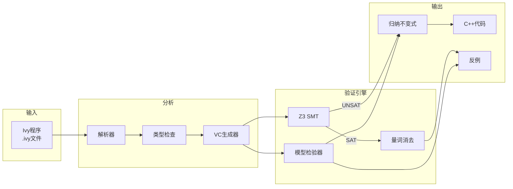
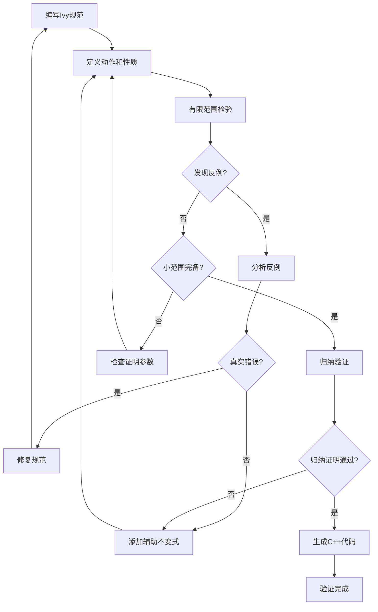
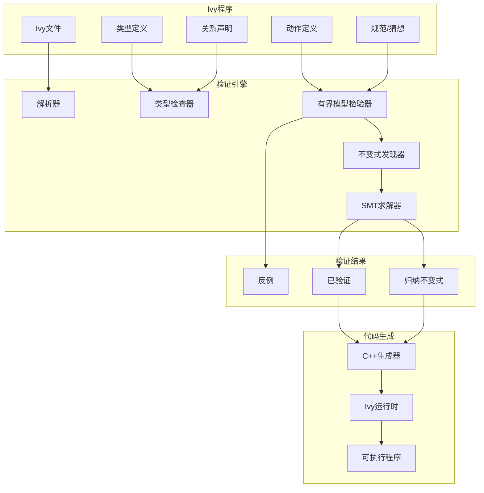
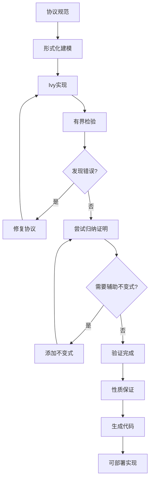
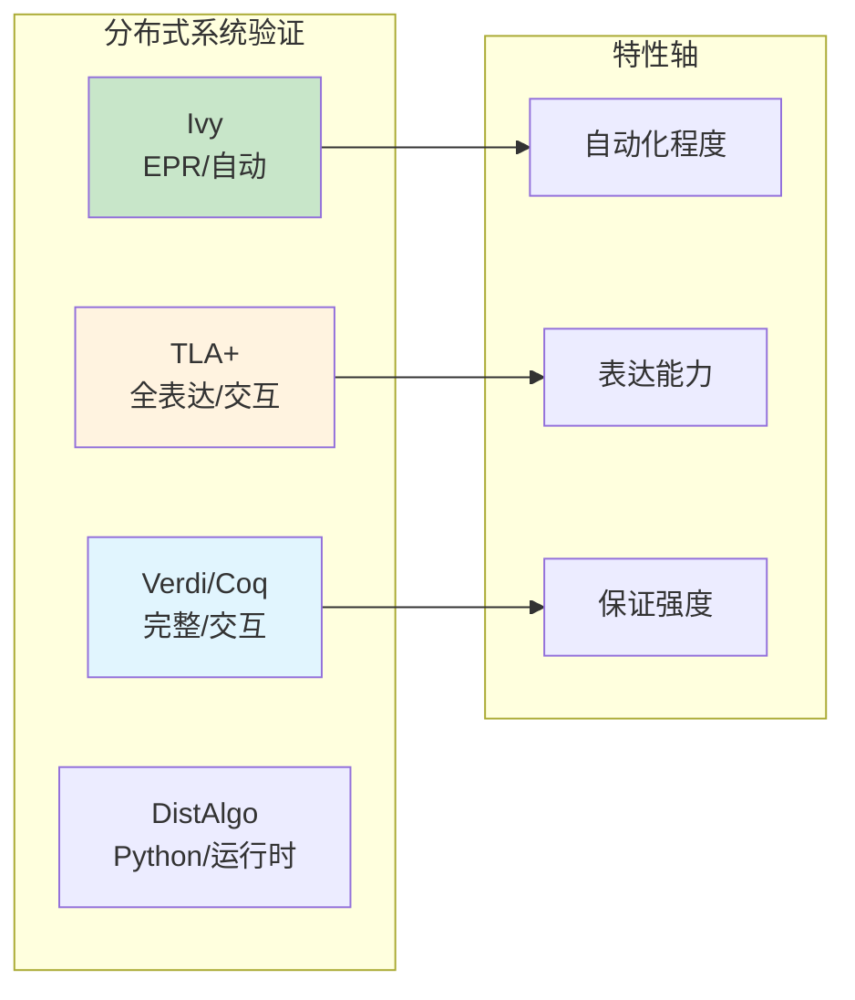

# Ivy验证工具

> **所属单元**: Tools/Academic | **前置依赖**: [时序逻辑与模型检验](../../05-verification/01-logic/02-temporal-logic.md) | **形式化等级**: L5

## 1. 概念定义 (Definitions)

### 1.1 Ivy概述

**Def-T-07-01** (Ivy定义)。Ivy是用于验证分布式系统和协议的领域特定语言和工具集：

$$\text{Ivy} = \text{建模语言} + \text{有限范围验证} + \text{归纳不变式合成} + \text{C++代码生成}$$

**设计原则**：

- **可判定性优先**: 选择保证验证终止的逻辑片段
- **模块化推理**: 支持组合验证
- **反例引导**: 自动从反例学习归纳不变式
- **代码生成**: 验证后可生成可执行C++代码

**Def-T-07-02** (Ivy逻辑)。Ivy基于带量词的一阶逻辑的可判定片段：

$$\mathcal{L}_{Ivy} = \text{FO}(\Sigma) \text{ with EPR (Effectively Propositional)}$$

**EPR限制**：

- 所有函数符号必须为常量或一元
- 无量词交替（$\forall\exists$模式禁止）
- 允许有限量词前缀

### 1.2 Ivy语言构造

**Def-T-07-03** (Ivy程序结构)。Ivy程序组织：

```ivy
# 模块声明
module my_protocol {
    # 类型定义
    type node
    type value

    # 关系/函数声明
    relation held(N:node)
    function value_of(N:node): value

    # 动作/变迁定义
    action grant(n:node) = {
        require ~held(n);
        held(n) := true;
    }

    # 规范
    conjecture [safety] forall N1, N2. held(N1) & held(N2) -> N1 = N2
}
```

**核心元素**：

| 构造 | 语法 | 语义 |
|------|------|------|
| 类型 | `type t` | 未解释排序 |
| 关系 | `relation r(X:t)` | 布尔函数 |
| 函数 | `function f(X:t): s` | 全函数 |
| 动作 | `action a(x:t) = {...}` | 状态变迁 |
| 规范 | `conjecture [name] φ` | 要证明的性质 |

**Def-T-07-04** (Ivy类型系统)。Ivy使用简单的排序系统：

$$\Gamma \vdash e : \tau \quad \text{其中} \quad \tau \in \text{UserDefinedSorts}$$

无子类型，所有类型在编译时检查。

### 1.3 有限范围验证

**Def-T-07-05** (有限范围模型检验)。Ivy对小实例进行模型检验：

$$M \models_k \phi \triangleq \forall I. |I| \leq k \Rightarrow M_I \models \phi$$

其中$k$为小常数（通常3-5）。

**Def-T-07-06** (归纳不变式合成)。Ivy自动尝试合成归纳不变式：

$$\text{Find } \psi \text{ s.t. } Init \Rightarrow \psi \land \psi \land Next \Rightarrow \psi' \land \psi \Rightarrow Property$$

## 2. 属性推导 (Properties)

### 2.1 EPR可判定性

**Lemma-T-07-01** (EPR可满足性)。EPR片段的可满足性问题是可判定的：

$$\text{Sat}(\text{EPR}) \in \text{NEXPTIME}$$

**EPR语法限制**：

- 无函数符号（除常量外）
- 无量词交替
- 关系符号任意元数

### 2.2 有限范围完备性

**Def-T-07-07** (小模型性质)。某些性质具有小模型性质：

$$M \models_{\exists} \phi \Rightarrow \exists I. |I| \leq f(|\phi|). M_I \models \phi$$

Ivy利用此性质进行完备验证。

## 3. 关系建立 (Relations)

### 3.1 Ivy工具链



### 3.2 协议验证工具对比

| 特性 | Ivy | TLA+/TLC | SPIN | NuSMV | Verdi |
|------|-----|----------|------|-------|-------|
| 目标 | 协议验证 | 分布式系统 | 协议/并发 | 硬件/软件 | Coq框架 |
| 自动化 | ✅ 全自动 | ✅ 全自动 | ✅ 全自动 | ✅ 全自动 | ⚠️ 交互式 |
| 代码生成 | ✅ 支持 | ❌ 不支持 | ❌ 不支持 | ❌ 不支持 | ⚠️ 提取 |
| 归纳证明 | ✅ 自动尝试 | ❌ 手动 | ❌ 不支持 | ❌ 不支持 | ✅ 完整 |
| 表达能力 | EPR | TLA+ | Promela | SMV | Gallina |

## 4. 论证过程 (Argumentation)

### 4.1 验证工作流



### 4.2 典型验证模式

**模式1: 安全性验证**

```ivy
# 定义坏状态
relation bad_state(...)

# 证明不可达
conjecture [safety] ~bad_state(...)
```

**模式2: 不变式保持**

```ivy
# 定义归纳不变式
relation invariant(...)

# 初始化建立
conjecture [init] init_state(...) -> invariant(...)

# 动作保持
conjecture [step] invariant(...) & action(...) -> invariant'(...)

# 蕴含性质
conjecture [implies] invariant(...) -> property(...)
```

## 5. 形式证明 / 工程论证 (Proof / Engineering Argument)

### 5.1 Ivy正确性保证

**Thm-T-07-01** (Ivy可靠性)。若Ivy验证通过，则性质成立：

$$(\text{Ivy} \vdash M \models \phi) \Rightarrow M \models \phi$$

**保证范围**：

- 有限范围：对所有$|I| \leq k$的实例
- 归纳证明：对所有实例（若归纳不变式正确）

### 5.2 有限范围完备性

**Thm-T-07-02** (小范围完备性)。对于某些协议类：

$$\exists k. (\forall |I| \leq k. M_I \models \phi) \Rightarrow (M \models \phi)$$

Ivy的默认$k=3$对许多协议有效。

## 6. 实例验证 (Examples)

### 6.1 Ivy安装配置

**安装要求**：

- Python 3.6+
- Z3求解器
- C++编译器（用于代码生成）

**安装步骤**：

```bash
# 克隆仓库
git clone https://github.com/kenmcmil/ivy.git
cd ivy

# 安装依赖
pip install z3-solver

# 构建Ivy
python setup.py build
python setup.py install

# 验证安装
ivy_check --version
```

**基本命令**：

```bash
# 验证Ivy文件
ivy_check file.ivy

# 有限范围检验（范围3）
ivy_check trace=true file.ivy

# 生成C++代码
ivy_to_cpp file.ivy

# 编译生成的代码
g++ -o output output.cpp -livycpp
```

### 6.2 Ivy语言：互斥协议

**简单锁协议**：

```ivy
module ticket_lock {
    # 类型
    type node
    type ticket = int

    # 状态
    relation waiting(N:node, T:ticket)  # 节点持有票号
    relation serving(T:ticket)          # 当前服务票号
    individual next_ticket:ticket       # 下一个票号

    # 初始化
    init serving(0) & next_ticket = 1

    # 动作：请求锁
    action request(n:node) = {
        local t:ticket {
            t := next_ticket;
            next_ticket := t + 1;
            waiting(n, t) := true;
        }
    }

    # 动作：获取锁
    action acquire(n:node) = {
        local t:ticket {
            assume waiting(n, t) & serving(t);
            waiting(n, t) := false;
        }
    }

    # 动作：释放锁
    action release(n:node) = {
        local t:ticket {
            assume ~waiting(n, t) & serving(t);
            serving(t) := false;
            serving(t + 1) := true;
        }
    }

    # 安全性：互斥
    conjecture [mutex]
        forall N1, N2, T.
            (~waiting(N1, T) & serving(T) &
             ~waiting(N2, T) & serving(T)) -> N1 = N2

    # 辅助不变式
    conjecture [inv1]
        forall T. serving(T) -> T < next_ticket

    conjecture [inv2]
        forall N, T. waiting(N, T) -> T < next_ticket & T >= 0

    conjecture [inv3]
        forall N1, N2, T. waiting(N1, T) & waiting(N2, T) -> N1 = N2
}
```

### 6.3 协议验证：两阶段提交

```ivy
module two_phase_commit {
    # 参与者类型
    type participant
    type coordinator

    # 消息类型
    type vote = {yes, no}
    type decision = {commit, abort}

    # 状态
    relation voted(P:participant, V:vote)
    relation decided(C:coordinator, D:decision)
    relation has_decision(P:participant, D:decision)

    # 投票阶段
    action vote(p:participant, v:vote) = {
        require ~exists V. voted(p, V);
        voted(p, v) := true;
    }

    # 协调者决策
    action decide(c:coordinator) = {
        local all_yes:bool {
            all_yes := forall P. voted(P, yes);
            if all_yes {
                decided(c, commit) := true;
            } else {
                decided(c, abort) := true;
            }
        }
    }

    # 决策传播
    action deliver_decision(p:participant, c:coordinator) = {
        local d:decision {
            assume decided(c, d);
            has_decision(p, d) := true;
        }
    }

    # 安全性1：统一决策
    conjecture [uniformity]
        forall P1, P2, D1, D2.
            has_decision(P1, D1) & has_decision(P2, D2) -> D1 = D2

    # 安全性2：有效性（若提交，则全部投赞成）
    conjecture [validity]
        forall P, C.
            has_decision(P, commit) -> voted(P, yes)

    # 辅助不变式
    conjecture [inv_decide]
        forall C, D.
            decided(C, D) & D = commit ->
            forall P. voted(P, yes)
}
```

### 6.4 有限范围验证执行

**验证文件**：`mutex.ivy`

```bash
$ ivy_check mutex.ivy

Ivy model checker
=================

Checking conjecture mutex...
Bounded check with bound 3... OK
Attempting to find inductive invariant...
Found inductive invariant after 3 iterations:
  mutex
  inv1
  inv2
  inv3

All conjectures proved.
```

**分析反例**：

```bash
$ ivy_check trace=true mutex.ivy

Found counterexample to mutex:
State 0:
  serving(0) = true
  next_ticket = 1

Action: request(n1)
State 1:
  waiting(n1, 1) = true
  next_ticket = 2

Action: request(n2)
State 2:
  waiting(n1, 1) = true
  waiting(n2, 2) = true
  next_ticket = 3

... (trace continues)
```

### 6.5 C++代码生成

**生成可执行代码**：

```bash
ivy_to_cpp mutex.ivy -o mutex_impl.cpp
g++ -std=c++11 -o mutex_impl mutex_impl.cpp -livycpp
./mutex_impl
```

**生成的API**（概念）：

```cpp
class ticket_lock {
public:
    void request(node n);
    void acquire(node n);
    void release(node n);

    // 验证保证：这些调用满足mutex性质
};
```

## 7. 可视化 (Visualizations)

### 7.1 Ivy验证架构



### 7.2 协议验证流程



### 7.3 Ivy与其他工具关系



## 8. 引用参考 (References)
