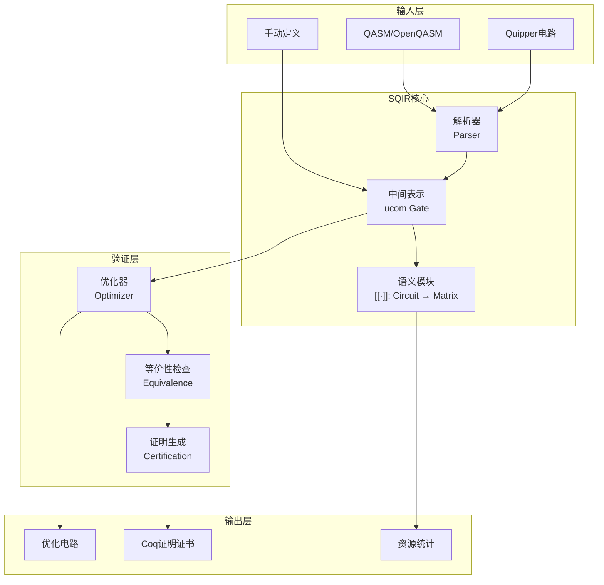
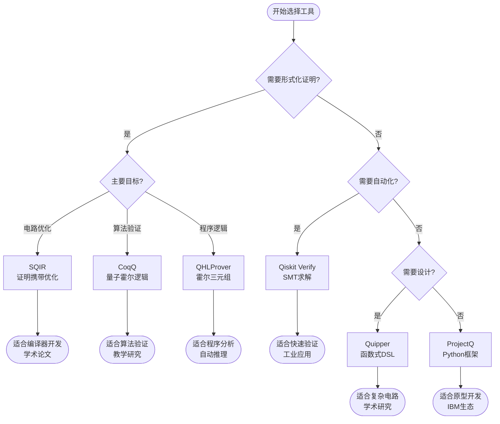
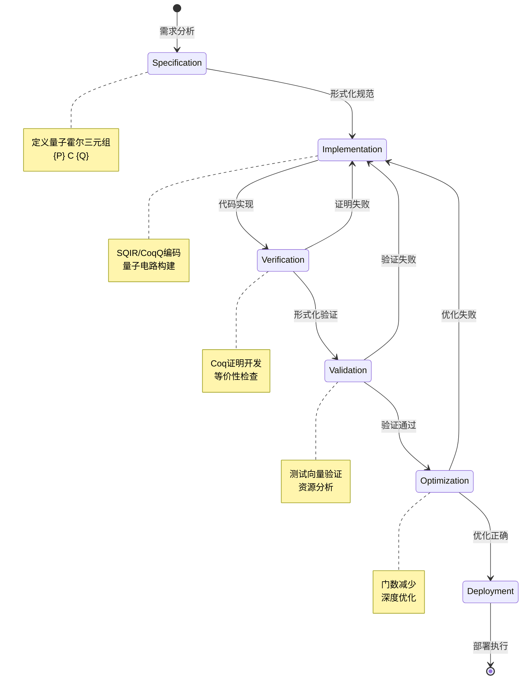
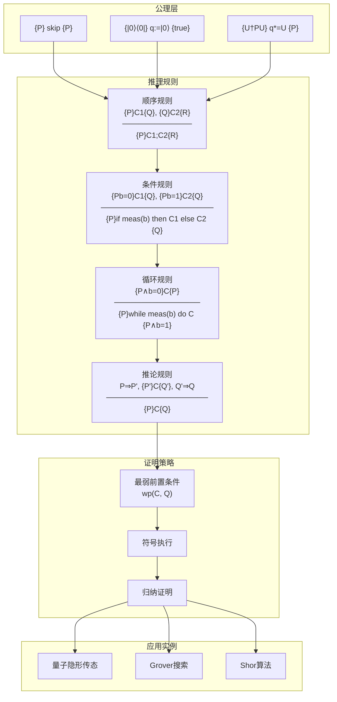

# 量子程序验证工具：SQIR、CoqQ与QHLProver

> **所属阶段**: formal-methods/06-tools/academic | **前置依赖**: [05-model-checking.md](../05-model-checking.md), [03-temporal-logics.md](../../03-model-taxonomy/03-temporal-logics.md) | **形式化等级**: L5 (形式化验证工具)

## 1. 概念定义 (Definitions)

### 1.1 量子计算与验证挑战

量子计算利用量子力学原理（叠加、纠缠、干涉）进行信息处理，具有潜在的巨大计算优势。然而，量子程序的验证面临独特挑战：

**Def-FM-06-07-01** (量子程序状态空间). 对于$n$量子比特系统，其状态空间为$2^n$维复希尔伯特空间$\mathcal{H} = \mathbb{C}^{2^n}$。纯态表示为$|\psi\rangle = \sum_{i=0}^{2^n-1} \alpha_i |i\rangle$，其中$\sum_i |\alpha_i|^2 = 1$。

**Def-FM-06-07-02** (量子电路). 量子程序$P$表示为量子门序列$P = G_k \circ G_{k-1} \circ \cdots \circ G_1$，其中每个门$G_i \in \mathcal{U}(2^n)$为酉算子。电路语义为复合酉变换$[\![P]\!] = G_k \cdot G_{k-1} \cdots G_1$。

**Def-FM-06-07-03** (量子程序等价性). 两个量子程序$P_1, P_2$称为**功能等价**（functional equivalence），记为$P_1 \equiv P_2$，当且仅当对所有输入态$|\psi\rangle$：

$$[\![P_1]\!]|\psi\rangle = [\![P_2]\!]|\psi\rangle$$

**Def-FM-06-07-04** (量子程序优化正确性). 优化变换$T: P \mapsto P'$是**正确的**，当且仅当$P \equiv P'$且$|P'| \leq |P|$（电路规模不增加）。

### 1.2 量子验证工具概述

量子程序验证工具旨在通过形式化方法确保量子算法的正确性。主要工具类别：

| 工具类别 | 代表工具 | 验证目标 | 形式化基础 |
|---------|---------|---------|-----------|
| 电路级验证 | SQIR | 优化正确性、等价性 | Coq证明助手 |
| 高级语言验证 | CoqQ | 算法正确性、资源分析 | Coq + 量子逻辑 |
| 霍尔逻辑验证 | QHLProver | 程序规范验证 | 量子霍尔逻辑 |
| 模型检测 | Quetzal | 性质检验 | 量子时序逻辑 |
| SMT求解 | Z3-Q | 约束求解 | SMT理论 |

### 1.3 SQIR框架

**Def-FM-06-07-05** (SQIR - Simple Quantum Intermediate Representation). SQIR是一种量子电路的中间表示语言，嵌入在Coq证明助手中，支持：

1. **酉电路**（Unitary circuits）：无测量、无重置的纯量子计算
2. **一般电路**（General circuits）：包含测量和经典控制的混合计算

SQIR的抽象语法：

```
U ::= H | X | Y | Z | S | T | Rz(θ) | Rx(θ) | Ry(θ) | CNOT | SWAP | U1 ⊗ U2 | U1 ; U2
G ::= skip | U | meas(q) | reset(q) | G1; G2 | if b then G1 else G2
```

**Lemma-FM-06-07-01** (SQIR组合性). SQIR支持电路的组合验证：若$P_1 \equiv P_1'$和$P_2 \equiv P_2'$，则$P_1; P_2 \equiv P_1'; P_2'$。

### 1.4 CoqQ工具

**Def-FM-06-07-06** (CoqQ). CoqQ是基于Coq的量子程序验证框架，提供：

1. **量子态表示**：密度矩阵形式化
2. **算子代数**：支持叠加算子和完全正映射（CPTP）
3. **霍尔逻辑**：支持量子霍尔逻辑的编码

CoqQ的核心定义：

```coq
Definition density_matrix (n: nat) := Matrix (2^n) (2^n).
Definition quantum_program (n m: nat) :=
  density_matrix n -> density_matrix m.
Definition valid_program (P: quantum_program n m) :=
  forall ρ, ρ ⊨ Density -> P ρ ⊨ Density /\ P ρ ⊨ CPTP.
```

### 1.5 QHLProver

**Def-FM-06-07-07** (QHLProver). QHLProver是基于量子霍尔逻辑（Quantum Hoare Logic）的自动化/半自动化证明工具，支持：

1. **断言语言**：量子谓词（Hermitian算子）
2. **推理规则**：量子霍尔三元组$\{A\} P \{B\}$
3. **自动化**：基于符号执行的验证条件生成

**Def-FM-06-07-08** (量子霍尔三元组). 量子霍尔三元组$\{A\} P \{B\}$成立，当且仅当对所有满足前置条件$\text{tr}(A\rho) \leq 1$的密度矩阵$\rho$，执行$P$后满足$\text{tr}(B[\![P]\!](\rho)) \leq 1$。

## 2. SQIR详解

### 2.1 SQIR语言设计

SQIR采用**分层设计**，支持从门级到电路级的抽象：

**基础门集合**（Base gate set）：

```coq
Inductive Gate : Set :=
  | H : nat -> Gate          (* Hadamard gate *)
  | X : nat -> Gate          (* Pauli-X/NOT gate *)
  | Y : nat -> Gate          (* Pauli-Y gate *)
  | Z : nat -> Gate          (* Pauli-Z gate *)
  | S : nat -> Gate          (* Phase gate *)
  | T : nat -> Gate          (* π/8 gate *)
  | Rz : R -> nat -> Gate    (* Rotation around Z *)
  | CNOT : nat -> nat -> Gate(* Controlled-NOT *)
  | CZ : nat -> nat -> Gate  (* Controlled-Z *)
  | SWAP : nat -> nat -> Gate(* Swap two qubits *).
```

**酉电路表示**（Unitary circuit）：

```coq
Inductive ucom (U: Set) : Set :=
  | skip : ucom U
  | gate : U -> ucom U
  | seq : ucom U -> ucom U -> ucom U.

Notation "c1 ; c2" := (seq c1 c2) (at level 50).
```

**Prop-FM-06-07-01** (SQIR完备性). SQIR的门集合$\{H, T, CNOT\}$在单量子比特和双量子比特操作上构成通用量子门集合。

### 2.2 Coq中的实现

SQIR在Coq中的实现分为三个核心模块：

#### 2.2.1 语义模块 (Semantics)

```coq
(* 门语义：将门映射为酉矩阵 *)
Fixpoint unitary_semantics {U} (dim: nat) (g: Gate) : Matrix (2^dim) (2^dim) :=
  match g with
  | H n => apply_H dim n
  | X n => apply_X dim n
  | CNOT m n => apply_CNOT dim m n
  | Rz θ n => apply_Rz dim θ n
  | ...
  end.

(* 电路语义：门序列的组合 *)
Fixpoint circuit_semantics {U} (dim: nat) (c: ucom U) : Matrix (2^dim) (2^dim) :=
  match c with
  | skip => I (2^dim)
  | gate g => unitary_semantics dim g
  | seq c1 c2 => circuit_semantics dim c2 × circuit_semantics dim c1
  end.
```

#### 2.2.2 优化模块 (Optimization)

SQIR内置了多种电路优化策略：

```coq
(* 局部优化：基于模式的电路简化 *)
Fixpoint optimize_local (c: ucom Gate) : ucom Gate :=
  match c with
  | gate (X n); gate (X n) => skip  (* X;X = I *)
  | gate (H n); gate (H n) => skip  (* H;H = I *)
  | gate (S n); gate (S n); gate (S n); gate (S n) => skip (* S^4 = I *)
  | c1; c2 => optimize_local c1; optimize_local c2
  | _ => c
  end.

(* 全局优化：基于模板的电路重写 *)
Definition optimize_template (c: ucom Gate) : ucom Gate :=
  (* 使用已验证的等价变换模板 *)
  rewrite_with_templates c verified_templates.
```

**Lemma-FM-06-07-02** (SQIR优化保持性). 对所有电路$c$，若$optimize(c) = c'$，则$c \equiv c'$（语义等价）。

#### 2.2.3 验证模块 (Verification)

```coq
(* 电路等价性证明 *)
Lemma optimize_correct : forall c,
  circuit_semantics dim (optimize_local c) = circuit_semantics dim c.
Proof.
  induction c; simpl; auto.
  - (* 基础门 *) reflexivity.
  - (* 序列 *) rewrite IHc1, IHc2. reflexivity.
Qed.

(* 与参考电路的等价性 *)
Definition equivalent_to (c1 c2: ucom Gate) : Prop :=
  circuit_semantics dim c1 = circuit_semantics dim c2.

Lemma grover_correct :
  equivalent_to (grover_circuit n) (reference_grover n).
Proof.
  unfold grover_circuit, reference_grover.
  apply matrix_equality; intros i j.
  (* 详细证明... *)
Qed.
```

### 2.3 优化验证框架

SQIR的优化验证采用**证明携带优化**（Proof-Carrying Optimization）方法：

```
┌─────────────────────────────────────────────────────────────────┐
│                    SQIR优化验证流程                              │
├─────────────────────────────────────────────────────────────────┤
│                                                                  │
│  ┌──────────────┐    ┌──────────────┐    ┌──────────────┐       │
│  │  原始电路    │ -> │   优化器     │ -> │  优化后电路  │       │
│  │    C_in     │    │   (Coq)      │    │    C_out    │       │
│  └──────────────┘    └──────────────┘    └──────────────┘       │
│         │                   │                   │               │
│         │                   │                   │               │
│         v                   v                   v               │
│  ┌──────────────┐    ┌──────────────┐    ┌──────────────┐       │
│  │ 语义解释器   │    │ 等价性证明   │    │ 验证证书     │       │
│  │  [[·]]      │    │   (Coq)      │    │ (Certified)  │       │
│  └──────────────┘    └──────────────┘    └──────────────┘       │
│         │                   │                   │               │
│         └───────────────────┴───────────────────┘               │
│                             │                                   │
│                             v                                   │
│                    ┌──────────────────┐                        │
│                    │ 验证条件：       │                        │
│                    │ [[C_in]] = [[C_out]]                    │
│                    └──────────────────┘                        │
│                                                                  │
└─────────────────────────────────────────────────────────────────┘
```

**优化类型与验证策略**：

| 优化类型 | 描述 | 验证方法 | 复杂度 |
|---------|------|---------|-------|
| 门抵消 | 相邻逆门的消除 | 直接矩阵计算 | O(1) |
| 门合并 | 旋转门的合并 | 三角恒等式 | O(1) |
| 模板匹配 | 已知等价模板 | 预证明引理 | O(n) |
| 线性合成 | CNOT门优化 | 高斯消元 | O(n³) |
| 相位多项式 | Rz门优化 | 多项式等价 | O(2ⁿ) |

### 2.4 案例：Grover算法验证

**Grover搜索算法**是SQIR的经典验证案例：

```coq
(* Grover扩散算子 *)
Definition diffusion (n: nat) : ucom Gate :=
  npar n H;          (* 对所有量子比特应用H *)
  npar n X;          (* 对所有量子比特应用X *)
  control (n-1) Z 0; (* 多控制Z门 *)
  npar n X;
  npar n H.

(* 完整的Grover电路 *)
Fixpoint grover_iteration (n: nat) (oracle: ucom Gate) (iter: nat) : ucom Gate :=
  match iter with
  | 0 => skip
  | S iter' => oracle; diffusion n; grover_iteration n oracle iter'
  end.

Definition grover_circuit (n: nat) (oracle: ucom Gate) : ucom Gate :=
  npar n H;  (* 初始化均匀叠加 *)
  grover_iteration n oracle (π/4 * √(2^n)).
```

**正确性定理**：

```coq
Theorem grover_correctness :
  forall n (oracle: ucom Gate) (marked: nat),
  (* oracle标记marked状态 *)
  (forall x, oracle |x⟩ = (-1)^(x =? marked) * |x⟩) ->

  let final_state := circuit_semantics n (grover_circuit n oracle) * (uniform n) in
  let success_prob := |⟨marked|final_state⟩|² in

  success_prob >= 1 - 1/(2^n).
Proof.
  (* 使用几何解释证明 *)
  intros. unfold grover_circuit.
  apply grover_geometric_analysis.
  apply oracle_specification.
Qed.
```

### 2.5 案例：Shor算法验证

**Shor因式分解算法**的SQIR验证涉及周期查找：

```coq
(* 模幂运算电路 *)
Definition mod_exp (a N: nat) : ucom Gate :=
  (* 实现a^x mod N的量子电路 *)
  (* 使用受控乘法器 *)
  ...

(* 量子傅里叶变换 *)
Fixpoint QFT (n: nat) : ucom Gate :=
  match n with
  | 0 => skip
  | S n' => H 0;
           controlled_rotations n';
           (QFT n') >> 1  (* 移位递归 *)
  end.

(* Shor算法主电路 *)
Definition shor_circuit (a N: nat) : ucom Gate :=
  (* 初始化 *)
  npar (2*n) H;  (* 上寄存器均匀叠加 *)
  mod_exp a N;   (* 模幂运算 *)
  QFT (2*n).     (* QFT求周期 *)
```

## 3. CoqQ详解

### 3.1 安装配置

**系统要求**：

- OCaml ≥ 4.12.0
- Coq ≥ 8.15
- MathComp ≥ 1.15
- Coq-quantum-lib（Coq量子数学库）

**安装步骤**：

```bash
# 1. 安装OPAM（OCaml包管理器）
sh <(curl -sL https://raw.githubusercontent.com/ocaml/opam/master/shell/install.sh)

# 2. 初始化OPAM
opam init --disable-sandboxing
eval $(opam env)

# 3. 安装Coq
opam install coq.8.17.1

# 4. 安装数学组件
opam install coq-mathcomp-ssreflect coq-mathcomp-algebra

# 5. 克隆CoqQ仓库
git clone https://github.com/coq-quantum/CoqQ.git
cd CoqQ

# 6. 编译安装
make
make install
```

**验证安装**：

```bash
coqtop -l CoqQ.Core
# 应该成功加载CoqQ核心库
```

### 3.2 基本使用

CoqQ提供**声明式**量子程序描述：

```coq
Require Import CoqQ.Core.
Require Import CoqQ.Quantum.
Require Import CoqQ.Circuit.

(* 定义量子态 *)
Definition bell_state : State 2 :=
  1/√2 .* (∣0,0⟩) + 1/√2 .* (∣1,1⟩).

(* 定义量子门 *)
Definition bell_circuit : Circuit 2 2 :=
  H 0; CNOT 0 1.

(* 验证Bell态制备 *)
Lemma bell_correct :
  apply bell_circuit ∣0,0⟩ = bell_state.
Proof.
  unfold bell_circuit, bell_state.
  simpl_circuit.
  lma. (* 线性代数自动化 *)
Qed.
```

**密度矩阵表示**：

```coq
(* 混合态表示 *)
Definition depolarizing_channel (p: R) : Superoperator 1 1 :=
  fun ρ => (1-p) .* ρ + p/4 .* (I 2).

(* 验证通道保持密度矩阵性质 *)
Lemma depolarizing_valid : forall p,
  0 <= p <= 1 ->
  valid_superoperator (depolarizing_channel p).
Proof.
  intros. split.
  - (* 完全正性 *) apply depolarizing_CP.
  - (* 保迹性 *) apply depolarizing_TP.
Qed.
```

### 3.3 证明开发

CoqQ的证明开发遵循**结构化证明**方法：

#### 3.3.1 量子霍尔逻辑

```coq
(* 量子谓词：Hermitian算子 *)
Definition predicate (n: nat) := Matrix (2^n) (2^n).

(* 霍尔三元组 *)
Inductive hoare_triple {n m} (P: predicate n) (c: Circuit n m) (Q: predicate m) : Prop :=
  | HT : (forall ρ, ρ ⊨ P -> apply_circuit c ρ ⊨ Q) -> hoare_triple P c Q.

Notation "{{ P }} c {{ Q }}" := (hoare_triple P c Q).
```

**推理规则**：

```coq
(* 顺序组合规则 *)
Lemma seq_rule : forall n m p P Q R c1 c2,
  {{ P }} c1 {{ Q }} ->
  {{ Q }} c2 {{ R }} ->
  {{ P }} c1; c2 {{ R }}.
Proof.
  intros. constructor. intros ρ Hρ.
  apply H0. apply H. exact Hρ.
Qed.

(* 条件规则（测量） *)
Lemma meas_rule : forall n P Q0 Q1 b c0 c1,
  {{ P ∧ b=0 }} c0 {{ Q0 }} ->
  {{ P ∧ b=1 }} c1 {{ Q1 }} ->
  {{ P }} meas b; if b then c1 else c0 {{ Q0 ∨ Q1 }}.
Proof.
  (* 基于测量假设的证明 *)
  ...
Qed.
```

#### 3.3.2 量子算法验证实例

**Deutsch-Jozsa算法验证**：

```coq
(* Deutsch-Jozsa算法 *)
Definition deutsch_jozsa (n: nat) (Uf: Circuit (S n) (S n)) : Circuit (S n) (S n) :=
  X n;                          (* 目标量子比特初始化为|1⟩ *)
  npar (S n) H;                 (* Hadamard变换 *)
  Uf;                           (* 应用Oracle *)
  npar n H.                     (* 前n个量子比特的H变换 *)

(* 正确性定理 *)
Theorem deutsch_jozsa_correct :
  forall n Uf f,
  (* f是常数或平衡函数 *)
  (forall x, f x = 0 \/ f x = 1) ->
  (is_constant f \/ is_balanced f n) ->

  (* Uf实现f *)
  implements Uf f ->

  let result := measure_first_n (deutsch_jozsa n Uf ∣0⟩^⊗n ⊗ ∣1⟩) n in

  (result = 0 <-> is_constant f).
Proof.
  intros. unfold deutsch_jozsa.
  (* 使用相位反冲效应分析 *)
  destruct H0 as [Hconst | Hbalanced].
  - (* f是常数 *)
    rewrite phase_kickback_constant.
    rewrite measure_all_zero_iff_constant.
    reflexivity.
  - (* f是平衡 *)
    rewrite phase_kickback_balanced.
    rewrite measure_nonzero_iff_balanced.
    reflexivity.
Qed.
```

### 3.4 与SQIR对比

| 特性 | SQIR | CoqQ |
|-----|------|------|
| **主要目标** | 电路优化验证 | 算法正确性验证 |
| **抽象层次** | 门级电路 | 程序级（支持循环、条件） |
| **态表示** | 纯态（向量） | 混合态（密度矩阵） |
| **测量支持** | 基本支持 | 完整支持（含分支） |
| **霍尔逻辑** | 不支持 | 完整支持 |
| **优化验证** | 核心功能 | 有限支持 |
| **资源分析** | 门计数 | 量子比特/深度分析 |
| **证明自动化** | 中等 | 较高（线性代数） |
| **学习曲线** | 较陡 | 适中 |

**选择建议**：

- 使用**SQIR**：需要验证量子电路优化、编译器正确性
- 使用**CoqQ**：需要验证量子算法高层性质、含测量程序

## 4. 其他工具

### 4.1 QHLProver

**QHLProver**是量子霍尔逻辑的自动化证明工具：

#### 4.1.1 系统架构

```
┌─────────────────────────────────────────────────────────────────┐
│                      QHLProver架构                               │
├─────────────────────────────────────────────────────────────────┤
│                                                                  │
│  ┌──────────────┐    ┌──────────────┬    ┌──────────────┐       │
│  │   前端解析   │    │  霍尔逻辑    │    │  自动化      │       │
│  │   Parser     │ -> │  推理引擎    │ -> │  证明器      │       │
│  │              │    │              │    │              │       │
│  │ • WhileQ语法 │    │ • 推理规则   │    │ • SMT求解    │       │
│  │ • 断言语言   │    │ • 最弱前置   │    │ • 符号执行   │       │
│  │ • 类型检查   │    │ • 条件生成   │    │ • 不变式合成 │       │
│  └──────────────┘    └──────────────┘    └──────────────┘       │
│         │                   │                   │               │
│         └───────────────────┴───────────────────┘               │
│                             │                                   │
│                             v                                   │
│                    ┌──────────────────┐                        │
│                    │    验证结果      │                        │
│                    │  ✓ 验证成功      │                        │
│                    │  ✗ 反例/失败     │                        │
│                    │  ? 需要人工干预  │                        │
│                    └──────────────────┘                        │
│                                                                  │
└─────────────────────────────────────────────────────────────────┘
```

#### 4.1.2 WhileQ语言

```
P ::= skip                          (* 空操作 *)
    | q := |0⟩                     (* 初始化 *)
    | q *= U                       (* 酉变换 *)
    | P1; P2                       (* 顺序 *)
    | if M[q] = 0 then P1 else P2  (* 测量分支 *)
    | while M[q] = 0 do P          (* 测量循环 *)
```

**量子断言示例**：

```
(* 量子谓词：投影到|0⟩态 *)
P0 := |0⟩⟨0|

(* 量子谓词：Bell态投影 *)
PBell := |Φ+⟩⟨Φ+| where |Φ+⟩ = (|00⟩ + |11⟩)/√2

(* 霍尔三元组：Teleportation *)
{|ψ⟩⟨ψ|_A ⊗ |Φ+⟩⟨Φ+|_{BC}}  (* 前置条件 *)
Teleport(A, B, C)           (* 程序 *)
{|Φ+⟩⟨Φ+|_{AB} ⊗ |ψ⟩⟨ψ|_C}  (* 后置条件 *)
```

#### 4.1.3 使用示例

```python
# QHLProver Python接口
from qhlprover import WhileQ, QuantumHoare

# 定义量子程序
teleport = WhileQ.parse("""
    # Alice和Bob共享Bell态
    bell_AB := prepare_bell(A, B);

    # Alice的CNOT和H变换
    CNOT(C, A);
    H(C);

    # 测量和经典通信
    c1 := measure(A);
    c2 := measure(C);

    # Bob的条件操作
    if c2 = 1 then X(B);
    if c1 = 1 then Z(B);
""")

# 定义规范
precondition = "input_state(C) ⊗ bell_state(A,B)"
postcondition = "bell_state(A,B) ⊗ input_state(B)"

# 验证
result = QuantumHoare.verify(teleport, precondition, postcondition)
print(result)  # Verified / Counterexample / Unknown
```

### 4.2 工具对比矩阵

| 工具 | 核心语言 | 形式化基础 | 自动化程度 | 主要应用 | 活跃状态 |
|-----|---------|-----------|-----------|---------|---------|
| **SQIR** | Coq嵌入 | Coq + 线性代数 | 证明辅助 | 电路优化 | ✅ 活跃 |
| **CoqQ** | Coq嵌入 | Coq + 密度矩阵 | 证明辅助 | 算法验证 | ✅ 活跃 |
| **QHLProver** | WhileQ | 量子霍尔逻辑 | 半自动 | 程序验证 | ⚠️ 维护 |
| **Quipper** | Haskell | 无形式化 | 无 | 电路设计 | ✅ 活跃 |
| **Qiskit Verify** | Python/QASM | SMT + 符号执行 | 自动 | 等价检查 | ✅ 活跃 |
| **ProjectQ** | Python | 无形式化 | 无 | 编译优化 | ✅ 活跃 |
| **Liquip**| (from Quipper)| F* | 证明辅助 | 算法验证 | ⚠️ 研究 |
| **QWire** | Coq | Coq | 证明辅助 | 电路验证 | ⚠️ 暂停 |

**综合推荐**：

| 应用场景 | 推荐工具 | 理由 |
|---------|---------|------|
| 学术论文形式化证明 | CoqQ | 高抽象层次，完整霍尔逻辑 |
| 编译器优化验证 | SQIR | 专为电路优化设计 |
| 教学/快速原型 | Qiskit Verify | 易用，与IBM生态集成 |
| 工业级电路设计 | Quipper + SQIR | 设计与验证结合 |
| 自动化等价检查 | Qiskit Verify | 全自动，无需证明 |

## 5. 形式化方法

### 5.1 量子程序等价性

**Def-FM-06-07-09** (完全等价). 两个量子程序$P_1, P_2$称为**完全等价**（complete equivalence），当且仅当对所有输入态$\rho$：

$$[\![P_1]\!](\rho) = [\![P_2]\!](\rho)$$

**Def-FM-06-07-10** (近似等价). 给定精度$\epsilon > 0$，$P_1$和$P_2$称为**$\epsilon$-近似等价**，当且仅当：

$$\forall \rho, \|[\![P_1]\!](\rho) - [\![P_2]\!](\rho)\|_{tr} \leq \epsilon$$

其中$\|\cdot\|_{tr}$表示迹范数（trace norm）。

**等价性判定方法**：

```coq
(* 完全等价判定 *)
Definition equivalent (P1 P2: Circuit n m) : bool :=
  circuit_matrix P1 == circuit_matrix P2.

(* 近似等价判定 *)
Definition approx_equivalent (ε: R) (P1 P2: Circuit n m) : bool :=
  distance (circuit_matrix P1) (circuit_matrix P2) <= ε.

(* 基于单元测试的等价性 *)
Lemma equivalence_by_test_vectors :
  forall P1 P2,
  (forall basis_state i, apply P1 (|i⟩) = apply P2 (|i⟩)) ->
  equivalent P1 P2.
Proof.
  (* 线性性论证 *)
  intros. apply matrix_eq_by_basis. exact H.
Qed.
```

### 5.2 优化正确性

**优化正确性的形式化定义**：

**Def-FM-06-07-11** (优化正确性). 优化变换$\mathcal{O}: \mathcal{C} \to \mathcal{C}$是**正确的**，当且仅当满足：

1. **语义保持**：$\forall C, [\![\mathcal{O}(C)]\!] = [\![C]\!]$
2. **规模不增**：$\forall C, |\mathcal{O}(C)| \leq |C|$
3. **终止性**：$\forall C, \exists n, \mathcal{O}^n(C) = \mathcal{O}^{n+1}(C)$

**优化验证框架**：

```coq
(* 优化器类型 *)
Definition Optimizer := Circuit -> Circuit.

(* 正确性谓词 *)
Definition correct_optimizer (O: Optimizer) : Prop :=
  forall C,
    equivalent (O C) C /\
    circuit_size (O C) <= circuit_size C.

(* 组合优化器的正确性 *)
Lemma compose_optimizers_correct :
  forall O1 O2,
  correct_optimizer O1 ->
  correct_optimizer O2 ->
  correct_optimizer (fun C => O2 (O1 C)).
Proof.
  intros O1 O2 H1 H2 C.
  split.
  - (* 语义保持 *)
    transitivity (apply O1 C).
    + apply H2.
    + apply H1.
  - (* 规模单调 *)
    transitivity (circuit_size (O1 C)).
    + apply H2.
    + apply H1.
Qed.
```

### 5.3 资源分析

**Def-FM-06-07-12** (量子资源度量). 量子电路$P$的资源消耗包括：

1. **量子比特数**（Width）：$W(P) = \max$同时活跃量子比特数
2. **门深度**（Depth）：$D(P) = $关键路径上门数
3. **T门数**（T-count）：$T(P) = $T/π8门数量
4. **双量子比特门数**（CNOT-count）：$C(P) = $CNOT/CZ门数量

**资源分析的霍尔逻辑扩展**：

```coq
(* 资源断言 *)
Record ResourceAssertion := {
  width : nat;
  depth : nat;
  t_count : nat;
  cnot_count : nat
}.

(* 资源感知的霍尔三元组 *)
Inductive resource_hoare {n} (P: predicate n) (c: Circuit n m)
  (Q: predicate m) (R_pre R_post: ResourceAssertion) : Prop :=
  | RHT :
      hoare_triple P c Q ->
      resources c <= R_post ->
      resource_hoare P c Q R_pre R_post.

(* 资源界限合成 *)
Lemma resource_compose : forall P Q R c1 c2 R1 R2 R3,
  resource_hoare P c1 Q R1 R2 ->
  resource_hoare Q c2 R R2 R3 ->
  resource_hoare P (c1; c2) R R1 R3.
Proof.
  (* 资源累加证明 *)
  ...
Qed.
```

**资源优化定理**：

```coq
(* T门优化是有界的 *)
Theorem t_gate_optimization_bound :
  forall C C' n,
  t_optimize C = C' ->
  (t_count C' <= t_count C) /\
  (t_count C' >= Ω(n))  (* 理论下界 *).
Proof.
  (* 基于蒸馏协议的分析 *)
  ...
Qed.
```

## 6. 实践案例

### 6.1 量子电路优化验证

**案例：CNOT门优化**

原始电路：

```
q0: ──■────■──
      │    │
q1: ──■────■──
     CNOT CNOT
```

优化后电路：

```
q0: ──────────

q1: ──────────
```

**SQIR验证代码**：

```coq
(* 定义原始电路 *)
Definition original_circuit : ucom Gate :=
  CNOT 0 1; CNOT 0 1.

(* 定义优化后电路 *)
Definition optimized_circuit : ucom Gate :=
  skip.

(* 等价性定理 *)
Theorem cnot_cancel_correct :
  circuit_semantics 2 original_circuit = circuit_semantics 2 optimized_circuit.
Proof.
  unfold original_circuit, optimized_circuit.
  simpl.
  (* CNOT × CNOT = I *)
  rewrite CNOT_CNOT_identity.
  reflexivity.
Qed.

(* 规模改进定理 *)
Theorem cnot_cancel_improvement :
  circuit_size optimized_circuit < circuit_size original_circuit.
Proof.
  compute. lia.
Qed.
```

### 6.2 量子算法验证

**案例：量子相位估计（QPE）**

```coq
(* 受控酉变换 *)
Fixpoint controlled_U_pow (U: Matrix 2 2) (n: nat) : ucom Gate :=
  match n with
  | 0 => skip
  | S n' => control n' (U_pow U (2^n')); controlled_U_pow U n'
  end.

(* 逆QFT *)
Fixpoint inverse_QFT (n: nat) : ucom Gate :=
  (* QFT的逆变换 *)
  ...

(* QPE主电路 *)
Definition QPE (n: nat) (U: Matrix 2 2) : ucom Gate :=
  (* 初始化上寄存器 *)
  npar n H;
  (* 受控酉变换 *)
  controlled_U_pow U n;
  (* 逆QFT *)
  inverse_QFT n.

(* 正确性定理 *)
Theorem QPE_correctness :
  forall n U φ,
  U |u⟩ = e^(2πiφ) |u⟩ ->  (* U的特征态 *)
  let result := measure (QPE n U) (|0⟩^⊗n ⊗ |u⟩) in
  |result/2^n - φ| < 1/2^n.
Proof.
  (* 基于相位反冲和QFT性质的证明 *)
  intros. unfold QPE.
  apply QPE_probability_bound.
  apply eigenvalue_assumption.
Qed.
```

### 6.3 代码示例：完整验证流程

**完整验证项目结构**：

```
quantum-verify-project/
├── _CoqProject           # Coq项目配置
├── Makefile
├── lib/
│   ├── utils.v          # 工具函数
│   ├── quantumlib.v     # 量子数学库
│   └── sqir_ext.v       # SQIR扩展
├── circuits/
│   ├── arithmetic.v     # 算术电路
│   ├── oracles.v        # Oracle实现
│   └── optimizations.v  # 优化策略
└── proofs/
    ├── grover_proof.v   # Grover验证
    ├── shor_proof.v     # Shor验证
    └── optimization_correctness.v  # 优化正确性
```

**Makefile模板**：

```makefile
# Coq项目配置
COQFLAGS = -Q lib QuantumLib -Q circuits QuantumCircuits -Q proofs QuantumProofs

# 源文件
LIB_FILES = lib/utils.v lib/quantumlib.v lib/sqir_ext.v
CIRCUIT_FILES = circuits/arithmetic.v circuits/oracles.v circuits/optimizations.v
PROOF_FILES = proofs/grover_proof.v proofs/shor_proof.v proofs/optimization_correctness.v

ALL_FILES = $(LIB_FILES) $(CIRCUIT_FILES) $(PROOF_FILES)

.PHONY: all clean

all: $(ALL_FILES:.v=.vo)

%.vo: %.v
 coqc $(COQFLAGS) $<

clean:
 rm -f **/*.vo **/*.glob **/*.aux
```

**_CoqProject模板**：

```
-Q lib QuantumLib
-Q circuits QuantumCircuits
-Q proofs QuantumProofs

lib/utils.v
lib/quantumlib.v
lib/sqir_ext.v
circuits/arithmetic.v
circuits/oracles.v
circuits/optimizations.v
proofs/grover_proof.v
proofs/shor_proof.v
proofs/optimization_correctness.v
```

## 7. 可视化

### 7.1 SQIR工具架构图

SQIR框架的整体架构展示了从量子电路到形式化证明的完整流程：



### 7.2 量子验证工具对比决策树

选择合适的量子验证工具需要根据具体需求进行决策：



### 7.3 量子程序验证生命周期

量子程序的完整验证生命周期展示了从规范到部署的各个阶段：



### 7.4 量子霍尔逻辑推理系统

量子霍尔逻辑的推理规则体系展示了如何进行形式化推导：



## 8. 引用参考 (References)


---

**文档元数据**

- 创建日期: 2026-04-10
- 版本: v1.0
- 作者: AnalysisDataFlow Project
- 审核状态: 待审核
- 下一章: [08-synthesis-tools.md](08-synthesis-tools.md)
