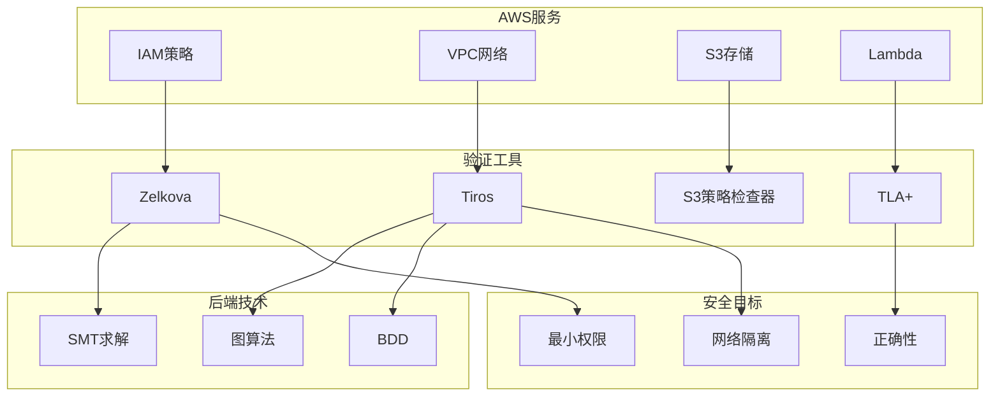
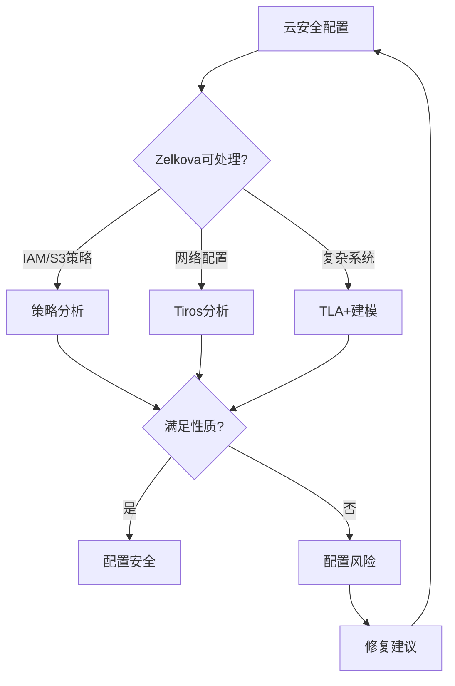
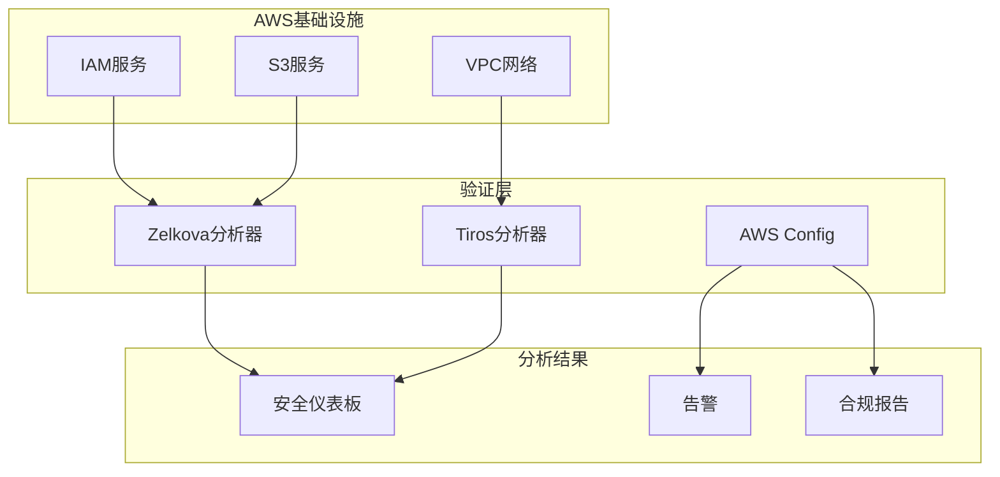
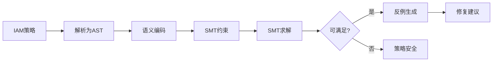
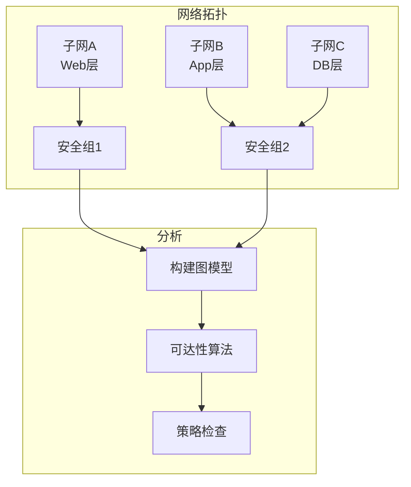

# AWS Zelkova和Tiros

> **所属单元**: Tools/Industrial | **前置依赖**: [SMT求解器](../../05-verification/03-theorem-proving/02-smt-solvers.md) | **形式化等级**: L5

## 1. 概念定义 (Definitions)

### 1.1 AWS形式化方法概述

**Def-T-05-01** (AWS验证工具链)。AWS使用多种形式化方法工具保障服务正确性：

$$\text{AWS Formal Methods} = \{\text{Zelkova}, \text{Tiros}, \text{CBMC}, \text{TLA+}, \ldots\}$$

**Def-T-05-02** (Zelkova定义)。Zelkova是AWS开发的IAM(身份和访问管理)策略分析引擎：

$$\text{Zelkova} = \text{IAM策略语言} + \text{SMT求解} + \text{安全分析}$$

Zelkova自动回答以下问题：

- **可访问性**: 谁可以访问此资源？
- **不可变性**: 此资源是否受保护？
- **等价性**: 两个策略是否语义等价？

### 1.2 IAM策略语义

**Def-T-05-03** (IAM策略模型)。IAM策略是JSON文档，定义访问控制规则：

```json
{
    "Version": "2012-10-17",
    "Statement": [{
        "Effect": "Allow",
        "Principal": {"AWS": "arn:aws:iam::123456789012:user/Alice"},
        "Action": "s3:GetObject",
        "Resource": "arn:aws:s3:::mybucket/*",
        "Condition": {
            "StringEquals": {"aws:sourceIp": "10.0.0.0/8"}
        }
    }]
}
```

**形式化表示**：

$$\text{Policy} = \{ (\text{Effect}, \text{Principal}, \text{Action}, \text{Resource}, \text{Condition}) \}$$

**授权语义**：

$$\text{Authorize}(\text{Request}, \text{PolicySet}) = \begin{cases} \text{Allow} & \text{if } \exists s \in \text{AllowStatements}: \text{Match}(r, s) \\ \text{Deny} & \text{otherwise} \end{cases}$$

### 1.3 Tiros网络分析

**Def-T-05-04** (Tiros定义)。Tiros是AWS网络可达性分析工具：

$$\text{Tiros} = \text{网络拓扑模型} + \text{安全组分析} + \text{可达性查询}$$

**分析能力**：

- **连通性**: 两个端点之间是否存在路径？
- **隔离性**: 子网/安全组是否正确隔离？
- **配置检查**: 路由表、ACL是否正确配置？

## 2. 属性推导 (Properties)

### 2.1 Zelkova分析性质

**Lemma-T-05-01** (策略不可变性检查)。Zelkova验证资源不可变性：

$$\text{Immutable}(\text{Resource}) \Leftrightarrow \forall p: \neg \text{CanModify}(p, \text{Resource})$$

**Lemma-T-05-02** (策略最小性)。Zelkova检测过度授权：

$$\text{Overprivileged}(\text{Policy}) \Leftrightarrow \exists s \in \text{Policy}: \text{Remove}(s) \text{ 不改变安全态势}$$

### 2.2 Tiros网络性质

**Lemma-T-05-03** (网络隔离)。Tiros验证网络隔离：

$$\text{Isolated}(A, B) \Leftrightarrow \nexists \pi: \text{Path}(A, B, \pi)$$

## 3. 关系建立 (Relations)

### 3.1 AWS验证工具生态



### 3.2 云安全验证对比

| 工具 | 目标 | 技术 | 部署方式 |
|------|------|------|----------|
| Zelkova | IAM策略 | SMT | AWS服务内嵌 |
| Tiros | 网络 | 图分析 | AWS内部 |
| AWS Config | 配置合规 | 规则引擎 | 托管服务 |
| IAM Access Analyzer | 外部访问 | Zelkova | 托管服务 |

## 4. 论证过程 (Argumentation)

### 4.1 云安全验证挑战



## 5. 形式证明 / 工程论证 (Proof / Engineering Argument)

### 5.1 IAM策略分析正确性

**Thm-T-05-01** (Zelkova分析可靠性)。Zelkova的策略分析结果是可靠且完备的（在支持的语言子集内）：

$$\text{Zelkova}(P, Q) = \text{PASS} \Leftrightarrow \forall r: \text{Request}: \text{Auth}_P(r) = \text{Auth}_Q(r)$$

### 5.2 网络可达性

**Thm-T-05-02** (Tiros可达性分析)。Tiros正确判定网络可达性：

$$\text{Tiros}(S, T) = \text{REACHABLE} \Leftrightarrow \exists p: \text{NetworkPath}(S, T, p)$$

## 6. 实例验证 (Examples)

### 6.1 Zelkova策略分析

**问题**: 验证S3桶仅允许特定VPC访问

```json
{
    "Version": "2012-10-17",
    "Statement": [{
        "Effect": "Deny",
        "Principal": "*",
        "Action": "s3:*",
        "Resource": "arn:aws:s3:::mybucket/*",
        "Condition": {
            "StringNotEquals": {
                "aws:VpcSourceIp": "10.0.0.0/16"
            }
        }
    }]
}
```

**Zelkova查询**:

```
IsPubliclyAccessible(bucket=mybucket) = false
IsAccessibleFromVPC(bucket=mybucket, vpc=vpc-123) = true
```

### 6.2 Tiros网络分析

**场景**: 验证Web层和数据库层的隔离

```
# Tiros可达性查询
CanReach(
    source={subnet=web-subnet},
    destination={subnet=db-subnet}
) = false

CanReach(
    source={subnet=app-subnet},
    destination={subnet=db-subnet, port=5432}
) = true
```

## 7. 可视化 (Visualizations)

### 7.1 AWS验证架构



### 7.2 IAM策略分析流程



### 7.3 网络可达性分析



## 8. 引用参考 (References)
