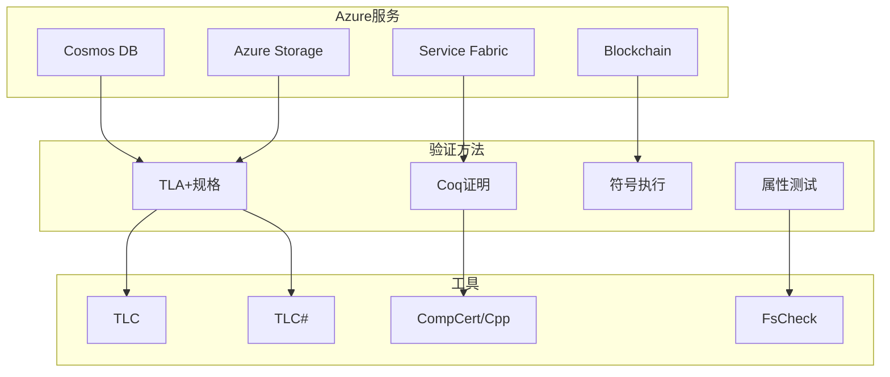
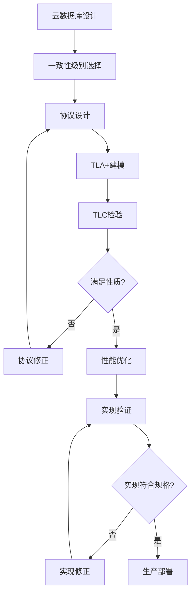
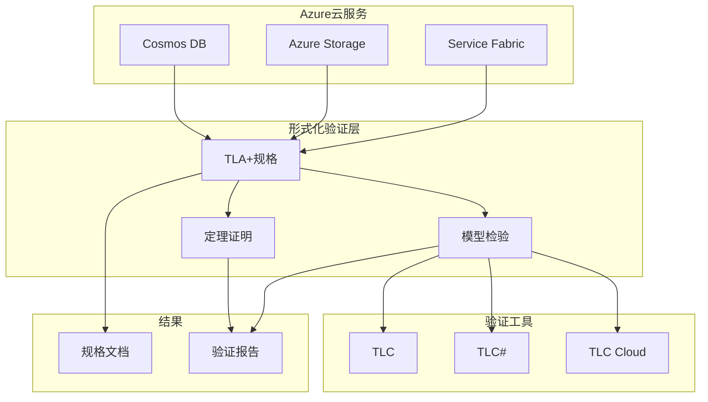
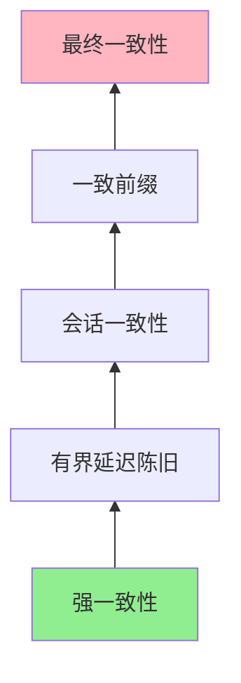
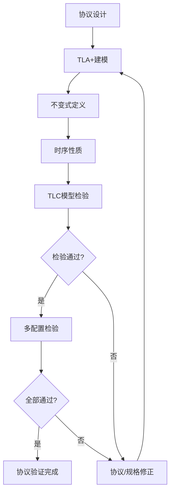

# Azure验证

> **所属单元**: Tools/Industrial | **前置依赖**: [Coq/Isabelle定理证明](../../05-verification/03-theorem-proving/01-coq-isabelle.md) | **形式化等级**: L5

## 1. 概念定义 (Definitions)

### 1.1 Azure形式化验证概述

**Def-T-06-01** (Azure验证策略)。Azure采用多层次形式化验证保障服务可靠性：

$$\text{Azure Verification} = \{\text{TLA+}, \text{Coq}, \text{Symbolic Execution}, \text{Property-Based Testing}\}$$

**核心应用场景**：
- **分布式一致性**: Cosmos DB, Service Fabric
- **存储系统**: Azure Storage
- **智能合约**: Azure Blockchain
- **机密计算**: Azure Confidential Computing

### 1.2 Azure Cosmos DB验证

**Def-T-06-02** (Cosmos DB一致性模型)。Cosmos DB支持可调一致性级别：

| 一致性级别 | 特性 | 形式化目标 |
|------------|------|------------|
| 强一致性 | 线性一致性 | 线性化证明 |
| 有界延迟陈旧 | 延迟有界 | 时序约束验证 |
| 会话一致性 | 单调读/写 | 因果一致性 |
| 一致前缀 | 前缀读 | 日志顺序保持 |
| 最终一致性 | 收敛性 | 收敛时间界限 |

**Def-T-06-03** (TLA+规格)。Cosmos DB使用TLA+规格化复制协议：

```tla
(* Cosmos DB复制协议核心 *)
ReplicaProtocol == 
    /\ LeaderElection
    /\ LogReplication
    /\ ConsistencyGuarantee
```

### 1.3 智能合约验证

**Def-T-06-04** (Azure Blockchain验证)。Azure Blockchain Workbench支持智能合约形式化验证：

- **属性规范**: 合约不变式、权限约束
- **模型检验**: 执行路径探索
- **定理证明**: 关键性质严格证明

## 2. 属性推导 (Properties)

### 2.1 分布式系统性质

**Lemma-T-06-01** (线性化正确性)。Cosmos DB强一致性实现线性一致性：

$$\forall h \in \text{Histories}: \text{Linearizable}(h) \Leftrightarrow \exists s \in \text{Sequential}: h \sqsubseteq s$$

**Lemma-T-06-02** (因果一致性)。会话一致性保证因果一致性：

$$\text{CausallyConsistent}(\text{Session}) \Rightarrow \forall op_i, op_j: op_i \prec op_j \Rightarrow \text{Order}(op_i, op_j)$$

### 2.2 存储系统性质

**Def-T-06-05** (Azure Storage正确性)。Azure Blob存储满足以下性质：

- **持久性**: 写入成功后数据不丢失
- **一致性**: 读操作返回最新写入值
- **可用性**: 故障下仍能服务请求

## 3. 关系建立 (Relations)

### 3.1 Azure验证工具链



### 3.2 与AWS对比

| 维度 | Azure | AWS |
|------|-------|-----|
| 主要方法 | TLA+, Coq | TLA+, SMT |
| 公开文档 | 有限 | 较详细 |
| 开源工具 | TLC# | 部分 |
| 应用范围 | 数据库、存储 | 广泛 |

## 4. 论证过程 (Argumentation)

### 4.1 云数据库验证挑战



## 5. 形式证明 / 工程论证 (Proof / Engineering Argument)

### 5.1 一致性级别正确性

**Thm-T-06-01** (Cosmos DB一致性级别层次)。一致性级别形成严格层次：

$$\text{Strong} \Rightarrow \text{BoundedStaleness} \Rightarrow \text{Session} \Rightarrow \text{ConsistentPrefix} \Rightarrow \text{Eventual}$$

**证明概要**：
1. 强一致性保证线性化
2. 有界延迟陈旧放松时间约束
3. 会话一致性仅保证因果+读写保证
4. 前缀一致性去除单调读
5. 最终一致性仅保证收敛

### 5.2 复制协议安全性

**Thm-T-06-02** (复制协议安全)。Cosmos DB复制协议保证：

$$\text{Committed}(op) \land \neg \text{Failure} \Rightarrow \text{EventuallyReplicated}(op)$$

## 6. 实例验证 (Examples)

### 6.1 Cosmos DB TLA+规格片段

```tla
------------------------------ MODULE CosmosDB -----------------------------
EXTENDS Integers, Sequences, FiniteSets

CONSTANTS Replicas, Keys, Values

VARIABLES
    log,           (* 各副本的日志 *)
    visible,       (* 各副本可见的操作集 *)
    clock          (* 向量时钟 *)

(* 类型不变式 *)
TypeInvariant ==
    /\ log \in [Replicas -> Seq([key: Keys, value: Values, ts: Nat])]
    /\ visible \in [Replicas -> SUBSET Nat]
    /\ clock \in [Replicas -> [Replicas -> Nat]]

(* 单调读: 读取看到的操作集单调增长 *)
MonotonicRead ==
    \A r \in Replicas: 
        visible[r] \subseteq {log[r][i].ts: i \in DOMAIN log[r]}

(* 写入传播: 写操作最终传播到所有副本 *)
WritePropagation ==
    \A r1, r2 \in Replicas:
        \A op \in visible[r1]:
            op \in visible[r2] ~> TRUE
=============================================================================
```

### 6.2 Service Fabric验证

**验证目标**: 有状态服务的副本一致性

```tla
(* 副本状态机 *)
ReplicaStates == {Primary, ActiveSecondary, IdleSecondary, None}

(* 状态转换约束 *)
ValidTransition ==
    /\ Primary -> ActiveSecondary  (* 降级 *)
    /\ ActiveSecondary -> Primary  (* 升级 *)
    /\ IdleSecondary -> ActiveSecondary  (* 激活 *)

(* 副本一致性: 所有ActiveSecondary与Primary一致 *)
ReplicaConsistency ==
    \A r \in Replicas:
        state[r] = ActiveSecondary =>
            data[r] = data[Primary]
```

## 7. 可视化 (Visualizations)

### 7.1 Azure验证架构



### 7.2 一致性级别关系



### 7.3 复制协议验证流程



## 8. 引用参考 (References)

[^1]: D. B. Terry et al., "Managing Update Conflicts in Bayou, a Weakly Connected Replicated Storage System", SOSP 1995. https://doi.org/10.1145/224056.224070

[^2]: M. Burrows, "The Chubby Lock Service for Loosely-Coupled Distributed Systems", OSDI 2006. https://doi.org/10.5555/1298455.1298487

[^3]: P. Bailis et al., "Quantifying Eventual Consistency with PBS", Communications of the ACM, 57(8), 2014. https://doi.org/10.1145/263690.2636902

[^4]: Azure Cosmos DB Documentation, "Consistency Levels in Azure Cosmos DB", https://docs.microsoft.com/en-us/azure/cosmos-db/consistency-levels

[^5]: Azure Service Fabric Documentation, "Service Fabric Architecture", https://docs.microsoft.com/en-us/azure/service-fabric/service-fabric-architecture

[^6]: D. B. Lomet et al., "Unbundling Transaction Services in the Cloud", CIDR 2009.

[^7]: M. J. Fischer et al., "Impossibility of Distributed Consensus with One Faulty Process", Journal of the ACM, 32(2), 1985. https://doi.org/10.1145/3149.214121
