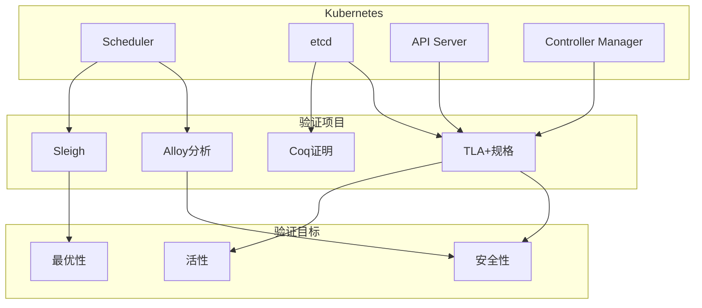
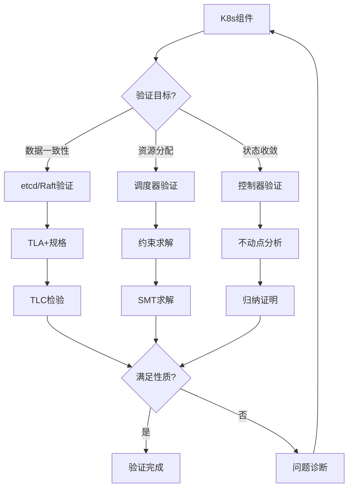
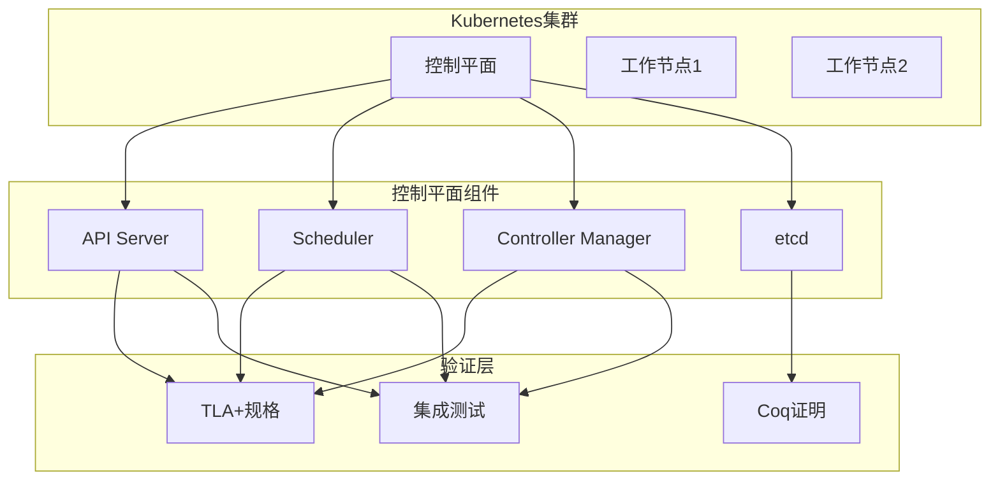
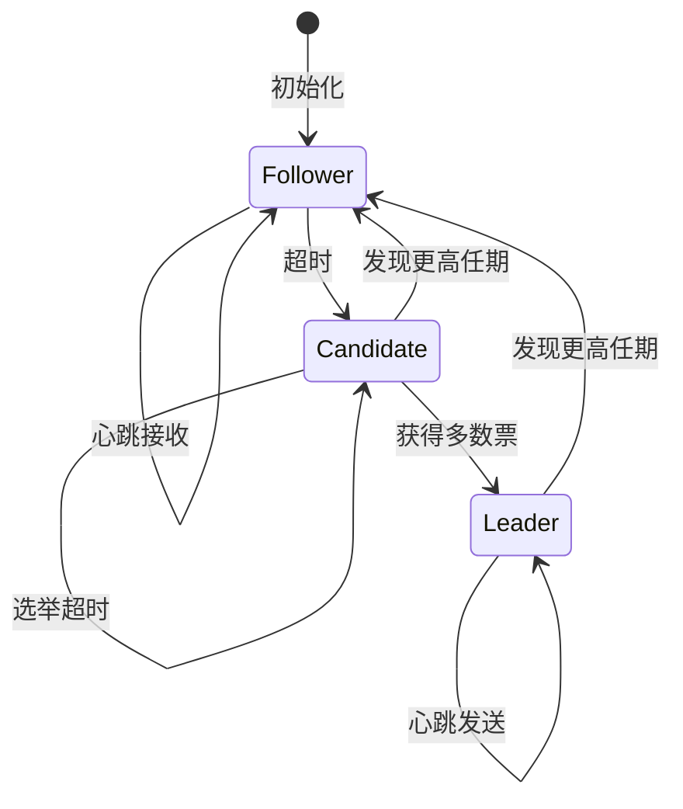
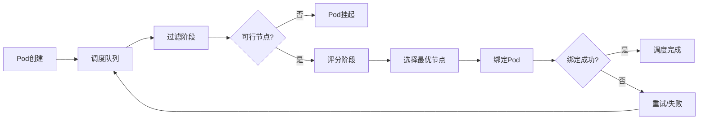

# Google Kubernetes验证

> **所属单元**: Tools/Industrial | **前置依赖**: [Azure验证](./02-azure-verification.md) | **形式化等级**: L5

## 1. 概念定义 (Definitions)

### 1.1 Kubernetes形式化验证概述

**Def-T-07-01** (K8s验证目标)。Kubernetes形式化验证聚焦于调度正确性和状态一致性：

$$\text{K8s Verification} = \{\text{Scheduler}, \text{etcd}, \text{API Server}, \text{Controller Manager}\}$$

**Def-T-07-02** (调度器验证)。Kubernetes调度器的形式化验证：

$$\text{Scheduler} = (\text{Nodes}, \text{Pods}, \text{Predicates}, \text{Priorities}, \text{Binding})$$

调度正确性要求：
- **可行性**: 所有被调度Pod满足资源约束
- **最优性**: 在满足约束下优化目标函数
- **终止性**: 调度决策在有限时间内完成

### 1.2 etcd一致性验证

**Def-T-07-03** (etcd定义)。etcd是Kubernetes的后备存储，使用Raft一致性算法：

$$\text{etcd} = \text{Raft算法} + \text{MVCC} + \text{Watch机制}$$

**验证目标**：
- **线性一致性**: 读操作返回最新写入
- **持久性**: 已提交写入不丢失
- **可用性**: 多数派存活时可用

**Def-T-07-04** (Raft形式化规格)。Raft核心组件：

```tla
RaftProtocol ==
    /\ LeaderElection
    /\ LogReplication
    /\ Safety
    /\ Liveness
```

### 1.3 Kubernetes控制平面

**Def-T-07-05** (控制平面验证)。控制平面的形式化验证包括：

| 组件 | 验证目标 | 方法 |
|------|----------|------|
| API Server | 请求处理正确性 | TLA+ |
| Controller Manager | 收敛性 | TLA+ |
| Scheduler | 最优调度 | Alloy/SMT |
| etcd | 一致性 | Coq/TLA+ |

## 2. 属性推导 (Properties)

### 2.1 调度器性质

**Lemma-T-07-01** (调度可行性)。调度器仅将Pod分配到满足约束的节点：

$$\text{Schedule}(p, n) \Rightarrow \forall \text{pred} \in \text{Predicates}: \text{pred}(p, n) = \text{true}$$

**Lemma-T-07-02** (调度竞争自由)。调度器保证Pod不被重复调度：

$$\text{Scheduled}(p) \Rightarrow \neg \exists n_1 \neq n_2: \text{Bound}(p, n_1) \land \text{Bound}(p, n_2)$$

### 2.2 etcd一致性性质

**Lemma-T-07-03** (Raft状态机安全)。Raft保证所有节点按相同顺序应用日志：

$$\forall i: \text{Committed}(\text{entry}_i) \Rightarrow \forall j \leq i: \text{Applied}(\text{entry}_j)$$

**Lemma-T-07-04** (Leader完备性)。已提交条目存在于所有未来Leader的日志中：

$$\text{Committed}(e, T) \land \text{Leader}(L, T') \land T' > T \Rightarrow e \in \text{Log}(L)$$

## 3. 关系建立 (Relations)

### 3.1 Kubernetes验证生态



### 3.2 与云提供商对比

| 云提供商 | K8s验证重点 | 公开程度 |
|----------|-------------|----------|
| Google | etcd/Raft, 调度器 | 部分开源 |
| AWS | EKS集成, 网络 | 较少 |
| Azure | AKS控制平面 | 有限 |
| 开源社区 | 通用验证 | 活跃 |

## 4. 论证过程 (Argumentation)

### 4.1 Kubernetes验证挑战



## 5. 形式证明 / 工程论证 (Proof / Engineering Argument)

### 5.1 调度器正确性

**Thm-T-07-01** (调度器正确性)。Kubernetes调度器生成的分配满足所有硬约束：

$$\forall p \in \text{ScheduledPods}, \forall n = \text{Schedule}(p): \text{Feasible}(p, n)$$

**证明要点**：
1. 调度器仅考虑通过所有Predicates的节点
2. 绑定前再次验证约束
3. 原子操作确保一致性

### 5.2 etcd线性一致性

**Thm-T-07-02** (etcd线性一致性)。etcd实现线性一致性：

$$\forall r_1, r_2: \text{Complete}(r_1) \prec \text{Start}(r_2) \Rightarrow r_1 \prec_{real} r_2$$

**证明结构**：
1. Raft保证日志顺序一致
2. Leader读保证最新值
3. 多数派确认确保可见性

## 6. 实例验证 (Examples)

### 6.1 etcd Raft TLA+规格

```tla
------------------------------ MODULE Raft -----------------------------
EXTENDS Integers, Sequences, FiniteSets, TLC

CONSTANTS Servers, MaxLogLength

VARIABLES
    currentTerm,    (* 各服务器当前任期 *)
    state,          (* 状态: Leader, Follower, Candidate *)
    log,            (* 日志条目 *)
    commitIndex     (* 已提交日志索引 *)

(* 状态机安全: 已提交条目不会被覆盖 *)
StateMachineSafety ==
    \A i, j \in Servers:
        \A n \in 1..commitIndex[i]:
            /\ n \leq Len(log[i])
            /\ n \leq Len(log[j])
            => log[i][n] = log[j][n]

(* Leader完备性: 已提交条目存在于未来Leader日志 *)
LeaderCompleteness ==
    \A i \in Servers:
        state[i] = "Leader" =>
            \A j \in Servers:
                \A n \in 1..commitIndex[j]:
                    /\ n \leq Len(log[i])
                    /\ log[i][n] = log[j][n]

(* 选举安全: 每个任期最多一个Leader *)
ElectionSafety ==
    \A i, j \in Servers:
        /\ state[i] = "Leader"
        /\ state[j] = "Leader"
        /\ currentTerm[i] = currentTerm[j]
        => i = j
=============================================================================
```

### 6.2 调度器约束验证

```tla
(* 调度器约束检查 *)
ScheduleConstraint ==
    /\ NodeAffinity     (* 节点选择器 *)
    /\ PodAffinity      (* Pod亲和性 *)
    /\ PodAntiAffinity  (* Pod反亲和性 *)
    /\ ResourceFit      (* 资源适配 *)
    /\ TaintsTolerations (* 污点容忍 *)

(* 资源适配示例 *)
ResourceFit(pod, node) ==
    /\ pod.cpuReq \leq node.cpuAvail
    /\ pod.memReq \leq node.memAvail
    /\ pod.gpuReq \leq node.gpuAvail
```

## 7. 可视化 (Visualizations)

### 7.1 Kubernetes验证架构



### 7.2 Raft协议状态机



### 7.3 调度流程验证



## 8. 引用参考 (References)

[^1]: D. Ongaro and J. Ousterhout, "In Search of an Understandable Consensus Algorithm", USENIX ATC, 2014. https://doi.org/10.5555/2643634.2643666

[^2]: B. Burns et al., "Borg, Omega, and Kubernetes", Communications of the ACM, 59(5), 2016. https://doi.org/10.1145/2890784

[^3]: M. Schwarzkopf et al., "Omega: Flexible, Scalable Schedulers for Large Compute Clusters", EuroSys 2013. https://doi.org/10.1145/2465351.2465386

[^4]: Kubernetes Documentation, "Scheduling Framework", https://kubernetes.io/docs/concepts/scheduling-eviction/scheduling-framework/

[^5]: etcd Documentation, "etcd Raft Consensus", https://etcd.io/docs/v3.5/learning/raft/

[^6]: H. Howard et al., "Raft Refloated: Do We Have Consensus?", Operating Systems Review, 49(1), 2015. https://doi.org/10.1145/2723872.2723876

[^7]: C. D. Richards, "Verifying the Kubernetes Scheduler Using TLA+", Master Thesis, 2019.
