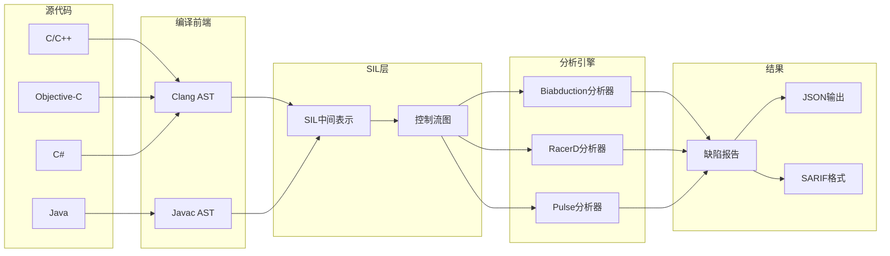
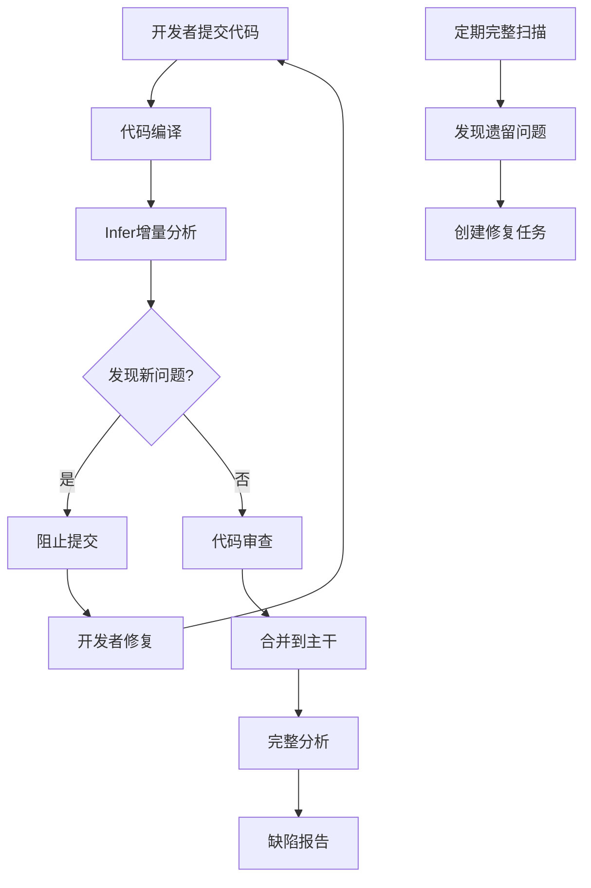
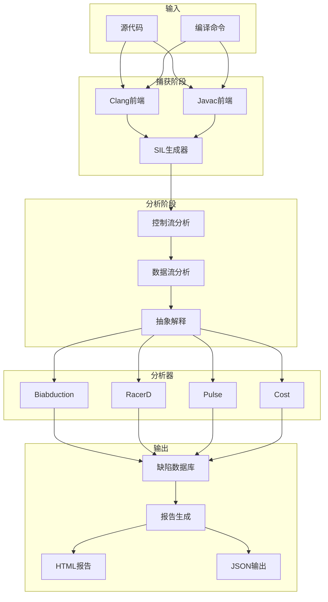
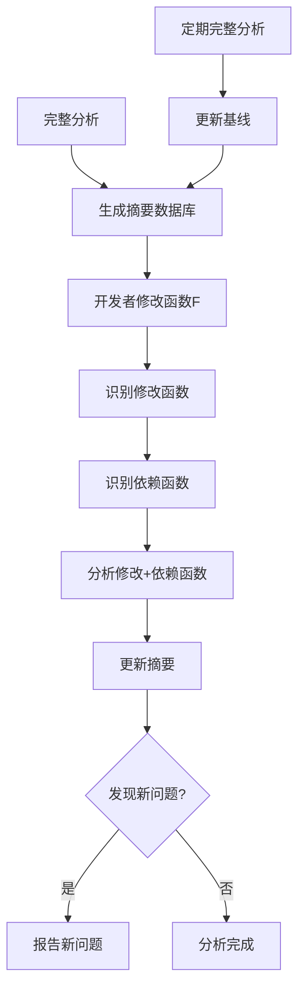

# Facebook Infer

> **所属单元**: Tools/Industrial | **前置依赖**: [霍尔逻辑](../../05-verification/02-techniques/01-hoare-logic.md) | **形式化等级**: L3

## 1. 概念定义 (Definitions)

### 1.1 Infer概述

**Def-T-08-01** (Infer定义)。Infer是Facebook开发的静态程序分析工具，专注于发现代码缺陷：

$$\text{Infer} = \text{分离逻辑分析器} + \text{抽象解释器} + \text{增量分析引擎} + \text{多语言支持}$$

**核心能力**：

- **内存安全**: 空指针、内存泄漏、资源释放
- **并发安全**: 竞态条件、死锁
- **代码质量**: 不可达代码、性能问题
- **多语言**: C/C++, Objective-C, Java, C#

**设计目标**：

- 低误报率（< 10%）
- 可扩展至千万行代码
- 与CI/CD集成
- 增量分析支持

**Def-T-08-02** (分离逻辑基础)。Infer基于分离逻辑(Separation Logic)进行堆推理：

$$P * Q \triangleq \text{heap can be split into two disjoint parts satisfying } P \text{ and } Q$$

**关键推理规则**：

- **Frame Rule**: 在验证局部性质时自动保持框架条件
- **Smallfoot**: 自动化堆推理的基础算法

### 1.2 分析器架构

**Def-T-08-03** (Infer分析流程)。Infer的分析流程：

$$\text{Source} \xrightarrow{\text{编译器前端}} \text{SIL} \xrightarrow{\text{分析引擎}} \text{分析结果}$$

**SIL (Simple Intermediate Language)**：

- 统一的中间表示
- 命令式结构
- 显式内存访问

**Def-T-08-04** (摘要系统)。Infer使用过程摘要进行模块化分析：

$$\text{Summary}(f) = (\text{Preconditions}, \text{Postconditions}, \text{Error Conditions})$$

**摘要特性**：

- 可复用：相同上下文不重复分析
- 可组合：调用者使用被调用者摘要
- 增量：仅重新分析修改的函数

### 1.3 分析器类型

**Def-T-08-05** (内置分析器)。Infer提供多种专业分析器：

| 分析器 | 目标语言 | 检测问题 |
|--------|----------|----------|
| biabduction | C/C++/Java/OC | 内存错误、空指针、资源泄漏 |
| RacerD | Java/C++ | 竞态条件、线程安全问题 |
| Pulse | C++ | 生命周期、空指针解引用 |
| Cost | Java | 时间/空间复杂度分析 |
| Quandary | Java | 信息流/污点分析 |
| Linters | 多语言 | 代码风格、API误用 |

## 2. 属性推导 (Properties)

### 2.1 分析精度特征

**Lemma-T-08-01** (分离逻辑精度)。分离逻辑在堆形状分析上的精度：

$$\text{Precision}_{SL} = \frac{|\text{真实漏洞}|}{|\text{报告问题}|} > 0.85 \quad \text{(工业部署统计)}$$

**精度来源**：

- 精确的堆别名推理
- 强更新（strong update）
- 过程摘要复用

### 2.2 增量分析性能

**Def-T-08-06** (增量分析速度)。修改单个函数时的分析时间：

$$T_{incremental} = O(|modified\ functions| + |dependencies|) \ll T_{full}$$

**性能数据**：

- 完整分析：数小时（千万行代码）
- 增量分析：秒级到分钟级

## 3. 关系建立 (Relations)

### 3.1 Infer工具链



### 3.2 静态分析工具对比

| 特性 | Infer | Coverity | SonarQube | Clang Static Analyzer | PMD |
|------|-------|----------|-----------|----------------------|-----|
| 深度分析 | 分离逻辑 | 符号执行 | 模式匹配 | 符号执行 | 模式匹配 |
| 误报率 | 低(~5%) | 低(~10%) | 中等 | 中等 | 高 |
| 增量分析 | 原生支持 | 有限 | 有限 | 不支持 | 支持 |
| CI集成 | 优秀 | 良好 | 良好 | 良好 | 良好 |
| 开源 | 是 | 否 | 部分 | 是 | 是 |
| 成本 | 免费 | 商业 | 商业/开源 | 免费 | 免费 |

## 4. 论证过程 (Argumentation)

### 4.1 CI/CD集成工作流



### 4.2 典型应用场景

**适用场景**：

- 大型C/C++代码库（如Facebook移动应用）
- 需要低误报率的CI集成
- 内存安全关键模块
- 遗留代码质量改进

**不适用场景**：

- 需要形式化正确性证明
- 复杂并发协议验证
- 算法级功能正确性

## 5. 形式证明 / 工程论证 (Proof / Engineering Argument)

### 5.1 Biabduction原理

**Thm-T-08-01** (Biabduction完备性)。对于分离逻辑片段，biabduction算法：

$$\text{Given } \{P\}C\{?\}, \text{Infer computes } Q \text{ s.t. } \vdash \{P\}C\{Q\}$$

**Thm-T-08-02** (摘要组合性)。过程摘要支持组合推理：

$$\text{Summary}(f) \circ \text{Summary}(g) = \text{Summary}(f \circ g)$$

### 5.2 分离逻辑推理

**Frame Rule**（框架规则）：

$$\frac{\{P\} C \{Q\}}{\{P * R\} C \{Q * R\}} \quad \text{if } \text{mod}(C) \cap \text{fv}(R) = \emptyset$$

这是Infer实现模块化分析的理论基础。

## 6. 实例验证 (Examples)

### 6.1 Infer安装配置

**安装方式**：

```bash
# macOS (Homebrew)
brew install infer

# Linux (预编译二进制)
VERSION=1.1.0
curl -sSL "https://github.com/facebook/infer/releases/download/v${VERSION}/infer-linux64-v${VERSION}.tar.xz" \
  | tar -C /opt -xJ
ln -s "/opt/infer-linux64-v${VERSION}/bin/infer" /usr/local/bin/infer

# 验证安装
infer --version
```

**基本使用**：

```bash
# 分析C/C++项目（使用编译命令捕获）
infer capture -- make
cd infer-out && infer analyze

# 分析Java项目（Maven）
infer run -- mvn compile

# 分析Gradle项目
infer run -- ./gradlew build

# 增量分析
infer run --incremental -- make

# 查看结果
infer explore --html
```

### 6.2 内存错误检测示例

**示例代码**（`memory_bug.c`）：

```c
#include <stdlib.h>

// 空指针解引用
void null_deref(int *p) {
    int x = *p;  // Infer报告：空指针解引用
}

// 内存泄漏
void memory_leak() {
    int *p = malloc(sizeof(int));
    *p = 42;
    // 缺少free(p)
}

// 使用已释放内存
void use_after_free() {
    int *p = malloc(sizeof(int));
    free(p);
    *p = 42;  // Infer报告：使用已释放内存
}

// 双释放
void double_free() {
    int *p = malloc(sizeof(int));
    free(p);
    free(p);  // Infer报告：双释放
}

// 资源泄漏（文件）
void resource_leak() {
    FILE *f = fopen("test.txt", "r");
    // 缺少fclose(f)
}
```

**Infer输出**：

```
Found 5 issues

memory_bug.c:5: error: NULL_DEREFERENCE
  pointer `p` last assigned on line 4 could be null and is dereferenced at line 5.

memory_bug.c:11: error: MEMORY_LEAK
  memory dynamically allocated by call to `malloc()` at line 10 is not reachable after line 11.

memory_bug.c:17: error: USE_AFTER_FREE
  pointer `p` was freed by call to `free()` at line 16 and is used at line 17.

memory_bug.c:23: error: DOUBLE_FREE
  pointer `p` was freed by call to `free()` at line 22 and is freed again at line 23.

memory_bug.c:29: error: RESOURCE_LEAK
  resource acquired by call to `fopen()` at line 28 is not released after line 29.
```

### 6.3 并发错误检测（RacerD）

**示例代码**（`race_condition.java`）：

```java
public class Account {
    private int balance = 0;
    private final Object lock = new Object();

    // 竞态条件：未同步访问
    public void unsafeDeposit(int amount) {
        balance += amount;  // RacerD报告：竞态条件
    }

    // 正确同步
    public void safeDeposit(int amount) {
        synchronized (lock) {
            balance += amount;
        }
    }

    // 潜在死锁
    public void transfer(Account other, int amount) {
        synchronized (this) {
            synchronized (other) {  // RacerD报告：潜在死锁
                this.balance -= amount;
                other.balance += amount;
            }
        }
    }

    // 死锁解决方案：统一锁顺序
    private static final Object globalLock = new Object();
    public void safeTransfer(Account other, int amount) {
        Account first = this.hashCode() < other.hashCode() ? this : other;
        Account second = this.hashCode() < other.hashCode() ? other : this;
        synchronized (first) {
            synchronized (second) {
                this.balance -= amount;
                other.balance += amount;
            }
        }
    }
}
```

**运行RacerD**：

```bash
infer run --racerd-only -- javac Account.java
```

### 6.4 CI/CD集成配置

**GitHub Actions配置**（`.github/workflows/infer.yml`）：

```yaml
name: Infer Static Analysis

on: [push, pull_request]

jobs:
  infer:
    runs-on: ubuntu-latest
    steps:
    - uses: actions/checkout@v3

    - name: Setup Infer
      run: |
        VERSION=1.1.0
        curl -sSL "https://github.com/facebook/infer/releases/download/v${VERSION}/infer-linux64-v${VERSION}.tar.xz" \
          | tar -C /opt -xJ
        echo "/opt/infer-linux64-v${VERSION}/bin" >> $GITHUB_PATH

    - name: Setup Java
      uses: actions/setup-java@v3
      with:
        java-version: '11'
        distribution: 'temurin'

    - name: Build and Analyze
      run: |
        infer run -- mvn clean compile

    - name: Check for New Issues
      run: |
        if [ -s infer-out/bugs.txt ]; then
          cat infer-out/bugs.txt
          exit 1
        fi

    - name: Upload Results
      uses: actions/upload-artifact@v3
      if: failure()
      with:
        name: infer-report
        path: infer-out/
```

### 6.5 自定义分析器扩展

**AL（Analyzer Language）示例**：

```python
# 定义自定义检查：禁止特定API调用
# .inferconfig
{
  "bo_field": {
    "banned_apis": [
      {
        "class": "java.lang.System",
        "method": "exit",
        "message": "System.exit should not be called in production code"
      },
      {
        "class": "java.lang.Runtime",
        "method": "exec",
        "message": "Runtime.exec is dangerous, use ProcessBuilder instead"
      }
    ]
  }
}
```

**Infer选项配置**：

```bash
# 配置文件（.inferconfig）
{
  "skip-analysis-in-path": ["test/", "generated/"],
  "skip-translation": [".pb.cc", ".pb.h"],
  "eradicate": true,
  "racerd": true,
  "biabduction": true,
  "quandary": true,
  "pulse": true
}
```

## 7. 可视化 (Visualizations)

### 7.1 Infer架构



### 7.2 增量分析流程



### 7.3 分离逻辑堆推理

```mermaid
graph LR
    subgraph 堆状态
        H1[x|->3 * y|->5]
        H2[x|->3 * y|->7]
        H3[x|->4 * y|->5]
    end

    subgraph 操作
        Op1[*y = 7]
        Op2[*x = 4]
    end

    subgraph 推理
        Frame1[Frame: x|->3]
        Frame2[Frame: y|->5]
    end

    H1 --> Op1
    Op1 --> H2
    H1 --> Frame1
    Frame1 --> Op1

    H1 --> Op2
    Op2 --> H3
    H1 --> Frame2
    Frame2 --> Op2
```

## 8. 引用参考 (References)
