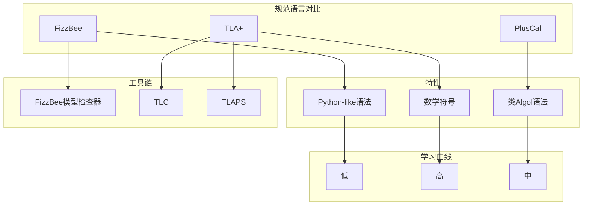
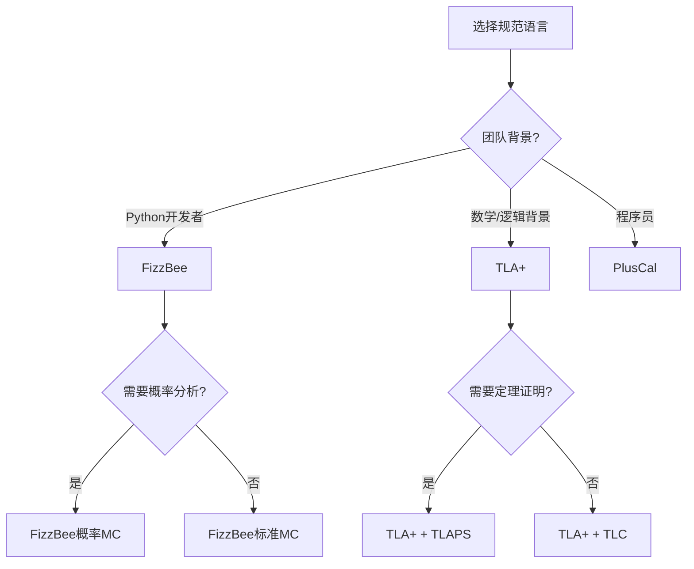
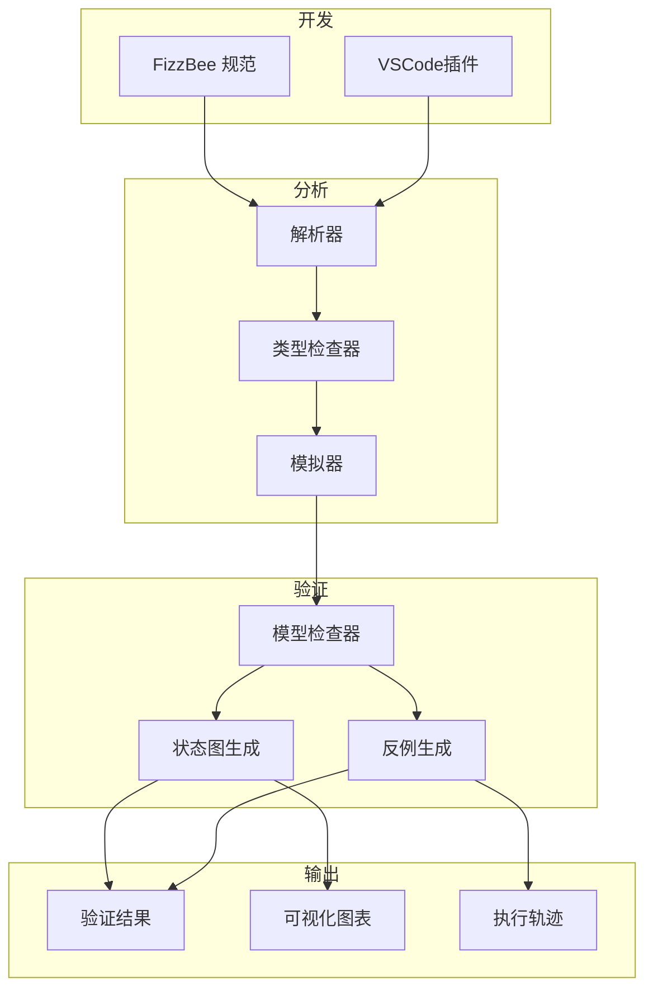
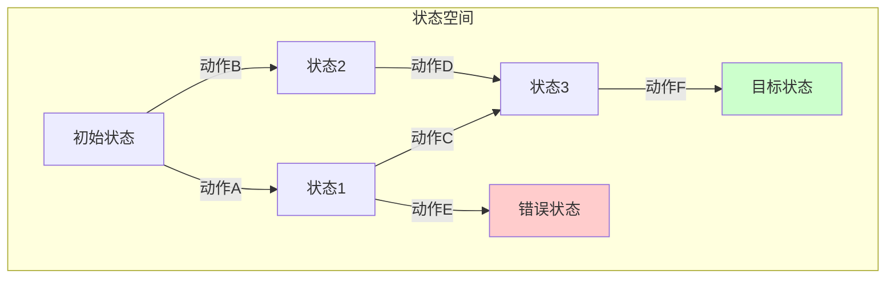

# FizzBee: 分布式系统友好型规范语言

> **所属单元**: Tools/Industrial | **形式化等级**: L5
>
> **版本**: v1.0 | **创建日期**: 2026-04-10

---

## 1. 概念定义 (Definitions)

### 1.1 FizzBee 设计目标

**Def-I-06-01** (FizzBee). FizzBee 是由 Google 前工程师开发的分布式系统规范语言和模型检查器，旨在作为 TLA+ 的更友好替代：

$$\text{FizzBee} = \langle \mathcal{L}_{\text{python-like}}, \mathcal{S}_{\text{state-machine}}, \mathcal{C}_{\text{model-checker}}, \mathcal{P}_{\text{probabilistic}} \rangle$$

其中：

- $\mathcal{L}_{\text{python-like}}$: 类似 Python 的语法
- $\mathcal{S}_{\text{state-machine}}$: 状态机语义
- $\mathcal{C}_{\text{model-checker}}$: 内置模型检查器
- $\mathcal{P}_{\text{probabilistic}}$: 概率模型检查支持

**Def-I-06-02** (友好性设计原则). FizzBee 采用以下设计原则降低形式化方法的学习曲线：

1. **熟悉的语法**: 类似 Python 的语法，降低入门门槛
2. **渐进式复杂度**: 从简单示例到复杂系统的平滑过渡
3. **即时反馈**: 快速模型检查提供即时验证反馈
4. **可视化集成**: 内置状态图和时序图生成

### 1.2 核心语言特性

**Def-I-06-03** (状态机规范). FizzBee 规范由状态、动作和不变式组成：

```fizz
# FizzBee 状态机示例
role Node:
  state: str = "Follower"
  term: int = 0

  action BecomeCandidate:
    if state == "Follower":
      state = "Candidate"
      term += 1

  invariant StateValid:
    return state in ["Follower", "Candidate", "Leader"]
```

**Def-I-06-04** (角色模型). FizzBee 使用角色 (role) 建模分布式系统中的不同实体：

```fizz
role Client:
  request_id: int = 0

  action SendRequest:
    request_id += 1
    Server.Receive(request_id)

role Server:
  queue: list = []

  action Receive(req_id):
    queue.append(req_id)
```

**Def-I-06-05** (概率行为). FizzBee 原生支持概率模型检查：

```fizz
action MaybeFail:
  # 以 0.1 概率失败
  if fair_coin(0.1):
    state = "Failed"
  else:
    state = "Active"
```

---

## 2. 属性推导 (Properties)

### 2.1 验证能力

**Lemma-I-06-01** (状态空间覆盖). FizzBee 模型检查器在有限状态空间内提供穷举覆盖：

$$\forall s \in \mathcal{S}_{\text{reachable}}: \text{Checker}(s) \neq \text{ERROR}$$

**Lemma-I-06-02** (概率验证). 对于概率规范，FizzBee 提供概率时序逻辑 (PCTL) 验证：

$$\mathcal{M}, s_0 \models P_{\geq p}[\phi \, U \, \psi]$$

其中 $\mathcal{M}$ 是马尔可夫决策过程，$\phi \, U \, \psi$ 是直到公式。

### 2.2 与 TLA+ 的关系

**Prop-I-06-01** (表达能力等价). FizzBee 在表达分布式系统规范方面与 TLA+ 等价。

*论证*. FizzBee 的状态机语义可编码为 TLA+ 的动作，反之亦然。两者都基于状态转换的形式化模型。∎

---

## 3. 关系建立 (Relations)

### 3.1 FizzBee vs TLA+ 对比



| 特性 | FizzBee | TLA+ | PlusCal |
|------|---------|------|---------|
| **语法风格** | Python-like | 数学符号 | 类Pascal |
| **学习曲线** | 低 | 高 | 中 |
| **模型检查** | 内置 | TLC (外部) | TLC (外部) |
| **概率验证** | 原生支持 | 需扩展 | 不支持 |
| **可视化** | 内置 | 有限 | 有限 |
| **社区规模** | 新兴 | 成熟 | 成熟 |
| **工业应用** | 增长中 | 广泛 (AWS/Azure) | 有限 |

### 3.2 适用场景决策



---

## 4. 论证过程 (Argumentation)

### 4.1 设计决策分析

**决策 1: Python-like 语法**

- **优势**: 降低形式化方法的入门门槛，Python 是数据科学和 ML 的主流语言
- **权衡**: 数学表达力略逊于 TLA+ 的数学符号

**决策 2: 内置模型检查器**

- **优势**: 开箱即用，无需配置 TLC
- **权衡**: 优化程度可能不及多年发展的 TLC

**决策 3: 概率扩展**

- **优势**: 原生支持随机算法和故障模型
- **应用场景**: 共识算法、负载均衡、故障注入

### 4.2 成熟度评估

| 维度 | FizzBee | TLA+ | 评估 |
|------|---------|------|------|
| **语言稳定性** | ⚠️ 发展中 | ✅ 成熟 | TLA+ 30年历史 |
| **工具成熟度** | ⚠️ v0.x | ✅ 稳定 | FizzBee 仍在迭代 |
| **社区支持** | ⚠️ 小型 | ✅ 活跃 | TLA+ Foundation |
| **文档完善** | ✅ 良好 | ✅ 优秀 | FizzBee 文档清晰 |
| **工业案例** | ⚠️ 有限 | ✅ 丰富 | AWS/Microsoft/Google |

---

## 5. 形式证明 / 工程论证 (Proof / Engineering Argument)

### 5.1 FizzBee 语义基础

**Thm-I-06-01** (FizzBee 到 Kripke 结构的编码). 每个 FizzBee 规范可编码为 Kripke 结构：

$$\mathcal{K}_{\text{FizzBee}} = \langle S, S_0, R, L \rangle$$

其中：

- $S$: 状态空间（所有角色状态的组合）
- $S_0$: 初始状态集合
- $R \subseteq S \times S$: 转移关系（动作应用的结果）
- $L: S \to 2^{AP}$: 标签函数（状态谓词的真值）

*构造证明*:

1. **状态**: 每个角色的字段定义状态变量，全局状态是各角色状态的笛卡尔积
2. **转移**: 动作定义状态转移，守卫条件确定可执行性
3. **初始**: `init` 块或默认值定义 $S_0$
4. **标签**: 不变式和状态谓词定义 $L$ ∎

### 5.2 验证正确性

**Thm-I-06-02** (模型检查的可靠性). FizzBee 模型检查器报告的不变式违反是真实存在的。

$$\text{FizzBee.Check}(\text{Spec}, \text{Inv}) = \text{VIOLATED} \Rightarrow \exists \sigma: \sigma \not\models \text{Inv}$$

其中 $\sigma$ 是具体的状态序列（反例）。

---

## 6. 实例验证 (Examples)

### 6.1 简单互斥协议

```fizz
# FizzBee 互斥协议规范
MAX_TICKET = 10

role Process:
  ticket: int = -1  # -1 表示未请求

  init:
    ticket = -1

  action Request:
    # 请求进入临界区
    if ticket == -1:
      ticket = global_next_ticket
      global_next_ticket = (global_next_ticket + 1) % MAX_TICKET

  action Enter:
    # 进入临界区（如果有最小票号）
    if ticket >= 0 and ticket == min_active_ticket():
      state = "Critical"

  action Exit:
    # 退出临界区
    if state == "Critical":
      state = "Idle"
      ticket = -1

# 全局状态
global_next_ticket: int = 0

def min_active_ticket() -> int:
  active = [p.ticket for p in processes if p.ticket >= 0]
  return min(active) if active else -1

# 不变式：互斥
invariant MutualExclusion:
  in_critical = sum(1 for p in processes if p.state == "Critical")
  return in_critical <= 1

# 不变式：票号有效
invariant ValidTicket:
  for p in processes:
    if p.ticket >= 0 and p.ticket >= MAX_TICKET:
      return False
  return True
```

### 6.2 Raft 共识简化模型

```fizz
# FizzBee Raft 共识简化模型
role Node:
  state: str = "Follower"  # Follower, Candidate, Leader
  term: int = 0
  voted_for: str = None
  log: list = []
  commit_index: int = 0

  # 选举超时（概率性）
  action StartElection:
    if state == "Follower" and fair_coin(0.1):
      state = "Candidate"
      term += 1
      voted_for = self.id
      # 发送 RequestVote RPC
      for peer in peers:
        peer.ReceiveVoteRequest(self.id, term)

  action ReceiveVoteRequest(candidate_id, candidate_term):
    if candidate_term > term:
      term = candidate_term
      state = "Follower"
      voted_for = None

    if candidate_term == term and (voted_for is None or voted_for == candidate_id):
      voted_for = candidate_id

  action BecomeLeader:
    if state == "Candidate" and votes_received > len(peers) / 2:
      state = "Leader"

  action AppendEntries:
    if state == "Leader":
      for peer in peers:
        peer.ReceiveAppendEntries(term, log)

# 安全性不变式
invariant LeaderCompleteness:
  # 已提交的条目存在于所有未来 Leader 的日志中
  for node in nodes:
    if node.state == "Leader":
      for entry in committed_entries:
        if entry not in node.log:
          return False
  return True

invariant ElectionSafety:
  # 每个任期最多一个 Leader
  leaders = [n for n in nodes if n.state == "Leader"]
  terms = set(n.term for n in leaders)
  return len(leaders) == len(terms)
```

### 6.3 概率故障模型

```fizz
# 概率性网络分区模型
role Network:
  partitions: dict = {}  # 节点 -> 分区ID

  action Partition:
    # 以 0.05 概率发生网络分区
    if fair_coin(0.05):
      # 将节点随机分成两组
      nodes = list(all_nodes)
      random.shuffle(nodes)
      mid = len(nodes) // 2
      for i, node in enumerate(nodes):
        partitions[node] = 0 if i < mid else 1

  action Heal:
    # 以 0.1 概率网络恢复
    if fair_coin(0.1):
      partitions = {}

  def can_communicate(n1, n2) -> bool:
    return partitions.get(n1, 0) == partitions.get(n2, 0)

# 验证：在分区情况下系统的可用性
property AvailabilityUnderPartition:
  # 在少数分区中，系统保持可用
  # PCTL: P >= 0.9 [true U (request_served)]
  pass
```

### 6.4 与 TLA+ 对比：同一规范

**FizzBee 版本**:

```fizz
role Counter:
  value: int = 0

  action Increment:
    value += 1

  action Decrement:
    value -= 1

invariant ValueInRange:
  return -10 <= value <= 10
```

**TLA+ 等价版本**:

```tla
MODULE Counter
EXTENDS Integers

VARIABLE value

Init == value = 0

Increment == value' = value + 1

Decrement == value' = value - 1

Next == Increment \/ Decrement

Invariant == -10 <= value /\ value <= 10
```

---

## 7. 可视化 (Visualizations)

### 7.1 FizzBee 工具链



### 7.2 状态空间探索



---

## 8. 最新研究进展 (2024-2025)

### 8.1 FizzBee 版本更新

| 版本 | 发布日期 | 关键特性 |
|------|---------|---------|
| **v0.1** | 2024-Q1 | 初始发布，基础状态机支持 |
| **v0.2** | 2024-Q2 | 概率模型检查 |
| **v0.3** | 2024-Q3 | 性能优化，更大状态空间 |
| **v0.4** | 2025-Q1 | LTL 性质检查，可视化改进 |
| **v0.5** | 2025-Q2 | 模块系统，代码复用 |

### 8.2 社区与生态系统

| 资源 | 链接 | 描述 |
|------|------|------|
| **官方网站** | <https://fizzbee.io/> | 主页与文档 |
| **GitHub** | <https://github.com/fizzbee-io/fizzbee> | 开源代码 |
| **教程** | <https://fizzbee.io/tutorials/> | 入门教程 |
| **示例库** | GitHub examples/ | 协议规范示例 |

---

## 9. 引用参考


---

> **相关文档**: [TLA+](../academic/04-tla-toolbox.md) | [分布式系统验证](../04-application-layer/03-cloud-native/02-kubernetes-verification.md) | [AWS TLA+案例](01-aws-zelkova-tiros.md)
>
> **外部链接**: [FizzBee 官网](https://fizzbee.io/) | [FizzBee GitHub](https://github.com/fizzbee-io/fizzbee)
