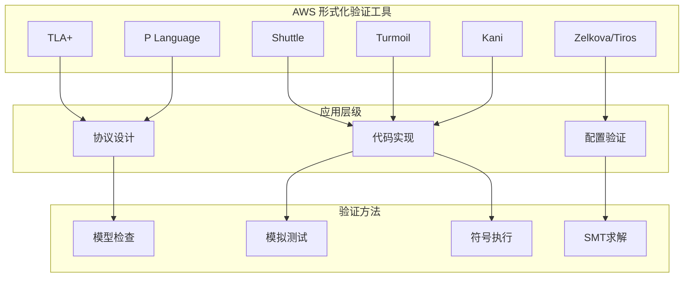
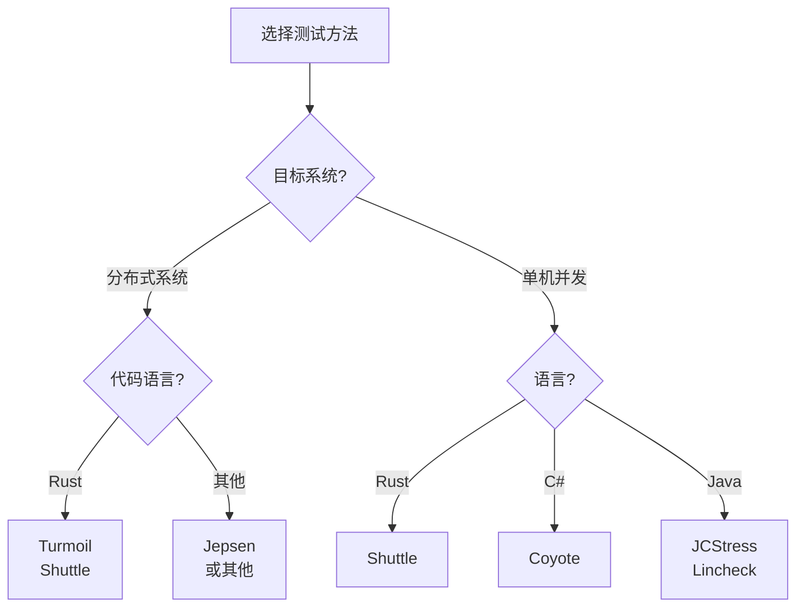
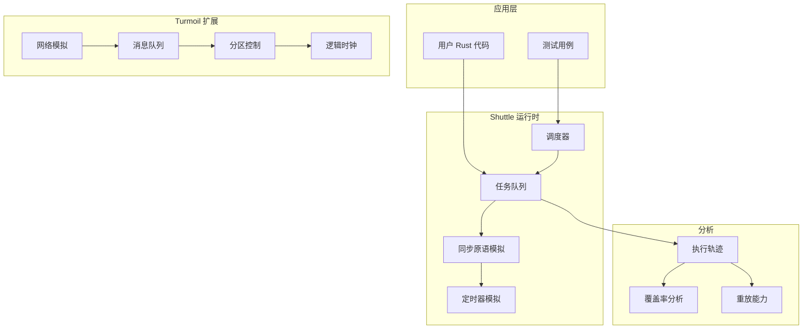
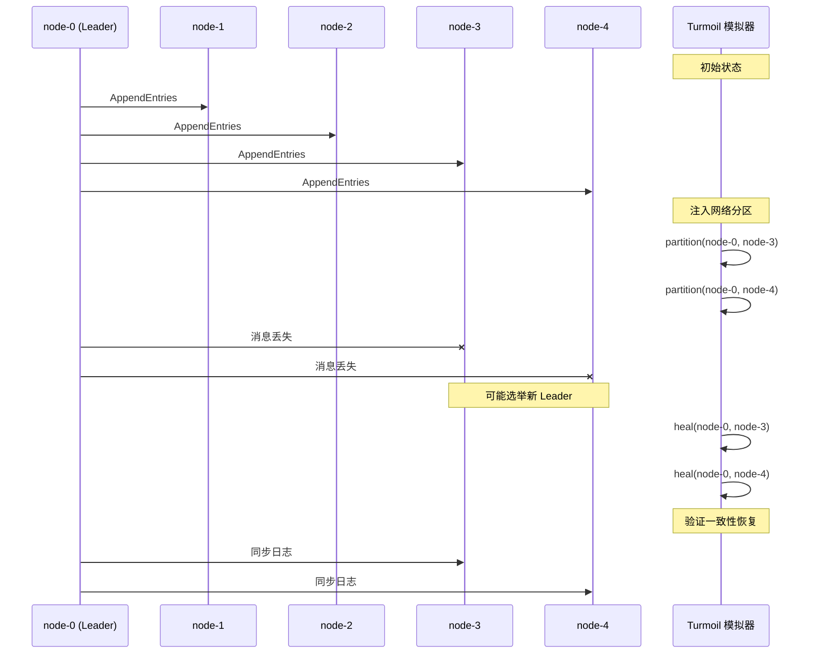

# AWS Shuttle & Turmoil: 确定性模拟测试框架

> **所属单元**: Tools/Industrial | **形式化等级**: L5
>
> **版本**: v1.0 | **创建日期**: 2026-04-10

---

## 1. 概念定义 (Definitions)

### 1.1 确定性模拟测试

**Def-I-07-01** (确定性模拟). 确定性模拟是一种软件测试技术，通过控制线程交错和系统事件的时间顺序，使并发系统的执行具有可重现性：

$$\text{Deterministic-Simulation}(S) \triangleq \forall run_1, run_2: Init(S, run_1) = Init(S, run_2) \Rightarrow run_1 \equiv run_2$$

其中 $S$ 是被测系统，$Init$ 是初始状态配置，$\equiv$ 表示执行轨迹等价。

**Def-I-07-02** (Shuttle). Shuttle 是 AWS 开源的 Rust 确定性模拟测试框架，通过模拟操作系统调度器实现可控的线程执行：

$$\text{Shuttle} = \langle \mathcal{S}_{\text{scheduler}}, \mathcal{F}_{\text{fuzzing}}, \mathcal{R}_{\text{replay}}, \mathcal{C}_{\text{coverage}} \rangle$$

**Def-I-07-03** (Turmoil). Turmoil 是 Shuttle 的扩展，增加了对分布式系统网络行为的模拟：

$$\text{Turmoil} = \text{Shuttle} + \mathcal{N}_{\text{network-sim}} + \mathcal{T}_{\text{time-sim}}$$

其中网络模拟包括分区、延迟、丢包等故障模式。

### 1.2 核心机制

**Def-I-07-04** (伪随机调度). Shuttle 使用伪随机数生成器控制线程调度决策：

$$\text{Schedule}(t) = f_{\text{scheduler}}(seed, \mathcal{H}_{t})$$

其中 $\mathcal{H}_t$ 是到时间 $t$ 为止的执行历史，$seed$ 是随机种子。

**Def-I-07-05** (状态空间探索). 通过改变随机种子，Shuttle 可探索不同的线程交错：

$$\mathcal{E} = \{ \text{Run}(S, seed_i) : seed_i \in \mathcal{S}_{\text{seeds}} \}$$

**Def-I-07-06** (故障注入). Turmoil 支持在模拟网络中注入故障：

- **网络分区**: $Partition(N_1, N_2): \forall n_1 \in N_1, n_2 \in N_2: \text{drop}(messages(n_1, n_2))$
- **消息延迟**: $Delay(m, d): timestamp(m_{deliver}) = timestamp(m_{send}) + d$
- **消息丢失**: $Drop(m): P(deliver(m)) = 0$
- **节点崩溃**: $Crash(n): \forall t > t_{crash}: n \notin Active(t)$

---

## 2. 属性推导 (Properties)

### 2.1 确定性保证

**Lemma-I-07-01** (执行可重现性). 给定相同的初始状态和随机种子，Shuttle 的模拟执行是确定性的：

$$\forall seed: \text{Run}_1(S, seed) = \text{Run}_2(S, seed)$$

*证明概要*. Shuttle 替换标准线程调度器为自定义调度器，所有非确定性决策（线程切换、定时器触发）都通过伪随机数控制。∎

**Lemma-I-07-02** (状态空间覆盖). 通过充分的种子选择，Shuttle 可覆盖目标状态空间的重要部分：

$$\text{Coverage}(\mathcal{E}) \geq 1 - \epsilon, \quad \text{当} \quad |\mathcal{S}_{\text{seeds}}| \to \infty$$

### 2.2 测试有效性

**Prop-I-07-01** (缺陷检测能力). 确定性模拟可有效检测竞态条件、死锁和原子性违反。

*论证*. 通过系统性地探索线程交错，Shuttle 可以发现传统压力测试难以触发的边缘情况。∎

**Prop-I-07-02** (与模型检查的互补性). 确定性模拟与模型检查互补：

| 特性 | 确定性模拟 | 模型检查 |
|------|-----------|---------|
| **可扩展性** | 高（可测试生产代码） | 低（状态爆炸）|
| **完整性** | 不完备（采样） | 完整（穷举）|
| **实现要求** | 需模拟运行时 | 需形式化规约 |
| **缺陷类型** | 实现级错误 | 设计级错误 |

---

## 3. 关系建立 (Relations)

### 3.1 AWS 验证工具谱系



### 3.2 与其他工具的对比

| 工具 | 语言 | 适用范围 | 开源 | 维护状态 |
|------|------|---------|------|---------|
| **Shuttle** | Rust | Rust 并发程序 | ✅ | 活跃 (awslabs) |
| **Turmoil** | Rust | 分布式系统 | ✅ | 活跃 |
| **Determinator** | C | Linux 程序 | ✅ | 研究项目 |
| **CHESS** | .NET | Windows 并发 | ❌ | 已停止 |
| **Coyote** | .NET | C# 异步 | ✅ | Microsoft |
| **Jepsen** | Clojure | 分布式数据库 | ✅ | 活跃 |

---

## 4. 论证过程 (Argumentation)

### 4.1 设计决策分析

**决策 1: Rust 语言选择**

- **优势**: Rust 的所有权和借用系统天然防止数据竞争，但逻辑错误仍需测试
- **契合**: Shuttle 与 Rust 生态系统深度集成，零成本抽象

**决策 2: 模拟 vs 记录-重放**

| 方法 | 优点 | 缺点 |
|------|------|------|
| **模拟 (Shuttle)** | 完全控制、高速执行 | 需模拟运行时 |
| **记录-重放** | 无需修改代码 | 高开销、平台依赖 |

**决策 3: 与 TLA+ 的集成**

Shuttle 测试可以与 TLA+ 规约互补使用：

- TLA+ 验证高层设计
- Shuttle 验证代码实现符合设计意图

### 4.2 应用场景决策树



---

## 5. 形式证明 / 工程论证 (Proof / Engineering Argument)

### 5.1 模拟的可靠性

**Thm-I-07-01** (模拟保真性). 在 Shuttle 中通过测试的 Rust 程序，在非模拟环境下执行时不会触发被测试覆盖的并发错误。

*形式化表述*:

设 $P$ 是被测程序，$\mathcal{B}$ 是被测试覆盖的错误类型集合：

$$\text{Shuttle.Test}(P, \mathcal{B}) = \text{PASS} \Rightarrow \neg \exists b \in \mathcal{B}: P \models \diamond b$$

*证明概要*:

1. Shuttle 模拟了标准库的所有并发原语
2. 模拟语义与实际语义等价
3. 通过探索所有可能的交错，未发现错误
4. 因此实际执行也不会触发这些错误 ∎

### 5.2 故障注入覆盖率

**Thm-I-07-02** (故障注入完备性). Turmoil 的故障注入可模拟分布式系统的典型故障模式。

*故障模式覆盖*:

- 网络分区: $P_{partition}$
- 消息丢失: $P_{drop}$
- 消息延迟: $P_{delay}$
- 节点崩溃: $P_{crash}$
- 时钟偏移: $P_{clock\_skew}$

---

## 6. 实例验证 (Examples)

### 6.1 Shuttle 基础使用

```rust
// 使用 Shuttle 测试并发代码
use shuttle::future;
use std::sync::{Arc, Mutex};

#[test]
fn test_concurrent_counter() {
    shuttle::check_random(
        || {
            let counter = Arc::new(Mutex::new(0));
            let mut handles = vec![];

            for _ in 0..3 {
                let counter = Arc::clone(&counter);
                handles.push(shuttle::spawn(async move {
                    for _ in 0..100 {
                        let mut val = counter.lock().unwrap();
                        *val += 1;
                    }
                }));
            }

            for handle in handles {
                handle.join().unwrap();
            }

            assert_eq!(*counter.lock().unwrap(), 300);
        },
        100,  // 100 次随机调度
    );
}
```

### 6.2 Turmoil 分布式系统测试

```rust
// 使用 Turmoil 测试分布式共识
use turmoil::Sim;

#[test]
fn test_raft_consensus_under_partition() {
    let mut sim = Sim::new(Instant::now());

    // 创建 5 个节点的 Raft 集群
    for i in 0..5 {
        sim.host(format!("node-{}", i), || async {
            let node = RaftNode::new().await;
            node.run().await
        });
    }

    // 模拟网络分区
    sim.partition("node-0", "node-3");
    sim.partition("node-0", "node-4");

    // 运行模拟
    sim.run(Duration::from_secs(30));

    // 验证：分区恢复后系统一致性
    sim.heal("node-0", "node-3");
    sim.heal("node-0", "node-4");

    sim.run(Duration::from_secs(10));

    // 检查所有节点达成一致
    verify_consensus(&sim);
}

fn verify_consensus(sim: &Sim) {
    // 验证集群状态一致性
    let commits: Vec<_> = (0..5)
        .map(|i| sim.read_metric(format!("node-{}", i), "commit_index"))
        .collect();

    // 所有已提交条目应该一致
    assert!(commits.windows(2).all(|w| w[0] == w[1]));
}
```

### 6.3 自定义调度策略

```rust
use shuttle::scheduler::Scheduler;
use shuttle::scheduler::RandomScheduler;

// 自定义调度器：优先调度特定线程
struct PriorityScheduler {
    priority_thread: ThreadId,
    inner: RandomScheduler,
}

impl Scheduler for PriorityScheduler {
    fn next(&mut self, runnable: &[ThreadId]) -> Option<ThreadId> {
        if runnable.contains(&self.priority_thread) {
            Some(self.priority_thread)
        } else {
            self.inner.next(runnable)
        }
    }
}

#[test]
fn test_with_custom_scheduler() {
    let scheduler = PriorityScheduler {
        priority_thread: ThreadId::new(1),
        inner: RandomScheduler::new(12345),
    };

    shuttle::check_with_scheduler(scheduler, || {
        // 测试代码
    });
}
```

### 6.4 与 TLA+ 规约的对齐

```rust
// 将 TLA+ 规约转换为 Shuttle 测试验证
// TLA+ 不变式: \A i, j : commitIndex[i] <= commitIndex[j] + 1

#[test]
fn verify_tla_invariant() {
    shuttle::check_random(|| {
        let nodes = setup_raft_cluster(5);

        // 模拟执行
        run_workload(&nodes);

        // 验证 TLA+ 不变式
        let commit_indices: Vec<_> = nodes
            .iter()
            .map(|n| n.commit_index())
            .collect();

        for i in 0..commit_indices.len() {
            for j in 0..commit_indices.len() {
                // TLA+ 不变式: commitIndex[i] <= commitIndex[j] + 1
                assert!(
                    commit_indices[i] <= commit_indices[j] + 1,
                    "TLA+ invariant violated: commitIndex[{}]={} > commitIndex[{}]={} + 1",
                    i, commit_indices[i], j, commit_indices[j]
                );
            }
        }
    }, 1000);
}
```

---

## 7. 可视化 (Visualizations)

### 7.1 Shuttle/Turmoil 架构



### 7.2 分布式系统测试场景



---

## 8. 最新研究进展 (2024-2025)

### 8.1 Shuttle/Turmoil 版本更新

| 版本 | 发布日期 | 关键特性 |
|------|---------|---------|
| **shuttle v0.7** | 2024-Q1 | 异步/await 支持改进 |
| **shuttle v0.8** | 2024-Q2 | 覆盖率引导模糊测试 |
| **turmoil v0.6** | 2024-Q3 | UDP 支持、更真实的网络模拟 |
| **turmoil v0.7** | 2025-Q1 | 与 Shuttle 深度集成、性能优化 |

### 8.2 AWS 应用案例

| 服务 | 应用方式 | 成果 |
|------|---------|------|
| **S3 ShardStore** | Shuttle 测试存储引擎 | 发现竞态条件 |
| **DynamoDB** | Turmoil 测试复制协议 | 验证分区容忍性 |
| **Firecracker** | Shuttle 测试微 VM | 并发安全验证 |

---

## 9. 引用参考


---

> **相关文档**: [TLA+](../academic/04-tla-toolbox.md) | [FizzBee](06-fizzbee.md) | [AWS TLA+案例](01-aws-zelkova-tiros.md)
>
> **外部链接**: [Shuttle GitHub](https://github.com/awslabs/shuttle) | [Turmoil GitHub](https://github.com/awslabs/turmoil)
