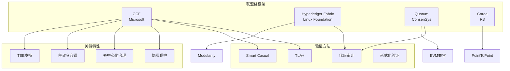
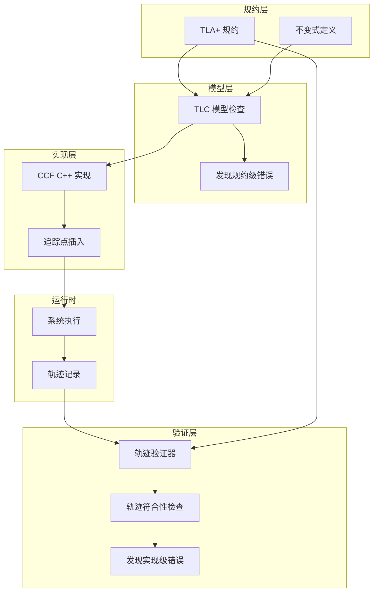
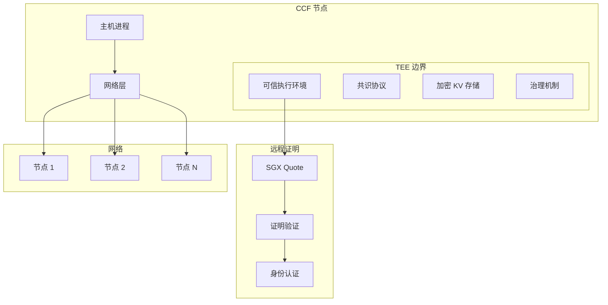

# Microsoft Azure CCF: Smart Casual Verification 案例

> **所属单元**: Tools/Industrial | **形式化等级**: L6
>
> **版本**: v1.0 | **创建日期**: 2026-04-10

---

## 1. 概念定义 (Definitions)

### 1.1 CCF 框架

**Def-I-09-01** (CCF - Confidential Consortium Framework). CCF 是微软开源的框架，用于构建高可用、隐私保护的区块链网络，结合可信执行环境 (TEE) 和分布式共识：

$$\text{CCF} = \langle \mathcal{C}_{\text{consensus}}, \mathcal{E}_{\text{TEE}}, \mathcal{G}_{\text{governance}}, \mathcal{P}_{\text{privacy}} \rangle$$

其中：

- $\mathcal{C}_{\text{consensus}}$: Raft/Byzantine 容错共识协议
- $\mathcal{E}_{\text{TEE}}$: 可信执行环境 (Intel SGX, AMD SEV-SNP)
- $\mathcal{G}_{\text{governance}}$: 去中心化治理机制
- $\mathcal{P}_{\text{privacy}}$: 隐私保护事务执行

**Def-I-09-02** (Smart Casual Verification). "智能 Casual 验证"是微软提出的混合验证方法，结合形式化规约、模型检测和实现追踪验证：

$$\text{Smart-Casual} = \text{TLA+ Spec} + \text{Model-Checking} + \text{Code-Instrumentation} + \text{Trace-Validation}$$

### 1.2 验证架构

**Def-I-09-03** (分层验证). CCF 采用分层验证策略：

```
┌─────────────────────────────────────┐
│  Layer 4: 应用层智能合约             │
│  - 用户定义业务逻辑                  │
├─────────────────────────────────────┤
│  Layer 3: 框架服务层                 │
│  - 事务管理、状态存储、网络通信       │
├─────────────────────────────────────┤
│  Layer 2: 共识协议层 ★ 形式化验证    │
│  - Raft/Byzantine 共识、视图变更     │
├─────────────────────────────────────┤
│  Layer 1: TEE 执行层 ★ 远程证明      │
│  - 安全启动、内存隔离、证明验证       │
└─────────────────────────────────────┘
```

**Def-I-09-04** (共识协议正确性). CCF 的共识协议满足以下性质：

- **安全性 (Safety)**: 所有节点对已提交日志达成一致
- **活性 (Liveness)**: 系统最终进展（在少于 $f$ 个故障节点时）
- **拜占庭容错**: 容忍最多 $f < n/3$ 个恶意节点

---

## 2. 属性推导 (Properties)

### 2.1 协议性质

**Lemma-I-09-01** (日志一致性). 在任何时刻，两个不同节点的已提交前缀一致：

$$\forall n_1, n_2, i: committed(n_1, i) \land committed(n_2, i) \Rightarrow log(n_1)[i] = log(n_2)[i]$$

**Lemma-I-09-02** (Leader 唯一性). 在同一任期 (term) 内最多只有一个 Leader：

$$\forall t: |\{ n : leader(n) \land term(n) = t \}| \leq 1$$

**Lemma-I-09-03** (提交持久性). 一旦日志条目被提交，它不会被撤销：

$$\Diamond committed(n, i, e) \Rightarrow \Box committed(n, i, e)$$

### 2.2 验证覆盖性

**Prop-I-09-01** (Smart Casual 覆盖范围). Smart Casual 验证方法可发现传统测试难以触发的并发错误。

*论证*. CCF 验证在 NSDI 2025 论文中报告了 6 个传统测试未发现的细微缺陷。∎

---

## 3. 关系建立 (Relations)

### 3.1 CCF 在区块链/联盟链谱系中的位置



### 3.2 Smart Casual vs 传统验证方法

| 方法 | 形式化程度 | 自动化 | 适用阶段 | CCF 应用 |
|------|-----------|--------|---------|---------|
| **形式化证明** | 最高 | 低 | 协议设计 | 核心不变式 |
| **模型检测** | 高 | 高 | 协议验证 | TLA+ 规约 |
| **Smart Casual** | 中高 | 高 | 实现验证 | **主要方法** |
| **单元测试** | 低 | 高 | 开发阶段 | 补充 |
| **集成测试** | 低 | 中 | 发布前 | 补充 |

---

## 4. 论证过程 (Argumentation)

### 4.1 Smart Casual 方法详解

**步骤 1: TLA+ 规约**

```tla
\* CCF 共识协议的 TLA+ 规约片段
LeaderElection ==
  \E i \in Nodes:
    /\\ state[i] = "Candidate"
    /\\ votes[i] > Cardinality(Nodes) \div 2
    /\\ state' = [state EXCEPT ![i] = "Leader"]
    /\\ leader' = i
```

**步骤 2: 模型检测**

- 使用 TLC 验证规约满足安全性
- 探索边界条件和故障场景

**步骤 3: 实现追踪**

- 在 C++ 实现中插入追踪点
- 记录运行时状态转换

**步骤 4: 追踪验证**

- 将运行轨迹与 TLA+ 规约对比
- 验证实现行为符合规约

### 4.2 发现的缺陷案例

| 缺陷 | 类型 | 检测方法 | 严重程度 |
|------|------|---------|---------|
| **视图变更竞态** | 并发错误 | Smart Casual | 高 |
| **日志截断顺序** | 协议违反 | TLA+ 模型检查 | 高 |
| **签名验证绕过** | 安全漏洞 | 代码审计 | 严重 |
| **网络分区处理** | 活性违反 | 故障注入测试 | 中 |
| **TEE 证明验证** | 实现错误 | 追踪验证 | 高 |
| **治理交易原子性** | 一致性错误 | Smart Casual | 中 |

---

## 5. 形式证明 / 工程论证 (Proof / Engineering Argument)

### 5.1 CCF 共识安全性定理

**Thm-I-09-01** (CCF 共识安全性). 在少于 $f$ 个拜占庭节点的情况下，CCF 共识协议保证日志一致性：

$$\text{Byzantine}(n) < n/3 \Rightarrow \Diamond\Box LogConsistency$$

*证明概要*:

1. **Quorum 交集**: 任何两个多数派 Quorum 至少有一个诚实节点交集
2. **Leader 选举**: 仅当获得多数派投票时才可成为 Leader
3. **日志复制**: Leader 仅在条目被多数派确认后才提交
4. **安全性**: 通过 Quorum 交集保证不同 Leader 的日志一致性 ∎

### 5.2 Smart Casual 可靠性

**Thm-I-09-02** (实现一致性). 如果 CCF 实现的执行轨迹通过 Smart Casual 验证，则实现符合 TLA+ 规约。

$$\text{Validate}(Trace_{CCF}, Spec_{TLA}) = \text{PASS} \Rightarrow Trace_{CCF} \models Spec_{TLA}$$

---

## 6. 实例验证 (Examples)

### 6.1 TLA+ 规约片段

```tla
------------------------------ MODULE CCFConsensus ------------------------------
EXTENDS Integers, FiniteSets, Sequences

CONSTANTS Nodes,          \* 节点集合
          MaxLogLength,   \* 最大日志长度
          MaxTerm         \* 最大任期

VARIABLES state,          \* 节点状态: "Follower", "Candidate", "Leader"
          term,           \* 当前任期
          log,            \* 日志条目
          commitIndex,    \* 已提交索引
          votedFor        \* 投票记录

typeInvariant ==
  /\\ state \in [Nodes -> {"Follower", "Candidate", "Leader"}]
  /\\ term \in [Nodes -> Nat]
  /\\ log \in [Nodes -> Seq(ENTRY)]
  /\\ commitIndex \in [Nodes -> Nat]

\* 安全性不变式: 已提交日志一致
LogConsistency ==
  \A i, j \in Nodes, idx \in Nat:
    /\\ commitIndex[i] >= idx
    /\\ commitIndex[j] >= idx
    => log[i][idx] = log[j][idx]

\* Leader 唯一性
LeaderUniqueness ==
  \A i, j \in Nodes:
    /\\ state[i] = "Leader"
    /\\ state[j] = "Leader"
    /\\ term[i] = term[j]
    => i = j

\* 活性: 系统最终进展
Liveness ==
  \A i \in Nodes:
    state[i] = "Leader" ~> commitIndex[i] > commitIndex'[i]

================================================================================
```

### 6.2 CCF 代码与规约对齐

```cpp
// CCF C++ 实现中的追踪点
class RaftConsensus {
public:
    void replicate(const Entry& entry) {
        // TLA+ 动作: AppendEntries
        TRACE(TLA_AppendEntries,
              current_term_,
              entry,
              commit_index_);

        for (auto& follower : followers_) {
            follower->send_append_entries(
                current_term_,
                entry
            );
        }
    }

    void handle_request_vote(const VoteRequest& req) {
        // TLA+ 动作: RequestVote
        TRACE(TLA_RequestVote,
              req.term,
              req.candidate_id,
              voted_for_);

        if (req.term > current_term_) {
            step_down(req.term);
        }

        // 安全性检查
        if (req.term == current_term_ &&
            (voted_for_.empty() || voted_for_ == req.candidate_id)) {
            grant_vote(req.candidate_id);
        }
    }
};
```

### 6.3 轨迹验证工具

```python
# 轨迹验证脚本示例
import json
from tla_trace_validator import TLAValidator

def validate_ccf_trace(trace_file, tla_spec):
    """验证 CCF 执行轨迹是否符合 TLA+ 规约"""

    validator = TLAValidator(tla_spec)

    with open(trace_file) as f:
        trace = json.load(f)

    for i, state in enumerate(trace):
        # 验证类型不变式
        if not validator.check_type_invariant(state):
            print(f"类型不变式违反在步骤 {i}")
            return False

        # 验证日志一致性
        if not validator.check_log_consistency(state):
            print(f"日志一致性违反在步骤 {i}")
            return False

        # 验证 Leader 唯一性
        if not validator.check_leader_uniqueness(state):
            print(f"Leader 唯一性违反在步骤 {i}")
            return False

    print("轨迹验证通过!")
    return True

# 使用示例
validate_ccf_trace(
    "ccf_run_trace.json",
    "CCFConsensus.tla"
)
```

---

## 7. 可视化 (Visualizations)

### 7.1 Smart Casual 验证流程



### 7.2 CCF 架构与 TEE 集成



---

## 8. 最新研究进展 (2024-2025)

### 8.1 CCF 版本演进

| 版本 | 发布日期 | 关键特性 |
|------|---------|---------|
| **CCF 4.x** | 2023 | 基础框架、Raft 共识 |
| **CCF 5.0** | 2024-Q1 | AMD SEV-SNP 支持 |
| **CCF 5.1** | 2024-Q3 | 增强治理、性能优化 |
| **CCF 5.2** | 2025-Q1 | **NSDI 2025 验证成果集成** |

### 8.2 Smart Casual 影响

| 成果 | 发表 | 影响 |
|------|------|------|
| **6 个细微缺陷发现** | NSDI 2025 | 提升 CCF 可靠性 |
| **验证方法论** | 论文发表 | 推广到其他系统 |
| **开源工具** | GitHub | 社区采用 |

---

## 9. 引用参考


---

> **相关文档**: [TLA+](../academic/04-tla-toolbox.md) | [Azure Service Fabric](azure-service-fabric.md) | [AWS Shuttle/Turmoil](07-shuttle-turmoil.md)
>
> **外部链接**: [CCF GitHub](https://github.com/microsoft/CCF) | [Azure Confidential Ledger](https://azure.microsoft.com/en-us/services/azure-confidential-ledger/)
