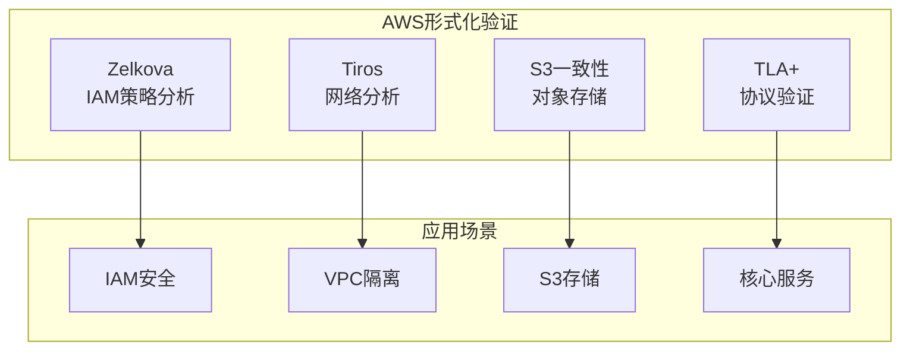
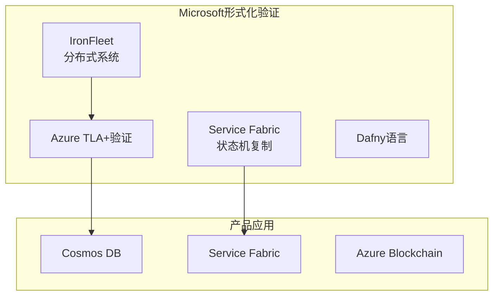
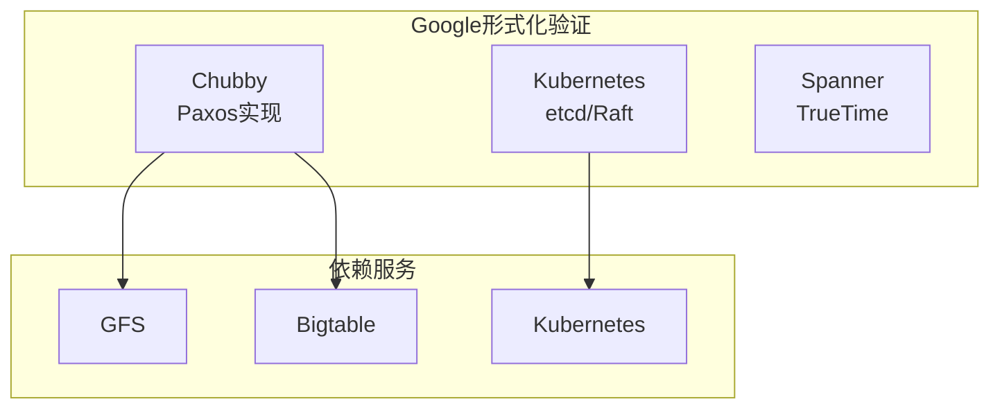
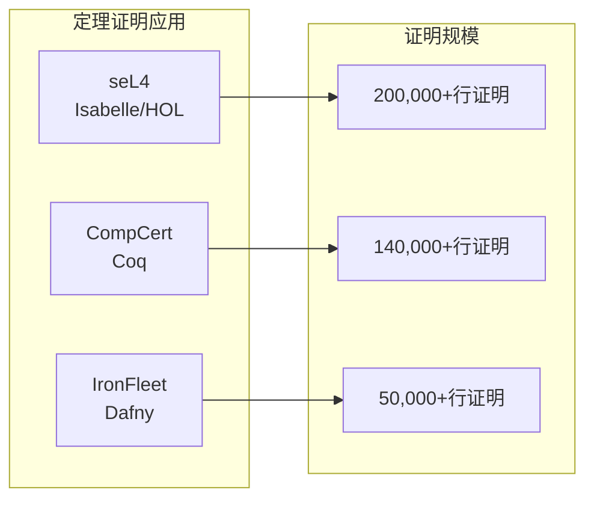
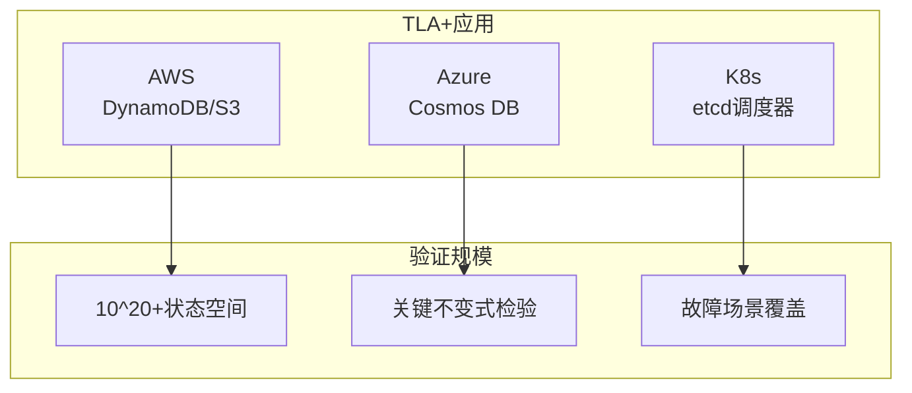
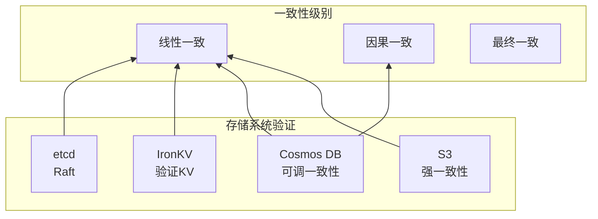
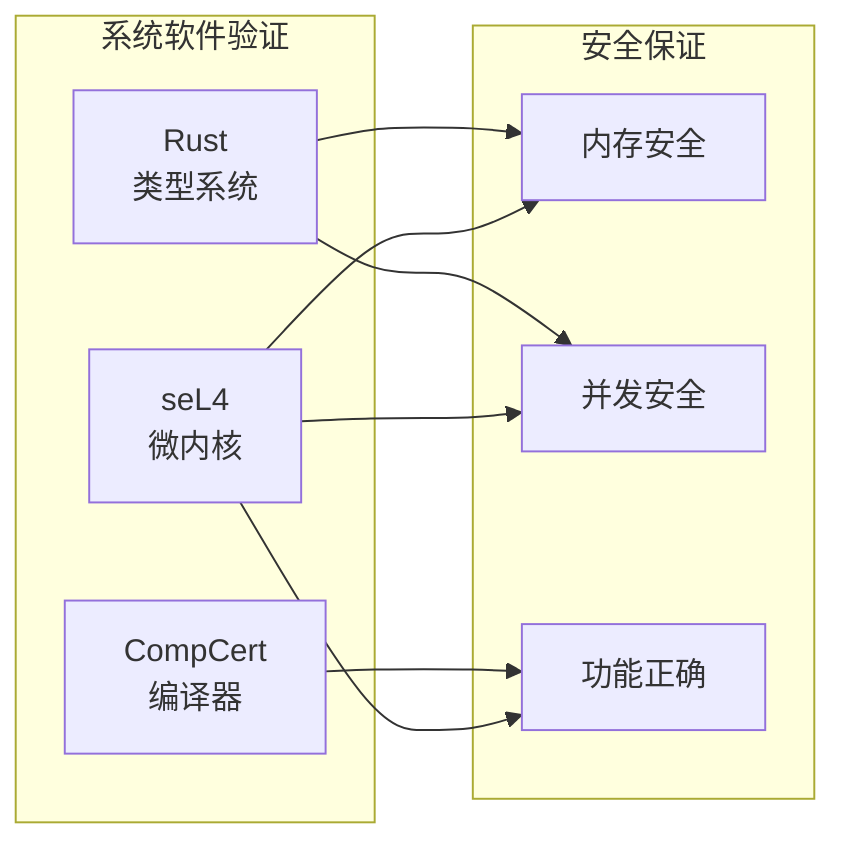
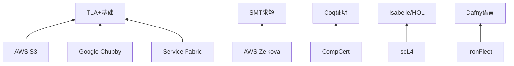

# 工业级形式化验证案例总览

> **所属单元**: Tools/Industrial | **形式化等级**: L5-L6

## 1. 案例索引

本目录包含工业级形式化验证的完整案例研究，涵盖云计算、分布式系统和系统软件的形式化验证实践。

### 1.1 案例清单

| 案例 | 公司/组织 | 应用领域 | 验证等级 | 关键技术 |
|------|----------|---------|---------|---------|
| [AWS Zelkova/Tiros](01-aws-zelkova-tiros.md) | Amazon | 云安全 | L5 | SMT求解 |
| [Azure验证](02-azure-verification.md) | Microsoft | 分布式数据库 | L5 | TLA+ |
| [Google Kubernetes](03-google-kubernetes.md) | Google | 容器编排 | L5 | TLA+/Coq |
| [Facebook Infer](04-facebook-infer.md) | Meta | 程序分析 | L4 | 分离逻辑 |
| [Rust验证](05-rust-verification.md) | 社区 | 系统安全 | L5 | 类型系统 |
| [AWS S3一致性](aws-s3-formalization.md) | Amazon | 对象存储 | L6 | TLA+ |
| [Azure Service Fabric](azure-service-fabric.md) | Microsoft | 微服务 | L6 | 状态机复制 |
| [Google Chubby](google-chubby.md) | Google | 分布式协调 | L6 | Paxos |
| [seL4微内核](sel4-case-study.md) | Trustworthy Systems | 操作系统 | L6 | Isabelle/HOL |
| [IronFleet框架](ironfleet.md) | Microsoft Research | 分布式系统 | L6 | Dafny |
| [CompCert编译器](compcert.md) | INRIA | 编译器 | L6 | Coq |

## 2. 按公司分类

### 2.1 Amazon/AWS



**代表案例**:

- **Zelkova**: IAM策略的SMT验证，发现数百个配置错误
- **S3强一致性**: 2020年重大升级的形式化验证，CACM 2021论文
- **TLA+应用**: DynamoDB、S3、Lambda等核心服务的协议验证

**验证模式提取**:

1. **配置验证**: 将策略配置编码为SMT约束
2. **协议验证**: TLA+规格化分布式协议
3. **不变式挖掘**: 从运行时提取安全不变式

### 2.2 Microsoft



**代表案例**:

- **IronFleet**: 首个完整验证的分布式系统框架
- **Service Fabric**: 微服务平台的状态机复制验证
- **Dafny**: 支持验证的编程语言，IronRSL/IronKV实现

**验证模式提取**:

1. **分层精化**: 高层规约→协议层→实现层
2. **自动化证明**: Dafny+Z3实现高自动化
3. **可执行规格**: 规格即实现，验证即编码

### 2.3 Google



**代表案例**:

- **Chubby**: 工业级Paxos实现，OSDI 2006经典论文
- **Kubernetes**: etcd一致性验证，调度器验证
- **Protocol Buffers**: 消息格式验证

**验证模式提取**:

1. **设计即验证**: 协议设计时考虑可验证性
2. **粗粒度服务**: Chubby的粗粒度锁设计简化验证
3. **故障域隔离**: 多副本跨故障域分布

### 2.4 学术/研究机构

| 机构 | 项目 | 影响 |
|------|------|------|
| NICTA/UNSW | seL4 | 首个验证操作系统内核 |
| INRIA | CompCert | 首个验证优化编译器 |
| MSR | IronFleet | 首个验证分布式系统 |

## 3. 按技术分类

### 3.1 定理证明



**高保证系统定理证明**:

| 项目 | 工具 | 代码:证明比例 | 关键成就 |
|------|------|---------------|---------|
| seL4 | Isabelle | 1:20 | 200+bug在证明前发现 |
| CompCert | Coq | 1:3.5 | 零编译器引入缺陷 |
| IronRSL | Dafny | 1:8 | 生产级性能验证系统 |

**可复用模式**:

1. **精化链**: 高层规约→实现的多层精化
2. **不变式工程**: 关键不变式的系统发现和维护
3. **自动化策略**: 重复证明任务的自动化

### 3.2 模型检验



**TLA+工业应用统计**:

| 公司 | 验证组件 | 发现缺陷 | 价值 |
|------|---------|---------|------|
| Amazon | 10+核心服务 | 数百 | 避免宕机 |
| Microsoft | Cosmos DB | 数十 | 一致性保证 |
| Google | Kubernetes | 多个 | 可靠性提升 |

**可复用模式**:

1. **规格驱动开发**: 先写TLA+规格再实现
2. **边界条件探索**: 系统性地探索边界场景
3. **故障注入**: 网络分区、节点故障等场景验证

### 3.3 SMT求解

| 应用 | 工具 | 场景 | 规模 |
|------|------|------|------|
| Zelkova | Z3 | IAM策略分析 | 百万级策略 |
| Tiros | Z3 | 网络可达性 | 万级节点 |
| Dafny | Z3 | 程序验证 | 中等规模 |

## 4. 按应用领域分类

### 4.1 存储系统



**一致性验证模式**:

1. **线性一致性**: 使用线性化点方法验证
2. **因果一致性**: 向量时钟和happens-before关系
3. **最终一致性**: 收敛性证明和界限分析

### 4.2 协调服务

| 系统 | 协议 | 验证重点 | 工业影响 |
|------|------|---------|---------|
| Chubby | Paxos | Leader选举、Lease | Google基础设施 |
| etcd | Raft | 日志复制、快照 | Kubernetes |
| ZooKeeper | ZAB | 顺序一致性 | Hadoop生态 |

### 4.3 系统软件



## 5. 学习路径推荐

### 5.1 入门路径（工程师）

```
1. AWS S3一致性案例
   ↓ 了解分布式一致性概念
2. Google Chubby案例
   ↓ 学习Paxos协议工程实践
3. TLA+ Tutorial
   ↓ 动手实践模型检验
4. IronFleet案例
   ↓ 了解验证分布式系统方法论
```

**推荐资源**:

- 《Designing Data-Intensive Applications》
- TLA+ Video Course (Lamport)
- AWS re:Invent形式化方法讲座

### 5.2 进阶路径（验证工程师）

```
1. Azure Service Fabric案例
   ↓ 状态机复制协议
2. seL4案例
   ↓ 操作系统验证方法
3. Coq/Isabelle学习
   ↓ 定理证明基础
4. CompCert案例
   ↓ 编译器验证技术
```

**推荐资源**:

- Software Foundations (Coq)
- Isabelle/HOL Tutorial
- seL4相关论文

### 5.3 专家路径（研究者）

```
1. IronFleet框架研究
   ↓ Dafny语言和精化方法
2. CompCert深入研究
   ↓ 编译器验证前沿
3. 分离逻辑学习
   ↓ 程序逻辑理论
4. 当前研究前沿
   ↓ 并发程序验证、弱内存模型
```

**推荐资源**:

- POPL/PLDI/CAV会议论文
- Current Research in FM

## 6. 可复用验证模式

### 6.1 设计模式

| 模式 | 描述 | 应用 |
|------|------|------|
| **分层精化** | 高层规约→低层实现的精化链 | IronFleet、seL4 |
| **不变式驱动** | 识别关键不变式作为验证核心 | 所有案例 |
| **配置编码** | 将配置转换为约束求解 | Zelkova、Tiros |
| **故障模型** | 显式建模故障场景 | Chubby、etcd |

### 6.2 技术模式

**模式1: 分层规约架构**

```
高层: 期望行为 (LTL/CTL)
  ↓
中层: 分布式协议 (TLA+/伪代码)
  ↓
低层: 可执行实现 (Dafny/Coq)
```

**模式2: 配置验证流水线**

```
配置文件 → 解析 → 语义编码 → SMT约束 → 求解 → 结果
```

**模式3: 协议验证工作流**

```
协议设计 → TLA+规格 → TLC检验 → 缺陷修复 → 代码实现 → 测试验证
```

## 7. 案例交叉引用

### 7.1 技术依赖关系



### 7.2 概念依赖关系

| 案例 | 前置概念 | 后续应用 |
|------|---------|---------|
| Chubby | Paxos | etcd, ZooKeeper |
| seL4 | 微内核 | Genode, Fiasco.OC |
| CompCert | 编译器 | Vellvm, CakeML |
| IronFleet | 精化 | 其他分布式验证项目 |

## 8. 参考文献汇总

### 8.1 经典论文

1. Klein et al., "seL4: Formal Verification of an OS Kernel", SOSP 2009
2. Burrows, "The Chubby Lock Service", OSDI 2006
3. Leroy, "Formal Verification of a Realistic Compiler", CACM 2009
4. Newcombe et al., "How Amazon Web Services Uses Formal Methods", CACM 2015
5. Hawblitzel et al., "IronFleet", SOSP 2015
6. Brooker et al., "Millions of Tiny Databases", CACM 2021 (S3)

### 8.2 在线资源

- [seL4 Documentation](https://docs.sel4.systems/)
- [CompCert Website](https://compcert.org/)
- [TLA+ Homepage](https://lamport.azurewebsites.net/tla/tla.html)
- [Dafny GitHub](https://github.com/dafny-lang/dafny)
- [AWS TLA+ Models](https://github.com/tlaplus/Examples)

### 8.3 工具下载

| 工具 | 链接 | 许可 |
|------|------|------|
| Isabelle/HOL | <https://isabelle.in.tum.de/> | BSD |
| Coq | <https://coq.inria.fr/> | LGPL |
| TLA+ Toolbox | <https://lamport.azurewebsites.net/tla/toolbox.html> | MIT |
| Dafny | <https://github.com/dafny-lang/dafny> | MIT |
| CompCert | <https://compcert.org/> | 商业/非商业 |

---

> **最后更新**: 2026-04-09
>
> **维护者**: 形式化方法文档组
