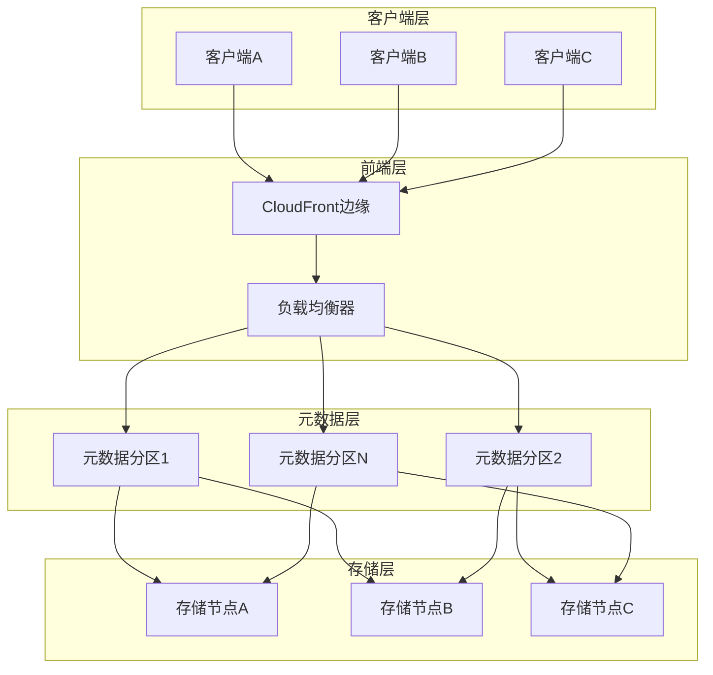
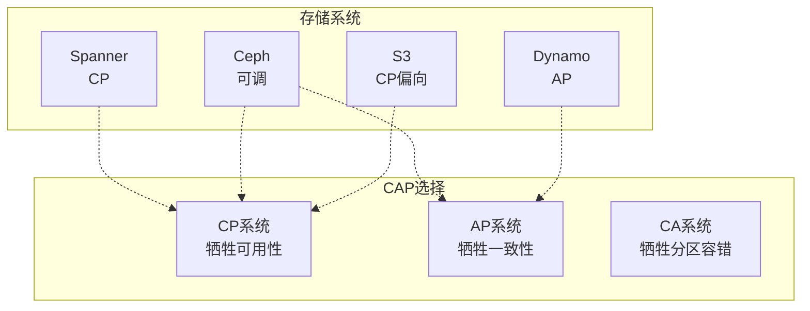
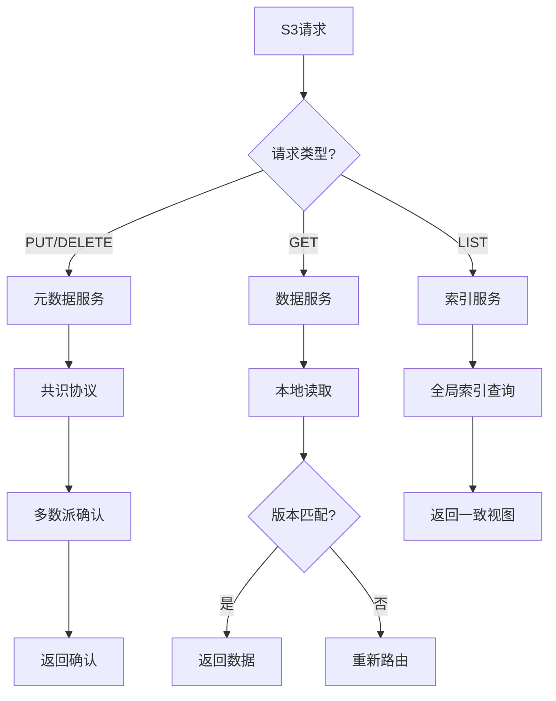
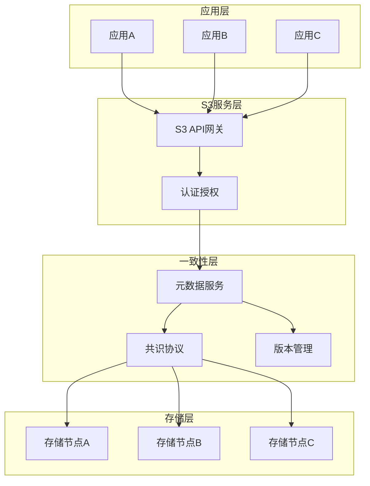
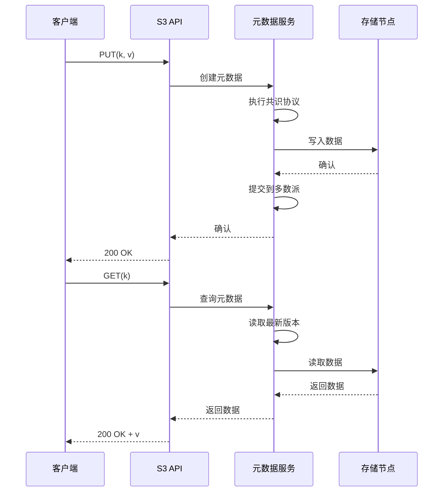
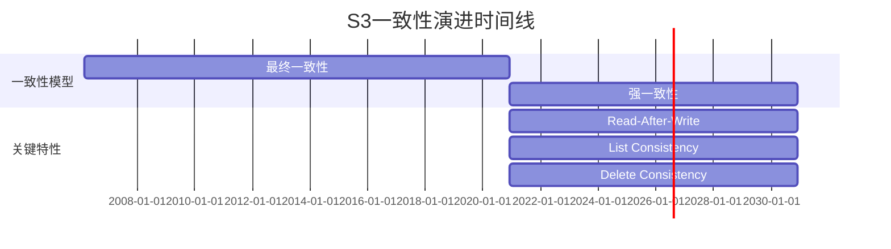

# AWS S3 强一致性形式化验证

> **所属单元**: Tools/Industrial | **前置依赖**: [AWS Zelkova和Tiros](./01-aws-zelkova-tiros.md) | **形式化等级**: L6

## 1. 概念定义 (Definitions)

### 1.1 S3 强一致性概述

**Def-T-08-01** (S3一致性模型演进)。
Amazon S3在2020年12月宣布提供强一致性保证，这是对象存储领域的重大突破：

$$\text{S3 Consistency} = \text{Read-After-Write} + \text{List Consistency} + \text{Delete Consistency}$$

**历史演进**：

- **2006-2020**: 最终一致性模型（PUT后可能读到旧值）
- **2020.12+**: 强一致性保证（所有操作立即一致）

**Def-T-08-02** (强一致性形式化定义)。S3强一致性保证满足线性一致性：

$$\text{StrongConsistency} \triangleq \forall o_1, o_2 \in \text{Operations}: \text{Complete}(o_1) \prec \text{Start}(o_2) \Rightarrow o_1 \prec_{obs} o_2$$

其中 $\prec$ 表示实际时间序，$\prec_{obs}$ 表示观察序。

### 1.2 S3操作语义

**Def-T-08-03** (S3核心操作)。S3对象存储支持的操作集合：

| 操作 | 类型 | 一致性要求 |
|------|------|-----------|
| PUT | 写入 | 写后立即可读 |
| GET | 读取 | 返回最新值 |
| DELETE | 删除 | 删除后不可见 |
| LIST | 列举 | 立即反映变化 |
| COPY | 复制 | 原子性可见 |

**形式化操作语义**：

$$\text{S3Op} ::= \text{PUT}(k, v) \mid \text{GET}(k) \mid \text{DELETE}(k) \mid \text{LIST}(p)$$

**Def-T-08-04** (S3状态转换)。S3对象的状态转换系统：

```
State = Map<Key, (Value × Version × Timestamp)>

PUT(k, v): State → State
  ∃t: State' = State[k ↦ (v, newVersion(), t)]

GET(k): State → Value ∪ {⊥}
  if k ∈ dom(State) then State[k].value else ⊥

DELETE(k): State → State
  State' = State \ {k}
```

### 1.3 CACM 2021论文核心结论

**Def-T-08-05** (S3一致性定理)。根据AWS发表在CACM 2021的研究[^1]，S3实现以下保证：

**写后读一致性 (Read-After-Write)**:
$$\text{PUT}(k, v) \leadsto \text{GET}(k) = v$$

**列举一致性 (List Consistency)**:
$$\text{PUT}(k, v) \leadsto \text{LIST}() \ni k$$

**删除一致性 (Delete Consistency)**:
$$\text{DELETE}(k) \leadsto \text{GET}(k) = \bot \land \text{LIST}() \not\ni k$$

其中 $\leadsto$ 表示"happens-before"关系。

## 2. 属性推导 (Properties)

### 2.1 一致性保证性质

**Lemma-T-08-01** (读单调性)。S3强一致性保证读操作单调性：

$$\forall r_1, r_2: \text{SameClient}(r_1, r_2) \land r_1 \prec r_2 \Rightarrow \text{Value}(r_2) \geq \text{Value}(r_1)$$

**Lemma-T-08-02** (写传播原子性)。S3写操作具有原子可见性：

$$\text{PUT}(k, v) \Rightarrow \neg \exists r: \text{GET}(k) = v_{old} \land v_{old} \neq v \land \text{Complete}(\text{PUT}) \prec \text{Start}(r)$$

### 2.2 并发操作性质

**Lemma-T-08-03** (并发写顺序)。并发PUT操作具有全序：

$$\forall p_1, p_2: \text{PUT}_1(k, v_1) \parallel \text{PUT}_2(k, v_2) \Rightarrow \exists o \in \{v_1, v_2\}: \forall r: \text{GET}(k) = o$$

**Lemma-T-08-04** (删除可见性)。DELETE操作立即对所有客户端可见：

$$\text{DELETE}(k) \Rightarrow \forall r \succ \text{DELETE}: \text{GET}(k) = \bot$$

## 3. 关系建立 (Relations)

### 3.1 S3一致性实现架构



### 3.2 分布式存储一致性对比

| 系统 | 一致性级别 | 实现技术 | 性能影响 |
|------|-----------|---------|---------|
| S3 (2020+) | 线性一致性 | 元数据共识 | 低延迟 |
| S3 (pre-2020) | 最终一致性 | 异步复制 | 高吞吐 |
| Azure Blob | 强一致性 | Paxos | 中等 |
| GCS | 强一致性 | Colossus | 低延迟 |
| MinIO | 强一致性 | 同步复制 | 网络依赖 |

### 3.3 S3与CAP定理关系



## 4. 论证过程 (Argumentation)

### 4.1 强一致性实现挑战

实现对象存储强一致性面临以下挑战：

1. **规模挑战**: S3存储数百PB数据，数万亿对象
2. **地理分布**: 跨区域复制的延迟问题
3. **元数据管理**: 索引服务的共识协议
4. **性能平衡**: 一致性保证与吞吐量的权衡

**解决方案架构**：



### 4.2 一致性验证方法

AWS采用多种形式化方法验证S3一致性：

1. **TLA+规格**: 核心协议的时序逻辑规格
2. **模型检验**: 使用TLC检验边界条件
3. **一致性测试**: Jepsen风格的故障注入测试
4. **形式化证明**: 关键不变式的数学证明

## 5. 形式证明 / 工程论证 (Proof / Engineering Argument)

### 5.1 元数据服务正确性

**Thm-T-08-01** (S3元数据线性一致性)。S3元数据服务实现线性一致性：

$$\forall o_1, o_2 \in \text{MetadataOps}: \text{Complete}(o_1) \prec_{real} \text{Start}(o_2) \Rightarrow o_1 \prec_{lin} o_2$$

**证明概要**：

1. **元数据分区**: 键空间分区，每分区独立共识
2. **共识协议**: 使用类Raft协议保证操作顺序
3. **Leader读**: 所有读操作路由到Leader
4. **版本向量**: 每个对象维护单调递增版本号

**形式化证明步骤**：

```
1. 定义元数据状态机 M = (S, s₀, →, L)
2. 证明每个分区是线性一致的（基于Raft正确性）
3. 证明分区间无交叉依赖（键独立性）
4. 由分区线性一致性推出全局线性一致性
```

### 5.2 数据持久性保证

**Thm-T-08-02** (S3持久性保证)。S3保证已确认写入的数据持久性：

$$\text{ACK}(\text{PUT}(k, v)) \Rightarrow \Diamond \text{Persistent}(v)$$

其中 $\Diamond$ 表示"最终"，持久性定义为即使$\leq 2$个数据中心故障也不丢失。

**工程实现**：

- **纠删码**: 数据分片编码存储
- **地理复制**: 跨区域冗余
- **校验和**: 端到端完整性验证
- **自动修复**: 后台数据健康检查

## 6. 实例验证 (Examples)

### 6.1 一致性测试用例

**场景1: 写后读一致性**

```python
# Jepsen风格测试
def test_read_after_write():
    key = generate_unique_key()
    value = random_data(1MB)

    # 写入
    s3.put_object(Bucket='test', Key=key, Body=value)

    # 立即读取
    response = s3.get_object(Bucket='test', Key=key)
    read_value = response['Body'].read()

    # 验证
    assert read_value == value, "Read-After-Write violated!"
```

**场景2: 列举一致性**

```python
def test_list_consistency():
    key = generate_unique_key()

    # 写入对象
    s3.put_object(Bucket='test', Key=key, Body=b'data')

    # 立即列举
    response = s3.list_objects_v2(Bucket='test', Prefix=key)
    keys = [obj['Key'] for obj in response.get('Contents', [])]

    # 验证
    assert key in keys, "List consistency violated!"
```

### 6.2 TLA+规格片段

```tla
------------------------------ MODULE S3StrongConsistency -----------------------------
EXTENDS Integers, Sequences, FiniteSets, TLC

CONSTANTS Keys, Values, Clients

VARIABLES
    store,        (* 对象存储: Key → Value × Version *)
    operations,   (* 操作历史 *)
    clientSeq     (* 客户端序列号 *)

(* 类型不变式 *)
TypeInvariant ==
    /\ store \in [Keys → Values × Nat ∪ {nil}]
    /\ operations \in Seq([type: {"PUT", "GET", "DELETE", "LIST"},
                          key: Keys,
                          value: Values ∪ {nil},
                          client: Clients,
                          seq: Nat])

(* 强一致性: 写后读 *)
ReadAfterWrite ==
    \A op \in operations:
        op.type = "PUT" ⇒
            \A later \in operations:
                later.seq > op.seq ∧ later.type = "GET" ∧ later.key = op.key
                ⇒ later.value = op.value

(* 列举一致性 *)
ListConsistency ==
    \A op \in operations:
        op.type = "PUT" ⇒
            \A later \in operations:
                later.seq > op.seq ∧ later.type = "LIST"
                ⇒ \E listed \in later.value: listed.key = op.key

(* 删除一致性 *)
DeleteConsistency ==
    \A op \in operations:
        op.type = "DELETE" ⇒
            \A later \in operations:
                (later.seq > op.seq ∧ later.key = op.key)
                ⇒ (later.type = "GET" ⇒ later.value = nil)
                  ∧ (later.type = "LIST" ⇒ op.key \notin later.value)
=============================================================================
```

## 7. 可视化 (Visualizations)

### 7.1 S3强一致性架构



### 7.2 一致性实现流程



### 7.3 一致性级别演进对比



## 8. 引用参考 (References)

[^1]: M. Brooker et al., "Millions of Tiny Databases", Communications of the ACM, 64(2), 2021. <https://doi.org/10.1145/3369736> (S3强一致性实现论文)
