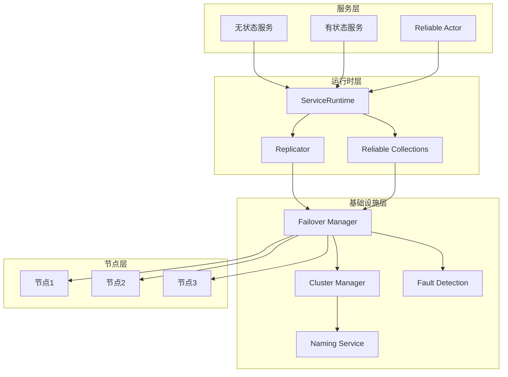
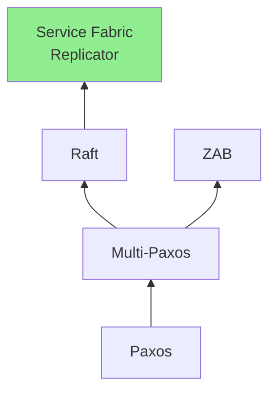
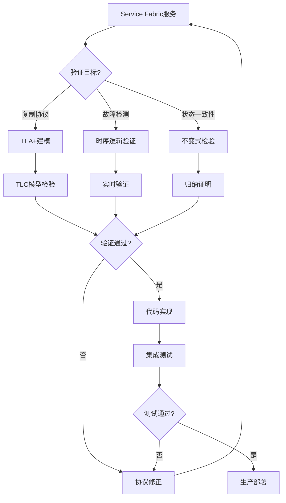
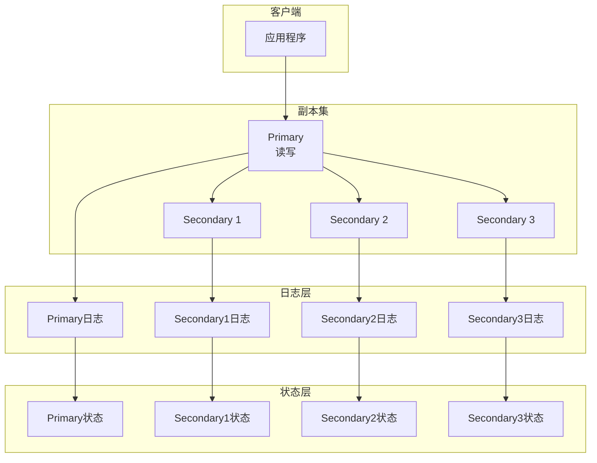
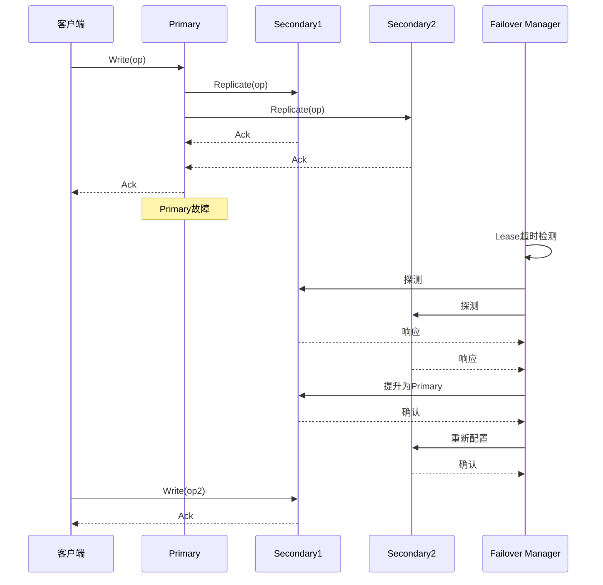
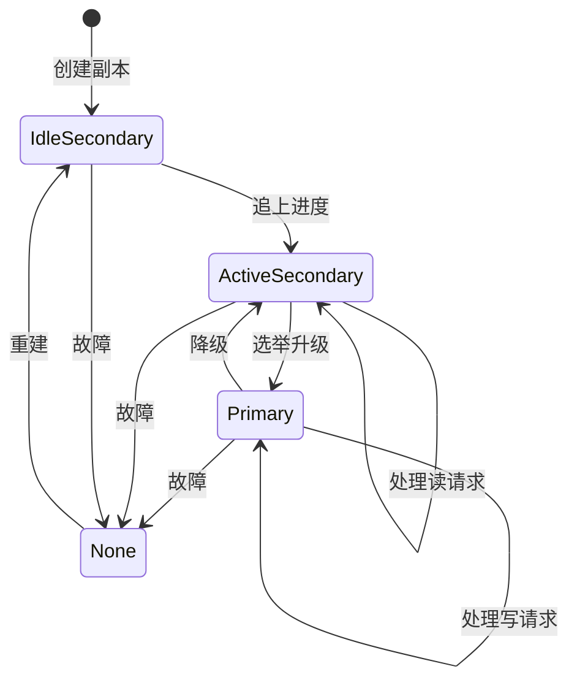

# Azure Service Fabric 形式化验证

> **所属单元**: Tools/Industrial | **前置依赖**: [Azure验证](./02-azure-verification.md) | **形式化等级**: L6

## 1. 概念定义 (Definitions)

### 1.1 Service Fabric 概述

**Def-T-09-01** (Service Fabric定义)。Azure Service Fabric是微软的分布式系统平台，支持有状态和无状态微服务：

$$\text{Service Fabric} = \text{集群管理} + \text{服务编排} + \text{状态复制} + \text{故障检测}$$

**核心组件**：

- **Cluster Manager**: 集群资源管理
- **Failover Manager**: 故障转移协调
- **Reconfiguration Agent**: 服务重新配置
- **Replication Layer**: 状态机复制

**Def-T-09-02** (有状态服务模型)。Service Fabric有状态服务的形式化定义：

$$\text{StatefulService} = (R, P, S, \delta, s_0)$$

其中：

- $R$: 副本集合（Primary + Secondaries）
- $P$: 分区集合
- $S$: 状态空间
- $\delta: S \times \text{Op} \rightarrow S$: 状态转换函数
- $s_0 \in S$: 初始状态

### 1.2 状态机复制

**Def-T-09-03** (状态机复制协议)。Service Fabric使用Replicator实现状态机复制：

$$\text{Replicator} = \text{Primary} \times \text{Secondaries}^* \times \text{Log}$$

**副本角色定义**：

| 角色 | 职责 | 状态 |
|------|------|------|
| Primary | 接收写请求，复制到Secondaries | RW |
| ActiveSecondary | 参与复制，可读 | RO |
| IdleSecondary | 正在同步，不可读 | Sync |
| None | 无副本 | - |

**Def-T-09-04** (复制协议语义)。操作复制流程：

```
Write(op):
  1. Primary接收op
  2. op追加到本地日志
  3. 并行发送给所有ActiveSecondaries
  4. 等待Quorum确认（含Primary）
  5. 提交op，应用到状态机
  6. 返回客户端

Read():
  1. 路由到Primary或Secondary
  2. 读取本地状态
  3. 返回结果
```

### 1.3 故障检测协议

**Def-T-09-05** (Lease机制)。Service Fabric使用Lease机制检测故障：

$$\text{Lease} = (\text{Holder}, \text{Grantor}, \text{Duration}, \text{Expiry})$$

**Lease规则**：

- Primary持有来自Secondaries的Lease
- Secondary持有来自Primary的Lease
- Lease到期未续期则触发故障检测
- Lease续期需要网络往返

**Def-T-09-06** (故障检测时间界限)。故障检测上界：

$$T_{detect} \leq T_{lease} + T_{renewal} + T_{processing}$$

## 2. 属性推导 (Properties)

### 2.1 复制协议性质

**Lemma-T-09-01** (操作全序)。所有提交操作具有全序：

$$\forall o_1, o_2 \in \text{CommittedOps}: o_1 \prec o_2 \lor o_2 \prec o_1$$

**Lemma-T-09-02** (状态一致性)。所有副本应用相同操作序列：

$$\forall r_1, r_2 \in R: \text{AppliedOps}(r_1) = \text{AppliedOps}(r_2)$$

**Lemma-T-09-03** (提交持久性)。已提交操作不丢失：

$$\text{Committed}(op, t) \land |R_{alive}(t')| \geq \text{Quorum} \Rightarrow \text{Available}(op, t')$$

### 2.2 故障检测性质

**Lemma-T-09-04** (检测完备性)。故障节点最终被检测：

$$\text{Failed}(n, t) \Rightarrow \Diamond_{\leq T_{detect}} \text{Detected}(n)$$

**Lemma-T-09-05** (检测准确性)。无故障节点不被错误检测：

$$\neg \text{Failed}(n) \Rightarrow \neg \text{Detected}(n)$$

## 3. 关系建立 (Relations)

### 3.1 Service Fabric架构



### 3.2 分布式系统对比

| 系统 | 复制协议 | 一致性 | 故障检测 | 适用场景 |
|------|---------|--------|---------|---------|
| Service Fabric | 主从复制 | 强一致 | Lease | 微服务 |
| ZooKeeper | ZAB | 顺序一致 | 心跳 | 协调 |
| etcd | Raft | 线性一致 | 心跳 | K8s存储 |
| Consul | Raft | 一致 | Gossip | 服务发现 |

### 3.3 复制协议关系



## 4. 论证过程 (Argumentation)

### 4.1 有状态服务验证挑战

验证有状态服务面临独特挑战：

1. **状态持久性**: 确保故障后状态可恢复
2. **副本一致性**: 多副本间状态同步
3. **分区容忍**: 网络分区下的行为
4. **重新配置**: 副本集动态变化

**验证策略**：



### 4.2 故障场景分析

**场景1: Primary故障**

```
初始: P(primary), S1, S2 (secondaries)
故障: P崩溃
检测: Lease超时
行动:
  1. 选举新Primary（通常是进度最先进的Secondary）
  2. 重新配置副本集
  3. 恢复服务
```

**场景2: 网络分区**

```
分区A: P, S1
分区B: S2
结果:
  - 分区A继续服务（多数派）
  - 分区B进入只读或不可用状态
```

## 5. 形式证明 / 工程论证 (Proof / Engineering Argument)

### 5.1 复制协议安全性

**Thm-T-09-01** (复制安全性)。Service Fabric复制协议保证已提交操作的持久性和顺序性：

$$\text{Committed}(op) \Rightarrow \forall t' > t: \text{Available}(op, t') \land \text{OrderPreserved}(op)$$

**证明概要**：

1. **Quorum机制**: 提交需要多数派确认
2. **日志持久化**: 确认前先持久化到本地
3. **故障恢复**: 新Primary从持久化日志恢复
4. **状态机应用**: 按日志顺序应用操作

**TLA+核心不变式**：

```tla
(* 提交操作存在于多数派 *)
CommitQuorum ==
    \A op \in committed:
        \E Q \in Quorums:
            \A r \in Q: op \in log[r]

(* 已提交操作不会丢失 *)
CommitPersistence ==
    \A op \in committed:
        []<> (op \in applied)
```

### 5.2 故障检测正确性

**Thm-T-09-02** (故障检测正确性)。Lease机制正确检测故障：

$$\text{LeaseExpired}(n) \Leftrightarrow \text{NetworkFailure}(n) \lor \text{NodeFailure}(n)$$

**工程论证**：

1. **Lease续期**: 健康节点定期续期Lease
2. **超时检测**: 到期未续期则标记故障
3. **误检概率**: 网络延迟导致的误检可配置
4. **恢复处理**: 区分临时和永久故障

## 6. 实例验证 (Examples)

### 6.1 TLA+规格片段

```tla
------------------------------ MODULE ServiceFabric -----------------------------
EXTENDS Integers, Sequences, FiniteSets, TLC

CONSTANTS Replicas, MaxLogLength

VARIABLES
    role,           (* 副本角色 *)
    log,            (* 日志 *)
    commitIndex,    (* 提交索引 *)
    appliedIndex,   (* 应用索引 *)
    state,          (* 状态机状态 *)
    leaseExpiry     (* Lease到期时间 *)

ReplicaRoles == {"Primary", "ActiveSecondary", "IdleSecondary", "None"}

(* 类型不变式 *)
TypeInvariant ==
    /\ role \in [Replicas → ReplicaRoles]
    /\ log \in [Replicas → Seq(Op)]
    /\ commitIndex \in [Replicas → Nat]
    /\ appliedIndex \in [Replicas → Nat]
    /\ leaseExpiry \in [Replicas → Nat ∪ {∞}]

(* 状态机安全 *)
StateMachineSafety ==
    \A i, j \in Replicas:
        appliedIndex[i] > 0 /\ appliedIndex[j] > 0
        => \A n \in 1..Min(appliedIndex[i], appliedIndex[j]):
            log[i][n] = log[j][n]

(* Primary唯一性 *)
SinglePrimary ==
    \A i, j \in Replicas:
        role[i] = "Primary" /\ role[j] = "Primary" => i = j

(* 提交单调性 *)
MonotonicCommit ==
    \A i \in Replicas:
        [][commitIndex[i]' >= commitIndex[i]]_vars
=============================================================================
```

### 6.2 可靠性测试代码

```csharp
// Service Fabric可靠性测试示例
public class ReplicationTest : StatefulService
{
    private IReliableDictionary<string, int> _dictionary;

    protected override async Task RunAsync(CancellationToken cancellationToken)
    {
        // 写入测试
        for (int i = 0; i < 10000; i++)
        {
            using (var tx = StateManager.CreateTransaction())
            {
                await _dictionary.AddAsync(tx, $"key_{i}", i);
                await tx.CommitAsync();
            }
        }

        // 验证一致性
        using (var tx = StateManager.CreateTransaction())
        {
            var count = await _dictionary.GetCountAsync(tx);
            Debug.Assert(count == 10000, "Consistency violated!");
        }
    }
}
```

## 7. 可视化 (Visualizations)

### 7.1 Service Fabric复制架构



### 7.2 故障转移流程



### 7.3 副本状态机



## 8. 引用参考 (References)
