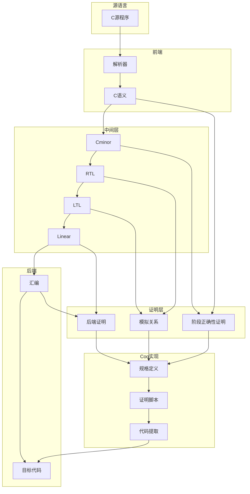
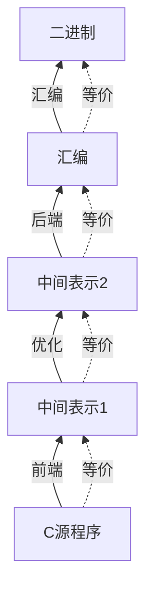
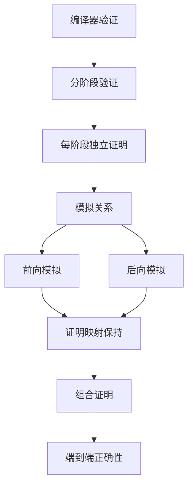
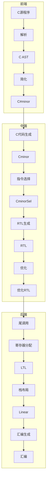
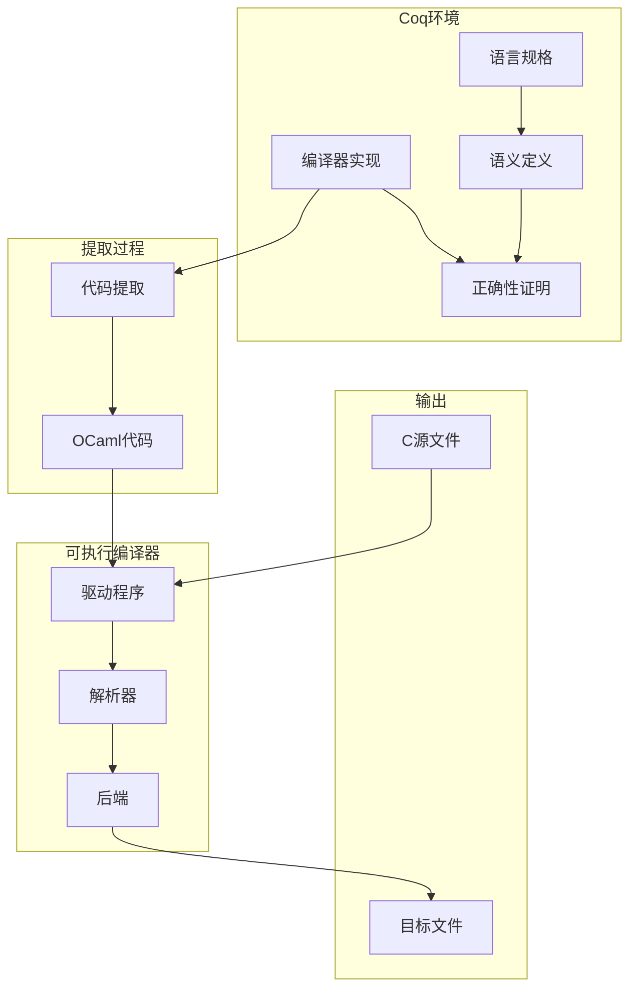
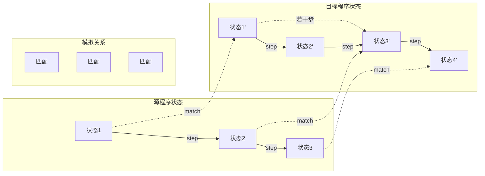

# CompCert 编译器形式化验证

> **所属单元**: Tools/Industrial | **前置依赖**: [Coq/Isabelle定理证明](../../05-verification/03-theorem-proving/01-coq-isabelle.md) | **形式化等级**: L6

## 1. 概念定义 (Definitions)

### 1.1 CompCert 概述

**Def-T-13-01** (CompCert定义)。CompCert是首个经过形式化验证的优化编译器，使用Coq证明助手实现：

$$\text{CompCert} = \text{C编译器} + \text{语义保持证明} + \text{端到端正确性}$$

**核心目标**：

- **语义保持**: 编译后程序行为与源代码一致
- **优化正确**: 所有优化都经过验证
- **无编译器缺陷**: 消除编译引入的错误

**支持架构**：

- **PowerPC** (初始目标)
- **ARM** (32/64位)
- **x86** (32/64位)
- **RISC-V** (32/64位)

**Def-T-13-02** (编译器正确性定义)。CompCert的正确性形式化定义为语义保持：

$$\text{CompilationCorrectness} \triangleq \forall P: \llbracket P \rrbracket_{source} \sim \llbracket \text{Compile}(P) \rrbracket_{target}$$

其中 $\sim$ 表示观察等价关系。

### 1.2 编译器架构

**Def-T-13-03** (CompCert编译链)。CompCert采用多阶段编译：

```
C源程序 (CompCert C)
    ↓ 解析
C抽象语法树
    ↓ Cshm
简化C (C#minor)
    ↓ Cminorgen
Cminor (无结构化控制流)
    ↓ Selection
CminorSel (机器相关)
    ↓ RTLgen
RTL (寄存器传输语言)
    ↓ 优化阶段
优化后的RTL
    ↓ LTLgen
LTL (位置传输语言)
    ↓ Stacking
Linear (线性化)
    ↓ Assembly
汇编代码
    ↓ 汇编/链接
目标代码
```

**中间语言说明**：

| 语言 | 特性 | 目的 |
|------|------|------|
| CompCert C | 标准C子集 | 源语言 |
| C#minor | 无复杂控制流 | 简化分析 |
| Cminor | 三地址码 | 指令选择 |
| CminorSel | 机器操作 | 目标相关 |
| RTL | SSA形式 | 数据流分析 |
| LTL | 栈帧布局 | 寄存器分配 |
| Linear | 指令列表 | 汇编生成 |

### 1.3 语义框架

**Def-T-13-04** (小步操作语义)。CompCert使用小步操作语义定义语言行为：

$$\langle \text{stmt}, \sigma \rangle \rightarrow \langle \text{stmt}', \sigma' \rangle$$

**Def-T-13-05** (观察等价)。两个程序观察等价的定义：

$$P_1 \sim P_2 \triangleq \forall I, O: P_1 \Downarrow_{I,O} \Leftrightarrow P_2 \Downarrow_{I,O}$$

其中 $\Downarrow_{I,O}$ 表示在输入$I$下产生输出$O$终止。

## 2. 属性推导 (Properties)

### 2.1 编译器性质

**Lemma-T-13-01** (单阶段正确性)。每个编译阶段保持语义：

$$\forall P: \llbracket P \rrbracket_n \sim \llbracket \text{Phase}_n(P) \rrbracket_{n+1}$$

**Lemma-T-13-02** (传递性)。正确性通过阶段组合传递：

$$P_1 \sim P_2 \land P_2 \sim P_3 \Rightarrow P_1 \sim P_3$$

**Lemma-T-13-03** (优化安全性)。优化不改变程序语义：

$$\forall P: \llbracket P \rrbracket \sqsubseteq \llbracket \text{Optimize}(P) \rrbracket$$

其中 $\sqsubseteq$ 表示精化关系（允许更少未定义行为）。

### 2.2 源语言性质

**Lemma-T-13-04** (确定性)。CompCert C程序行为确定性：

$$\langle P, \sigma \rangle \rightarrow \sigma_1 \land \langle P, \sigma \rangle \rightarrow \sigma_2 \Rightarrow \sigma_1 = \sigma_2$$

**Lemma-T-13-05** (类型安全)。良类型程序不会卡住：

$$\text{WellTyped}(P) \Rightarrow \neg \exists \sigma: \text{Stuck}(P, \sigma)$$

## 3. 关系建立 (Relations)

### 3.1 CompCert验证架构



### 3.2 验证编译器对比

| 编译器 | 源语言 | 目标 | 方法 | 优化 |
|--------|--------|------|------|------|
| CompCert | C子集 | 多架构 | Coq | 有 |
| CakeML | ML | x64/ARM | HOL4 | 有 |
| Vellvm | LLVM IR | 多目标 | Coq | 有限 |
| Fiat-Crypto | DSL | 加密代码 | Coq | 特定域 |

### 3.3 编译器正确性关系



## 4. 论证过程 (Argumentation)

### 4.1 为什么验证编译器

编译器缺陷的影响：

1. **安全关键系统**: 航空航天、医疗设备
2. **错误传播**: 一个编译器bug影响所有生成代码
3. **难以检测**: 编译引入的错误难以追踪
4. **优化复杂性**: 现代优化极易出错

**验证编译器 vs 测试**：

| 方法 | 覆盖性 | 保证 | 成本 |
|------|--------|------|------|
| 测试 | 有限 | 无保证 | 低 |
| 随机测试 | 高 | 概率保证 | 中 |
| 验证 | 完全 | 数学保证 | 高 |

### 4.2 CompCert验证方法

**验证策略**：



**模拟关系类型**：

- **前向模拟**: 源程序每步对应目标程序若干步
- **后向模拟**: 目标程序行为可由源程序解释
- **锁步模拟**: 每步一一对应（用于简单阶段）

## 5. 形式证明 / 工程论证 (Proof / Engineering Argument)

### 5.1 编译正确性定理

**Thm-T-13-01** (CompCert编译正确性)。CompCert编译器满足语义保持：

$$\forall P: \text{Safe}(P) \Rightarrow \llbracket P \rrbracket_{CompCertC} \sim \llbracket \text{CompCert}(P) \rrbracket_{target}$$

**证明结构**：

```
1. 定义源语言语义 (CompCert C)
2. 定义目标语言语义 (汇编)
3. 对每个编译阶段P_i:
   a. 定义P_i的语义
   b. 证明P_i满足模拟关系
4. 组合所有阶段的模拟关系
5. 推导出端到端正确性
```

**证明统计**：

| 组件 | Coq代码行 | 说明 |
|------|-----------|------|
| 语言语义 | 15,000 | 7种语言的语义定义 |
| 编译算法 | 20,000 | 编译阶段实现 |
| 正确性证明 | 80,000 | 主要证明脚本 |
| 支撑库 | 25,000 | 辅助定义和引理 |
| 总计 | 140,000+ | 完整验证编译器 |

### 5.2 优化正确性

**Thm-T-13-02** (优化安全性)。CompCert的所有优化都是语义保持的：

$$\forall P: \llbracket P \rrbracket \preceq \llbracket \text{Optimize}(P) \rrbracket$$

**已验证优化**：

| 优化 | 描述 | 难度 |
|------|------|------|
| 常量传播 | 编译时计算常量 | 低 |
| 死代码消除 | 删除不可达代码 | 中 |
| 函数内联 | 内联小函数 | 中 |
| 寄存器分配 | 图着色分配 | 高 |
| 公共子表达式 | 消除冗余计算 | 中 |
| 尾调用优化 | 优化递归 | 高 |

## 6. 实例验证 (Examples)

### 6.1 简单程序编译示例

**C源代码**：

```c
// 输入: x, y
// 输出: x + y
int add(int x, int y) {
    return x + y;
}

int main() {
    return add(3, 4);
}
```

**RTL中间表示**：

```
Function: add
  Parameters: x (r1), y (r2)
  Return: r3

  Block 0:
    r3 = add(r1, r2)
    return r3

Function: main
  Block 0:
    r1 = const 3
    r2 = const 4
    call add, args(r1, r2), result(r3)
    return r3
```

**生成的ARM汇编**：

```asm
add:
    add r0, r0, r1      @ r0 = r0 + r1
    bx lr               @ 返回

main:
    mov r0, #3          @ r0 = 3
    mov r1, #4          @ r1 = 4
    bl add              @ 调用add
    bx lr               @ 返回 (结果在r0)
```

### 6.2 Coq证明片段

```coq
(* 编译正确性定理 *)
Theorem compiler_correctness:
  forall (p: Cprogram) (tp: Asm.program),
  transf_c_program p = OK tp ->
  forward_simulation (Csem.semantics p) (Asm.semantics tp).
Proof.
  intros p tp TRANSL.
  eapply compose_forward_simulation.
  - apply Cshmgenproof.transl_program_correct; eauto.
  - eapply compose_forward_simulation.
    + apply Cminorgenproof.transl_program_correct; eauto.
    + (* 继续组合后续阶段 *)
      apply Selectionproof.transl_program_correct; eauto.
Qed.

(* 单阶段模拟关系 *)
Lemma transl_step_simulation:
  forall s1 t s2, Csem.step ge s1 t s2 ->
  forall s1' (MS: match_states s1 s1'),
  exists s2', plus Cminor.step ge s1' t s2' /\ match_states s2 s2'.
Proof.
  (* 详细证明 *)
  induction 1; intros; inv MS; try solve [eexists; split; eauto].
  (* ... *)
Qed.
```

## 7. 可视化 (Visualizations)

### 7.1 CompCert编译流程



### 7.2 验证架构



### 7.3 模拟关系



## 8. 引用参考 (References)
