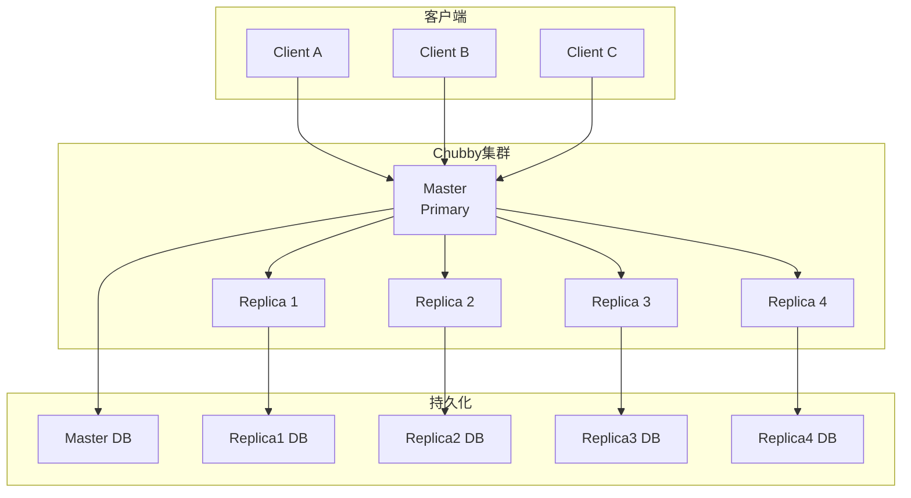
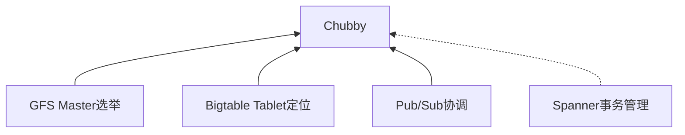
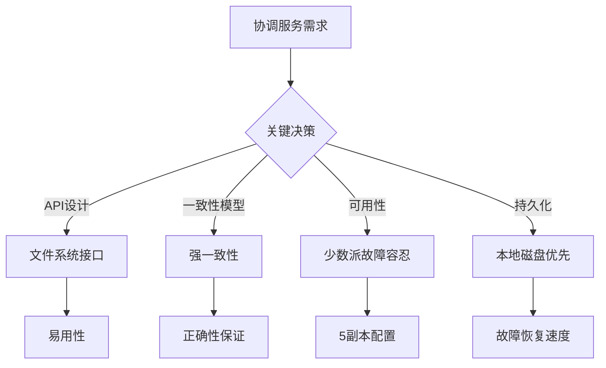
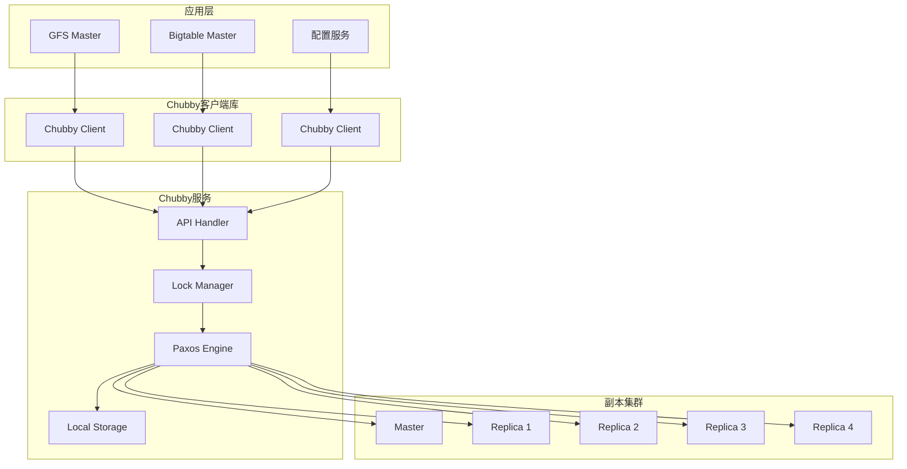
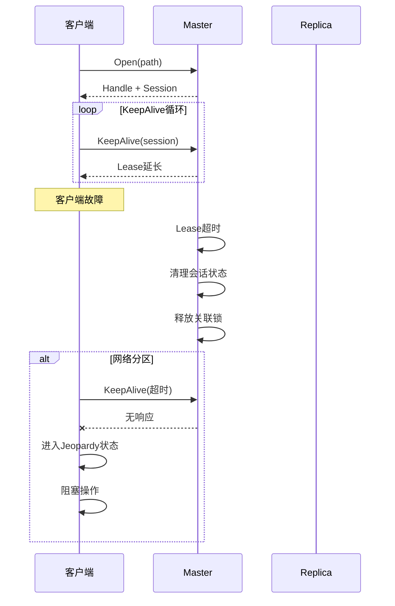
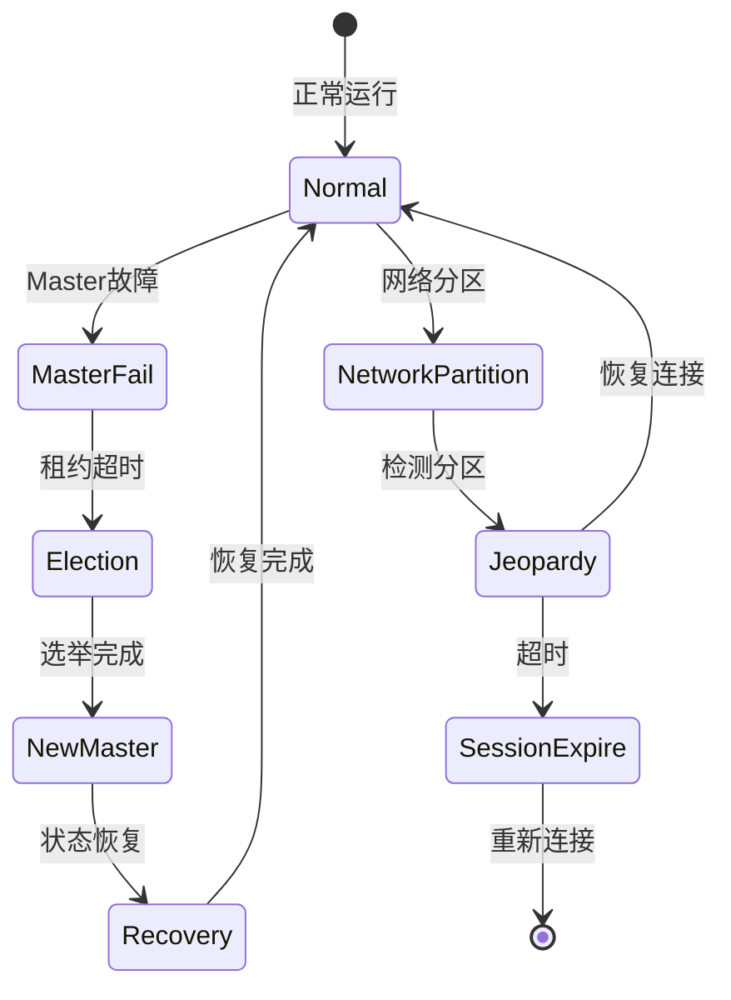

# Google Chubby 锁服务形式化验证

> **所属单元**: Tools/Industrial | **前置依赖**: [Google Kubernetes验证](./03-google-kubernetes.md) | **形式化等级**: L6

## 1. 概念定义 (Definitions)

### 1.1 Chubby 概述

**Def-T-10-01** (Chubby定义)。Chubby是Google开发的粗粒度锁服务，用于分布式系统的协调：

$$\text{Chubby} = \text{分布式文件系统接口} + \text{锁服务} + \text{Master选举}$$

**设计目标**：

- **可靠性**: 依赖文件系统的可靠性而非协议正确性
- **可用性**: 99.99%可用性保证
- **可理解性**: 类文件系统API，降低学习成本
- **粗粒度**: 适合长时间持有的锁（小时级）

**Def-T-10-02** (Chubby核心抽象)。Chubby提供以下抽象：

| 抽象 | 类型 | 用途 |
|------|------|------|
| 节点 (Node) | 持久化数据 | 存储元数据 |
| 锁 (Lock) | 互斥原语 | 分布式协调 |
| 句柄 (Handle) | 会话绑定 | 访问控制 |
| 事件 (Event) | 通知机制 | 状态变更 |

### 1.2 Paxos实现细节

**Def-T-10-03** (Chubby Paxos变体)。Chubby使用Multi-Paxos的优化实现：

$$\text{ChubbyPaxos} = \text{Leader持久化} + \text{本地磁盘存储} + \text{租约机制}$$

**与传统Paxos的区别**：

| 特性 | 经典Paxos | Chubby Paxos |
|------|-----------|--------------|
| Leader选举 | 无持久化 | Master持久化到磁盘 |
| 日志存储 | 内存/网络 | 本地磁盘 |
| 读操作 | 需Quorum | Master本地读 |
| 故障恢复 | 完全重放 | 磁盘快照恢复 |

**Def-T-10-04** (Master租约)。Master通过租约机制维持权威：

$$\text{MasterLease} = (T_{start}, T_{duration}, \text{Replicas})$$

**租约规则**：

1. Master持有效租约时可独立服务读请求
2. 写操作需复制到多数派Replica
3. 租约到期前必须续期（通过KeepAlive）
4. 租约到期触发新Master选举

### 1.3 容错设计

**Def-T-10-05** (故障域分布)。Chubby集群的故障域策略：

$$\text{Placement} = f(\text{Datacenter}, \text{PowerDomain}, \text{NetworkDomain})$$

**典型配置**：

- 5个Replica分布在不同故障域
- 跨越多个机架和电源域
- 支持跨区域部署

**Def-T-10-06** (故障恢复模型)。故障恢复时间界限：

$$T_{failover} \leq T_{lease} + T_{election} + T_{recovery}$$

其中：

- $T_{lease}$: 租约时长（默认12秒）
- $T_{election}$: 选举时间（通常<1秒）
- $T_{recovery}$: 状态恢复时间

## 2. 属性推导 (Properties)

### 2.1 锁服务性质

**Lemma-T-10-01** (锁互斥性)。同一时刻只有一个客户端持有锁：

$$\forall t: |\{c \mid \text{HoldLock}(c, t)\}| \leq 1$$

**Lemma-T-10-02** (锁安全性)。锁持有者被正确识别：

$$\text{HoldLock}(c) \Rightarrow \text{ValidSession}(c) \land \text{LockGranted}(c)$$

**Lemma-T-10-03** (会话关联)。锁与会话绑定：

$$\text{SessionExpired}(c) \Rightarrow \neg \text{HoldLock}(c)$$

### 2.2 Paxos协议性质

**Lemma-T-10-04** (Leader唯一性)。每个任期最多一个Leader：

$$\text{Leader}(r_1, T) \land \text{Leader}(r_2, T) \Rightarrow r_1 = r_2$$

**Lemma-T-10-05** (已提交值持久性)。已提交的写操作不丢失：

$$\text{Committed}(v, T) \land \text{MajorityAlive}(T') \Rightarrow \text{Available}(v, T')$$

## 3. 关系建立 (Relations)

### 3.1 Chubby架构



### 3.2 协调服务对比

| 特性 | Chubby | ZooKeeper | etcd | Consul |
|------|--------|-----------|------|--------|
| 协议 | Paxos | ZAB | Raft | Raft |
| API | 文件系统 | 文件系统 | 键值 | 键值+DNS |
| 语言 | C++ | Java | Go | Go |
| 一致性 | 强一致 | 顺序一致 | 线性一致 | 一致 |
| 观察机制 | 事件回调 | Watch | Watch | Watch |
| 典型用途 | GFS/BigTable | HBase/Kafka | K8s | 服务发现 |

### 3.3 Google内部依赖



## 4. 论证过程 (Argumentation)

### 4.1 为什么需要Chubby

Google内部系统的协调需求：

1. **GFS**: Master选举、Chunkserver监控
2. **Bigtable**: Tablet分配、Schema变更
3. **系统配置**: 动态配置分发
4. **服务发现**: 命名和位置服务

**设计权衡**：



### 4.2 Paxos工程优化

**优化1: 持久化Master状态**

```
传统Paxos: Master故障 → 新Master需重放全部日志
Chubby: Master故障 → 新Master从磁盘恢复状态
```

**优化2: 本地磁盘存储**

```
日志持久化到本地磁盘，而非依赖其他节点的内存
优势: 故障恢复快，不依赖网络重传
代价: 需要可靠磁盘，写入延迟增加
```

**优化3: 租约优化读**

```
Master持有效租约时，读操作无需Quorum确认
优势: 读性能提升
条件: 租约有效期内
```

## 5. 形式证明 / 工程论证 (Proof / Engineering Argument)

### 5.1 锁服务正确性

**Thm-T-10-01** (Chubby锁安全性)。Chubby锁服务保证互斥性：

$$\forall t: \text{Locked}(t) \Rightarrow \exists! c: \text{Holder}(c, t)$$

**证明概要**：

1. **锁授权**: 只有Master可授权锁
2. **Master唯一性**: Paxos保证任一时间只有一个Master
3. **会话绑定**: 锁与会话关联，会话过期自动释放
4. **事件通知**: 锁释放时通知等待者

**形式化不变式**：

```
LockInvariant ≡ ∀handle, t:
    LockGranted(handle, t) ⇒
        MasterValid(t) ∧
        SessionValid(handle.session, t) ∧
        ¬∃handle' ≠ handle: LockGranted(handle', t)
```

### 5.2 Paxos正确性

**Thm-T-10-02** (Chubby Paxos安全性)。Chubby的Paxos实现满足安全性：

$$\text{Committed}(v_1, n) \land \text{Committed}(v_2, n) \Rightarrow v_1 = v_2$$

**工程论证**：

基于Paxos的正确性，Chubby的实现保持以下性质：

1. **提案编号唯一**: 每个提案有唯一编号
2. **接受规则**: Replica只接受更高编号的提案
3. **多数派原则**: 提交需要多数派确认
4. **持久化保证**: 接受后先持久化再响应

## 6. 实例验证 (Examples)

### 6.1 锁使用模式

**模式1: 粗粒度锁（Master选举）**

```cpp
// GFS Master选举示例
class GFSMasterElection {
    ChubbyClient chubby;
    string lockPath = "/gfs/master/lock";

public:
    bool TryBecomeMaster() {
        try {
            handle = chubby.Open(lockPath, O_CREAT);
            if (chubby.TryLock(handle, EXCLUSIVE)) {
                // 成为Master
                chubby.SetContents(handle, myAddress);
                return true;
            }
        } catch (ChubbyException e) {
            // 锁被其他节点持有
            return false;
        }
        return false;
    }

    void KeepMaster() {
        // 保持会话活跃
        while (isMaster) {
            chubby.KeepAlive(handle);
            sleep(keepAliveInterval);
        }
    }
};
```

**模式2: 元数据存储（Bigtable Tablet位置）**

```cpp
// Bigtable Tablet位置服务
class TabletLocation {
    ChubbyClient chubby;

public:
    void RegisterTablet(string tabletId, ServerAddress addr) {
        string path = "/bigtable/tablets/" + tabletId;
        Handle h = chubby.Open(path, O_CREAT | O_WRONLY);
        chubby.SetContents(h, addr.ToString());

        // 创建临时节点，会话过期自动删除
        chubby.SetEphemeral(h, true);
    }

    ServerAddress LookupTablet(string tabletId) {
        string path = "/bigtable/tablets/" + tabletId;
        Handle h = chubby.Open(path, O_RDONLY);
        return ServerAddress::Parse(chubby.GetContents(h));
    }
};
```

### 6.2 Paxos TLA+规格片段

```tla
------------------------------ MODULE ChubbyPaxos -----------------------------
EXTENDS Integers, Sequences, FiniteSets, TLC

CONSTANTS Replicas, Values, MaxRound

VARIABLES
    round,          (* 当前轮次 *)
    value,          (* 提议值 *)
    acceptedRound,  (* 已接受轮次 *)
    acceptedValue,  (* 已接受值 *)
    committed,      (* 已提交值 *)
    isMaster        (* 是否为Master *)

(* 类型不变式 *)
TypeInvariant ==
    /\ round \in [Replicas → 0..MaxRound]
    /\ value \in [Replicas → Values ∪ {nil}]
    /\ acceptedRound \in [Replicas → 0..MaxRound]
    /\ acceptedValue \in [Replicas → Values ∪ {nil}]
    /\ committed \in SUBSET Values
    /\ isMaster \in [Replicas → BOOLEAN]

(* 安全性: 已提交值唯一 *)
Safety ==
    Cardinality(committed) ≤ 1

(* Master唯一性 *)
SingleMaster ==
    Cardinality({r \in Replicas: isMaster[r]}) ≤ 1

(* 提交值必然被接受 *)
CommitImpliesAccept ==
    \A v \in committed:
        \E Q \in Quorum, r \in Q:
            acceptedValue[r] = v
=============================================================================
```

## 7. 可视化 (Visualizations)

### 7.1 Chubby系统架构



### 7.2 会话与KeepAlive机制



### 7.3 Master故障转移



## 8. 引用参考 (References)
