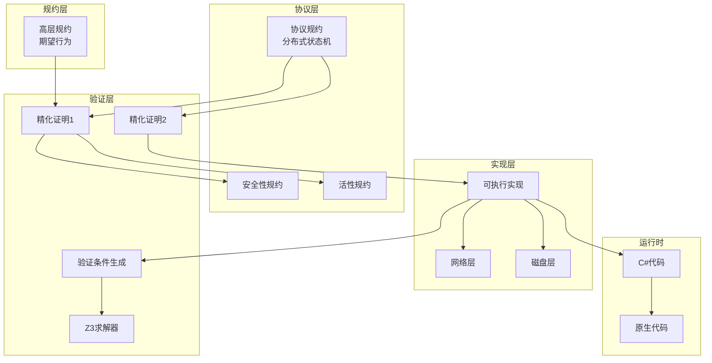
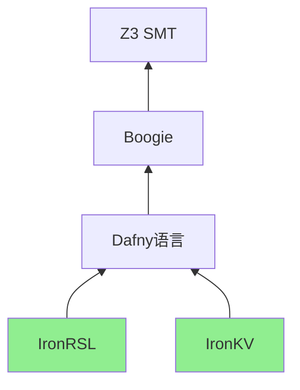
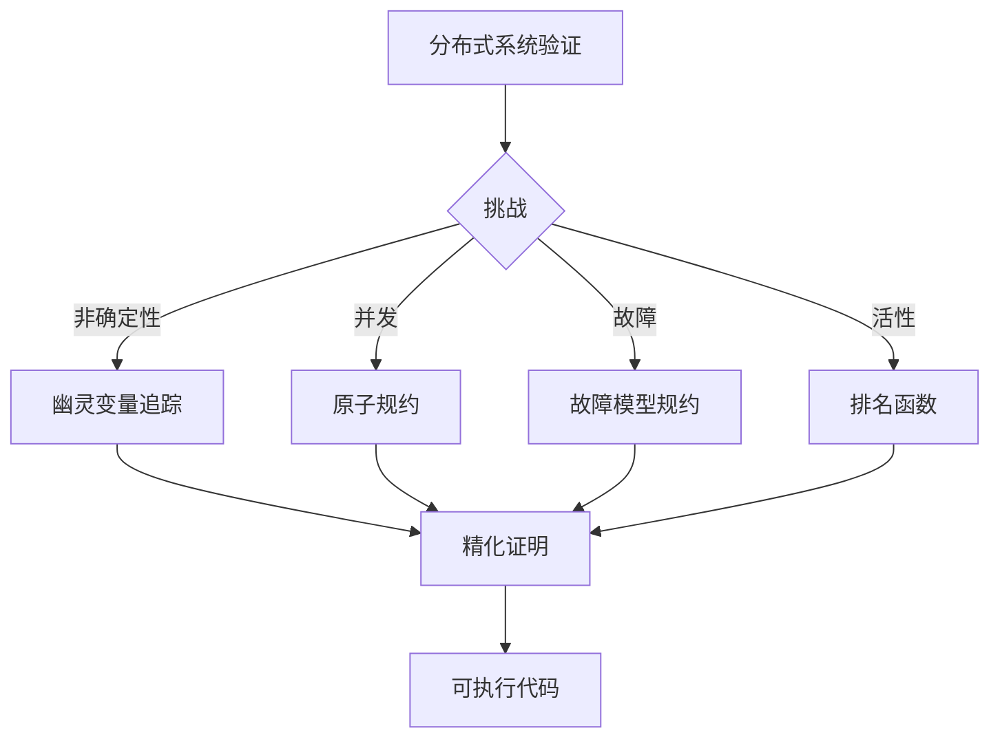
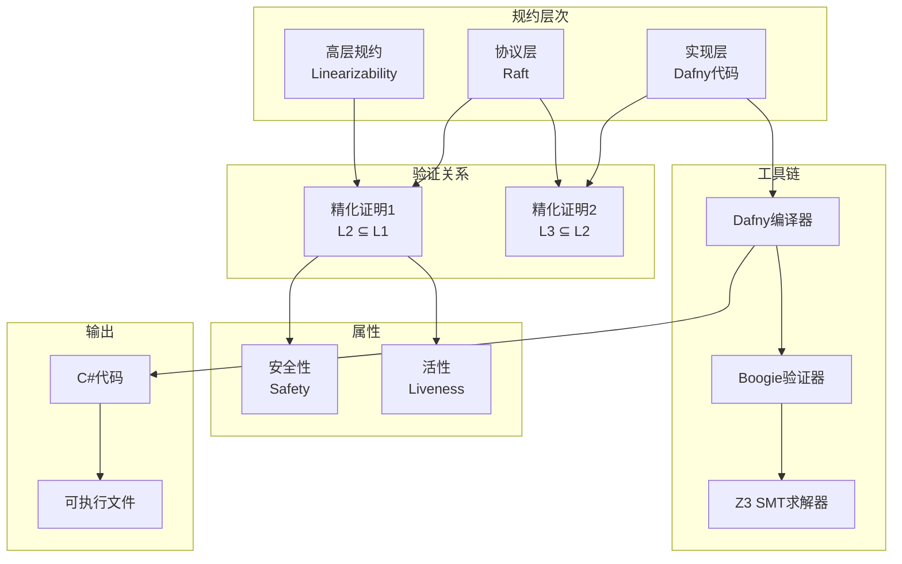
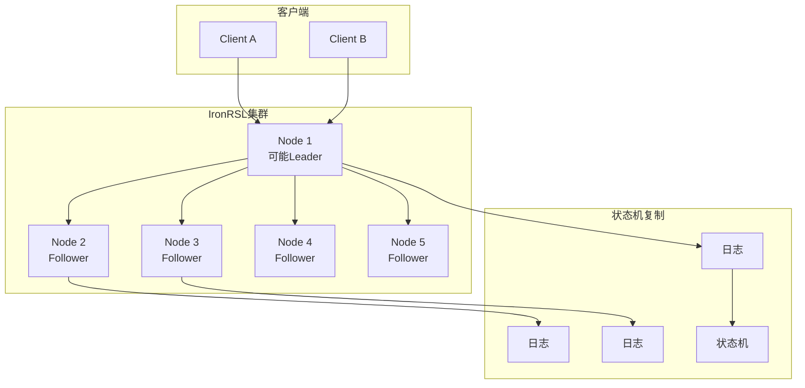
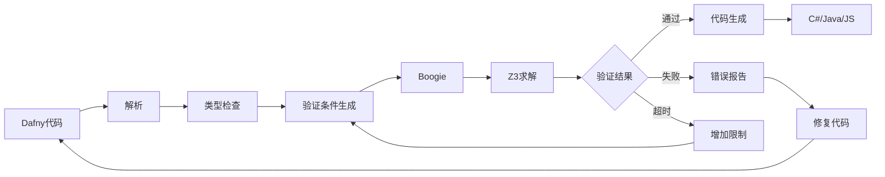

# IronFleet 分布式系统验证框架

> **所属单元**: Tools/Industrial | **前置依赖**: [Dafny学术工具](../academic/06-dafny.md) | **形式化等级**: L6

## 1. 概念定义 (Definitions)

### 1.1 IronFleet 概述

**Def-T-12-01** (IronFleet定义)。IronFleet是微软研究院开发的分布式系统形式化验证框架，使用Dafny语言实现：

$$\text{IronFleet} = \text{Dafny语言} + \text{精化证明} + \text{TLA风格规约} + \text{可执行代码}$$

**核心目标**：

- **端到端验证**: 从高层规约到可执行代码的完整证明链
- **实际性能**: 验证后的代码具有生产级性能
- **模块化验证**: 分层验证架构

**主要成果**：

- **IronRSL**: 验证的Raft共识实现
- **IronKV**: 验证的键值存储

**Def-T-12-02** (IronFleet验证栈)。IronFleet采用三层验证架构：

```
高层协议规格 (TLA+风格)
    ↓ 精化证明
中间层分布式系统规格
    ↓ 精化证明
可执行代码 (C#/Go)
```

### 1.2 Dafny 语言

**Def-T-12-03** (Dafny定义)。Dafny是微软研究院开发的支持形式化验证的编程语言：

$$\text{Dafny} = \text{命令式编程} + \text{函数式编程} + \text{自动定理证明}$$

**Dafny特性**：

| 特性 | 说明 | 示例 |
|------|------|------|
| 前置条件 | `requires` | `requires x > 0` |
| 后置条件 | `ensures` | `ensures result > 0` |
| 循环不变式 | `invariant` | `invariant i <= n` |
| 终止度量 | `decreases` | `decreases n - i` |
| 不变式 | `invariant` 类修饰 | `twostate predicate` |

**Def-T-12-04** (Dafny验证流程)。Dafny程序验证流程：

```
Dafny代码
    ↓ 解析
抽象语法树
    ↓ Boogie转换
Boogie中间语言
    ↓ Z3求解
验证结果 (通过/失败/超时)
```

### 1.3 精化方法论

**Def-T-12-05** (行为精化)。IronFleet使用行为精化（Behavioral Refinement）：

$$\text{Spec}_{low} \sqsubseteq \text{Spec}_{high} \triangleq \forall b: \text{Behaviors}(\text{Spec}_{low}, b) \Rightarrow \text{Behaviors}(\text{Spec}_{high}, b)$$

**Def-T-12-06** (分层规约)。IronFleet的三层规约结构：

| 层级 | 名称 | 描述 | 语言 |
|------|------|------|------|
| L1 | 高层规约 | 期望行为 | Dafny谓词 |
| L2 | 协议层 | 分布式协议 | Dafny状态机 |
| L3 | 实现层 | 可执行代码 | Dafny方法 |

## 2. 属性推导 (Properties)

### 2.1 分布式系统性质

**Lemma-T-12-01** (安全性传递)。精化保持安全性：

$$\text{Safe}(S_{high}) \land S_{low} \sqsubseteq S_{high} \Rightarrow \text{Safe}(S_{low})$$

**Lemma-T-12-02** (活性条件)。活性需要额外条件：

$$\text{Live}(S_{high}) \land S_{low} \sqsubseteq S_{high} \land \text{Fairness}(S_{low}) \Rightarrow \text{Live}(S_{low})$$

### 2.2 共识协议性质

**Lemma-T-12-03** (Raft安全性)。IronRSL保证Raft安全性：

$$\forall i, j: \text{Committed}_i(e) \land \text{Committed}_j(e') \land \text{Index}(e) = \text{Index}(e') \Rightarrow e = e'$$

**Lemma-T-12-04** (Raft活性)。在公平性假设下保证进展：

$$\text{LeaderElected} \land \text{NetworkReliable} \Rightarrow \Diamond \text{CommandCommitted}$$

## 3. 关系建立 (Relations)

### 3.1 IronFleet架构



### 3.2 验证框架对比

| 框架 | 语言 | 目标 | 自动化 | 性能 |
|------|------|------|--------|------|
| IronFleet | Dafny | 分布式系统 | 高 | 生产级 |
| Verdi | Coq | 分布式系统 | 中 | 原型级 |
| seL4 | Isabelle | 操作系统 | 中 | 生产级 |
| CompCert | Coq | 编译器 | 中 | 生产级 |

### 3.3 Dafny生态系统



## 4. 论证过程 (Argumentation)

### 4.1 分布式系统验证挑战

验证分布式系统面临的独特挑战：

1. **非确定性**: 网络延迟、消息丢失、时钟漂移
2. **并发复杂性**: 多节点并发执行
3. **故障模式**: 崩溃、网络分区、拜占庭故障
4. **活性证明**: 保证系统最终进展

**IronFleet解决方案**：



### 4.2 为什么使用Dafny

**Dafny vs 其他验证语言**：

| 特性 | Dafny | Coq | Isabelle | TLA+ |
|------|-------|-----|----------|------|
| 代码生成 | ✅ 直接 | ❌ 需提取 | ❌ 需提取 | ❌ 无 |
| 自动化 | ✅ 高 | ⚠️ 中 | ⚠️ 中 | ⚠️ TLC |
| 学习曲线 | 平缓 | 陡峭 | 陡峭 | 中等 |
| 工业应用 | 微软 | 学术 | 安全关键 | AWS |

## 5. 形式证明 / 工程论证 (Proof / Engineering Argument)

### 5.1 IronRSL正确性

**Thm-T-12-01** (IronRSL安全性和活性)。IronRSL实现满足Raft协议的正确性：

$$\text{IronRSL} \models \text{RaftSafety} \land \text{RaftLiveness}$$

**安全性包含**：

1. **选举安全性**: 每个任期最多一个Leader
2. **日志匹配**: 相同索引的条目内容相同
3. **Leader完备性**: 已提交条目存在于未来Leader日志
4. **状态机安全**: 已提交条目按顺序应用

**证明结构**：

```dafny
// 高层规约：线性化
predicate Linearizable(spec: Spec, history: History)
{
    exists seq: SequentialExecution ::
        SequentialConsistent(seq, history) &&
        SatisfiesSpec(seq, spec)
}

// 协议层规约：Raft状态机
datatype RaftState = RaftState(
    currentTerm: nat,
    log: seq<Entry>,
    commitIndex: nat,
    state: ServerState
)

// 精化关系
lemma RaftRefinesLinearizable()
    ensures forall h: History ::
        RaftBehavior(h) ==> Linearizable(RaftSpec, h)
```

### 5.2 IronKV正确性

**Thm-T-12-02** (IronKV正确性)。IronKV实现满足键值存储规约：

$$\forall k, v: \text{Put}(k, v) \leadsto \text{Get}(k) = v$$

**实现统计**：

| 组件 | 代码行 | 证明行 | 比例 |
|------|--------|--------|------|
| IronRSL核心 | 3,000 | 25,000 | 8:1 |
| IronRSL网络 | 1,500 | 10,000 | 7:1 |
| IronKV | 2,000 | 15,000 | 7:1 |
| 总计 | 6,500 | 50,000+ | 8:1 |

## 6. 实例验证 (Examples)

### 6.1 Dafny示例：简单共识模块

```dafny
// 高层规约：一致性
abstract module ConsensusSpec {
    type Value

    predicate Init(s: State)
    predicate Decide(s: State, v: Value)

    // 安全性：所有决定值一致
    predicate Safety(s: State) {
        forall v1, v2 ::
            Decide(s, v1) && Decide(s, v2) ==> v1 == v2
    }
}

// 实现：多数派投票
module MajorityVoting refines ConsensusSpec {
    type State = map<Node, Option<Value>>

    predicate Init(s: State) {
        forall n :: n in s && s[n].None?
    }

    method Vote(s: State, n: Node, v: Value)
        returns (s': State, decided: bool, decidedValue: Option<Value>)
        requires n in s && s[n].None?
        ensures s' == s[n := Some(v)]
        ensures decided ==>
            exists v' :: decidedValue == Some(v') &&
            CountVotes(s', v') > |s'| / 2
    {
        s' := s[n := Some(v)];
        var counts := CountAllVotes(s');
        decided, decidedValue := CheckMajority(counts);
    }

    function CountVotes(s: State, v: Value): nat {
        |set n | n in s && s[n] == Some(v)|
    }
}

// 精化证明
lemma MajorityVotingRefinesSpec()
    ensures forall s ::
        MajorityVoting.State(s) ==> ConsensusSpec.State(s)
    ensures forall s, v ::
        MajorityVoting.Decide(s, v) ==> ConsensusSpec.Decide(s, v)
```

### 6.2 IronRSL协议片段

```dafny
// Raft Leader选举（简化）
class RaftNode {
    var currentTerm: nat
    var votedFor: Option<Node>
    var state: State

    // 请求投票RPC处理
    method HandleRequestVote(term: nat, candidate: Node)
        returns (voteGranted: bool)
        requires Valid()
        ensures Valid()
        ensures term > currentTerm ==>
            currentTerm' == term && votedFor' == Some(candidate)
        ensures voteGranted ==>
            (votedFor.None? || votedFor == Some(candidate))
    {
        if term > currentTerm {
            currentTerm := term;
            votedFor := None;
            state := Follower;
        }

        voteGranted := (term == currentTerm) &&
                      (votedFor.None? || votedFor == Some(candidate));

        if voteGranted {
            votedFor := Some(candidate);
        }
    }

    // 选举安全不变式
    predicate ElectionSafety()
        reads this
    {
        // 每个任期最多投一票
        forall n1, n2 ::
            votedFor == Some(n1) && votedFor == Some(n2) ==> n1 == n2
    }
}
```

## 7. 可视化 (Visualizations)

### 7.1 IronFleet验证架构



### 7.2 IronRSL系统架构



### 7.3 Dafny验证流程



## 8. 引用参考 (References)
