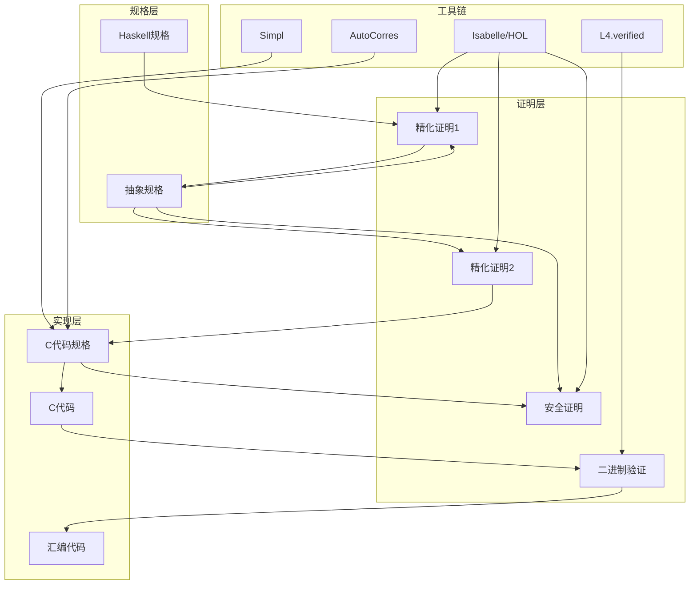
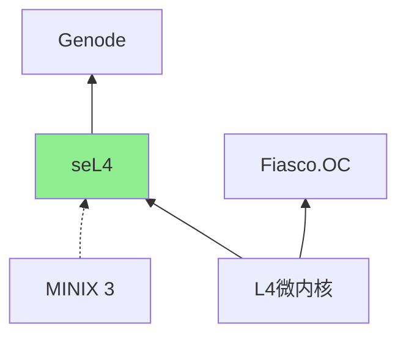
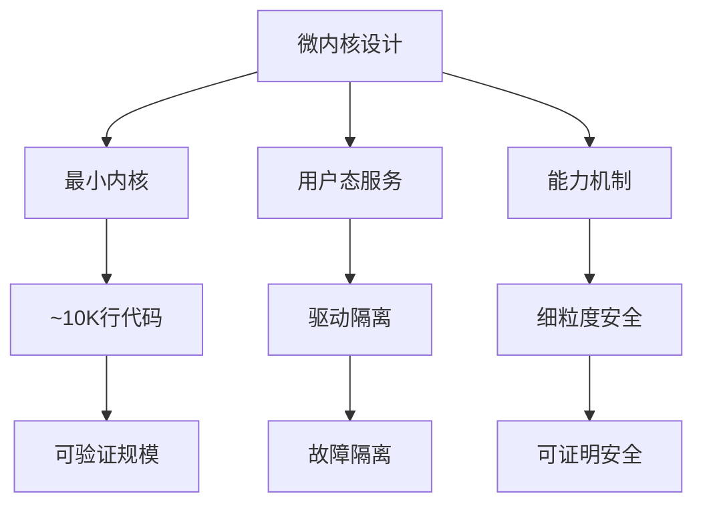
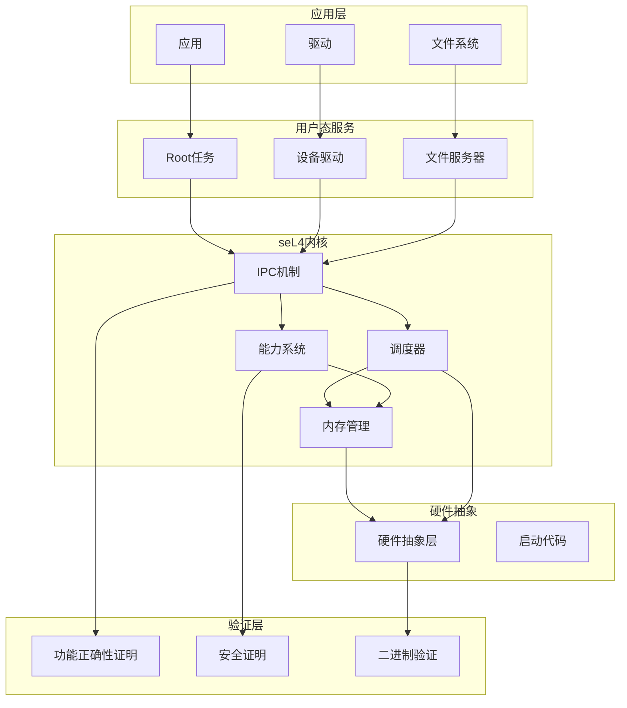
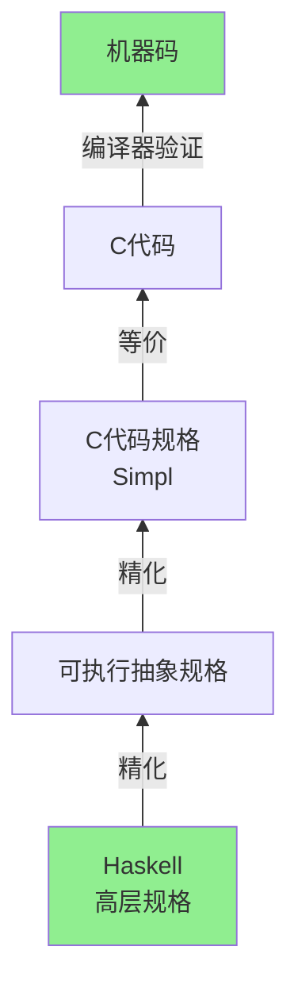
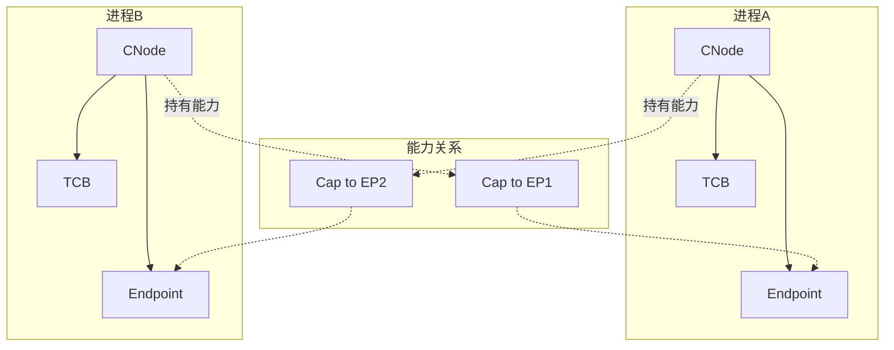

# seL4 微内核形式化验证案例研究

> **所属单元**: Tools/Industrial | **前置依赖**: [Coq/Isabelle定理证明](../../05-verification/03-theorem-proving/01-coq-isabelle.md) | **形式化等级**: L6

## 1. 概念定义 (Definitions)

### 1.1 seL4 概述

**Def-T-11-01** (seL4定义)。seL4是世界上第一个经过完整形式化验证的操作系统微内核：

$$\text{seL4} = \text{微内核} + \text{功能正确性证明} + \text{安全性质证明}$$

**里程碑意义**：

- **2009**: 完成功能正确性证明
- **2014**: 开源发布
- **2020**: 完成二进制验证
- **2022**: RISC-V架构支持

**核心特性**：

- 约10,000行C代码
- 用Isabelle/HOL完成形式化验证
- 证明代码与规格等价
- 提供安全性和完整性保证

**Def-T-11-02** (功能正确性定义)。seL4的功能正确性形式化定义：

$$\text{FunctionalCorrectness} \triangleq \text{C代码} \sim \text{抽象规格} \sim \text{高层规格}$$

其中 $\sim$ 表示精化关系（refinement）。

### 1.2 微内核架构

**Def-T-11-03** (seL4核心抽象)。seL4提供以下核心抽象：

| 抽象 | 类型 | 功能 |
|------|------|------|
| Thread Control Block (TCB) | 调度单元 | 线程管理 |
| Endpoint | IPC通道 | 进程间通信 |
| Notification | 信号机制 | 事件通知 |
| Untyped Memory | 原始内存 | 内存分配 |
| CNode | 能力表 | 权限管理 |
| Page Table | 地址映射 | 内存映射 |

**Def-T-11-04** (能力机制)。seL3使用能力（Capability）进行访问控制：

$$\text{Capability} = (\text{Object}, \text{Rights}, \text{Badge})$$

**能力操作**：

- **Grant**: 转移或复制能力
- **Mint**: 创建受限能力
- **Revoke**: 撤销能力
- **Delete**: 删除能力

### 1.3 验证范围

**Def-T-11-05** (验证栈层次)。seL4验证形成三层精化链：

```
高层抽象规格 (Haskell)
    ↓ 精化证明
可执行抽象规格
    ↓ 精化证明
C代码实现
    ↓ 二进制验证
机器码
```

**验证性质**：

| 性质 | 定义 | 状态 |
|------|------|------|
| 功能正确性 | C代码满足抽象规格 | ✅ 已完成 |
| 安全性 | 信息流安全 | ✅ 已证明 |
| 完整性 | 系统状态完整性 | ✅ 已证明 |
| 二进制验证 | C代码与编译输出等价 | ✅ 已完成 |

## 2. 属性推导 (Properties)

### 2.1 功能正确性性质

**Lemma-T-11-01** (系统调用精化)。每个系统调用实现精化其抽象规格：

$$\forall sc \in \text{Syscalls}: \text{C_Implementation}(sc) \sqsubseteq \text{Abstract_Spec}(sc)$$

**Lemma-T-11-02** (内核不变式)。内核维护关键不变式：

$$\text{KernelInvariant} \triangleq \text{WellFormedCapTable} \land \text{ValidMemory} \land \text{ConsistentScheduler}$$

**Lemma-T-11-03** (隔离保证)。用户进程相互隔离：

$$\forall p_1, p_2: p_1 \neq p_2 \Rightarrow \text{Memory}(p_1) \cap \text{Memory}(p_2) = \emptyset$$

### 2.2 安全性质

**Lemma-T-11-04** (非干扰性)。高安全级进程不干扰低安全级进程：

$$\forall l_1 > l_2: \text{Observations}_{l_2}(\text{Exec}_{l_1}) = \text{Observations}_{l_2}(\text{Exec}'_{l_1})$$

**Lemma-T-11-05** (完整性)。系统完整性不受用户态影响：

$$\text{UserExecution} \Rightarrow \text{KernelState} \in \text{ValidStates}$$

## 3. 关系建立 (Relations)

### 3.1 seL4验证架构



### 3.2 OS验证项目对比

| 项目 | 目标 | 方法 | 规模 | 状态 |
|------|------|------|------|------|
| seL4 | 微内核 | Isabelle | 10K LoC | 完成 |
| CompCert | 编译器 | Coq | 40K LoC | 完成 |
| CertiKOS | 内核 | Coq | 6K LoC | 完成 |
| Ironclad | 应用栈 | Dafny | 8K LoC | 完成 |
| Verdi | 分布式 | Coq | - | 进行中 |

### 3.3 微内核设计空间



## 4. 论证过程 (Argumentation)

### 4.1 为什么选择微内核

完整操作系统验证的挑战：

1. **规模问题**: 传统内核数百万行代码
2. **并发复杂性**: 多处理器、中断、并发
3. **硬件交互**: 设备驱动、DMA、内存映射
4. **演化速度**: 快速迭代与形式化验证的矛盾

**微内核优势**：



### 4.2 验证方法选择

**为什么选择Isabelle/HOL**：

| 因素 | Isabelle/HOL | Coq | PVS |
|------|-------------|-----|-----|
| 自动化 | 高 | 中 | 高 |
| 证明可读性 | 高 | 中 | 中 |
| 工业支持 | 强 | 强 | 中 |
| 工具成熟度 | 高 | 高 | 中 |

**验证工具链**：

1. **Simpl**: C代码逻辑嵌入
2. **AutoCorres**: C到Isabelle的自动转换
3. **L4.verified**: 专用验证框架
4. **C Parser**: C代码解析

## 5. 形式证明 / 工程论证 (Proof / Engineering Argument)

### 5.1 精化证明

**Thm-T-11-01** (seL4功能正确性)。seL4 C代码精化其抽象规格：

$$\text{C_code} \sqsubseteq \text{Abstract_Spec}$$

**证明结构**：

```
1. 高层规格 (Haskell)
   - 定义内核行为
   -  Haskell实现可执行

2. 可执行抽象规格
   - 移除Haskell高级特性
   - 转换为单子风格

3. C代码规格 (Simpl)
   - C代码的逻辑表示
   - 使用Hoare逻辑

4. 精化证明
   - 证明(3)精化(2)
   - 证明(2)精化(1)
```

**证明统计**：

| 层级 | 代码行 | 证明行 | 比例 |
|------|--------|--------|------|
| 高层规格 | 3,700 | - | - |
| 可执行规格 | 5,800 | 8,000 | 1.4:1 |
| C代码 | 9,700 | 20,000 | 2:1 |
| 总体验证 | - | 200,000+ | 20:1 |

### 5.2 安全性质证明

**Thm-T-11-02** (信息流安全)。seL4满足非干扰性（Non-Interference）：

$$\forall s_1, s_2: s_1 \approx_L s_2 \Rightarrow \text{Exec}(s_1) \approx_L \text{Exec}(s_2)$$

其中 $\approx_L$ 表示低安全级等价。

**证明方法**：

1. **不变式方法**: 证明系统维护安全不变式
2. **unwinding**: 证明单步满足非干扰性
3. **传递闭包**: 推广到完整执行

**完整性定理**：

$$\text{Integrity}(S) \triangleq \forall o \in \text{Objects}: \text{Authorised}(o, S)$$

## 6. 实例验证 (Examples)

### 6.1 系统调用规格示例

**seL4_Send系统调用（简化）**：

```isabelle
(* Isabelle/HOL 规格 *)
fun seL4_Send :: "word32 ⇒ message_info ⇒ unit kernel" where
  "seL4_Send dest_ptr msg_info = do
     thread ← getCurThread;
     dest ← lookupCap thread dest_ptr;
     case dest of
       EndpointCap ep rights ⇒
         if AllowSend ∈ rights then
           sendIPC thread ep msg_info
         else
           throw IllegalOperation
     | _ ⇒ throw InvalidCapability
   od"
```

**对应C代码**：

```c
// C实现
exception_t handleSend(bool blocking, bool do_call) {
    cte_t *slot;
    cap_t cap;

    // 查找目标能力
    lookupCapAndSlot(&slot, &cap);

    switch (cap_get_capType(cap)) {
        case cap_endpoint_cap:
            if (!cap_endpoint_cap_get_capCanSend(cap)) {
                current_fault = seL4_Fault_CapFault_new(0, true);
                return EXCEPTION_FAULT;
            }
            // 执行IPC发送
            sendIPC(blocking, do_call,
                   cap_endpoint_cap_get_capEPPtr(cap));
            return EXCEPTION_NONE;
        // ...
    }
}
```

### 6.2 验证结果统计

```
seL4验证规模统计
================

代码规模:
- C代码: 9,736 SLOC
- 汇编代码: 544 SLOC
- 规格代码: ~9,000 SLOC

证明规模:
- 总证明脚本: ~200,000+ 行
- 精化证明: ~100,000 行
- 安全证明: ~50,000 行
- 其他: ~50,000 行

验证时间:
- 完整验证: ~10小时 (2014)
- 增量验证: 分钟级
- 现代硬件: <1小时

缺陷发现:
- 证明前发现缺陷: 144个
- 证明后发现缺陷: 0个 (内核代码)
- 配置缺陷: 2个
```

## 7. 可视化 (Visualizations)

### 7.1 seL4验证栈



### 7.2 精化链



### 7.3 能力系统架构



## 8. 引用参考 (References)
