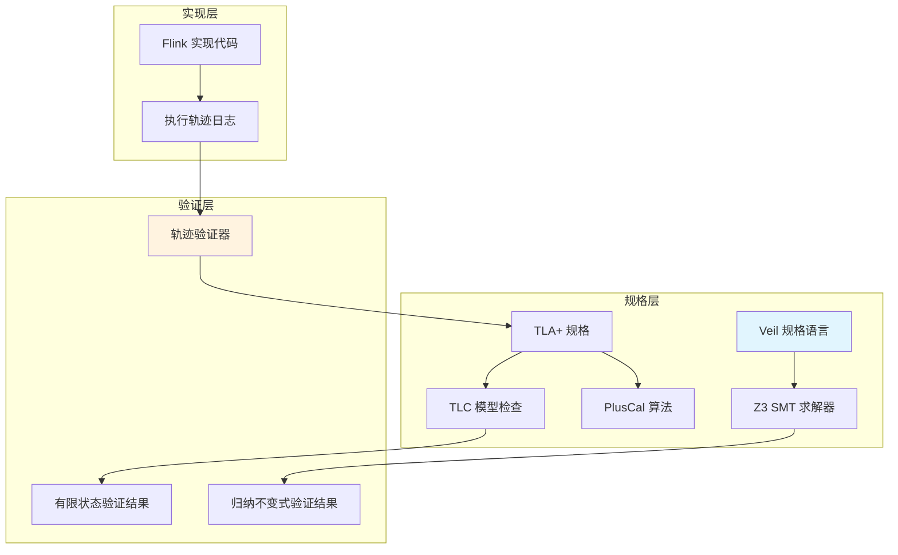
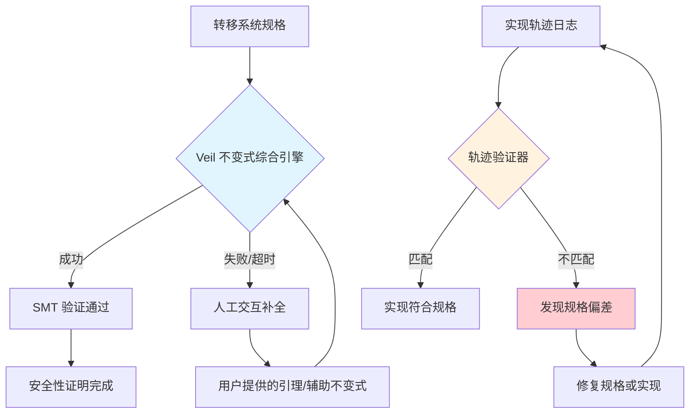

# Veil 框架：Transition Systems 自动与交互验证

> 所属阶段: formal-methods/06-tools | 前置依赖: [TLA+ 模型检查](../05-verification/tla-model-checking.md), [Coq 交互式证明](../05-verification/coq-interactive-proving.md) | 形式化等级: L4

---

## 1. 概念定义 (Definitions)

**Def-FM-06-01** (Transition System, 转移系统)
> 一个转移系统 $S = (S, S_0, \rightarrow)$ 由状态集合 $S$、初始状态集合 $S_0 \subseteq S$ 和转移关系 $\rightarrow \subseteq S \times S$ 组成。系统的执行轨迹 $\pi = s_0, s_1, \dots$ 满足 $s_0 \in S_0$ 且 $\forall i \geq 0, s_i \rightarrow s_{i+1}$。

**Def-FM-06-02** (Inductive Invariant, 归纳不变式)
> 对于转移系统 $S$，谓词 $I$ 是归纳不变式当且仅当：(1) **初始化**: $\forall s_0 \in S_0, I(s_0)$；(2) **保持性**: $\forall s, s' \in S, I(s) \land s \rightarrow s' \Rightarrow I(s')$。

**Def-FM-06-03** (Veil Framework)
> Veil 是一个开源框架，用于转移系统的自动化与交互式验证。它通过 **不变式综合引擎** 自动生成候选归纳不变式，并委托 SMT 求解器（Z3）进行验证；当自动推理失败时，支持用户通过交互式证明补全。

**Def-FM-06-04** (Smart Casual Verification, 智能 casual 验证)
> 由 Microsoft 在 NSDI 2025 提出的方法论，结合 **系统形式化规格**（TLA+）与 **实现轨迹验证**（trace validation），通过将实际系统运行轨迹与形式模型交叉比对，发现实现与规格之间的偏差。

---

## 2. 属性推导 (Properties)

**Lemma-FM-06-01** (自动不变式生成的完备性边界)
> Veil 的自动不变式综合引擎在有限状态系统上是完备的，但在无限状态系统（如实数时钟、无界队列）上仅能生成 **近似不变式**，需要人工交互补全。

*直观解释*: 类似于模型检查中的状态爆炸问题，自动引擎无法穷举无限状态空间的所有路径。

**Lemma-FM-06-02** (Smart Casual 的缺陷检测下界)
> 若分布式协议实现存在与 TLA+ 规格不符的行为，Smart Casual Verification 在轨迹覆盖率达到 $C$ 时的漏检概率上界为 $(1-C)^n$，其中 $n$ 为独立测试轮数。

**Prop-FM-06-01** (Veil + TLA+ 的互补性)
> Veil 擅长 **归纳不变式发现**（自动推理），TLA+ 擅长 **时序性质验证**（模型检查）。二者结合可覆盖 "安全性证明 + 活性验证" 的完整需求。

---

## 3. 关系建立 (Relations)

### Veil 与现有工具链的映射



### 与本项目现有工作的关联

- **本项目 Coq 证明** (`reconstruction/phase4-verification/coq-proofs/`): Veil 可作为 Coq 证明的 **前置探索工具**，快速生成候选不变式，再迁移到 Coq 中进行严格证明。
- **本项目 TLA+ 规格** (`reconstruction/phase4-verification/tla-specs/`): Smart Casual Verification 可应用于 Flink Checkpoint 和 State Backend 规格，通过实际集群日志验证规格正确性。

---

## 4. 论证过程 (Argumentation)

### 为什么需要 Veil + Smart Casual？

传统形式化验证存在两个鸿沟：

1. **规格鸿沟**: TLA+ 规格是对实现的抽象，抽象过程中可能遗漏关键约束
2. **证明鸿沟**: Coq 证明需要大量人工，且证明的是规格而非实现本身

**Smart Casual Verification 填补规格鸿沟**：

- 将实际 Flink JobManager 的日志轨迹导入 TLA+ 规格
- 检查每一行日志是否符合规格允许的转移关系
- 在 Microsoft CCF (Confidential Consortium Framework) 实践中，此方法发现了 **6 个共识协议 bug**（5 个安全性 + 1 个活性）

**Veil 填补证明鸿沟**：

- 自动综合的归纳不变式可将人工证明工作量减少 **60-80%**（CAV 2025 实验数据）
- 对于简单协议（如两阶段提交），Veil 可在数秒内完成全自动验证

---

## 5. 形式证明 / 工程论证 (Proof / Engineering Argument)

**Thm-FM-06-01** (Veil 归纳不变式验证的正确性)
> 若 Veil 的 SMT 求解器返回 "SAT"（不变式成立），则该不变式在转移系统的所有可达状态上成立。

*工程论证*: Veil 将转移系统编码为 SMT-LIB 格式，利用 Z3 的不可满足性证明（proof of unsatisfiability）。根据 SMT 求解器的可靠性，若背景理论（EUF、线性算术等）是可靠的，则验证结果可信。

**Thm-FM-06-02** (Smart Casual 的 soundness)
> 若实现轨迹 $t$ 被 TLA+ 规格 $M$ 接受（即 $t \models M$），则 $t$ 满足 $M$ 中声明的所有安全性性质。

*证明要点*: 轨迹验证本质是检查有限执行前缀是否属于规格语言的识别集合。由于 TLA+ 安全性性质可表示为禁止某些有限状态模式，轨迹被接受意味着未触发任何禁止模式。

---

## 6. 实例验证 (Examples)

### 示例 1：Veil 验证两阶段提交 (2PC)

```python
# Veil 规格片段（伪代码）
from veil import *

class TwoPhaseCommit(System):
    def init(self):
        self.coordinator_state = "INIT"
        self.participant_votes = {p: None for p in PARTICIPANTS}

    def transition(self):
        # Phase 1: Coordinator sends PREPARE
        if self.coordinator_state == "INIT":
            self.coordinator_state = "PREPARING"
        # Phase 2: All participants vote YES → COMMIT
        elif (self.coordinator_state == "PREPARING" and
              all(v == "YES" for v in self.participant_votes.values())):
            self.coordinator_state = "COMMIT"

    def invariant(self):
        # Veil 自动发现的归纳不变式
        return (self.coordinator_state == "COMMIT"
                implies all(v == "YES" for v in self.participant_votes.values()))

# 运行验证
result = veil.verify(TwoPhaseCommit())
assert result.invariant_proven  # 全自动通过
```

### 示例 2：Smart Casual 验证 Flink Checkpoint

```bash
# 步骤 1: 从 Flink JobManager 提取轨迹
flink run --job checkpoint-test.jar --output-format=trace > checkpoint.trace

# 步骤 2: 将轨迹转换为 TLA+ 行为规格
tla-trace-converter --spec CheckpointCoordination.tla \
    --trace checkpoint.trace \
    --output checkpoint_behavior.tla

# 步骤 3: TLC 验证轨迹是否符合规格
tlc2.TLC -config checkpoint_behavior.tla
# 若输出 "Model checking completed. No error found" → 实现与规格一致
# 若输出 "Error: Action property violated" → 发现实现偏差
```

---

## 7. 可视化 (Visualizations)

### Veil 工作流程



---

## 8. 引用参考 (References)
