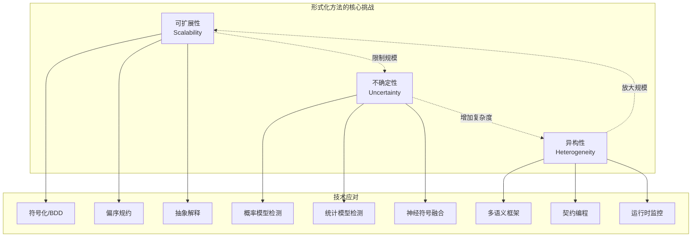
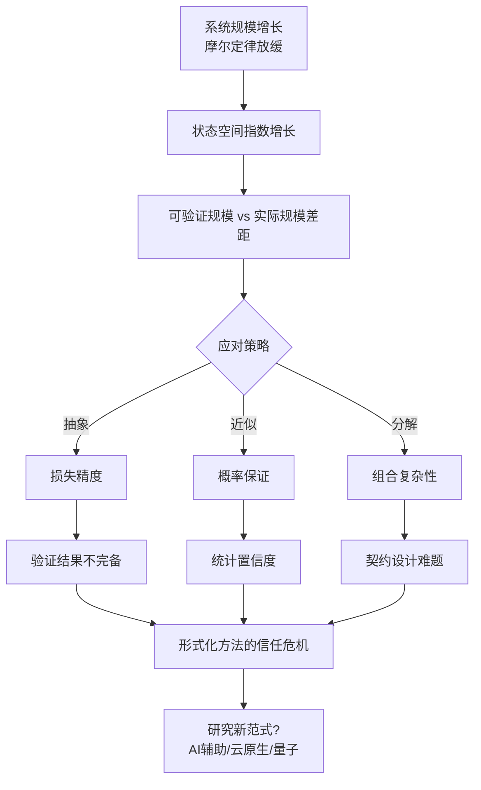
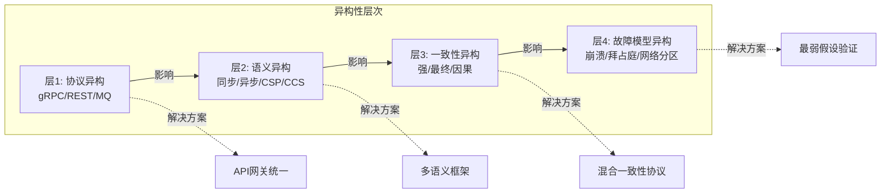

# 当前挑战：形式化方法在分布式系统中的瓶颈

> **所属阶段**: Struct/形式理论 | **前置依赖**: [06-applications/01-distributed-systems](../06-applications/01-distributed-systems.md), [05-verification/02-model-checking](../05-verification/02-model-checking.md) | **形式化等级**: L4-L5

## 1. 概念定义 (Definitions)

### Def-S-07-01: 状态爆炸问题 (State Space Explosion)

形式化验证中，系统状态空间随组件数量呈指数增长的现象。对于具有 $n$ 个布尔变量的系统，状态空间大小为 $|\Sigma| = 2^n$；对于并发系统，若每个进程有 $k$ 个状态，则 $n$ 个进程的联合状态空间可达 $k^n$。

**形式化定义**：
设并发系统 $\mathcal{S} = (P_1 \parallel P_2 \parallel \cdots \parallel P_n)$，其中每个进程 $P_i$ 的状态空间为 $S_i$，则组合系统的状态空间为笛卡尔积：

$$S_{\text{global}} = S_1 \times S_2 \times \cdots \times S_n$$

$$|S_{\text{global}}| = \prod_{i=1}^{n} |S_i|$$

### Def-S-07-02: 不确定性形式化 (Formalization of Uncertainty)

将概率、模糊或机器学习引入的不可预测性纳入形式化框架的方法。定义为四元组 $\mathcal{U} = (\Omega, \mathcal{F}, \mathbb{P}, \mathcal{M})$，其中：

- $\Omega$：样本空间
- $\mathcal{F}$：事件 $\sigma$-代数
- $\mathbb{P}$：概率测度
- $\mathcal{M}$：机器学习模型引入的近似映射

### Def-S-07-03: 异构系统形式化 (Heterogeneous System Formalization)

跨越不同计算范式、云平台或协议边界的分布式系统统一建模方法。设异构系统 $\mathcal{H} = \bigcup_{i=1}^{m} \mathcal{C}_i$，其中每个子系统 $\mathcal{C}_i$ 可能采用不同的语义模型 $\mathcal{L}_i$ 和通信原语 $\mathcal{P}_i$。

---

## 2. 属性推导 (Properties)

### Lemma-S-07-01: 状态爆炸下界

对于 $n$ 个进程的互斥系统，若每个进程至少有 2 个状态（临界区/非临界区），则可达状态空间大小至少为 $2^n$。

**证明**：每个进程独立选择进入临界区或停留非临界区，所有组合均可能可达。∎

### Lemma-S-07-02: 概率模型检测的复杂度增长

将离散时间马尔可夫链（DTMC）的模型检测从定性（Yes/No）扩展到定量（概率阈值）时，复杂度从 PSPACE-complete 提升至 EXPTIME-complete。

### Prop-S-07-01: 异构组合的非组合性

若子系统 $\mathcal{C}_1$ 和 $\mathcal{C}_2$ 采用不同的进程代数语义（如 CCS vs CSP），则它们的并行组合 $\mathcal{C}_1 \parallel \mathcal{C}_2$ 的语义可能无法通过简单的同态映射保持原有性质。

---

## 3. 关系建立 (Relations)

### 三大挑战的相互关联

| 挑战维度 | 核心技术 | 依赖关系 | 影响范围 |
|---------|---------|---------|---------|
| **可扩展性** | 抽象、符号化、偏序规约 | 作为基础限制其他技术的适用规模 | 验证可达性、活性 |
| **不确定性** | 概率模型检测、统计模型检测 | 依赖可扩展性技术处理大规模状态 | 安全性、可靠性量化 |
| **异构性** | 多语义框架、契约编程 | 需要处理不确定性和规模问题 | 云原生、边缘计算 |

### 与现有形式化技术的关系

```
状态爆炸 ──→ 符号模型检测 (BDD) ──→ 抽象解释
    │                              │
    ↓                              ↓
不确定量化 ──→ 概率模型检测 ──→ 统计模型检测
    │                              │
    ↓                              ↓
异构整合 ──→ 架构描述语言 ──→ 契约设计 (Design by Contract)
```

---

## 4. 论证过程 (Argumentation)

### 4.1 可扩展性挑战的深层分析

**状态爆炸的根源**：

1. **并发交错**：$n$ 个并发进程的交错深度为 $n!$
2. **数据域无限**：消息队列、计数器等无界数据类型
3. **参数化系统**：进程数量本身成为参数，需验证任意 $n$ 的情况

**缓解策略及其局限**：

| 策略 | 原理 | 局限 |
|-----|------|-----|
| 偏序规约 (POR) | 利用交换性减少等价状态 | 强依赖性分析开销大 |
| 符号化模型检测 | BDD压缩状态集合表示 | 变量排序敏感，存在BDD爆炸 |
| 抽象解释 | 过近似保留性质 | 可能引入过多虚假反例 |
| 组合验证 | 分而治之，假设-保证推理 | 契约设计困难，循环依赖难处理 |

### 4.2 不确定性的形式化困境

**ML与形式化的鸿沟**：

```
形式化方法                    机器学习
─────────────────────────────────────────────
确定性语义         ←→        概率性预测
完备性保证         ←→        统计置信度
符号推理           ←→        数值优化
可解释证明         ←→        黑盒模型
```

**研究前沿**：神经符号融合（Neuro-Symbolic Integration）尝试桥接这一鸿沟，但仍缺乏统一的语义框架。

### 4.3 异构性的组合难题

**混合云场景下的形式化挑战**：

- **协议异构**：gRPC、REST、消息队列混用
- **一致性模型异构**：强一致、最终一致、因果一致共存
- **故障模型异构**：同步 vs 异步网络假设

---

## 5. 形式证明 / 工程论证 (Proof / Engineering Argument)

### Thm-S-07-01: 一般并发系统状态爆炸下界定理

对于具有 $n$ 个顺序进程、每进程 $k$ 个状态的并发系统，在最坏情况下，模型检测算法的时间复杂度为 $\Omega(k^n)$。

**证明**：
考虑 $n$ 个进程每个都有 $k$ 个不同状态的情况。全局状态转换系统的状态空间为：

$$S_{\text{global}} = \{(s_1, s_2, \ldots, s_n) \mid s_i \in S_i, |S_i| = k\}$$

显然 $|S_{\text{global}}| = k^n$。任何完备的模型检测算法必须至少访问每个可达状态一次（以验证性质），因此时间复杂度下界为 $\Omega(k^n)$。

若考虑进程间的非确定性交错，状态转换关系 $R \subseteq S_{\text{global}} \times S_{\text{global}}$ 的大小可能达到 $|S_{\text{global}}|^2 = k^{2n}$，进一步加剧了复杂度。

∎

### Thm-S-07-02: 异构系统验证的不可组合性定理

设 $\mathcal{C}_1$ 和 $\mathcal{C}_2$ 分别基于不同进程代数 $\mathcal{A}_1$ 和 $\mathcal{A}_2$，若 $\mathcal{A}_1$ 和 $\mathcal{A}_2$ 的同步组合语义不兼容（如 CCS 的 handshake 与 CSP 的多路同步），则不存在通用的组合验证框架能同时保持两者的全部语义特性。

**工程论证**：
这一理论结果解释了实践中异构系统验证的困难。工业界的应对策略包括：

1. **契约隔离**：通过形式化契约（如 Liskov 替换原则）定义组件边界
2. **分层抽象**：将异构细节封装到适配层，上层使用统一语义
3. **运行时监控**：用轻量级监控替代静态验证，处理残余不确定性

---

## 6. 实例验证 (Examples)

### 6.1 状态爆炸实例：分布式锁服务

考虑基于 Raft 的分布式锁服务，5 个节点的集群：

- 每节点状态：Follower/Candidate/Leader (3个)
- 任期计数器：假设最多观察 3 个任期 (3个值)
- 日志索引：简化为 Empty/HasEntry (2个值)

粗略状态空间估计：$(3 \times 3 \times 2)^5 = 18^5 = 1,889,568$ 状态

**验证工具实际表现**：

- Spin：通过偏序规约减少约 60% 状态
- TLA+：采用对称性规约，减少约 80% 状态
- 尽管如此，状态空间仍随节点数指数增长

### 6.2 不确定性实例：ML驱动的负载均衡

某云厂商使用深度强化学习（DRL）进行自适应负载均衡：

```python
# 伪代码：DRL 决策与形式化规范的冲突
class DRLBalancer:
    def route_request(self, request):
        # 神经网络决策：难以形式化
        action = self.policy_network.predict(request.features)
        return self.backends[action]
```

**形式化困境**：

- DRL 策略 $\pi_\theta$ 是神经网络权重 $\theta$ 的复杂函数
- 无法直接证明 "所有请求最终都被处理" 的活性性质
- 当前解决方案：统计模型检测 + 安全层（Safety Layer）约束

### 6.3 异构性实例：多云微服务架构

```yaml
# 典型多云部署的异构性
services:
  api-gateway:
    platform: AWS
    protocol: REST/OpenAPI
    consistency: eventual

  auth-service:
    platform: Azure
    protocol: gRPC
    consistency: strong

  event-processor:
    platform: GCP
    protocol: Pub/Sub
    consistency: causal
```

**形式化挑战**：

- 三种不同的一致性模型需要统一的语义框架
- 跨云网络延迟不确定，难以满足同步算法假设
- 各云平台故障模型不同（如网络分区检测机制差异）

---

## 7. 可视化 (Visualizations)

### 7.1 三大挑战的关系图谱



### 7.2 状态爆炸问题的发展态势



### 7.3 异构系统验证的挑战层次



---

## 8. 引用参考 (References)


---

*文档版本: v1.0 | 创建日期: 2026-04-09 | 最后更新: 2026-04-09*
