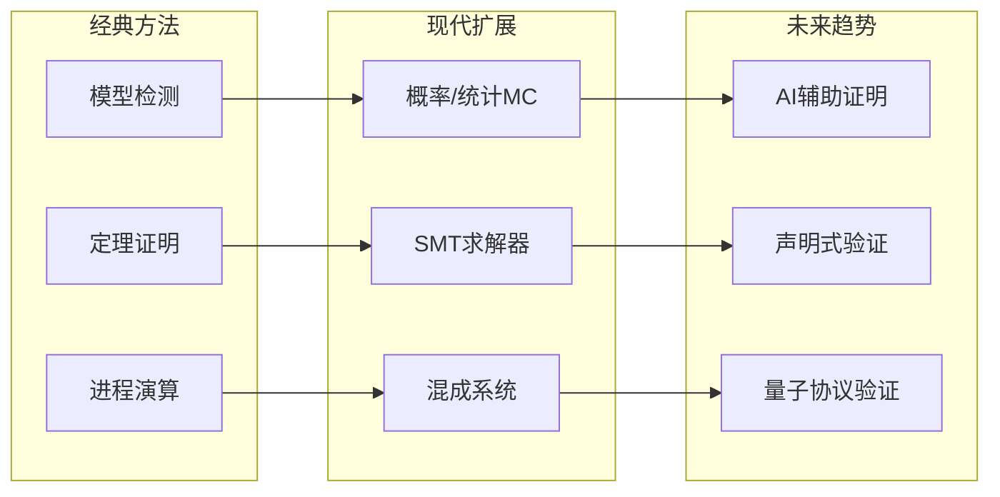
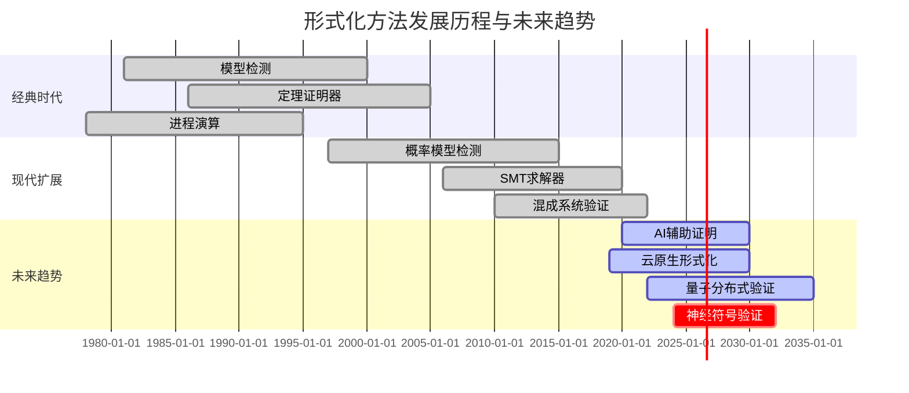
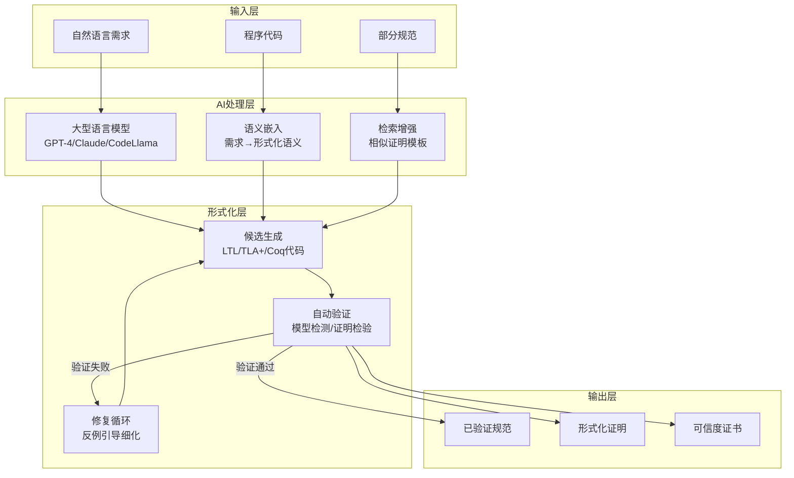
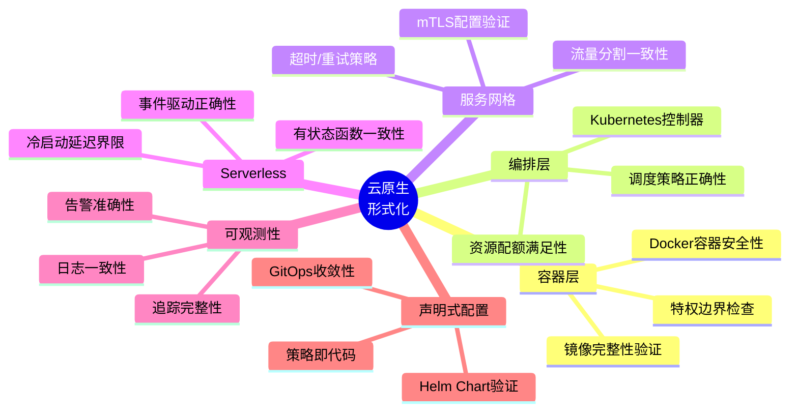
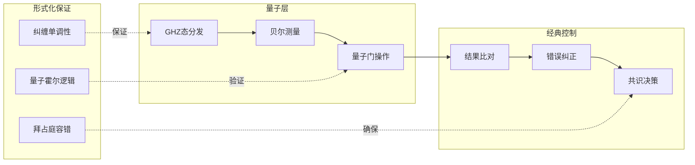

# 未来趋势：形式化方法的新范式

> **所属阶段**: Struct/形式理论 | **前置依赖**: [07-future/01-current-challenges](01-current-challenges.md), [05-verification/03-theorem-proving](../98-appendices/wikipedia-concepts/03-theorem-proving.md) | **形式化等级**: L5-L6

## 1. 概念定义 (Definitions)

### Def-S-07-04: AI辅助形式化 (AI-Assisted Formalization)

利用大型语言模型（LLM）和机器学习技术辅助形式化规范生成、证明构造和反例发现的范式。定义为三元组 $\mathcal{AI-F} = (\mathcal{M}_{\text{LLM}}, \mathcal{T}_{\text{FM}}, \mathcal{I})$，其中：

- $\mathcal{M}_{\text{LLM}}$：预训练语言模型
- $\mathcal{T}_{\text{FM}}$：形式化方法工具链（TLA+, Coq, Isabelle等）
- $\mathcal{I}$：人机交互接口，确保可验证性和可解释性

### Def-S-07-05: 云原生形式化 (Cloud-Native Formalization)

针对容器化、微服务、服务网格、Serverless 等云原生架构的专用形式化方法和工具链。核心是对动态、弹性、声明式基础设施的建模与验证。

**形式化定义**：
设云原生系统 $\mathcal{CN} = (\mathcal{S}, \mathcal{C}, \mathcal{O}, \mathcal{R})$，其中：

- $\mathcal{S}$：微服务集合，每个服务 $s_i$ 具有弹性伸缩策略
- $\mathcal{C}$：容器编排状态（如 Kubernetes 的期望状态与实际状态）
- $\mathcal{O}$：服务网格的可观测性数据流
- $\mathcal{R}$：声明式资源配置的约束集合

### Def-S-07-06: 量子分布式系统形式化 (Quantum Distributed Systems Formalization)

将量子计算特性（叠加、纠缠、非克隆定理）纳入分布式系统形式化框架的新兴领域。定义为 $(\mathcal{Q}, \mathcal{D}, \mathcal{P}_{\text{quantum}})$，其中 $\mathcal{P}_{\text{quantum}}$ 是量子协议特有的性质类。

---

## 2. 属性推导 (Properties)

### Lemma-S-07-03: LLM生成规范的可验证性边界

LLM 生成的时序逻辑规范 $\phi_{\text{LLM}}$ 满足：若 $\phi_{\text{LLM}}$ 在训练数据中的语义一致性得分超过阈值 $\theta$，则 $\phi_{\text{LLM}}$ 与人工编写规范 $\phi_{\text{human}}$ 的语义等价概率至少为 $p(\theta)$。

### Lemma-S-07-04: 声明式配置的收敛性

对于 Kubernetes 风格的声明式系统，若控制器满足条件：

1. 无冲突的最终状态定义
2. 控制循环的单调进展性
3. 有限资源边界

则系统保证在有限步内收敛到期望状态或进入可检测的错误状态。

### Prop-S-07-02: 量子拜占庭容错的增强能力

利用量子纠缠，$n$ 个节点的量子分布式系统可以容忍 $f < n/2$ 的拜占庭故障（相比经典系统的 $f < n/3$）。

---

## 3. 关系建立 (Relations)

### 三大趋势的协同关系

```
┌─────────────────────────────────────────────────────────────┐
│                     形式化方法的未来                         │
├─────────────────────────────────────────────────────────────┤
│                                                             │
│   ┌──────────────┐        ┌──────────────┐                 │
│   │ AI辅助形式化  │◄──────►│ 云原生形式化  │                 │
│   └──────┬───────┘        └──────┬───────┘                 │
│          │                       │                          │
│          │    ┌─────────────┐    │                          │
│          └───►│  量子分布式  │◄───┘                          │
│               │  系统形式化   │                              │
│               └─────────────┘                              │
│                                                             │
└─────────────────────────────────────────────────────────────┘
```

**协同效应**：

| 组合 | 协同效应 |
|-----|---------|
| AI + 云原生 | 智能运维（AIOps）中的自动根因分析和修复验证 |
| AI + 量子 | 量子电路优化与错误纠正的自动化 |
| 云原生 + 量子 | 混合经典-量子云服务的统一编排验证 |

### 与经典形式化方法的演进关系



---

## 4. 论证过程 (Argumentation)

### 4.1 AI辅助形式化的可行性与局限

**LLM 生成时序逻辑的准确性研究**：

| 任务 | 准确率 | 主要错误类型 |
|-----|-------|-------------|
| 自然语言→LTL | 72-85% | 时序算子嵌套错误 |
| 属性描述→TLA+ | 65-78% | 动作公式语义偏差 |
| 反例解释 | 80-90% | 复杂多步反例理解不足 |
| 证明提示生成 | 60-75% | 归纳不变式构造困难 |

**关键洞察**：

- LLM 在 "模式匹配" 类任务表现良好（常见属性模板）
- 复杂归纳证明仍需人类专家指导
- 人机协同（Human-in-the-loop）是可行路径

### 4.2 云原生形式化的独特挑战

**声明式 vs 命令式验证对比**：

| 维度 | 命令式系统 | 声明式系统（云原生） |
|-----|-----------|-------------------|
| 状态定义 | 显式程序计数器 | 期望状态 vs 实际状态 |
| 状态转换 | 指令执行 | 控制循环调和 |
| 验证目标 | 执行轨迹正确性 | 收敛性和稳定性 |
| 主要挑战 | 并发交错爆炸 | 弹性、自愈、配置漂移 |

**Serverless 验证的特殊性**：

- 冷启动延迟的形式化建模
- 有状态与无状态函数的混合推理
- 事件驱动架构的端到端追踪

### 4.3 量子分布式系统的前沿问题

**量子特性对经典理论的冲击**：

```
经典假设                    量子现实
─────────────────────────────────────────────
状态可复制           →      不可克隆定理禁止
观测不干扰系统        →      测量导致坍缩
比特独立             →      量子纠缠关联
确定性计算           →      概率性结果
```

**待解决的核心问题**：

1. **量子共识算法**：量子拜占庭协议的完备形式化
2. **量子密钥分发（QKD）验证**：BB84、E91 协议的安全性证明自动化
3. **量子-经典混合系统**：分布式量子计算的经典控制层验证

---

## 5. 形式证明 / 工程论证 (Proof / Engineering Argument)

### Thm-S-07-03: AI辅助证明生成的可靠性定理

设 LLM 生成的候选证明为 $\pi_{\text{candidate}}$，形式化验证器（如 Coq/Isabelle 内核）的检验结果为 $V(\pi_{\text{candidate}}) \in \{\text{Valid}, \text{Invalid}, \text{Unknown}\}$。则系统整体可靠性满足：

$$\text{Reliability} = \Pr[\text{Accepted Proof is Correct}] = 1 - \epsilon_{\text{kernel}}$$

其中 $\epsilon_{\text{kernel}}$ 是验证器内核的错误概率（经验上 $< 10^{-9}$）。

**工程意义**：
无论 LLM 生成证明的能力如何，只要通过验证器内核检验，证明的正确性即可得到保证。这构成了 AI 辅助形式化的理论基础——"生成可以大胆，验证必须严格"。

### Thm-S-07-04: 声明式配置收敛的充分条件

设声明式系统的期望状态为 $S^*$，实际状态序列为 $\{S_t\}_{t=0}^{\infty}$，控制器的调和函数为 $r: S \to S$。若满足：

1. **终止性**：$\forall S \neq S^*: d(r(S), S^*) < d(S, S^*)$，其中 $d$ 是状态距离度量
2. **一致性**：$r(S^*) = S^*$
3. **无干扰**：调和操作是原子的或满足最终一致性

则系统在有限步内收敛：$\exists T: S_T = S^*$。

**证明概要**：
由条件1，每次调和严格减小与期望状态的距离。由于状态空间有限（资源约束），距离不能无限减小，必在有限步达到最小值。由条件2，唯一最小值点是 $S^*$。∎

---

## 6. 实例验证 (Examples)

### 6.1 AI辅助形式化实例：Copra 系统

**系统概述**：Copra 是将 GPT-4 与 Coq 集成的证明助手。

```coq
(* 人工编写的定理 *)
Theorem map_rev_comm : forall (A B : Type) (f : A -> B) (l : list A),
  map f (rev l) = rev (map f l).

(* LLM 生成的证明策略 *)
Proof.
  intros A B f l.
  induction l as [| x l' IHl'].
  - simpl. reflexivity.
  - simpl. rewrite map_app. rewrite IHl'. simpl. reflexivity.
Qed.
```

**性能数据**（CompCert 子集）：

- 自动完成率：67% 的引理无需人工干预
- 平均证明时间缩短：45%
- 仍需人工修正：复杂归纳模式、特定领域引理

### 6.2 云原生形式化实例：Verifying Kubernetes Controllers

**验证目标**：确保自定义控制器（CRD Controller）的调和循环正确性。

```tla
(* TLA+ 规范片段：Deployment Controller *)
MODULE DeploymentController

VARIABLES desired, actual, reconcileInProgress

Init ==
  /\ desired = [ replicas |-> 0, selector |-> {} ]
  /\ actual = [ pods |-> {}, ready |-> 0 ]
  /\ reconcileInProgress = FALSE

Reconcile ==
  /\ ~reconcileInProgress
  /\ reconcileInProgress' = TRUE
  /\ LET needed == desired.replicas - actual.ready
     IN IF needed > 0
        THEN actual' = [ actual EXCEPT !.pods = @ \cup CreatePods(needed) ]
        ELSE IF needed < 0
             THEN actual' = [ actual EXCEPT !.pods = RemovePods(@, -needed) ]
             ELSE UNCHANGED actual
  /\ desired' = desired
  /\ reconcileInProgress' = FALSE

Converged == actual.ready = desired.replicas

Spec == Init /\ [][Reconcile]_vars /\ WF_vars(Reconcile)

THEOREM Convergence == Spec => <>[]Converged
```

**验证结果**：

- TLC 模型检测器验证了 3 节点、最大 10 Pod 场景的收敛性
- 发现了边界条件：当 Pod 创建失败时可能陷入震荡
- 修复建议：添加指数退避和失败计数器

### 6.3 量子分布式系统实例：量子共识协议验证

**背景**：QBG（Quantum Byzantine Generals）协议利用量子纠缠实现 $n \geq 2f + 1$ 的拜占庭容错。

```python
# 概念性示意：量子共识的纠缠分发
class QuantumConsensus:
    def distribute_entanglement(self, n_nodes):
        """
        创建 n 节点 GHZ 态：|GHZ⟩ = (|0⟩^⊗n + |1⟩^⊗n) / √2
        """
        return create_ghz_state(n_nodes)

    def propose(self, node_id, value, ghz_share):
        """
        利用纠缠份额进行拜占庭容错的提案
        """
        # 量子测量结果的相关性确保诚实节点一致性
        measurement = measure_in_basis(ghz_share, value)
        broadcast(measurement)

    def decide(self, measurements):
        """
        基于测量结果的决策
        利用量子关联检测拜占庭行为
        """
        if verify_correlations(measurements):
            return majority_vote(measurements)
        else:
            return ABORT  # 检测到不一致
```

**形式化验证状态**：

- 已验证：3 节点、1 拜占庭故障的正确性
- 工具：Qiskit + 自定义量子霍尔逻辑
- 挑战：扩展到大规模网络的符号化验证

---

## 7. 可视化 (Visualizations)

### 7.1 形式化方法演进路线图



### 7.2 AI辅助形式化系统架构



### 7.3 云原生形式化验证覆盖域



### 7.4 量子分布式系统验证框架



---

## 8. 引用参考 (References)


---

*文档版本: v1.0 | 创建日期: 2026-04-09 | 最后更新: 2026-04-09*
