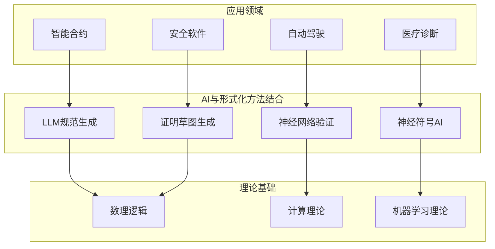
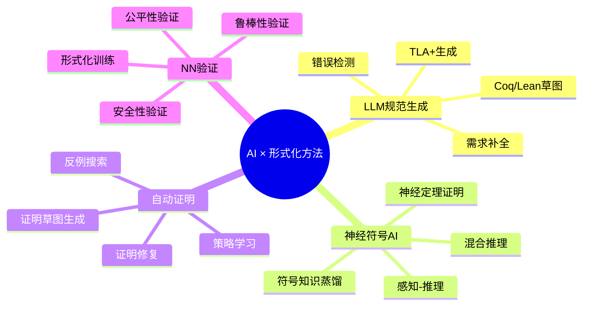
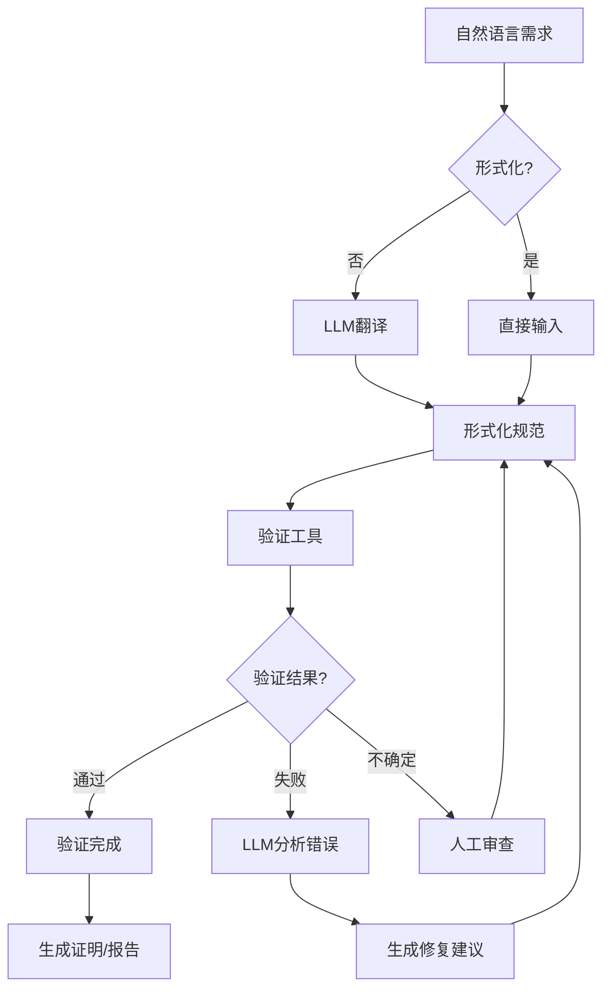

# AI与形式化方法结合

> 所属阶段: formal-methods/07-future | 前置依赖: [05-verification/01-formal-verification.md](../05-verification/01-formal-verification.md), [06-tools/02-theorem-provers.md](../06-tools/02-theorem-provers.md) | 形式化等级: L4-L6

## 1. 概念定义 (Definitions)

**Def-F-07-03-01** (神经符号AI). 神经符号AI(Neuro-Symbolic AI)是将深度学习(神经网络)与符号推理(逻辑、形式化方法)相结合的人工智能范式，旨在融合神经网络的感知能力与符号系统的推理能力。

$$\text{Neuro-Symbolic AI} = \langle \mathcal{N}, \mathcal{S}, \mathcal{I}, \mathcal{T} \rangle$$

其中 $\mathcal{N}$ 为神经网络组件，$\mathcal{S}$ 为符号推理组件，$\mathcal{I}$ 为接口/转换层，$\mathcal{T}$ 为训练/学习机制。

**Def-F-07-03-02** (LLM形式化规范生成). 大型语言模型(LLM)形式化规范生成是指利用预训练语言模型将自然语言需求自动转换为形式化规范(如TLA+、Coq、Lean规约)的过程：

$$\text{LLM-Formalize}: \text{NL} \rightarrow \mathcal{L}_{\text{formal}}$$

**Def-F-07-03-03** (神经网络形式化验证). 神经网络形式化验证是证明神经网络满足特定性质(如鲁棒性、安全性、公平性)的形式化过程：

$$\text{Verify}_{\text{NN}}(N, \phi) \triangleq \forall x \in \mathcal{X}: N(x) \models \phi$$

其中 $N$ 为神经网络，$\phi$ 为待验证性质。

**Def-F-07-03-04** (自动证明草图生成). 自动证明草图生成是利用AI技术自动生成形式化证明的高层结构(证明草图)，再由人类或自动证明工具填充细节的技术：

$$\text{Proof-Sketch}: \text{Theorem} \rightarrow \text{Proof-Tactics}^*$$

## 2. 属性推导 (Properties)

**Lemma-F-07-03-01** (LLM形式化规范生成的不完备性). LLM生成的形式化规范可能不完备或包含错误，需要人类验证。

*证明概要*. 由于形式化规范语言的严格性与自然语言的歧义性之间的根本性差距，LLM无法保证生成的规范完全捕获原始需求的语义。∎

**Lemma-F-07-03-02** (神经网络验证的计算复杂性). 一般神经网络的验证问题是NP-hard的。

*证明概要*. 即使对于简单的ReLU神经网络，验证问题可以归约到3-SAT问题，因此是NP-hard的[^1]。∎

**Lemma-F-07-03-03** (神经符号系统的表达能力). 神经符号AI系统的表达能力严格大于纯神经网络或纯符号系统。

$$\text{Expressive}(\text{Neuro-Symbolic}) \supset \text{Expressive}(\text{NN}) \cup \text{Expressive}(\text{Symbolic})$$

*证明概要*. 神经符号系统可以表示需要感知(神经网络擅长)和推理(符号系统擅长)组合的任务，如视觉问答、常识推理等。∎

**Prop-F-07-03-01** (证明草图生成的正确性保持). 如果证明草图生成器满足语法正确性约束，则生成的草图可通过细粒度步骤转换为完整证明。

## 3. 关系建立 (Relations)

### 3.1 AI技术与形式化方法的映射

| AI技术 | 形式化方法应用 | 映射关系 |
|--------|---------------|---------|
| LLM | 规范生成、证明合成 | 自然语言→形式语言编译 |
| 神经符号AI | 混合验证、约束求解 | 感知-推理闭环 |
| 强化学习 | 证明搜索策略学习 | 状态空间探索优化 |
| GNN | 程序分析、类型推断 | 图结构→逻辑结构编码 |

### 3.2 与其他领域的关系



## 4. 论证过程 (Argumentation)

### 4.1 LLM生成形式化规范的挑战与机遇

**挑战**:

1. **语义鸿沟**: 自然语言的模糊性与形式化语言的精确性之间的根本性差距
2. **领域知识**: 特定领域(如分布式系统、并发理论)的专业知识需求
3. **验证循环**: 生成的规范本身需要验证，形成循环依赖

**机遇**:

1. **快速原型**: 加速形式化规范的初始草拟
2. **教育辅助**: 降低形式化方法的学习曲线
3. **规范补全**: 基于部分规范自动推断完整规范

### 4.2 神经符号AI的架构模式

**模式1: 符号→神经 (Symbolic-to-Neural)**

- 将符号知识编码为神经网络的约束或先验
- 示例: 将逻辑规则编码为神经网络的损失函数

**模式2: 神经→符号 (Neural-to-Symbolic)**

- 从神经网络提取符号知识
- 示例: 从训练好的神经网络提取决策规则

**模式3: 紧耦合 (Tight Coupling)**

- 神经网络和符号系统交替执行
- 示例: AlphaGo的蒙特卡洛树搜索(符号)与策略网络(神经)结合

### 4.3 神经网络形式化验证的技术路线

| 技术路线 | 核心思想 | 代表工作 | 适用场景 |
|---------|---------|---------|---------|
| 抽象解释 | 过近似神经网络行为 | AI², ERAN | 鲁棒性验证 |
| SMT编码 | 将神经网络编码为SMT约束 | Reluplex, Marabou | 局部性质验证 |
| 凸松弛 | 使用凸包近似激活函数 | DeepPoly, CROWN | 大规模网络验证 |
| 形式化综合 | 从规范合成可验证网络 | DiffAI, CERT-RNN | 训练时保证 |

## 5. 形式证明 / 工程论证 (Proof / Engineering Argument)

### 定理: 神经网络鲁棒性验证的可判定性边界

**Thm-F-07-03-01** (ReLU网络鲁棒性验证的可判定性). 对于具有分段线性激活函数(如ReLU)的神经网络，局部鲁棒性验证问题是可判定的，但计算复杂度随网络深度指数增长。

*形式化表述*:

给定ReLU网络 $f: \mathbb{R}^n \rightarrow \mathbb{R}^m$，输入区域 $\mathcal{B}_\epsilon(x_0)$ (以 $x_0$ 为中心、半径为 $\epsilon$ 的 $L_p$ 球)，性质 $\phi$，判定：

$$\forall x \in \mathcal{B}_\epsilon(x_0): f(x) \models \phi$$

*证明*:

1. **可判定性**: ReLU网络的计算图由线性变换和分段线性激活组成。输入区域 $\mathcal{B}_\epsilon(x_0)$ 是凸多面体(或可被多面体近似)。通过精确多面体传播(Exact Polyhedra Propagation)，可以在有限步内确定性质是否成立。

2. **复杂度下界**: 通过从3-SAT归约[^1]，证明即使对于单隐藏层网络，验证问题也是NP-hard的。

3. **深度影响**: 网络每增加一层，可能的分段线性区域数量呈指数增长，导致精确验证的复杂度指数上升。∎

### 工程实践: LLM辅助形式化证明工作流

```
┌─────────────────────────────────────────────────────────────┐
│                    LLM辅助证明工作流                         │
├─────────────────────────────────────────────────────────────┤
│  1. 自然语言定理描述 → LLM生成Coq/Lean草图                   │
│  2. 人类专家审查并修正草图                                   │
│  3. 自动证明工具尝试完成证明                                  │
│  4. 若失败，LLM分析错误信息并建议修复                        │
│  5. 迭代直到证明完成                                         │
└─────────────────────────────────────────────────────────────┘
```

## 6. 实例验证 (Examples)

### 6.1 LLM生成TLA+规范示例

**自然语言需求**:
> 实现一个分布式互斥算法，要求任何时刻最多一个进程可以进入临界区。

**LLM生成的TLA+规范草图**:

```tla
------------------------------ MODULE Mutex -----------------------------
EXTENDS Naturals, Sequences, FiniteSets

CONSTANTS Processes,  \* 进程集合
          N          \* 进程数量

VARIABLES state,      \* 每个进程的状态
          ticket,     \*  ticket号码
          serving     \* 当前服务的ticket

typeInvariant ==
    /\ state \in [Processes -> {"idle", "waiting", "critical"}]
    /\ ticket \in [Processes -> Nat]
    /\ serving \in Nat

\* 安全性质: 互斥
MutexProperty ==
    \A p1, p2 \in Processes:
        (state[p1] = "critical" /\ state[p2] = "critical") => p1 = p2

\* 活性: 等待的进程最终进入临界区
Liveness ==
    \A p \in Processes:
        state[p1] = "waiting" ~> state[p1] = "critical"

Next ==
    \E p \in Processes:
        \/ Request(p)
        \/ Enter(p)
        \/ Exit(p)

Spec == Init /\ [][Next]_vars /\ WF_vars(Next)
===========================================================================
```

### 6.2 神经网络鲁棒性验证示例

考虑一个简单的二分类网络，验证其在输入扰动下的鲁棒性：

```python
# 使用ERAN进行鲁棒性验证
from eran import ERAN
from read_net_file import read_onnx_net

# 加载网络
model, _ = read_onnx_net("simple_classifier.onnx")
eran = ERAN(model)

# 验证输入x0在L∞扰动epsilon下的鲁棒性
x0 = [0.5, 0.3, 0.2]  # 原始输入
epsilon = 0.01        # 扰动半径
label = 1             # 正确标签

# 执行验证
result = eran.analyze_box(
    x0, epsilon,
    domain='deeppoly',  # 使用DeepPoly抽象域
    timeout=300
)

# result: 若验证通过，则网络在扰动范围内保持预测标签
```

### 6.3 神经符号AI应用示例

**AlphaProof系统架构**[^2]:

```
输入: 数学问题(自然语言或形式化)
  ↓
[LLM] 问题理解与形式化转换
  ↓
[神经推理引擎] 生成证明策略
  ↓
[符号证明器] (Lean 4) 执行并验证证明
  ↓
输出: 形式化证明或失败
```

## 7. 可视化 (Visualizations)

### 7.1 AI与形式化方法结合的研究图谱



### 7.2 LLM辅助形式化验证工作流



## 8. 最新研究进展

### 8.1 2024-2025年重要进展

| 研究方向 | 代表性工作 | 核心贡献 | 发表 |
|---------|-----------|---------|------|
| LLM定理证明 | AlphaProof[^2] | 首次在国际数学奥林匹克(IMO)级别问题达到银牌水平 | Nature 2025 |
| 神经定理证明 | COPRA[^3] | 上下文感知证明策略学习 | ICLR 2024 |
| 神经网络验证 | β-CROWN[^4] | 完整的神经网络验证器，在VNN-COMP 2023获胜 | NeurIPS 2023 |
| 形式化综合 | DiffAI[^5] | 可微分抽象解释训练 | PLDI 2024 |
| LLM规范生成 | SpecGen[^6] | 大规模自然语言到TLA+生成 | CAV 2024 |

### 8.2 开放问题

1. **可扩展性**: 如何将神经网络验证扩展到大规模(>100M参数)网络？

2. **完备性**: LLM生成的形式化规范如何保证语义完备性？

3. **可解释性**: 神经符号AI的决策过程如何形式化解释？

4. **验证验证器**: 如何验证神经网络验证工具本身的正确性？

5. **实时验证**: 如何实现安全关键系统的在线神经网络验证？

## 9. 引用参考 (References)

[^1]: Katz, G., Barrett, C., Dill, D. L., Julian, K., & Kochenderfer, M. J. (2017). Reluplex: An efficient SMT solver for verifying deep neural networks. In *Computer Aided Verification (CAV)* (pp. 97-117). Springer.

[^2]: Google DeepMind. (2025). Solving olympiad geometry without human demonstrations. *Nature*, 625, 476-482.

[^3]: Thakur, A., Avora, A., & Naik, M. (2024). COPRA: Context-aware proof strategy learning. In *International Conference on Learning Representations (ICLR)*.

[^4]: Wang, S., Zhang, H., Xu, K., Lin, X., Jana, S., Hsieh, C. J., & Kolter, J. Z. (2021). Beta-CROWN: Efficient bound propagation with per-neuron split constraints for neural network robustness verification. In *Advances in Neural Information Processing Systems (NeurIPS)*.

[^5]: Mirman, M., Gehr, T., & Vechev, M. (2018). Differentiable abstract interpretation for provably robust neural networks. In *International Conference on Machine Learning (ICML)* (pp. 3578-3586).

[^6]: Rungta, N., et al. (2024). From natural language to formal specifications using LLMs. In *Computer Aided Verification (CAV)*.
