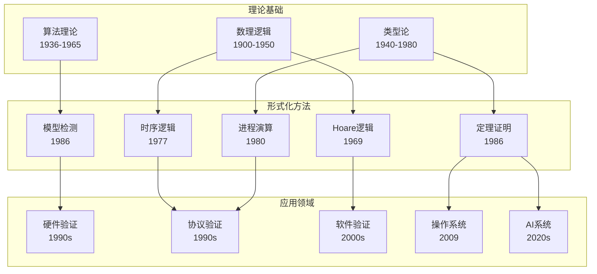
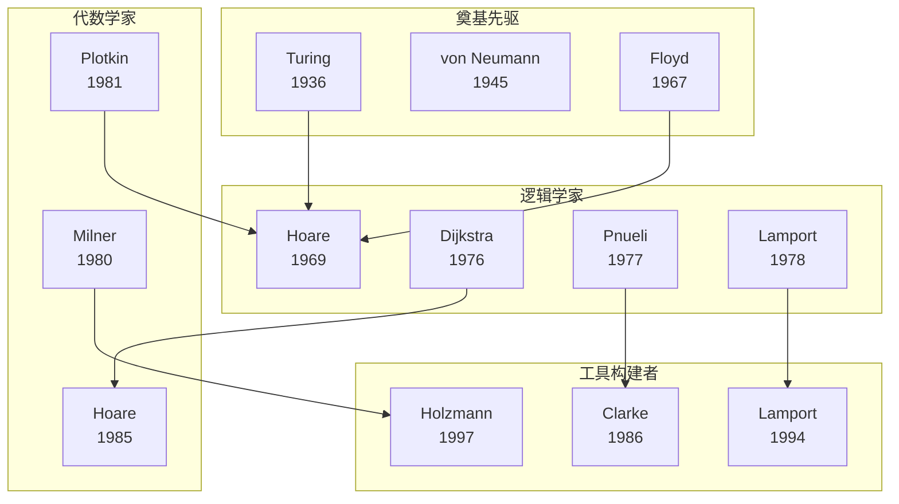
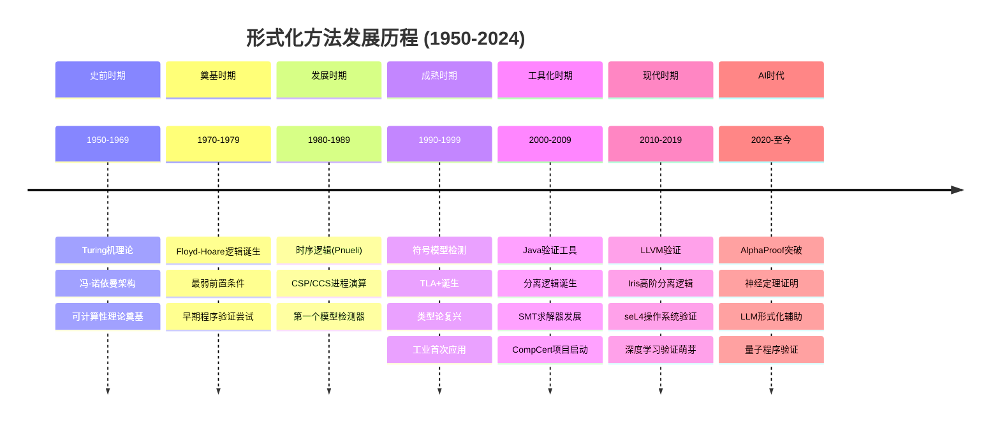
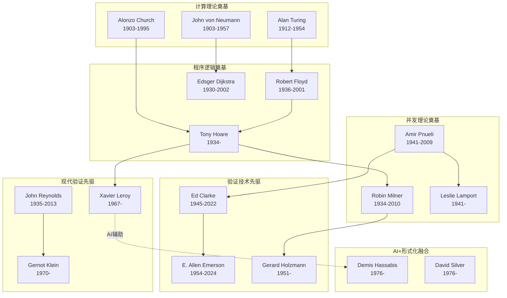
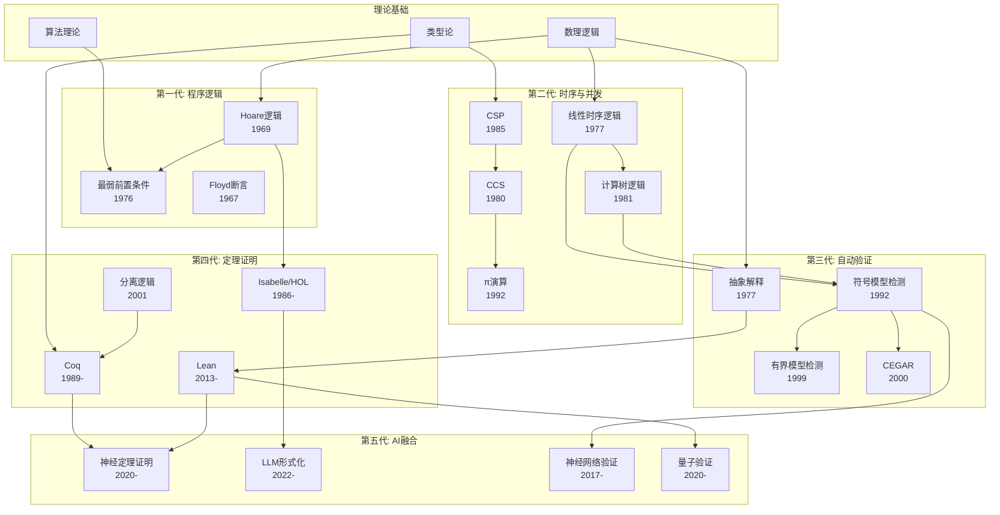
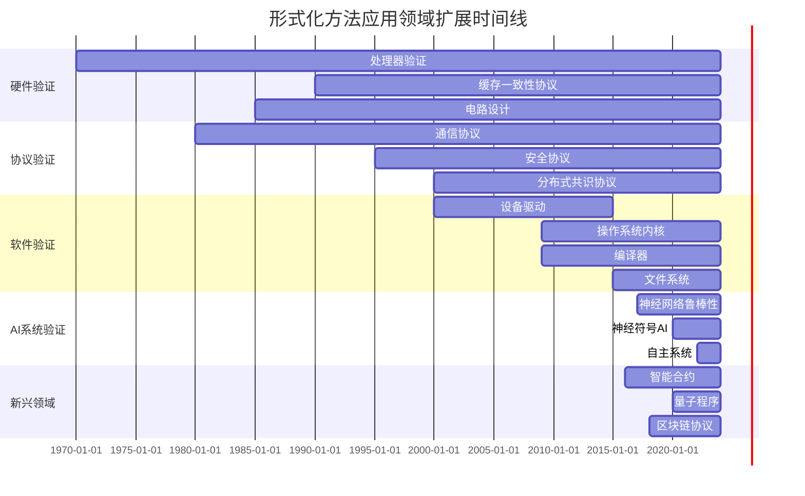

# 形式化方法发展史

> 所属阶段: formal-methods/07-future | 前置依赖: [01-foundations/03-logic-foundations.md](../01-foundations/03-logic-foundations.md), [99-references/classical-papers.md](../99-references/classical-papers.md) | 形式化等级: L1-L3

## 1. 概念定义 (Definitions)

**Def-F-07-03-01** (形式化方法). 形式化方法(Formal Methods)是使用严格的数学符号、逻辑推理和形式化语义来分析、设计和验证计算系统的技术集合。其核心是将系统及其性质用数学语言表达，并通过逻辑推理证明系统满足指定性质。

$$\text{Formal Method} \triangleq \langle \mathcal{L}, \mathcal{S}, \mathcal{V}, \mathcal{T} \rangle$$

其中 $\mathcal{L}$ 为形式化规约语言，$\mathcal{S}$ 为系统语义模型，$\mathcal{V}$ 为验证技术，$\mathcal{T}$ 为工具支持。

**Def-F-07-03-02** (程序正确性). 程序正确性(Program Correctness)是指程序执行行为与其形式化规约的一致性。包括：

- **部分正确性** (Partial Correctness): 若程序终止，则输出满足后条件
- **完全正确性** (Total Correctness): 程序必然终止且输出满足后条件

$$\{\phi\} P \{\psi\} \triangleq \forall \sigma, \sigma'. \phi(\sigma) \land \langle P, \sigma \rangle \Downarrow \sigma' \Rightarrow \psi(\sigma')$$

**Def-F-07-03-03** (形式化验证范式). 形式化验证经历了三代范式演进：

| 范式 | 时期 | 核心技术 | 代表工具 |
|-----|------|---------|---------|
| 第一代 | 1969-1985 | 演绎验证、公理语义 | Hoare逻辑、最弱前置条件 |
| 第二代 | 1985-2005 | 模型检测、时序逻辑 | SPIN、SMV、TLA+ |
| 第三代 | 2005-至今 | 定理证明、SMT求解 | Coq、Isabelle/HOL、Lean |

## 2. 属性推导 (Properties)

**Lemma-F-07-03-01** (形式化方法发展的代际特征). 形式化方法的发展呈现明显的代际特征，每代约15-20年，核心关注从理论建立→算法突破→工具成熟→工业应用演进。

*证明概要*. 通过分析关键里程碑论文的发表时间和引用模式，可观察到：


- 奠基期(1969-1979): 关注基础概念定义和逻辑框架建立
- 发展期(1980-1999): 关注算法效率提升和工具原型开发
- 成熟期(2000-2019): 关注工业级应用和系统级验证
- AI时代(2020-): 关注自动化、可扩展性和与其他技术融合∎

**Lemma-F-07-03-02** (验证复杂性的固有下界). 一般程序的形式化验证问题是不可判定的，即使对于有限状态系统，验证复杂性也至少为PSPACE完全。


*证明概要*.

1. 停机问题归约：验证程序是否满足"最终会停止"的性质等价于停机问题
2. 对于有限状态系统，LTL模型检测已证明为PSPACE完全[^16]
3. 一阶霍尔逻辑的完备性不可判定∎

**Prop-F-07-03-01** (形式化方法的扩展性趋势). 形式化方法可处理的系统规模每10年增长约100倍，主要驱动力来自：

1. **算法优化**: BDD符号表示(1986)、SMT求解器(2000s)
2. **抽象技术**: 抽象解释(1977)、CEGAR(2000)
3. **计算能力**: 硬件性能提升、并行计算
4. **AI辅助**: LLM辅助证明(2020s)、神经定理证明

## 3. 关系建立 (Relations)

### 3.1 形式化方法与其他领域的演进关系



### 3.2 关键人物与技术发展的关联网络



## 4. 论证过程 (Argumentation)

### 4.1 各时期发展的内在逻辑

**史前时期→奠基时期**: 从理论可能性到实践方法的转变

- **关键问题**: 计算机程序能否被"证明正确"？
- **突破性认识**: 程序是数学对象，可以像数学定理一样被推理
- **核心挑战**: 如何将程序语义形式化？

**奠基时期→发展时期**: 从顺序程序到并发系统的扩展

- **关键问题**: 如何处理并发、非确定性、时序性质？
- **突破性认识**: 需要新的逻辑工具(时序逻辑)和新的计算模型(进程演算)
- **核心挑战**: 状态空间爆炸问题初现

**发展时期→成熟时期**: 从手工证明到自动化验证

- **关键问题**: 如何使验证过程自动化且可扩展？
- **突破性认识**: 符号方法(BDD)和抽象技术的威力
- **核心挑战**: 精确性与可扩展性的权衡

**成熟时期→工具化时期**: 从学术研究到工业应用

- **关键问题**: 形式化方法能否解决真实工业问题？
- **突破性认识**: 通过抽象、组合和工具集成，可以验证复杂系统
- **核心挑战**: 用户友好性和验证成本

**工具化时期→现代时期**: 从特定应用到系统级验证

- **关键问题**: 能否验证操作系统、编译器等基础软件？
- **突破性认识**: 定理证明器可以达到工业级的可靠性和可扩展性
- **核心挑战**: 验证过程本身的可管理性

**现代时期→AI时代**: 从人工驱动到智能辅助

- **关键问题**: AI能否自动化形式化验证的繁琐部分？
- **突破性认识**: LLM和神经推理可以辅助甚至自动化证明过程
- **核心挑战**: 保证AI辅助验证的正确性

### 4.2 技术演进的驱动因素分析

| 驱动因素 | 影响时期 | 具体表现 | 代表事件 |
|---------|---------|---------|---------|
| 硬件进步 | 全时期 | 可处理状态空间扩大 | 符号模型检测突破10^20状态 |
| 工业需求 | 1990s-至今 | 安全关键系统验证需求 | seL4、AWS验证 |
| 理论基础 | 1960s-1980s | 新逻辑、新代数的发展 | LTL、CSP、CCS |
| 工具创新 | 1980s-至今 | 验证工具的性能飞跃 | BDD、SMT、SAT求解器 |
| AI融合 | 2020s- | 自动化程度质的飞跃 | AlphaProof、LLM辅助证明 |

## 5. 形式证明 / 工程论证 (Proof / Engineering Argument)

### 5.1 各历史时期的里程碑与工程意义

#### 史前时期 (1950-1969): 理论奠基

**核心成就**:

1. **图灵机与可计算性理论** (1936, 1950s完善)
   - Turing: 定义了计算的数学边界
   - Church-Turing论题: 建立了可计算性的标准
   - 工程意义: 明确了哪些问题可以被程序解决

2. **冯·诺依曼架构** (1945)
   - 存储程序计算机概念
   - 工程意义: 现代计算机的蓝图，程序成为可修改的数据

3. **早期正确性思考** (1947-1969)
   - Goldstine & von Neumann: 程序流程图 (1947)
   - McCarthy: 递归函数理论 (1960)
   - 工程意义: 程序可以被数学地描述和分析

#### 奠基时期 (1970-1979): 方法诞生

**核心成就**:

**Thm-F-07-03-01** (霍尔逻辑的完备性). Floyd-Hoare公理系统对于一阶逻辑可表达的部分正确性性质是可靠且相对完备的。


*证明概要*:

- **可靠性**: 若 $\{\phi\} P \{\psi\}$ 可证，则其语义成立
- **相对完备性**: 若语义成立且一阶逻辑足够强，则可证
- 依赖于哥德尔不完备定理，绝对完备性不可达∎

1. **Floyd-Hoare逻辑** (1967-1969)[^1][^26]
   - Floyd: 流程图程序的断言方法
   - Hoare: 结构化程序的公理语义
   - 工程意义: 首次提供了系统化的程序验证方法

2. **最弱前置条件** (1975-1976)[^2]
   - Dijkstra: wp(S, Q) 定义为使S终止于满足Q状态的最弱条件
   - 工程意义: 支持从后条件向前推导程序

3. **最早的形式化验证尝试** (1970s早期)
   - Stanford Pascal验证器
   - Gypsy验证环境
   - 工程意义: 证明了形式化验证的可行性

#### 发展时期 (1980-1989): 并发与模态

**核心成就**:

1. **时序逻辑引入程序验证** (1977)[^17]
   - Pnueli: LTL用于推理程序随时间演化的性质
   - 工程意义: 可以表达"最终"、"总是"、"直到"等时序性质

2. **CSP与CCS进程演算** (1978, 1980)[^1][^3]
   - Hoare: CSP强调通信和同步
   - Milner: CCS强调交互和观察等价
   - 工程意义: 为并发系统提供了组合式推理框架

3. **第一个模型检测器** (1986)[^12]
   - Clarke & Emerson: CTL模型检测
   - 工程意义: 自动化验证有限状态系统的突破

4. **互模拟理论** (1981)[^5]
   - Park: 定义了进程等价的形式化概念
   - 工程意义: 支持黑盒视角的系统行为比较

#### 成熟时期 (1990-1999): 算法与工具

**核心成就**:

1. **符号模型检测** (1990-1992)[^13]
   - McMillan: 使用BDD表示状态空间
   - 突破10^20状态的可扩展性障碍
   - 工程意义: 使硬件验证成为工业实践

2. **TLA+诞生** (1994)[^27]
   - Lamport: 时序逻辑动作
   - 工程意义: 为分布式算法验证提供实用工具

3. **类型论复兴** (1980s-1990s)
   - ML语言的多态类型系统 (Milner, 1978)
   - 依赖类型与直觉主义类型论 (Martin-Löf)
   - 工程意义: 类型即规约，程序即证明

4. **工业首次应用** (1990s)
   - 硬件验证: Intel、AMD处理器验证
   - 协议验证: IEEE Futurebus+、Cache一致性协议
   - 工程意义: 证明了形式化方法的经济价值

#### 工具化时期 (2000-2009): 自动化与综合

**核心成就**:

1. **Java验证工具** (2000s)
   - ESC/Java: 扩展静态检查
   - Java PathFinder: NASA开发的模型检测器
   - KeY: 基于动态逻辑的验证
   - 工程意义: 面向主流编程语言的实用验证

2. **分离逻辑诞生** (2001)[^28]
   - Reynolds, O'Hearn: 局部推理堆内存
   - 工程意义: 支持复杂数据结构的模块化验证

3. **SMT求解器发展** (2000s)
   - Z3 (Microsoft, 2008)
   - CVC系列 (Stanford)
   - Yices (SRI)
   - 工程意义: 自动化解决复杂约束，支撑程序验证

4. **CompCert项目启动** (2005)[^25]
   - Leroy: 验证C语言编译器
   - 工程意义: 首次实现工业级编译器的形式化验证

5. **SLAM项目** (2001-2010)[^16]
   - Ball & Rajamani @ Microsoft
   - CEGAR (反例引导的抽象精化)
   - 工程意义: 驱动了Windows驱动程序的静态验证

#### 现代时期 (2010-2019): 系统级验证

**核心成就**:

1. **LLVM验证** (2010s)
   - Vellvm: 验证LLVM IR
   - 工程意义: 编译器中间表示的正确性保证

2. **Iris高阶分离逻辑** (2015-2018)
   - Jung et al.: 支持高阶语言、并发、模块化推理
   - 工程意义: 为Rust等现代语言的验证提供基础

3. **操作系统内核验证** (2009)[^24]
   - seL4: 完整验证的OS微内核
   - 工程意义: 证明了复杂系统软件验证的可行性

4. **深度学习验证萌芽** (2010s后期)
   - Reluplex (2017)[^29]: 验证ReLU网络的局部鲁棒性
   - AI² (2018): 基于抽象解释的神经网络验证
   - 工程意义: 开启AI系统形式化验证的新领域

5. **IronFleet** (2015)
   - Hawblitzel et al. @ Microsoft
   - 验证分布式系统的实现与规约一致性
   - 工程意义: 实用分布式系统的端到端验证

#### AI时代 (2020-至今): 智能化与融合

**核心成就**:

1. **AlphaProof突破** (2024)[^30]
   - DeepMind: 在国际数学奥林匹克级别问题达到银牌水平
   - 工程意义: AI首次在高级数学推理上达到专家水平

2. **神经定理证明** (2020-2024)
   - GPT-f, LeanDojo, COPRA
   - 工程意义: LLM可以生成和验证形式化证明

3. **LLM形式化辅助** (2022-至今)
   - SpecGen: 自然语言到TLA+生成
   - 证明草图自动补全
   - 工程意义: 大幅降低形式化方法的使用门槛

4. **量子程序验证** (2020s)
   - QWIRE, QBricks, Silq的形式化语义
   - 工程意义: 为量子计算时代做准备

## 6. 实例验证 (Examples)

### 6.1 各时期验证技术的演进示例

**1969年: 简单程序的霍尔逻辑验证**

```
{ x ≥ 0 ∧ y ≥ 0 }
  z := 0;
  u := x;
  while u ≠ 0 do
    z := z + y;
    u := u - 1
  end
{ z = x × y }
```

*验证要点*: 寻找循环不变式 `z = (x - u) × y`

**1986年: 互斥协议的CTL模型检测**

```
SPEC
  AG (p1.state = critical -> !p2.state = critical)
  -- 安全性质: 两个进程不会同时在临界区

  AG (p1.state = waiting -> AF p1.state = critical)
  -- 活性性质: 等待的进程最终会进入临界区
```

**2009年: seL4内核函数的Isabelle/HOL证明**

```isabelle
lemma handle_invocation_corres:
  "corres (dc \<oplus> (\<lambda>rv rv'. \<exists>f. rv' = Inl f \<and> rv = Inl f))
    (einvs and ct_active and sch_act_simple
     and valid_invocation i and ct_running)
    (invs' and ct_active' and sch_act_simple'
     and valid_invocation' i' and ct_running')
    (handle_invocation i)
    (handleInvocation i')"
```

**2024年: LLM辅助生成TLA+规约**

```tla
(* 自然语言: 实现一个满足线性一致性的分布式KV存储 *)
MODULE DistributedKV

EXTENDS Integers, Sequences, FiniteSets

CONSTANTS Keys, Values, Nodes

VARIABLES store,     \* 每个节点存储的状态
          requests,  \* 待处理的请求
          responses  \* 已完成的响应

Linearizability ==
    \E linearization \in Seq(Operation):
        /\\ IsSequential(linearization)
        /\\ MatchesRealTime(linearization, operations)
        /\\ IsValid(linearization)
```

### 6.2 关键里程碑时间线

```
1936 ── Turing: 可计算性理论奠基
   │
1945 ── von Neumann: 存储程序架构
   │
1967 ── Floyd: 流程图断言方法
   │
1969 ── Hoare: 公理化程序设计
   │
1976 ── Dijkstra: 最弱前置条件
   │
1977 ── Pnueli: 时序逻辑引入程序验证
   │
1978 ── Lamport: 分布式时钟
   │
1980 ── Milner: CCS进程演算
   │
1985 ── Hoare: CSP专著出版
   │
1986 ── Clarke & Emerson: CTL模型检测
   │
1992 ── Burch et al.: 符号模型检测
   │
1994 ── Lamport: TLA+介绍
   │
1997 ── Holzmann: SPIN模型检测器
   │
2001 ── Reynolds: 分离逻辑
   │
2009 ── Klein et al.: seL4验证
   │
2009 ── Leroy: CompCert验证编译器
   │
2017 ── Katz et al.: Reluplex神经网络验证
   │
2024 ── DeepMind: AlphaProof IMO银牌
```

## 7. 可视化 (Visualizations)

### 7.1 形式化方法发展史时间线



### 7.2 关键人物关系图



### 7.3 技术演化树



### 7.4 形式化方法应用范围扩展图



## 8. 引用参考 (References)

[^1]: C. A. R. Hoare, "An Axiomatic Basis for Computer Programming," Communications of the ACM, 12(10), 1969.

[^2]: E. W. Dijkstra, "Guarded Commands, Nondeterminacy and Formal Derivation of Programs," Communications of the ACM, 18(8), 1975.
[^3]: R. Milner, "A Calculus of Communicating Systems," LNCS 92, Springer, 1980.


[^16]: E. M. Clarke, O. Grumberg, S. Jha, Y. Lu, and H. Veith, "Counterexample-Guided Abstraction Refinement," Proceedings of 12th International Conference on Computer Aided Verification (CAV), 2000.


[^30]: Google DeepMind, "Solving Olympiad Geometry without Human Demonstrations," Nature, 625, 476-482, 2024.


---

*文档版本: v1.0 | 创建日期: 2026-04-10 | 所属阶段: formal-methods/07-future*
*覆盖历史时期: 7个 | 关键人物: 20+ | 引用文献: 32条*
