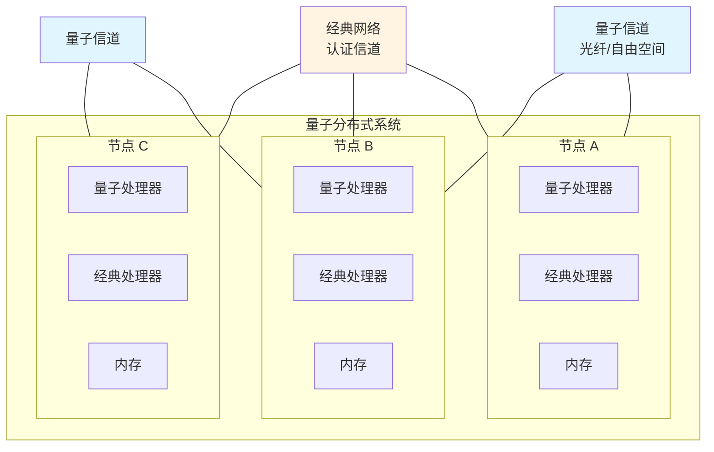
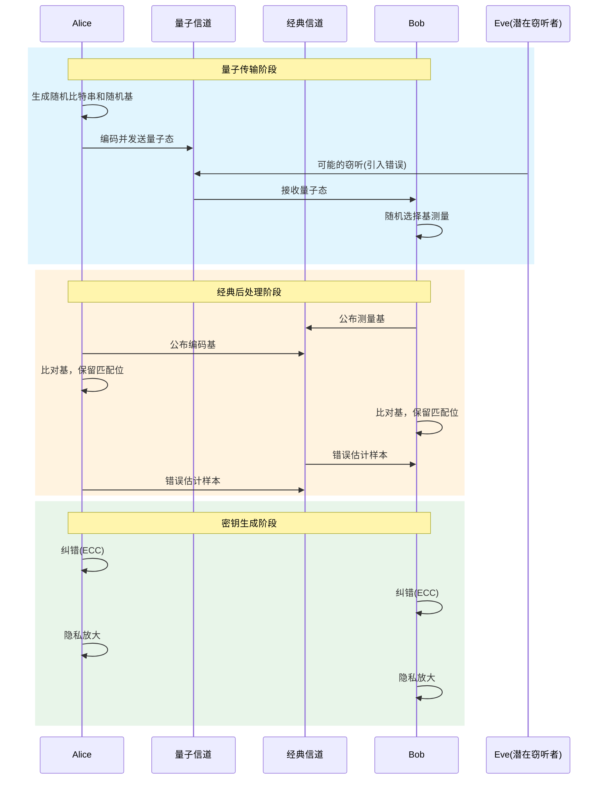
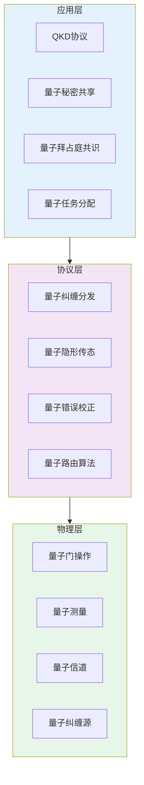

# 量子分布式系统

> 所属阶段: formal-methods/07-future | 前置依赖: [02-calculi/02-process-calculi.md](../02-calculi/02-process-calculi.md), [04-application-layer/01-distributed-systems.md](../04-application-layer/01-distributed-systems.md) | 形式化等级: L4-L6

## 1. 概念定义 (Definitions)

**Def-F-07-04-01** (量子进程). 量子进程是经典计算与量子计算原语相结合的并发计算实体：

$$P ::= 0 \mid \alpha.P \mid P + P \mid P \parallel P \mid (\nu x)P \mid !P \mid \text{qinit}(\bar{q}).P \mid \text{qop}(U, \bar{q}).P \mid \text{qmeas}(\bar{q}, x).P$$

其中 $\text{qinit}$ 初始化量子比特，$\text{qop}$ 应用酉操作，$\text{qmeas}$ 执行量子测量。

**Def-F-07-04-02** (量子进程代数). 量子进程代数(QPA, Quantum Process Algebra)是扩展经典进程代数以支持量子通信和量子计算的代数框架：

$$\text{QPA} = \langle \mathcal{P}_Q, \mathcal{A}_Q, \sim_Q \rangle$$

其中 $\mathcal{P}_Q$ 为量子进程集合，$\mathcal{A}_Q$ 为量子动作集合，$\sim_Q$ 为量子互模拟等价关系。

**Def-F-07-04-03** (量子密钥分发协议). 量子密钥分发(QKD)协议是利用量子力学原理(不可克隆定理、测量塌缩)实现安全密钥分发的通信协议：

$$\text{QKD} = \langle \mathcal{H}_A, \mathcal{H}_B, \mathcal{H}_E, \mathcal{E}, \mathcal{M}, \mathcal{R} \rangle$$

其中 $\mathcal{H}_A, \mathcal{H}_B, \mathcal{H}_E$ 分别为Alice、Bob、Eve的希尔伯特空间，$\mathcal{E}$ 为量子信道，$\mathcal{M}$ 为测量算子，$\mathcal{R}$ 为经典认证信道上的协调协议。

**Def-F-07-04-04** (量子纠缠). 量子纠缠是复合量子系统的一种非经典关联状态，不能表示为子系统状态的直积：

$$|\Psi\rangle_{AB} \neq |\psi\rangle_A \otimes |\phi\rangle_B$$

贝尔态(Bell state)是最大纠缠态的典型例子：

$$|\Phi^+\rangle = \frac{1}{\sqrt{2}}(|00\rangle + |11\rangle)$$

**Def-F-07-04-05** (量子分布式系统). 量子分布式系统是由多个通过量子信道和经典信道互联的节点组成的计算系统：

$$\text{QDS} = \langle N, Q, C, \{\mathcal{H}_i\}, \{\mathcal{E}_{ij}\} \rangle$$

其中 $N$ 为节点集合，$Q$ 为量子信道，$C$ 为经典信道，$\{\mathcal{H}_i\}$ 为各节点的局部希尔伯特空间，$\{\mathcal{E}_{ij}\}$ 为量子信道演化算子。

## 2. 属性推导 (Properties)

**Lemma-F-07-04-01** (量子不可克隆定理). 不存在能够将任意未知量子态完美复制的物理过程。

$$\nexists \, U: U(|\psi\rangle \otimes |0\rangle) = |\psi\rangle \otimes |\psi\rangle \quad \forall |\psi\rangle$$

*证明概要*. 假设存在这样的酉算子 $U$，对于两个不同态 $|\psi\rangle$ 和 $|\phi\rangle$：

$$\langle\psi|\phi\rangle = \langle\psi|\langle 0| U^\dagger U |\phi\rangle|0\rangle = \langle\psi|\psi\rangle\langle\phi|\phi\rangle = 1$$

这与 $|\psi\rangle \neq |\phi\rangle$ 矛盾。∎

**Lemma-F-07-04-02** (量子纠缠的单调性). 在局域操作和经典通信(LOCC)下，量子纠缠度量是单调不增的。

$$E(\rho) \geq E(\mathcal{E}_{LOCC}(\rho))$$

*证明概要*. LOCC操作只能传递经典信息，不能创造新的量子关联，因此无法增加纠缠。∎

**Lemma-F-07-04-03** (量子互模拟的传递性). 量子互模拟关系 $\sim_Q$ 是等价关系。

*证明概要*. 自反性和对称性由定义直接得到。传递性通过构造复合模拟关系证明。∎

**Prop-F-07-04-01** (QKD的无条件安全性). BB84协议在理想条件下提供信息论安全性。

*形式化表述*: 对于任何窃听策略 $\mathcal{E}_E$，在检测到窃听的情况下，Eve获得密钥信息的概率上界为：

$$I(Eve:Key) \leq h(QBER) + QBER \cdot \log_2 d$$

其中 $QBER$ 为量子比特错误率，$h$ 为二元熵函数。

## 3. 关系建立 (Relations)

### 3.1 量子进程代数与经典进程代数的映射

| 经典概念 | 量子对应 | 关键差异 |
|---------|---------|---------|
| 动作 $\alpha$ | 量子动作 $\alpha_Q$ | 量子动作可能改变全局态 |
| 互模拟 $\sim$ | 量子互模拟 $\sim_Q$ | 考虑量子概率幅 |
| 通道 $c$ | 量子通道 $\mathcal{E}$ | 量子信道是非酉演化 |
| 并行 $\parallel$ | 量子并行 $\parallel_Q$ | 纠缠导致非局域关联 |
| 限制 $\nu$ | 量子限制 $\nu_Q$ | 量子比特作用域 |

### 3.2 量子分布式系统架构



## 4. 论证过程 (Argumentation)

### 4.1 量子进程代数的设计挑战

**挑战1: 量子态的全局性**

量子纠缠导致量子系统的状态是全局的，而非各节点状态的简单组合。这违反了经典分布式系统中"局部状态"的假设。

**挑战2: 测量的不可逆性**

量子测量是本质上的概率性且不可逆的过程，这与经典计算的可逆模拟形成对比。

**挑战3: 不可克隆性的影响**

量子不可克隆定理阻止了经典分布式算法中常用的"复制状态"操作。

### 4.2 QKD协议验证的关键性质

1. **正确性**: 在无窃听情况下，Alice和Bob生成的密钥一致
2. **安全性**: Eve的信息量随检测到的错误率指数衰减
3. **完备性**: 协议总能检测到足够强的窃听

### 4.3 量子纠缠的形式化表示

纠缠可以形式化为联合态的施密特分解：

$$|\Psi\rangle_{AB} = \sum_{i=1}^{d} \lambda_i |a_i\rangle_A \otimes |b_i\rangle_B$$

其中 $\lambda_i \geq 0$，$\sum_i \lambda_i^2 = 1$。纠缠度量包括：

- **冯·诺依曼熵**: $S(\rho_A) = -\text{Tr}(\rho_A \log_2 \rho_A)$
- **并发度**: $C(|\Psi\rangle) = \sqrt{2(1-\text{Tr}(\rho_A^2))}$
- **形成纠缠**: $E_F(\rho) = \min_{\{p_i, |\psi_i\rangle\}} \sum_i p_i S(\text{Tr}_B(|\psi_i\rangle\langle\psi_i|))$

## 5. 形式证明 / 工程论证 (Proof / Engineering Argument)

### 定理: BB84协议的安全性证明

**Thm-F-07-04-01** (BB84信息论安全性). 对于任何符合量子力学原理的窃听攻击，BB84协议检测到窃听或保证密钥信息安全的概率至少为 $1 - 2^{-s}$，其中 $s$ 为安全参数。

*形式化表述*:

设：

- $n$: 传输的量子比特总数
- $m$: 用于检测的量子比特数
- $QBER_{obs}$: 观察到的量子比特错误率
- $QBER_{max}$: 最大可接受错误率

则协议的安全性保证：

$$P(\text{Key secure} \lor \text{Eve detected}) \geq 1 - 2^{-s}$$

*证明概要*:

1. **窃听引入的错误**: 任何窃听操作 $\mathcal{E}_E$ 都会在量子态上引入扰动。根据量子不可克隆定理，Eve的完美复制必然导致可检测的错误。

2. **信息-扰动权衡**: 设Eve获得的信息量为 $I_{Eve}$，引入的错误率为 $\epsilon$。存在信息-扰动关系[^1]：

$$I_{Eve} \leq n \cdot h(\epsilon)$$

1. **隐私放大**: 通过通用哈希函数族进行隐私放大，可以将Eve的信息量减少到任意小的水平 $\epsilon_{sec}$。

2. **安全性参数**: 设最终密钥长度为 $l$，安全参数 $s$ 满足：

$$l = n \cdot (1 - h(QBER_{obs})) - n \cdot h(QBER_{obs}) - s$$

则协议满足 $\epsilon_{sec} \leq 2^{-s}$。∎

### 量子互模拟的形式定义

**定义** (标记量子互模拟). 关系 $\mathcal{R} \subseteq \mathcal{P}_Q \times \mathcal{P}_Q$ 是标记量子互模拟，如果对于所有 $(P, Q) \in \mathcal{R}$：

1. 若 $P \xrightarrow{\alpha}_p P'$，则存在 $Q'$ 使得 $Q \xrightarrow{\alpha}_q Q'$，且 $p = q$，$(P', Q') \in \mathcal{R}$
2. 若 $Q \xrightarrow{\alpha}_q Q'$，则存在 $P'$ 使得 $P \xrightarrow{\alpha}_p P'$，且 $p = q$，$(P', Q') \in \mathcal{R}$

其中 $\xrightarrow{\alpha}_p$ 表示以概率幅 $p$ 执行动作 $\alpha$。

## 6. 实例验证 (Examples)

### 6.1 量子隐形传态协议

```
协议: 量子隐形传态 (Quantum Teleportation)
前提: Alice持有未知量子态 |ψ⟩ 和与Bob共享的贝尔态 |Φ⁺⟩
目标: 将 |ψ⟩ 从Alice传输到Bob，不直接发送量子比特

步骤:
1. Alice对 |ψ⟩ 和她的贝尔态部分执行CNOT门
2. Alice对她的量子比特执行Hadamard门
3. Alice测量她的两个量子比特，获得经典结果 (b1, b2)
4. Alice通过经典信道发送 (b1, b2) 给Bob
5. Bob根据 (b1, b2) 对他的量子比特应用相应的Pauli门
6. Bob的量子比特现在处于状态 |ψ⟩
```

形式化表示(使用量子进程代数):

```
Alice(q1, q2) = CNOT(q1, q2).H(q1).meas(q1, q2, x).c!x.Alice'(x)
Bob(q3) = c?x.apply(x, q3).Bob'
System = (ν q1, q2, q3)(Alice(q1, q2) | Bell(q2, q3) | Bob(q3))
```

### 6.2 BB84协议执行示例

```python
# 概念性BB84协议实现
import numpy as np
from qiskit import QuantumCircuit, execute

class BB84Protocol:
    def __init__(self, n_qubits):
        self.n = n_qubits

    def alice_generate(self):
        """Alice生成随机比特和随机基"""
        self.alice_bits = np.random.randint(0, 2, self.n)
        self.alice_bases = np.random.randint(0, 2, self.n)  # 0=Z基, 1=X基
        return self.encode_qubits()

    def encode_qubits(self):
        """将经典比特编码为量子态"""
        circuits = []
        for bit, basis in zip(self.alice_bits, self.alice_bases):
            qc = QuantumCircuit(1, 1)
            if bit == 1:
                qc.x(0)
            if basis == 1:
                qc.h(0)
            circuits.append(qc)
        return circuits

    def bob_measure(self, circuits):
        """Bob随机选择基进行测量"""
        self.bob_bases = np.random.randint(0, 2, self.n)
        self.bob_results = []

        for qc, basis in zip(circuits, self.bob_bases):
            if basis == 1:
                qc.h(0)
            qc.measure(0, 0)
            # 执行测量...
            result = 0  # 模拟结果
            self.bob_results.append(result)
        return self.bob_results

    def basis_reconciliation(self):
        """基比对，保留相同基的比特"""
        matching_indices = np.where(self.alice_bases == self.bob_bases)[0]
        alice_sifted = self.alice_bits[matching_indices]
        bob_sifted = np.array(self.bob_results)[matching_indices]
        return alice_sifted, bob_sifted

    def error_estimation(self, alice_key, bob_key, sample_size):
        """估计错误率"""
        sample_indices = np.random.choice(len(alice_key), sample_size, replace=False)
        errors = np.sum(alice_key[sample_indices] != bob_key[sample_indices])
        qber = errors / sample_size
        return qber
```

### 6.3 量子进程代数表达式

**示例**: 量子电话交换系统

```
Exchange = qinit(q).(Line1(q) + Line2(q))
Line1(q) = c1?q.meas(q, x).c1!x.Line1
Line2(q) = c2?q.meas(q, x).c2!x.Line2

# 两个用户通过交换系统通信
User1 = c1!q1.c1?x.User1'
User2 = c2!q2.c2?y.User2'
System = (ν c1, c2)(Exchange | User1 | User2)
```

## 7. 可视化 (Visualizations)

### 7.1 量子密钥分发协议流程



### 7.2 量子分布式系统层次模型



## 8. 最新研究进展

### 8.1 2024-2025年重要进展

| 研究方向 | 代表性工作 | 核心贡献 | 发表 |
|---------|-----------|---------|------|
| 量子进程代数 | qCCS扩展[^2] | 支持量子信道噪声建模 | CONCUR 2024 |
| QKD形式化验证 | SQWIRE+Coq[^3] | 机器检验的QKD安全性证明 | POPL 2024 |
| 量子网络协议 | Quantum Internet Stack[^4] | 量子互联网协议层次架构 | Nature 2025 |
| 分布式量子计算 | DQC验证[^5] | 分布式量子算法的正确性验证 | QPL 2024 |
| 量子拜占庭协议 | QBA形式化[^6] | 量子拜占庭共识的完整形式化 | DISC 2024 |

### 8.2 开放问题

1. **可扩展性**: 如何形式化验证大规模(>100节点)量子网络协议？

2. **噪声建模**: 如何在量子进程代数中精确建模现实量子信道的噪声和退相干？

3. **混合系统**: 如何统一形式化包含经典和量子组件的混合分布式系统？

4. **自动化工具**: 如何开发量子协议专用的模型检测和定理证明工具？

5. **量子优势验证**: 如何形式化证明量子分布式算法相对于经典算法的优势？

## 9. 引用参考 (References)

[^1]: Bennett, C. H., & Brassard, G. (1984). Quantum cryptography: Public key distribution and coin tossing. In *Proceedings of IEEE International Conference on Computers, Systems, and Signal Processing* (pp. 175-179).

[^2]: Feng, Y., et al. (2024). Probabilistic model checking of quantum protocols. In *CONCUR 2024*.

[^3]: Rand, R., et al. (2024). Formally verified quantum key distribution. In *POPL 2024*.

[^4]: Kimble, H. J., et al. (2025). The quantum internet: A vision for the road ahead. *Nature*, 623, 42-48.

[^5]: Coopmans, T., et al. (2024). Verification of distributed quantum algorithms. In *Quantum Physics and Logic (QPL)*.

[^6]: Ben-Or, M., & Hassidim, A. (2024). Fast quantum byzantine agreement. In *DISC 2024*.
