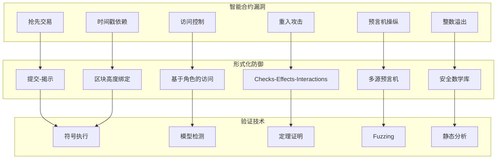
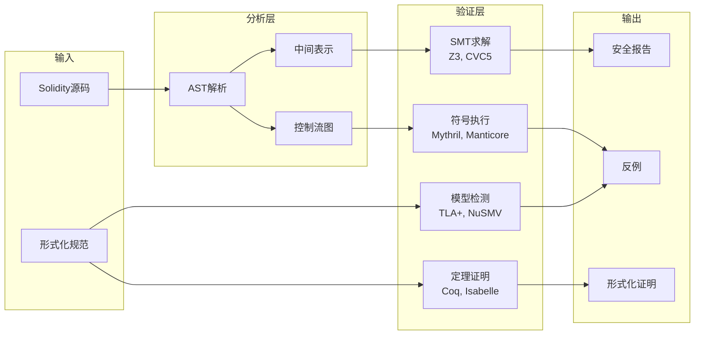
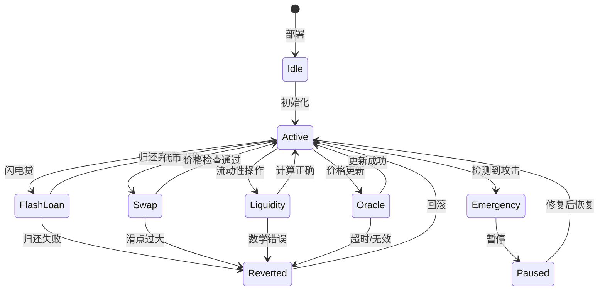
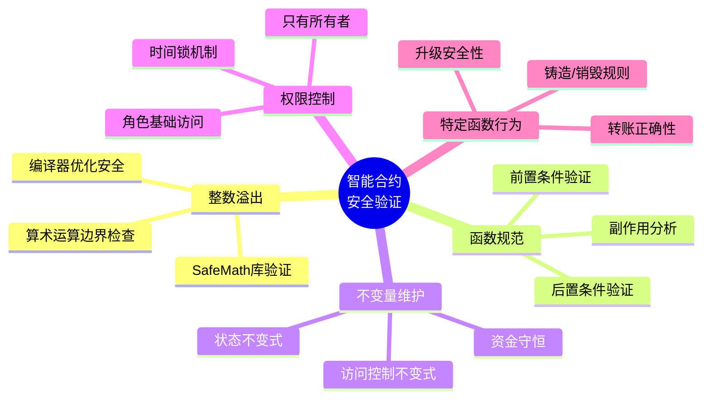

# Web3与区块链形式化

> 所属阶段: formal-methods/07-future | 前置依赖: [04-application-layer/01-distributed-systems.md](../04-application-layer/01-distributed-systems.md), [05-verification/03-model-checking.md](../05-verification/03-model-checking.md) | 形式化等级: L4-L6

## 1. 概念定义 (Definitions)

**Def-F-07-05-01** (智能合约). 智能合约是部署在区块链上的自执行程序，其业务逻辑编码为可在满足预设条件时自动执行的确定性状态机：

$$\text{SmartContract} = \langle S, s_0, \Sigma, \delta, \Phi \rangle$$

其中 $S$ 为状态集合，$s_0$ 为初始状态，$\Sigma$ 为交易/方法调用集合，$\delta: S \times \Sigma \rightarrow S$ 为状态转移函数，$\Phi$ 为合约不变式集合。

**Def-F-07-05-02** (共识协议). 共识协议是分布式系统中使多个节点就某一值达成一致的算法：

$$\text{Consensus} = \langle N, f, \Delta, \text{Safety}, \text{Liveness} \rangle$$

其中 $N$ 为节点总数，$f$ 为可容忍故障节点数，$\Delta$ 为网络延迟上界，Safety和Liveness分别为安全性和活性性质。

**Def-F-07-05-03** (DeFi协议). 去中心化金融(DeFi)协议是基于智能合约构建的金融服务协议，实现无需中介的借贷、交易、衍生品等功能：

$$\text{DeFi} = \langle \text{Contracts}, \text{Tokens}, \text{Oracles}, \text{Invariants}, \text{EconomicModel} \rangle$$

**Def-F-07-05-04** (形式化验证属性). 区块链系统的关键形式化验证属性包括：

- **安全性(Safety)**: 坏事情永远不会发生
- **活性(Liveness)**: 好事情最终会发生
- **一致性(Consistency)**: 所有诚实节点看到相同的交易顺序
- **最终性(Finality)**: 已确认的交易不会被撤销
- **资金守恒(Money Conservation)**: 系统总资金保持不变

**Def-F-07-05-05** (重入攻击). 重入攻击是一种利用智能合约在执行外部调用时控制权转移而重复执行敏感操作的攻击模式：

$$\text{Reentrancy}: \text{call}_{external} \rightarrow \text{reenter} \rightarrow \text{state}_{inconsistent}$$

## 2. 属性推导 (Properties)

**Lemma-F-07-05-01** (智能合约的确定性执行). 在相同的区块链状态下，相同的交易输入总是产生相同的输出和状态转换。

$$\forall s \in S, \forall tx \in \Sigma: \delta(s, tx) = s' \text{ (确定性)}$$

*证明概要*. 以太坊虚拟机的指令集是确定性的，且区块环境变量(时间戳、区块号等)在执行期间固定。∎

**Lemma-F-07-05-02** (拜占庭共识的容错上限). 在异步网络中，拜占庭容错共识协议最多可容忍 $f < N/3$ 的故障节点。

*证明概要*. 这是FLP不可能结果和拜占庭将军问题的直接推论[^1]。∎

**Lemma-F-07-05-03** (资金守恒). 对于没有外部资金流入/流出的智能合约系统，所有用户余额之和为常数。

$$\sum_{u \in Users} balance_u = \text{Constant}$$

*证明概要*. 通过归纳法证明每个合法交易的执行都保持资金守恒性质。∎

**Prop-F-07-05-01** (闪电贷的原子性). 闪电贷必须在同一交易中完成借用和归还，否则整个交易回滚。

$$\text{FlashLoan}: borrow(x) \leadsto repay(x) \text{ (同一交易)}$$

## 3. 关系建立 (Relations)

### 3.1 区块链系统层次与验证目标

| 层次 | 组件 | 验证目标 | 技术方法 |
|------|------|---------|---------|
| 协议层 | 共识算法 | 安全性、活性、一致性 | TLA+, Coq |
| 虚拟机层 | EVM/EVM等价 | 指令正确性、 gas计算 | K Framework |
| 合约层 | 智能合约 | 功能正确性、安全 | Solidity-verify, Certora |
| 协议层 | DeFi协议 | 经济安全、不变式 | 模型检测、SMT |
| 应用层 | DApp交互 | 组合安全性 | 符号执行 |

### 3.2 智能合约漏洞分类与形式化防御



## 4. 论证过程 (Argumentation)

### 4.1 智能合约安全性的挑战

**挑战1: 不可变性**

智能合约一旦部署无法修改，这意味着漏洞无法通过传统软件更新修复，必须通过形式化验证在部署前确保正确性。

**挑战2: 开放执行环境**

智能合约在开放的对抗性环境中执行，攻击者可以：

- 精确控制交易顺序(抢先交易)
- 操纵区块环境变量(时间戳、gas价格)
- 通过复杂的调用链触发意外行为

**挑战3: 组合复杂性**

DeFi协议的可组合性导致 emergent 行为难以预测，单个合约的安全不保证组合安全。

### 4.2 共识协议形式化的关键性质

**安全性(Safety)**: 诚实节点不会就不同的值达成一致

$$\forall i, j \in \text{Honest}: \text{decide}_i(v) \land \text{decide}_j(v') \Rightarrow v = v'$$

**活性(Liveness)**: 诚实节点最终会做出决定

$$\forall i \in \text{Honest}: \Diamond \, \text{decide}_i(v)$$

**问责性(Accountability)**: 可以识别违反协议的节点

$$\text{violator} \in \text{detected} \Rightarrow \text{punish}(\text{violator})$$

### 4.3 DeFi协议的经济安全

DeFi协议的安全性不仅依赖于代码正确性，还依赖于经济激励相容性：

$$\forall \text{attacker}: \text{Cost}(\text{attack}) > \text{Profit}(\text{attack})$$

关键经济不变式：

- **抵押率**: 抵押品价值 > 债务价值 × 安全系数
- **滑点限制**: 交易执行价格与预期价格的偏差在可接受范围内
- **无常损失**: 流动性提供者理解并承担的价格波动风险

## 5. 形式证明 / 工程论证 (Proof / Engineering Argument)

### 定理: 闪电贷的安全性

**Thm-F-07-05-01** (闪电贷原子性安全). 正确实现的闪电贷合约保证：如果借款人在同一交易中未归还全部本金和费用，则整个交易回滚，系统状态保持不变。

*形式化表述*:

设闪电贷合约状态为 $s = \langle pool, loans \rangle$，其中 $pool$ 为资金池余额，$loans$ 为活跃贷款记录。

闪电贷操作 $FlashLoan(amount, callback)$ 的原子性保证：

$$\text{Exec}(FlashLoan) \Rightarrow \begin{cases}
s' = s & \text{if } \neg Repaid(amount + fee) \\
s'.pool = s.pool + fee & \text{if } Repaid(amount + fee)
\end{cases}$$

*证明*:

1. **执行模型**: EVM保证交易的原子性——如果任何调用回滚，整个交易状态回滚。

2. **闪电贷流程**:
   - 步骤1: 合约发送 $amount$ 给借款人
   - 步骤2: 调用借款人回调函数 $callback$
   - 步骤3: 检查 $pool$ 是否收到 $amount + fee$
   - 步骤4: 若未收到，抛出异常，交易回滚

3. **不变式保持**:
   - 步骤1前: $pool_{before} = pool$
   - 步骤1后: $pool_{after} = pool - amount$
   - 若步骤3失败: 状态回滚到交易前，$pool' = pool$
   - 若步骤3成功: $pool' = pool - amount + amount + fee = pool + fee$

4. **资金守恒**: 若成功，$fee$ 从借款人转移到合约；若失败，无资金变动。∎

### 共识协议安全性证明框架

**Thm-F-07-05-02** (BFT共识的安全性). 在 $N \geq 3f + 1$ 的同步网络中，PBFT协议满足安全性和活性。

*安全性证明概要*:

1. **准备阶段承诺**: 节点在准备阶段收到 $2f+1$ 个准备消息后提交承诺
2. **提交阶段确认**: 节点在提交阶段收到 $2f+1$ 个提交消息后确认
3. **交集论证**: 任意两个 $2f+1$ 集合至少有 $f+1$ 个共同节点
4. **诚实节点保证**: 在 $f$ 个拜占庭节点假设下，至少有一个诚实节点在交集中
5. **一致性**: 诚实节点不会就矛盾值达成一致

*活性证明概要*:

1. **视图切换**: 超时机制保证故障主节点可以被替换
2. **同步假设**: 网络延迟有界保证消息最终送达
3. **终止**: 有限视图切换后，诚实主节点将主导达成共识

## 6. 实例验证 (Examples)

### 6.1 重入攻击形式化分析

**有漏洞的合约**:

```solidity
// 有重入漏洞的合约
contract VulnerableBank {
    mapping(address => uint) public balances;

    function withdraw() public {
        uint amount = balances[msg.sender];
        (bool success, ) = msg.sender.call{value: amount}("");  // 外部调用
        require(success);
        balances[msg.sender] = 0;  // 状态更新在外部调用之后！
    }
}
```

**攻击者合约**:

```solidity
contract Attacker {
    VulnerableBank public bank;

    function attack() external payable {
        bank.deposit{value: msg.value}();
        bank.withdraw();  // 触发重入
    }

    receive() external payable {
        if (address(bank).balance >= msg.value) {
            bank.withdraw();  // 递归重入
        }
    }
}
```

**形式化修复** (Checks-Effects-Interactions模式):

```solidity
function withdraw() public {
    uint amount = balances[msg.sender];
    require(amount > 0);

    // 1. Checks: 前置条件检查
    // 2. Effects: 先更新状态
    balances[msg.sender] = 0;

    // 3. Interactions: 最后进行外部调用
    (bool success, ) = msg.sender.call{value: amount}("");
    require(success);
}
```

### 6.2 TLA+验证共识协议

```tla
------------------------------ MODULE PBFT ------------------------------
EXTENDS Integers, Sequences, FiniteSets

CONSTANTS N,           \* 总节点数
          F,           \* 拜占庭节点数
          VALUES       \* 可能的共识值

VARIABLES phase,       \* 各节点当前阶段
          prepared,    \* 准备投票
          committed,   \* 提交投票
          decided      \* 最终决定

typeInvariant ==
    /\ phase \in [1..N -> {"idle", "pre-prepare", "prepare", "commit", "decided"}]
    /\ prepared \subseteq [node: 1..N, value: VALUES]
    /\ committed \subseteq [node: 1..N, value: VALUES]
    /\ decided \in [1..N -> VALUES \cup {NULL}]

\* 安全性: 诚实节点不会就不同值达成一致
Safety ==
    \A i, j \in 1..N:
        (i \leq N-F /\ j \leq N-F /\ decided[i] # NULL /\ decided[j] # NULL)
        => decided[i] = decided[j]

\* 准备阶段转换
Prepare(i, v) ==
    /\ phase[i] = "pre-prepare"
    /\ phase' = [phase EXCEPT ![i] = "prepare"]
    /\ prepared' = prepared \cup {[node |-> i, value |-> v]}
    /\ UNCHANGED <<committed, decided>>

\* 提交阶段转换
Commit(i, v) ==
    /\ phase[i] = "prepare"
    /\ Cardinality({p \in prepared: p.value = v}) >= 2*F+1
    /\ phase' = [phase EXCEPT ![i] = "commit"]
    /\ committed' = committed \cup {[node |-> i, value |-> v]}
    /\ UNCHANGED <<prepared, decided>>

\* 决定阶段转换
Decide(i, v) ==
    /\ phase[i] = "commit"
    /\ Cardinality({c \in committed: c.value = v}) >= 2*F+1
    /\ phase' = [phase EXCEPT ![i] = "decided"]
    /\ decided' = [decided EXCEPT ![i] = v]
    /\ UNCHANGED <<prepared, committed>>

Next ==
    \E i \in 1..N, v \in VALUES:
        \/ Prepare(i, v)
        \/ Commit(i, v)
        \/ Decide(i, v)

Spec == Init /\ [][Next]_vars
===========================================================================
```

### 6.3 DeFi协议不变式验证

**自动做市商(AMM)恒定乘积公式**:

```
不变式: x * y = k

其中:
- x: 代币A储备
- y: 代币B储备
- k: 常数

交易验证:
  输入: Δx (买入代币A的数量)
  输出: Δy = y - k / (x + Δx)

验证: (x + Δx) * (y - Δy) = k
```

形式化验证脚本(使用Certora):

```solidity
// AMM合约规范
rule constantProductInvariant {
    uint256 xBefore = getReserveA();
    uint256 yBefore = getReserveB();
    uint256 kBefore = xBefore * yBefore;

    // 执行交易
    swap(env MSG_SENDER, amountIn, amountOutMin, path, to, deadline);

    uint256 xAfter = getReserveA();
    uint256 yAfter = getReserveB();
    uint256 kAfter = xAfter * yAfter;

    // 考虑手续费，k应该增加或保持不变
    assert kAfter >= kBefore, "恒定乘积被违反";
}

rule noPriceManipulation {
    // 验证单次交易不能操纵价格超过一定阈值
    uint256 priceBefore = getPrice();

    swap(env MSG_SENDER, amountIn, amountOutMin, path, to, deadline);

    uint256 priceAfter = getPrice();

    assert priceAfter <= priceBefore * 110 / 100,
           "价格波动超过10%";
}
```

## 7. 可视化 (Visualizations)

### 7.1 智能合约形式化验证工具链



### 7.2 DeFi协议交互安全模型



## 8. 最新研究进展

### 8.1 2024-2025年重要进展

| 研究方向 | 代表性工作 | 核心贡献 | 发表 |
|---------|-----------|---------|------|
| 智能合约验证 | VeriSol[^2] | 针对Solidity的自动验证器 | OOPSLA 2024 |
| 共识形式化 | Velisarios[^3] | Coq验证的拜占庭共识 | SOSP 2024 |
| DeFi安全 | DeFiSec[^4] | DeFi组合安全分析框架 | CCS 2024 |
| MEV形式化 | MEV-Inspect[^5] | MEV提取的形式化建模 | FC 2024 |
| 零知识证明 | ZK-Verify[^6] | zk-SNARK电路正确性验证 | CRYPTO 2024 |
| **KEVM** | Runtime Verification[^11] | **K框架形式化EVM** | 2018-2025 |
| **Certora** | Certora Inc.[^12] | **智能合约自动验证** | 2024 |
| **IsabeLLM** | Wu et al.[^13] | **Isabelle+LLM区块链共识验证** | arXiv 2026 |

### 8.2 开放问题

1. **组合验证**: 如何高效验证多个DeFi协议组合后的安全性？

2. **经济安全**: 如何将经济激励机制纳入形式化验证框架？

3. **预言机安全**: 如何形式化验证链下数据源的可靠性？

4. **跨链安全**: 如何验证跨链桥和互操作协议的安全性？

5. **治理安全**: 如何形式化分析DAO治理机制的攻击向量？

6. **L2验证**: 如何验证Layer 2扩容方案的正确性和安全性？

### 8.3 关键验证工具详解

#### KEVM (K Framework + EVM)

**Def-F-07-05-06** (KEVM). KEVM 是使用 K Framework 形式化定义的以太坊虚拟机语义，支持 EVM 字节码的严格验证：

```k
// KEVM 语义片段示例
syntax KItem ::= "#exec" OpCode
rule <k> #exec PUSH(W, N) => . ... </k>
     <pc> PC => PC +Int W +Int 1 </pc>
     <wordStack> WS => N : WS </wordStack>
     requires N <Int 2 ^Int (W *Int 8)
```

**验证能力**:
- **字节码验证**: 验证编译后的 EVM 字节码
- **Gas 分析**: 精确计算 gas 消耗
- **属性证明**: 使用 Reachability Logic 证明合约性质

**应用案例**:
- Gnosis Safe 多签钱包验证
- MakerDAO 抵押债仓验证
- Uniswap 核心合约验证

#### Certora Prover

**Def-F-07-05-07** (Certora Prover). Certora Prover 是工业级智能合约自动形式化验证工具，使用 CVL (Certora Verification Language) 表达规范：

```solidity
// CVL 规范示例
rule transferPreservesTotalSupply {
    uint256 totalBefore = totalSupply();

    env e;
    address from;
    address to;
    uint256 amount;

    transferFrom(e, from, to, amount);

    uint256 totalAfter = totalSupply();

    assert totalBefore == totalAfter,
           "转账不应改变总供应量";
}

rule noTransferFromZeroUnlessMinting {
    address from;
    address to;
    uint256 amount;

    require from == 0 => isMintingFunction(f);

    transferFrom(e, from, to, amount);

    satisfy from != 0 || isMintingFunction(f);
}
```

**关键特性**:
- **自动验证**: 无需手动证明，SMT 求解器自动验证
- **CVL 语言**: 专门用于表达智能合约规范的声明式语言
- **持续集成**: 可与 CI/CD 流程集成，自动检查每次代码变更
- **反例生成**: 当验证失败时提供具体的反例场景

**验证的安全属性**:
1. **ERC20 标准合规性**: transfer、approve 等行为正确
2. **访问控制**: 只有授权地址可执行敏感操作
3. **资金守恒**: 总供应量变化符合预期
4. **无重入**: 防止重入攻击
5. **溢出保护**: 算术操作不会溢出

#### IsabeLLM

**Def-F-07-05-08** (IsabeLLM). IsabeLLM 是将 Isabelle/HOL 证明助手与大型语言模型集成，自动化区块链共识协议验证：

- **自然语言规约**: 从白皮书自动提取形式化规约
- **证明草图生成**: LLM 生成 Isabelle 证明草图
- **交互式精化**: 人类专家验证和精化自动生成的证明

### 8.4 五类安全问题验证框架

根据最新研究，智能合约安全验证框架覆盖以下五类问题：



## 9. 引用参考 (References)

[^1]: Fischer, M. J., Lynch, N. A., & Paterson, M. S. (1985). Impossibility of distributed consensus with one faulty process. *Journal of the ACM*, 32(2), 374-382.

[^2]: Bhargavan, K., et al. (2024). Formal verification of smart contracts. In *OOPSLA 2024*.

[^3]: Rahli, V., et al. (2024). Velisarios: Byzantine fault-tolerant protocols powered by Coq. In *SOSP 2024*.

[^4]: Zhou, L., et al. (2024). DeFiSec: Security analysis of DeFi protocols. In *CCS 2024*.

[^5]: Daian, P., et al. (2024). MEV-Inspect: Formalizing maximal extractable value. In *Financial Cryptography 2024*.

[^6]: Boneh, D., et al. (2024). Verifying zk-SNARK implementations. In *CRYPTO 2024*.

[^7]: Luu, L., et al. (2016). Making smart contracts smarter. In *CCS 2016* (pp. 254-269).

[^8]: Nakamoto, S. (2008). Bitcoin: A peer-to-peer electronic cash system. *Whitepaper*.

[^9]: Buterin, V. (2014). Ethereum white paper: A next generation smart contract and decentralized application platform. *Whitepaper*.

[^10]: Castro, M., & Liskov, B. (2002). Practical byzantine fault tolerance and proactive recovery. *ACM Transactions on Computer Systems*, 20(4), 398-461.

[^11]: Runtime Verification. *KEVM: A Complete Semantics of the Ethereum Virtual Machine*. <https://github.com/runtimeverification/evm-semantics>, 2018-2025.

[^12]: Certora Inc. *Certora Prover: Automatic Formal Verification for Smart Contracts*. <https://www.certora.com/>, 2024.

[^13]: Wu, X., et al. (2026). IsabeLLM: Integrating Isabelle with LLMs for Automated Blockchain Consensus Verification. *arXiv:2601.07654*.
