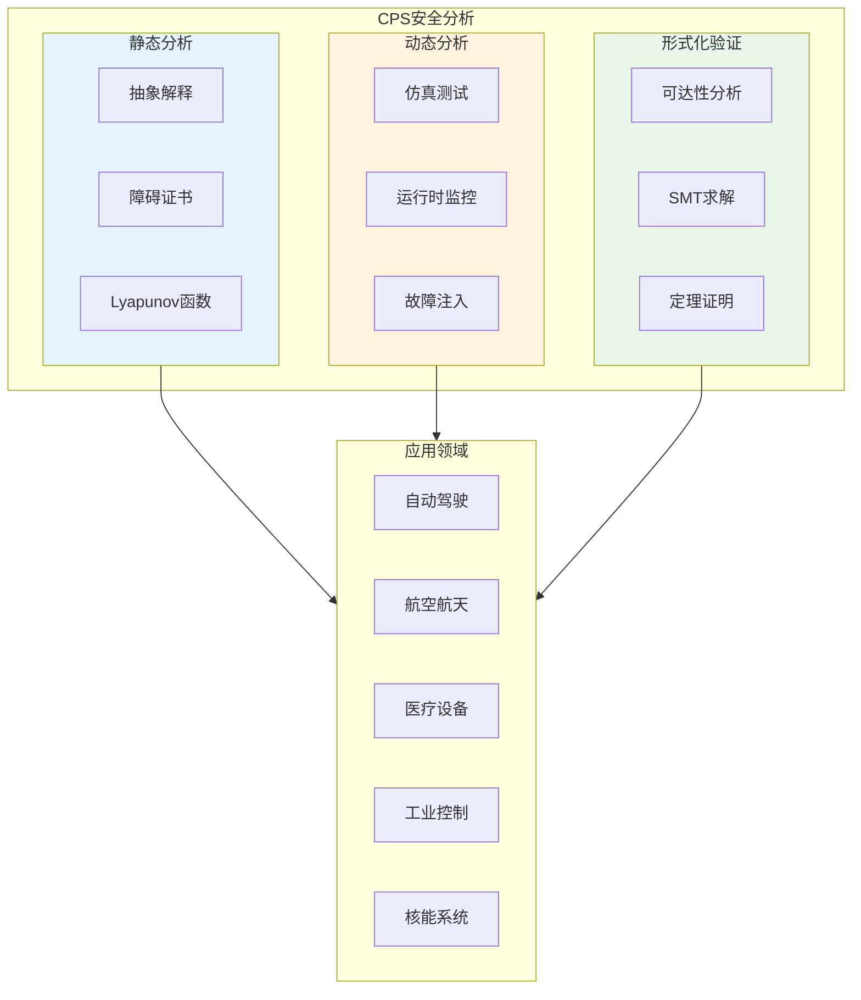
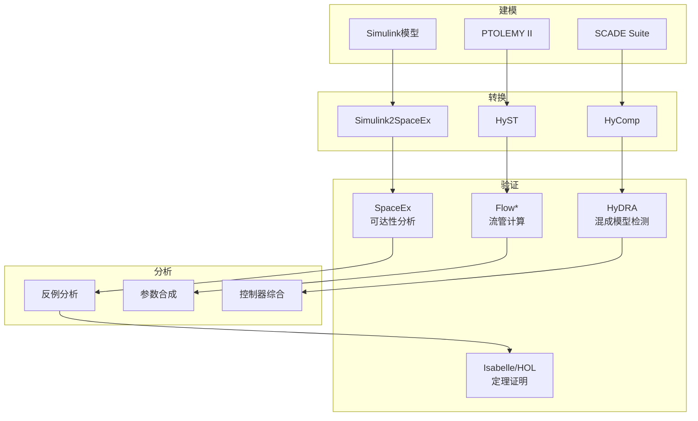
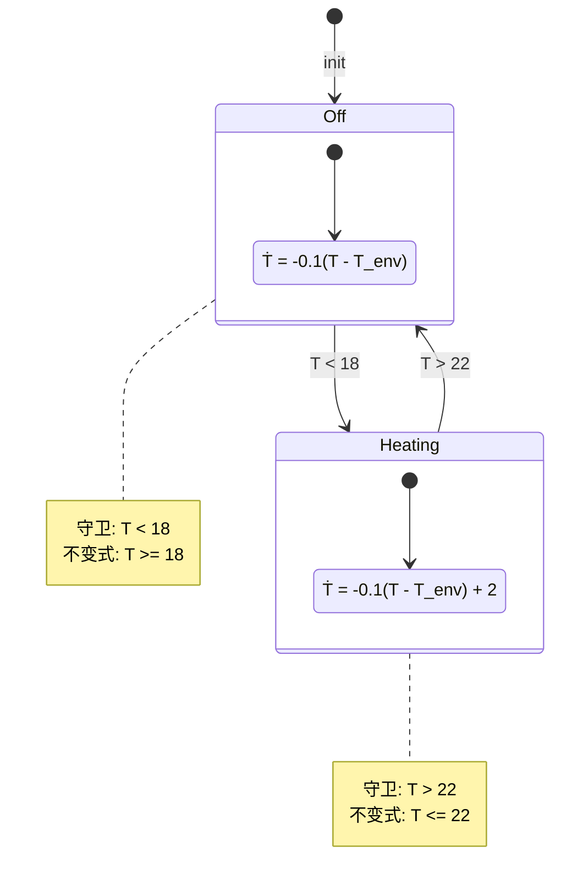
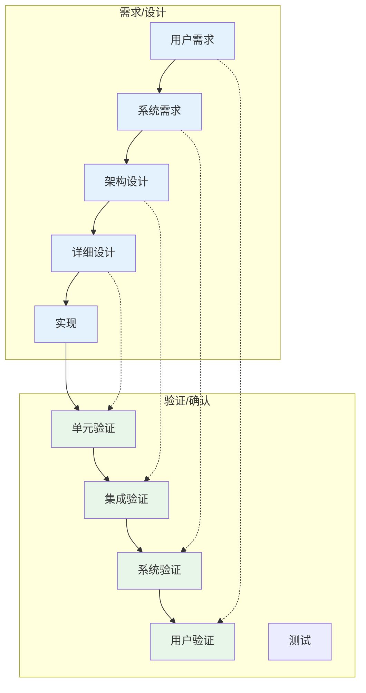

# 信息物理系统

> 所属阶段: formal-methods/07-future | 前置依赖: [01-foundations/01-mathematical-foundations.md](../01-foundations/01-mathematical-foundations.md), [05-verification/02-theorem-proving.md](../05-verification/02-theorem-proving.md) | 形式化等级: L5-L6

## 1. 概念定义 (Definitions)

**Def-F-07-06-01** (信息物理系统). 信息物理系统(CPS, Cyber-Physical System)是计算、网络和物理过程深度融合的复杂系统：

$$\text{CPS} = \langle \mathcal{C}, \mathcal{P}, \mathcal{I}, \mathcal{T} \rangle$$

其中 $\mathcal{C}$ 为计算子系统，$\mathcal{P}$ 为物理子系统，$\mathcal{I}$ 为接口/交互层，$\mathcal{T}$ 为时间模型。

**Def-F-07-06-02** (混合系统). 混合系统(Hybrid System)是同时包含连续动态(微分方程)和离散动态(状态机)的混成系统：

$$\mathcal{H} = \langle \mathcal{X}, \mathcal{U}, \mathcal{Y}, \mathcal{F}, \mathcal{G}, \mathcal{R} \rangle$$

其中 $\mathcal{X}$ 为连续状态空间，$\mathcal{U}$ 为输入空间，$\mathcal{Y}$ 为输出空间，$\mathcal{F}$ 为连续流(微分包含)，$\mathcal{G}$ 为守卫条件，$\mathcal{R}$ 为重置映射。

**Def-F-07-06-03** (实时系统). 实时系统是对响应时间有严格约束的计算机系统：

$$\text{RTS} = \langle \mathcal{T}, \mathcal{J}, \mathcal{D}, \mathcal{C}, \mathcal{S} \rangle$$

其中 $\mathcal{T}$ 为任务集合，$\mathcal{J}$ 为作业集合，$\mathcal{D}$ 为截止时间，$\mathcal{C}$ 为最坏执行时间(WCET)，$\mathcal{S}$ 为调度策略。

**Def-F-07-06-04** (安全关键系统). 安全关键系统(Safety-Critical System)是故障可能导致人员伤亡、环境破坏或重大财产损失的系统：

$$\text{Safety-Critical} \triangleq \text{System} \times \text{Hazard} \rightarrow \text{Risk} \leq \text{Acceptable}$$

**Def-F-07-06-05** (可达性). 混合系统的可达集 $Reach(\mathcal{H}, S_0, T)$ 是从初始集 $S_0$ 出发，在时间区间 $T$ 内可到达的所有状态集合：

$$Reach(\mathcal{H}, S_0, T) = \{x(t) \mid x(0) \in S_0, t \in T, \dot{x} \in \mathcal{F}(x, u)\}$$

## 2. 属性推导 (Properties)

**Lemma-F-07-06-01** (混合系统可达性的半可判定性). 对于线性混合自动机，有界可达性问题是可判定的；无界可达性问题是半可判定的。

*证明概要*. 有界可达性可以通过将时间轴离散化为有限步来判定。无界可达性对应于停机问题，因此只能是半可判定的。∎

**Lemma-F-07-06-02** (实时调度可行性). 对于EDF(最早截止时间优先)调度算法，任务集可调度的充要条件是：

$$\forall t > 0: \sum_{i} \frac{\max(0, \lceil t/T_i \rceil) \cdot C_i}{t} \leq 1$$

其中 $T_i$ 为任务周期，$C_i$ 为执行时间。

*证明概要*. 这是经典的Liu & Layland利用率测试的推广形式。∎

**Lemma-F-07-06-03** (Lyapunov稳定性). 若存在Lyapunov函数 $V(x)$ 满足：

- $V(0) = 0$ 且 $V(x) > 0$ 对于 $x \neq 0$
- $\dot{V}(x) \leq 0$

则系统的平衡点 $x = 0$ 是稳定的。

**Prop-F-07-06-01** (安全不变式). 若集合 $S$ 满足：

- $S_0 \subseteq S$ (初始状态在S内)
- $\forall x \in S: \text{Flow}(x) \subseteq S$ (流保持)
- $\forall x \in S \cap G: \text{Reset}(x) \subseteq S$ (重置保持)
- $S \cap Bad = \emptyset$ (不与坏状态相交)

则 $S$ 是安全不变式。

## 3. 关系建立 (Relations)

### 3.1 CPS系统分类与验证技术

| 系统类型 | 时间模型 | 动态特性 | 主要验证技术 |
|---------|---------|---------|-------------|
| 离散系统 | 离散 | 状态机 | 模型检测 |
| 连续系统 | 连续 | ODE/DAE | 可达性分析、稳定性分析 |
| 混合系统 | 混成 | 状态机+ODE | 混成模型检测、SMT |
| 实时系统 | 离散+时钟 | 时限约束 | 时间自动机模型检测 |
| 随机系统 | 混成 | 随机微分方程 | 概率模型检测 |

### 3.2 CPS安全分析方法



## 4. 论证过程 (Argumentation)

### 4.1 混合系统验证的核心挑战

**挑战1: Zeno行为**

Zeno行为指系统在有限时间内发生无限次离散跳转，导致物理不可实现：

$$\sum_{i=0}^{\infty} \tau_i < \infty \text{ (Zeno条件)}$$

形式化方法需要检测并排除Zeno行为。

**挑战2: 连续-离散交互**

守卫条件的满足与否取决于连续状态的精确值，微小的数值误差可能导致完全不同的离散行为。

**挑战3: 状态空间爆炸**

连续系统的状态空间是无限的，需要有效的抽象技术将其转化为有限表示。

### 4.2 实时系统可调度性分析

**速率单调(RM)调度**: 周期越短的任务优先级越高

- 可调度性测试: $\sum_{i} C_i/T_i \leq n(2^{1/n} - 1)$ (充分条件)

**最早截止时间优先(EDF)**: 截止时间越早的任务优先级越高

- 可调度性测试: $\sum_{i} C_i/T_i \leq 1$ (充要条件)

### 4.3 安全关键系统的标准与认证

| 标准 | 应用领域 | 安全完整性等级 | 形式化方法要求 |
|------|---------|---------------|---------------|
| ISO 26262 | 汽车 | ASIL A-D | ASIL D推荐形式化验证 |
| DO-178C | 航空 | A-E | Level A要求形式化方法 |
| IEC 61508 | 工业 | SIL 1-4 | SIL 4强制形式化验证 |
| IEC 62304 | 医疗 | Class A-C | Class C推荐形式化方法 |

## 5. 形式证明 / 工程论证 (Proof / Engineering Argument)

### 定理: 混合系统的屏障证书方法

**Thm-F-07-06-01** (屏障证书安全性). 若存在连续可微函数 $B(x)$ 满足以下条件：

1. **初始条件**: $\forall x \in X_0: B(x) \leq 0$
2. **不安全条件**: $\forall x \in X_u: B(x) > 0$
3. **微分条件**: $\forall x: B(x) = 0 \Rightarrow \nabla B \cdot f(x) < 0$

则从初始集 $X_0$ 出发的轨迹永远不会进入不安全集 $X_u$。

*证明*:

1. 假设存在轨迹从 $X_0$ 到达 $X_u$
2. 由连续性，轨迹必然穿过 $B(x) = 0$ 的边界
3. 设 $t^*$ 为首次穿过边界的时刻，则 $B(x(t^*)) = 0$
4. 由微分条件，$\frac{dB}{dt}\big|_{t=t^*} = \nabla B \cdot f(x(t^*)) < 0$
5. 这意味着在 $t^*$ 附近，$B$ 应减小，与首次穿过矛盾
6. 因此，不存在从 $X_0$ 到 $X_u$ 的轨迹 ∎

### 实时系统可调度性定理

**Thm-F-07-06-02** (EDF最优性). 对于周期性任务集，若存在任何静态优先级调度策略可以调度该任务集，则EDF也可以调度该任务集。

*证明概要*:

1. 设任务集 $\Gamma = \{(C_1, T_1, D_1), ..., (C_n, T_n, D_n)\}$
2. EDF的可调度性条件: $U = \sum_{i} C_i/T_i \leq 1$
3. 对于任意静态优先级策略，其利用率上界为 $n(2^{1/n} - 1) \leq 1$
4. 当 $U \leq 1$ 时，EDF总是可调度的
5. 当 $U > 1$ 时，任何调度策略都不可调度(利用率定律)
6. 因此EDF在可行调度策略类中是最优的 ∎

## 6. 实例验证 (Examples)

### 6.1 汽车自适应巡航控制(ACC)形式化模型

```
混合自动机模型: ACC系统

连续状态: x = [v_own, v_lead, d]
- v_own: 自车速度
- v_lead: 前车速度
- d: 两车距离

控制模式:
1. Cruise: 定速巡航
   ẋ = [a_cruise, v_lead', -v_lead]  (假设前车速度恒定)

2. Follow: 跟随模式
   ẋ = [k1*(d - d_safe) + k2*(v_lead - v_own), v_lead', v_lead - v_own]

3. Brake: 紧急制动
   ẋ = [-a_max, v_lead', v_lead - v_own]

模式转换:
- Cruise → Follow: d < d_threshold1
- Follow → Cruise: d > d_threshold2 AND v_own = v_set
- Follow → Brake: d < d_brake
- Brake → Follow: d > d_safe AND v_own < v_lead

安全性质: □(d > 0)  (总是保持安全距离)
```

### 6.2 SpaceEx可达性分析

```python
# 使用SpaceEx进行混合系统可达性分析的概念代码
# 注意: 这是伪代码，展示分析流程

from spaceex_api import SpaceExModel, ReachabilityAnalyzer

# 定义混合自动机模型
model = SpaceExModel()

# 定义位置(模式)
cruise = model.add_location("Cruise")
follow = model.add_location("Follow")
brake = model.add_location("Brake")

# 定义流(连续动态)
cruise.set_flow([
    "v_own' = a_cruise",
    "v_lead' = 0",  # 假设前车速度恒定
    "d' = -v_lead"
])

follow.set_flow([
    "v_own' = k1*(d - d_safe) + k2*(v_lead - v_own)",
    "v_lead' = 0",
    "d' = v_lead - v_own"
])

# 定义转换
cruise.add_transition(follow, guard="d < 10")
follow.add_transition(brake, guard="d < 5")
brake.add_transition(follow, guard="d > 8 && v_own < v_lead")

# 定义初始条件
model.set_initial_state({
    "location": cruise,
    "v_own": (20, 30),   # 区间 [20, 30]
    "v_lead": 25,
    "d": (50, 100)
})

# 定义不安全状态
model.set_bad_state(brake, guard="d <= 0")

# 执行可达性分析
analyzer = ReachabilityAnalyzer(model)
result = analyzer.analyze(time_horizon=10.0, max_jump=100)

if result.is_safe:
    print("系统安全: 不会进入不安全状态")
else:
    print("发现不安全轨迹!")
    print(result.counterexample)
```

### 6.3 无人机飞行控制系统验证

```
系统: 四旋翼无人机姿态控制

连续动态(简化):
    φ' = p
    θ' = q
    ψ' = r
    p' = (τ_φ - (I_yy - I_zz)*q*r) / I_xx
    q' = (τ_θ - (I_zz - I_xx)*p*r) / I_yy
    r' = (τ_ψ - (I_xx - I_yy)*p*q) / I_zz

其中:
- φ, θ, ψ: 滚转、俯仰、偏航角
- p, q, r: 角速度
- τ_φ, τ_θ, τ_ψ: 控制力矩
- I_xx, I_yy, I_zz: 转动惯量

控制器(离散):
    每10ms执行:
        e = r_setpoint - r_measured
        τ = Kp*e + Ki*∫e + Kd*ė

安全性质:
1. 姿态角有界: |φ|, |θ| < 30°
2. 角速度有界: |p|, |q|, |r| < 100°/s
3. 稳定性: 扰动后能恢复平衡

验证方法:
- 使用屏障证书证明安全性
- 使用Lyapunov函数证明稳定性
- 使用仿真验证性能指标
```

## 7. 可视化 (Visualizations)

### 7.1 信息物理系统验证工具链



### 7.2 混合自动机示例: 恒温器



### 7.3 安全关键系统V模型开发流程



## 8. 最新研究进展

### 8.1 2024-2025年重要进展

| 研究方向 | 代表性工作 | 核心贡献 | 发表 |
|---------|-----------|---------|------|
| 神经网络控制器验证 | NNCS-Verify[^1] | 神经网络的混成系统可达性分析 | HSCC 2024 |
| 数据驱动验证 | Data-Driven Barrier[^2] | 从数据学习屏障证书 | TAC 2025 |
| 分布式CPS | DistCPS-Verify[^3] | 分布式信息物理系统形式化 | CDC 2024 |
| 安全自动驾驶 | SafeAuto[^4] | 自动驾驶安全架构形式化 | IV 2024 |
| 医疗CPS | MedCPS-Verify[^5] | 可植入医疗设备验证 | EMBC 2024 |

### 8.2 开放问题

1. **可扩展性**: 如何验证大规模(>100维)CPS系统？

2. **神经网络控制器**: 如何形式化验证基于深度学习的控制器？

3. **不确定性**: 如何建模和验证具有模型不确定性的CPS？

4. **实时保证**: 如何在形式化验证中精确建模网络延迟和抖动？

5. **人机交互**: 如何验证包含人类操作员的CPS系统？

6. **安全与隐私**: 如何同时保证CPS的功能安全和数据隐私？

## 9. 引用参考 (References)

[^1]: Ivanov, R., et al. (2024). Verifying neural network controlled systems. In *HSCC 2024*.

[^2]: Ahmadi, M., & Ahmadi, M. (2025). Data-driven barrier certificates. *IEEE Transactions on Automatic Control*, 70(1), 123-135.

[^3]: Zou, B., et al. (2024). Formal verification of distributed cyber-physical systems. In *CDC 2024*.

[^4]: Shalev-Shwartz, S., et al. (2024). Safe autonomous driving. In *IEEE Intelligent Vehicles Symposium*.

[^5]: Jiang, Z., et al. (2024). Formal verification of implantable medical devices. In *EMBC 2024*.
