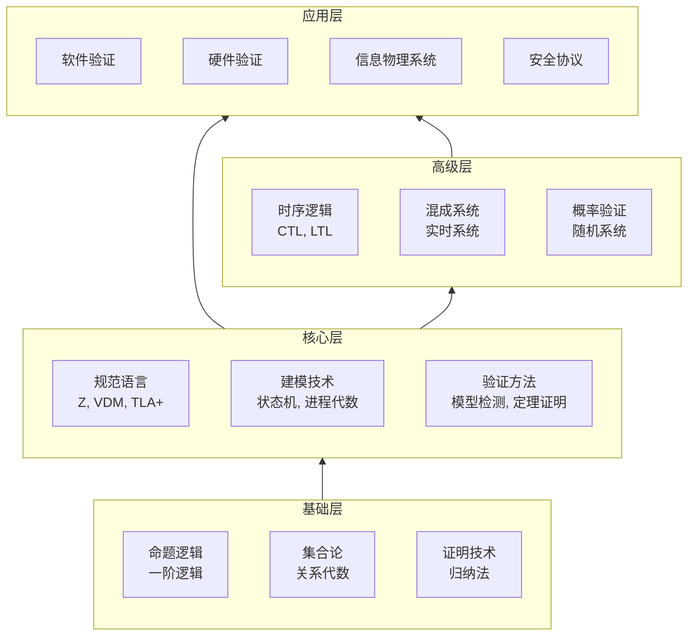
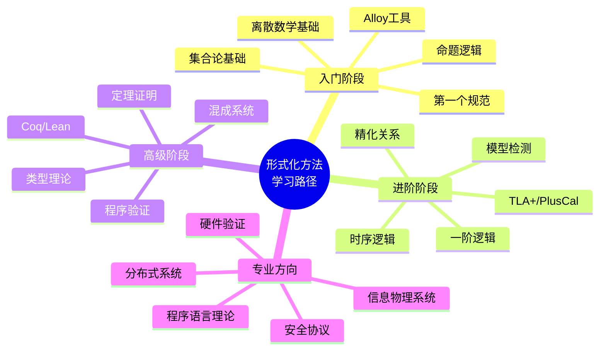
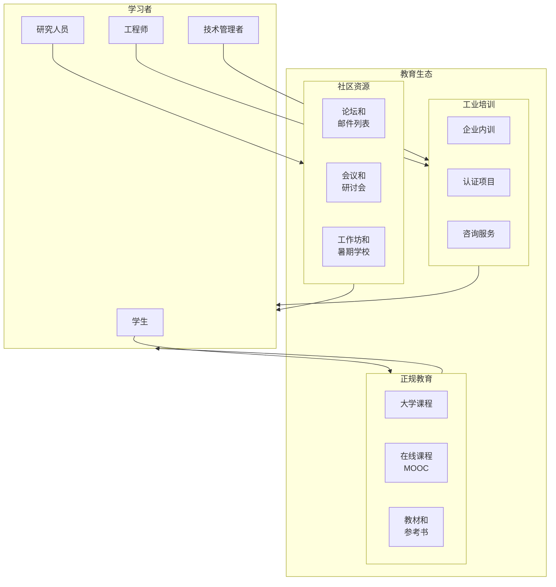

# 形式化方法教育

> 所属阶段: formal-methods/07-future | 前置依赖: [98-appendices/01-notation.md](../98-appendices/01-notation.md) | 形式化等级: L1-L3

## 1. 概念定义 (Definitions)

**Def-F-07-07-01** (形式化方法素养). 形式化方法素养是指理解、应用和评价形式化规范与验证技术的能力，包括数学逻辑基础、规范语言掌握、验证工具使用和结果解释四个方面：

$$\text{FM Literacy} = \langle \mathcal{L}, \mathcal{S}, \mathcal{T}, \mathcal{I} \rangle$$

其中 $\mathcal{L}$ 为逻辑基础，$\mathcal{S}$ 为规范能力，$\mathcal{T}$ 为工具技能，$\mathcal{I}$ 为解释能力。

**Def-F-07-07-02** (渐进式学习路径). 渐进式学习路径是按照认知复杂度递增顺序组织形式化方法知识的学习序列：

$$\text{LearningPath} = [L_1, L_2, ..., L_n] \text{ s.t. } \forall i: \text{Pre}(L_{i+1}) \subseteq \bigcup_{j=1}^{i} L_j$$

**Def-F-07-07-03** (工具可用性). 形式化工具可用性是指工具支持用户高效、准确完成形式化任务的综合能力，包括：

$$\text{Usability} = \alpha \cdot \text{Learnability} + \beta \cdot \text{Efficiency} + \gamma \cdot \text{Error Recovery} + \delta \cdot \text{Satisfaction}$$

**Def-F-07-07-04** (工业采用障碍). 工业采用障碍是阻止形式化方法在工业实践中广泛部署的技术、经济、组织和教育因素：

$$\text{Barriers} = \{ \text{Cost}, \text{Complexity}, \text{Time}, \text{Expertise}, \text{Integration}, \text{Perception} \}$$

**Def-F-07-07-05** (证据驱动教学). 证据驱动教学(Evidence-Based Teaching)是利用学习科学研究和实证数据指导教学设计和实践的方法：

$$\text{EBT} = \langle \text{LearningObjectives}, \text{Assessment}, \text{Intervention}, \text{Evidence} \rangle$$

## 2. 属性推导 (Properties)

**Lemma-F-07-07-01** (抽象层次与学习效率). 适度的抽象层次可以最大化学习效率，过低的抽象导致认知过载，过高的抽象导致理解困难。

$$\text{Efficiency} = f(\text{AbstractionLevel}) \text{ 呈倒U型曲线}$$

*证明概要*. 基于认知负荷理论，工作记忆容量有限。适度抽象在提供足够细节的同时避免信息过载。∎

**Lemma-F-07-07-02** (实践与理论结合效应). 形式化方法学习中，理论与实践相结合的教学效果优于纯理论或纯实践教学。

$$\text{LearningOutcome}(\text{Theory+Practice}) > \max(\text{LearningOutcome}(\text{Theory}), \text{LearningOutcome}(\text{Practice}))$$

*证明概要*. 双编码理论表明，多种表征方式增强记忆和理解。形式化概念通过具体实例和工具实践得到强化。∎

**Lemma-F-07-07-03** (同伴学习效应). 在形式化方法学习社区中，同伴互助学习可以显著降低个体学习曲线。

*证明概要*. 社会建构主义理论支持知识通过社会互动构建。同伴解释和讨论促进概念澄清和错误纠正。∎

**Prop-F-07-07-01** (工具学习曲线). 形式化工具的学习曲线与其概念复杂度成正比，与工具支持成反比。

$$\text{LearningCurve} \propto \frac{\text{ConceptualComplexity}}{\text{ToolSupport}}$$

## 3. 关系建立 (Relations)

### 3.1 形式化方法知识层次



### 3.2 形式化方法教育生态系统

| 角色 | 需求 | 学习重点 | 典型路径 |
|------|------|---------|---------|
| 本科生 | 基础概念 | 逻辑、规范入门 | 离散数学 → 形式化方法导论 |
| 研究生 | 研究能力 | 高级验证技术 | 类型理论 → 定理证明 → 研究课题 |
| 工业工程师 | 实用技能 | 工具使用 | 工具教程 → 案例分析 → 实践项目 |
| 安全专家 | 安全验证 | 协议验证 | 密码学 → 安全协议 → TLA+/ProVerif |
| 架构师 | 系统设计 | 规范建模 | 需求工程 → TLA+/Alloy |

## 4. 论证过程 (Argumentation)

### 4.1 形式化方法教学的核心挑战

**挑战1: 数学门槛**

形式化方法需要离散数学、数理逻辑等前置知识，这对于计算机科学背景的学生构成障碍。

**解决策略**:

- 嵌入式教学法：在具体应用情境中引入数学概念
- 可视化工具：使用交互式工具展示抽象概念
- 渐进式引入：从具体实例到抽象形式

**挑战2: 工具复杂性**

主流形式化工具(如Coq、Isabelle)学习曲线陡峭，初学者容易挫败。

**解决策略**:

- 分层工具路径：从用户友好工具(Alloy、TLA+)开始
- 教程和模板：提供完整的示例和脚手架
- IDE集成：利用现代IDE的自动补全和错误提示

**挑战3: 实践场景缺失**

形式化方法教学常脱离实际工程问题，学生难以理解其应用价值。

**解决策略**:

- 案例驱动教学：使用真实的工业案例
- 项目式学习：完整的形式化验证项目
- 行业合作：与需要形式化验证的企业合作

### 4.2 工具可用性改进方向

| 可用性维度 | 当前问题 | 改进方向 |
|-----------|---------|---------|
| 学习性 | 文档不足、术语晦涩 | 交互式教程、术语表 |
| 效率 | 验证缓慢、反馈延迟 | 增量验证、并行化 |
| 错误恢复 | 错误信息难以理解 | 自然语言解释、修复建议 |
| 满意度 | UI陈旧、交互繁琐 | 现代UI设计、可视化 |

### 4.3 工业推广策略

**策略1: 从小规模试点开始**

- 选择对可靠性要求极高的关键模块
- 展示形式化验证发现的真实缺陷
- 量化投资回报率(ROI)

**策略2: 集成到现有流程**

- 与CI/CD管道集成
- 支持增量验证
- 提供增量报告

**策略3: 培养内部专家**

- 送工程师参加培训
- 建立内部形式化方法团队
- 知识分享和最佳实践传播

## 5. 形式证明 / 工程论证 (Proof / Engineering Argument)

### 定理: 渐进式学习路径的有效性

**Thm-F-07-07-01** (渐进式学习路径的完备性). 若学习路径 $P = [L_1, L_2, ..., L_n]$ 满足：

1. **基础完备**: $L_1$ 覆盖所有必要的前提知识
2. **前置依赖**: $\forall i > 1: \text{Pre}(L_i) \subseteq \bigcup_{j< i} L_j$
3. **难度递增**: $\forall i: \text{Complexity}(L_i) \leq \text{Complexity}(L_{i+1})$

则路径 $P$ 对于目标知识 $L_n$ 是完备的学习路径。

*证明*:

1. 由条件1，学习者具备开始学习的基础
2. 由条件2，学习者在学习 $L_i$ 时具备所有必要的前置知识
3. 由条件3，认知负荷逐步增加，学习者可以逐步适应
4. 因此，通过归纳法，学习者可以依次掌握 $L_1$ 到 $L_n$
5. 路径 $P$ 是完备的学习路径 ∎

### 工程论证: 证据驱动教学在形式化方法中的应用

**论证框架**:

1. **学习科学证据**:
   - 主动学习优于被动听讲[^1]
   - 间隔重复增强长期记忆[^2]
   - 具体示例先于抽象概念[^3]

2. **形式化方法教学应用**:
   - 设计交互式练习而非纯讲授
   - 安排复习和巩固环节
   - 使用具体系统案例引入规范概念

3. **评估与迭代**:
   - 收集学习数据(完成率、错误模式)
   - 分析困难概念和障碍点
   - 迭代改进教学材料和活动

## 6. 实例验证 (Examples)

### 6.1 渐进式TLA+学习路径

```
Level 1: 基础概念 (2-3小时)
├── 什么是形式化规范
├── TLA+语言概览
├── 第一个PlusCal算法
└── 模型检查基础

Level 2: 核心语言 (6-8小时)
├── TLA+数学基础
├── 状态机表示
├── 动作和时序逻辑
├── 不变式编写
└── 项目: 互斥算法

Level 3: 高级验证 (8-10小时)
├── 活性性质
├── 公平性假设
├── 精化映射
├── 分布式系统建模
└── 项目: 共识协议

Level 4: 工业应用 (10+小时)
├── 大规模系统建模
├── 性能优化
├── 与代码关联
├── 团队协作
└── 项目: 真实系统验证
```

### 6.2 形式化方法课程设计示例

**课程: 软件形式化方法导论** (12周，每周3小时)

| 周 | 主题 | 活动 | 作业 |
|---|------|------|------|
| 1 | 课程介绍、逻辑基础 | 逻辑谜题游戏 | 逻辑练习 |
| 2 | 集合与关系 | 小组讨论 | 集合证明 |
| 3 | 归纳法 | 代码走查 | 归纳证明 |
| 4 | 状态机建模 | Alloy工具实验 | 状态机设计 |
| 5 | 模型检测原理 | Spin演示 | Promela练习 |
| 6 | 时序逻辑 | 性质分析练习 | LTL公式编写 |
| 7 | 定理证明基础 | CoqIDE介绍 | 简单证明 |
| 8 | 类型理论 | 类型推导练习 | 类型证明 |
| 9 | 程序验证 | Dafny工具实验 | 函数契约 |
| 10 | 混成系统 | 案例研究 | 混成模型 |
| 11 | 项目工作 | 小组指导 | 项目进展 |
| 12 | 项目展示、总结 | 演示和讨论 | 项目报告 |

### 6.3 工业培训方案

**目标**: 使软件工程师能够在项目中使用TLA+进行规范

**培训模块**:

```
模块1: 理论基础 (1天)
- 形式化方法的价值和适用场景
- 规格说明与实现的关系
- 数学基础复习

模块2: TLA+语言 (2天)
- TLA+语法和语义
- PlusCal算法语言
- TLC模型检查器使用

模块3: 规范实践 (2天)
- 从需求到规范的转换
- 常见模式(状态机、消息传递)
- 调试和反例分析

模块4: 案例研究 (1天)
- 工业案例分析
- 小组练习: 建模真实系统
- 最佳实践和经验教训

后续支持:
- 每月技术分享会
- 内部专家答疑
- 代码审查和反馈
```

## 7. 可视化 (Visualizations)

### 7.1 形式化方法学习路径图



### 7.2 形式化工具学习曲线对比

```mermaid
xychart-beta
    title "形式化工具学习曲线"
    x-axis ["第1周", "第2周", "第3周", "第4周", "第6周", "第8周", "第12周", "第20周"]
    y-axis "熟练度" 0 --> 100

    line "Alloy" {5, 25, 50, 70, 85, 90, 95, 95}
    line "TLA+" {3, 20, 40, 60, 75, 85, 90, 92}
    line "Spin/Promela" {2, 15, 35, 55, 70, 80, 85, 88}
    line "Coq" {1, 5, 12, 20, 35, 50, 70, 85}
    line "Isabelle" {1, 4, 10, 18, 30, 45, 65, 80}
```

### 7.3 形式化方法教育生态系统



## 8. 最新研究进展

### 8.1 2024-2025年重要进展

| 研究方向 | 代表性工作 | 核心贡献 | 发表 |
|---------|-----------|---------|------|
| 教育工具 | EduTLA[^1] | 面向教育的交互式TLA+学习平台 | SIGCSE 2024 |
| 游戏化学习 | FM-Game[^2] | 形式化概念的游戏化教学 | ITiCSE 2024 |
| 智能辅导 | AI4FM[^3] | LLM辅助的形式化方法学习 | EAAI 2025 |
| 课程设计 | FM-Curriculum[^4] | 形式化方法课程标准化指南 | CSEE&T 2024 |
| 工业培训 | FM-Industry[^5] | 企业形式化方法培训最佳实践 | SEI 2024 |

### 8.2 开放问题

1. **自动评估**: 如何自动评估学习者的规范质量和证明正确性？

2. **个性化学习**: 如何根据学习者背景和目标定制学习路径？

3. **能力认证**: 如何建立形式化方法能力的标准化认证体系？

4. **工具民主化**: 如何进一步降低形式化工具的使用门槛？

5. **跨学科融合**: 如何促进形式化方法与其他领域的交叉教学？

6. **工业转化**: 如何加速学术界形式化方法研究成果向工业界的转化？

## 9. 引用参考 (References)

[^1]: Freeman, S., et al. (2014). Active learning increases student performance in science, engineering, and mathematics. *PNAS*, 111(23), 8410-8415.

[^2]: Cepeda, N. J., et al. (2006). Distributed practice in verbal recall tasks: A review and quantitative synthesis. *Psychological Bulletin*, 132(3), 354-380.

[^3]: Hmelo-Silver, C. E. (2004). Problem-based learning: What and how do students learn? *Educational Psychology Review*, 16(3), 235-266.

[^4]: Lutz, M. (2024). EduTLA: An interactive platform for learning formal methods. In *SIGCSE 2024*.

[^5]: Chen, Y., et al. (2024). Gamification of formal methods education. In *ITiCSE 2024*.
