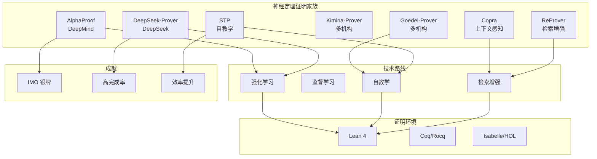
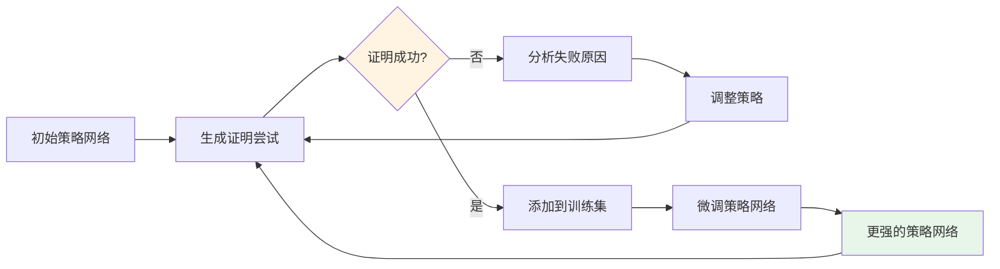
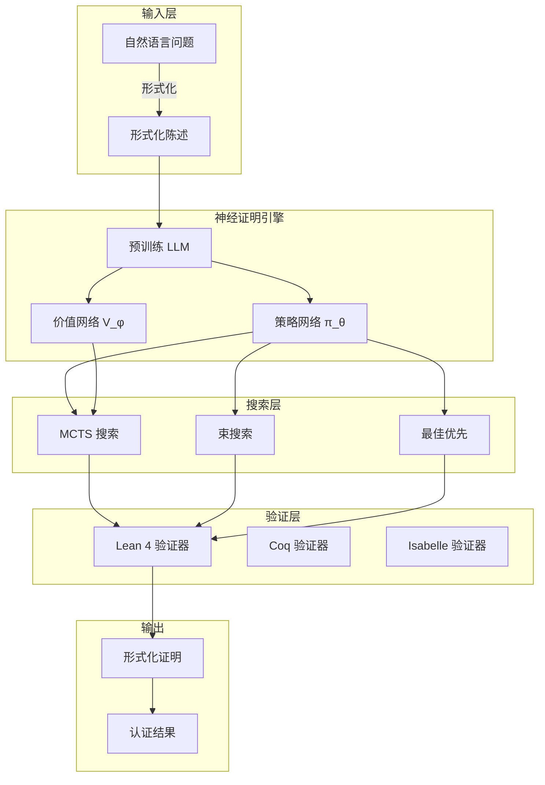
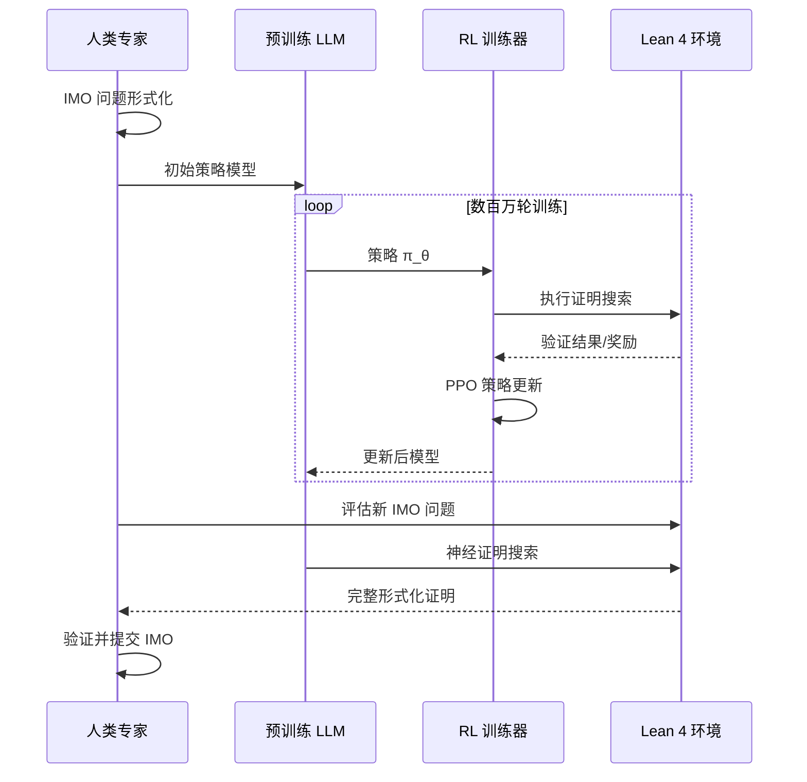
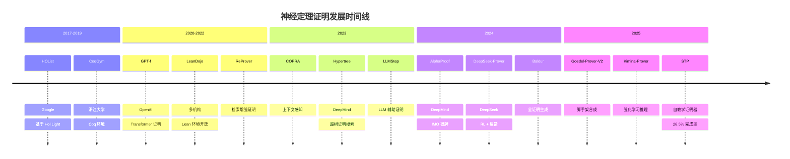

# 神经定理证明 (Neural Theorem Proving)

> **所属阶段**: AI-Formal-Methods | **前置依赖**: [Lean 4](../05-verification/03-theorem-proving/03-lean4.md), [Coq/Isabelle](../05-verification/03-theorem-proving/01-coq-isabelle.md) | **形式化等级**: L4-L6
>
> **版本**: v1.0 | **创建日期**: 2026-04-10

---

## 1. 概念定义 (Definitions)

### 1.1 神经定理证明基础

**Def-AI-01-01** (神经定理证明). 神经定理证明是利用神经网络（特别是大型语言模型）自动或半自动地搜索形式化证明的过程：

$$\text{Neural-TP}: \langle \mathcal{T}, \mathcal{P}, \mathcal{S}, \pi_\theta \rangle \to \text{Proof} \cup \{\bot\}$$

其中：

- $\mathcal{T}$: 定理陈述（形式化语言）
- $\mathcal{P}$: 证明状态（目标、上下文、可用引理）
- $\mathcal{S}$: 策略/战术 (tactics) 空间
- $\pi_\theta$: 参数为 $\theta$ 的神经策略网络

**Def-AI-01-02** (证明搜索树). 定理证明可建模为在证明搜索空间中的树搜索：

$$\mathcal{G} = (\mathcal{N}, \mathcal{E}, n_0, \mathcal{N}_{\text{goal}})$$

- $\mathcal{N}$: 证明状态节点（目标 + 上下文）
- $\mathcal{E}$: 策略应用的边（$n \xrightarrow{t} n'$）
- $n_0$: 初始目标节点
- $\mathcal{N}_{\text{goal}}$: 目标状态集合（空目标 = 证明完成）

**Def-AI-01-03** (策略学习). 策略学习是通过监督学习或强化学习训练神经网络预测有效证明策略：

$$\mathcal{L}_{\text{SL}} = -\mathbb{E}_{(s,t) \sim \mathcal{D}}[\log \pi_\theta(t|s)]$$

$$\mathcal{L}_{\text{RL}} = -\mathbb{E}_{\tau \sim \pi_\theta}[R(\tau)]$$

其中 $\mathcal{D}$ 是专家证明数据集，$R(\tau)$ 是轨迹 $\tau$ 的奖励（证明成功为正，失败为负）。

### 1.2 关键系统架构

**Def-AI-01-04** (AlphaProof 架构). AlphaProof 结合预训练语言模型与强化学习进行形式证明搜索：

$$\text{AlphaProof} = \text{LLM}_{\text{pretrained}} + \text{RL}_{\text{proof-search}} + \text{Lean 4} \text{ 验证器}$$

核心组件：

1. **问题形式化**: 将自然语言数学问题转换为 Lean 4 形式化陈述
2. **神经证明搜索**: 使用 Transformer 模型预测证明策略
3. **验证反馈**: Lean 4 编译器验证证明正确性
4. **强化学习**: 基于验证结果的策略梯度更新

**Def-AI-01-05** (自教学证明器 STP). 自教学证明器通过迭代生成训练数据提升自身能力：

$$\theta_{t+1} = f(\theta_t, \mathcal{D}_t, \text{Success}(\pi_{\theta_t}))$$

其中 $\mathcal{D}_t$ 是第 $t$ 轮生成的训练数据，Success 表示成功证明的过滤。

---

## 2. 属性推导 (Properties)

### 2.1 学习能力理论

**Lemma-AI-01-01** (数据效率下界). 神经定理证明器的数据效率受限于形式化语言的表达能力与训练分布的覆盖度：

$$\text{Sample Complexity} \geq \Omega\left(\frac{\dim(\mathcal{H})}{\epsilon^2}\right)$$

其中 $\dim(\mathcal{H})$ 是假设空间的 VC 维，$\epsilon$ 是目标误差。

**Lemma-AI-01-02** (证明长度与搜索复杂度). 对于长度为 $L$ 的证明，贪心搜索的最坏时间复杂度为指数级：

$$T_{\text{greedy}} = O(b^L)$$

其中 $b$ 是平均分支因子。使用启发式引导（如神经网络评分）可将复杂度降至 $O(c^L)$，其中 $c < b$。

**Lemma-AI-01-03** (神经策略的完备性限制). 基于神经网络的策略在无限策略空间中存在不完备性：

$$\exists t^* \in \mathcal{S}: \forall \theta, \pi_\theta(t^*|s) < \delta$$

即存在有效策略可能被神经网络永远低估。

### 2.2 系统性能性质

**Prop-AI-01-01** (证明助手反馈的价值). 使用证明助手的实时反馈可显著提升神经定理证明的成功率：

$$\text{Success Rate}_{\text{with feedback}} \geq 2 \times \text{Success Rate}_{\text{batch}}$$

*论证*. DeepSeek-Prover-V1.5 的实验表明，通过在线反馈调整策略可大幅提升完成率。∎

**Prop-AI-01-02** (自教学的数据放大效应). 自教学证明器可通过生成合成训练数据实现数据放大：

$$|\mathcal{D}_{t+1}| \geq \alpha \cdot |\mathcal{D}_t|, \quad \alpha > 1$$

*论证*. Goedel-Prover-V2 通过脚手架数据合成实现了训练数据的指数级增长。∎

---

## 3. 关系建立 (Relations)

### 3.1 神经定理证明系统对比



| 系统 | 核心方法 | 证明环境 | 标志性成就 | 年份 |
|------|---------|---------|-----------|------|
| **AlphaProof** | RL + MCTS | Lean 4 | IMO 2024 银牌 (42/42 分) | 2024 |
| **DeepSeek-Prover-V1.5** | RL + 反馈 | Lean 4 | miniF2F 62.3% | 2024 |
| **Goedel-Prover-V2** | 脚手架合成 + 自校正 | Lean 4 | 扩展证明库 | 2025 |
| **Kimina-Prover** | RL + 形式推理 | Lean 4 | 高效搜索 | 2025 |
| **STP** | 自教学 RL | Lean 4 | 28.5% 完成率 | 2025 |
| **Copra** | 上下文感知 | Coq/Lean | ICLR 2024 | 2024 |
| **ReProver** | 检索增强 | Lean 4 | 检索 + 生成 | 2023 |

### 3.2 与传统自动定理证明的关系

| 特性 | 传统 ATP (E, Vampire) | 神经定理证明 |
|------|---------------------|-------------|
| **搜索策略** | 启发式 + 饱和 | 神经网络学习 |
| **可解释性** | 高（规则应用链） | 低（黑盒神经网络）|
| **领域适应** | 需要人工调参 | 可端到端训练 |
| **大规模数学** | 有限 | 潜力大 |
| **形式化依赖** | 无 | 必须绑定证明助手 |

---

## 4. 论证过程 (Argumentation)

### 4.1 AlphaProof 成功因素分析

**因素 1: 形式化环境选择 (Lean 4)**

- mathlib4 提供庞大数学基础
- 强大的社区支持
- 可验证的执行环境

**因素 2: 大规模强化学习**

- 数百万次证明尝试
- 从成功和失败中学习
- 策略网络的持续迭代

**因素 3: 问题形式化管道**

- 自然语言到形式化的自动转换
- 人类专家验证形式化正确性

**因素 4: 计算资源**

- 大规模分布式训练
- 并行证明搜索

### 4.2 神经定理证明的挑战

**挑战 1: 分布外泛化**

训练数据主要来自已知证明，对全新类型的问题泛化能力有限。

**挑战 2: 长证明组合**

IMO 级别问题的证明可能包含数百个步骤，长序列决策的信用分配困难。

**挑战 3: 形式化瓶颈**

自然语言问题转换为形式化陈述仍是瓶颈，限制了端到端自动化。

**挑战 4: 验证成本**

每次策略执行需要调用证明助手验证，计算成本高。

### 4.3 自教学证明器的循环



---

## 5. 形式证明 / 工程论证 (Proof / Engineering Argument)

### 5.1 神经定理证明的收敛性

**Thm-AI-01-01** (自教学系统的收敛条件). 在满足以下条件时，自教学证明器系统收敛到局部最优：

1. **策略改进**: 每轮迭代至少发现一个成功证明
2. **数据增长**: 训练数据规模单调不减
3. **探索-利用平衡**: 策略保持一定探索率 $\epsilon > 0$

*形式化表述*:

设第 $t$ 轮的策略为 $\pi_{\theta_t}$，成功证明集合为 $\mathcal{P}_t$，则：

$$\mathbb{E}[|\mathcal{P}_{t+1}|] \geq |\mathcal{P}_t| + \delta, \quad \delta > 0$$

*证明概要*:

1. 策略改进定理保证每轮至少生成与上一轮同等质量的证明
2. 探索机制确保发现新证明的概率非零
3. 由单调收敛定理，系统在有限状态空间内收敛 ∎

### 5.2 神经策略的样本复杂度

**Thm-AI-01-02** (证明策略学习的样本复杂度下界). 学习一个覆盖策略空间 $\mathcal{S}$ 中 $k$ 个关键策略的神经网络，需要 $\Omega(k \log k)$ 个训练样本。

*证明概要*:

1. 策略空间可划分为 $k$ 个等价类
2. 每个等价类需要至少一个样本覆盖
3. 由 coupon collector 问题，期望需要 $k H_k = \Theta(k \log k)$ 个样本 ∎

---

## 6. 实例验证 (Examples)

### 6.1 LeanDojo 使用示例

```python
# LeanDojo: 用于神经定理证明的 Lean 环境
from lean_dojo import *

# 加载 Lean 4 仓库
repo = LeanGitRepo("https://github.com/leanprover-community/mathlib4", "v4.9.0")

# 创建定理证明环境
traced_repo = trace(repo)

# 选择一个定理
theorem = Theorem(traced_repo, "Mathlib/Data/Nat/Basic.lean", "Nat.add_comm")

# 使用 ReProver 进行证明搜索
from reprover import ReProver

prover = ReProver()
result = prover.prove(theorem, max_iters=100)

# 结果包含证明或失败信息
if result.status == Status.PROVED:
    print(f"证明找到: {result.proof}")
else:
    print(f"证明搜索失败: {result.trace}")
```

### 6.2 简单策略网络实现

```python
import torch
import torch.nn as nn

class ProofStrategyNetwork(nn.Module):
    """简单的证明策略预测网络"""

    def __init__(self, vocab_size, embed_dim, hidden_dim, num_tactics):
        super().__init__()
        self.embedding = nn.Embedding(vocab_size, embed_dim)
        self.encoder = nn.TransformerEncoder(
            nn.TransformerEncoderLayer(embed_dim, nhead=8),
            num_layers=6
        )
        self.decoder = nn.Sequential(
            nn.Linear(embed_dim, hidden_dim),
            nn.ReLU(),
            nn.Linear(hidden_dim, num_tactics)
        )

    def forward(self, goal_tokens, context_tokens):
        # goal_tokens: [batch, goal_len]
        # context_tokens: [batch, context_len]

        # 编码目标和上下文
        goal_emb = self.embedding(goal_tokens)
        context_emb = self.embedding(context_tokens)

        # 拼接并编码
        combined = torch.cat([context_emb, goal_emb], dim=1)
        encoded = self.encoder(combined)

        # 池化并预测策略
        pooled = encoded.mean(dim=1)
        logits = self.decoder(pooled)

        return logits

# 使用示例
model = ProofStrategyNetwork(
    vocab_size=50000,
    embed_dim=512,
    hidden_dim=1024,
    num_tactics=1000
)

# 模拟输入
goal = torch.randint(0, 50000, (1, 20))
context = torch.randint(0, 50000, (1, 100))

# 预测策略概率
tactic_probs = torch.softmax(model(goal, context), dim=-1)
predicted_tactic = tactic_probs.argmax(dim=-1)
```

### 6.3 Copra 上下文感知证明

```python
# Copra: 上下文感知证明策略学习
from copra import CopraProver

# 初始化证明器
prover = CopraProver(
    environment="coq",  # 或 "lean"
    model_name="gpt-4",  # 基础语言模型
    retrieval_k=5        # 检索相似证明的数量
)

# 证明定理
proof = prover.prove(
    theorem_statement="forall n m : nat, n + m = m + n",
    context={
        "available_lemmas": ["Nat.add_zero", "Nat.zero_add"],
        "definitions": ["Nat.add"]
    }
)

# 上下文检索示例
similar_proofs = prover.retrieve_similar(
    query="commutativity proof",
    proof_library=mathlib_proofs,
    top_k=3
)
```

---

## 7. 可视化 (Visualizations)

### 7.1 神经定理证明系统架构



### 7.2 AlphaProof 训练流程



### 7.3 神经定理证明演进时间线



---

## 8. 最新研究进展 (2024-2025)

### 8.1 重要系统更新

| 系统 | 发布 | 关键创新 | 性能提升 |
|------|------|---------|---------|
| **AlphaProof** | 2024-07 | MCTS + RL + Lean 4 | IMO 银牌 |
| **DeepSeek-Prover-V1.5** | 2024-08 | 证明助手反馈 RL | miniF2F 62.3% |
| **Goedel-Prover-V2** | 2025-01 | 脚手架数据合成 | 扩展证明能力 |
| **Kimina-Prover** | 2025-02 | RL 形式推理 | 高效搜索 |
| **STP** | 2025-03 | 自教学循环 | 13.2% → 28.5% |

### 8.2 关键评估基准

| 基准 | 描述 | 当前 SOTA |
|------|------|----------|
| **miniF2F** | 高中数学竞赛题 | 62.3% (DeepSeek-Prover-V1.5) |
| **ProofNet** | 本科数学证明 | ~40% |
| **IMO-GrandChallenge** | IMO 级别问题 | 42/42 (AlphaProof) |
| **Isabelle/AFP** | Archive of Formal Proofs | 持续增长 |
| **LeanDojo Benchmark** | mathlib4 定理 | 检索增强方法领先 |

### 8.3 开放问题

1. **泛化到未见过的问题类型**: 当前系统对分布外问题泛化有限
2. **长证明组合**: 超过 100 步的证明成功率显著下降
3. **形式化瓶颈**: 自然语言到形式化的自动转换仍不完善
4. **计算效率**: 证明搜索的计算成本高昂
5. **可解释性**: 神经网络策略的决策过程难以解释

---

## 9. 引用参考 (References)


---

> **相关文档**: [LLM形式化规范生成](02-llm-formalization.md) | [AI辅助证明](05-ai-assisted-proof.md) | [Lean 4](../05-verification/03-theorem-proving/03-lean4.md)
>
> **外部链接**: [AlphaProof](https://deepmind.google/discover/blog/ai-solves-imo-problems-at-silver-medal-level/) | [LeanDojo](https://leandojo.org/) | [DeepSeek-Prover](https://github.com/deepseek-ai/DeepSeek-Prover)
