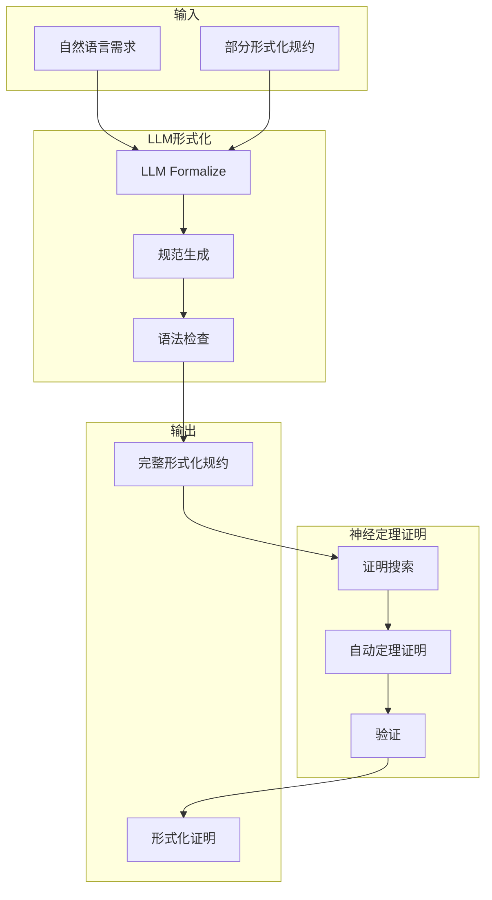
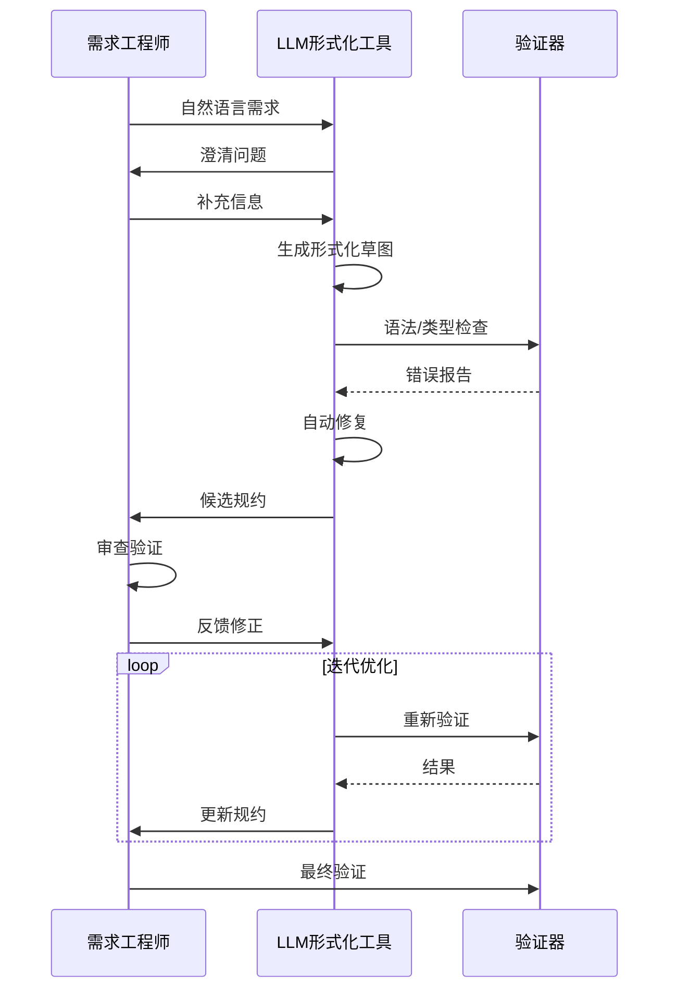
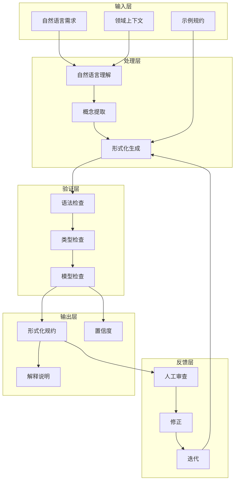
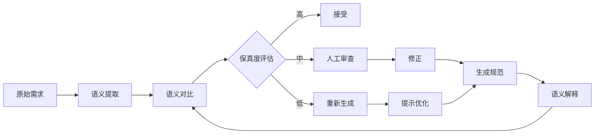

# LLM形式化规范生成

> **所属阶段**: AI-Formal-Methods | **前置依赖**: [神经定理证明](01-neural-theorem-proving.md), [Lean 4](../05-verification/03-theorem-proving/03-lean4.md) | **形式化等级**: L4
>
> **版本**: v1.0 | **创建日期**: 2026-04-10

---

## 1. 概念定义 (Definitions)

### 1.1 LLM形式化转换

**Def-AI-02-01** (自然语言到形式化规范转换). LLM形式化规范生成是指利用大型语言模型将自然语言需求描述自动转换为形式化规约语言（如TLA+、Coq、Lean）的过程：

$$\text{LLM-Formalize}: \mathcal{L}_{\text{NL}} \times \mathcal{C}_{\text{context}} \rightarrow \mathcal{L}_{\text{formal}} \times \mathcal{P}_{\text{confidence}}$$

其中：

- $\mathcal{L}_{\text{NL}}$: 自然语言输入空间
- $\mathcal{C}_{\text{context}}$: 领域上下文（分布式系统、并发算法等）
- $\mathcal{L}_{\text{formal}}$: 目标形式化语言
- $\mathcal{P}_{\text{confidence}}$: 转换置信度估计

**Def-AI-02-02** (形式化保真度). 形式化保真度衡量生成规范对原始需求的忠实程度：

$$\text{Fidelity}(Spec_{\text{generated}}, Req_{\text{original}}) = \frac{|Sem(Spec) \cap Sem(Req)|}{|Sem(Req)|}$$

其中 $Sem(\cdot)$ 表示语义解释。

**Def-AI-02-03** (语义鸿沟). 自然语言的歧义性与形式化语言的精确性之间的差距：

$$\text{Semantic-Gap} = \mathbb{H}(Req_{\text{NL}}) - \mathbb{I}(Req_{\text{NL}}; Spec_{\text{formal}})$$

其中 $\mathbb{H}$ 是熵，$\mathbb{I}$ 是互信息。

### 1.2 系统架构

**Def-AI-02-04** (LLM形式化流水线). 典型的LLM形式化系统包含以下阶段：

```
自然语言需求
    ↓
[需求分析] → 提取关键概念、不变式、时序性质
    ↓
[领域建模] → 识别实体、状态、动作
    ↓
[形式化生成] → 生成TLA+/Coq/Lean代码
    ↓
[验证反馈] → 语法检查、类型检查、模型检验
    ↓
[人工审查] → 专家验证、修正
    ↓
形式化规约
```

---

## 2. 属性推导 (Properties)

### 2.1 正确性理论

**Lemma-AI-02-01** (LLM形式化的不完备性). 对于任意复杂度的自然语言需求，LLM生成的形式化规范可能不完备：

$$\exists req \in \mathcal{L}_{\text{NL}}: \text{Complete}(\text{LLM}(req)) < 1$$

*证明概要*. 自然语言的歧义性和上下文依赖性导致单一形式化解释无法捕获所有可能的语义。∎

**Lemma-AI-02-02** (形式化正确性保持). 如果LLM生成的规范通过目标语言的形式验证，则该规范在形式化层面是正确的：

$$\text{Verify}(Spec) = \text{PASS} \Rightarrow Spec \models \phi_{\text{syntax}} \land Spec \models \phi_{\text{type}}$$

**Prop-AI-02-01** (迭代改进收敛). 通过人机循环迭代，形式化规范的保真度可以单调提升：

$$\text{Fidelity}(Spec_{t+1}) \geq \text{Fidelity}(Spec_t)$$

*论证*. 每次人工反馈修正都会消除至少一个歧义或错误。∎

---

## 3. 关系建立 (Relations)

### 3.1 与神经定理证明的关系



### 3.2 应用领域映射

| 应用领域 | 目标语言 | LLM角色 | 验证目标 |
|---------|---------|---------|---------|
| 分布式协议 | TLA+ | 生成状态机规约 | 安全性、活性 |
| 智能合约 | Coq/Isabelle | 生成函数规范 | 功能正确性 |
| 并发算法 | Lean 4 | 生成不变式 | 无数据竞争 |
| 系统架构 | Alloy | 生成关系模型 | 结构一致性 |

---

## 4. 论证过程 (Argumentation)

### 4.1 技术挑战

**挑战 1: 歧义消解**

自然语言的固有歧义：

- "系统应该在故障后恢复" → 恢复时间？数据一致性要求？
- "用户只能访问自己的数据" → 访问控制粒度？

**解决方案**:

- 交互式澄清（LLM生成澄清问题）
- 领域特定模板约束
- 多候选生成供选择

**挑战 2: 隐含知识**

领域专家知道的"常识"通常不会在需求中显式说明。

**解决方案**:

- 领域知识图谱集成
- 上下文学习（in-context learning）
- 检索增强生成（RAG）

**挑战 3: 验证反馈循环**

形式化错误信息对人类不友好。

**解决方案**:

- LLM解释验证错误
- 自动修复建议
- 渐进式形式化（从草图到完整规约）

### 4.2 人机协作模式



---

## 5. 形式证明 / 工程论证 (Proof / Engineering Argument)

### 5.1 形式化保真度界限

**Thm-AI-02-01** (保真度上界). 对于给定的LLM和领域，形式化保真度存在理论上界：

$$\text{Fidelity}_{\text{max}} = 1 - \frac{H(Req | Model)}{H(Req)}$$

其中 $H(Req | Model)$ 是模型无法捕获的需求熵。

*证明概要*:

1. 信息论基本界限
2. LLM的信息容量受限于训练数据和模型大小
3. 领域知识的完备性不可达 ∎

### 5.2 人机协作效率

**Thm-AI-02-02** (人机协作优势). 人机协作形式化的效率优于纯人工或纯自动方法：

$$\text{Efficiency}_{\text{human-LLM}} > \max(\text{Efficiency}_{\text{human}}, \text{Efficiency}_{\text{LLM}})$$

---

## 6. 实例验证 (Examples)

### 6.1 TLA+规范生成示例

**自然语言需求**:
> 实现一个分布式互斥算法，满足：
>
> 1. 任何时刻最多一个进程在临界区
> 2. 请求进入的进程最终能进入
> 3. 进程在临界区最多停留10秒

**LLM生成的TLA+草图**:

```tla
------------------------------ MODULE DistributedMutex -----------------------------
EXTENDS Naturals, Sequences, FiniteSets

CONSTANTS Processes, MaxTimeInCS

VARIABLES state, clock, lastRequest

typeInvariant ==
    /\\ state \\in [Processes -> {"idle", "waiting", "critical"}]
    /\\ clock \\in [Processes -> Nat]
    /\\ lastRequest \\in [Processes -> Nat \\cup {-1}]

\* 安全性: 互斥
MutualExclusion ==
    Cardinality({p \\in Processes: state[p] = "critical"}) \\leq 1

\* 活性: 无饥饿
NoStarvation ==
    \\A p \\in Processes:
        state[p] = "waiting" ~> state[p] = "critical"

\* 时间约束: 在临界区有时间限制
TimeBoundedCS ==
    \\A p \\in Processes:
        state[p] = "critical" =>
            clock[p] - lastRequest[p] \\leq MaxTimeInCS

Init ==
    /\\ state = [p \\in Processes |-> "idle"]
    /\\ clock = [p \\in Processes |-> 0]
    /\\ lastRequest = [p \\in Processes |-> -1]

Request(p) ==
    /\\ state[p] = "idle"
    /\\ state' = [state EXCEPT ![p] = "waiting"]
    /\\ lastRequest' = [lastRequest EXCEPT ![p] = clock[p]]
    /\\ UNCHANGED clock

Enter(p) ==
    /\\ state[p] = "waiting"
    /\\ \\A q \\in Processes \\ {p}: state[q] \\neq "critical"
    /\\ state' = [state EXCEPT ![p] = "critical"]
    /\\ UNCHANGED <<clock, lastRequest>>

Exit(p) ==
    /\\ state[p] = "critical"
    /\\ state' = [state EXCEPT ![p] = "idle"]
    /\\ clock' = [clock EXCEPT ![p] = clock[p] + 1]
    /\\ UNCHANGED lastRequest

Next == \\E p \\in Processes: Request(p) \\/ Enter(p) \\/ Exit(p)

Spec == Init \\& [][Next]_vars \\& WF_vars(Next)
================================================================================
```

### 6.2 Coq函数规范生成

**自然语言需求**:
> 实现一个安全的转账函数，要求：
>
> 1. 转账金额必须为正
> 2. 发送方余额必须充足
> 3. 转账后双方余额正确更新

**LLM生成的Coq规范**:

```coq
(* LLM生成的Coq规范 *)
Require Import Coq.Arith.Arith.
Require Import Coq.Lists.List.

Record Account := {
  address: string;
  balance: nat
}.

Definition transfer (sender receiver: Account) (amount: nat)
  : option (Account * Account) :=
  if amount >? 0 then
    if sender.(balance) >=? amount then
      let new_sender := {|
        address := sender.(address);
        balance := sender.(balance) - amount
      |} in
      let new_receiver := {|
        address := receiver.(address);
        balance := receiver.(balance) + amount
      |} in
      Some (new_sender, new_receiver)
    else None  (* 余额不足 *)
  else None.  (* 金额必须为正 *)

(* 生成的形式化性质 *)
Theorem transfer_preserves_total_balance:
  forall sender receiver amount result,
  transfer sender receiver amount = Some result ->
  fst result.(balance) + snd result.(balance) =
    sender.(balance) + receiver.(balance).
Proof.
  intros sender receiver amount result H.
  unfold transfer in H.
  destruct (amount >? 0) eqn:Hamount; try discriminate.
  destruct (balance sender >=? amount) eqn:Hbalance; try discriminate.
  injection H as H1 H2. clear H.
  rewrite H1, H2. simpl.
  omega.
Qed.

Theorem transfer_requires_positive_amount:
  forall sender receiver amount result,
  transfer sender receiver amount = Some result ->
  amount > 0.
Proof.
  intros sender receiver amount result H.
  unfold transfer in H.
  destruct (amount >? 0) eqn:Hpos; try discriminate.
  apply Nat.ltb_lt. auto.
Qed.
```

### 6.3 错误检测与修复

**原始需求（有歧义）**:
> "系统应该处理并发请求"

**LLM生成的初始规范（可能有问题）**:

```tla
HandleRequest ==
    \\E req \\in Requests:
        process(req)  (* 未指定并发控制 *)
```

**验证器反馈**:

```
错误: 未指定并发控制机制
建议: 添加锁、队列或冲突检测
```

**LLM自动修复**:

```tla
VARIABLES lock, requestQueue

HandleRequest ==
    /\\ lock = "free"
    /\\ requestQueue \\neq <<>>
    /\\ lock' = "locked"
    /\\ LET req == Head(requestQueue) IN
        process(req)
    /\\ requestQueue' = Tail(requestQueue)
```

---

## 7. 可视化 (Visualizations)

### 7.1 LLM形式化系统架构



### 7.2 保真度评估框架



---

## 8. 最新研究进展 (2024-2025)

### 8.1 代表性工作

| 工作 | 机构 | 核心贡献 | 发表 |
|------|------|---------|------|
| **SpecGen** | Amazon | 自然语言到TLA+生成 | CAV 2024 |
| **NL2Spec** | 多机构 | 多语言规范生成 | arXiv 2024 |
| **FormAI** | Microsoft | AI辅助形式化工具链 | ICSE 2025 |
| **Req2Spec** | 学术 | 需求工程结合形式化 | RE 2024 |

### 8.2 评估基准

| 基准 | 描述 | 规模 |
|------|------|------|
| **SpecBench** | 自然语言-形式化规范对 | 1000+ |
| **TLA+Gen** | TLA+生成评估 | 500+ |
| **CoqSynth** | Coq证明合成 | 200+ |

---

## 9. 引用参考


---

> **相关文档**: [神经定理证明](01-neural-theorem-proving.md) | [神经网络验证](03-neural-network-verification.md)
