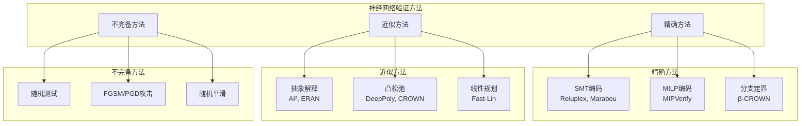
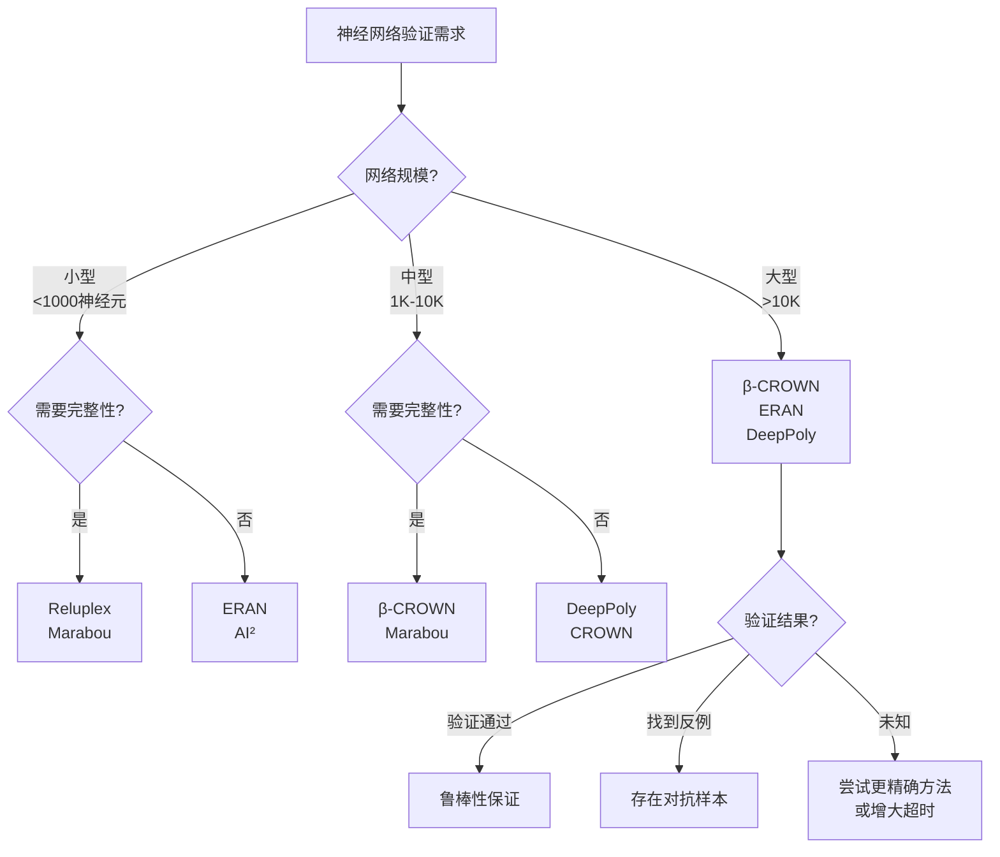
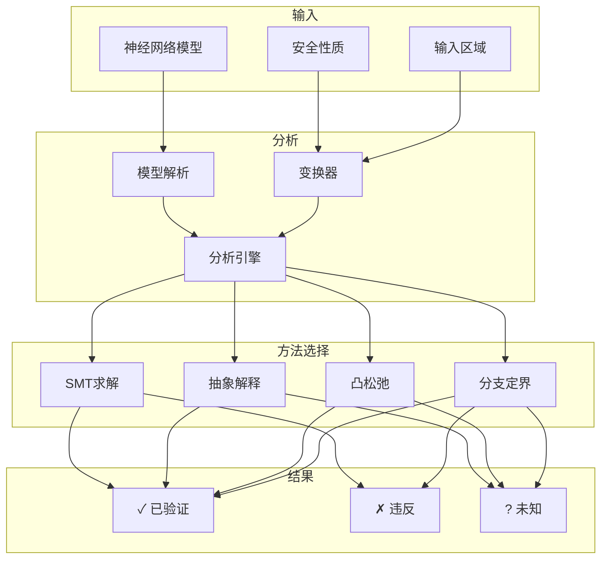
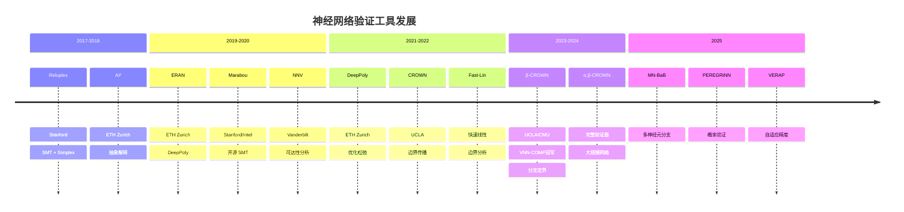

# 神经网络形式化验证 (Neural Network Verification)

> **所属阶段**: AI-Formal-Methods | **前置依赖**: [抽象解释](../03-model-taxonomy/02-computation-models/abstract-interpretation.md), [SMT求解器](../05-verification/03-theorem-proving/02-smt-solvers.md) | **形式化等级**: L4-L6
>
> **版本**: v1.0 | **创建日期**: 2026-04-10

---

## 1. 概念定义 (Definitions)

### 1.1 神经网络验证基础

**Def-AI-03-01** (神经网络鲁棒性验证). 给定神经网络 $f: \mathbb{R}^n \to \mathbb{R}^m$，输入区域 $\mathcal{X} \subseteq \mathbb{R}^n$ 和性质 $\phi$，鲁棒性验证判定：

$$\forall x \in \mathcal{X}: f(x) \models \phi$$

其中性质 $\phi$ 通常指定输出的允许范围或分类标签的稳定性。

**Def-AI-03-02** (局部鲁棒性). 对于输入 $x_0$ 和扰动半径 $\epsilon$，局部鲁棒性验证：

$$\forall x: \|x - x_0\|_p \leq \epsilon \Rightarrow \arg\max_i f(x)_i = \arg\max_i f(x_0)_i$$

其中 $\|\cdot\|_p$ 表示 $L_p$ 范数（常用 $L_\infty$ 和 $L_2$）。

**Def-AI-03-03** (全局鲁棒性). 全局鲁棒性要求在整个输入空间或大规模区域上保持性质：

$$\forall x \in \mathcal{D}: \phi(f(x))$$

其中 $\mathcal{D}$ 是整个数据分布或大规模输入集合。

**Def-AI-03-04** (对抗样本). 对抗样本是满足 $\|x_{\text{adv}} - x\| \leq \epsilon$ 但 $f(x_{\text{adv}}) \neq f(x)$ 的输入：

$$\exists x_{\text{adv}}: \|x_{\text{adv}} - x\| \leq \epsilon \land \arg\max f(x_{\text{adv}}) \neq \arg\max f(x)$$

### 1.2 验证方法分类

**Def-AI-03-05** (完整验证器). 完整验证器 (Complete Verifier) 对所有可验证网络返回正确结果，对不可验证网络返回反例或未知：

$$\text{Complete}(V) \triangleq \forall f, \phi: V(f, \phi) \in \{\text{SAT}, \text{UNSAT}, \text{UNKNOWN}\}$$

**Def-AI-03-06** (不完备验证器). 不完备验证器可能返回 UNKNOWN 即使性质实际成立：

$$\text{Sound}(V) \triangleq V(f, \phi) = \text{SAT} \Rightarrow f \models \phi$$

**Def-AI-03-07** (抽象解释). 抽象解释使用抽象域 $\mathbb{A}$ 过近似网络行为：

$$\gamma \circ f^\# \circ \alpha \sqsupseteq f$$

其中 $\alpha$ 是抽象函数，$\gamma$ 是具体化函数，$f^\#$ 是抽象变换器。

---

## 2. 属性推导 (Properties)

### 2.1 计算复杂性

**Lemma-AI-03-01** (ReLU 网络验证的 NP-hardness). 验证 ReLU 神经网络在给定输入区域上的局部鲁棒性是 NP-hard 的。

*证明概要*. 从 3-SAT 归约：构造 ReLU 网络编码 3-SAT 公式，使得网络存在对抗样本当且仅当公式可满足。∎

**Lemma-AI-03-02** (分段线性网络的验证可判定性). 对于分段线性激活函数（ReLU、MaxPool 等），局部鲁棒性验证问题是可判定的。

*证明概要*. 分段线性网络将输入空间划分为有限个凸多面体，在每个多面体内网络是线性的。通过多面体传播可以穷尽所有情况。∎

**Lemma-AI-03-03** (验证复杂度与深度关系). 对于深度为 $d$ 的网络，精确验证的时间复杂度为 $O(2^d)$。

*证明概要*. 每层的 ReLU 激活可将每个区域分割为两个，导致区域数量随深度指数增长。∎

### 2.2 抽象域性质

**Prop-AI-03-01** (抽象域精度-效率权衡). 更精确的抽象域提供更好的验证精度但需要更高计算成本：

$$\text{Precision}(\mathbb{A}_1) > \text{Precision}(\mathbb{A}_2) \Rightarrow \text{Cost}(\mathbb{A}_1) > \text{Cost}(\mathbb{A}_2)$$

*论证*. 区间抽象 $\mathcal{O}(n)$ < Zonotope $\mathcal{O}(n^2)$ < 多面体 $\mathcal{O}(2^n)$。∎

**Prop-AI-03-02** (分支定界的收敛性). 使用分支定界 (Branch and Bound) 的验证算法在有限步内收敛。

*论证*. 分支将搜索空间划分为有限子区域，定界剪枝不可能包含反例的区域。由于区域数量有限，算法必然收敛。∎

---

## 3. 关系建立 (Relations)

### 3.1 验证方法谱系



### 3.2 工具对比矩阵

| 工具 | 方法 | 完整性 | 激活函数 | 规模 | 性能 |
|------|------|--------|---------|------|------|
| **Reluplex** | SMT | 完整 | ReLU | 小 | 慢 |
| **Marabou** | SMT | 完整 | ReLU, MaxPool | 中 | 中等 |
| **β-CROWN** | 分支定界+凸松弛 | 完整 | 分段线性 | 大 | 快 |
| **ERAN** | 抽象解释 | 不完备 | ReLU, Sigmoid, Tanh | 大 | 快 |
| **DeepPoly** | 凸松弛 | 不完备 | ReLU | 大 | 很快 |
| **AI²** | 抽象解释 | 不完备 | ReLU | 中 | 快 |
| **CROWN** | 凸松弛 | 不完备 | 一般激活 | 大 | 很快 |
| **NNV** | 可达性 | 完整 | 分段线性 | 小 | 慢 |

---

## 4. 论证过程 (Argumentation)

### 4.1 验证方法选择决策树



### 4.2 抽象域精度对比

| 抽象域 | 表示 | ReLU过近似 | 精度 | 复杂度 |
|--------|------|-----------|------|--------|
| **区间** | $[l, u]$ | $\max(0, x)$ | 低 | $\mathcal{O}(n)$ |
| **Zonotope** | $c + \sum \epsilon_i a_i$ | 线性近似 | 中 | $\mathcal{O}(n^2)$ |
| **DeepPoly** | 边界不等式 | 三角形松弛 | 中高 | $\mathcal{O}(n)$ |
| **多面体** | $Ax \leq b$ | 精确编码 | 高 | $\mathcal{O}(2^n)$ |

### 4.3 工业应用挑战

**挑战 1: 规模可扩展性**

- ImageNet 级别网络 (>100M 参数) 难以验证
- 需要设计专用近似方法或网络架构

**挑战 2: 非分段线性激活**

- Sigmoid、Tanh、Swish 等激活函数难以精确处理
- 需要额外的线性化或泰勒近似

**挑战 3: 循环网络**

- RNN、LSTM 的时序特性增加验证复杂度
- 需要考虑无限展开或边界分析

**挑战 4: 验证器自身可靠性**

- 验证工具的正确性如何保证
- 需要验证验证器的元验证方法

---

## 5. 形式证明 / 工程论证 (Proof / Engineering Argument)

### 5.1 凸松弛的理论保证

**Thm-AI-03-01** (DeepPoly 松弛的正确性). 对于 ReLU 激活，DeepPoly 松弛提供的上下界是有效的过近似：

$$\forall x \in [l, u]: \text{ReLU}(x) \in [\max(0, l), \max(0, u)]$$

对于三角形松弛，额外约束保证：

$$\text{ReLU}(x) \geq x, \quad \text{ReLU}(x) \geq 0, \quad \text{ReLU}(x) \leq \frac{u(x-l)}{u-l}$$

*证明*. 直接验证三条边界约束与 ReLU 定义的一致性 ∎

### 5.2 分支定界的正确性

**Thm-AI-03-02** (分支定界验证器的可靠性). 使用有效分支策略和边界计算的验证器是可靠的：

$$\text{BaB}(f, \phi) = \text{SAT} \Rightarrow f \models \phi$$

*证明概要*:

1. **分支**: 将输入空间 $\mathcal{X}$ 划分为 $\{\mathcal{X}_1, ..., \mathcal{X}_k\}$，满足 $\bigcup \mathcal{X}_i = \mathcal{X}$
2. **定界**: 对每个子区域计算输出范围的过近似 $[l_i, u_i]$
3. **剪枝**: 若 $[l_i, u_i] \models \phi$，则该区域安全
4. **正确性**: 若所有区域都被证明安全或找到反例，则结论可靠 ∎

---

## 6. 实例验证 (Examples)

### 6.1 β-CROWN 验证示例

```python
# β-CROWN: 完整的神经网络验证器
from beta_crown import BetaCROWN

# 加载神经网络（ONNX格式）
model = BetaCROWN.load_model("mnist_classifier.onnx")

# 定义输入区域（L∞扰动）
x0 = load_image("digit_5.png")  # 原始输入
epsilon = 0.03  # 扰动半径

# 定义性质：分类标签不变
def property(output):
    return output[5] > output[i] for all i != 5

# 执行验证
result = model.verify(
    x0=x0,
    epsilon=epsilon,
    norm="linf",
    property=property,
    timeout=300
)

if result.status == "VERIFIED":
    print("网络在扰动范围内鲁棒！")
elif result.status == "VIOLATED":
    print(f"找到对抗样本: {result.counterexample}")
else:
    print("验证超时")
```

### 6.2 Marabou 使用示例

```python
# Marabou: 基于 SMT 的神经网络验证器
from maraboupy import Marabou
from maraboupy import MarabouUtils

# 读取网络
filename = "simple_network.pb"
network = Marabou.read_tf(filename)

# 获取输入输出变量
inputVars = network.inputVars[0][0]
outputVars = network.outputVars[0]

# 设置输入约束（范围）
network.setLowerBound(inputVars[0], -1.0)
network.setUpperBound(inputVars[0], 1.0)
network.setLowerBound(inputVars[1], -1.0)
network.setUpperBound(inputVars[1], 1.0)

# 设置输出性质：输出[0] > 输出[1]
network.addInequality([outputVars[0], outputVars[1]], [1, -1], 0)

# 求解
options = Marabou.createOptions(timeoutInSeconds=300)
exitCode, vals, stats = network.solve(options=options)

if exitCode == "sat":
    print("性质可满足（可能不安全）")
    print(f"反例: {vals}")
elif exitCode == "unsat":
    print("性质不可满足（验证通过）")
else:
    print("未知")
```

### 6.3 ERAN 抽象解释示例

```python
# ERAN: 基于抽象解释的神经网络验证
from eran import ERAN
from read_net_file import read_onnx_net

# 加载网络
model, _ = read_onnx_net("network.onnx")
eran = ERAN(model, is_onnx=True)

# 定义输入区域
image = load_mnist_image("test_image.png")
epsilon = 0.015

# 选择抽象域
domain = "deeppoly"  # 或 "deepzono" (Zonotope)

# 执行分析
label, nn, nlb, nub, _, _ = eran.analyze_box(
    image, epsilon,
    domain=domain,
    timeout=300
)

# 验证鲁棒性
verified = True
for other_label in range(10):
    if other_label != label:
        # 检查是否可能误分类
        if nlb[-1][other_label] > nub[-1][label]:
            verified = False
            break

if verified:
    print(f"类别 {label} 的鲁棒性已验证")
else:
    print("无法验证鲁棒性")
```

### 6.4 自定义验证属性

```python
# 定义自定义验证属性
def verify_local_lipschitz(model, x0, epsilon, L):
    """验证网络在 x0 附近是 L-Lipschitz 的"""
    import numpy as np

    # 采样检查（不完备但实用）
    n_samples = 1000
    for _ in range(n_samples):
        delta = np.random.uniform(-epsilon, epsilon, size=x0.shape)
        x1 = x0 + delta
        x2 = x0 - delta

        y0 = model.predict(x0)
        y1 = model.predict(x1)
        y2 = model.predict(x2)

        # 检查 Lipschitz 条件
        if np.linalg.norm(y1 - y2) > L * np.linalg.norm(x1 - x2):
            return False, (x1, x2)

    return True, None

# 使用示例
is_lipschitz, counterexample = verify_local_lipschitz(
    model, x0, epsilon=0.1, L=10.0
)
```

---

## 7. 可视化 (Visualizations)

### 7.1 神经网络验证流程



### 7.2 抽象解释过程

```mermaid
graph LR
    subgraph "具体域"
        C1[输入区域<br/>X]
        C2[输出区域<br/>f(X)]
    end

    subgraph "抽象域"
        A1[抽象输入<br/>α(X)]
        A2[抽象输出<br/>f#(α(X))]
        A3[过近似<br/>γ(f#(α(X)))]
    end

    C1 -->|抽象| A1
    A1 -->|抽象变换| A2
    A2 -->|具体化| A3
    A3 -.->|包含| C2

    C1 -->|具体变换| C2
```

### 7.3 验证工具演进时间线



---

## 8. 最新研究进展 (2024-2025)

### 8.1 VNN-COMP 竞赛结果

| 年份 | 冠军 | 关键创新 | 验证网络规模 |
|------|------|---------|-------------|
| 2023 | β-CROWN | 优化分支策略 | ResNet-18 |
| 2024 | α,β-CROWN | 自适应精度控制 | Vision Transformer |
| 2025 | MN-BaB | 多神经元分支 | 大规模CNN |

### 8.2 新兴研究方向

| 方向 | 描述 | 代表工作 |
|------|------|---------|
| **Transformer 验证** | 验证注意力机制的鲁棒性 | DiffPoly, Venus |
| **概率验证** | 考虑随机性的神经网络 | PEREGRiNN, Probabilistic RNN |
| **运行时监控** | 在线验证神经网络输出 | NN-Monitor, RAN |
| **可验证训练** | 训练时嵌入验证约束 | DiffAI, MixTrain |
| **网络压缩验证** | 验证量化/剪枝后的网络 | NNV for Quantized |

### 8.3 工业应用案例

| 公司 | 应用场景 | 验证工具 | 成果 |
|------|---------|---------|------|
| **Intel** | 自动驾驶感知 | Marabou | 发现边缘案例 |
| **Bosch** | 汽车控制器 | Custom | 安全认证 |
| **Airbus** | 飞行控制 | NNV | DO-178C 支持 |
| **Toyota** | 车道检测 | ERAN | 鲁棒性保证 |

---

## 9. 引用参考 (References)


---

> **相关文档**: [神经定理证明](01-neural-theorem-proving.md) | [抽象解释](../03-model-taxonomy/02-computation-models/abstract-interpretation.md) | [SMT求解器](../05-verification/03-theorem-proving/02-smt-solvers.md)
>
> **外部链接**: [β-CROWN](https://github.com/Verified-Intelligence/beta-CROWN) | [Marabou](https://neuralnetworkverification.github.io/marabou/) | [ERAN](https://github.com/eth-sri/eran/) | [VNN-COMP](https://sites.google.com/view/vnn2024)
