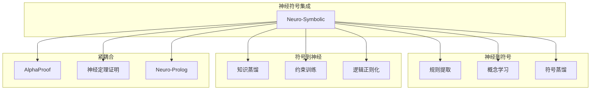
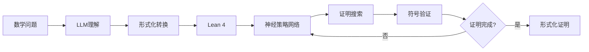
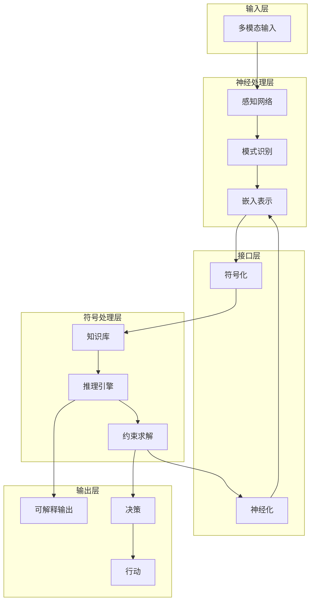
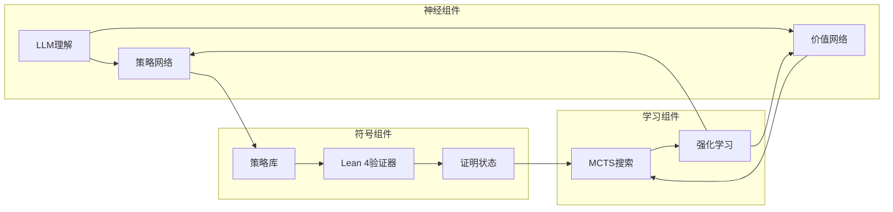

# 神经符号AI (Neuro-Symbolic AI)

> **所属阶段**: AI-Formal-Methods | **前置依赖**: [LLM形式化](02-llm-formalization.md), [神经网络验证](03-neural-network-verification.md) | **形式化等级**: L4
>
> **版本**: v1.0 | **创建日期**: 2026-04-10

---

## 1. 概念定义 (Definitions)

### 1.1 神经符号AI基础

**Def-AI-04-01** (神经符号AI). 神经符号AI是将深度学习（神经网络）与符号推理（逻辑、知识表示）相结合的人工智能范式：

$$\text{Neuro-Symbolic AI} = \langle \mathcal{N}_{\text{neural}}, \mathcal{S}_{\text{symbolic}}, \mathcal{I}_{\text{interface}}, \mathcal{R}_{\text{reasoning}} \rangle$$

其中：

- $\mathcal{N}_{\text{neural}}$: 神经网络组件（感知、模式识别）
- $\mathcal{S}_{\text{symbolic}}$: 符号系统（逻辑推理、知识库）
- $\mathcal{I}_{\text{interface}}$: 神经-符号接口（转换、编码）
- $\mathcal{R}_{\text{reasoning}}$: 混合推理机制

**Def-AI-04-02** (神经-符号集成类型). 根据集成方式，神经符号系统可分为：

| 类型 | 描述 | 方向 | 示例 |
|------|------|------|------|
| **符号到神经** | 符号知识指导神经网络 | Symbolic → Neural | 知识蒸馏、约束训练 |
| **神经到符号** | 从神经网络提取符号知识 | Neural → Symbolic | 规则提取、概念学习 |
| **紧耦合** | 神经和符号交替执行 | Neural ↔ Symbolic | AlphaProof、神经定理证明 |

### 1.2 关键组件

**Def-AI-04-03** (神经-符号接口). 实现神经网络连续表示与符号离散表示之间转换的组件：

$$\text{Encoder}: \mathcal{X}_{\text{symbolic}} \rightarrow \mathbb{R}^d, \quad \text{Decoder}: \mathbb{R}^d \rightarrow \mathcal{X}_{\text{symbolic}}$$

**Def-AI-04-04** (可微分逻辑). 将逻辑运算表示为可微分操作，实现端到端训练：

$$\text{AND}_\text{diff}(a, b) = a \cdot b, \quad \text{OR}_\text{diff}(a, b) = 1 - (1-a)(1-b)$$

**Def-AI-04-05** (神经定理证明器). 使用神经网络指导符号证明搜索的系统：

$$\pi_\theta: \text{ProofState} \rightarrow \text{Distribution(Tactics)}$$

---

## 2. 属性推导 (Properties)

### 2.1 表达能力

**Lemma-AI-04-01** (神经符号系统的表达能力). 神经符号AI的表达能力严格大于纯神经网络或纯符号系统：

$$\text{Expressive}(\text{Neuro-Symbolic}) \supset \text{Expressive}(\text{NN}) \cup \text{Expressive}(\text{Symbolic})$$

*证明概要*. 神经符号系统可以处理需要感知（神经网络擅长）和推理（符号系统擅长）组合的任务。∎

**Lemma-AI-04-02** (可解释性提升). 神经符号系统的决策比纯神经网络更可解释：

$$\text{Interpretability}(\text{Neuro-Symbolic}) > \text{Interpretability}(\text{NN})$$

### 2.2 学习性质

**Prop-AI-04-01** (样本效率). 结合符号先验的神经符号系统具有更高的样本效率：

$$\text{Sample-Efficiency}_{\text{NS}} \geq \text{Sample-Efficiency}_{\text{NN}}$$

*论证*. 符号先验减少了假设空间的大小。∎

---

## 3. 关系建立 (Relations)

### 3.1 神经符号系统谱系



### 3.2 与形式化方法的关系

| 形式化方法 | 神经符号应用 | 协同效应 |
|-----------|-------------|---------|
| 定理证明 | 神经证明策略学习 | 高效搜索+严格验证 |
| 模型检测 | 神经性质预测 | 快速筛选+穷举验证 |
| 程序验证 | 神经不变式推断 | 自动发现+形式证明 |
| 规格合成 | 神经规范生成 | 自然语言→形式化 |

---

## 4. 论证过程 (Argumentation)

### 4.1 设计模式

**模式 1: 神经引导符号搜索**

```
符号搜索空间
    ↓
神经网络评分 → 优先级排序
    ↓
符号系统验证 → 候选验证
    ↓
反馈 → 神经网络更新
```

**模式 2: 符号约束神经训练**

```
符号知识/规则
    ↓
转换为损失函数/约束
    ↓
指导神经网络训练
    ↓
输出满足符号约束的预测
```

**模式 3: 交替推理**

```
输入
    ↓
神经网络 → 模式识别
    ↓
符号系统 → 逻辑推理
    ↓
神经网络 → 模糊匹配
    ↓
输出
```

### 4.2 应用案例分析

**AlphaProof 系统架构**:



**关键设计**:

- LLM: 自然语言理解
- 神经网络: 证明策略预测
- Lean 4: 符号验证
- 强化学习: 策略优化

---

## 5. 形式证明 / 工程论证 (Proof / Engineering Argument)

### 5.1 神经符号正确性

**Thm-AI-04-01** (符号验证的可靠性). 在神经符号系统中，符号验证组件保证最终输出的正确性：

$$\text{Neural-Guess} + \text{Symbolic-Verify} \Rightarrow \text{Correct-Output}$$

*证明概要*:

1. 神经网络生成候选解
2. 符号系统严格验证候选解
3. 仅通过验证的解被输出
4. 因此输出保证正确 ∎

### 5.2 效率-精度权衡

**Thm-AI-04-02** (神经符号效率). 神经符号方法的平均搜索复杂度低于纯符号方法：

$$\mathbb{E}[T_{\text{neuro-symbolic}}] \leq \mathbb{E}[T_{\text{pure-symbolic}}]$$

---

## 6. 实例验证 (Examples)

### 6.1 神经定理证明器

```python
# 神经符号定理证明器概念实现
import torch
import torch.nn as nn

class NeuralProofAssistant:
    def __init__(self, tactic_vocab_size, embedding_dim=256):
        self.encoder = nn.TransformerEncoder(
            nn.TransformerEncoderLayer(embedding_dim, nhead=8),
            num_layers=6
        )
        self.policy_head = nn.Linear(embedding_dim, tactic_vocab_size)
        self.value_head = nn.Linear(embedding_dim, 1)

    def encode_goal(self, goal_tokens):
        """编码证明目标"""
        return self.encoder(goal_tokens)

    def predict_tactic(self, goal_encoding, context):
        """预测下一个证明策略"""
        combined = torch.cat([goal_encoding, context], dim=-1)
        tactic_logits = self.policy_head(combined)
        value = self.value_head(combined)
        return tactic_logits, value

    def prove(self, theorem, max_depth=100):
        """神经符号证明搜索"""
        state = theorem.initial_state()

        for step in range(max_depth):
            # 神经网络预测
            goal_enc = self.encode_goal(state.goal)
            tactic_probs, value = self.predict_tactic(goal_enc, state.context)

            # 采样策略
            tactic_id = torch.multinomial(tactic_probs, 1).item()
            tactic = self.tactic_vocab[tactic_id]

            # 符号系统验证执行
            try:
                new_state = state.apply(tactic)
                if new_state.is_complete():
                    return Proof(new_state, success=True)
                state = new_state
            except InvalidTacticError:
                # 策略无效，继续搜索
                continue

        return Proof(state, success=False)
```

### 6.2 神经-符号知识图谱

```python
# 神经符号知识图谱推理
class NeuroSymbolicKG:
    def __init__(self):
        self.graph = KnowledgeGraph()  # 符号知识图谱
        self.embedder = GraphNeuralNetwork()  # 神经图嵌入

    def query(self, query_pattern):
        """混合推理查询"""
        # 符号推理：精确匹配
        symbolic_results = self.graph.query(query_pattern)

        if symbolic_results:
            return symbolic_results

        # 神经推理：模糊匹配
        query_embedding = self.embedder.encode(query_pattern)
        similar_nodes = self.embedder.find_similar(query_embedding, k=10)

        # 符号验证：过滤
        validated_results = []
        for node in similar_nodes:
            if self.graph.verify(node, query_pattern):
                validated_results.append(node)

        return validated_results

    def learn_rule(self, examples):
        """从示例学习符号规则"""
        # 神经网络学习模式
        pattern = self.embedder.discover_pattern(examples)

        # 转换为符号规则
        symbolic_rule = self.symbolize(pattern)

        # 添加到知识图谱
        self.graph.add_rule(symbolic_rule)

        return symbolic_rule
```

### 6.3 可微分逻辑程序

```python
# 可微分逻辑程序示例
import torch
import torch.nn.functional as F

def soft_and(a, b, temperature=0.1):
    """可微分AND"""
    return torch.sigmoid((torch.log(a + 1e-10) + torch.log(b + 1e-10)) / temperature)

def soft_or(a, b, temperature=0.1):
    """可微分OR"""
    return torch.sigmoid((torch.log(a + 1e-10) + torch.log(1 - b + 1e-10)) / temperature)

def soft_not(a):
    """可微分NOT"""
    return 1 - a

def soft_implies(a, b, temperature=0.1):
    """可微分IMPLIES"""
    return soft_or(soft_not(a), b, temperature)

# 使用可微分逻辑训练神经网络
class LogicalNeuralNet(nn.Module):
    def __init__(self):
        super().__init__()
        self.backbone = nn.Sequential(
            nn.Linear(10, 64),
            nn.ReLU(),
            nn.Linear(64, 3)  # 3个逻辑谓词
        )

    def forward(self, x):
        # 神经网络输出逻辑谓词的概率
        logits = self.backbone(x)
        probs = torch.sigmoid(logits)

        # 应用逻辑约束
        p, q, r = probs[:, 0], probs[:, 1], probs[:, 2]

        # 约束: p AND q -> r
        constraint = soft_implies(soft_and(p, q), r)

        return probs, constraint

    def loss(self, predictions, labels, constraint_weight=0.1):
        # 标准监督损失
        pred_loss = F.binary_cross_entropy(predictions, labels)

        # 逻辑约束损失
        constraint_loss = -torch.log(constraint + 1e-10)

        return pred_loss + constraint_weight * constraint_loss.mean()
```

---

## 7. 可视化 (Visualizations)

### 7.1 神经符号系统架构



### 7.2 AlphaProof 神经符号流程



---

## 8. 最新研究进展 (2024-2025)

### 8.1 重要进展

| 方向 | 工作 | 贡献 |
|------|------|------|
| **神经定理证明** | AlphaProof | IMO银牌，神经+符号+RL |
| **可微分逻辑** | Logic Tensor Networks | 连续逻辑推理 |
| **神经符号规划** | NS-Planner | 任务规划中的神经符号方法 |
| **知识图谱推理** | Neural Theorem Provers | 知识图谱上的神经证明 |

### 8.2 开放问题

1. **可扩展性**: 如何扩展到大规模知识库？
2. **一致性**: 神经组件和符号组件的一致性如何保证？
3. **学习效率**: 如何减少神经符号系统的训练数据需求？
4. **解释性**: 如何生成人类可理解的神经符号推理解释？

---

## 9. 引用参考


---

> **相关文档**: [神经定理证明](01-neural-theorem-proving.md) | [LLM形式化](02-llm-formalization.md)
