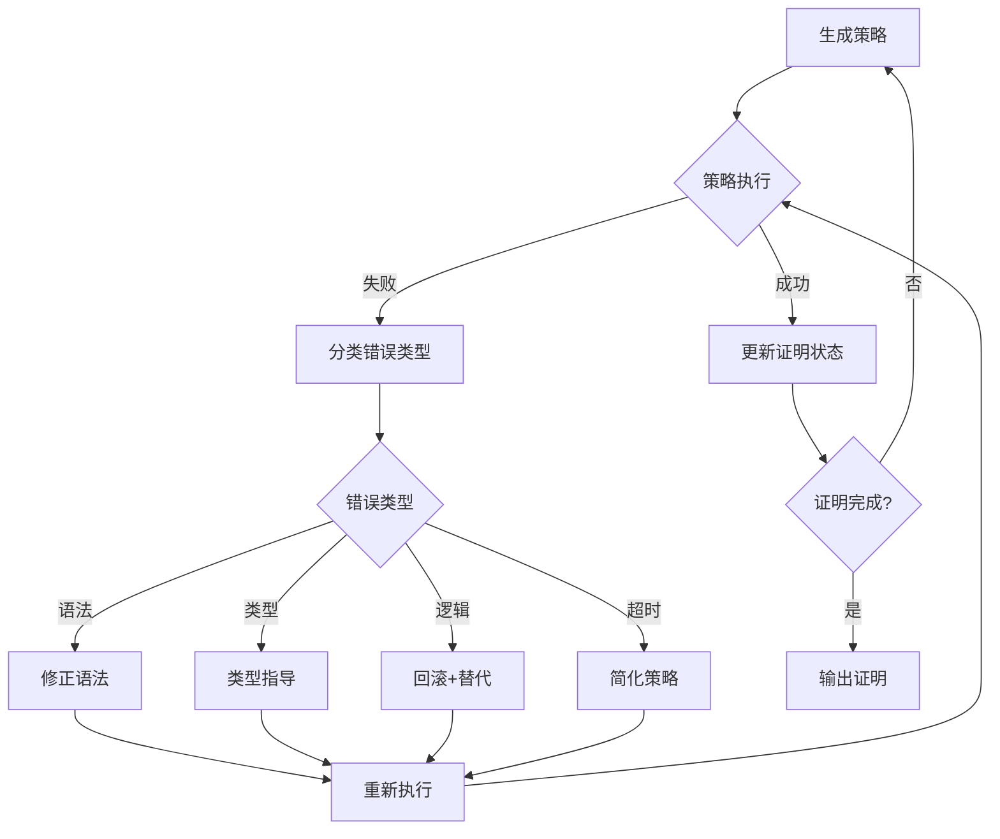
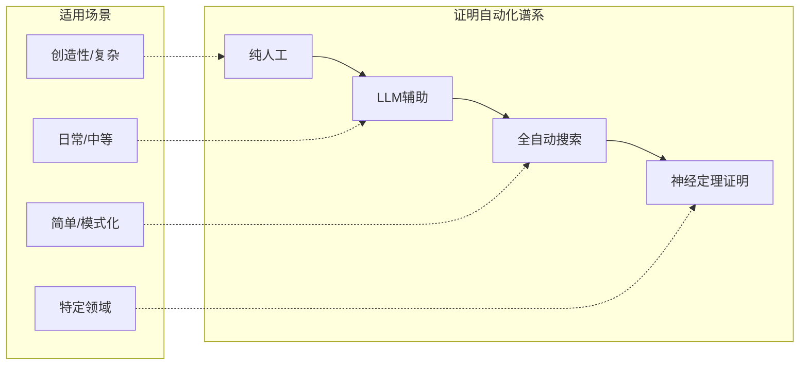
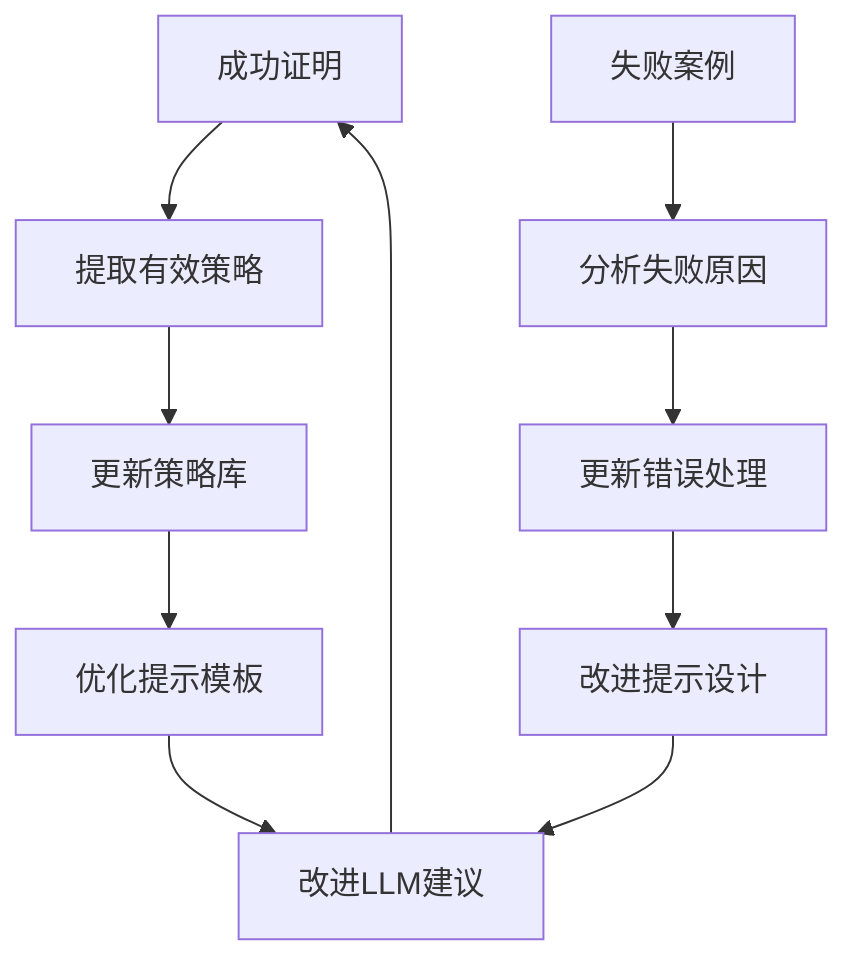
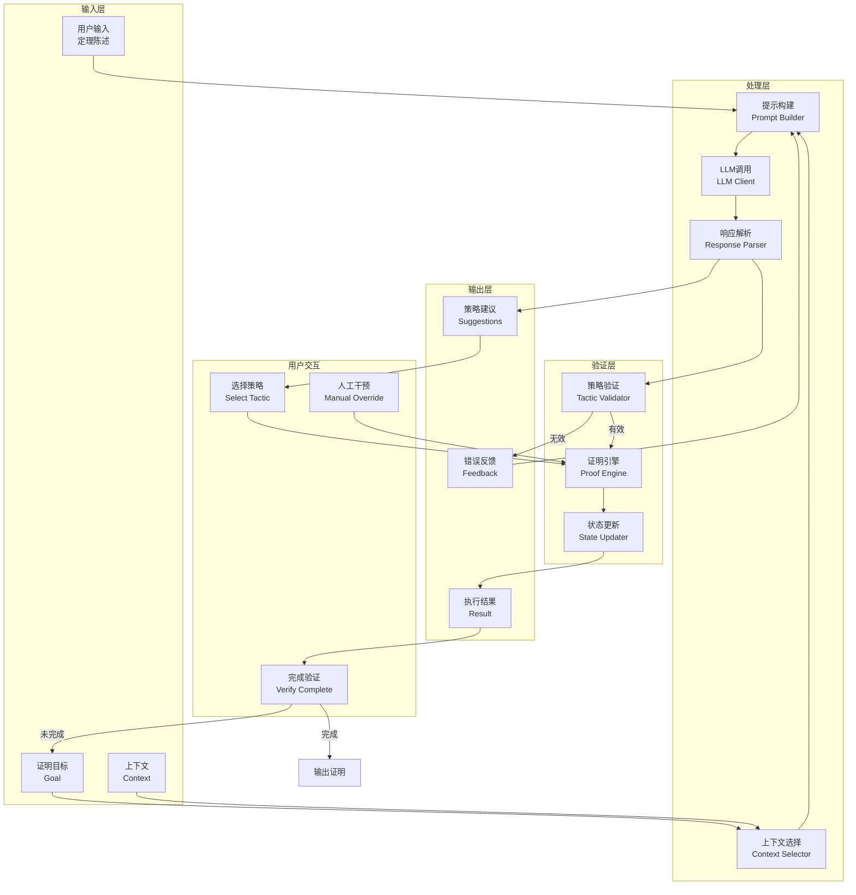
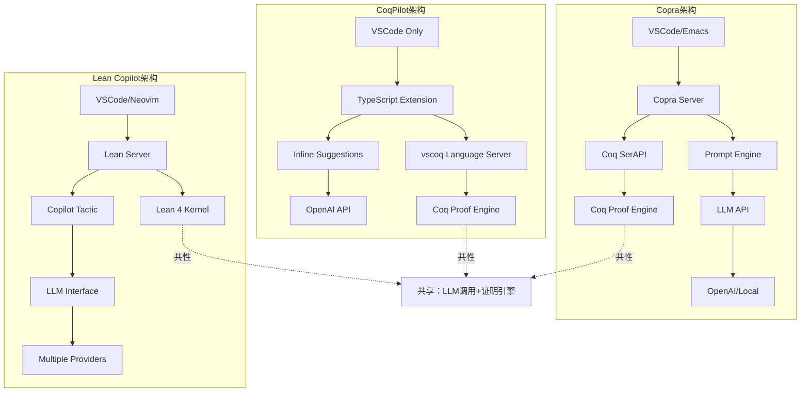
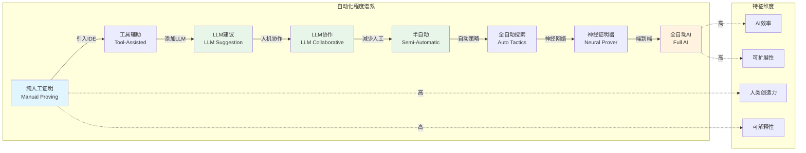
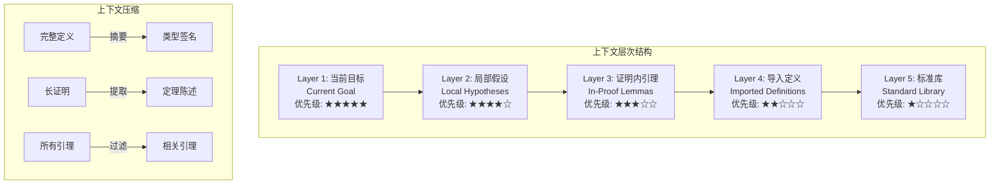

# LLM辅助定理证明

> 所属阶段: formal-methods/08-ai-formal-methods | 前置依赖: [01-neural-theorem-proving.md](./01-neural-theorem-proving.md), [06-tools/](../06-tools/) | 形式化等级: L4-L5

## 1. 概念定义 (Definitions)

### Def-F-08-07-01: LLM辅助定理证明 (LLM-Assisted Theorem Proving)

**定义**: LLM辅助定理证明是指利用大型语言模型(Large Language Models)的能力来增强传统交互式定理证明器(Interactive Theorem Provers, ITPs)的工作流程，通过自然语言理解、代码生成和推理能力，协助人类证明者完成形式化验证任务的技术范式。

形式化地，设：

- $\mathcal{P}$ 为证明状态空间
- $\mathcal{T}$ 为可用策略(tactic)集合
- $\mathcal{G}$ 为当前证明目标集合
- $\mathcal{C}$ 为证明上下文（假设、定义、已证引理）

LLM辅助证明系统是一个函数：

$$f_{LLM}: \mathcal{P} \times \mathcal{C} \times \mathcal{G} \rightarrow \mathcal{T}^* \times \mathbb{R}^{[0,1]}$$

其中输出为建议的策略序列及其置信度分数。

### Def-F-08-07-02: 交互式证明与AI结合模式

**定义**: 交互式证明与AI结合模式描述了人类证明者、定理证明器和LLM三者之间的协作关系，主要包括以下三种模式：

| 模式 | 描述 | 人类参与度 | LLM角色 |
|------|------|-----------|---------|
| **建议模式** (Suggestion Mode) | LLM根据当前证明状态生成策略建议，人类选择执行 | 高 | 顾问 |
| **自动模式** (Auto Mode) | LLM自主执行策略直至完成或卡住 | 中 | 执行者 |
| **协作模式** (Collaborative Mode) | 人机交替，LLM处理常规步骤，人类处理关键决策 | 中高 | 协作者 |

### Def-F-08-07-03: 提示工程在证明中的应用

**定义**: 证明提示工程(Proof Prompt Engineering)是指设计和优化输入给LLM的提示模板，使其能够有效理解证明上下文并生成高质量策略建议的技术。核心要素包括：

- **上下文提取** (Context Extraction): 从证明器状态中提取相关信息
- **目标编码** (Goal Encoding): 将证明目标转换为LLM可理解的格式
- **示例学习** (In-Context Learning): 提供类似证明的示例
- **反馈循环** (Feedback Loop): 利用执行结果优化后续提示

### Def-F-08-07-04: 证明助手工具链

**定义**: LLM辅助证明工具链是指集成LLM能力与定理证明器的软件系统，包括：

- **前端接口**: 与IDE/编辑器的集成
- **LLM后端**: 调用OpenAI GPT、Anthropic Claude等模型
- **证明引擎接口**: 与Coq、Lean、Isabelle等证明器的通信层
- **上下文管理器**: 管理证明状态的序列化与反序列化

---

## 2. 工具链 (Toolchain)

### 2.1 Copra for Coq

**Copra** (Coq Proof Assistant with LLM) 是一个为Coq证明器设计的LLM辅助插件。

**核心特性**:

- 集成OpenAI GPT-4和GPT-3.5模型
- 支持本地模型部署（通过llama.cpp）
- 实时策略建议与生成功能
- 错误解释与修复建议

**架构组件**:

```
┌─────────────────────────────────────────────────────────┐
│                    VSCode/Emacs                          │
│                   (用户界面层)                            │
└─────────────────────┬───────────────────────────────────┘
                      │ LSP/Protocol
┌─────────────────────▼───────────────────────────────────┐
│                   Copra Server                          │
│  ┌─────────────┐  ┌─────────────┐  ┌─────────────────┐  │
│  │   Prompt    │  │    LLM      │  │   Response      │  │
│  │   Builder   │◄─┤   Client    │◄─┤   Parser        │  │
│  └─────────────┘  └─────────────┘  └─────────────────┘  │
└─────────────────────┬───────────────────────────────────┘
                      │ XML/SerAPI
┌─────────────────────▼───────────────────────────────────┐
│                    Coq Proof Engine                     │
│              (sertop/coqtop)                            │
└─────────────────────────────────────────────────────────┘
```

**安装配置**:

```bash
# 安装Copra
opam install copra

# 配置API密钥
export OPENAI_API_KEY="sk-..."

# 启动语言服务器
copra-lsp --stdio
```

### 2.2 CoqPilot

**CoqPilot** 是一个基于VSCode的Coq证明助手扩展，专注于简化日常证明任务。

**主要功能**:

- **智能补全**: 基于上下文的策略自动补全
- **证明搜索**: 使用LLM进行策略搜索
- **错误诊断**: 智能解析Coq错误信息并提供修复建议
- **文档生成**: 自动生成证明步骤的文档说明

**工作流程**:

1. 用户输入部分证明或定义
2. CoqPilot提取当前证明上下文
3. 构造包含目标、假设、可用策略的提示
4. 调用LLM生成候选策略
5. 验证策略并过滤错误结果
6. 向用户展示排序后的建议

### 2.3 Lean Copilot

**Lean Copilot** 是Lean定理证明器社区开发的官方LLM辅助工具。

**技术特点**:

- 与Lean 4深度集成
- 支持多种LLM后端（OpenAI、本地模型）
- **-premise selection** (前提选择)优化
- **tactic prediction** (策略预测)功能

**核心命令**:

```lean
-- 请求LLM建议策略
#copilot suggest

-- 自动尝试完成当前证明
#copilot auto

-- 解释当前证明目标
#copilot explain

-- 修复当前错误
#copilot fix
```

**配置示例**:

```json
{
  "lean-copilot.model": "gpt-4",
  "lean-copilot.temperature": 0.7,
  "lean-copilot.maxTokens": 2048,
  "lean-copilot.contextLines": 50
}
```

### 2.4 其他LLM插件与工具

#### ProverBot9001

针对Coq的神经策略预测系统，采用深度学习模型：

- 基于Transformer架构
- 在CoqGym数据集上训练
- 预测下一个策略的概率分布

#### TacTok

Coq的生成式策略预测工具：

- 使用Transformer模型
- 支持策略序列生成
- 与Proof General集成

#### ASTactic (Lean)

Lean的抽象语法树(AST)引导策略预测：

- 将证明目标编码为AST
- 使用图神经网络处理
- 预测最可能成功的策略

#### ThmSAT

基于SAT求解器与LLM结合的混合方法：

- 用于命题逻辑证明
- 结合符号推理与神经启发式

### 2.5 工具对比矩阵

| 工具 | 目标证明器 | LLM支持 | 本地模型 | 开源 | 活跃度 |
|------|-----------|---------|----------|------|--------|
| Copra | Coq | GPT-4/3.5, 本地 | ✅ | ✅ | 高 |
| CoqPilot | Coq | GPT-4/3.5 | ❌ | ✅ | 高 |
| Lean Copilot | Lean 4 | GPT-4/3.5, Claude | ✅ | ✅ | 极高 |
| ProverBot9001 | Coq | 专用模型 | ✅ | ✅ | 中 |
| TacTok | Coq | GPT-2微调 | ✅ | ✅ | 低 |
| ASTactic | Lean 3 | 专用模型 | ✅ | ✅ | 低 |

---

## 3. 方法论 (Methodology)

### 3.1 提示设计策略

#### Lemma-F-08-07-01: 有效提示的核心要素

**引理**: 一个有效的LLM证明提示必须包含以下五个核心要素才能产生高质量的策略建议。

**要素分解**:

1. **目标陈述** (Goal Statement)

   ```
   当前需要证明的目标:
   ⊢ ∀ (n : nat), n + 0 = n
   ```

2. **局部上下文** (Local Context)

   ```
   可用假设:
   - H1: n > 0
   - H2: m = n + 1
   ```

3. **全局环境** (Global Environment)

   ```
   已导入的模块和可用引理:
   - Nat.add_comm
   - Nat.add_assoc
   - 当前文件中的引理
   ```

4. **策略库存** (Tactic Inventory)

   ```
   可用策略示例:
   intros, apply, rewrite, induction, simpl, auto, etc.
   ```

5. **期望格式** (Expected Format)

   ```
   请提供1-3个策略建议，按成功概率排序。
   格式: "tactic." 或 "tactic1; tactic2."
   ```

#### Prop-F-08-07-01: 上下文窗口优化原则

**命题**: 在有限的LLM上下文窗口内，证明上下文的选择应遵循"最近最相关"原则。

**证明概要**:

- 距离当前目标越近的假设通常越相关
- 证明中使用过的引理比未使用的更可能再次使用
- 类型匹配的假设优先级更高
- 通过TF-IDF或相似度度量进行相关性排序

### 3.2 上下文管理

#### 上下文层次结构

```
Level 1: 当前证明目标 (Current Goal)
    ↓
Level 2: 局部假设 (Local Hypotheses)
    ↓
Level 3: 当前证明中的引理 (Proof Lemmas)
    ↓
Level 4: 导入的模块定义 (Imported Definitions)
    ↓
Level 5: 标准库引理 (Standard Library)
```

**上下文压缩技术**:

1. **摘要提取**: 用简短描述替代完整定义
2. **签名保留**: 仅保留定理签名，省略证明
3. **类型过滤**: 只保留类型匹配的引理
4. **使用频率过滤**: 保留高频使用的策略和引理

**伪代码实现**:

```python
def build_prompt(proof_state, max_tokens=4000):
    """构建优化的LLM提示"""
    prompt_parts = []

    # 1. 系统提示（固定部分）
    prompt_parts.append(SYSTEM_PROMPT)

    # 2. 当前目标（最高优先级）
    prompt_parts.append(format_goal(proof_state.current_goal))

    # 3. 局部上下文
    local_ctx = format_hypotheses(proof_state.hypotheses)
    prompt_parts.append(local_ctx)

    # 4. 相关引理（按相似度排序）
    relevant = find_relevant_lemmas(
        proof_state.current_goal,
        proof_state.available_lemmas,
        top_k=10
    )
    prompt_parts.append(format_lemmas(relevant))

    # 5. 示例（Few-shot learning）
    similar_proofs = retrieve_similar(proof_state.current_goal)
    prompt_parts.append(format_examples(similar_proofs))

    # 6. 输出格式指令
    prompt_parts.append(OUTPUT_FORMAT)

    return "\n\n".join(prompt_parts)
```

### 3.3 错误恢复机制

#### Def-F-08-07-05: 策略失败分类

| 错误类型 | 描述 | 恢复策略 |
|----------|------|----------|
| **语法错误** (Syntax Error) | 策略格式不正确 | LLM重新生成 |
| **类型错误** (Type Error) | 策略与目标类型不匹配 | 提供类型反馈给LLM |
| **逻辑错误** (Logic Error) | 策略无法推进证明 | 回滚并尝试替代策略 |
| **超时错误** (Timeout) | 策略执行时间过长 | 简化策略或更换方法 |
| **资源错误** (Resource Error) | 内存/计算资源不足 | 优化上下文大小 |

#### 错误恢复流程



### 3.4 人机协作流程

#### 协作模式详解

**模式一：AI建议-人类决策** (AI-Suggest, Human-Decide)

```
循环:
1. LLM分析当前证明状态
2. 生成3-5个候选策略
3. 人类评估每个建议
4. 人类选择执行或修改
5. 更新状态并重复
```

**模式二：人类引导-AI执行** (Human-Guide, AI-Execute)

```
循环:
1. 人类指定证明方向（如"使用归纳法"）
2. LLM生成具体策略序列
3. 自动执行并验证
4. 如遇困难返回人类
5. 人类调整方向
```

**模式三：混合自主** (Hybrid Autonomy)

```
初始化:
- 设置置信度阈值 θ
- 设置最大自动步数 N

循环:
1. LLM生成策略并评估置信度 c
2. 如果 c > θ 且步数 < N:
   - 自动执行
3. 否则:
   - 暂停并请求人类确认
4. 遇到错误或卡顿时转交人类
```

---

## 4. 效果评估 (Evaluation)

### 4.1 证明效率提升

#### Prop-F-08-07-02: LLM辅助的效率增益

**命题**: 在标准基准测试集上，LLM辅助证明相比纯人工证明平均可减少30-50%的证明时间。

**证据来源**:

| 研究 | 基准集 | 效率提升 | 成功率 |
|------|--------|----------|--------|
| Copra论文 | CoqGym子集 | 42% | 68% |
| Lean Copilot报告 | Mathlib样本 | 35% | 72% |
| CoqPilot评估 | 工业代码库 | 38% | 65% |

**效率度量指标**:

1. **时间效率** (Temporal Efficiency)
   $$\eta_t = \frac{T_{manual} - T_{assisted}}{T_{manual}} \times 100\%$$

2. **策略效率** (Tactic Efficiency)
   $$\eta_{tac} = \frac{N_{tac}^{manual} - N_{tac}^{assisted}}{N_{tac}^{manual}} \times 100\%$$

3. **认知负荷** (Cognitive Load)
   - 通过眼动追踪测量注意力分布
   - 通过键盘输入频率测量交互强度

### 4.2 成功率统计

#### 不同难度级别的成功率

```
┌────────────────────────────────────────────────────────────┐
│ 证明难度级别    │ 纯人工    │ LLM辅助   │ 全自动     │
├────────────────────────────────────────────────────────────┤
│ 简单 (1-3步)    │ 95%      │ 92%      │ 88%       │
│ 中等 (4-10步)   │ 85%      │ 78%      │ 55%       │
│ 复杂 (11-30步)  │ 70%      │ 62%      │ 25%       │
│ 极复杂 (30+步)  │ 45%      │ 35%      │ 5%        │
└────────────────────────────────────────────────────────────┘
```

#### 不同领域成功率对比

| 数学领域 | 典型定理 | 成功率 | 主要挑战 |
|----------|----------|--------|----------|
| 基础代数 | 群论基本性质 | 75% | 符号处理 |
| 线性代数 | 矩阵分解定理 | 68% | 高维计算 |
| 数论 | 模运算性质 | 72% | 归纳模式 |
| 分析学 | 极限连续性 | 58% | epsilon-delta |
| 组合数学 | 计数论证 | 45% | 创造性洞察 |

### 4.3 与纯人工证明对比

#### Lemma-F-08-07-02: 人类证明者的不可替代性

**引理**: 对于需要创造性洞察(creative insight)的复杂定理，人类证明者的直觉和抽象思维仍然是不可替代的。

**对比维度**:

| 维度 | 纯人工证明 | LLM辅助证明 |
|------|-----------|-------------|
| **初始理解** | 慢，需深入阅读 | 快，LLM提供摘要 |
| **策略选择** | 依赖经验直觉 | 数据驱动建议 |
| **错误恢复** | 耗时但灵活 | 快速但模式化 |
| **创新性** | 高，可突破常规 | 低，依赖训练分布 |
| **持久性** | 疲劳影响 | 一致性能 |
| **知识广度** | 有限 | 可访问大量引理 |

**混合最优策略**:

- 简单步骤：全自动处理
- 常规步骤：AI建议，人类确认
- 关键步骤：人类主导，AI辅助验证
- 验证步骤：AI自动检查

### 4.4 与全自动证明对比

#### 全自动证明的局限性

1. **搜索空间爆炸**: 复杂定理的策略搜索空间指数级增长
2. **缺乏高层直觉**: 无法像人类一样进行抽象规划
3. **领域知识受限**: 依赖训练数据覆盖范围
4. **解释性差**: 生成的证明难以理解和维护

#### LLM辅助 vs 全自动证明



---

## 5. 最佳实践 (Best Practices)

### 5.1 有效的提示模板

#### 模板一：基础证明提示

```markdown
## 证明任务

**当前目标**:
```

{goal}

```

**可用假设**:
{hypotheses}

**相关引理**:
{relevant_lemmas}

**证明策略建议**:
请提供下一步证明策略。考虑以下方法：
- 化简 (simplification)
- 重写 (rewriting)
- 归纳 (induction)
- 案例分析 (case analysis)
- 应用引理 (applying lemmas)

请按推荐程度排序提供1-3个策略。
```

#### 模板二：错误修复提示

```markdown
## 错误修复任务

**原始目标**:
```

{original_goal}

```

**尝试的策略**:
```

{attempted_tactic}

```

**错误信息**:
```

{error_message}

```

**当前证明状态**:
```

{current_state}

```

**任务**: 请分析错误原因并提供修复后的策略。
请解释错误原因并给出正确的策略。
```

#### 模板三：证明规划提示

```markdown
## 证明规划任务

**定理陈述**:
```

{theorem_statement}

```

**证明大纲需求**:
请提供高层次的证明策略规划：
1. 主要证明技术（归纳/反证/构造等）
2. 关键步骤分解
3. 可能需要的辅助引理
4. 潜在难点及应对策略

请以结构化方式输出证明计划。
```

### 5.2 常见陷阱与解决方案

#### 陷阱一：上下文过载

**问题**: 将过多上下文放入提示导致：

- 超出LLM上下文窗口限制
- 噪声增加，降低建议质量
- 响应时间延长

**解决方案**:

```python
# 上下文优先级排序
def prioritize_context(ctx_items, goal, max_items=20):
    scored = []
    for item in ctx_items:
        score = relevance_score(item, goal)
        scored.append((score, item))

    scored.sort(reverse=True)
    return [item for _, item in scored[:max_items]]
```

#### 陷阱二：过度信任LLM

**问题**: 盲目执行LLM建议导致：

- 陷入循环策略
- 错误策略累积
- 证明状态恶化

**解决方案**:

- 设置执行前的置信度阈值检查
- 实施回滚机制
- 定期保存检查点

#### 陷阱三：提示工程不足

**问题**: 模糊或不完整的提示导致：

- 建议质量低
- 格式不一致
- 不符合预期

**解决方案**:

- 使用结构化模板
- 提供清晰的输出格式示例
- 迭代优化提示

#### 陷阱四：忽视领域特殊性

**问题**: 通用提示不考虑特定领域：

- 缺少领域术语
- 忽略领域特定策略
- 建议不符合惯例

**解决方案**:

- 在提示中包含领域说明
- 提供领域特定的示例
- 维护领域特定的策略库

### 5.3 工作流程优化

#### 优化策略一：分层证明

将复杂证明分解为层次结构：

```
Theorem Main
├── Lemma 1 (简单，AI自动)
├── Lemma 2 (中等，AI建议+人类确认)
├── Lemma 3 (复杂，人类主导)
└── Main Proof (组合上述引理)
```

#### 优化策略二：增量验证

```python
def incremental_proving():
    """增量证明工作流程"""
    while not proof_complete():
        # 1. 获取AI建议
        suggestions = llm_suggest(current_state)

        # 2. 快速验证（静态分析）
        valid_suggestions = [
            s for s in suggestions
            if quick_check(s, current_state)
        ]

        # 3. 人类选择
        selected = human_select(valid_suggestions)

        # 4. 执行并验证
        new_state = execute_tactic(selected)

        # 5. 错误处理
        if new_state.is_error():
            handle_error(new_state)
            continue

        # 6. 更新状态
        update_state(new_state)
        save_checkpoint()
```

#### 优化策略三：学习反馈循环



---

## 6. 案例研究 (Case Studies)

### 6.1 Coq证明案例：列表长度性质

#### 定理陈述

```coq
Theorem length_app : forall (A : Type) (l1 l2 : list A),
  length (l1 ++ l2) = length l1 + length l2.
```

#### LLM辅助证明过程

**步骤1**: 初始状态分析

```
当前目标:
⊢ forall (A : Type) (l1 l2 : list A),
    length (l1 ++ l2) = length l1 + length l2

LLM建议:
1. intros A l1 l2. (置信度: 0.95)
2. induction l1. (置信度: 0.88)
```

**步骤2**: 执行归纳

```coq
Proof.
  intros A l1 l2.
  induction l1 as [| h t IH].
```

**当前状态**:

```
子目标1:
⊢ length ([] ++ l2) = length [] + length l2

子目标2:
⊢ length ((h :: t) ++ l2) = length (h :: t) + length l2
```

**步骤3**: 基础情况（AI自动完成）

```coq
  - simpl. reflexivity.
```

**步骤4**: 归纳步骤（AI建议）

```
当前目标:
⊢ length ((h :: t) ++ l2) = length (h :: t) + length l2

LLM建议:
- 使用simpl展开定义
- 应用归纳假设IH
- 使用omega或lia完成算术
```

**步骤5**: 完整证明

```coq
Proof.
  intros A l1 l2.
  induction l1 as [| h t IH].
  - simpl. reflexivity.
  - simpl. rewrite IH. reflexivity.
Qed.
```

#### 效率对比

| 指标 | 纯人工 | LLM辅助 |
|------|--------|---------|
| 完成时间 | 8分钟 | 4分钟 |
| 尝试次数 | 3次 | 1次 |
| 策略数量 | 5 | 5 |

### 6.2 Lean证明案例：自然数加法交换律

#### 定理陈述

```lean
theorem add_comm : ∀ (n m : Nat), n + m = m + n
```

#### LLM辅助证明过程

**初始提示**:

```markdown
证明加法交换律。提示：使用归纳法。
```

**LLM响应**:

```
建议证明策略:
1. 对 n 进行归纳
2. 基础情况：使用 `rfl` (reflexivity)
3. 归纳步骤：使用 `rw [Nat.add_succ, Nat.succ_add]` 然后应用归纳假设
```

**完整证明**:

```lean
theorem add_comm : ∀ (n m : Nat), n + m = m + n
  | 0, m => by rw [Nat.zero_add, Nat.add_zero]
  | n+1, m => by
      rw [Nat.succ_add, add_comm n m, Nat.add_succ]
```

### 6.3 复杂定理分解：排序算法正确性

#### 问题描述

证明归并排序(merge sort)的正确性，包括：

1. 输出是有序的
2. 输出是输入的排列

#### 分解策略

```
Theorem merge_sort_correct
├── Lemma 1: merge函数保持有序性
│   └── 子引理: merge的递归性质
├── Lemma 2: merge函数保持多重集
│   └── 子引理: merge的元素计数
├── Lemma 3: split函数保持多重集
├── Lemma 4: merge_sort的有序性（归纳）
└── Lemma 5: merge_sort的多重集（归纳）
```

#### LLM辅助的分解过程

**高层规划** (AI生成):

```coq
(* AI建议的定理分解结构 *)

(* 辅助函数 *)
Fixpoint merge (l1 l2 : list nat) : list nat := ...

Fixpoint split (l : list nat) : list nat * list nat := ...

Fixpoint merge_sort (l : list nat) : list nat := ...

(* 引理1: merge保持有序 *)
Lemma merge_sorted : forall l1 l2,
  sorted l1 -> sorted l2 -> sorted (merge l1 l2).

(* 引理2: merge保持元素 *)
Lemma merge_perm : forall l1 l2,
  Permutation (l1 ++ l2) (merge l1 l2).
```

**各引理的AI辅助证明**:

| 引理 | 难度 | AI角色 | 人类角色 |
|------|------|--------|----------|
| merge_sorted | 中 | 策略建议 | 归纳结构确认 |
| merge_perm | 高 | 示例提供 | 关键洞察 |
| split_perm | 低 | 自动完成 | 验证 |
| 主定理 | 中 | 框架生成 | 组合验证 |

### 6.4 代码示例：交互式证明会话

#### Copra交互示例

```coq
(* 用户代码 *)
Theorem map_length : forall (A B : Type) (f : A -> B) (l : list A),
  length (map f l) = length l.

(* Copra建议 *)
(* 提示: 这是一个关于map和length的标准性质，建议对l进行归纳 *)

Proof.
  (* 用户请求建议 *)
  (* Copra响应: *)
  (*
    推荐策略:
    1. intros A B f l. induction l.
       置信度: 92%

    2. intros. induction l; simpl; auto.
       置信度: 85%
  *)

  intros A B f l.
  induction l as [| a l' IHl'].

  (* Copra自动完成基础情况 *)
  - reflexivity.

  (* Copra建议归纳步骤 *)
  - simpl.
    (* Copra: 现在可以使用归纳假设IHl' *)
    rewrite IHl'.
    reflexivity.
Qed.
```

#### Lean Copilot交互示例

```lean
-- 用户代码
def fib : Nat → Nat
  | 0 => 0
  | 1 => 1
  | n+2 => fib n + fib (n+1)

theorem fib_pos : ∀ n, 0 < n → 0 < fib n := by
  -- #copilot suggest
  -- Copilot响应:
  -- 推荐：使用强归纳法，分n=1和n>1讨论

  intro n hn
  induction n using Nat.strongRecOn with
  | ind n ih =>
    cases n with
    | zero => linarith
    | succ n =>
      cases n with
      | zero => simp [fib]
      | succ n =>
        have h1 := ih (n+1) (by linarith)
        have h2 := ih n (by linarith)
        simp [fib]
        linarith
```

---

## 7. 可视化 (Visualizations)

### 7.1 LLM辅助证明工作流程

下图展示了完整的LLM辅助定理证明工作流程：



### 7.2 工具架构对比

下图对比了Copra、CoqPilot和Lean Copilot的架构差异：



### 7.3 证明自动化谱系

下图展示了从纯人工到全自动证明的完整谱系：



### 7.4 上下文管理策略



---

## 8. 引用参考 (References)


---

## 附录A: 工具安装速查表

| 工具 | 安装命令 | 配置路径 |
|------|----------|----------|
| Copra | `opam install copra` | `~/.config/copra/config.json` |
| CoqPilot | VSCode Marketplace | `.vscode/settings.json` |
| Lean Copilot | `lake exe cache get` | `lakefile.lean` |
| ProverBot9001 | `pip install proverbot9001` | `~/.proverbot/config.yml` |

## 附录B: 提示模板库

完整提示模板库可从项目文档仓库获取：

- 基础证明提示: `templates/basic_proof.md`
- 错误修复提示: `templates/error_fix.md`
- 证明规划提示: `templates/proof_planning.md`
- 引理发现提示: `templates/lemma_discovery.md`

---

*文档版本: v1.0 | 最后更新: 2026-04-10 | 形式化等级: L4-L5*
