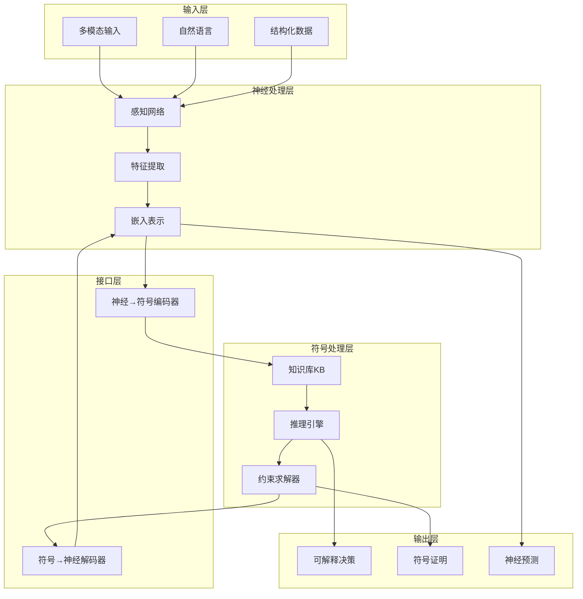
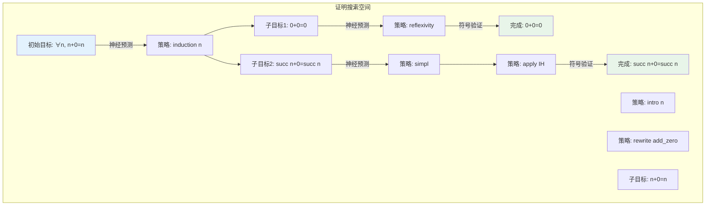
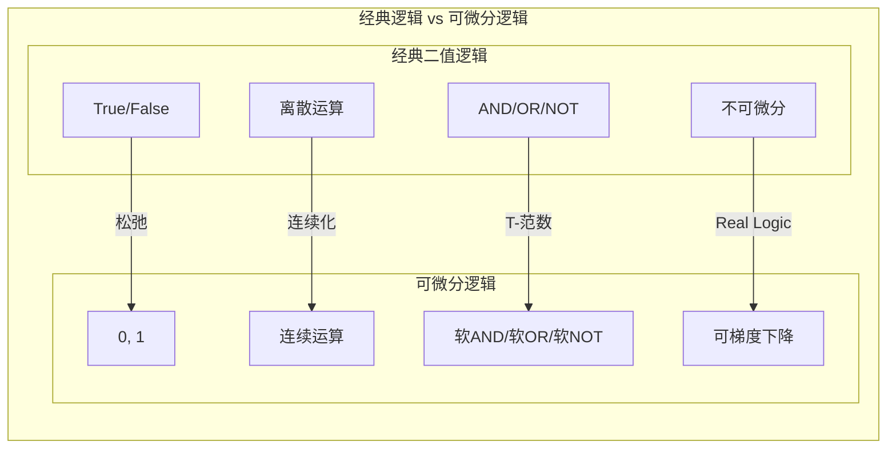
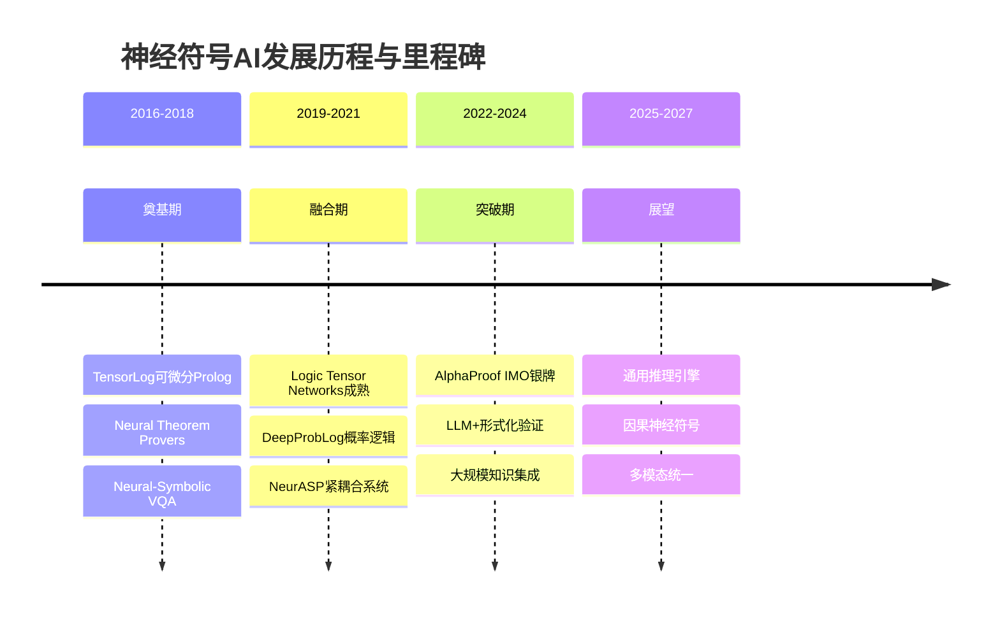
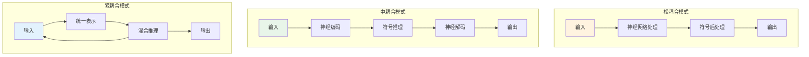

# 神经符号AI：深度理论与实践 (Neuro-Symbolic AI: Deep Theory and Practice)

> **所属阶段**: AI-Formal-Methods | **前置依赖**: [神经定理证明](01-neural-theorem-proving.md), [LLM形式化](02-llm-formalization.md) | **形式化等级**: L4-L5
>
> **版本**: v2.0 | **创建日期**: 2026-04-10

---

## 1. 概念定义 (Definitions)

### 1.1 神经符号AI概述

**Def-AI-08-01** (神经符号AI). 神经符号AI(Neuro-Symbolic AI, NSAI)是将神经网络的学习能力与符号系统的推理能力相结合的人工智能范式，旨在融合连接主义的感知学习优势与符号主义的逻辑推理优势：

$$
\text{NSAI} := \langle \mathcal{N}, \mathcal{S}, \mathcal{I}, \mathcal{R}, \mathcal{L} \rangle
$$

其中：

- $\mathcal{N}$: 神经网络组件(感知、特征提取、模式识别)
- $\mathcal{S}$: 符号系统(逻辑规则、知识表示、推理引擎)
- $\mathcal{I}$: 神经-符号接口(编码器、解码器、双向转换)
- $\mathcal{R}$: 推理机制(混合推理、交替推理、协同推理)
- $\mathcal{L}$: 学习机制(端到端训练、符号引导学习)

**Def-AI-08-02** (神经符号连续谱). 神经符号系统存在于纯神经网络到纯符号系统的连续谱上：

$$
\text{Spectrum}: \underbrace{\text{Pure Neural}}_{\text{深度学习}} \longleftrightarrow \underbrace{\text{Neural-Symbolic}}_{\text{混合系统}} \longleftrightarrow \underbrace{\text{Pure Symbolic}}_{\text{逻辑推理}}
$$

根据集成深度，可分为三类：

| 类型 | 特征 | 神经组件 | 符号组件 | 代表系统 |
|------|------|----------|----------|----------|
| **松耦合** | 管道式集成 | 预处理/后处理 | 核心推理 | 传统专家系统+神经网络 |
| **中耦合** | 交替执行 | 感知/生成 | 推理/验证 | AlphaProof、神经定理证明器 |
| **紧耦合** | 统一表示 | 可微分逻辑 | 神经化符号 | Logic Tensor Networks、NeurASP |

### 1.2 连接主义与符号主义结合

**Def-AI-08-03** (连接主义). 连接主义(Connectionism)基于人工神经网络，通过分布式表示和并行计算实现学习：

$$
\text{Connectionist}(x) = f_L \circ f_{L-1} \circ \cdots \circ f_1(x; \theta)
$$

其中 $f_i(x) = \sigma(W_i x + b_i)$ 为第 $i$ 层变换，$\theta = \{W_i, b_i\}_{i=1}^L$ 为可学习参数。

**Def-AI-08-04** (符号主义). 符号主义(Symbolicism)基于离散符号操作，通过逻辑规则和知识库进行推理：

$$
\text{Symbolic}(KB, q) = \begin{cases} \text{True} & \text{if } KB \vdash q \\ \text{False} & \text{if } KB \vdash \neg q \\ \text{Unknown} & \text{otherwise} \end{cases}
$$

**Def-AI-08-05** (神经-符号鸿沟). 连接主义与符号主义之间存在根本性差异，构成神经-符号鸿沟：

| 维度 | 连接主义 | 符号主义 |
|------|----------|----------|
| **表示** | 连续向量 | 离散符号 |
| **推理** | 模式匹配 | 逻辑演绎 |
| **学习** | 梯度下降 | 逻辑归纳 |
| **解释** | 黑盒 | 白盒 |
| **泛化** | 统计泛化 | 逻辑泛化 |
| **知识** | 隐式编码 | 显式表示 |

**神经-符号桥接原理**：

$$
\text{Bridge}: \mathcal{X}_{\text{symbolic}} \underset{\text{Encoder}}{\longrightarrow} \mathbb{R}^d \underset{\text{Neural Processing}}{\longrightarrow} \mathbb{R}^{d'} \underset{\text{Decoder}}{\longrightarrow} \mathcal{X}'_{\text{symbolic}}
$$

### 1.3 神经定理证明

**Def-AI-08-06** (神经定理证明器). 神经定理证明器(Neural Theorem Prover, NTP)使用神经网络指导符号证明搜索的系统：

$$
\pi_\theta: \underbrace{\text{ProofState}}_{\text{当前证明状态}} \times \underbrace{\text{Context}}_{\text{可用上下文}} \rightarrow \underbrace{\Delta(\mathcal{T})}_{\text{策略概率分布}}
$$

其中策略网络 $\pi_\theta$ 预测给定证明状态下的最优证明策略分布。

**Def-AI-08-07** (可微分定理证明). 可微分定理证明将证明搜索过程可微分化，实现端到端梯度训练：

$$
\mathcal{L}_{\text{proof}} = -\mathbb{E}_{\tau \sim p_\theta(\tau)}[R(\tau) \cdot \log p_\theta(\tau)]
$$

其中 $\tau = (s_0, a_0, s_1, a_1, \ldots, s_T)$ 为证明轨迹，$R(\tau)$ 为轨迹奖励。

### 1.4 可微分逻辑

**Def-AI-08-08** (可微分逻辑). 可微分逻辑(Differentiable Logic)将经典逻辑运算松弛为连续可微操作，使得逻辑推理可嵌入神经网络：

| 逻辑运算 | 经典定义 | 可微分实现 | 公式 |
|----------|----------|------------|------|
| **合取(AND)** | $p \land q$ | 乘积T-范数 | $\top_\text{prod}(a, b) = a \cdot b$ |
| **析取(OR)** | $p \lor q$ | 概率T-余范数 | $\bot_\text{prob}(a, b) = 1 - (1-a)(1-b)$ |
| **否定(NOT)** | $\neg p$ | 补运算 | $\neg_\text{diff}(a) = 1 - a$ |
| **蕴含(IMPLIES)** | $p \rightarrow q$ | 软蕴含 | $\rightarrow_\text{diff}(a, b) = \min(1, 1-a+b)$ |
| **全称量词** | $\forall x. P(x)$ | 平均聚合 | $\forall_\text{diff} = \frac{1}{n}\sum_{i=1}^n P(x_i)$ |
| **存在量词** | $\exists x. P(x)$ | 最大聚合 | $\exists_\text{diff} = \max_{i} P(x_i)$ |

**Def-AI-08-09** (Real Logic). Real Logic是一阶逻辑的连续松弛，将布尔真值扩展到 $[0, 1]$ 区间：

$$
\llbracket \cdot \rrbracket: \text{Formula} \times \text{Interpretation} \rightarrow [0, 1]
$$

语义函数满足：

- $\llbracket P(t_1, \ldots, t_n) \rrbracket_\mathcal{I} = \sigma_P(\llbracket t_1 \rrbracket_\mathcal{I}, \ldots, \llbracket t_n \rrbracket_\mathcal{I})$
- $\llbracket \phi \land \psi \rrbracket = \llbracket \phi \rrbracket \cdot \llbracket \psi \rrbracket$
- $\llbracket \neg \phi \rrbracket = 1 - \llbracket \phi \rrbracket$
- $\llbracket \forall x. \phi(x) \rrbracket = \frac{1}{|\mathcal{D}|}\sum_{d \in \mathcal{D}} \llbracket \phi(d) \rrbracket$

---

## 2. 属性推导 (Properties)

### 2.1 表达能力分析

**Lemma-AI-08-01** (神经符号系统的表达能力). 神经符号AI的表达能力严格大于纯神经网络或纯符号系统单独的能力：

$$
\text{Expressive}(\text{NSAI}) \supset \text{Expressive}(\text{NN}) \cup \text{Expressive}(\text{Symbolic})
$$

*证明概要*. 考虑任务集合 $T = T_{\text{perception}} \cup T_{\text{reasoning}}$，其中：

- 纯神经网络可解决 $T_{\text{perception}}$ (如图像识别)
- 纯符号系统可解决 $T_{\text{reasoning}}$ (如逻辑推理)
- 神经符号系统通过组合可同时解决需要感知和推理的任务(如视觉推理)

由于存在需要同时感知和推理的任务，神经符号系统的表达能力超集关系成立。∎

**Lemma-AI-08-02** (可微分逻辑的逼近性). 可微分逻辑可以任意精度逼近经典二值逻辑：

$$
\forall \epsilon > 0, \exists T > 0: |\llbracket \phi \rrbracket_T - \llbracket \phi \rrbracket_{\text{classical}}| < \epsilon
$$

其中 $T$ 为温度参数，当 $T \rightarrow 0$ 时，可微分逻辑收敛到经典逻辑。

### 2.2 学习性质

**Prop-AI-08-01** (样本效率提升). 结合符号先验的神经符号系统具有更高的样本效率：

$$
\text{Sample-Efficiency}_{\text{NSAI}} \geq \text{Sample-Efficiency}_{\text{Pure NN}}
$$

*论证*. 符号先验将假设空间从 $\mathcal{H}$ 约束到 $\mathcal{H}' \subset \mathcal{H}$，根据PAC学习理论：

$$
m \geq \frac{1}{\epsilon}\left(\ln|\mathcal{H}'| + \ln\frac{1}{\delta}\right) \leq \frac{1}{\epsilon}\left(\ln|\mathcal{H}| + \ln\frac{1}{\delta}\right)
$$

因此所需样本数减少。∎

**Prop-AI-08-02** (可解释性边界). 神经符号系统的可解释性由其符号组件比例决定：

$$
\text{Interpretability}(\text{NSAI}) = \alpha \cdot \text{Interpretability}(\mathcal{S}) + (1-\alpha) \cdot \text{Interpretability}(\mathcal{N})
$$

其中 $\alpha \in [0, 1]$ 为符号组件的决策贡献比例。

**Lemma-AI-08-03** (神经-符号一致性). 当神经组件的输出经过符号验证时，系统输出满足：

$$
\text{If } \mathcal{S}(\mathcal{N}(x)) \neq \bot \text{ then } \mathcal{S}(\mathcal{N}(x)) \text{ is valid}
$$

### 2.3 计算性质

**Prop-AI-08-03** (推理复杂度权衡). 神经符号系统的推理复杂度介于纯神经和纯符号之间：

$$
O(T_{\text{NN}}) \leq O(T_{\text{NSAI}}) \leq O(T_{\text{Symbolic}})
$$

其中 $T_{\text{NN}}$ 为前向传播时间，$T_{\text{Symbolic}}$ 为穷举搜索时间。

---

## 3. 技术方法 (Technical Methods)

### 3.1 神经逻辑推理

**神经逻辑推理框架**结合神经网络的模式识别能力与逻辑规则的约束能力：

```
输入数据 → 神经编码 → 逻辑约束推理 → 神经解码 → 输出
```

**3.1.1 逻辑约束神经网络**

将逻辑规则转换为神经网络的正则化约束：

$$
\mathcal{L}_{\text{total}} = \mathcal{L}_{\text{task}} + \lambda \cdot \mathcal{L}_{\text{logic}}
$$

其中逻辑损失定义为：

$$
\mathcal{L}_{\text{logic}} = \sum_{r \in \mathcal{R}} \max(0, 1 - \llbracket r \rrbracket_\mathcal{I})
$$

**3.1.2 神经定理证明器架构**

神经定理证明器(NTP)的核心组件：

| 组件 | 功能 | 实现 |
|------|------|------|
| **目标编码器** | 将证明目标编码为向量 | GNN/Transformer |
| **上下文编码器** | 编码可用引理和假设 | 图神经网络 |
| **策略网络** | 预测下一个证明策略 | 策略梯度网络 |
| **价值网络** | 评估当前证明状态 | 价值函数近似 |
| **验证接口** | 与Lean/Coq交互 | API调用 |

**3.1.3 神经Prolog系统**

将Prolog的归结推理与神经网络结合：

$$
\text{Neural-Prolog}(query, KB) = \text{Neural-Unification}(query) \circ \text{SLD-Resolution}(KB)
$$

### 3.2 可微分定理证明

**3.2.1 证明搜索的可微分化**

传统证明搜索是离散过程，可微分定理证明通过以下技术实现端到端训练：

**软证明树**：将离散的证明树松弛为概率分布：

$$
P(\text{node}_i | \text{parent}) = \text{softmax}(\text{score}(\text{node}_i; \theta))
$$

**路径梯度**：通过REINFORCE或Gumbel-Softmax估计证明路径的梯度：

$$
\nabla_\theta J(\theta) = \mathbb{E}_{\tau \sim \pi_\theta}[R(\tau) \cdot \nabla_\theta \log \pi_\theta(\tau)]
$$

**3.2.2 HolStep与证明预测**

HolStep框架将定理证明分解为两个子任务：

1. **前提选择(Premise Selection)**：从库中选择相关引理
   $$
   \text{Score}(p, goal) = \text{MLP}([\text{Embed}(p); \text{Embed}(goal)])
   $$

2. **策略预测(Tactic Prediction)**：预测下一个证明策略
   $$
   \pi_\theta(t | goal, context) = \text{softmax}(W \cdot \text{Transformer}(goal, context) + b)
   $$

### 3.3 神经与符号混合系统

**3.3.1 集成架构模式**

| 模式 | 架构 | 数据流 | 适用场景 |
|------|------|--------|----------|
| **感知-推理分离** | 神经感知 → 符号推理 | 单向 | 视觉问答 |
| **交替执行** | 神经 ↔ 符号 ↔ 神经 | 双向交替 | 数学推理 |
| **联合嵌入** | 神经+符号 → 统一空间 | 融合 | 知识图谱推理 |
| **验证反馈** | 神经生成 → 符号验证 | 神经→符号 | 程序合成 |

**3.3.2 神经符号编程语言**

NeurASP等语言将神经网络与ASP(Answer Set Programming)结合：

```prolog
% ASP规则 + 神经网络
num(X, N) :- digit(X, D), nn(mnist, D, N).
% 约束
:- num(X, N1), num(X, N2), N1 != N2.
```

**3.3.3 AlphaProof式架构**

AlphaProof代表当前最先进的神经符号系统，其架构包含：

- 预训练LLM：自然语言理解与形式化
- 策略网络：证明策略预测
- 价值网络：证明状态评估
- MCTS搜索：神经引导的树搜索
- Lean 4验证器：严格符号验证
- 强化学习：策略优化

### 3.4 知识图谱与神经网络

**3.4.1 神经符号知识图谱推理**

知识图谱嵌入与符号推理的结合：

$$
\text{Score}(h, r, t) = \underbrace{\text{TransE}(h, r, t)}_{\text{嵌入评分}} + \underbrace{\lambda \cdot \mathbb{1}_{KB \vdash r(h, t)}}_{\text{符号验证}}
$$

**3.4.2 逻辑约束图神经网络**

在GNN消息传递中加入逻辑约束：

$$
h_i^{(l+1)} = \text{UPDATE}\left(h_i^{(l)}, \sum_{j \in \mathcal{N}(i)} \text{MSG}(h_i^{(l)}, h_j^{(l)}, r_{ij})\right)
$$

约束条件：$\mathcal{L}_{\text{logic}}(H^{(l+1)}) \geq \tau$

**3.4.3 神经-符号路径推理**

结合神经路径查找与符号验证：

- Neural: 预测路径概率 P(path|query)
- Symbolic: 验证路径有效性 KB ⊨ path

---

## 4. 应用场景 (Applications)

### 4.1 自动形式化

**自动形式化(Autoformalization)**将非形式化数学文本自动转换为形式化语言。

**4.1.1 形式化流程**

```
自然语言数学 → 语义解析 → 符号表示 → Lean/Coq代码 → 形式化验证
                                    ↑______________|
                                      (错误反馈)
```

**4.1.2 神经符号方法**

| 阶段 | 神经组件 | 符号组件 | 输出 |
|------|----------|----------|------|
| **理解** | LLM编码 | - | 语义向量 |
| **解析** | Seq2Seq生成 | 语法约束 | AST |
| **转换** | 模板匹配 | 符号替换 | 形式化代码 |
| **验证** | 错误预测 | 编译器验证 | 正确性反馈 |

**4.1.3 当前进展**

- **MMA**: 数学多语言自动形式化 (2024)
- **LeanDojo**: Lean环境自动形式化
- **ProofNet**: 本科数学形式化基准

### 4.2 程序合成

**神经符号程序合成**结合神经生成与符号验证：

**4.2.1 合成框架**

$$
\text{Program} = \arg\max_{p \in \mathcal{P}} \underbrace{\pi_\theta(p | spec)}_{\text{神经先验}} \cdot \underbrace{\mathbb{1}_{[\![p]\!] = spec}}_{\text{符号验证}}
$$

**4.2.2 验证引导生成**

```python
# 神经符号程序合成伪代码
class NeuroSymbolicSynthesizer:
    def synthesize(self, specification, max_attempts=1000):
        for attempt in range(max_attempts):
            # 神经网络生成候选程序
            candidate = self.neural_generator(specification)

            # 符号验证器检验正确性
            if self.verifier.verify(candidate, specification):
                return candidate  # 成功

            # 利用验证反馈改进生成
            feedback = self.verifier.get_error_trace()
            self.neural_generator.update_with_feedback(feedback)

        return None  # 失败
```

**4.2.3 应用领域**

| 领域 | 神经组件 | 符号组件 | 代表系统 |
|------|----------|----------|----------|
| **SQL合成** | 自然语言理解 | 语法验证 | Spider基准 |
| **代码补全** | 上下文预测 | 类型检查 | GitHub Copilot |
| **算法合成** | 策略学习 | 正确性证明 | AlphaDev |
| **正则表达式** | 示例学习 | 等价验证 | RegexGenerator |

### 4.3 数学发现

**神经符号数学发现**辅助数学家发现新定理和证明。

**4.3.1 定理发现流程**

```
知识库分析 → 模式识别 → 候选定理生成 → 自动证明 → 验证结果
                                    ↓
                        ┌───────────┴───────────┐
                    成功 → 添加到知识库      失败 → 模型更新
```

**4.3.2 成功案例**

- **FunSearch**: 使用LLM发现数学函数
- **AlphaTensor**: 发现更快的矩阵乘法算法
- **AlphaGeometry**: 解决几何奥林匹克问题

**4.3.3 神经符号优势**

1. **模式识别**: 从大量证明中学习证明模式
2. **假设生成**: 基于统计相关性提出新猜想
3. **验证保证**: 符号验证确保发现的正确性

### 4.4 验证自动化

**神经符号验证**将神经网络用于验证任务的预处理和加速：

**4.4.1 不变式推断**

$$
\text{Invariant} = \text{Neural-Predict}(program) \cup \text{Symbolic-Refine}(candidate)
$$

**4.4.2 验证加速策略**

| 验证任务 | 神经加速 | 符号保证 |
|----------|----------|----------|
| **模型检测** | 性质预测 | 穷举验证 |
| **SMT求解** | 启发式引导 | 完备搜索 |
| **抽象解释** | 抽象域选择 | sound分析 |
| **霍尔逻辑** | 断言推断 | 规则应用 |

---

## 5. 工具与框架 (Tools and Frameworks)

### 5.1 主要框架介绍

| 框架 | 语言 | 核心特性 | 适用场景 |
|------|------|----------|----------|
| **Logic Tensor Networks (LTN)** | Python/TensorFlow | Real Logic、一阶逻辑嵌入 | 知识库推理 |
| **NeurASP** | Python/Clingo | ASP+神经网络集成 | 约束满足 |
| **∂4** | Python | 可微分归纳逻辑 | 归纳推理 |
| **Neural Theorem Provers** | Python/PyTorch | 神经证明搜索 | 定理证明 |
| **DeepProbLog** | Python/ProbLog | 概率逻辑+神经网络 | 不确定性推理 |
| **ScalaProb** | Scala | 概率编程+符号 | 贝叶斯推理 |
| **TensorLog** | Python | 可微分Prolog | 知识图谱 |

### 5.2 框架详细对比

#### 5.2.1 Logic Tensor Networks (LTN)

**核心原理**: 将一阶逻辑公式语义映射到实数张量运算

```python
import ltn

# 定义谓词
class Person(ltn.Predicate):
    def __init__(self):
        super().__init__(func=lambda x: torch.sigmoid(self.model(x)))
        self.model = nn.Linear(10, 1)

# 定义常量
john = ltn.Constant(torch.rand(10))

# 定义公式
formula = ltn.Forall(x, Person(x).implies(Mortal(x)))

# 计算可满足度
satisfaction = formula.aggregate()
```

**特点**:

- 支持一阶逻辑
- 端到端可训练
- 连续语义
- 与PyTorch/TensorFlow集成

#### 5.2.2 NeurASP

**核心原理**: 结合神经网络输出与ASP约束求解

```python
from neurasp import NeurASP

# 定义神经网络部分
mnist_net = MNISTClassifier()

# 定义ASP规则
asp_program = """
num(X,N) :- digit(X,D), nn(mnist,D,N).
{add(X,Y,Z)} :- num(X,N1), num(Y,N2), Z=N1+N2.
"""

# 创建NeurASP实例
naspp = NeurASP(mnist_net, asp_program)

# 训练与推理
naspp.learn(data_loader, epochs=10)
result = naspp.infer(query="add(d1,d2,5)")
```

**特点**:

- 神经-符号紧耦合
- ASP约束推理
- 可处理组合推理
- 支持反事实推理

#### 5.2.3 DeepProbLog

**核心原理**: 扩展ProbLog支持神经网络作为概率源

```python
from deepproblog import Model
from deepproblog.nn import Solver

# 定义神经网络谓词
nn(mnist_net, [X], Y, [0,1,2,3,4,5,6,7,8,9]) :: digit(X,Y).

# 定义概率逻辑规则
addition(X,Y,Z) :- digit(X,N1), digit(Y,N2), Z is N1+N2.

# 创建模型并训练
model = Model("addition.pl", [mnist_net])
model.fit(train_data, epochs=10)
```

**特点**:

- 概率逻辑编程
- 神经网络谓词
- 精确推理与采样
- 端到端训练

### 5.3 实现技术

**5.3.1 神经-符号接口设计**

```python
class NeuroSymbolicInterface:
    """神经-符号接口实现模板"""

    def __init__(self, neural_model, symbolic_solver):
        self.neural = neural_model
        self.symbolic = symbolic_solver

    def neural_to_symbolic(self, neural_output):
        """将神经输出转换为符号表示"""
        # 离散化
        discrete = self.discretize(neural_output)
        # 符号化
        symbolic = self.symbolize(discrete)
        return symbolic

    def symbolic_to_neural(self, symbolic_input):
        """将符号输入转换为神经表示"""
        # 嵌入
        embedding = self.embed(symbolic_input)
        # 向量化
        vector = self.vectorize(embedding)
        return vector
```

**5.3.2 可微分逻辑实现**

```python
import torch
import torch.nn.functional as F

class DifferentiableLogic:
    """可微分逻辑运算实现"""

    def __init__(self, temperature=0.1):
        self.t = temperature

    def soft_and(self, a, b):
        """可微分AND (乘积T-范数)"""
        return a * b

    def soft_or(self, a, b):
        """可微分OR (概率T-余范数)"""
        return 1 - (1 - a) * (1 - b)

    def soft_not(self, a):
        """可微分NOT"""
        return 1 - a

    def soft_implies(self, a, b):
        """可微分IMPLIES (Lukasiewicz)"""
        return torch.clamp(1 - a + b, min=0, max=1)

    def soft_forall(self, values):
        """可微分全称量词 (平均)"""
        return values.mean()

    def soft_exists(self, values):
        """可微分存在量词 (最大值)"""
        return values.max()
```

---

## 6. 挑战与前景 (Challenges and Future)

### 6.1 当前挑战

**6.1.1 可扩展性挑战**

| 挑战 | 描述 | 影响 |
|------|------|------|
| **知识规模** | 大规模知识库的神经-符号集成困难 | 难以扩展到实际应用 |
| **证明长度** | 长证明的信用分配问题 | 复杂定理成功率低 |
| **计算成本** | 符号验证的计算开销 | 训练效率低下 |
| **内存限制** | 证明搜索的内存需求 | 无法处理大规模问题 |

**6.1.2 一致性挑战**

**神经-符号一致性**: 神经网络输出与符号系统期望之间的不匹配

$$
\text{Consistency Error} = \mathbb{E}_{x}[d(\mathcal{N}(x), \text{Decode}(\mathcal{S}(\text{Encode}(\mathcal{N}(x)))))]
$$

**解决方案方向**:

- 端到端训练
- 强化学习反馈
- 约束满足训练

**6.1.3 解释性挑战**

尽管神经符号系统比纯神经网络更可解释，但仍面临：

- 神经组件的决策过程不透明
- 符号组件与神经组件的交互复杂
- 多层次推理的可视化困难

### 6.2 未来方向

**6.2.1 技术发展方向**

| 时间框架 | 方向 | 目标 |
|----------|------|------|
| **近期 2025-2027** | 更大规模集成、多模态神经符号、高效训练算法 | 处理更复杂任务 |
| **中期 2027-2030** | 通用推理引擎、自适应学习系统、神经符号AGI雏形 | 接近通用智能 |
| **远期 2030+** | 完全可解释AI、自主科学发现、通用问题解决 | 实现AGI |

**6.2.2 研究热点**

| 方向 | 目标 | 关键技术 |
|------|------|----------|
| **大规模神经符号** | 处理百万级符号知识 | 稀疏注意力、图神经网络 |
| **因果神经符号** | 因果推理与神经网络结合 | 因果发现、干预学习 |
| **多模态神经符号** | 视觉-语言-符号统一 | 多模态Transformer |
| **终身神经符号** | 持续学习与知识积累 | 元学习、记忆网络 |
| **联邦神经符号** | 分布式隐私保护推理 | 联邦学习、安全多方计算 |

### 6.3 研究趋势

**6.3.1 学术界趋势**

1. **形式化验证+AI**: 形式化方法社区与AI社区深度融合
2. **可解释性需求**: 高风险应用对可解释AI的需求推动神经符号研究
3. **自动定理证明**: 数学AI成为热点，神经符号方法处于核心地位

**6.3.2 工业界应用**

| 公司 | 应用 | 技术 |
|------|------|------|
| **DeepMind** | 数学发现、科学计算 | AlphaProof、AlphaTensor |
| **OpenAI** | 代码生成、推理 | Codex、o1/o3推理模型 |
| **Google** | 知识图谱、搜索 | Knowledge Graph + BERT |
| **Microsoft** | 代码验证、定理证明 | Lean Copilot |
| **IBM** | 企业知识推理 | Neuro-Symbolic AI平台 |

---

## 7. 案例分析 (Case Studies)

### 7.1 案例一：AlphaProof系统分析

**7.1.1 系统概述**

AlphaProof是DeepMind开发的神经符号数学证明系统，在2024年IMO获得银牌水平。

**7.1.2 神经符号集成点**

| 组件 | 类型 | 功能 |
|------|------|------|
| **Gemini LLM** | 神经 | 自然语言理解与形式化 |
| **策略网络** | 神经 | 证明策略预测 |
| **价值网络** | 神经 | 证明状态评估 |
| **Lean 4** | 符号 | 严格验证 |
| **Mathlib** | 符号 | 数学知识库 |
| **MCTS** | 混合 | 神经引导的树搜索 |

**7.1.3 成功因素**

1. **紧耦合设计**: 神经与符号深度集成
2. **大规模训练**: 数百万次证明尝试
3. **验证反馈**: 符号验证提供精确奖励
4. **自举学习**: 从简单问题逐步学习

### 7.2 案例二：视觉问答中的神经符号推理

**7.2.1 问题定义**

视觉问答(VQA)需要同时理解图像内容并进行逻辑推理：

$$
\text{Answer} = \text{Reason}(\text{VisualUnderstanding(Image)}, \text{Question})
$$

**7.2.2 神经符号方案**

```python
class NeuroSymbolicVQA(nn.Module):
    """神经符号视觉问答系统"""

    def __init__(self):
        super().__init__()
        # 神经组件
        self.cnn = ResNetEncoder()  # 视觉特征提取
        self.bert = BertEncoder()   # 问题编码

        # 符号组件
        self.kb = VisualKnowledgeBase()  # 视觉知识库
        self.reasoner = LogicReasoner()   # 逻辑推理器

    def forward(self, image, question):
        # 神经感知
        visual_features = self.cnn(image)
        question_features = self.bert(question)

        # 符号化
        scene_graph = self.symbolize_visual(visual_features)
        query = self.symbolize_question(question_features)

        # 符号推理
        answer = self.reasoner.query(self.kb, scene_graph, query)

        return answer
```

**7.2.3 优势分析**

- **可解释性**: 推理过程可追踪
- **组合泛化**: 对新组合有良好泛化
- **错误分析**: 可定位错误来源

### 7.3 案例三：药物发现中的神经符号方法

**7.3.1 应用场景**

药物发现需要结合分子结构预测(神经)与化学规则推理(符号)。

**7.3.2 系统架构**

```
分子结构 → 图神经网络预测性质 → 化学知识库规则筛选 → 约束求解验证 → 候选药物
```

**7.3.3 实现代码**

```python
class DrugDiscoverySystem:
    """神经符号药物发现系统"""

    def __init__(self):
        self.molecule_encoder = GraphNeuralNetwork()
        self.property_predictor = MLP()
        self.rule_engine = ChemistryRuleEngine()

    def evaluate_molecule(self, molecule):
        # 神经网络预测分子性质
        embedding = self.molecule_encoder(molecule)
        properties = self.property_predictor(embedding)

        # 符号规则验证
        violations = self.rule_engine.check(molecule, properties)

        # 综合评分
        score = self.compute_score(properties, violations)

        return {
            'properties': properties,
            'violations': violations,
            'score': score,
            'valid': len(violations) == 0
        }
```

### 7.4 代码示例：完整可微分逻辑系统

```python
import torch
import torch.nn as nn
import torch.nn.functional as F

class DifferentiableLogicLayer(nn.Module):
    """可微分逻辑层实现"""

    def __init__(self, input_dim, num_predicates, temperature=0.1):
        super().__init__()
        self.temperature = temperature
        self.num_predicates = num_predicates

        # 神经网络将输入映射到谓词概率
        self.predicate_net = nn.Sequential(
            nn.Linear(input_dim, 256),
            nn.ReLU(),
            nn.Linear(256, num_predicates),
            nn.Sigmoid()
        )

        # 可学习的逻辑规则权重
        self.rule_weights = nn.Parameter(torch.randn(num_predicates, num_predicates))

    def forward(self, x):
        # 基础谓词概率
        base_probs = self.predicate_net(x)

        # 应用逻辑规则
        inferred_probs = self.apply_rules(base_probs)

        return base_probs, inferred_probs

    def apply_rules(self, probs):
        """应用加权逻辑规则"""
        weights = torch.sigmoid(self.rule_weights)

        # 迭代推理
        for _ in range(3):
            not_p = 1 - probs.unsqueeze(1)
            implication = self.soft_or(not_p, probs.unsqueeze(2))
            weighted = implication * weights.unsqueeze(0)
            new_probs = weighted.mean(dim=1)
            probs = self.soft_or(probs, new_probs)

        return probs

    def soft_and(self, a, b):
        return a * b

    def soft_or(self, a, b):
        return 1 - (1 - a) * (1 - b)

    def constraint_loss(self, probs, constraints):
        """逻辑约束损失"""
        loss = 0
        for premise, conclusion in constraints:
            implication = self.soft_or(1 - probs[:, premise], probs[:, conclusion])
            loss += F.binary_cross_entropy(implication, torch.ones_like(implication))
        return loss


class NeuroSymbolicClassifier(nn.Module):
    """神经符号分类器完整示例"""

    def __init__(self, num_classes, num_rules):
        super().__init__()

        # CNN特征提取
        self.backbone = nn.Sequential(
            nn.Conv2d(3, 64, 3, padding=1),
            nn.ReLU(),
            nn.MaxPool2d(2),
            nn.Conv2d(64, 128, 3, padding=1),
            nn.ReLU(),
            nn.MaxPool2d(2),
            nn.Flatten(),
            nn.Linear(128 * 8 * 8, 256)
        )

        # 可微分逻辑层
        self.logic_layer = DifferentiableLogicLayer(256, num_classes)

    def forward(self, x):
        features = self.backbone(x)
        base_probs, inferred_probs = self.logic_layer(features)

        # 结合神经预测和符号推理
        final_probs = 0.7 * base_probs + 0.3 * inferred_probs

        return final_probs
```

---

## 8. 可视化 (Visualizations)

### 8.1 神经符号系统整体架构



### 8.2 神经定理证明搜索树



### 8.3 可微分逻辑运算图解



### 8.4 神经符号AI演进路线图



### 8.5 神经符号系统集成模式对比



---

## 9. 引用参考 (References)


---

> **相关文档**: [神经定理证明](01-neural-theorem-proving.md) | [LLM形式化](02-llm-formalization.md) | [神经网络验证](03-neural-network-verification.md) | [神经符号AI概述](04-neuro-symbolic-ai.md)
>
> **外部链接**: [Logic Tensor Networks](https://github.com/logictensornetworks/logictensornetworks) | [NeurASP](https://github.com/azreasoners/NeurASP) | [DeepProbLog](https://github.com/ML-KULeuven/deepproblog) | [AlphaProof](https://deepmind.google/discover/blog/ai-solves-imo-problems-at-silver-medal-level/)
