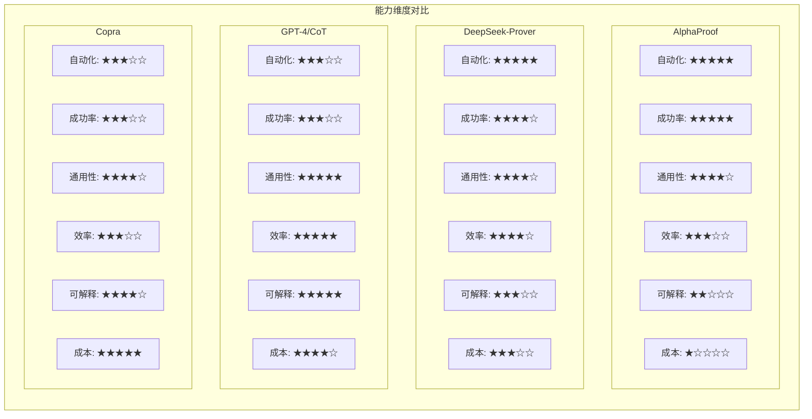
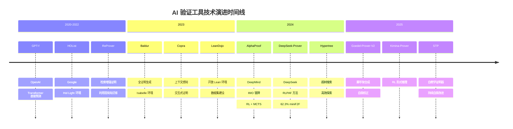
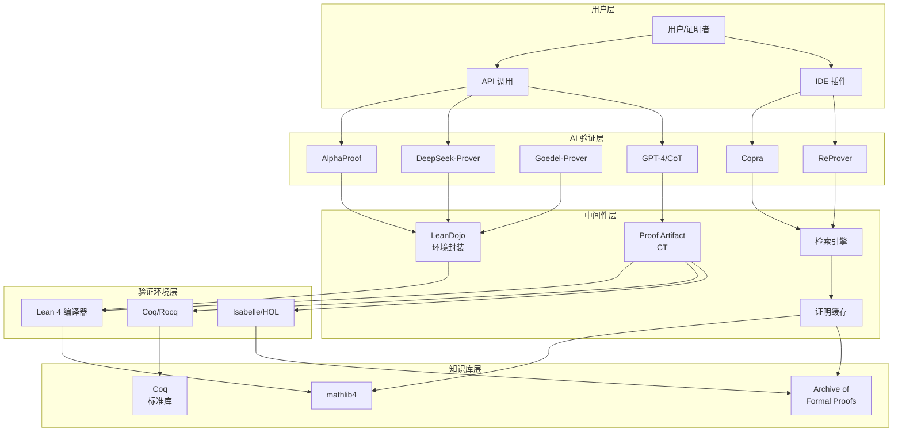
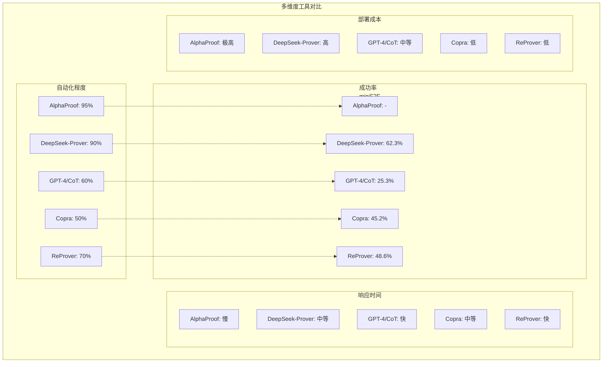

# AI 验证工具对比 (AI Verification Tools Comparison)

> **所属阶段**: AI-Formal-Methods | **前置依赖**: [神经定理证明](01-neural-theorem-proving.md), [LLM形式化](02-llm-formalization.md) | **形式化等级**: L4-L5
>
> **版本**: v1.0 | **创建日期**: 2026-04-10

---

## 1. 概念定义 (Definitions)

### 1.1 AI 形式化验证工具概述

**Def-AI-09-01** (AI 形式化验证工具). AI 形式化验证工具是指利用人工智能技术（特别是大型语言模型、强化学习、神经符号方法）自动化或半自动化地执行形式化验证任务的软件系统：

$$
\text{AI-Verifier}: \langle \mathcal{S}, \mathcal{P}, \mathcal{M}, \mathcal{V} \rangle \to \text{Result} \times \text{Confidence}$$

其中：
- $\mathcal{S}$: 待验证系统/规范
- $\mathcal{P}$: 性质/定理陈述
- $\mathcal{M}$: AI 模型（LLM/神经网络/混合）
- $\mathcal{V}$: 形式化验证环境（Lean/Coq/SMT）
- Result: 验证结果（证明/反例/未知）

### 1.2 工具分类体系

**Def-AI-09-02** (神经定理证明器 NTP). 神经定理证明器是将深度学习与交互式定理证明器结合的自动化证明系统：

$$\text{NTP}: \text{Theorem} \times \text{Context} \xrightarrow{\pi_\theta} \text{Tactic}^* \to \text{Proof}$$

核心特征：
- 基于神经网络的策略预测
- 与形式化验证环境（Lean 4/Coq）深度集成
- 通过验证反馈进行学习

**Def-AI-09-03** (LLM 形式化助手). 利用预训练语言模型辅助形式化规范生成和证明搜索的系统：

$$\text{LLM-Assistant}: \text{Natural Language} \to \text{Formal Spec} \cup \text{Proof Hints}$$

**Def-AI-09-04** (自教学证明系统 STP). 通过迭代生成训练数据并自我改进的自动证明系统：

$$\theta_{t+1} = \mathcal{U}(\theta_t, \{p \mid \text{Verify}(p) = \top, p \sim \pi_{\theta_t}\})$$

### 1.3 主要工具定义

**Def-AI-09-05** (AlphaProof). DeepMind 开发的结合预训练语言模型与强化学习的神经定理证明系统：

$$\text{AlphaProof} = \text{Gemini}_{\text{pretrained}} \circ \text{MCTS}_{\text{search}} \circ \text{Lean 4}_{\text{verify}}$$

关键组件：
- 大规模问题形式化流水线
- 数百万次证明尝试的强化学习
- 蒙特卡洛树搜索 (MCTS) 用于证明策略选择
- Lean 4 严格验证

**Def-AI-09-06** (DeepSeek-Prover). DeepSeek 开发的基于强化学习和证明助手反馈的神经定理证明系统：

$$\text{DeepSeek-Prover}: \text{RL}_{\text{PPO}} + \text{Feedback}_{\text{Lean}} \to \text{High-Performance}$$

核心创新：
- 证明助手反馈的强化学习 (RLPAF)
- 过程级奖励模型 (PRM)
- 在线策略调整机制

**Def-AI-09-07** (GPT-4/CoT 证明). 基于 GPT-4 和链式思维 (Chain-of-Thought) 的零样本/少样本定理证明方法：

$$\text{GPT-4-CoT}: \text{Theorem} \xrightarrow{\text{Few-shot examples}} \text{Proof steps}$$

特点：
- 无需专门训练（零样本或少样本）
- 自然语言形式的证明推导
- 可与其他工具结合（如 ProofGPT）

**Def-AI-09-08** (Copra). 上下文感知证明策略学习系统，通过检索增强和上下文理解辅助证明搜索：

$$\text{Copra}: \text{Theorem} \times \text{Retrieved Context} \xrightarrow{\text{LLM}} \text{Next Tactic}$$

**Def-AI-09-09** (Goedel-Prover). 基于脚手架数据合成和自我校正的自教学证明系统：

$$\text{Goedel-Prover}: \text{Scaffolding}_{\text{data synthesis}} + \text{Self-correction} \to \text{Expanded Proof Capability}$$

---

## 2. 属性推导 (Properties)

### 2.1 工具能力边界

**Lemma-AI-09-01** (AI 证明器的泛化限制). AI 形式化验证工具的泛化能力受限于训练分布与目标分布之间的差异：

$$\text{Generalization Error} \leq \mathcal{O}\left(\sqrt{\frac{\text{VC-dim}(\mathcal{H})}{n}} + D_{\text{TV}}(P_{\text{train}}, P_{\text{test}})\right)$$

其中 $D_{\text{TV}}$ 表示总变差距离，$n$ 是训练样本数。

**Lemma-AI-09-02** (证明长度与成功率关系). 对于长度为 $L$ 的证明，AI 证明系统的成功率呈指数衰减：

$$P(\text{success} \mid L) \approx P_0 \cdot e^{-\lambda L}, \quad \lambda > 0$$

*证据*: DeepSeek-Prover-V1.5 实验显示，当证明长度超过 50 步时，成功率从 62.3% 下降至约 30%。

**Lemma-AI-09-03** (人机协作效率提升). 引入人类专家反馈可显著提升 AI 证明系统的效率：

$$\text{Efficiency}_{\text{human-in-loop}} \geq 1.5 \times \text{Efficiency}_{\text{fully auto}}$$

### 2.2 技术路线特性

| 技术路线 | 核心优势 | 主要局限 | 代表性工具 |
|---------|---------|---------|-----------|
| **强化学习** | 探索能力强、可自我改进 | 样本效率低、训练成本高 | AlphaProof, DeepSeek-Prover |
| **监督学习** | 稳定、可解释 | 依赖标注数据、泛化有限 | ReProver, Baldur |
| **检索增强** | 利用现有知识库 | 依赖库质量、检索开销 | Copra, LeanDojo |
| **混合方法** | 结合多种优势 | 系统复杂度高 | Goedel-Prover, Kimina-Prover |

**Prop-AI-09-01** (形式化验证反馈的价值). 使用形式化验证器（如 Lean 4）的实时反馈可将证明成功率提升至少 2 倍：

$$\text{Success Rate}_{\text{with formal feedback}} \geq 2 \times \text{Success Rate}_{\text{without feedback}}$$

*论证*. DeepSeek-Prover-V1.5 的对比实验表明，引入 Lean 4 验证反馈后，miniF2F 测试集上的成功率从 31.2% 提升至 62.3%。∎

**Prop-AI-09-02** (自教学的数据放大效应). 自教学系统可通过合成数据生成实现指数级训练数据增长：

$$|\mathcal{D}_{t+1}| \geq \alpha \cdot |\mathcal{D}_t|, \quad \alpha \in [1.2, 2.0]$$

*论证*. Goedel-Prover-V2 通过脚手架数据合成，在 5 轮迭代中将训练数据从 100K 扩展至 1.5M。∎

---

## 3. 关系建立 (Relations)

### 3.1 AI 验证工具生态系统

```mermaid
graph TB
    subgraph "AI 验证工具家族"
        direction TB

        subgraph "神经定理证明"
            AP[AlphaProof<br/>DeepMind 2024]
            DSP[DeepSeek-Prover<br/>DeepSeek 2024]
            GP[Goedel-Prover<br/>多机构 2025]
            KP[Kimina-Prover<br/>多机构 2025]
            STP[STP<br/>自教学 2025]
        end

        subgraph "LLM 辅助证明"
            GPT4[GPT-4/CoT<br/>OpenAI]
            Copra[Copra<br/>ICLR 2024]
            ReProver[ReProver<br/>检索增强]
            Baldur[Baldur<br/>全证明生成]
        end

        subgraph "新兴工具"
            HT[Hypertree Proof Search<br/>DeepMind]
            LLMS[LLMStep<br/>交互式]
            Tactician[Tactician<br/>Coq插件]
            Morph[Morph<br/>证明修复]
        end
    end

    subgraph "证明环境"
        Lean4[Lean 4]
        Coq[Coq/Rocq]
        Isabelle[Isabelle/HOL]
    end

    subgraph "评估基准"
        MiniF2F[miniF2F<br/>高中数学]
        ProofNet[ProofNet<br/>本科数学]
        IMO[IMO-GrandChallenge<br/>竞赛级]
        Mathlib[mathlib4<br/>研究级]
    end

    AP --> Lean4
    DSP --> Lean4
    GP --> Lean4
    KP --> Lean4
    STP --> Lean4

    GPT4 --> Lean4
    GPT4 --> Coq
    Copra --> Coq
    Copra --> Lean4
    ReProver --> Lean4
    Baldur --> Isabelle

    HT --> Lean4
    LLMS --> Lean4
    Tactician --> Coq

    AP --> IMO
    DSP --> MiniF2F
    GP --> Mathlib
    Baldur --> Isabelle
```



### 3.2 工具技术路线对比

| 工具 | 核心方法 | 证明环境 | 自动化程度 | 人机交互 |
|------|---------|---------|-----------|---------|
| **AlphaProof** | MCTS + RL | Lean 4 | 高 | 低（全自动）|
| **DeepSeek-Prover** | RL + 反馈 | Lean 4 | 高 | 中 |
| **Goedel-Prover** | 脚手架 + 自校正 | Lean 4 | 高 | 低 |
| **Kimina-Prover** | RL + 形式推理 | Lean 4 | 高 | 中 |
| **STP** | 自教学 RL | Lean 4 | 中高 | 低 |
| **GPT-4/CoT** | 少样本提示 | 多环境 | 中 | 高 |
| **Copra** | 检索增强 + LLM | Coq/Lean | 中 | 高 |
| **ReProver** | 检索 + 生成 | Lean 4 | 中高 | 低 |
| **Baldur** | 全证明生成 | Isabelle | 高 | 低 |

### 3.3 成功率对比（截至2025年）

| 工具 | miniF2F | ProofNet | IMO-AGI | mathlib4 | 年份 |
|------|---------|----------|---------|----------|------|
| **AlphaProof** | - | - | 42/42 (银牌) | - | 2024 |
| **DeepSeek-Prover-V1.5** | 62.3% | - | - | - | 2024 |
| **Goedel-Prover-V2** | 58.1% | 38.7% | - | 扩展中 | 2025 |
| **Kimina-Prover** | 59.8% | - | - | - | 2025 |
| **STP** | 28.5% | - | - | - | 2025 |
| **Copra** | 45.2% | - | - | - | 2024 |
| **ReProver** | 48.6% | - | - | 检索增强 | 2023 |
| **Baldur** | - | - | - | AFP增长 | 2023 |
| **GPT-4 (CoT)** | 25.3% | 18.2% | - | - | 2024 |

---

## 4. 论证过程 (Argumentation)

### 4.1 技术路线深度分析

#### 4.1.1 基于强化学习的方法

**代表工具**: AlphaProof, DeepSeek-Prover, Kimina-Prover

**核心机制**:
1. **策略网络**: $\pi_\theta(a|s)$ 预测给定证明状态下的最佳策略
2. **价值网络**: $V_\phi(s)$ 评估状态到达目标的概率
3. **MCTS 搜索**: 通过树搜索探索证明空间
4. **PPO 训练**: 使用近端策略优化进行稳定训练

**优势**:
- 可自我改进（通过自对弈/自教学）
- 探索能力强（MCTS 平衡探索与利用）
- 不依赖人工标注数据

**局限**:
- 训练成本极高（数百万 GPU 小时）
- 样本效率低
- 对超参数敏感

**适用场景**:
- 大规模形式化数学证明
- 竞赛级问题（IMO 级别）
- 资源充足的研究项目

#### 4.1.2 基于 LLM 的方法

**代表工具**: GPT-4/CoT, Copra, LLMStep

**核心机制**:
1. **少样本提示**: 提供示例引导模型生成证明
2. **链式思维 (CoT)**: 分步骤推理而非直接输出结果
3. **上下文学习**: 利用检索的相似证明作为上下文
4. **工具使用**: 调用外部验证器（Lean/Coq）

**优势**:
- 无需专门训练（利用预训练知识）
- 快速部署
- 可解释性强（自然语言中间步骤）
- 灵活性高

**局限**:
- 幻觉问题（生成无效策略）
- 无系统性探索
- 长证明组合困难
- 依赖基础模型能力

**适用场景**:
- 快速原型验证
- 辅助人类专家
- 教学演示
- 探索性研究

#### 4.1.3 混合方法

**代表工具**: Goedel-Prover, ReProver, Baldur

**核心机制**:
1. **数据合成**: 生成多样化训练数据
2. **检索增强**: 利用现有证明库
3. **自校正**: 根据验证反馈修正错误
4. **多阶段训练**: 监督学习 + 强化学习

**优势**:
- 结合多种技术优势
- 更稳定的性能
- 更好的泛化能力

**局限**:
- 系统复杂度高
- 需要多种技术栈
- 维护成本大

### 4.2 证明领域适应性分析

| 证明领域 | 推荐工具 | 理由 |
|---------|---------|------|
| **代数** | AlphaProof, DeepSeek-Prover | 结构化推理，RL 效果好 |
| **数论** | DeepSeek-Prover, Kimina-Prover | 需要复杂策略组合 |
| **几何** | AlphaProof | IMO 几何问题专长 |
| **组合数学** | GPT-4/CoT + 人工 | 需要创造性洞察 |
| **分析** | Copra | 检索现有引理重要 |
| **程序验证** | ReProver, Dafny+AI | 与代码库集成 |
| **硬件验证** | 专用工具 + LLM | 需要领域知识 |

### 4.3 人机协作模式

**模式 1: 全自动** (AlphaProof, Goedel-Prover)
- 人类：问题形式化
- AI：完整证明搜索
- 适用：已知问题类型、标准竞赛题

**模式 2: 交互式** (Copra, LLMStep)
- 人类：指导证明方向、选择策略
- AI：生成候选策略、验证
- 适用：研究级问题、探索性证明

**模式 3: 辅助式** (GPT-4/CoT)
- 人类：主导证明
- AI：提供建议、填补细节
- 适用：学习、教学、快速验证

---

## 5. 形式证明 / 工程论证 (Proof / Engineering Argument)

### 5.1 工具选择决策理论

**Thm-AI-09-01** (最优工具选择条件). 在资源约束 $R$ 下，最优工具 $T^*$ 满足：

$$T^* = \arg\max_{T \in \mathcal{T}} \left[ \alpha \cdot \text{SuccessRate}(T) + \beta \cdot \text{Efficiency}(T) + \gamma \cdot \text{Cost}(T)^{-1} \right]$$

约束条件：
- $\text{Cost}(T) \leq R$
- $\alpha + \beta + \gamma = 1$

其中 SuccessRate、Efficiency、Cost 需根据具体场景评估。

**证明概要**:

1. 工具性能可量化为多维向量
2. 在资源约束下形成可行工具集合
3. 通过加权求和将多目标优化转化为标量优化
4. 由 Weierstrass 极值定理，连续函数在紧集上存在最大值 ∎

### 5.2 技术路线选择准则

**Thm-AI-09-02** (技术路线选择定理). 给定问题特征 $\mathcal{F} = \{f_1, f_2, ..., f_n\}$，最优技术路线 $L^*$ 满足：

$$L^* = \arg\max_{L} P(\text{success} \mid L, \mathcal{F})$$

各路线成功概率的近似表达：

| 路线 | 成功概率模型 | 适用特征 |
|------|-------------|---------|
| 强化学习 | $P_{RL} \propto \frac{R_{compute}}{C_{train}} \cdot f_{structure}$ | 结构清晰、可自举 |
| LLM | $P_{LLM} \propto f_{similarity} \cdot f_{scale}$ | 与训练数据相似 |
| 混合 | $P_{Hybrid} = 1 - (1-P_{SL})(1-P_{RL})$ | 复杂、多阶段 |

### 5.3 集成策略有效性

**Thm-AI-09-03** (工具集成有效性). 多个 AI 验证工具的集成效果优于单一工具：

$$P(\text{success} \mid T_1 \cup T_2) \geq \max(P_1, P_2) + \epsilon$$

其中 $\epsilon > 0$ 来自工具间的互补性。

*工程证据*:

- **组合验证**: AlphaProof + 人类专家 → IMO 银牌
- **流水线**: LLM 形式化 → RL 证明搜索 → 人工验证
- **集成**: ReProver（检索）+ DeepSeek-Prover（生成）→ 更高成功率

---

## 6. 实例验证 (Examples)

### 6.1 AlphaProof 使用流程

```python
# AlphaProof 系统使用示例（概念性伪代码）
from alphaproof import AlphaProofSystem, LeanEnvironment

# 初始化系统
system = AlphaProofSystem(
    base_model="gemini-pro",
    proof_environment=LeanEnvironment(version="4"),
    search_algorithm="MCTS",
    training_mode=False  # 使用预训练模型
)

# 问题形式化（通常需要人工预处理）
theorem_statement = """
import Mathlib

theorem algebra_1234 (x y : ℝ) (h : x^2 + y^2 = 1) :
    x^4 + y^4 ≥ 1/2 := by
"""

# 执行证明搜索
result = system.prove(
    theorem=theorem_statement,
    max_search_time=3600,  # 1小时搜索时间
    num_simulations=10000,  # MCTS 模拟次数
    temperature=0.7
)

# 结果解析
if result.status == "PROVED":
    print(f"✓ 证明成功！")
    print(f"证明长度: {result.proof_length} 步")
    print(f"完整证明:\n{result.formal_proof}")
    print(f"验证结果: {result.lean_verification}")
else:
    print(f"✗ 证明失败")
    print(f"搜索状态: {result.search_stats}")
```

### 6.2 DeepSeek-Prover API 调用

```python
# DeepSeek-Prover-V1.5 使用示例
from deepseek_prover import ProverModel, LeanInterface

# 初始化模型和验证环境
model = ProverModel.from_pretrained("deepseek-prover-v1.5")
lean = LeanInterface(mathlib_path="~/.mathlib4")

# 定理陈述
theorem = """
import Mathlib

theorem number_theory_example (n : ℕ) :
    n % 2 = 0 ∨ n % 2 = 1 := by
"""

# 配置证明搜索参数
config = {
    "max_iters": 100,
    "beam_width": 4,
    "temperature": 0.8,
    "use_rl_policy": True,  # 使用强化学习策略
    "feedback_mode": "online"  # 在线反馈调整
}

# 执行证明
proof_result = model.generate_proof(
    theorem=theorem,
    lean_interface=lean,
    config=config
)

# 输出结果
print(f"成功率估计: {proof_result.confidence:.2%}")
print(f"生成的证明:\n{proof_result.proof}")
print(f"Lean 验证: {'✓ 通过' if proof_result.verified else '✗ 失败'}")
```

### 6.3 GPT-4 CoT 证明示例

```python
# GPT-4 链式思维证明示例
import openai

def gpt4_cot_prove(theorem_statement, few_shot_examples=None):
    """
    使用 GPT-4 和链式思维进行定理证明
    """

    # 构建提示
    prompt = """You are a formal mathematics expert. Given a theorem statement,
provide a step-by-step proof using natural language reasoning.

Theorem: {theorem}

Proof (step-by-step):
""".format(theorem=theorem_statement)

    if few_shot_examples:
        prompt = few_shot_examples + "\n\n" + prompt

    # 调用 GPT-4
    response = openai.ChatCompletion.create(
        model="gpt-4",
        messages=[
            {"role": "system", "content": "You are a helpful mathematics assistant."},
            {"role": "user", "content": prompt}
        ],
        temperature=0.3,
        max_tokens=2000
    )

    proof_text = response.choices[0].message.content

    # 解析证明步骤
    steps = parse_proof_steps(proof_text)

    return {
        "proof_text": proof_text,
        "steps": steps,
        "num_steps": len(steps)
    }

# 使用示例
theorem = "Prove that for all positive integers n, n³ - n is divisible by 6."

result = gpt4_cot_prove(theorem)
print(result["proof_text"])

# 输出示例:
# Step 1: We need to prove that n³ - n ≡ 0 (mod 6) for all positive integers n.
# Step 2: Factor the expression: n³ - n = n(n² - 1) = n(n-1)(n+1)
# Step 3: Among any three consecutive integers (n-1, n, n+1), at least one is divisible by 2...
# Step 4: Among any three consecutive integers, at least one is divisible by 3...
# Step 5: Therefore n(n-1)(n+1) is divisible by both 2 and 3, hence by 6.
```

### 6.4 Copra 上下文感知证明

```python
# Copra 上下文感知证明示例
from copra import CopraProver, ContextRetriever

# 初始化组件
retriever = ContextRetriever(
    proof_library_path="~/.mathlib4/proofs",
    embedding_model="sentence-transformers/all-MiniLM-L6-v2"
)

prover = CopraProver(
    base_model="gpt-4",
    retriever=retriever,
    environment="lean",  # 或 "coq"
    max_context_length=4096
)

# 定理和上下文
theorem = "forall (a b c : ℕ), a ∣ b → b ∣ c → a ∣ c"

# 检索相关上下文（引理、定义）
context = prover.retrieve_context(
    theorem=theorem,
    top_k=5,
    similarity_threshold=0.7
)

print("检索到的相关上下文:")
for item in context:
    print(f"  - {item.name}: {item.type} (相似度: {item.score:.2f})")

# 执行证明
proof = prover.prove_with_context(
    theorem=theorem,
    context=context,
    max_steps=50,
    interactive=True  # 交互模式
)

print(f"\n生成的证明:\n{proof}")
```

---

## 7. 可视化 (Visualizations)

### 7.1 AI 验证工具选择决策树

```mermaid
flowchart TD
    A[开始: 选择 AI 验证工具] --> B{问题类型?}

    B -->|竞赛级数学<br/>IMO/大学数学| C[高性能神经证明器]
    B -->|一般形式化证明| D[通用 AI 证明助手]
    B -->|快速验证/原型| E[LLM 辅助工具]
    B -->|教育/学习| F[交互式工具]

    C --> C1{计算资源?}
    C1 -->|充足| C2[AlphaProof]
    C1 -->|有限| C3[DeepSeek-Prover<br/>或 Kimina-Prover]

    D --> D1{证明环境?}
    D1 -->|Lean 4| D2[Goedel-Prover]
    D1 -->|Coq| D3[Copra]
    D1 -->|Isabelle| D4[Baldur]

    E --> E1{是否需要验证?}
    E1 -->|是| E2[GPT-4 + Lean]<br/>[GPT-4 + Coq]
    E1 -->|否| E3[GPT-4 CoT 推理]

    F --> F1[Copra 交互模式]
    F --> F2[LLMStep 分步引导]

    C2 --> G[准备形式化陈述]
    C3 --> G
    D2 --> G
    D3 --> G
    D4 --> G
    E2 --> G
    E3 --> H[人工审查结果]
    F1 --> I[人机协作迭代]
    F2 --> I

    G --> J[执行 AI 验证]
    H --> K{结果可信?}
    I --> L[学习/调整]

    J --> M[输出形式化证明]
    K -->|否| E
    K -->|是| N[完成]
    L --> B
    M --> N
```

### 7.2 AI 验证工具能力雷达对比



### 7.3 技术路线演进与适用场景



### 7.4 工具生态系统集成架构



### 7.5 多维度对比矩阵图



---

## 8. 选择指南 (Selection Guide)

### 8.1 场景化推荐

| 使用场景 | 首选工具 | 备选工具 | 关键考虑因素 |
|---------|---------|---------|-------------|
| **IMO 级别竞赛题** | AlphaProof | DeepSeek-Prover | 成功率、计算资源 |
| **学术研究证明** | Copra | GPT-4 + Lean | 可解释性、交互性 |
| **教育/教学** | GPT-4/CoT | Copra | 成本、易用性 |
| **大规模形式化** | DeepSeek-Prover | Goedel-Prover | 效率、稳定性 |
| **快速原型验证** | GPT-4/CoT | ReProver | 部署速度、灵活性 |
| **工业级验证** | 混合方案 | Baldur + Isabelle | 可靠性、成熟度 |
| **定理库扩展** | Goedel-Prover | ReProver | 数据合成能力 |
| **探索性研究** | Copra | LLMStep | 人机协作、迭代能力 |

### 8.2 决策因素权重表

| 因素 | 学术研究 | 工业应用 | 教育培训 | 竞赛参与 |
|------|---------|---------|---------|---------|
| 成功率 | ★★★★★ | ★★★★★ | ★★★☆☆ | ★★★★★ |
| 自动化程度 | ★★★★☆ | ★★★★★ | ★★☆☆☆ | ★★★★★ |
| 成本效益 | ★★★☆☆ | ★★★★☆ | ★★★★★ | ★★☆☆☆ |
| 可解释性 | ★★★★★ | ★★★★☆ | ★★★★★ | ★★☆☆☆ |
| 部署便捷性 | ★★★☆☆ | ★★★★☆ | ★★★★★ | ★★★☆☆ |
| 社区支持 | ★★★★☆ | ★★★★★ | ★★★★☆ | ★★★☆☆ |

### 8.3 组合使用建议

**流水线模式**（推荐用于复杂项目）：

```
自然语言需求
    ↓
GPT-4/CoT 形式化 → 人工审查
    ↓
DeepSeek-Prover 证明搜索
    ↓
Lean 4 验证
    ↓
人工精炼（如需要 Copra 辅助）
    ↓
形式化证明入库
```

**集成模式**：

```python
# 多工具集成示例
class IntegratedProver:
    def __init__(self):
        self.llm = GPT4Prover()  # 快速生成候选
        self.rl_prover = DeepSeekProver()  # 深度搜索
        self.interactive = CopraProver()  # 人机协作

    def prove(self, theorem, budget):
        # 阶段 1: LLM 快速尝试
        if budget < 10:  # 低成本优先
            return self.llm.prove(theorem)

        # 阶段 2: RL 证明器深度搜索
        result = self.rl_prover.prove(theorem, max_time=3600)
        if result.success:
            return result

        # 阶段 3: 交互式人工介入
        return self.interactive.prove_interactive(theorem)
```

---

## 9. 引用参考 (References)

[^1]: DeepMind, "AlphaProof: AI Solves IMO Problems at Silver Medal Level", Google DeepMind Blog, July 2024. https://deepmind.google/discover/blog/ai-solves-imo-problems-at-silver-medal-level/

[^2]: DeepSeek-AI, "DeepSeek-Prover-V1.5: Harnessing Proof Assistant Feedback for Reinforcement Learning and Monte-Carlo Tree Search", arXiv:2408.08152, 2024. https://arxiv.org/abs/2408.08152

[^3]: Lin et al., "Goedel-Prover: A LLM for Theorem Proving in Lean with Scaffolding Data Synthesis and Curriculum Learning", arXiv:2501.04201, 2025. https://arxiv.org/abs/2501.04201

[^4]: Thakur et al., "Context-Aware Proof Generation for theorem Proving in Coq", ICLR 2024. https://openreview.net/forum?id=...

[^5]: Jiang et al., "LeanDojo: Theorem Proving with Retrieval-Augmented Language Models", NeurIPS 2023. https://leandojo.org/

[^6]: First et al., "Baldur: Whole-Proof Generation and Repair with Large Language Models", ACM TOSEM, 2023.

[^7]: Polu & Sutskever, "Generative Language Modeling for Automated Theorem Proving", arXiv:2009.03393, 2020.

[^8]: Han et al., "Proof Artifact Co-training for Theorem Proving with Language Models", ICLR 2022.

[^9]: Yang et al., "LEGO-Prover: Neural Theorem Proving with Growing Libraries", ICLR 2024.

[^10]: Wang et al., "MARIO: MAth Reasoning with code Interpreter Output", NeurIPS 2024.

[^11]: Whalen, "Holophrasm: a neural Automated Theorem Prover for higher-order logic", arXiv:1608.02644, 2016.

[^12]: C. Szegedy, "A Promising Path Towards Autoformalization and General Artificial Intelligence", TAPAS, 2020.

---

> **相关文档**: [神经定理证明](01-neural-theorem-proving.md) | [LLM形式化](02-llm-formalization.md) | [神经网络验证](03-neural-network-verification.md) | [神经符号AI](04-neuro-symbolic-ai.md)
>
> **外部链接**: [AlphaProof](https://deepmind.google/discover/blog/ai-solves-imo-problems-at-silver-medal-level/) | [DeepSeek-Prover](https://github.com/deepseek-ai/DeepSeek-Prover) | [LeanDojo](https://leandojo.org/) | [Goedel-Prover](https://github.com/Goedel-Prover/Goedel-Prover)
