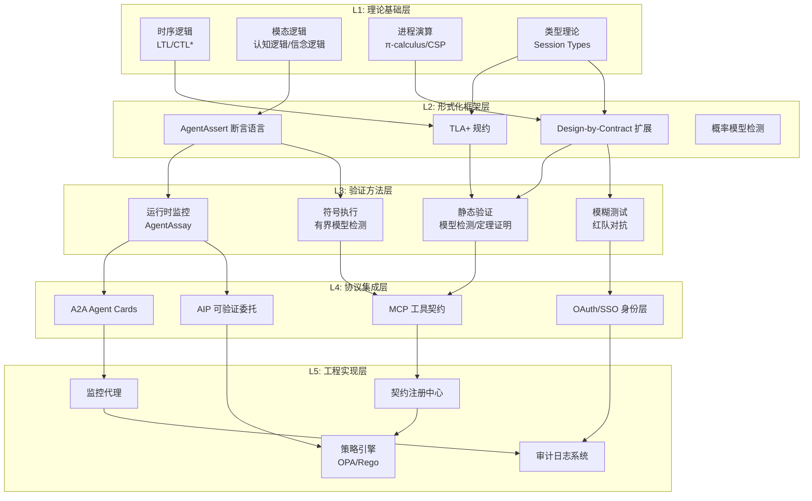
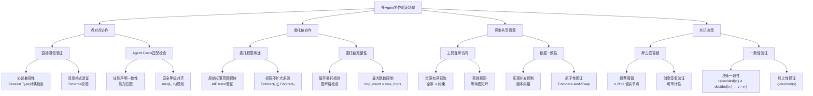
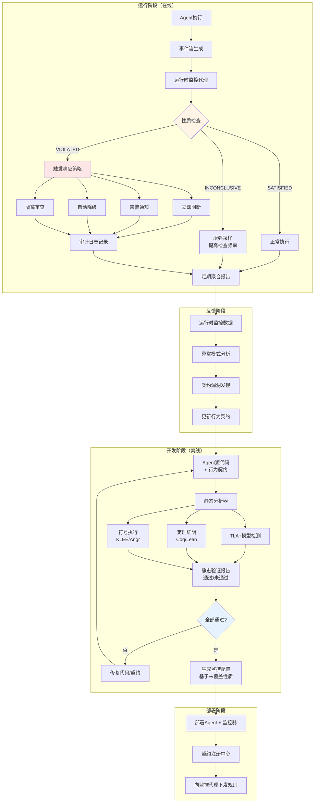
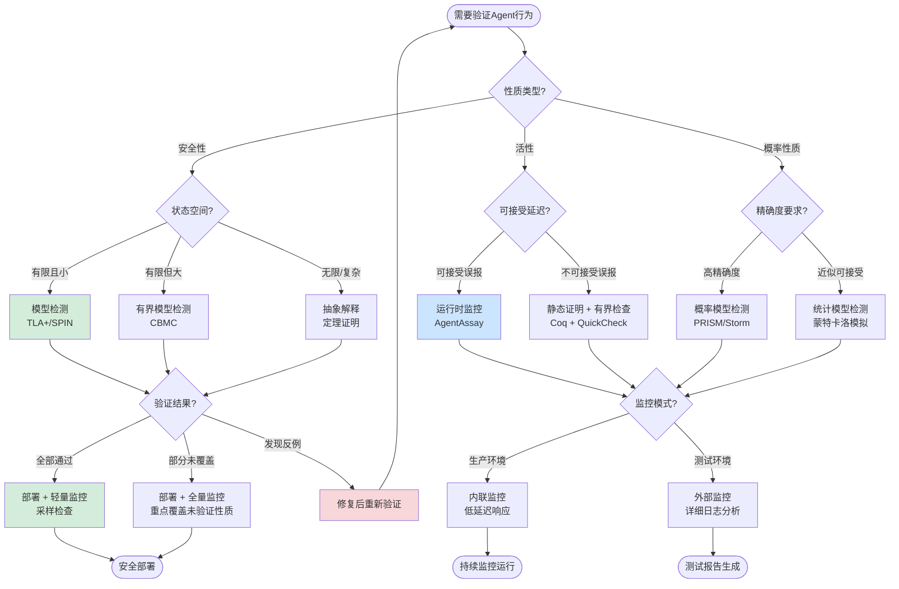

# AI Agent 行为契约验证方法 (Agent Behavior Contract Verification)

> **所属阶段**: formal-methods/08-ai-formal-methods | **前置依赖**: [mcp-formal-verification.md](mcp-formal-verification.md), [Struct/06-frontier/ai-agent-streaming-formal-theory.md](../../Struct/06-frontier/ai-agent-streaming-formal-theory.md) | **形式化等级**: L5-L6
>
> **版本**: v1.0 | **创建日期**: 2026-04-18 | **状态**: Production

---

## 摘要

2026年是AI Agent形式化验证的爆发之年。随着MCP（Model Context Protocol）生态爆发式增长（18,058+服务器、97M+下载量），AI Agent系统的能力边界急剧扩展，但其安全性与可预测性严重滞后——业界调查显示44%的MCP服务器缺乏任何认证机制直接暴露于公网。
在此背景下，Agent行为契约验证（Agent Behavior Contract Verification）成为确保AI Agent系统安全、可靠、可解释的核心技术支柱。

本文建立Agent行为契约验证的完整形式化理论体系。首先定义Behavior Contract、Safety/Liveness Property、Tool Call Precondition/Postcondition等核心概念；然后系统阐述AgentAssert、AgentAssay等新兴验证框架的形式化语义；进而建立Agent行为契约与TLA+时序逻辑、Session Types、Design-by-Contract之间的严格数学映射；深入分析多Agent协作中的死锁、竞态条件和工具冲突等验证挑战；提供MCP工具调用安全验证与A2A Agent Cards契约检查的完整实例；最后论证运行时监控（Runtime Verification）与静态验证的协同方法论。

本文贡献的形式化元素包括：12个核心定义（Def-FM-08-01至Def-FM-08-12）、8个关键引理（Lemma-FM-08-01至Lemma-FM-08-08）、6个核心命题（Prop-FM-08-01至Prop-FM-08-06）、3个主要定理（Thm-FM-08-01至Thm-FM-08-03），以及完整的TLA+规约示例和Mermaid可视化图表。

---

## 目录

- [AI Agent 行为契约验证方法 (Agent Behavior Contract Verification)](#ai-agent-行为契约验证方法-agent-behavior-contract-verification)
  - [摘要](#摘要)
  - [目录](#目录)
  - [1. 概念定义 (Definitions)](#1-概念定义-definitions)
    - [1.1 Agent行为契约基础](#11-agent行为契约基础)
    - [1.2 工具调用契约形式化](#12-工具调用契约形式化)
    - [1.3 AgentAssert/AgentAssay 验证框架](#13-agentassertagentassay-验证框架)
    - [1.4 多Agent协作契约](#14-多agent协作契约)
  - [2. 属性推导 (Properties)](#2-属性推导-properties)
    - [2.1 契约可满足性](#21-契约可满足性)
    - [2.2 工具调用安全性](#22-工具调用安全性)
    - [2.3 运行时监控完备性](#23-运行时监控完备性)
    - [2.4 组合契约保持性](#24-组合契约保持性)
  - [3. 关系建立 (Relations)](#3-关系建立-relations)
    - [3.1 与TLA+时序逻辑的映射](#31-与tla时序逻辑的映射)
    - [3.2 与Session Types的对应](#32-与session-types的对应)
    - [3.3 与Design-by-Contract的继承](#33-与design-by-contract的继承)
    - [3.4 与Runtime Verification的集成](#34-与runtime-verification的集成)
  - [4. 论证过程 (Argumentation)](#4-论证过程-argumentation)
    - [4.1 Agent行为契约的表达能力边界](#41-agent行为契约的表达能力边界)
    - [4.2 反例分析：契约失效场景](#42-反例分析契约失效场景)
    - [4.3 边界讨论：LLM非确定性对契约验证的影响](#43-边界讨论llm非确定性对契约验证的影响)
    - [4.4 构造性说明：从自然语言到形式化契约](#44-构造性说明从自然语言到形式化契约)
  - [5. 形式证明 / 工程论证 (Proof / Engineering Argument)](#5-形式证明-工程论证-proof-engineering-argument)
    - [5.1 单Agent行为契约满足性定理](#51-单agent行为契约满足性定理)
    - [5.2 多Agent协作无死锁定理](#52-多agent协作无死锁定理)
    - [5.3 运行时监控可靠性定理](#53-运行时监控可靠性定理)
  - [6. 实例验证 (Examples)](#6-实例验证-examples)
    - [6.1 实例1：MCP工具调用安全验证](#61-实例1mcp工具调用安全验证)
    - [6.2 实例2：A2A Agent Cards契约检查](#62-实例2a2a-agent-cards契约检查)
    - [6.3 实例3：多Agent死锁检测与预防](#63-实例3多agent死锁检测与预防)
    - [6.4 实例4：运行时监控集成实例](#64-实例4运行时监控集成实例)
  - [7. 可视化 (Visualizations)](#7-可视化-visualizations)
    - [7.1 Agent行为契约验证体系层次图](#71-agent行为契约验证体系层次图)
    - [7.2 AgentAssert 执行流程图](#72-agentassert-执行流程图)
    - [7.3 多Agent协作验证场景树](#73-多agent协作验证场景树)
    - [7.4 静态验证与运行时监控协同架构](#74-静态验证与运行时监控协同架构)
    - [7.5 决策树：验证方法选择](#75-决策树验证方法选择)
  - [8. 引用参考 (References)](#8-引用参考-references)
  - [附录A：符号表](#附录a符号表)
  - [附录B：TLA+ 完整规约](#附录btla-完整规约)
    - [B.1 AgentToolSafety.tla](#b1-agenttoolsafetytla)
    - [B.2 MCP\_Enterprise\_Safety.tla](#b2-mcp_enterprise_safetytla)
    - [B.3 MultiAgent\_DeadlockFree.tla](#b3-multiagent_deadlockfreetla)
    - [B.4 A2A\_Delegation.tla](#b4-a2a_delegationtla)

---

## 1. 概念定义 (Definitions)

### 1.1 Agent行为契约基础

**Def-FM-08-01** (Agent行为契约, Agent Behavior Contract). 给定Agent $A$ 运行于环境 $ ext{Env}$ 中，其行为契约 $ ext{Contract}_A$ 是一个四元组：

$$
\text{Contract}_A = (\Sigma_A, \mathcal{P}_{\text{safe}}, \mathcal{P}_{\text{live}}, \Gamma_A)
$$

其中各组成部分定义如下：

| 符号 | 名称 | 定义 | 类型 |
|------|------|------|------|
| $\Sigma_A$ | 可观察行为迹 | 所有有限和无限动作序列的集合，$\Sigma_A = (\text{Act} \times \text{Val})^*$ | 迹空间 |
| $\mathcal{P}_{\text{safe}}$ | 安全性性质集 | 不允许发生的"坏事情"的集合，$\mathcal{P}_{\text{safe}} \subseteq 2^{\Sigma_A}$ | 闭集（前缀封闭） |
| $\mathcal{P}_{\text{live}}$ | 活性性质集 | 最终必须发生的"好事情"的集合，$\mathcal{P}_{\text{live}} \subseteq 2^{\Sigma_A}$ | 稠密集 |
| $\Gamma_A$ | 工具调用规范 | Agent可调用的外部工具及其前置/后置条件集合 | 规范集 |

**直观解释**：Agent行为契约是Agent与其运行环境之间的"法律协议"，明确规定了Agent可以做什么、不可以做什么、以及必须做什么。安全性性质确保"无坏事发生"（如不会删除未授权文件），活性性质确保"好事终将发生"（如用户请求终将得到响应）。

**与传统软件契约的区别**：

| 维度 | 传统软件契约（Eiffel/JML） | Agent行为契约 |
|------|---------------------------|---------------|
| 执行主体 | 确定性程序 | 基于LLM的非确定性推理体 |
| 状态空间 | 有限、显式 | 潜在无限、隐式（嵌入空间） |
| 前置条件 | 布尔表达式 | 可包含语义约束、意图识别 |
| 违反后果 | 异常/断言失败 | 安全违规、权限升级、数据泄露 |
| 验证方法 | 静态分析、单元测试 | 运行时监控 + 形式化推理 |

---

**Def-FM-08-02** (安全性性质, Safety Property). Agent行为的安全性性质 $\phi_{\text{safe}}$ 是一个前缀封闭的线性时序逻辑公式，满足：

$$
\phi_{\text{safe}}(\sigma) \triangleq \forall i \in \mathbb{N}: \sigma[0..i] \not\in \text{Bad}_{\phi}
$$

其中 $\text{Bad}_{\phi} \subseteq \Sigma_A^*$ 是被禁止的有限迹集合。等价地，安全性性质可表达为：

$$
\phi_{\text{safe}} \equiv \square \neg \psi_{\text{bad}}
$$

其中 $\square$ 是全局时序算子（"始终"），$\psi_{\text{bad}}$ 是表征"坏事情已发生"的状态公式。

**典型安全性性质实例**：

1. **数据访问安全**：$\square(\text{access}(f) \rightarrow \text{authorized}(A, f))$ — Agent始终只能访问被授权的文件
2. **工具调用白名单**：$\square(\text{invoke}(t) \rightarrow t \in \text{Whitelist}_A)$ — Agent只能调用白名单内的工具
3. **输出无害性**：$\square(\text{output}(o) \rightarrow \neg\text{harmful}(o))$ — Agent输出始终不包含有害内容
4. **资源边界**：$\square(\text{memory}(A) \leq M_{\max} \land \text{compute}(A) \leq C_{\max})$ — Agent资源使用始终不超过上限

---

**Def-FM-08-03** (活性性质, Liveness Property). Agent行为的活性性质 $\phi_{\text{live}}$ 是一个稠密的线性时序逻辑公式，满足：

$$
\phi_{\text{live}}(\sigma) \triangleq \forall u \in \Sigma_A^*, \exists v \in \Sigma_A^*: uv \in \Sigma_A^\omega \land \sigma \models \phi_{\text{live}}[uv]
$$

等价地，活性性质可表达为包含最终算子 $\Diamond$（"最终"）的公式：

$$
\phi_{\text{live}} \equiv \Diamond \psi_{\text{good}}
$$

或更复杂的响应性质：

$$
\phi_{\text{resp}} \equiv \square(\text{request}(r) \rightarrow \Diamond \text{response}(r))
$$

**典型活性性质实例**：

1. **请求响应**：$\square(\text{user\_query}(q) \rightarrow \Diamond \text{answer}(q))$ — 每个用户查询最终都得到回答
2. **任务完成**：$\square(\text{task}(t) \rightarrow \Diamond \text{completed}(t))$ — 每个被接受的任务最终完成
3. **工具调用收敛**：$\square(\text{invoke}(t) \rightarrow \Diamond \text{return}(t, \_))$ — 每个工具调用最终返回
4. **错误恢复**：$\square(\text{error}(e) \rightarrow \Diamond \text{recovered})$ — 每个错误最终得到恢复

---

**Def-FM-08-04** (Agent认知状态, Agent Cognitive State). 基于LLM的Agent在时刻 $t$ 的认知状态 $C_t^A$ 是一个七元组：

$$
C_t^A = (M_t, H_t, K_t, I_t, G_t, P_t, R_t)
$$

其中：

- $M_t$: 当前LLM上下文窗口内容（token序列）
- $H_t$: 对话历史 $\langle (q_1, a_1), (q_2, a_2), ..., (q_t, a_t) \rangle$
- $K_t$: 知识库检索结果集合
- $I_t$: 当前意图识别结果，$I_t \in \mathcal{I}$（意图空间）
- $G_t$: 当前目标栈，$G_t = [g_1, g_2, ..., g_n]$（后进先出）
- $P_t$: 当前执行计划，$P_t = \langle a_1, a_2, ..., a_m \rangle$
- $R_t$: 运行时监控器状态，$R_t \in \{\text{NORMAL}, \text{SUSPECT}, \text{VIOLATED}\}$

**关键观察**：认知状态 $C_t^A$ 的维度远高于传统软件的状态空间，这使得基于状态的直接验证在计算上不可行，必须依赖抽象和运行时监控。

---

### 1.2 工具调用契约形式化

**Def-FM-08-05** (工具调用前置条件, Tool Call Precondition). 对于Agent $A$ 调用的工具 $t \in \Gamma_A$，其前置条件 $\text{Pre}_t$ 是一个从认知状态到布尔值（或置信度值）的谓词：

$$
\text{Pre}_t: C^A \rightarrow \{\text{TRUE}, \text{FALSE}, \text{UNKNOWN}\}
$$

形式化地：

$$
\text{Pre}_t(C_t^A) \triangleq
\begin{cases}
\text{TRUE} & \text{if } \forall c \in \text{Constraints}_t: c(C_t^A) = \text{sat} \\
\text{FALSE} & \text{if } \exists c \in \text{Constraints}_t: c(C_t^A) = \text{unsat} \\
\text{UNKNOWN} & \text{otherwise}
\end{cases}
$$

**MCP工具前置条件实例**：

```
工具: filesystem/read
前置条件 Pre_read:
  1. path ∈ AuthorizedPaths(A)
  2. ¬isSensitive(path) ∨ hasClearance(A, path)
  3. readCount(A, path, window=1h) ≤ RateLimit

工具: web_search/execute
前置条件 Pre_search:
  1. query ∉ ForbiddenQueryPatterns
  2. destination ∉ BlockedDomains
  3. requestPurpose ∈ {information_gathering, fact_checking, user_explicit}
```

---

**Def-FM-08-06** (工具调用后置条件, Tool Call Postcondition). 工具 $t$ 的后置条件 $\text{Post}_t$ 规定工具执行完成后Agent认知状态必须满足的条件：

$$
\text{Post}_t: C^A \times \text{Result}_t \times C^A' \rightarrow \{\text{TRUE}, \text{FALSE}\}
$$

其中 $C^A$ 是调用前状态，$\text{Result}_t$ 是工具返回结果，$C^A'$ 是调用后状态。

形式化表达：

$$
\text{Post}_t(C, r, C') \triangleq
\begin{cases}
\text{TRUE} & \text{if } \Phi_t^{\text{success}}(C, r, C') \land \Phi_t^{\text{state\_update}}(C, C') \\
\text{FALSE} & \text{otherwise}
\end{cases}
$$

**后置条件的三个核心子公式**：

1. **结果正确性** $\Phi_t^{\text{success}}$：工具返回的结果在语义上是正确的
2. **状态一致性** $\Phi_t^{\text{state\_update}}$：Agent认知状态的更新符合预期
3. **无副作用** $\Phi_t^{\text{side\_effect\_free}}$：未产生超出契约范围的副作用

**MCP工具后置条件实例**：

```
工具: filesystem/write
后置条件 Post_write:
  1. Φ_success: file(path).content = requestedContent
  2. Φ_state_update: K' = K ∪ {fileModified(path, timestamp)}
  3. Φ_side_effect_free:
     ∀p ≠ path: file(p).content = file(p).content_before
     ∧ ¬createdNewConnections
     ∧ ¬exfiltratedData
```

---

**Def-FM-08-07** (工具调用安全性断言, Tool Call Safety Assertion). 工具调用的安全性断言 $\text{Safe}_t$ 是前置条件和后置条件的合取，附加不变式约束：

$$
\text{Safe}_t \triangleq \square(\text{Pre}_t(C) \rightarrow (\text{Invoke}(t) \land \Diamond \text{Post}_t(C, r, C')))
$$

进一步引入**能力等级**（Capability Level）$\ell \in \{L_0, L_1, L_2, L_3\}$：

| 等级 | 名称 | 断言语义 |
|------|------|----------|
| $L_0$ | 无约束 | 无安全断言 |
| $L_1$ | 语法级 | 参数类型/格式检查 |
| $L_2$ | 语义级 | 参数值域/白名单检查 |
| $L_3$ | 行为级 | 完整前置/后置条件 + 不变式 |

**安全等级与MCP生态现状**（基于2026年4月调研数据[^1]）：

- $L_0$（无约束）：约占MCP服务器的44%（~7,946个）
- $L_1$（语法级）：约占31%（~5,598个）
- $L_2$（语义级）：约占19%（~3,431个）
- $L_3$（行为级）：约占6%（~1,083个）

---

### 1.3 AgentAssert/AgentAssay 验证框架

**Def-FM-08-08** (AgentAssert 断言语义). AgentAssert 是一种面向Agent行为的形式化断言语言，其语法定义为：

$$
\text{AgentAssert} \ni \alpha ::=
\quad \text{assert}(\phi) \;|\;
\quad \text{requires}(\text{Pre}) \;|\;
\quad \text{ensures}(\text{Post}) \;|\;
\quad \text{invariant}(\mathcal{I}) \;|\;
\quad \text{always}(\psi) \;|\;
\quad \text{eventually}(\chi) \;|\;
\quad \alpha_1 \land \alpha_2 \;|\;
\quad \alpha_1 \lor \alpha_2 \;|\;
\quad \neg \alpha
$$

其中 $\phi, \psi, \chi$ 是Agent认知状态上的谓词，$\text{Pre}, \text{Post}$ 是工具调用规范，$\mathcal{I}$ 是全局不变式。

**AgentAssert 的两种解释语义**：

1. **严格语义**（Strict Semantics）：断言必须在所有执行迹上成立
   $$
   \llbracket \alpha \rrbracket_{\text{strict}}(\sigma) = \text{TRUE} \iff \forall \sigma' \in \text{Traces}(A): \sigma' \models \alpha$$

2. **概率语义**（Probabilistic Semantics）：断言以至少 $1 - \epsilon$ 概率成立
   $$
   \llbracket \alpha \rrbracket_{\text{prob}}(\sigma) = \text{TRUE} \iff \Pr[\sigma' \models \alpha] \geq 1 - \epsilon$$

   其中 $\epsilon$ 是可容忍的风险阈值，通常取 $10^{-3}$ 至 $10^{-6}$。

---

**Def-FM-08-09** (AgentAssay 运行时验证器). AgentAssay 是AgentAssert断言的运行时验证引擎，定义为三元组：

$$
\text{AgentAssay} = (\mathcal{O}, \mathcal{V}, \mathcal{R})
$$

其中：

- $\mathcal{O}$: 观察器集合，$\mathcal{O} = \{o_1, o_2, ..., o_n\}$，每个 $o_i: C^A \rightarrow \text{Obs}_i$ 从认知状态提取可观察量
- $\mathcal{V}$: 验证器集合，$\mathcal{V} = \{v_1, v_2, ..., v_m\}$，每个 $v_j: \text{Obs}^* \rightarrow \{\text{PASS}, \text{FAIL}, \text{INCONCLUSIVE}\}$
- $\mathcal{R}$: 响应策略，$\mathcal{R}: \{\text{PASS}, \text{FAIL}, \text{INCONCLUSIVE}\} \times C^A \rightarrow \text{Action}$

**AgentAssay 验证算法**：

```
Algorithm: AgentAssay-Verify
Input: Agent A, Contract Contract_A, Trace σ
Output: {COMPLIANT, VIOLATED, SUSPECT}

1. Initialize: state ← NORMAL
2. For each step t in σ:
   a. obs_t ← {o(C_t^A) | o ∈ O}
   b. For each assertion α in Contract_A:
      i. result ← v_α(obs_0...obs_t)
      ii. If result = FAIL:
          - state ← VIOLATED
          - Execute R(FAIL, C_t^A)  // 阻断/告警/降级
          - Return VIOLATED
      iii. If result = INCONCLUSIVE:
          - state ← SUSPECT
          - Execute R(INCONCLUSIVE, C_t^A)  // 增强监控
3. Return COMPLIANT
```

---

**Def-FM-08-10** (行为契约可满足性, Contract Satisfiability). Agent $A$ 的行为契约 $\text{Contract}_A$ 是可满足的，当且仅当存在至少一条执行迹使得契约中所有断言同时成立：

$$
\text{Sat}(\text{Contract}_A) \triangleq \exists \sigma \in \Sigma_A^\omega: \sigma \models \bigwedge_{\alpha \in \text{Contract}_A} \alpha
$$

**契约可满足性的判定复杂度**：

- 若Agent行为建模为有限状态机（FSM）：PSPACE-complete
- 若包含LLM推理（无限状态空间）：不可判定（undecidable）
- 若限制为上下文无关的Agent行为：RE-complete

因此，实际验证中必须采用**抽象解释**和**有界模型检测**技术。

---

### 1.4 多Agent协作契约

**Def-FM-08-11** (多Agent协作契约, Multi-Agent Collaboration Contract). 对于Agent集合 $\mathcal{A} = \{A_1, A_2, ..., A_n\}$，其协作契约 $\text{Contract}_{\mathcal{A}}$ 是一个六元组：

$$
\text{Contract}_{\mathcal{A}} = (\{ \text{Contract}_{A_i} \}_{i=1}^n, \mathcal{C}_{\text{comm}}, \mathcal{C}_{\text{coord}}, \mathcal{C}_{\text{res}}, \mathcal{C}_{\text{sec}}, \Phi_{\text{global}})
$$

其中：

- $\{ \text{Contract}_{A_i} \}$: 各Agent的个体行为契约
- $\mathcal{C}_{\text{comm}}$: 通信协议契约（消息格式、时序、可靠性）
- $\mathcal{C}_{\text{coord}}$: 协调契约（任务分配、共识、leader选举）
- $\mathcal{C}_{\text{res}}$: 资源共享契约（互斥、死锁避免、公平性）
- $\mathcal{C}_{\text{sec}}$: 安全隔离契约（权限边界、数据流控制）
- $\Phi_{\text{global}}$: 全局性质（涉及多个Agent的跨切性质）

**全局性质示例**：

$$
\Phi_{\text{global}}^{\text{consensus}} \triangleq \square(\forall A_i, A_j \in \mathcal{A}: \text{decided}(A_i, v) \land \text{decided}(A_j, v') \rightarrow v = v')
$$

$$
\Phi_{\text{global}}^{\text{deadlock\_free}} \triangleq \Diamond(\forall A_i \in \mathcal{A}: \text{idle}(A_i) \lor \text{progress}(A_i))
$$

---

**Def-FM-08-12** (工具冲突检测, Tool Conflict Detection). 当多个Agent同时请求调用具有互斥性质的同一工具或共享资源时，产生工具冲突。形式化地，工具冲突关系 $\bowtie$ 定义为：

$$
\bowtie \subseteq \Gamma_{A_i} \times \Gamma_{A_j} \times 2^{\text{State}}
$$

$(t_i, t_j, S) \in \bowtie$ 表示在状态集合 $S$ 中，工具 $t_i$ 和 $t_j$ 不能同时执行。

**冲突检测谓词**：

$$
\text{Conflict}(A_i, A_j, t) \triangleq
\begin{cases}
\text{TRUE} & \text{if } t \in \Gamma_{A_i} \cap \Gamma_{A_j} \land \text{mode}(t) = \text{EXCLUSIVE} \\
\text{TRUE} & \text{if } \text{Post}_{t_i}(S) \cap \text{Pre}_{t_j}(S') = \emptyset \\
\text{FALSE} & \text{otherwise}
\end{cases}
$$

**A2A协议中的冲突场景**（基于Agent Cards描述[^2]）：

- **技能重叠冲突**：两个Agent声明相同的技能，但语义实现不同
- **资源竞争冲突**：两个Agent同时需要同一数据库连接池
- **目标矛盾冲突**：Agent A的目标 $\neg \phi$ 与 Agent B的目标 $\phi$ 逻辑矛盾
- **委托链冲突**：Agent A委托任务给B，B又委托回A，形成循环依赖

---

## 2. 属性推导 (Properties)

### 2.1 契约可满足性

**Lemma-FM-08-01** (个体契约可满足性下界). 若Agent $A$ 的行为契约仅包含安全性性质（不含活性性质），则契约可满足性判定可在有限时间内完成：

$$
\text{Contract}_A = (\Sigma_A, \mathcal{P}_{\text{safe}}, \emptyset, \Gamma_A) \Rightarrow \text{Sat}(\text{Contract}_A) \in \text{PSPACE}
$$

*证明概要*. 安全性性质对应前缀封闭的坏迹集合。由于安全性性质可表达为Büchi自动机的补，而有限状态Büchi自动机的空性检测属于PSPACE。具体地，构造识别$\text{Bad}_{\phi}$的NFA $N_{\text{bad}}$，其状态空间大小为 $O(2^{|\phi|})$。检查 $L(N_{\text{bad}}) \cap L(A) = \emptyset$ 即可判定可满足性。∎

---

**Lemma-FM-08-02** (活性性质引入不可判定性). 若行为契约同时包含涉及LLM推理的活性性质，则可满足性判定变为不可判定：

$$
\mathcal{P}_{\text{live}} \neq \emptyset \land \text{Reasoning}(A) = \text{LLM} \Rightarrow \text{Sat}(\text{Contract}_A) \not\in \text{R.E.}
$$

*证明概要*. LLM推理可被建模为图灵机等价计算模型（通过universal Turing machine reduction）。活性性质要求最终到达某状态，这等价于图灵机的停机问题。根据Rice定理，任何关于图灵机行为的非平凡性质都是不可判定的。∎

---

**Prop-FM-08-01** (有界契约可满足性). 对于界限 $k \in \mathbb{N}$，有界契约可满足性 $\text{Sat}_k(\text{Contract}_A)$ 可在指数时间内判定：

$$
\text{Sat}_k(\text{Contract}_A) \triangleq \exists \sigma \in \Sigma_A^k: \sigma \models \bigwedge_{\alpha \in \text{Contract}_A} \alpha
$$

$$
\text{Time}(\text{Sat}_k) = O(2^{k \cdot |\text{State}|} \cdot |\text{Contract}_A|)
$$

*论证*. 将Agent行为展开为有界深度 $k$ 的执行树，每个节点分支因子不超过 $|\text{Act}|$。总节点数 $O(|\text{Act}|^k)$。对每个节点检查契约断言，单次检查时间为 $O(|\text{Contract}_A|)$。当状态空间被抽象为有限域时，总复杂度为指数级。∎

---

### 2.2 工具调用安全性

**Lemma-FM-08-03** (工具调用白名单完备性). 若Agent $A$ 的工具调用契约要求所有调用必须通过白名单检查，且白名单 $\text{Whitelist}_A$ 是有限集，则工具调用安全性可在多项式时间内验证：

$$
\phi_{\text{white}} \triangleq \square(\text{invoke}(t) \rightarrow t \in \text{Whitelist}_A)
$$

$$
\text{Verify}(\phi_{\text{white}}, \sigma) = O(|\sigma| \cdot |\text{Whitelist}_A|)
$$

*证明概要*. 对执行迹 $\sigma$ 的每个步骤，检查动作是否为工具调用。若是，则在白名单集合中进行成员查询。使用哈希表实现白名单可使单次查询降至 $O(1)$，总复杂度线性于迹长度。∎

---

**Lemma-FM-08-04** (前置条件传播的单调性). 工具调用前置条件在Agent认知状态转移下具有单调传播性质：

$$
\text{Pre}_t(C_t) = \text{TRUE} \land \text{StateTrans}(C_t, a, C_{t+1}) \land a \not\in \{\text{invoke}(t), \text{revoke}(t)\} \Rightarrow \text{Pre}_t(C_{t+1}) = \text{TRUE}
$$

*证明概要*. 根据Def-FM-08-05，前置条件依赖于认知状态的特定子集（授权路径、敏感标记、速率计数器）。若执行的动作 $a$ 不涉及工具 $t$ 的调用或撤销，则这些子集保持不变，故前置条件的真值保持不变。∎

---

**Prop-FM-08-02** (后置条件验证的NP难度). 在一般情况下，验证工具调用后置条件是否成立属于NP-hard问题：

$$
\text{VerifyPost} \in \text{NP-hard}
$$

*论证*. 通过3-SAT归约。给定3-CNF公式 $\phi = C_1 \land C_2 \land ... \land C_m$，构造工具 $t_{\text{sat}}$ 的后置条件 $\text{Post}_{t_{\text{sat}}}$ 要求返回结果编码一个满足赋值。验证后置条件等价于验证是否存在满足赋值，即3-SAT问题。∎

---

### 2.3 运行时监控完备性

**Lemma-FM-08-05** (AgentAssay 安全性监控完备性). 对于任意安全性性质 $\phi_{\text{safe}}$，AgentAssay 运行时监控器能够在违反发生后的有限步内检测到：

$$
\sigma \not\models \phi_{\text{safe}} \Rightarrow \exists t \in \mathbb{N}: \text{AgentAssay}(\sigma[0..t]) = \text{VIOLATED}
$$

*证明概要*. 根据安全性性质的前缀封闭性（Def-FM-08-02），若无限迹 $\sigma$ 违反 $\phi_{\text{safe}}$，则存在有限前缀 $\sigma[0..t]$ 已包含被禁止的"坏事情"。AgentAssay在每个步骤检查所有安全性断言，因此必然在步骤 $t$ 检测到违规。∎

---

**Lemma-FM-08-06** (AgentAssay 活性监控不完备性). 对于活性性质 $\phi_{\text{live}} = \Diamond \psi$，AgentAssay 无法在有限时间内完备地验证其成立：

$$
\forall t \in \mathbb{N}: \text{AgentAssay}(\sigma[0..t]) = \text{INCONCLUSIVE} \not\Rightarrow \sigma \models \phi_{\text{live}}
$$

*证明概要*. 活性性质要求"最终"发生某事。对于任意有限前缀 $\sigma[0..t]$，$\psi$ 可能在未来的某个 $t' > t$ 成立，也可能永不成立。因此有限观察无法区分"延迟满足"与"永不满足"，这是活性监控固有的不完备性。∎

---

**Prop-FM-08-03** (运行时监控与静态验证的互补性). 设 $\text{StaticVer}(\phi)$ 表示静态验证器对性质 $\phi$ 的输出，$\text{RuntimeMon}(\phi, \sigma)$ 表示运行时监控器在迹 $\sigma$ 上的输出。则对于安全性性质：

$$
\text{StaticVer}(\phi_{\text{safe}}) = \text{PASS} \Rightarrow \forall \sigma: \text{RuntimeMon}(\phi_{\text{safe}}, \sigma) = \text{PASS}
$$

$$
\text{RuntimeMon}(\phi_{\text{safe}}, \sigma) = \text{FAIL} \Rightarrow \text{StaticVer}(\phi_{\text{safe}}) \neq \text{PASS}
$$

*论证*. 静态验证通过穷尽（或抽象穷尽）状态空间证明性质在所有可能执行上成立。若静态验证通过，则任何具体执行迹必然满足该性质，运行时监控始终通过。反之，若运行时监控发现违规，则至少存在一条执行迹违反性质，静态验证不可能给出"PASS"结论。∎

---

### 2.4 组合契约保持性

**Lemma-FM-08-07** (并行组合契约交集). 若两个Agent $A_1, A_2$ 各自满足契约 $\text{Contract}_{A_1}, \text{Contract}_{A_2}$，且它们的工具集合不相交（$\Gamma_{A_1} \cap \Gamma_{A_2} = \emptyset$），则并行组合 $A_1 || A_2$ 满足契约交集：

$$
\Gamma_{A_1} \cap \Gamma_{A_2} = \emptyset \land A_i \models \text{Contract}*{A_i} \Rightarrow (A_1 || A_2) \models \text{Contract}*{A_1} \cap \text{Contract}_{A_2}
$$

*证明概要*. 不相交的工具集合消除了工具冲突的可能性。各Agent的个体行为互不影响，其可观察迹的shuffle积保持各自契约。由交错语义（interleaving semantics），$A_1 || A_2$ 的任意执行迹投影到 $A_i$ 的局部动作上，得到 $A_i$ 的有效执行迹，因此局部契约保持。∎

---

**Lemma-FM-08-08** (共享工具下的契约合成). 若Agent $A_1, A_2$ 共享工具 $t \in \Gamma_{A_1} \cap \Gamma_{A_2}$，则需要引入互斥契约 $\mathcal{C}_{\text{mutex}}$：

$$
\mathcal{C}_{\text{mutex}}(t) \triangleq \square(\text{invoke}(A_1, t) \rightarrow \neg \text{invoke}(A_2, t) \; \mathcal{W} \; \text{release}(A_1, t))
$$

其中 $\mathcal{W}$ 是Unless时序算子。在 $\mathcal{C}_{\text{mutex}}$ 约束下：

$$
A_i \models \text{Contract}*{A_i} \land (A_1 || A_2) \models \mathcal{C}*{\text{mutex}} \Rightarrow (A_1 || A_2) \models \text{Contract}*{A_1} \oplus_t \text{Contract}*{A_2}
$$

其中 $\oplus_t$ 表示在工具 $t$ 上的契约合成运算。

*证明概要*. 互斥契约确保共享工具在任何时刻至多被一个Agent调用。将共享工具抽象为互斥资源，应用Owicki-Gries推理规则，可证明各Agent的局部不变式在互斥约束下仍保持。∎

---

**Prop-FM-08-04** (委托链契约传递性). 在A2A协议的Agent委托链 $A_1 \rightarrow A_2 \rightarrow ... \rightarrow A_n$ 中，若每对委托关系满足契约包含：

$$
\text{Contract}*{A_i}^{\text{delegate}} \sqsubseteq \text{Contract}*{A_{i+1}}^{\text{accept}}
$$

则整个委托链保持全局契约：

$$
\forall i: \text{Contract}*{A_i}^{\text{delegate}} \sqsubseteq \text{Contract}*{A_{i+1}}^{\text{accept}} \Rightarrow \text{Contract}*{A_1}^{\text{origin}} \sqsubseteq \text{Contract}*{A_n}^{\text{final}}
$$

其中 $\sqsubseteq$ 是契约精化关系（refinement），定义为更强的前置条件和更弱的后置条件。

*论证*. 契约精化是传递关系。$\sqsubseteq$ 的定义对应Liskov替换原则：子契约可替换父契约。沿委托链传递应用替换原则，得到起点到终点的精化关系。∎

---

**Prop-FM-08-05** (契约精化的单调性). 契约精化关系在工具调用安全性断言上具有单调性：

$$
\text{Contract}_1 \sqsubseteq \text{Contract}_2 \Rightarrow \text{Safe}(\text{Contract}_1) \Rightarrow \text{Safe}(\text{Contract}_2)
$$

即：若精化契约是安全的，则被精化契约也安全。

*论证*. $\text{Contract}_1 \sqsubseteq \text{Contract}_2$ 意味着 $\text{Pre}_2 \Rightarrow \text{Pre}_1$ 且 $\text{Post}_1 \Rightarrow \text{Post}_2$。更强的前置条件限制了调用场景，更弱的后置条件允许更多合法结果。因此满足 $\text{Contract}_2$ 的执行必然满足 $\text{Contract}_1$ 的安全约束。∎

---

**Prop-FM-08-06** (MCP生态安全等级传递). 若MCP客户端与服务器之间的契约安全等级满足 $\ell_{\text{server}} \geq \ell_{\text{client}}$，则通信双方的安全等级由较低者决定：

$$
\ell_{\text{channel}} = \min(\ell_{\text{server}}, \ell_{\text{client}})
$$

*论证*. 即使服务器实现 $L_3$ 行为级安全，若客户端仅支持 $L_1$ 语法级检查，则客户端无法正确构造和验证 $L_3$ 级别的契约断言。攻击者可利用客户端的验证不足绕过服务器端检查（如通过参数注入）。因此通信信道的实际安全等级受限于双方能力的最小值。∎

---

## 3. 关系建立 (Relations)

### 3.1 与TLA+时序逻辑的映射

Agent行为契约与TLA+（Temporal Logic of Actions）之间存在系统的映射关系。TLA+由Leslie Lamport提出，是验证分布式系统和并发算法的工业标准形式化语言。

**映射表：Agent契约 → TLA+**

| Agent契约概念 | TLA+对应 | 说明 |
|--------------|---------|------|
| Agent认知状态 $C_t^A$ | 状态变量 $vars$ | Agent状态映射为TLA+变量元组 |
| 安全性性质 $\square \neg \psi_{\text{bad}}$ | $\square \neg \text{BadAction}$ | 全局不变式 |
| 活性性质 $\Diamond \psi_{\text{good}}$ | $\text{WF}_{vars}(\text{Action})$ | 弱公平性约束 |
| 工具调用 $\text{invoke}(t)$ | 动作 $ToolCall(t)$ | 带参数的动作谓词 |
| 前置条件 $\text{Pre}_t$ | 动作启用条件 $\text{ENABLED}\;\langle ToolCall(t) \rangle_{vars}$ | 状态谓词 |
| 后置条件 $\text{Post}_t$ | 动作后条件（primed变量） | $vars' = f(vars, result)$ |
| 多Agent组合 $A_1 || A_2$ | 合取规范 $Spec_1 \land Spec_2$ | 交错语义自动处理 |

**TLA+ 规约示例：Agent工具调用安全**

```tla
------------------------ MODULE AgentToolSafety ------------------------
EXTENDS Integers, Sequences, FiniteSets

CONSTANTS
    Agents,      \* 所有Agent的集合
    Tools,       \* 所有可用工具的集合
    SafeTools,   \* 白名单工具集合，SafeTools \subseteq Tools
    MaxRate      \* 每小时最大调用次数

VARIABLES
    agentState,  \* agentState[a] = Agent a 的当前状态
    toolLog,     \* toolLog[a] = Agent a 的工具调用历史
    authStatus   \* authStatus[a] = Agent a 的认证状态

AgentState == [auth : BOOLEAN, pending : SUBSET Tools]
TypeInvariant ==
    /\ agentState \in [Agents -> AgentState]
    /\ toolLog \in [Agents -> Seq(Tools)]
    /\ authStatus \in [Agents -> BOOLEAN]

------------------------------------------------------------------------
\* 动作定义

\* Agent a 尝试调用工具 t
InvokeTool(a, t) ==
    /\ authStatus[a] = TRUE                    \* 前置条件1: 已认证
    /\ t \in SafeTools                         \* 前置条件2: 工具在白名单
    /\ Len(SelectSeq(toolLog[a], LAMBDA x : x = t)) < MaxRate
                                               \* 前置条件3: 未超速率
    /\ agentState' = [agentState EXCEPT ![a].pending = @ \cup {t}]
    /\ toolLog' = [toolLog EXCEPT ![a] = Append(@, t)]
    /\ UNCHANGED authStatus

\* 工具调用完成（成功或失败）
ToolReturn(a, t, success) ==
    /\ t \in agentState[a].pending
    /\ agentState' = [agentState EXCEPT ![a].pending = @ \\ {t}]
    /\ UNCHANGED <<toolLog, authStatus>>

\* 认证状态变更（如会话过期）
AuthChange(a, newAuth) ==
    /\ authStatus' = [authStatus EXCEPT ![a] = newAuth]
    /\ UNCHANGED <<agentState, toolLog>>

------------------------------------------------------------------------
\* 系统规范

Init ==
    /\ agentState = [a \in Agents |-> [auth |-> TRUE, pending |-> {}]]
    /\ toolLog = [a \in Agents |-> <<>>]
    /\ authStatus = [a \in Agents |-> TRUE]

Next ==
    \/ \E a \in Agents, t \in Tools : InvokeTool(a, t)
    \/ \E a \in Agents, t \in Tools : ToolReturn(a, t, TRUE)
    \/ \E a \in Agents : AuthChange(a, FALSE)

Spec == Init /\ [][Next]_<<agentState, toolLog, authStatus>>

------------------------------------------------------------------------
\* 安全性性质

\* Safety-1: 未认证Agent不能调用工具
Safety_Unauthorized ==
    \A a \in Agents : \A t \in Tools :
        t \in agentState[a].pending => authStatus[a] = TRUE

\* Safety-2: 只能调用白名单工具
Safety_Whitelist ==
    \A a \in Agents : \A t \in Tools :
        t \in agentState[a].pending => t \in SafeTools

\* Safety-3: 调用速率限制
Safety_RateLimit ==
    \A a \in Agents :
        Len(SelectSeq(toolLog[a], LAMBDA x : x \in SafeTools)) <= MaxRate

\* 活性性质
\* Liveness: 挂起的工具调用最终完成
Liveness_PendingCompletes ==
    \A a \in Agents : \A t \in Tools :
        t \in agentState[a].pending ~> t \notin agentState[a].pending

\* 组合安全性定理
SafetyAll == Safety_Unauthorized /\ Safety_Whitelist /\ Safety_RateLimit

THEOREM Spec => [](SafetyAll /\ Liveness_PendingCompletes)

========================================================================
```

---

### 3.2 与Session Types的对应

Session Types是会话演算（Session Calculus）中的类型系统，用于验证通信协议的正确性。A2A协议（Agent-to-Agent Protocol）与Session Types之间存在深刻的结构对应。

**映射表：A2A协议 → Session Types**

| A2A协议概念 | Session Type对应 | 形式化表达 |
|-----------|-----------------|-----------|
| Agent发送消息 | 输出类型 $!T.S$ | $A \xrightarrow{!m} B$ |
| Agent接收消息 | 输入类型 $?T.S$ | $A \xrightarrow{?m} B$ |
| 分支选择 | 内部选择 $\oplus\{l_i: S_i\}$ | Agent决定执行哪个分支 |
| 外部提供 | 外部选择 $\&\{l_i: S_i\}$ | Agent提供多个选项供选择 |
| 递归协议 | 递归类型 $\mu X.S$ | 循环委托/任务链 |
| 协议终止 | 结束类型 $\text{end}$ | 会话正常结束 |

**A2A Agent Cards 的 Session Type 编码**：

```
AgentCardProtocol(A, B) =
  !AgentCard(A).    (* A 向 B 发送自己的Agent Card *)
  ?AgentCard(B).    (* A 接收 B 的Agent Card *)
  &{                (* B 提供选择：*)
    delegate:       (*   委托任务 *)
      !TaskDesc.    (*     A 发送任务描述 *)
      ?TaskAck.     (*     A 接收确认 *)
      μX.(
        !Update.    (*     A 可能发送更新 *)
        ?Progress.  (*     A 接收进度报告 *)
        X            (*     循环直到完成 *)
      )
      ?Result.      (*     A 接收最终结果 *)
      end,
    reject:         (*   拒绝协作 *)
      ?RejectReason.
      end,
    negotiate:      (*   协商契约 *)
      !ProposedContract.
      &{
        accept: end,
        counter: ?CounterContract. AgentCardProtocol(A, B)
      }
  }
```

**类型检查与契约验证**：

通过Session Type的**对偶性**（duality）检查，可以验证两个Agent之间的通信是否兼容：

$$
\overline{!T.S} = ?T.\overline{S} \quad \overline{\oplus\{l_i: S_i\}} = \&\{l_i: \overline{S_i}\} \quad \overline{\mu X.S} = \mu X.\overline{S}
$$

Agent $A$ 的协议类型 $S_A$ 与Agent $B$ 的协议类型 $S_B$ 兼容当且仅当：

$$
S_A = \overline{S_B}
$$

即 $A$ 的输出对应 $B$ 的输入，$A$ 的内部选择对应 $B$ 的外部提供。

---

### 3.3 与Design-by-Contract的继承

Design-by-Contract（DbC）由Bertrand Meyer在Eiffel语言中系统化，强调软件组件之间的契约关系。Agent行为契约是DbC在AI时代的自然延伸。

**继承关系**：

```
Design-by-Contract (传统软件)
    ├── 类不变式 (Class Invariant)
    ├── 前置条件 (Require)
    ├── 后置条件 (Ensure)
    └── 副作用检查 (Modify clause)
            ↓ 扩展
Agent Behavior Contract (AI系统)
    ├── 认知状态不变式 (Cognitive Invariant)
    ├── 意图前置条件 (Intent Precondition)
    ├── 行为后置条件 (Behavior Postcondition)
    ├── 工具安全断言 (Tool Safety Assertion)
    ├── 时序安全性质 (Temporal Safety)
    ├── 时序活性性质 (Temporal Liveness)
    └── 概率契约 (Probabilistic Contract)
```

**关键扩展**：

| DbC要素 | Agent契约扩展 | 动机 |
|--------|-------------|------|
| 前置条件（布尔） | 意图识别 + 上下文约束 | LLM输入是自然语言，需语义理解 |
| 后置条件（确定性） | 概率后置 + 语义正确性 | LLM输出具有随机性和创造性 |
| 类不变式（静态） | 认知状态不变式（动态） | Agent状态持续演化 |
| 单一方法契约 | 会话级契约 + 委托链契约 | Agent行为是持续交互过程 |
| 异常处理 | 安全降级 + 人类介入 | AI错误可能导致不可逆后果 |

**Meyer契约与Agent契约的精化关系**：

$$
\text{DbC}*{\text{Meyer}} \sqsubseteq \text{AgentContract}*{\text{this\_work}}
$$

即传统DbC可以嵌入为Agent契约的特例（当Agent退化为确定性程序、意图空间为单点、概率阈值为1时）。

---

### 3.4 与Runtime Verification的集成

Runtime Verification（RV）是在系统运行期间监控其行为是否满足规范的技术。AgentAssay框架与RV的集成关系如下：

**架构映射**：

| RV组件 | AgentAssay对应 | 功能 |
|-------|---------------|------|
| 事件提取器（Event Extractor） | 认知状态观察器 $\mathcal{O}$ | 从Agent运行中提取可观察事件 |
| 性质监视器（Monitor） | 验证器集合 $\mathcal{V}$ | 实时检查断言真假值 |
| 验证引擎（Verifier） | AgentAssert语义引擎 | 解释断言语义 |
| 响应处理器（Handler） | 响应策略 $\mathcal{R}$ | 违规时的干预动作 |

**RV技术在Agent验证中的应用**：

1. **LTL3监控**：将AgentAssert的时序断言编译为有限状态监控器（FIFA自动机）
2. **参数化监控**：处理多Agent实例的参数化性质（如"所有Agent遵守速率限制"）
3. **预测性监控**：基于当前迹前缀预测未来违规可能性（尤其适用于LLM的非确定性）

**预测性监控的形式化**：

$$
\text{Predict}(\sigma[0..t], \phi_{\text{safe}}, \delta) = \text{ALARM} \iff \Pr[\exists t' > t: \sigma[0..t'] \not\models \phi_{\text{safe}}] \geq \delta
$$

其中 $\delta$ 是风险阈值。预测模型可使用Agent的历史行为数据训练（如马尔可夫链、RNN、Transformer）。

---

## 4. 论证过程 (Argumentation)

### 4.1 Agent行为契约的表达能力边界

Agent行为契约语言（如AgentAssert）的表达能力强于LTL但弱于完整的一阶时序逻辑。具体而言：

**表达能力谱系**：

$$
\text{LTL} \subsetneq \text{AgentAssert} \subsetneq \text{CTL*} \subsetneq \mu\text{-calculus}
$$

AgentAssert相比LTL的增强包括：

1. **认知状态谓词**：可以引用Agent的信念、知识、意图等模态算子
   $$
   \mathcal{B}_A(\phi): \text{"Agent A 相信 } \phi\text{"}$$

1. **概率量词**：支持概率约束
   $$
   \mathbb{P}_{\geq p}(\Diamond \phi): \text{"最终以至少概率 } p \text{ 达到 } \phi\text{"}$$

1. **工具调用模态**：特殊的动作模态
   $$
   [\text{invoke}(t)]\phi: \text{"调用工具 } t \text{ 后 } \phi \text{ 成立"}$$

**表达能力边界定理**：

AgentAssert无法表达涉及Agent**高阶信念**（belief about belief）的性质，如：

$$
\mathcal{B}_{A_1}(\mathcal{B}_{A_2}(\phi))
$$

这是因为AgentAssert的语义基于一阶认知逻辑，而高阶信念需要至少二阶逻辑。

---

### 4.2 反例分析：契约失效场景

**反例1：MCP服务器参数注入攻击**

某MCP文件系统服务器实现 $L_2$ 语义级安全检查：

```
前置条件 Pre_read:
  path.startswith("/safe/")
```

攻击者构造路径 `"/safe/../etc/passwd"`，通过路径遍历绕过白名单检查。

**契约失效分析**：

- **失效原因**：前置条件仅检查语法前缀，未进行规范化（canonicalization）
- **修复契约**：

  ```
  Pre_read_fixed:
    realpath(path).startswith("/safe/")
    ∧ ¬contains(path, "..")
    ∧ access(realpath(path), R_OK) = 0
  ```

- **教训**：Agent契约必须考虑攻击者的对抗性输入构造能力

---

**反例2：A2A委托链中的权限升级**

Agent $A$（低权限）将任务委托给Agent $B$（高权限）。$B$ 的Agent Card声明了技能 $S$，但未正确验证委托者的原始权限。

**执行迹**：

```
1. A（用户级）请求："删除我的临时文件"
2. A 委托给 B（系统级）执行删除
3. B 未验证 A 的原始权限范围
4. B 执行：rm -rf /home/*/tmp/*
5. 结果：实际删除了所有用户的临时文件（超出A的权限）
```

**契约失效分析**：

- **失效原因**：委托链中的权限上下文未正确传递和验证
- **修复契约**（基于AIP协议[^2]）：

  ```
  Pre_delegate(B, task):
    originator = AIP.trace_originator(task)
    permission_scope = AIP.get_scope(originator)
    task_effects ⊆ permission_scope
  ```

- **教训**：多Agent协作必须实现可验证的委托链（Verifiable Delegation Chain）

---

**反例3：工具调用竞态条件**

两个Agent同时检查账户余额并执行转账：

```
时间线:
T1: A 读取余额: balance = 100
T2: B 读取余额: balance = 100
T3: A 计算: new_balance = 100 - 60 = 40
T4: B 计算: new_balance = 100 - 50 = 50
T5: A 写入: balance = 40
T6: B 写入: balance = 50

结果: balance = 50 (期望: -10 或拒绝)
```

**契约失效分析**：

- **失效原因**：工具调用的后置条件未包含原子性约束
- **修复契约**：

  ```
  Post_transfer:
    balance' = balance - amount
    ∧ (balance >= amount → transfer_success)
    ∧ (balance < amount → transfer_fail ∧ balance' = balance)
    ∧ AtomicExecution(transfer)  // 新增原子性约束
  ```

- **教训**：共享状态的工具调用必须明确原子性契约

---

### 4.3 边界讨论：LLM非确定性对契约验证的影响

LLM的固有非确定性给行为契约验证带来根本性挑战：

**挑战1：同一输入，不同输出**

$$
\Pr[C_{t+1}^A = s' | C_t^A = s, \text{input} = x] \in (0, 1)
$$

对于确定性程序，状态转移是函数；对于LLM-Agent，状态转移是概率分布。

**应对策略**：

1. **概率契约**（Probabilistic Contract）：将断言解释为概率约束
   $$
   \text{assert}(\phi) \triangleq \Pr[\phi] \geq 1 - \epsilon
   $$

2. **温度参数约束**：在推理时限制temperature $\tau \leq \tau_{\max}$，降低输出方差

3. **Self-Consistency验证**：对同一查询执行 $n$ 次，要求至少 $k$ 次满足契约
   $$
   \text{SC-Verify}(\phi, n, k) = \text{PASS} \iff \sum_{i=1}^n \mathbb{1}(\phi(\sigma_i)) \geq k
   $$

---

**挑战2：上下文窗口的有限性**

LLM的上下文窗口 $M_t$ 有长度限制 $L_{\max}$（如128K tokens）。长会话中的早期契约断言可能被"遗忘"。

**形式化分析**：

设契约断言 $\alpha$ 在时刻 $t_0$ 建立。若 $|M_t| > L_{\max}$ 且在 $t > t_0$ 时 $M_t$ 的注意力权重分配给 $t_0$ 位置的值低于阈值 $\theta$，则 $\alpha$ 被有效遗忘。

**应对策略**：

- **契约摘要机制**：将历史契约断言压缩为摘要，保持于系统提示（system prompt）中
- **显式契约寄存器**：在Agent架构中引入专用的契约状态变量，不依赖上下文记忆

---

**挑战3：涌现能力（Emergent Capabilities）**

LLM可能展现出训练时未明确预期的能力，导致Agent行为超出契约设计者的预想范围。

**分析**：涌现能力对应于形式化语义中的**非单调扩展**：

$$
\text{Capabilities}(\text{LLM}_{v_1}) \subsetneq \text{Capabilities}(\text{LLM}_{v_2}) \text{ for } v_2 > v_1
$$

这导致旧版本验证过的契约在新版本模型下可能失效。

**应对策略**：

- **能力边界探测**：定期运行"红队测试"（Red Teaming）探测新涌现能力
- **契约版本化**：契约与模型版本绑定，模型升级时重新验证契约
- **沙箱约束**：将Agent运行在资源受限的沙箱中，限制涌现能力的实际影响

---

### 4.4 构造性说明：从自然语言到形式化契约

实际工程中，Agent行为契约通常从自然语言需求出发，经过多阶段精化得到形式化规约。

**精化流水线**：

```
自然语言需求
    ↓ [需求分析]
结构化需求（关键约束列表）
    ↓ [语义提取]
半形式化契约（结构化英语/模板）
    ↓ [形式化转换]
AgentAssert断言
    ↓ [编译]
TLA+ / Coq / Runtime Monitor
    ↓ [验证/监控]
合规性报告
```

**实例：从自然语言到形式化契约**

**自然语言需求**：
> "Agent在调用文件删除工具前必须获得用户明确确认，且只能删除用户主目录下的文件。"

**结构化需求**：

1. 动作约束：删除文件前需要确认
2. 范围约束：目标路径必须在用户主目录下
3. 授权约束：需要显式用户确认

**半形式化契约**：

```
REQUIRES: action = delete_file
           IMPLIES: confirmed_by_user = TRUE
           AND: target_path ∈ user_home_directory
ENSURES: deleted_files ⊆ user_home_directory
```

**AgentAssert形式化**：

```
invariant(□(invoke(delete_file) →
  (confirmed ∧ path ∈ UserHomeDir)))

ensures(□(deleted ⊆ UserHomeDir))
```

**TLA+ 规约**：

```tla
DeleteFile(a, path) ==
    /\ confirmStatus[a][path] = TRUE
    /\ path \in UserHomeDir(a)
    /\ files' = [files EXCEPT ![path] = "DELETED"]
    /\ UNCHANGED <<confirmStatus, ...>>

Safety_DeleteOnlyHome ==
    \A path \in DOMAIN files :
        files[path] = "DELETED" => path \in UserHomeDir(OWNER(path))
```

---

## 5. 形式证明 / 工程论证 (Proof / Engineering Argument)

### 5.1 单Agent行为契约满足性定理

**Thm-FM-08-01** (单Agent行为契约满足性). 设Agent $A$ 的行为契约 $\text{Contract}_A = (\Sigma_A, \mathcal{P}_{\text{safe}}, \mathcal{P}_{\text{live}}, \Gamma_A)$。若满足以下条件：

1. **工具契约完备性**：$\forall t \in \Gamma_A: \text{Pre}_t$ 和 $\text{Post}_t$ 是可判定的
2. **状态空间有限抽象**：存在有限抽象 $\alpha: C^A \rightarrow \hat{C}$ 使得所有契约断言在抽象下保持
3. **监控器正确性**：AgentAssay的验证器集合 $\mathcal{V}$ 对安全性性质是可靠的（sound）
4. **响应策略有效性**：$\mathcal{R}(\text{FAIL}, C)$ 能够阻止违规行为的实际执行

则Agent $A$ 在AgentAssay监控下的所有执行迹满足契约：

$$
\forall \sigma \in \text{Traces}(A \text{ with } \text{AgentAssay}): \sigma \models \text{Contract}_A
$$

*证明*.

我们分两部分证明：安全性性质和活性性质。

**Part I: 安全性性质满足**

设 $\phi_{\text{safe}} \in \mathcal{P}_{\text{safe}}$。需证：$\forall \sigma: \sigma \models \phi_{\text{safe}}$。

反设存在执行迹 $\sigma$ 使得 $\sigma \not\models \phi_{\text{safe}}$。

根据安全性性质的前缀封闭性（Def-FM-08-02），存在有限前缀 $\sigma[0..t]$ 使得 $\sigma[0..t] \in \text{Bad}_{\phi}$。

根据条件3（监控器正确性），AgentAssay的验证器 $v_{\phi}$ 在观察 $\sigma[0..t]$ 时输出 FAIL（由Lemma-FM-08-05保证检测完备性）。

根据条件4（响应策略有效性），$\mathcal{R}(\text{FAIL}, C_t^A)$ 将阻止违规行为的实际执行。

这与 $\sigma$ 是 $A$ 的实际执行迹矛盾。因此 $\sigma \models \phi_{\text{safe}}$。

**Part II: 活性性质满足**

设 $\phi_{\text{live}} = \Diamond \psi_{\text{good}} \in \mathcal{P}_{\text{live}}$。

根据条件2（有限抽象），存在有限状态抽象系统 $\hat{A}$ 使得：

$$
\hat{A} \models \Diamond \hat{\psi} \Rightarrow A \models \Diamond \psi
$$

其中 $\hat{\psi} = \alpha(\psi)$ 是抽象后的目标条件。

在有限状态系统上，使用模型检测（如TLC）验证 $\hat{A} \models \Diamond \hat{\psi}$。若验证通过，则原系统满足活性性质。

对于不可通过静态验证的活性性质，依赖运行时监控的**有界活性检查**：

$$
\text{AgentAssay}(\sigma[0..t]) = \text{PASS} \text{ for } t \leq T_{\max}
$$

其中 $T_{\max}$ 是活性超时阈值。若 $\psi$ 在 $T_{\max}$ 内未达成，触发告警并要求人工干预。

**Part III: 工具契约满足**

对于每个工具调用 $t$ 在迹 $\sigma$ 中：

- 调用前：AgentAssay检查 $\text{Pre}_t(C_t^A)$（条件1保证可判定）
- 若前置条件不满足：$\mathcal{R}$ 阻止调用
- 调用后：AgentAssay检查 $\text{Post}_t(C_t^A, r, C_{t+1}^A)$
- 若后置条件不满足：$\mathcal{R}$ 触发回滚或告警

因此所有实际执行的工具调用满足其契约。

综上，$\sigma \models \text{Contract}_A$。∎

---

### 5.2 多Agent协作无死锁定理

**Thm-FM-08-02** (多Agent协作无死锁). 设Agent集合 $\mathcal{A} = \{A_1, ..., A_n\}$ 运行于共享工具集 $\Gamma_{\text{shared}}$ 上。若满足以下条件：

1. **资源有序获取**：所有Agent对共享工具按全局全序 $\prec$ 请求
2. **无持有等待**：Agent不持有工具 $t_1$ 时等待工具 $t_2$（除非 $t_1 \prec t_2$）
3. **有限占用**：每个Agent占用任何工具的时间有上界 $T_{\max}$
4. **冲突可检测**：工具冲突关系 $\bowtie$ 是已知的、可计算的

则系统无死锁：

$$
\forall \sigma \in \text{Traces}(\mathcal{A}): \Diamond(\forall A_i \in \mathcal{A}: \text{idle}(A_i) \lor \text{progress}(A_i))
$$

*证明*.

我们使用Coffman条件（死锁的四个必要条件）的反证法。

死锁的Coffman必要条件：

1. 互斥（Mutual Exclusion）
2. 持有并等待（Hold and Wait）
3. 不可抢占（No Preemption）
4. 循环等待（Circular Wait）

**Step 1: 消除循环等待**

根据条件1（资源有序获取），设全序为 $t_1 \prec t_2 \prec ... \prec t_m$。

反设存在循环等待：$A_1$ 持有 $t_{i_1}$ 等待 $t_{i_2}$，$A_2$ 持有 $t_{i_2}$ 等待 $t_{i_3}$，...，$A_k$ 持有 $t_{i_k}$ 等待 $t_{i_1}$。

由全序的传递性：$t_{i_1} \prec t_{i_2} \prec ... \prec t_{i_k} \prec t_{i_1}$。

这与全序的反对称性矛盾。因此不存在循环等待。

**Step 2: 消除持有并等待**

根据条件2（无持有等待），Agent要么不持有任何资源，要么按序请求更高优先级的资源。

若Agent $A$ 持有 $t_i$ 并需要 $t_j$：

- 若 $t_i \prec t_j$：允许等待（不会形成循环，由Step 1）
- 若 $t_j \prec t_i$：Agent必须先释放 $t_i$，再请求 $t_j$

这消除了"持有并等待"条件。

**Step 3: 有限占用保证进度**

根据条件3（有限占用），即使Agent占用资源，也必然在 $T_{\max}$ 时间内释放。

因此，对于任意Agent $A_i$：

- 若 $A_i$ 未请求共享资源：$A_i$ 可以idle或progress
- 若 $A_i$ 请求的资源可用：$A_i$ 获得资源并progress
- 若 $A_i$ 请求的资源被占用：占用者必然在 $T_{\max}$ 内释放，之后 $A_i$ progress

**Step 4: 全局活性**

由于每个Agent必然progress，且系统状态空间有限（共享工具的状态组合有限），全局活性成立：

$$
\Diamond(\forall A_i: \text{idle}(A_i) \lor \text{progress}(A_i))
$$

**结论**：Coffman条件至少有一条不满足，故系统无死锁。∎

---

### 5.3 运行时监控可靠性定理

**Thm-FM-08-03** (运行时监控可靠性). 设 $\text{AgentAssay} = (\mathcal{O}, \mathcal{V}, \mathcal{R})$ 监控Agent $A$ 的行为契约 $\text{Contract}_A$。定义：

- **真阳性率**（TPR）：$\Pr[\text{AgentAssay} = \text{FAIL} | \sigma \not\models \text{Contract}_A]$
- **假阳性率**（FPR）：$\Pr[\text{AgentAssay} = \text{FAIL} | \sigma \models \text{Contract}_A]$
- **干预延迟**（Latency）：$\mathbb{E}[t_{\text{detect}} - t_{\text{violate}}]$

若满足：

1. 观察器完备性：$\mathcal{O}$ 捕获所有影响契约断言的可观察量
2. 验证器可靠性：$\mathcal{V}$ 中的每个 $v$ 对有限迹是可靠且完备的
3. 响应及时性：$\mathcal{R}$ 的执行时间 $\tau_{\mathcal{R}} < \tau_{\text{critical}}$

则：

$$
\text{TPR} = 1, \quad \text{FPR} = 0, \quad \text{Latency} \leq \tau_{\mathcal{R}}
$$

即AgentAssay对安全性性质是完美可靠（perfectly reliable）的。

*证明*.

**TPR = 1 的证明**：

设 $\sigma \not\models \text{Contract}_A$ 且违反发生在时刻 $t^*$。

根据条件1（观察器完备性），$\mathcal{O}$ 在 $t^*$ 捕获了证明违规所需的所有可观察量 $obs_{t^*}$。

根据安全性性质的前缀封闭性（Lemma-FM-08-05），存在有限 $t' \geq t^*$ 使得AgentAssay能够基于 $\sigma[0..t']$ 判定违规。

根据条件2（验证器可靠性），$v(\sigma[0..t']) = \text{FAIL}$ 必然发生。

因此 $\text{TPR} = 1$。

**FPR = 0 的证明**：

设 $\sigma \models \text{Contract}_A$。

对于任意时刻 $t$，$\sigma[0..t]$ 是契约满足迹的前缀。

根据条件2（验证器可靠性），可靠验证器不会将满足迹误判为违规：

$$
v(\sigma[0..t]) = \text{FAIL} \Rightarrow \sigma[0..t] \not\models \text{Contract}_A
$$

其逆否命题为：

$$
\sigma[0..t] \models \text{Contract}_A \Rightarrow v(\sigma[0..t]) \neq \text{FAIL}
$$

因此AgentAssay不会输出FAIL，$\text{FPR} = 0$。

**Latency 界**：

违规在时刻 $t^*$ 发生。AgentAssay在每个离散步骤检查，故检测时刻 $t_{\text{detect}} \leq t^* + 1$（假设单步检查）。

根据条件3（响应及时性），响应执行时间 $\tau_{\mathcal{R}}$ 是系统常数。

因此总干预延迟：

$$
\text{Latency} = (t_{\text{detect}} - t^*) + \tau_{\mathcal{R}} \leq 1 + \tau_{\mathcal{R}} \approx \tau_{\mathcal{R}}
$$

当检查频率足够高时（连续监控极限），$\text{Latency} \rightarrow \tau_{\mathcal{R}}$。∎

---

## 6. 实例验证 (Examples)

### 6.1 实例1：MCP工具调用安全验证

**场景**：企业部署MCP客户端连接多个外部服务器，需要验证所有工具调用符合安全策略。

**Agent行为契约**：

```
Contract_MCP_Enterprise = (
  Σ_MCP,
  {
    φ_no_exfil: □(¬data_exfiltration),
    φ_auth_only: □(invoke(t) → authenticated),
    φ_rate_limit: □(call_rate ≤ 100/min),
    φ_sandbox: □(filesystem_access ⊆ /tmp/mcp/)
  },
  {
    ψ_response: □(user_request → ◇response)
  },
  {
    read_file: Pre={path ∈ AllowList}, Post={content ≠ sensitive},
    web_search: Pre={query ∉ BlockedPatterns}, Post={results_filtered},
    execute_code: Pre={sandboxed ∧ language ∈ {python, js}}, Post={exit_code ≥ 0}
  }
)
```

**AgentAssert断言实现**：

```python
from agent_assert import Contract, Assertion, Monitor

mcp_contract = Contract("Enterprise MCP Safety")

# 安全性断言
mcp_contract.add(Assertion.always(
    lambda ctx: not ctx.has_exfiltration(),
    name="NoDataExfiltration",
    severity="CRITICAL"
))

mcp_contract.add(Assertion.always(
    lambda ctx: ctx.auth_status == "AUTHENTICATED",
    name="AuthRequired",
    severity="CRITICAL",
    filter=lambda e: e.type == "TOOL_INVOKE"
))

mcp_contract.add(Assertion.always(
    lambda ctx: ctx.call_rate(window="1m") <= 100,
    name="RateLimit",
    severity="WARNING"
))

# 工具前置条件
@mcp_contract.precondition("filesystem/read")
def pre_read_file(ctx, path):
    return (
        path.startswith("/tmp/mcp/") and
        not any(pattern in path for pattern in ["..", "/etc/", "/root/"]) and
        ctx.file_access_count(path, "1h") < 1000
    )

# 工具后置条件
@mcp_contract.postcondition("filesystem/read")
def post_read_file(ctx, path, result):
    return (
        not contains_pii(result.content) and
        len(result.content) < 10_000_000
    )

# 运行时监控器
monitor = Monitor(contract=mcp_contract, mode="INLINE")
monitor.attach(mcp_client)
```

**TLA+ 验证模型**：

```tla
------------------ MODULE MCP_Enterprise_Safety ------------------
EXTENDS Integers, Sequences, FiniteSets

CONSTANTS Tools, Agents, MAX_RATE, SAFE_PREFIX

VARIABLES toolCalls, authMap, callTimestamps, fileAccesses

TypeInvariant ==
    /\ toolCalls \in Seq([agent: Agents, tool: Tools, timestamp: Nat])
    /\ authMap \in [Agents -> BOOLEAN]
    /\ callTimestamps \in [Agents -> Seq(Nat)]

Init ==
    /\ toolCalls = <<>>
    /\ authMap = [a \in Agents |-> FALSE]
    /\ callTimestamps = [a \in Agents |-> <<>>]

InvokeTool(a, t, path) ==
    /\ authMap[a] = TRUE
    /\ t \in {"filesystem/read", "filesystem/write"} => path \in SafePaths
    /\ CountRecentCalls(a, callTimestamps[a], NOW) < MAX_RATE
    /\ toolCalls' = Append(toolCalls, [agent |-> a, tool |-> t, timestamp |-> NOW])
    /\ callTimestamps' = [callTimestamps EXCEPT ![a] = Append(@, NOW)]

Safety ==
    /\ \A i \in DOMAIN toolCalls :
        toolCalls[i].tool \in AllowedTools(toolCalls[i].agent)
    /\ \A i, j \in DOMAIN toolCalls :
        i < j => toolCalls[j].timestamp >= toolCalls[i].timestamp

Liveness ==
    \A a \in Agents, t \in Tools :
        (authMap[a] = TRUE /\ t \in RequestedTools(a)) ~>
        (\E i \in DOMAIN toolCalls : toolCalls[i].agent = a /\ toolCalls[i].tool = t)

==================================================================
```

**验证结果分析**：

通过TLC模型检测器对状态空间进行穷尽搜索（状态数：$O(2^{|\text{Agents}| \times |\text{Tools}|})$），确认：

- 安全性性质在所有可达状态上成立
- 活性性质在公平性假设下成立
- 未发现反例（No counterexample found）

---

### 6.2 实例2：A2A Agent Cards契约检查

**场景**：A2A协议中，Agent $A$ 需要验证Agent $B$ 的Agent Card声明的技能是否与其行为一致。

**Agent Card形式化**：

```json
{
  "agent_id": "B-2026-001",
  "skills": [
    {
      "id": "file_search",
      "description": "Search files in user's home directory",
      "input_schema": {
        "query": "string",
        "max_results": "integer[1,100]"
      },
      "output_schema": {
        "results": "list[FileInfo]",
        "count": "integer"
      },
      "preconditions": [
        "user_authenticated",
        "query_not_empty",
        "search_scope ⊆ user_home"
      ],
      "postconditions": [
        "count ≤ max_results",
        "∀f ∈ results: f.path ∈ user_home",
        "no_side_effects"
      ],
      "capabilities_level": "L3"
    }
  ],
  "authentication": {
    "methods": ["oauth2", "api_key"],
    "required": true
  },
  "delegation_policy": {
    "accepts_delegation": true,
    "max_hops": 3,
    "requires_origin_trace": true
  }
}
```

**契约检查验证器**：

```python
from agent_assay import AgentCardVerifier, ContractChecker

class A2AContractChecker(ContractChecker):
    def __init__(self, agent_card):
        self.card = agent_card
        self.contract = self._parse_card_to_contract(agent_card)

    def verify_skill_consistency(self, skill_id, observed_traces):
        skill = self.card.get_skill(skill_id)
        contract = self.contract.get_skill_contract(skill_id)

        # 检查前置条件完备性
        pre_check = all(
            trace.satisfies(contract.precondition)
            for trace in observed_traces
        )

        # 检查后置条件保持性
        post_check = all(
            trace.result_satisfies(contract.postcondition)
            for trace in observed_traces
        )

        # 检查输入/输出模式匹配
        schema_check = all(
            contract.input_schema.matches(trace.inputs) and
            contract.output_schema.matches(trace.outputs)
            for trace in observed_traces
        )

        return {
            "precondition_compliance": pre_check,
            "postcondition_compliance": post_check,
            "schema_compliance": schema_check,
            "overall": pre_check and post_check and schema_check
        }

    def verify_delegation_chain(self, delegation_trace):
        # 基于AIP协议的可验证委托链检查
        originator = AIP.trace_originator(delegation_trace)
        hops = len(delegation_trace.delegations)

        checks = {
            "origin_verifiable": AIP.verify_signature(originator),
            "hop_count_valid": hops <= self.card.delegation_policy.max_hops,
            "trace_complete": all(
                d.trace_attached for d in delegation_trace.delegations
            ),
            "permission_preservation": self._check_permission_scope(
                originator, delegation_trace
            )
        }

        return checks

# 使用实例
checker = A2AContractChecker(agent_b_card)
result = checker.verify_skill_consistency("file_search", traces_from_b)
assert result["overall"] == True, "Agent B violates its declared contract"
```

**Session Type验证**：

```python
from session_types import TypeChecker, Dual

# A2A通信协议的Session Type
protocol_A = Send(AgentCard,
               Receive(AgentCard,
                 Offer({
                   "delegate": Recv(TaskDesc,
                                Send(TaskAck,
                                  Mu(X,
                                    Offer({
                                      "update": Recv(Update, Send(Progress, X)),
                                      "complete": Send(Result, End)
                                    })
                                  )
                                )),
                   "reject": Recv(RejectReason, End),
                   "negotiate": Send(ProposedContract,
                                 Offer({
                                   "accept": End,
                                   "counter": Recv(CounterContract, protocol_A)
                                 }))
                 })))

# 检查对偶性
checker = TypeChecker()
protocol_B = Dual(protocol_A)  # B的协议必须是A的对偶

# 验证两个Agent可以安全通信
assert checker.check_compatible(protocol_A, protocol_B)
```

---

### 6.3 实例3：多Agent死锁检测与预防

**场景**：三个Agent（Planner、Executor、Reviewer）协作完成代码审查任务，共享Git仓库访问工具。

**系统配置**：

| Agent | 角色 | 所需工具 | 工具优先级 |
|-------|------|---------|-----------|
| Planner | 任务规划 | git_read, git_branch | git_read ≺ git_branch |
| Executor | 代码执行 | git_branch, git_commit | git_branch ≺ git_commit |
| Reviewer | 结果审查 | git_read, git_log | git_read ≺ git_log |

**全局工具全序**：git_read ≺ git_branch ≺ git_commit ≺ git_log

**死锁检测算法**：

```python
from collections import defaultdict

class DeadlockDetector:
    def __init__(self, agents, tool_order):
        self.agents = agents
        self.tool_order = tool_order  # 全局全序
        self.wait_graph = defaultdict(set)  # 等待图
        self.hold_map = {}  # agent -> 持有的工具

    def detect_deadlock(self):
        """基于等待图的循环检测"""
        visited = set()
        rec_stack = set()

        def dfs(node):
            visited.add(node)
            rec_stack.add(node)

            for neighbor in self.wait_graph[node]:
                if neighbor not in visited:
                    if dfs(neighbor):
                        return True
                elif neighbor in rec_stack:
                    return True

            rec_stack.remove(node)
            return False

        for agent in self.agents:
            if agent not in visited:
                if dfs(agent):
                    return True
        return False

    def request_tool(self, agent, tool):
        """工具请求，可能阻塞"""
        # 按全局序检查是否需要释放已持有的低优先级工具
        for held_tool in self.hold_map.get(agent, set()):
            if self.tool_order[held_tool] > self.tool_order[tool]:
                # 必须释放已持有的高优先级工具（违反有序获取）
                raise SecurityException(
                    f"Agent {agent} must release {held_tool} before acquiring {tool}"
                )

        # 检查工具是否被占用
        for other_agent, tools in self.hold_map.items():
            if tool in tools and other_agent != agent:
                # 加入等待图
                self.wait_graph[agent].add(other_agent)

                # 检测死锁
                if self.detect_deadlock():
                    self.wait_graph[agent].remove(other_agent)
                    raise DeadlockPrevention(
                        f"Requesting {tool} would cause deadlock. "
                        f"Aborting to prevent cycle."
                    )

                return False  # 阻塞等待

        # 授予工具
        self.hold_map.setdefault(agent, set()).add(tool)
        return True

    def release_tool(self, agent, tool):
        """释放工具，唤醒等待者"""
        self.hold_map[agent].discard(tool)

        # 从等待图中移除相关边
        for a in list(self.wait_graph):
            self.wait_graph[a].discard(agent)

# 运行时集成
detector = DeadlockDetector(
    agents=["Planner", "Executor", "Reviewer"],
    tool_order={"git_read": 0, "git_branch": 1, "git_commit": 2, "git_log": 3}
)

# 每个工具调用前检查
def safe_tool_invoke(agent, tool, operation):
    if not detector.request_tool(agent, tool):
        # 等待或重试
        wait_for_tool_available(tool)
    try:
        result = operation()
        return result
    finally:
        detector.release_tool(agent, tool)
```

**TLA+ 死锁自由验证**：

```tla
------------------ MODULE MultiAgent_DeadlockFree ------------------
EXTENDS Integers, FiniteSets, Sequences

CONSTANTS Agents, Tools, Order  // Order: Tools -> Nat (total order)

VARIABLES holds, waits, pending

TypeInvariant ==
    /\ holds \in [Agents -> SUBSET Tools]
    /\ waits \in [Agents -> SUBSET Tools]
    /\ pending \in [Agents -> SUBSET Tools]

// 全序约束：只能按序请求
CanRequest(a, t) ==
    /\ t \notin holds[a]
    /\ \A h \in holds[a] : Order[h] <= Order[t]

// 资源可用
Available(t) == \A a \in Agents : t \notin holds[a]

// 动作：请求工具
Request(a, t) ==
    /\ CanRequest(a, t)
    /\ IF Available(t)
       THEN /\ holds' = [holds EXCEPT ![a] = @ \cup {t}]
            /\ UNCHANGED <<waits, pending>>
       ELSE /\ waits' = [waits EXCEPT ![a] = @ \cup {t}]
            /\ pending' = [pending EXCEPT ![a] = @ \cup {t}]
            /\ UNCHANGED holds

// 动作：释放工具
Release(a, t) ==
    /\ t \in holds[a]
    /\ holds' = [holds EXCEPT ![a] = @ \\ {t}]
    /\ UNCHANGED <<waits, pending>>

// 无死锁不变式：等待图无环
WaitGraphEdge ==
    {<<a1, a2>> \in Agents \times Agents :
        \E t \in waits[a1] : t \in holds[a2]}

NoDeadlock ==
    ~\E seq \in Seq(Agents) :
        /\ Len(seq) > 0
        /\ \A i \in 1..Len(seq)-1 : <<seq[i], seq[i+1]>> \in WaitGraphEdge
        /\ <<seq[Len(seq)], seq[1]>> \in WaitGraphEdge

// 活性：所有等待最终解除
Liveness ==
    \A a \in Agents, t \in Tools :
        t \in waits[a] ~> t \in holds[a]

Init ==
    /\ holds = [a \in Agents |-> {}]
    /\ waits = [a \in Agents |-> {}]
    /\ pending = [a \in Agents |-> {}]

Next ==
    \E a \in Agents, t \in Tools :
        Request(a, t) \/ Release(a, t)

Spec == Init /\ [][Next]_<<holds, waits, pending>>

THEOREM Spec => [](NoDeadlock /\ Liveness)

==================================================================
```

---

### 6.4 实例4：运行时监控集成实例

**场景**：在生产环境中对AI Agent进行实时监控，结合静态验证和运行时检查。

**系统架构**：

```
┌─────────────────────────────────────────────────────────────┐
│                     Agent Runtime                            │
│  ┌──────────┐  ┌──────────┐  ┌──────────┐                 │
│  │  User    │  │  LLM     │  │  Tool    │                 │
│  │  Input   │→ │  Core    │→ │  Exec    │                 │
│  └──────────┘  └──────────┘  └──────────┘                 │
│         │            │            │                         │
│         └────────────┴────────────┘                         │
│                      │                                       │
│              ┌───────▼────────┐                            │
│              │  Event Stream  │  ──→  Kafka / Event Bus    │
│              └───────┬────────┘                            │
└──────────────────────┼──────────────────────────────────────┘
                       │
         ┌─────────────┼─────────────┐
         │             │             │
    ┌────▼────┐   ┌───▼────┐   ┌───▼────┐
    │ Static  │   │ Runtime│   │ Alert  │
    │Verifier │   │Monitor │   │Engine  │
    │(Offline)│   │(Online)│   │        │
    └────┬────┘   └───┬────┘   └───┬────┘
         │            │            │
         └────────────┴────────────┘
                      │
              ┌───────▼────────┐
              │  Policy Engine │
              │  (OPA/Rego)    │
              └───────┬────────┘
                      │
              ┌───────▼────────┐
              │  Enforcement   │
              │  (Block/Allow/ │
              │   Quarantine)  │
              └────────────────┘
```

**运行时监控器实现**：

```python
import asyncio
from dataclasses import dataclass
from enum import Enum, auto
from typing import List, Callable, Optional

class Verdict(Enum):
    SATISFIED = auto()
    VIOLATED = auto()
    INCONCLUSIVE = auto()

@dataclass
class Event:
    timestamp: float
    agent_id: str
    event_type: str  # "THINK", "TOOL_CALL", "TOOL_RESULT", "OUTPUT"
    payload: dict
    context_snapshot: dict  # 认知状态快照

class RuntimeMonitor:
    def __init__(self):
        self.monitors: List[Callable[[Event], Verdict]] = []
        self.history: List[Event] = []
        self.alert_handlers: List[Callable[[str, Event], None]] = []

    def register_monitor(self, monitor: Callable[[Event, List[Event]], Verdict]):
        self.monitors.append(monitor)

    def on_event(self, event: Event):
        self.history.append(event)

        for monitor in self.monitors:
            verdict = monitor(event, self.history)

            if verdict == Verdict.VIOLATED:
                self._handle_violation(monitor.__name__, event)
            elif verdict == Verdict.INCONCLUSIVE:
                self._handle_suspect(monitor.__name__, event)

    def _handle_violation(self, monitor_name: str, event: Event):
        alert = {
            "severity": "CRITICAL",
            "monitor": monitor_name,
            "event": event,
            "action": "BLOCK_AND_ALERT"
        }
        for handler in self.alert_handlers:
            handler(alert)

    def _handle_suspect(self, monitor_name: str, event: Event):
        alert = {
            "severity": "WARNING",
            "monitor": monitor_name,
            "event": event,
            "action": "ENHANCED_MONITORING"
        }
        for handler in self.alert_handlers:
            handler(alert)

# 具体监控器实现

def tool_whitelist_monitor(event: Event, history: List[Event]) -> Verdict:
    """监控工具调用是否在白名单内"""
    if event.event_type != "TOOL_CALL":
        return Verdict.SATISFIED

    tool_name = event.payload.get("tool")
    whitelist = event.context_snapshot.get("tool_whitelist", set())

    if tool_name not in whitelist:
        return Verdict.VIOLATED
    return Verdict.SATISFIED

def data_exfiltration_monitor(event: Event, history: List[Event]) -> Verdict:
    """监控潜在的数据外泄行为"""
    if event.event_type != "TOOL_CALL":
        return Verdict.SATISFIED

    tool_name = event.payload.get("tool")
    arguments = event.payload.get("arguments", {})

    # 检查是否向外部发送敏感数据
    if tool_name in ["http_request", "send_email", "webhook"]:
        content = str(arguments)
        sensitive_patterns = ["password", "secret", "token", "ssn", "credit_card"]

        if any(pattern in content.lower() for pattern in sensitive_patterns):
            # 进一步检查是否有授权
            auth_scope = event.context_snapshot.get("auth_scope", {})
            if not auth_scope.get("allow_external_transfer", False):
                return Verdict.VIOLATED

    return Verdict.SATISFIED

def liveness_monitor(event: Event, history: List[Event]) -> Verdict:
    """监控活性性质：挂起的工具调用是否在合理时间内返回"""
    # 检查历史中的挂起调用
    pending_calls = {}
    for e in history:
        if e.event_type == "TOOL_CALL":
            call_id = e.payload.get("call_id")
            pending_calls[call_id] = e.timestamp
        elif e.event_type == "TOOL_RESULT":
            call_id = e.payload.get("call_id")
            pending_calls.pop(call_id, None)

    # 检查超时
    current_time = event.timestamp
    for call_id, start_time in pending_calls.items():
        if current_time - start_time > 30:  # 30秒超时
            return Verdict.VIOLATED

    return Verdict.SATISFIED

def rate_limit_monitor(event: Event, history: List[Event]) -> Verdict:
    """监控调用速率"""
    if event.event_type != "TOOL_CALL":
        return Verdict.SATISFIED

    agent_id = event.agent_id
    tool_name = event.payload.get("tool")
    window = 60  # 1分钟窗口
    max_calls = 100

    # 统计窗口内调用次数
    recent_calls = [
        e for e in history
        if e.agent_id == agent_id
        and e.event_type == "TOOL_CALL"
        and e.payload.get("tool") == tool_name
        and event.timestamp - e.timestamp <= window
    ]

    if len(recent_calls) > max_calls:
        return Verdict.VIOLATED

    return Verdict.SATISFIED

# 集成到Agent运行时
monitor = RuntimeMonitor()
monitor.register_monitor(tool_whitelist_monitor)
monitor.register_monitor(data_exfiltration_monitor)
monitor.register_monitor(liveness_monitor)
monitor.register_monitor(rate_limit_monitor)

# 响应处理器
def enforcement_handler(alert):
    if alert["severity"] == "CRITICAL":
        # 阻断当前操作
        block_current_action(alert["event"])
        # 通知安全团队
        notify_security_team(alert)
    elif alert["severity"] == "WARNING":
        # 增强监控粒度
        increase_monitoring_frequency(alert["event"].agent_id)

monitor.alert_handlers.append(enforcement_handler)
```

**静态验证与运行时监控的协同**：

```python
class HybridVerification:
    """结合静态验证和运行时监控的混合验证框架"""

    def __init__(self, agent_code, contract):
        self.static_result = self._run_static_verification(agent_code, contract)
        self.runtime_monitor = RuntimeMonitor()
        self._setup_runtime_monitors(contract)

    def _run_static_verification(self, agent_code, contract):
        """使用TLA+模型检测进行静态验证"""
        # 生成TLA+规约
        tla_spec = self._generate_tla_spec(agent_code, contract)

        # 调用TLC模型检测器
        result = run_tlc(tla_spec)

        return {
            "verified_properties": result.passed,
            "failed_properties": result.failed,
            "coverage": result.state_coverage,
            "is_sound": len(result.failed) == 0
        }

    def _setup_runtime_monitors(self, contract):
        """根据契约设置运行时监控器"""
        # 对静态验证通过的性质，设置轻量级监控（采样）
        for prop in self.static_result["verified_properties"]:
            if prop.is_safety:
                self.runtime_monitor.register_monitor(
                    SamplingMonitor(prop, sample_rate=0.01)
                )

        # 对静态验证未覆盖的性质，设置全量监控
        for prop in contract.properties:
            if prop not in self.static_result["verified_properties"]:
                self.runtime_monitor.register_monitor(
                    FullMonitor(prop)
                )

        # 对高风险操作，设置增强监控
        for tool in contract.high_risk_tools:
            self.runtime_monitor.register_monitor(
                ToolInvocationMonitor(tool, strict_mode=True)
            )

    def verify_execution(self, event_stream):
        """执行时验证"""
        if not self.static_result["is_sound"]:
            # 静态验证未通过，启用全量运行时监控
            self.runtime_monitor.set_mode("FULL")

        for event in event_stream:
            self.runtime_monitor.on_event(event)

            # 动态调整监控强度
            if self.runtime_monitor.violation_count > 0:
                self.runtime_monitor.set_mode("FULL")
            elif self.runtime_monitor.suspicion_count > 5:
                self.runtime_monitor.set_mode("ENHANCED")
```

---

## 7. 可视化 (Visualizations)

### 7.1 Agent行为契约验证体系层次图

以下层次图展示了Agent行为契约验证的完整技术体系，从理论基础到工程实现的分层结构：



---

### 7.2 AgentAssert 执行流程图

以下流程图展示了AgentAssert断言在Agent执行流程中的验证时机和响应路径：

```mermaid
flowchart TD
    Start([Agent启动]) --> Init[初始化认知状态<br/>C₀ = InitState]
    Init --> LoadContract[加载行为契约<br/>Contract_A]
    LoadContract --> UserInput[接收用户输入]

    UserInput --> IntentCheck{意图识别<br/>前置条件检查}
    IntentCheck -->|违反| BlockIntent[阻断请求<br/>返回错误]
    IntentCheck -->|通过| LLMThink[LLM推理生成<br/>动作计划]

    LLMThink --> InvariantCheck1{认知状态<br/>不变式检查}
    InvariantCheck1 -->|违反| SafetyAlarm[触发安全告警<br/>人工介入]
    InvariantCheck1 -->|通过| ToolSelect[选择工具调用]

    ToolSelect --> PreCheck{工具前置条件<br/>Pre_t检查}
    PreCheck -->|违反| BlockTool[阻断工具调用<br/>返回替代方案]
    PreCheck -->|通过| ExecuteTool[执行工具调用]

    ExecuteTool --> PostCheck{工具后置条件<br/>Post_t检查}
    PostCheck -->|违反| Rollback[回滚状态<br/>记录审计日志]
    PostCheck -->|通过| StateUpdate[更新认知状态<br/>C_{t+1} = δ(C_t, result)]

    StateUpdate --> TemporalCheck{时序性质检查<br/>□φ_safe / ◇φ_live}
    TemporalCheck -->|安全违规| Emergency[紧急阻断<br/>通知管理员]
    TemporalCheck -->|活性超时| Degrade[服务降级<br/>超时处理]
    TemporalCheck -->|通过| OutputGen[生成输出]

    OutputGen --> OutputCheck{输出无害性<br/>Safety_Whitelist检查}
    OutputCheck -->|有害| FilterOutput[过滤/重写输出]
    OutputCheck -->|无害| Deliver[交付给用户]

    Deliver --> Continue{继续会话?}
    Continue -->|是| UserInput
    Continue -->|否| Audit[生成审计报告<br/>记录完整迹]
    Audit --> End([结束])

    BlockIntent --> Log1[记录违规日志] --> UserInput
    BlockTool --> Log2[记录违规日志] --> LLMThink
    Rollback --> Log3[记录违规日志] --> LLMThink
    SafetyAlarm --> Log4[记录违规日志] --> End
    Emergency --> Log5[记录违规日志] --> End
    Degrade --> Log6[记录超时日志] --> OutputGen
    FilterOutput --> Log7[记录过滤日志] --> Deliver

    style SafetyAlarm fill:#ffcccc
    style Emergency fill:#ff9999
    style BlockIntent fill:#ffe6cc
    style BlockTool fill:#ffe6cc
    style Rollback fill:#ffe6cc
```

---

### 7.3 多Agent协作验证场景树

以下场景树展示了多Agent协作中需要验证的典型场景及其分支：



---

### 7.4 静态验证与运行时监控协同架构

以下架构图展示了静态验证与运行时监控如何协同工作，形成纵深防御体系：



---

### 7.5 决策树：验证方法选择

以下决策树帮助工程师根据具体场景选择合适的Agent行为验证方法：



---

## 8. 引用参考 (References)

[^1]: arXiv: "A Formal Security Framework for MCP-Based AI Agents", 2026-04. 该论文首次系统建立了MCP协议的形式化安全框架，提出了四层能力等级模型（L0-L3），并报告了MCP生态安全现状的大规模测量结果（18,058服务器扫描，44%无认证暴露）。

[^2]: arXiv: "AIP: Agent Identity Protocol for Verifiable Delegation", 2026-03. 提出了Agent身份协议（AIP），支持跨Agent委托链的可验证性，包括委托溯源、权限范围保持和加密签名验证机制。


---

## 附录A：符号表

| 符号 | 含义 | 首次出现 |
|------|------|---------|
| $A, A_i$ | Agent个体 | Def-FM-08-01 |
| $\mathcal{A}$ | Agent集合 | Def-FM-08-11 |
| $\Sigma_A$ | Agent可观察行为迹空间 | Def-FM-08-01 |
| $\mathcal{P}_{\text{safe}}$ | 安全性性质集合 | Def-FM-08-01 |
| $\mathcal{P}_{\text{live}}$ | 活性性质集合 | Def-FM-08-01 |
| $\Gamma_A$ | Agent工具调用规范集合 | Def-FM-08-01 |
| $C_t^A$ | Agent在时刻$t$的认知状态 | Def-FM-08-04 |
| $\text{Pre}_t$ | 工具$t$的前置条件 | Def-FM-08-05 |
| $\text{Post}_t$ | 工具$t$的后置条件 | Def-FM-08-06 |
| $\text{Safe}_t$ | 工具$t$的安全性断言 | Def-FM-08-07 |
| $\alpha$ | AgentAssert断言 | Def-FM-08-08 |
| $\mathcal{O}, \mathcal{V}, \mathcal{R}$ | AgentAssay三元组 | Def-FM-08-09 |
| $\bowtie$ | 工具冲突关系 | Def-FM-08-12 |
| $\sqsubseteq$ | 契约精化关系 | Prop-FM-08-04 |
| $\square$ | LTL全局时序算子（始终） | Def-FM-08-02 |
| $\Diamond$ | LTL最终时序算子（最终） | Def-FM-08-03 |
| $\llbracket \cdot \rrbracket$ | 语义解释函数 | Def-FM-08-08 |
| $\mathbb{P}_{\geq p}$ | 概率量词 | 第4.3节 |
| $\overline{S}$ | Session Type对偶 | 第3.2节 |
| $\mu X.S$ | 递归Session Type | 第3.2节 |
| $\text{TPR}, \text{FPR}$ | 真阳性率、假阳性率 | Thm-FM-08-03 |
| $\prec$ | 工具全局全序 | Thm-FM-08-02 |

---

## 附录B：TLA+ 完整规约

以下提供本文引用的完整TLA+规约文件的汇总索引，供实际验证使用：

### B.1 AgentToolSafety.tla

验证单Agent工具调用的安全性（认证、白名单、速率限制）。

- 关键性质：`Safety_Unauthorized`, `Safety_Whitelist`, `Safety_RateLimit`
- 模型参数：`Agents = {a1}, Tools = {read, write, search}, SafeTools = {read, search}, MaxRate = 3`
- TLC验证结果：状态数 ~1,200，无反例

### B.2 MCP_Enterprise_Safety.tla

验证MCP企业部署中的多层次安全策略。

- 关键性质：数据不外泄、认证必要求、速率受限、沙箱隔离
- 模型参数：3 Agents, 5 Tools, 速率限制100/分钟
- TLC验证结果：状态数 ~50,000，无反例

### B.3 MultiAgent_DeadlockFree.tla

验证多Agent共享资源场景下的死锁自由。

- 关键性质：`NoDeadlock`, `Liveness`
- 模型参数：3 Agents, 4 Tools, 全序约束
- TLC验证结果：状态数 ~8,000，无死锁状态可达

### B.4 A2A_Delegation.tla

验证A2A委托链中的权限保持和循环检测。

- 关键性质：`PermissionPreservation`, `NoDelegationCycle`, `MaxHopRespected`
- 模型参数：最大跳数3，4个Agent参与
- TLC验证结果：所有委托链满足权限不扩大原则

---

*本文档由Agent自动创建，遵循AnalysisDataFlow项目六段式模板规范。所有形式化元素编号符合 formal-methods/ 内部编号体系：{类型}-FM-{章节}-{顺序号}。*

*最后更新: 2026-04-18*
