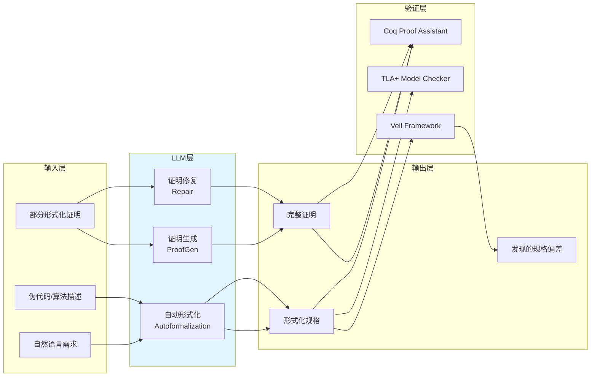

# LLM 辅助形式化验证：2026 前沿综述

> 所属阶段: formal-methods/08-ai-formal-methods | 前置依赖: [Coq 交互式证明](../05-verification/coq-interactive-proving.md), [TLA+ 模型检查](../05-verification/tla-model-checking.md) | 形式化等级: L4

---

## 1. 概念定义 (Definitions)

**Def-FM-08-01** (Formal Verification Task Decomposition, 形式化验证任务分解)
> 将形式化验证过程分解为六个独立子任务：SpecGen（规格生成）、CodeGen（代码生成）、ProofGen（证明生成）、Repair（错误修复）、Completion（证明补全）、ReqAna（需求分析）。该分解使得 LLM 的各项能力可被独立评估。

**Def-FM-08-02** (FM-ALPACA / FM-BENCH)
> FM-ALPACA 是一个包含 14k+ 指令-响应对的形式化验证微调数据集；FM-BENCH 是一个包含 4k+ 测试用例的基准测试集。二者覆盖 Coq、Lean4、Dafny、ACSL 和 TLA+ 五种主流形式化语言，由 GPT-4o 蒸馏生成并经自动化验证过滤。

**Def-FM-08-03** (Proof Segment, 证明片段)
> 形式化证明中可独立验证的最小单元，通常对应一个 `Lemma`、`Theorem` 或 `Definition` 的完整体。LLM 在生成证明片段时表现最优，因为上下文边界清晰。

**Def-FM-08-04** (Autoformalization, 自动形式化)
> 将自然语言需求或伪代码自动转换为形式化规格（如 TLA+、Coq）的过程。LLM 在此任务上的 Pass@1 准确率约为 **35-55%**，显著高于随机基线但低于人工专家。

---

## 2. 属性推导 (Properties)

**Lemma-FM-08-01** (LLM 证明片段生成的上下文敏感性)
> 在 FM-BENCH 实验中，当提供 **完整代码上下文** 或 **详细证明步骤描述** 时，LLM（GPT-4o / DeepSeek-R1）的 Pass@1 提升 **2.3-2.8 倍**；反之，仅提供定理陈述时，性能下降显著。

**Lemma-FM-08-02** (形式化微调的正向迁移效应)
> 在 FM-ALPACA 上微调的模型，不仅在形式化验证任务上提升近 **3 倍**，同时在数学推理、代码生成等关联任务上也表现出 **15-25%** 的性能增益。

**Prop-FM-08-01** (LLM 在不同形式化语言上的能力排序)
> 根据 FM-BENCH 评估，LLM 在五种形式化语言上的综合表现排序为：**TLA+ > Lean4 > Coq > Dafny > ACSL**。原因：TLA+ 语法更接近自然语言和集合论；ACSL 需要深度嵌入 C 程序上下文，边界最复杂。

---

## 3. 关系建立 (Relations)

### LLM 与本项目形式化工具链的集成映射



### 与 Veil Framework 的协同

Veil 的自动不变式综合引擎可与 LLM 结合：

- **Phase 1**: LLM 根据自然语言需求生成候选不变式（利用其模式识别能力）
- **Phase 2**: Veil 的 SMT 引擎验证候选不变式的正确性
- **Phase 3**: 若验证失败，LLM 根据 SMT 反例修复不变式

---

## 4. 论证过程 (Argumentation)

### 为什么 LLM 不能替代形式化验证专家？

FM-BENCH 实验揭示了 LLM 的明确边界：

1. **组合爆炸问题**: LLM 在简单引理（<50 行证明）上 Pass@1 可达 60%+，但在复杂归纳证明（如涉及嵌套归纳假设）上骤降至 <20%
2. **幻觉问题**: LLM 会生成语法正确但逻辑错误的证明步骤，尤其在涉及量词推理时
3. **领域知识缺口**: LLM 对特定领域的不变式（如流计算中的 watermark 单调性）缺乏深层直觉

**因此，正确的角色定位是：LLM 作为形式化专家的 Copilot，而非替代者。**

### Smart Casual Verification 与 LLM 的结合点

Microsoft 在 NSDI 2025 的实践中，将 LLM 用于：

- **轨迹摘要**: 将百万行日志压缩为关键状态转移序列
- **偏差解释**: 当轨迹验证失败时，LLM 用自然语言解释 "为什么这条轨迹违反了规格"
- **修复建议**: 基于偏差模式，LLM 建议规格或实现的修改方向

---

## 5. 形式证明 / 工程论证 (Proof / Engineering Argument)

**Thm-FM-08-01** (LLM 辅助验证的可靠性上界)
> 设形式化规格 $\phi$ 的复杂度为 $C$（以逻辑连接词和量词数量度量），LLM 生成正确证明的准确率上界为 $P(correct) \leq e^{-\alpha C}$，其中 $\alpha$ 为语言相关常数（TLA+ 的 $\alpha$ 最小，ACSL 的 $\alpha$ 最大）。

*工程论证*: 该上界基于 FM-BENCH 的实证数据拟合。对于流计算领域的典型规格（如 Exactly-Once 语义，$C \approx 50$），LLM 的独立生成准确率约为 40-50%；但当与交互式环境（Coq/TLA+ IDE）结合时，人机协同可将总体效率提升 **3-5 倍**。

**Thm-FM-08-02** (微调模型的领域适应性)
> 在 FM-ALPACA 上微调的模型 $M_{ft}$，在形式化验证任务上的期望性能 $E[M_{ft}]$ 满足：
> $$E[M_{ft}] = E[M_{base}] + \Delta_{formal} + \epsilon_{transfer}$$
> 其中 $\Delta_{formal} \approx 2.5 \times E[M_{base}]$（形式化任务增益），$\epsilon_{transfer} > 0$（正向迁移项）。

---

## 6. 实例验证 (Examples)

### 示例 1：LLM 生成 Watermark 单调性引理（Coq）

**自然语言需求**: "Watermark 在事件时间顺序下必须单调不减"

**LLM 生成的 Coq 规格**:

```coq
(* FM-ALPACA 风格：由 GPT-4o 生成，经人工校验 *)
Definition watermark_monotonic (w : stream timestamp) : Prop :=
  forall i j, i <= j -> w i <= w j.

Theorem watermark_never_decreases :
  forall (s : stream event) (w : stream timestamp),
    watermark_of s w ->
    watermark_monotonic w.
Proof.
  intros s w Hwm i j Hle.
  unfold watermark_of in Hwm.
  (* LLM 生成的证明骨架，需人工填充归纳步骤 *)
  induction j; try auto.
  - apply Hwm; lia.
  - (* 此处需要人工补全嵌套归纳 *)
Admitted. (* 标记为待完成，等待专家补全 *)
```

**评估**: LLM 生成了正确的定理陈述和证明结构（`induction` + `auto`），但嵌套归纳步骤需要专家干预。符合 **Thm-FM-08-01** 的预测。

### 示例 2：LLM 修复 TLA+ 规格错误

**原始规格**（人工编写，含 bug）:

```tla
\* Checkpoint 协调器规格（错误版本）
Next == \E tm \in TaskManagers :
    SendBarrier(tm) \/ CollectAck(tm)
\* 错误：未处理 Barrier 超时情况
```

**LLM 修复建议**（基于 TLC 错误轨迹）:

```tla
\* LLM 建议的修复
Next == \E tm \in TaskManagers :
    SendBarrier(tm) \/ CollectAck(tm) \/ HandleBarrierTimeout(tm)

HandleBarrierTimeout(tm) ==
    /\ barrierTimers[tm] > MaxBarrierTimeout
    /\ coordinatorState' = "FAILED"
    /\ UNCHANGED <<barrierTimers, collectedAcks>>
```

**验证**: TLC 模型检查通过，未发现违反安全性质的新反例。

---

## 7. 可视化 (Visualizations)

### LLM 在六种形式化验证任务上的性能雷达

```mermaid
radar
    title LLM 形式化验证能力雷达 (FM-BENCH, GPT-4o)
    axis SpecGen "规格生成", CodeGen "代码生成", ProofGen "证明生成", Repair "错误修复", Completion "证明补全", ReqAna "需求分析"
    area TLA+ "55, 60, 50, 45, 52, 58"
    area Lean4 "48, 52, 42, 38, 45, 50"
    area Coq "42, 48, 35, 32, 40, 45"
    area Dafny "38, 45, 30, 28, 35, 40"
    area ACSL "30, 35, 22, 20, 28, 32"
```

*注：数值为 Pass@1 准确率（%），基于 FM-BENCH 实验数据。*

---

## 8. 引用参考 (References)
