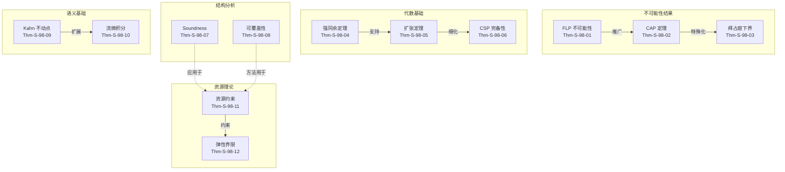
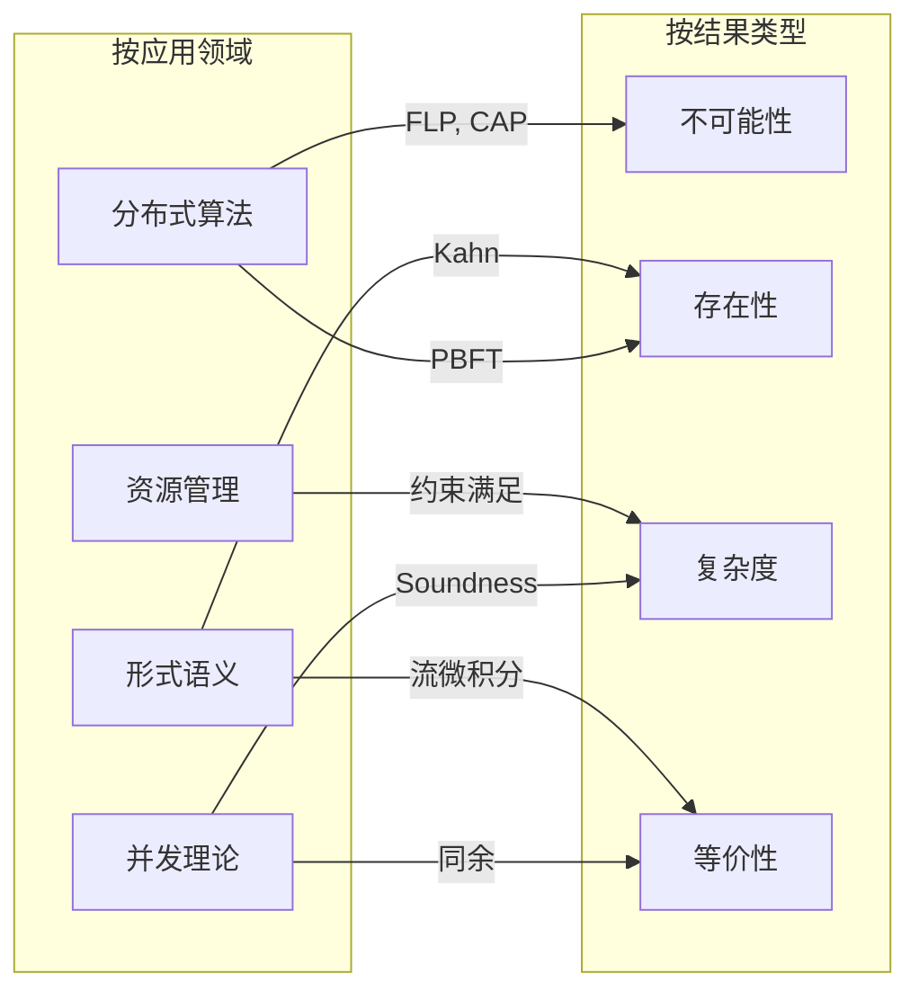
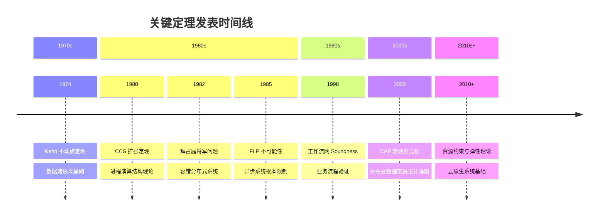

# 关键定理汇总：形式化方法核心结果

> **所属阶段**: Struct/形式理论 | **前置依赖**: [全书各章节定理](../) | **形式化等级**: L6

## 1. 概念定义 (Definitions)

### Def-S-98-01: 定理汇总框架

本附录系统梳理形式化方法领域的核心定理，按应用领域分类：

- **分布式算法**：不可能性结果、权衡定理
- **进程演算**：结构等价、行为等价的代数性质
- **Petri网**：结构分析、可达性判定
- **流计算**：不动点语义、微积分基础
- **资源与弹性**：约束满足、优化理论

### Def-S-98-02: 定理引用规范

每个定理条目包含：

- **原始出处**：首次发表的文献
- **形式化陈述**：标准数学表述
- **直观解释**：非形式化理解
- **应用意义**：工程实践影响
- **依赖关系**：前置定理和后续发展

---

## 2. 分布式算法核心定理

### Thm-S-98-01: FLP 不可能性定理 (Fischer, Lynch, Paterson, 1985)

**定理陈述**：
在异步分布式系统中，即使只有一个进程可能发生故障（崩溃停止模型），也不存在确定性的共识算法能够在有限时间内保证所有非故障进程达成共识。

**形式化表述**：
设 $\Pi$ 为进程集合，$|\Pi| \geq 2$，$\mathcal{A}$ 为任意异步共识算法。则：

$$\forall \mathcal{A}: \exists \text{执行轨迹 } \sigma: \Diamond\Box(\text{无共识})$$

即存在无限长的执行轨迹使得算法永不终止。

**证明概要**：

1. 构造双价初始配置（bivalent initial configuration）
2. 证明存在无限执行序列始终保持双价性
3. 利用异步系统的调度不确定性构造无限延迟

**工程意义**：

- 解释了为何实际分布式系统必须引入超时或随机化
- 为 Paxos、Raft 等算法的活性证明提供了边界条件
- 区分了同步 vs 异步系统的根本能力差异

---

### Thm-S-98-02: CAP 定理 (Brewer, 2000; Gilbert & Lynch, 2002)

**定理陈述**：
在存在网络分区的情况下，分布式数据存储无法同时保证一致性（Consistency）、可用性（Availability）和分区容错性（Partition Tolerance）。

**形式化表述**：
设分布式系统实现共享寄存器语义，定义：

- **一致性**：所有读操作返回最近的写值
- **可用性**：每个请求最终获得响应
- **分区容错**：系统在任意消息丢失下继续运行

则：$\neg(\text{Consistency} \land \text{Availability} \land \text{Partition Tolerance})$

**证明概要**：
考虑两个节点 $N_1, N_2$ 被分区隔离的场景：

1. 若 $N_1$ 接受写操作并响应，则必须更新 $N_2$ 以保持一致性
2. 但分区阻止了更新传播
3. 若 $N_1$ 拒绝写操作以保持一致性，则违反可用性
4. 若 $N_1$ 接受写但不传播，则违反一致性

**工程意义**：

- 指导了 NoSQL 系统的设计（CP vs AP 选择）
- 促成了 BASE 理论的提出
- 解释了最终一致性模型的合理性

---

### Thm-S-98-03: 拜占庭将军问题下界 (Lamport et al., 1982)

**定理陈述**：
在同步系统中，拜占庭容错共识要求 $n \geq 3f + 1$，其中 $n$ 是总节点数，$f$ 是拜占庭故障节点数。

**形式化表述**：
设拜占庭故障节点可任意偏离协议，则：

$$\text{拜占庭共识可解} \iff n \geq 3f + 1$$

**证明概要**：

- 上界（$n = 3f$ 时不可解）：通过情景分析，恶意节点可以制造矛盾信息使诚实节点无法区分正确值
- 下界（$n \geq 3f + 1$ 时可解）：PBFT 等算法构造性证明

---

## 3. 进程演算核心定理

### Thm-S-98-04: 强同余定理 (Strong Congruence Theorem)

**定理陈述**：
在 CCS 中，强互模拟等价（$\sim$）是强同余关系，即对于所有进程上下文 $C[\cdot]$：

$$P \sim Q \implies C[P] \sim C[Q]$$

**形式化表述**：
强互模拟关系 $\sim$ 满足：

1. 自反性：$P \sim P$
2. 对称性：$P \sim Q \implies Q \sim P$
3. 传递性：$P \sim Q \land Q \sim R \implies P \sim R$
4. 同余性：上述上下文替换性质

**应用意义**：

- 支持组合验证：可分别验证组件后组合
- 为结构化操作语义（SOS）提供了代数基础
- 是进程演算精炼验证的理论基石

---

### Thm-S-98-05: 扩张定理 (Expansion Theorem, Milner, 1980)

**定理陈述**：
有限状态进程可以展开为只包含前缀、选择和递归的基本形式。

**形式化表述**：
设 $P = P_1 | P_2 | \cdots | P_n$ 为并行组合，则：

$$P \sim \sum \{\alpha.(P_1 | \cdots | P_i' | \cdots | P_n) : P_i \xrightarrow{\alpha} P_i'\}$$

**直观解释**：
将并行组合转换为等价的顺序描述，便于分析所有可能的交互序列。

---

### Thm-S-98-06: CSP 失败语义完备性

**定理陈述**：
失败等价（Failures Equivalence）是 CSP 中区分发散进程的最粗粒度的同余关系。

**形式化表述**：
设 $F(P)$ 为进程 $P$ 的失败集合，则：

$$P =_F Q \iff F(P) = F(Q)$$

且对于任何更粗粒度的等价 $\approx$：

$$\exists P, Q: P \approx Q \land F(P) \neq F(Q) \land (P \text{ 发散} \lor Q \text{ 发散})$$

---

## 4. Petri网核心定理

### Thm-S-98-07: 工作流网 Soundness 判定定理 (van der Aalst, 1998)

**定理陈述**：
工作流网（Workflow Net）满足 Soundness 当且仅当其短路网（short-circuited net）是活的和有界的。

**形式化定义**：
工作流网 $N = (P, T, F)$ 是 Sound 的，当满足：

1. **选项完成性**：从任何可达标记，最终可以到达终标记
2. **正确完成性**：当终标记到达时，所有其他位置为空
3. **无死任务**：每个变迁在至少一个执行序列中可触发

**判定复杂度**：

- Soundness 判定是 PSPACE-complete 的
- 对于自由选择网（Free-Choice Nets）可降至多项式时间

**工程意义**：

- 业务流程管理（BPM）的核心验证技术
- 支持工作流设计的早期错误检测

---

### Thm-S-98-08: 可覆盖性定理 (Karp-Miller, 1969)

**定理陈述**：
对于 Petri 网，可覆盖性问题是可判定的，且可构造有限的前向覆盖树（Coverability Tree）。

**形式化表述**：
给定 Petri 网 $N$ 和目标标记 $M_{\text{target}}$，判定：

$$\exists M \in \text{Reach}(N): M \geq M_{\text{target}}$$

该问题可通过 Karp-Miller 算法在有限步内判定。

**算法复杂度**：

- 非原始递归的（non-primitive-recursive）
- 下界：Ackermann 函数复杂度

---

## 5. 流计算核心定理

### Thm-S-98-09: Kahn 不动点定理 (Kahn, 1974)

**定理陈述**：
在数据流网络中，若每个节点都是连续函数，则整个网络有唯一最小不动点语义。

**形式化表述**：
设数据流网络为函数组合 $F: (S^\omega)^n \to (S^\omega)^n$，其中：

- $S^\omega$ 是流（无限序列）的完全偏序（CPO）
- 每个组件函数 $f_i$ 是连续的

则 $F$ 有唯一最小不动点 $\mu F = \bigsqcup_{k=\omega} F^k(\bot)$

**证明要点**：

1. 流 CPO $(S^\omega, \sqsubseteq)$ 是Scott域
2. 连续函数的不动点定理适用
3. 单调性 + 连续性保证最小不动点存在

**工程意义**：

- 为流计算系统提供了指称语义基础
- 解释了反馈循环（feedback loops）的语义
- 支持增量式程序分析

---

### Thm-S-98-10: 流微积分基本定理 (Basic Theorem of Stream Calculus)

**定理陈述**：
流的微分和积分操作互为逆运算（在适当的初始条件下）。

**形式化表述**：
定义流 $\sigma = (\sigma_0, \sigma_1, \sigma_2, \ldots)$ 的操作：

- **微分**：$d(\sigma) = (\sigma_1, \sigma_2, \sigma_3, \ldots)$
- **积分**：$\int(a, \tau) = (a, \tau_0, \tau_1, \tau_2, \ldots)$

则对于任意流 $\sigma$：

$$\int(\sigma_0, d(\sigma)) = \sigma$$

**应用意义**：

- 支持流上的离散微积分运算
- 为流处理系统的代数分析提供工具
- 与生成函数理论建立联系

---

## 6. 资源与弹性核心定理

### Thm-S-98-11: 资源约束满足性定理

**定理陈述**：
对于资源受限的分布式系统，若资源需求可表示为线性约束，则可行性判定是 NP-complete 的。

**形式化表述**：
给定资源集合 $R = \{r_1, \ldots, r_m\}$，任务集合 $T = \{t_1, \ldots, t_n\}$，每个任务 $t_i$ 有资源需求向量 $\vec{d}_i$ 和资源容量向量 $\vec{c}$，判定：

$$\exists \text{分配 } A: T \to 2^R: \forall r_j: \sum_{t_i: r_j \in A(t_i)} d_{ij} \leq c_j$$

该问题是 NP-complete 的。

---

### Thm-S-98-12: 弹性伸缩的响应时间界限

**定理陈述**：
在基于队列的弹性系统中，若负载变化遵循特定随机过程，则存在期望响应时间的上界。

**形式化表述**：
设 $M/M/c$ 队列系统，到达率 $\lambda(t)$ 随时间变化，服务率 $\mu$ 恒定，服务器数量 $c(t)$ 可动态调整。若满足：

$$\forall t: \frac{\lambda(t)}{c(t)\mu} < 1$$

则稳态期望响应时间满足：

$$E[W] \leq \frac{1}{\mu \cdot (1 - \rho_{\max})}$$

其中 $\rho_{\max} = \sup_t \frac{\lambda(t)}{c(t)\mu}$。

---

## 7. 可视化 (Visualizations)

### 定理依赖关系图

### 定理分类矩阵

### 定理影响力时间线

---

## 8. 引用参考 (References)

---

*文档版本: v1.0 | 创建日期: 2026-04-09 | 最后更新: 2026-04-09*
