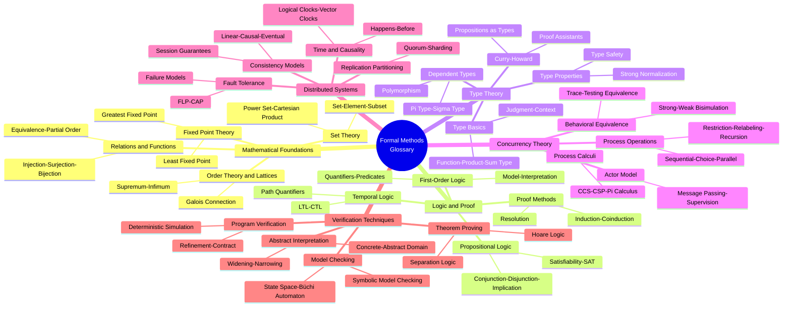
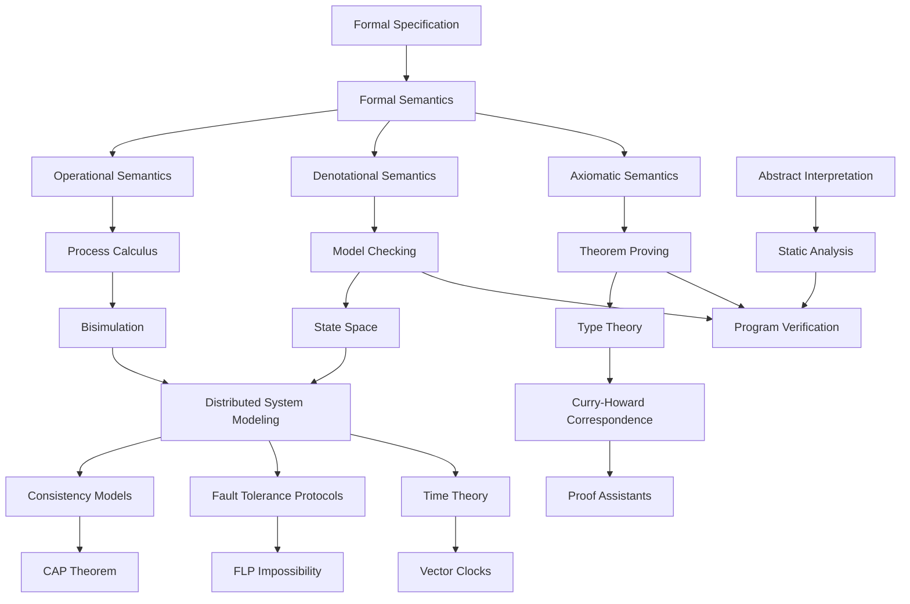

# Glossary: Formal Methods and Distributed Systems

> **Stage**: Struct/Formal Theory | **Prerequisites**: [All Chapters](../) | **Formalization Level**: L1-L2
> **Term Count**: 150+ | **Version**: v2.0 | **Last Updated**: 2026-04-10
> **Language**: English | **Corresponding Chinese Version**: [02-glossary.md](./02-glossary.md)

---

## Table of Contents

- [1. Mathematical Foundations](#1-mathematical-foundations)
  - [1.1 Set Theory](#11-set-theory)
  - [1.2 Relations and Functions](#12-relations-and-functions)
  - [1.3 Order Theory and Lattices](#13-order-theory-and-lattices)
  - [1.4 Fixed Point Theory](#14-fixed-point-theory)
- [2. Logic and Proof Terms](#2-logic-and-proof-terms)
  - [2.1 Propositional Logic](#21-propositional-logic)
  - [2.2 First-Order Logic](#22-first-order-logic)
  - [2.3 Proof Methods](#23-proof-methods)
  - [2.4 Temporal Logic](#24-temporal-logic)
- [3. Type Theory Terms](#3-type-theory-terms)
  - [3.1 Type Basics](#31-type-basics)
  - [3.2 Dependent Types and Higher-Order Types](#32-dependent-types-and-higher-order-types)
  - [3.3 Type System Properties](#33-type-system-properties)
  - [3.4 Curry-Howard Correspondence](#34-curry-howard-correspondence)
- [4. Concurrency Theory Terms](#4-concurrency-theory-terms)
  - [4.1 Process Calculi](#41-process-calculi)
  - [4.2 Process Operations](#42-process-operations)
  - [4.3 Behavioral Equivalences](#43-behavioral-equivalences)
  - [4.4 Actor Model](#44-actor-model)
- [5. Distributed Systems Terms](#5-distributed-systems-terms)
  - [5.1 Consistency Models](#51-consistency-models)
  - [5.2 Fault Tolerance and Consensus](#52-fault-tolerance-and-consensus)
  - [5.3 Time and Causality](#53-time-and-causality)
  - [5.4 Replication and Partitioning](#54-replication-and-partitioning)
- [6. Verification Techniques Terms](#6-verification-techniques-terms)
  - [6.1 Model Checking](#61-model-checking)
  - [6.2 Theorem Proving](#62-theorem-proving)
  - [6.3 Abstract Interpretation](#63-abstract-interpretation)
  - [6.4 Program Verification and Testing](#64-program-verification-and-testing)
- [7. Notation Reference](#7-notation-reference)
  - [7.1 Logical Symbols](#71-logical-symbols)
  - [7.2 Temporal Logic Symbols](#72-temporal-logic-symbols)
  - [7.3 Set and Relation Symbols](#73-set-and-relation-symbols)
  - [7.4 Process Calculus Symbols](#74-process-calculus-symbols)
  - [7.5 Distributed Systems Symbols](#75-distributed-systems-symbols)
- [8. Visualizations](#8-visualizations)
- [9. Alphabetical Index](#9-alphabetical-index)
- [10. References](#10-references)

---

## 1. Mathematical Foundations

### 1.1 Set Theory

#### Set

- **English**: Set
- **Chinese**: 集合
- **Abbreviation**: —
- **Symbol**: $A, B, S$
- **Definition**: A collection of distinct, well-defined objects; fundamental structure in mathematics
- **Related Definitions**: Def-S-01-01
- **First Appearance**: [01-order-theory.md](../../01-foundations/01-order-theory.md)
- **Cross-references**: [Element](#element), [Subset](#subset), [Power Set](#power-set)

#### Element

- **English**: Element / Member
- **Chinese**: 元素 / 成员
- **Abbreviation**: —
- **Symbol**: $
- **Definition**: A single object belonging to a set
- **Related Definitions**: Def-S-01-02
- **First Appearance**: [01-order-theory.md](../../01-foundations/01-order-theory.md)

#### Subset

- **English**: Subset
- **Chinese**: 子集
- **Abbreviation**: —
- **Symbol**: $
- **Definition**: Set A is a subset of B if and only if every element of A belongs to B
- **Related Theorems**: Thm-S-01-01 (Transitivity)
- **First Appearance**: [01-order-theory.md](../../01-foundations/01-order-theory.md)
- **Cross-references**: [Proper Subset](#proper-subset), [Power Set](#power-set)

#### Proper Subset

- **English**: Proper Subset
- **Chinese**: 真子集
- **Abbreviation**: —
- **Symbol**: $
- **Definition**: A is a subset of B and A is not equal to B
- **First Appearance**: [01-order-theory.md](../../01-foundations/01-order-theory.md)

#### Power Set

- **English**: Power Set
- **Chinese**: 幂集
- **Abbreviation**: —
- **Symbol**: $\mathcal{P}(A)$ or $2^A$
- **Definition**: The set of all subsets of A
- **Related Theorems**: Thm-S-01-02 ($|\mathcal{P}(A)| = 2^{|A|}$)
- **First Appearance**: [01-order-theory.md](../../01-foundations/01-order-theory.md)

#### Union

- **English**: Union
- **Chinese**: 并集
- **Abbreviation**: —
- **Symbol**: $
- **Definition**: The set of all elements belonging to A or B
- **Related Theorems**: Thm-S-01-03 (Commutativity, Associativity)
- **First Appearance**: [01-order-theory.md](../../01-foundations/01-order-theory.md)

#### Intersection

- **English**: Intersection
- **Chinese**: 交集
- **Abbreviation**: —
- **Symbol**: $
- **Definition**: The set of elements belonging to both A and B
- **First Appearance**: [01-order-theory.md](../../01-foundations/01-order-theory.md)

#### Difference

- **English**: Difference / Relative Complement
- **Chinese**: 差集 / 相对补集
- **Abbreviation**: —
- **Symbol**: $\setminus$ or $-$
- **Definition**: The set of elements in A but not in B
- **First Appearance**: [01-order-theory.md](../../01-foundations/01-order-theory.md)

#### Complement

- **English**: Complement
- **Chinese**: 补集 / 绝对补集
- **Abbreviation**: —
- **Symbol**: $A^c$ or $\overline{A}$
- **Definition**: All elements in the universal set U that are not in A
- **First Appearance**: [01-order-theory.md](../../01-foundations/01-order-theory.md)

#### Cartesian Product

- **English**: Cartesian Product
- **Chinese**: 笛卡尔积
- **Abbreviation**: —
- **Symbol**: $
- **Definition**: Set of ordered pairs $(a,b)$ where $a \in A, b \in B$
- **First Appearance**: [01-order-theory.md](../../01-foundations/01-order-theory.md)
- **Cross-references**: [Relation](#relation), [Function](#function)

---

### 1.2 Relations and Functions

#### Relation

- **English**: Relation
- **Chinese**: 关系
- **Abbreviation**: —
- **Symbol**: $R \subseteq A \times B$
- **Definition**: A subset of the Cartesian product between sets, representing some connection between elements
- **First Appearance**: [01-order-theory.md](../../01-foundations/01-order-theory.md)
- **Cross-references**: [Equivalence Relation](#equivalence-relation), [Partial Order](#partial-order)

#### Function / Mapping

- **English**: Function / Mapping
- **Chinese**: 函数 / 映射
- **Abbreviation**: —
- **Symbol**: $f: A \to B$
- **Definition**: A special binary relation where each element of A maps to exactly one element of B
- **Related Definitions**: Def-S-01-10
- **First Appearance**: [01-order-theory.md](../../01-foundations/01-order-theory.md)

#### Injection

- **English**: Injection / One-to-one
- **Chinese**: 单射 / 入射
- **Abbreviation**: —
- **Definition**: Different inputs map to different outputs: $f(a) = f(b) \Rightarrow a = b$
- **First Appearance**: [01-order-theory.md](../../01-foundations/01-order-theory.md)

#### Surjection

- **English**: Surjection / Onto
- **Chinese**: 满射 / 上映射
- **Abbreviation**: —
- **Definition**: Every element in B has a preimage: $\forall b \in B, \exists a: f(a) = b$
- **First Appearance**: [01-order-theory.md](../../01-foundations/01-order-theory.md)

#### Bijection

- **English**: Bijection
- **Chinese**: 双射 / 一一对应
- **Abbreviation**: —
- **Definition**: A function that is both injective and surjective
- **Related Theorems**: Thm-S-01-05 (Existence of inverse function)
- **First Appearance**: [01-order-theory.md](../../01-foundations/01-order-theory.md)

#### Equivalence Relation

- **English**: Equivalence Relation
- **Chinese**: 等价关系
- **Abbreviation**: —
- **Definition**: A relation satisfying reflexivity, symmetry, and transitivity
- **Related Definitions**: Def-S-01-15
- **First Appearance**: [01-order-theory.md](../../01-foundations/01-order-theory.md)
- **Cross-references**: [Equivalence Class](#equivalence-class), [Quotient Set](#quotient-set)

#### Equivalence Class

- **English**: Equivalence Class
- **Chinese**: 等价类
- **Abbreviation**: —
- **Symbol**: $[a]_R$
- **Definition**: The set of all elements equivalent to a
- **First Appearance**: [01-order-theory.md](../../01-foundations/01-order-theory.md)

#### Quotient Set

- **English**: Quotient Set
- **Chinese**: 商集
- **Abbreviation**: —
- **Symbol**: $A/R$
- **Definition**: The set of all equivalence classes
- **First Appearance**: [01-order-theory.md](../../01-foundations/01-order-theory.md)

#### Partial Order

- **English**: Partial Order
- **Chinese**: 偏序关系
- **Abbreviation**: —
- **Definition**: A relation satisfying reflexivity, antisymmetry, and transitivity
- **First Appearance**: [01-order-theory.md](../../01-foundations/01-order-theory.md)
- **Cross-references**: [Total Order](#total-order), [Hasse Diagram](#hasse-diagram)

#### Total Order

- **English**: Total Order / Linear Order
- **Chinese**: 全序关系 / 线性序
- **Abbreviation**: —
- **Definition**: A partial order where any two elements are comparable
- **First Appearance**: [01-order-theory.md](../../01-foundations/01-order-theory.md)

---

### 1.3 Order Theory and Lattices

#### Poset

- **English**: Partially Ordered Set (Poset)
- **Chinese**: 偏序集
- **Abbreviation**: Poset
- **Definition**: A set equipped with a partial order relation $(P, \leq)$
- **First Appearance**: [01-order-theory.md](../../01-foundations/01-order-theory.md)

#### Supremum

- **English**: Supremum / Least Upper Bound
- **Chinese**: 上确界 / 最小上界
- **Abbreviation**: sup / LUB
- **Symbol**: $\sup$ or $\bigvee$
- **Definition**: The smallest element that is greater than or equal to all elements of a subset
- **First Appearance**: [01-order-theory.md](../../01-foundations/01-order-theory.md)

#### Infimum

- **English**: Infimum / Greatest Lower Bound
- **Chinese**: 下确界 / 最大下界
- **Abbreviation**: inf / GLB
- **Symbol**: $\inf$ or $\bigwedge$
- **Definition**: The greatest element that is less than or equal to all elements of a subset
- **First Appearance**: [01-order-theory.md](../../01-foundations/01-order-theory.md)

#### Lattice

- **English**: Lattice
- **Chinese**: 格
- **Abbreviation**: —
- **Definition**: A poset where any two elements have a supremum and an infimum
- **Related Theorems**: Thm-S-01-08 (Algebraic definition of lattices)
- **First Appearance**: [01-order-theory.md](../../01-foundations/01-order-theory.md)
- **Cross-references**: [Complete Lattice](#complete-lattice), [Distributive Lattice](#distributive-lattice)

#### Complete Lattice

- **English**: Complete Lattice
- **Chinese**: 完全格
- **Abbreviation**: —
- **Definition**: A lattice where every subset has a supremum and an infimum
- **Related Theorems**: Thm-S-01-09 (Knaster-Tarski Theorem)
- **First Appearance**: [01-order-theory.md](../../01-foundations/01-order-theory.md)

#### Distributive Lattice

- **English**: Distributive Lattice
- **Chinese**: 分配格
- **Abbreviation**: —
- **Definition**: A lattice satisfying distributive law: $a \wedge (b \vee c) = (a \wedge b) \vee (a \wedge c)$
- **First Appearance**: [01-order-theory.md](../../01-foundations/01-order-theory.md)

#### Hasse Diagram

- **English**: Hasse Diagram
- **Chinese**: Hasse图
- **Abbreviation**: —
- **Definition**: A simplified diagram representing a poset, omitting self-loops and transitive edges
- **First Appearance**: [01-order-theory.md](../../01-foundations/01-order-theory.md)

#### Galois Connection

- **English**: Galois Connection
- **Chinese**: Galois连接
- **Abbreviation**: —
- **Symbol**: $(\alpha, \gamma)$
- **Definition**: A pair of monotone functions between posets satisfying specific adjoint conditions
- **Related Theorems**: Thm-S-05-12 (Foundation of Abstract Interpretation)
- **First Appearance**: [01-order-theory.md](../../01-foundations/01-order-theory.md)
- **Cross-references**: [Abstract Interpretation](#abstract-interpretation)

---

### 1.4 Fixed Point Theory

#### Fixed Point

- **English**: Fixed Point
- **Chinese**: 不动点
- **Abbreviation**: FP
- **Definition**: A point satisfying $f(x) = x$
- **Related Theorems**: Thm-S-01-10 (Banach Fixed Point Theorem)
- **First Appearance**: [04-domain-theory.md](../../01-foundations/04-domain-theory.md)

#### Least Fixed Point

- **English**: Least Fixed Point
- **Chinese**: 最小不动点
- **Abbreviation**: LFP
- **Symbol**: $\text{lfp}(f)$
- **Definition**: The smallest among all fixed points
- **Related Theorems**: Thm-S-01-11 (Kleene's Theorem)
- **First Appearance**: [04-domain-theory.md](../../01-foundations/04-domain-theory.md)

#### Greatest Fixed Point

- **English**: Greatest Fixed Point
- **Chinese**: 最大不动点
- **Abbreviation**: GFP
- **Symbol**: $\text{gfp}(f)$
- **Definition**: The greatest among all fixed points
- **First Appearance**: [04-domain-theory.md](../../01-foundations/04-domain-theory.md)

---

## 2. Logic and Proof Terms

### 2.1 Propositional Logic

#### Proposition

- **English**: Proposition
- **Chinese**: 命题
- **Abbreviation**: —
- **Definition**: A declarative sentence with a definite truth value
- **Related Definitions**: Def-S-02-01
- **First Appearance**: [03-logic-foundations.md](../../01-foundations/03-logic-foundations.md)

#### Conjunction

- **English**: Conjunction / AND
- **Chinese**: 合取 / 逻辑与
- **Abbreviation**: —
- **Symbol**: $\land$
- **Definition**: True when both propositions are true
- **First Appearance**: [03-logic-foundations.md](../../01-foundations/03-logic-foundations.md)

#### Disjunction

- **English**: Disjunction / OR
- **Chinese**: 析取 / 逻辑或
- **Abbreviation**: —
- **Symbol**: $\lor$
- **Definition**: True when at least one proposition is true
- **First Appearance**: [03-logic-foundations.md](../../01-foundations/03-logic-foundations.md)

#### Implication

- **English**: Implication
- **Chinese**: 蕴含 / 条件
- **Abbreviation**: —
- **Symbol**: $\Rightarrow$ or $\to$
- **Definition**: False when antecedent is true and consequent is false; otherwise true
- **First Appearance**: [03-logic-foundations.md](../../01-foundations/03-logic-foundations.md)

#### Equivalence

- **English**: Equivalence / Biconditional
- **Chinese**: 等价 / 双条件
- **Abbreviation**: —
- **Symbol**: $\Leftrightarrow$ or $\leftrightarrow$
- **Definition**: True when both sides have the same truth value
- **First Appearance**: [03-logic-foundations.md](../../01-foundations/03-logic-foundations.md)

#### Negation

- **English**: Negation / NOT
- **Chinese**: 否定 / 逻辑非
- **Abbreviation**: —
- **Symbol**: $\neg$ or $\sim$
- **Definition**: Truth value negation
- **First Appearance**: [03-logic-foundations.md](../../01-foundations/03-logic-foundations.md)

#### Tautology

- **English**: Tautology
- **Chinese**: 重言式 / 永真式
- **Abbreviation**: —
- **Definition**: A propositional formula true under all assignments
- **Related Theorems**: Thm-S-02-01 (Completeness)
- **First Appearance**: [03-logic-foundations.md](../../01-foundations/03-logic-foundations.md)

#### Contradiction

- **English**: Contradiction
- **Chinese**: 矛盾式 / 永假式
- **Abbreviation**: —
- **Definition**: A propositional formula false under all assignments
- **First Appearance**: [03-logic-foundations.md](../../01-foundations/03-logic-foundations.md)

#### Satisfiability

- **English**: Satisfiability
- **Chinese**: 可满足性
- **Abbreviation**: SAT
- **Definition**: There exists an assignment making the formula true
- **Related Theorems**: Thm-S-02-02 (SAT is NP-complete)
- **First Appearance**: [03-logic-foundations.md](../../01-foundations/03-logic-foundations.md)

#### Normal Form

- **English**: Normal Form
- **Chinese**: 范式
- **Abbreviation**: NF
- **Definition**: Standard form of formula representation
- **Categories**: [CNF](#conjunctive-normal-form), [DNF](#disjunctive-normal-form)
- **First Appearance**: [03-logic-foundations.md](../../01-foundations/03-logic-foundations.md)

---

### 2.2 First-Order Logic

#### Universal Quantifier

- **English**: Universal Quantifier
- **Chinese**: 全称量词
- **Abbreviation**: —
- **Symbol**: $\forall$
- **Definition**: "For all" — indicates all elements in the domain satisfy a property
- **First Appearance**: [03-logic-foundations.md](../../01-foundations/03-logic-foundations.md)

#### Existential Quantifier

- **English**: Existential Quantifier
- **Chinese**: 存在量词
- **Abbreviation**: —
- **Symbol**: $\exists$
- **Definition**: "There exists" — indicates at least one element in the domain satisfies a property
- **First Appearance**: [03-logic-foundations.md](../../01-foundations/03-logic-foundations.md)

#### Unique Existence

- **English**: Unique Existence
- **Chinese**: 唯一存在量词
- **Abbreviation**: —
- **Symbol**: $\exists!$
- **Definition**: "There exists a unique"
- **First Appearance**: [03-logic-foundations.md](../../01-foundations/03-logic-foundations.md)

#### Predicate

- **English**: Predicate
- **Chinese**: 谓词
- **Abbreviation**: —
- **Definition**: A truth-valued function with parameters
- **First Appearance**: [03-logic-foundations.md](../../01-foundations/03-logic-foundations.md)

#### Interpretation

- **English**: Interpretation
- **Chinese**: 解释 / 释义
- **Abbreviation**: —
- **Definition**: A mapping that gives concrete semantics to symbols
- **First Appearance**: [03-logic-foundations.md](../../01-foundations/03-logic-foundations.md)

#### Model

- **English**: Model
- **Chinese**: 模型
- **Abbreviation**: —
- **Symbol**: $\mathcal{M} \models \phi$
- **Definition**: An interpretation that makes a formula true
- **First Appearance**: [03-logic-foundations.md](../../01-foundations/03-logic-foundations.md)
- **Cross-references**: [Model Checking](#model-checking)

#### Validity

- **English**: Validity
- **Chinese**: 逻辑有效性
- **Abbreviation**: —
- **Symbol**: $\models \phi$
- **Definition**: True under all interpretations
- **First Appearance**: [03-logic-foundations.md](../../01-foundations/03-logic-foundations.md)

#### Consistency

- **English**: Consistency / Satisfiability
- **Chinese**: 一致性 / 相容性
- **Abbreviation**: —
- **Definition**: A set of formulas has a model (is satisfiable)
- **Related Theorems**: Thm-S-02-05 (Compactness Theorem)
- **First Appearance**: [03-logic-foundations.md](../../01-foundations/03-logic-foundations.md)

#### Completeness

- **English**: Completeness
- **Chinese**: 完备性
- **Abbreviation**: —
- **Definition**: All valid formulas are provable
- **Related Theorems**: Thm-S-02-06 (Gödel's Completeness Theorem)
- **First Appearance**: [03-logic-foundations.md](../../01-foundations/03-logic-foundations.md)

#### Deduction Theorem

- **English**: Deduction Theorem
- **Chinese**: 演绎定理
- **Abbreviation**: —
- **Definition**: $\Gamma \cup \{\phi\} \vdash \psi \Leftrightarrow \Gamma \vdash \phi \to \psi$
- **Related Theorems**: Thm-S-02-07
- **First Appearance**: [03-logic-foundations.md](../../01-foundations/03-logic-foundations.md)

---

### 2.3 Proof Methods

#### Natural Deduction

- **English**: Natural Deduction
- **Chinese**: 自然演绎
- **Abbreviation**: ND
- **Definition**: A proof system that mimics intuitive reasoning
- **First Appearance**: [05-verification/03-theorem-proving/01-coq-isabelle.md](../../05-verification/03-theorem-proving/01-coq-isabelle.md)

#### Sequent Calculus

- **English**: Sequent Calculus
- **Chinese**: 相继式演算
- **Abbreviation**: SC
- **Definition**: A proof system by Gentzen using sequents $\Gamma \vdash \Delta$
- **First Appearance**: [05-verification/03-theorem-proving/01-coq-isabelle.md](../../05-verification/03-theorem-proving/01-coq-isabelle.md)

#### Resolution

- **English**: Resolution
- **Chinese**: 归结原理
- **Abbreviation**: —
- **Definition**: Fundamental rule for automated theorem proving: $\frac{A \lor B, \neg B \lor C}{A \lor C}$
- **First Appearance**: [05-verification/03-theorem-proving/02-smt-solvers.md](../../05-verification/03-theorem-proving/02-smt-solvers.md)

#### Proof by Contradiction

- **English**: Proof by Contradiction / Reductio ad absurdum
- **Chinese**: 反证法 / 归谬法
- **Abbreviation**: —
- **Definition**: Assume the conclusion is false and derive a contradiction
- **First Appearance**: [05-verification/03-theorem-proving/01-coq-isabelle.md](../../05-verification/03-theorem-proving/01-coq-isabelle.md)

#### Mathematical Induction

- **English**: Mathematical Induction
- **Chinese**: 数学归纳法
- **Abbreviation**: MI
- **Definition**: Method for proving propositions about natural numbers: base case + inductive step
- **Related Theorems**: Thm-S-02-10 (Well-founded Induction Principle)
- **First Appearance**: [03-logic-foundations.md](../../01-foundations/03-logic-foundations.md)
- **Cross-references**: [Structural Induction](#structural-induction), [Coinduction](#coinduction)

#### Structural Induction

- **English**: Structural Induction
- **Chinese**: 结构归纳法
- **Abbreviation**: SI
- **Definition**: Induction applied over recursive data structures
- **First Appearance**: [03-logic-foundations.md](../../01-foundations/03-logic-foundations.md)

#### Coinduction

- **English**: Coinduction
- **Chinese**: 共归纳法
- **Abbreviation**: —
- **Definition**: Method for proving equivalence of infinite data structures
- **Related Theorems**: Thm-S-02-11 (Greatest Fixed Point Principle)
- **First Appearance**: [06-coalgebra-advanced.md](../../01-foundations/06-coalgebra-advanced.md)
- **Cross-references**: [Bisimulation](#bisimulation)

---

### 2.4 Temporal Logic

#### LTL (Linear Temporal Logic)

- **English**: Linear Temporal Logic
- **Chinese**: 线性时序逻辑
- **Abbreviation**: LTL
- **Definition**: Logic describing temporal properties along single paths
- **Related Definitions**: Def-S-02-50
- **First Appearance**: [05-verification/01-logic/01-tla-plus.md](../../05-verification/01-logic/01-tla-plus.md)
- **Cross-references**: [CTL](#ctl), [State Space](#state-space)

#### CTL (Computation Tree Logic)

- **English**: Computation Tree Logic
- **Chinese**: 计算树逻辑
- **Abbreviation**: CTL
- **Definition**: Logic quantifying temporal properties over all paths in the computation tree
- **First Appearance**: [05-verification/02-model-checking/01-explicit-state.md](../../05-verification/02-model-checking/01-explicit-state.md)

#### CTL* (Extended CTL)

- **English**: Extended Computation Tree Logic
- **Chinese**: 扩展计算树逻辑
- **Abbreviation**: CTL*
- **Definition**: Expressive superset of both LTL and CTL
- **First Appearance**: [05-verification/02-model-checking/01-explicit-state.md](../../05-verification/02-model-checking/01-explicit-state.md)

#### Globally

- **English**: Globally
- **Chinese**: 全局算子
- **Abbreviation**: G
- **Symbol**: $\Box$ or $\mathbf{G}$
- **Definition**: Holds in all future states
- **First Appearance**: [05-verification/01-logic/01-tla-plus.md](../../05-verification/01-logic/01-tla-plus.md)

#### Finally / Eventually

- **English**: Finally / Eventually
- **Chinese**: 最终算子
- **Abbreviation**: F
- **Symbol**: $\Diamond$ or $\mathbf{F}$
- **Definition**: Holds in some future state
- **First Appearance**: [05-verification/01-logic/01-tla-plus.md](../../05-verification/01-logic/01-tla-plus.md)

#### Next

- **English**: Next
- **Chinese**: 下一状态算子
- **Abbreviation**: X
- **Symbol**: $\bigcirc$ or $\mathbf{X}$
- **Definition**: Holds in the next state
- **First Appearance**: [05-verification/01-logic/01-tla-plus.md](../../05-verification/01-logic/01-tla-plus.md)

#### Until

- **English**: Until
- **Chinese**: 直到算子
- **Abbreviation**: U
- **Symbol**: $\mathcal{U}$
- **Definition**: Left side holds until right side holds
- **First Appearance**: [05-verification/01-logic/01-tla-plus.md](../../05-verification/01-logic/01-tla-plus.md)

#### Path Quantifiers

- **English**: Path Quantifiers
- **Chinese**: 路径量词
- **Abbreviation**: —
- **Symbol**: $\mathbf{A}$ (All), $\mathbf{E}$ (Exists)
- **Definition**: For all / there exists a path
- **First Appearance**: [05-verification/02-model-checking/01-explicit-state.md](../../05-verification/02-model-checking/01-explicit-state.md)

#### Fairness

- **English**: Fairness
- **Chinese**: 公平性
- **Abbreviation**: —
- **Definition**: System scheduling satisfies certain fairness constraints
- **Categories**: Weak Fairness, Strong Fairness
- **First Appearance**: [05-verification/02-model-checking/01-explicit-state.md](../../05-verification/02-model-checking/01-explicit-state.md)

---

## 3. Type Theory Terms

### 3.1 Type Basics

#### Type

- **English**: Type
- **Chinese**: 类型
- **Abbreviation**: —
- **Symbol**: $A, B, T$
- **Definition**: Classification of values determining what operations can be performed
- **Related Definitions**: Def-S-03-01
- **First Appearance**: [05-type-theory.md](../../01-foundations/05-type-theory.md)

#### Term

- **English**: Term
- **Chinese**: 项 / 项元
- **Abbreviation**: —
- **Definition**: An element or value within a type
- **First Appearance**: [05-type-theory.md](../../01-foundations/05-type-theory.md)

#### Judgment

- **English**: Judgment
- **Chinese**: 判断
- **Abbreviation**: —
- **Symbol**: $\Gamma \vdash t : A$
- **Definition**: In context $\Gamma$, term $t$ has type $A$
- **First Appearance**: [05-type-theory.md](../../01-foundations/05-type-theory.md)

#### Context

- **English**: Context / Environment
- **Chinese**: 上下文 / 环境
- **Abbreviation**: —
- **Symbol**: $\Gamma, \Delta$
- **Definition**: A sequence of variable declarations
- **First Appearance**: [05-type-theory.md](../../01-foundations/05-type-theory.md)

#### Typing Rule

- **English**: Typing Rule
- **Chinese**: 类型规则
- **Abbreviation**: —
- **Definition**: Inference rules for deriving the types of terms
- **First Appearance**: [05-type-theory.md](../../01-foundations/05-type-theory.md)

#### Function Type

- **English**: Function Type
- **Chinese**: 函数类型
- **Abbreviation**: —
- **Symbol**: $A \to B$
- **Definition**: Type of functions from A to B
- **First Appearance**: [05-type-theory.md](../../01-foundations/05-type-theory.md)

#### Product Type

- **English**: Product Type
- **Chinese**: 积类型 / 乘积类型
- **Abbreviation**: —
- **Symbol**: $A \times B$ or $(A, B)$
- **Definition**: Type of ordered pairs
- **First Appearance**: [05-type-theory.md](../../01-foundations/05-type-theory.md)

#### Sum Type

- **English**: Sum Type / Union Type
- **Chinese**: 和类型 / 联合类型
- **Abbreviation**: —
- **Symbol**: $A + B$ or $A | B$
- **Definition**: Type that is either A or B
- **First Appearance**: [05-type-theory.md](../../01-foundations/05-type-theory.md)

#### Unit Type

- **English**: Unit Type
- **Chinese**: 单元类型
- **Abbreviation**: —
- **Symbol**: $\mathbf{1}$ or $\text{unit}$
- **Definition**: Type with exactly one value
- **First Appearance**: [05-type-theory.md](../../01-foundations/05-type-theory.md)

#### Empty Type

- **English**: Empty Type
- **Chinese**: 空类型
- **Abbreviation**: —
- **Symbol**: $\mathbf{0}$ or $\text{void}$
- **Definition**: Type with no values
- **First Appearance**: [05-type-theory.md](../../01-foundations/05-type-theory.md)

---

### 3.2 Dependent Types and Higher-Order Types

#### Dependent Type

- **English**: Dependent Type
- **Chinese**: 依赖类型
- **Abbreviation**: DT
- **Definition**: Type system where types can depend on values
- **Related Definitions**: Def-S-03-15
- **First Appearance**: [05-type-theory.md](../../01-foundations/05-type-theory.md)

#### Pi Type / Dependent Function Type

- **English**: Dependent Function Type / Pi Type
- **Chinese**: 依赖函数类型 / Pi类型
- **Abbreviation**: —
- **Symbol**: $\Pi(x:A).B(x)$ or $(x:A) \to B(x)$
- **Definition**: Function type where return type depends on parameter value
- **First Appearance**: [05-type-theory.md](../../01-foundations/05-type-theory.md)

#### Sigma Type / Dependent Pair Type

- **English**: Dependent Pair Type / Sigma Type
- **Chinese**: 依赖对类型 / Sigma类型
- **Abbreviation**: —
- **Symbol**: $\Sigma(x:A).B(x)$
- **Definition**: Pair type where second component's type depends on first component
- **First Appearance**: [05-type-theory.md](../../01-foundations/05-type-theory.md)

#### Polymorphism

- **English**: Polymorphism
- **Chinese**: 多态
- **Abbreviation**: —
- **Definition**: Type abstraction allowing code to work with multiple types
- **Categories**: [Parametric Polymorphism](#parametric-polymorphism), [Subtyping Polymorphism](#subtyping), [Ad-hoc Polymorphism](#ad-hoc-polymorphism)
- **First Appearance**: [05-type-theory.md](../../01-foundations/05-type-theory.md)

#### Parametric Polymorphism

- **English**: Parametric Polymorphism
- **Chinese**: 参数多态
- **Abbreviation**: —
- **Definition**: Type parameterization, as in generics
- **First Appearance**: [05-type-theory.md](../../01-foundations/05-type-theory.md)

#### Type Constructor

- **English**: Type Constructor
- **Chinese**: 类型构造器
- **Abbreviation**: —
- **Definition**: Operations that construct new types from existing types
- **First Appearance**: [05-type-theory.md](../../01-foundations/05-type-theory.md)

#### Higher-Kinded Types

- **English**: Higher-Kinded Types
- **Chinese**: 高阶类型
- **Abbreviation**: HKT
- **Definition**: Types of type constructors
- **Symbol**: $* \to *$
- **First Appearance**: [05-type-theory.md](../../01-foundations/05-type-theory.md)

---

### 3.3 Type System Properties

#### Type Safety

- **English**: Type Safety
- **Chinese**: 类型安全
- **Abbreviation**: —
- **Definition**: Well-typed programs cannot go wrong
- **Related Theorems**: Thm-S-03-01 (Progress + Preservation)
- **First Appearance**: [05-type-theory.md](../../01-foundations/05-type-theory.md)

#### Progress

- **English**: Progress
- **Chinese**: 进展性
- **Abbreviation**: —
- **Definition**: Well-typed non-value terms can continue to reduce
- **Related Lemmas**: Lemma-S-03-01
- **First Appearance**: [05-type-theory.md](../../01-foundations/05-type-theory.md)

#### Preservation

- **English**: Preservation / Subject Reduction
- **Chinese**: 保持性 / 主题规约
- **Abbreviation**: —
- **Definition**: Reduction preserves types
- **Related Lemmas**: Lemma-S-03-02
- **First Appearance**: [05-type-theory.md](../../01-foundations/05-type-theory.md)

#### Strong Normalization

- **English**: Strong Normalization
- **Chinese**: 强规范化
- **Abbreviation**: SN
- **Definition**: All well-typed terms can reduce to normal form
- **Related Theorems**: Thm-S-03-05 (Girard's Theorem)
- **First Appearance**: [05-type-theory.md](../../01-foundations/05-type-theory.md)

#### Type Inference

- **English**: Type Inference
- **Chinese**: 类型推断
- **Abbreviation**: —
- **Definition**: Automatically deriving the types of terms
- **Related Theorems**: Thm-S-03-06 (Hindley-Milner Completeness)
- **First Appearance**: [05-type-theory.md](../../01-foundations/05-type-theory.md)

---

### 3.4 Curry-Howard Correspondence

#### Curry-Howard Isomorphism

- **English**: Curry-Howard Isomorphism / Propositions as Types
- **Chinese**: Curry-Howard同构 / 命题即类型
- **Abbreviation**: CHI
- **Definition**: Correspondence between propositions and types, proofs and programs, proof reduction and computation
- **Related Theorems**: Thm-S-03-10
- **First Appearance**: [05-type-theory.md](../../01-foundations/05-type-theory.md)
- **Cross-references**: [Proof Assistant](#proof-assistant)

#### Proofs as Programs

- **English**: Proofs as Programs
- **Chinese**: 证明即程序
- **Abbreviation**: —
- **Definition**: Constructing proofs is equivalent to writing programs
- **First Appearance**: [05-type-theory.md](../../01-foundations/05-type-theory.md)

#### Proof Assistant

- **English**: Proof Assistant / Interactive Theorem Prover
- **Chinese**: 证明助手 / 交互式定理证明器
- **Abbreviation**: ITP
- **Definition**: Software tools that assist in constructing formal proofs
- **Representatives**: Coq, Isabelle/HOL, Agda, Lean
- **First Appearance**: [05-verification/03-theorem-proving/01-coq-isabelle.md](../../05-verification/03-theorem-proving/01-coq-isabelle.md)

---

## 4. Concurrency Theory Terms

### 4.1 Process Calculi

#### Process

- **English**: Process
- **Chinese**: 进程
- **Abbreviation**: —
- **Symbol**: $P, Q, R$
- **Definition**: A computational entity with independent execution flow
- **Related Definitions**: Def-S-04-01
- **First Appearance**: [02-calculi/02-pi-calculus/01-pi-calculus-basics.md](../../02-calculi/02-pi-calculus/01-pi-calculus-basics.md)

#### CCS (Calculus of Communicating Systems)

- **English**: Calculus of Communicating Systems
- **Chinese**: 通信系统演算
- **Abbreviation**: CCS
- **Definition**: Process calculus by Milner based on labeled synchronization
- **First Appearance**: [03-model-taxonomy/02-computation-models/01-process-algebras.md](../../03-model-taxonomy/02-computation-models/01-process-algebras.md)

#### CSP (Communicating Sequential Processes)

- **English**: Communicating Sequential Processes
- **Chinese**: 通信顺序进程
- **Abbreviation**: CSP
- **Definition**: Process algebra by Hoare emphasizing synchronous communication
- **First Appearance**: [03-model-taxonomy/02-computation-models/01-process-algebras.md](../../03-model-taxonomy/02-computation-models/01-process-algebras.md)

#### ACP (Algebra of Communicating Processes)

- **English**: Algebra of Communicating Processes
- **Chinese**: 通信进程的代数
- **Abbreviation**: ACP
- **Definition**: Process algebra by Bergstra and Klop emphasizing algebraic methods
- **First Appearance**: [03-model-taxonomy/02-computation-models/01-process-algebras.md](../../03-model-taxonomy/02-computation-models/01-process-algebras.md)

#### Pi Calculus

- **English**: Pi Calculus / π-Calculus
- **Chinese**: π演算
- **Abbreviation**: —
- **Definition**: Process calculus supporting mobility, can describe topology changes
- **First Appearance**: [02-calculi/02-pi-calculus/01-pi-calculus-basics.md](../../02-calculi/02-pi-calculus/01-pi-calculus-basics.md)

#### Action

- **English**: Action
- **Chinese**: 动作
- **Abbreviation**: —
- **Symbol**: $\alpha, \beta, a, b$
- **Definition**: Atomic operations that a process can perform
- **Categories**: [Input](#input-action), [Output](#output-action), [Internal](#internal-action)
- **First Appearance**: [02-calculi/02-pi-calculus/01-pi-calculus-basics.md](../../02-calculi/02-pi-calculus/01-pi-calculus-basics.md)

#### Input Action

- **English**: Input Action
- **Chinese**: 输入动作
- **Abbreviation**: —
- **Symbol**: $a(x)$ or $c?x$
- **Definition**: Action receiving a value from a channel
- **First Appearance**: [02-calculi/02-pi-calculus/01-pi-calculus-basics.md](../../02-calculi/02-pi-calculus/01-pi-calculus-basics.md)

#### Output Action

- **English**: Output Action
- **Chinese**: 输出动作
- **Abbreviation**: —
- **Symbol**: $\bar{a}\langle v\rangle$ or $c!v$
- **Definition**: Action sending a value to a channel
- **First Appearance**: [02-calculi/02-pi-calculus/01-pi-calculus-basics.md](../../02-calculi/02-pi-calculus/01-pi-calculus-basics.md)

#### Internal Action

- **English**: Internal Action / Silent Action
- **Chinese**: 内部动作 / 静默动作
- **Abbreviation**: —
- **Symbol**: $\tau$
- **Definition**: Unobservable internal computation action
- **First Appearance**: [02-calculi/02-pi-calculus/01-pi-calculus-basics.md](../../02-calculi/02-pi-calculus/01-pi-calculus-basics.md)

#### Channel

- **English**: Channel
- **Chinese**: 通道
- **Abbreviation**: —
- **Symbol**: $a, b, c$
- **Definition**: Medium for inter-process communication
- **First Appearance**: [02-calculi/02-pi-calculus/01-pi-calculus-basics.md](../../02-calculi/02-pi-calculus/01-pi-calculus-basics.md)

---

### 4.2 Process Operations

#### Sequential Composition / Prefix

- **English**: Sequential Composition / Prefix
- **Chinese**: 顺序组合 / 前缀
- **Abbreviation**: —
- **Symbol**: $\alpha.P$ or $\cdot$
- **Definition**: First perform action $\alpha$, then behave as process $P$
- **First Appearance**: [02-calculi/02-pi-calculus/01-pi-calculus-basics.md](../../02-calculi/02-pi-calculus/01-pi-calculus-basics.md)

#### Choice

- **English**: Choice / Nondeterministic Choice
- **Chinese**: 选择 / 非确定性选择
- **Abbreviation**: —
- **Symbol**: $P + Q$
- **Definition**: Choose to execute either P or Q
- **First Appearance**: [02-calculi/02-pi-calculus/01-pi-calculus-basics.md](../../02-calculi/02-pi-calculus/01-pi-calculus-basics.md)

#### Parallel Composition

- **English**: Parallel Composition
- **Chinese**: 并行组合
- **Abbreviation**: —
- **Symbol**: $P \parallel Q$ or $P \mid Q$
- **Definition**: P and Q execute concurrently, can interact
- **First Appearance**: [02-calculi/02-pi-calculus/01-pi-calculus-basics.md](../../02-calculi/02-pi-calculus/01-pi-calculus-basics.md)

#### Restriction / Hiding

- **English**: Restriction / Hiding
- **Chinese**: 限制 / 隐藏
- **Abbreviation**: —
- **Symbol**: $P \setminus L$ or $(\nu a)P$
- **Definition**: Restrict process to communicate only on specific channels
- **First Appearance**: [02-calculi/02-pi-calculus/01-pi-calculus-basics.md](../../02-calculi/02-pi-calculus/01-pi-calculus-basics.md)

#### Relabeling / Renaming

- **English**: Relabeling / Renaming
- **Chinese**: 重标 / 重命名
- **Abbreviation**: —
- **Symbol**: $P[f]$ or $P[a/b]$
- **Definition**: Rename action names according to function f
- **First Appearance**: [02-calculi/02-pi-calculus/01-pi-calculus-basics.md](../../02-calculi/02-pi-calculus/01-pi-calculus-basics.md)

#### Recursion

- **English**: Recursion
- **Chinese**: 递归
- **Abbreviation**: —
- **Symbol**: $\text{rec } X.P$ or $\mu X.P$
- **Definition**: Define processes with infinite behavior
- **First Appearance**: [02-calculi/02-pi-calculus/01-pi-calculus-basics.md](../../02-calculi/02-pi-calculus/01-pi-calculus-basics.md)

---

### 4.3 Behavioral Equivalences

#### Bisimulation

- **English**: Bisimulation
- **Chinese**: 互模拟
- **Abbreviation**: —
- **Symbol**: $\sim$ (strong), $\approx$ (weak)
- **Definition**: Relation where two processes are behaviorally indistinguishable
- **Related Definitions**: Def-S-04-20
- **First Appearance**: [03-model-taxonomy/02-computation-models/01-process-algebras.md](../../03-model-taxonomy/02-computation-models/01-process-algebras.md)

#### Strong Bisimulation

- **English**: Strong Bisimulation
- **Chinese**: 强互模拟
- **Abbreviation**: —
- **Symbol**: $\sim$
- **Definition**: Requires each action to match precisely
- **Related Theorems**: Thm-S-04-01 (Congruence)
- **First Appearance**: [03-model-taxonomy/02-computation-models/01-process-algebras.md](../../03-model-taxonomy/02-computation-models/01-process-algebras.md)

#### Weak Bisimulation

- **English**: Weak Bisimulation / Observational Equivalence
- **Chinese**: 弱互模拟 / 观察等价
- **Abbreviation**: —
- **Symbol**: $\approx$
- **Definition**: Bisimulation ignoring internal $\tau$ actions
- **First Appearance**: [03-model-taxonomy/02-computation-models/01-process-algebras.md](../../03-model-taxonomy/02-computation-models/01-process-algebras.md)

#### Trace Equivalence

- **English**: Trace Equivalence
- **Chinese**: 迹等价
- **Abbreviation**: —
- **Definition**: Two processes have the same observable action sequences
- **First Appearance**: [03-model-taxonomy/02-computation-models/01-process-algebras.md](../../03-model-taxonomy/02-computation-models/01-process-algebras.md)

#### Testing Equivalence

- **English**: Testing Equivalence
- **Chinese**: 测试等价
- **Abbreviation**: —
- **Definition**: Behavioral equivalence based on external observer testing
- **First Appearance**: [03-model-taxonomy/02-computation-models/01-process-algebras.md](../../03-model-taxonomy/02-computation-models/01-process-algebras.md)

#### Bisimulation Proof Method

- **English**: Bisimulation Proof Method
- **Chinese**: 互模拟证明法
- **Abbreviation**: —
- **Definition**: Method of constructing bisimulation relations to prove process equivalence
- **Related Theorems**: Thm-S-04-05 (Existence of maximum bisimulation)
- **First Appearance**: [03-model-taxonomy/02-computation-models/01-process-algebras.md](../../03-model-taxonomy/02-computation-models/01-process-algebras.md)

---

### 4.4 Actor Model

#### Actor

- **English**: Actor
- **Chinese**: Actor
- **Abbreviation**: —
- **Definition**: Basic unit of concurrent computation, encapsulating state and behavior
- **Related Definitions**: Def-S-04-30
- **First Appearance**: [03-model-taxonomy/02-computation-models/01-process-algebras.md](../../03-model-taxonomy/02-computation-models/01-process-algebras.md)

#### Message Passing

- **English**: Message Passing
- **Chinese**: 消息传递
- **Abbreviation**: MP
- **Definition**: Asynchronous communication between Actors
- **First Appearance**: [03-model-taxonomy/02-computation-models/01-process-algebras.md](../../03-model-taxonomy/02-computation-models/01-process-algebras.md)

#### Mailbox

- **English**: Mailbox
- **Chinese**: 邮箱
- **Abbreviation**: —
- **Definition**: Buffer where Actors receive messages
- **First Appearance**: [03-model-taxonomy/02-computation-models/01-process-algebras.md](../../03-model-taxonomy/02-computation-models/01-process-algebras.md)

#### Behavior

- **English**: Behavior
- **Chinese**: 行为
- **Abbreviation**: —
- **Definition**: Pattern of how an Actor responds to messages
- **First Appearance**: [03-model-taxonomy/02-computation-models/01-process-algebras.md](../../03-model-taxonomy/02-computation-models/01-process-algebras.md)

#### Supervision

- **English**: Supervision
- **Chinese**: 监督
- **Abbreviation**: —
- **Definition**: When an Actor fails, parent Actor handles recovery
- **First Appearance**: [03-model-taxonomy/02-computation-models/01-process-algebras.md](../../03-model-taxonomy/02-computation-models/01-process-algebras.md)

---

## 5. Distributed Systems Terms

### 5.1 Consistency Models

#### Consistency Model

- **English**: Consistency Model
- **Chinese**: 一致性模型
- **Abbreviation**: —
- **Definition**: Specification defining visibility rules for read/write operations in distributed storage
- **Related Definitions**: Def-S-05-01
- **First Appearance**: [03-model-taxonomy/04-consistency/01-consistency-spectrum.md](../../03-model-taxonomy/04-consistency/01-consistency-spectrum.md)

#### Linearizability

- **English**: Linearizability
- **Chinese**: 线性一致性 / 线性化
- **Abbreviation**: —
- **Definition**: Operations appear to complete instantaneously at some point on a global timeline
- **Related Theorems**: Thm-S-05-01 (Linearizability implies sequential consistency)
- **First Appearance**: [03-model-taxonomy/04-consistency/01-consistency-spectrum.md](../../03-model-taxonomy/04-consistency/01-consistency-spectrum.md)

#### Sequential Consistency

- **English**: Sequential Consistency
- **Chinese**: 顺序一致性
- **Abbreviation**: SC
- **Definition**: All processes see the same order of operations
- **First Appearance**: [03-model-taxonomy/04-consistency/01-consistency-spectrum.md](../../03-model-taxonomy/04-consistency/01-consistency-spectrum.md)

#### Causal Consistency

- **English**: Causal Consistency
- **Chinese**: 因果一致性
- **Abbreviation**: —
- **Definition**: Causally related operations are seen in the same order by all processes
- **Related Theorems**: Thm-S-05-02 (Causal consistency implementation)
- **First Appearance**: [03-model-taxonomy/04-consistency/01-consistency-spectrum.md](../../03-model-taxonomy/04-consistency/01-consistency-spectrum.md)
- **Cross-references**: [Causality](#causality)

#### Eventual Consistency

- **English**: Eventual Consistency
- **Chinese**: 最终一致性
- **Abbreviation**: EC
- **Definition**: If no new updates are made, all replicas eventually converge to the same value
- **First Appearance**: [03-model-taxonomy/04-consistency/01-consistency-spectrum.md](../../03-model-taxonomy/04-consistency/01-consistency-spectrum.md)

#### Read Your Writes

- **English**: Read Your Writes
- **Chinese**: 读己之写
- **Abbreviation**: RYW
- **Definition**: A process can always read its latest writes
- **First Appearance**: [03-model-taxonomy/04-consistency/01-consistency-spectrum.md](../../03-model-taxonomy/04-consistency/01-consistency-spectrum.md)

#### Monotonic Reads

- **English**: Monotonic Reads
- **Chinese**: 单调读
- **Abbreviation**: MR
- **Definition**: If a process reads a value, subsequent reads will not see earlier values
- **First Appearance**: [03-model-taxonomy/04-consistency/01-consistency-spectrum.md](../../03-model-taxonomy/04-consistency/01-consistency-spectrum.md)

#### Monotonic Writes

- **English**: Monotonic Writes
- **Chinese**: 单调写
- **Abbreviation**: MW
- **Definition**: Write operations take effect in the order they were issued
- **First Appearance**: [03-model-taxonomy/04-consistency/01-consistency-spectrum.md](../../03-model-taxonomy/04-consistency/01-consistency-spectrum.md)

#### Session Guarantees

- **English**: Session Guarantees
- **Chinese**: 会话保证
- **Abbreviation**: —
- **Definition**: Consistency guarantees at the session level
- **First Appearance**: [03-model-taxonomy/04-consistency/01-consistency-spectrum.md](../../03-model-taxonomy/04-consistency/01-consistency-spectrum.md)

---

### 5.2 Fault Tolerance and Consensus

#### Fault Tolerance

- **English**: Fault Tolerance
- **Chinese**: 容错
- **Abbreviation**: FT
- **Definition**: System's ability to continue correct operation despite component failures
- **First Appearance**: [03-model-taxonomy/01-system-models/02-failure-models.md](../../03-model-taxonomy/01-system-models/02-failure-models.md)

#### Crash-Stop

- **English**: Crash-Stop
- **Chinese**: 崩溃停止
- **Abbreviation**: —
- **Definition**: Failure mode: process stops running and never recovers
- **First Appearance**: [03-model-taxonomy/01-system-models/02-failure-models.md](../../03-model-taxonomy/01-system-models/02-failure-models.md)

#### Crash-Recovery

- **English**: Crash-Recovery
- **Chinese**: 崩溃恢复
- **Abbreviation**: —
- **Definition**: Failure mode: process stops but may recover later
- **First Appearance**: [03-model-taxonomy/01-system-models/02-failure-models.md](../../03-model-taxonomy/01-system-models/02-failure-models.md)

#### Byzantine Fault

- **English**: Byzantine Fault
- **Chinese**: 拜占庭故障
- **Abbreviation**: —
- **Definition**: Failure mode: process may arbitrarily deviate from protocol, including malicious behavior
- **First Appearance**: [03-model-taxonomy/01-system-models/02-failure-models.md](../../03-model-taxonomy/01-system-models/02-failure-models.md)

#### Omission Fault

- **English**: Omission Fault
- **Chinese**: 遗漏故障
- **Abbreviation**: —
- **Definition**: Failure mode: process may omit sending or receiving messages
- **First Appearance**: [03-model-taxonomy/01-system-models/02-failure-models.md](../../03-model-taxonomy/01-system-models/02-failure-models.md)

#### Consensus

- **English**: Consensus
- **Chinese**: 共识
- **Abbreviation**: —
- **Definition**: Property that all non-faulty processes agree on a value
- **Related Definitions**: Def-S-05-10
- **First Appearance**: [03-model-taxonomy/01-system-models/02-failure-models.md](../../03-model-taxonomy/01-system-models/02-failure-models.md)

#### Safety

- **English**: Safety
- **Chinese**: 安全性
- **Abbreviation**: —
- **Definition**: Property that "nothing bad ever happens"
- **Related Theorems**: Thm-S-05-10 (Consensus Safety)
- **First Appearance**: [03-model-taxonomy/01-system-models/02-failure-models.md](../../03-model-taxonomy/01-system-models/02-failure-models.md)

#### Liveness

- **English**: Liveness
- **Chinese**: 活性
- **Abbreviation**: —
- **Definition**: Property that "something good eventually happens"
- **Related Theorems**: Thm-S-05-11 (Consensus Liveness)
- **First Appearance**: [03-model-taxonomy/01-system-models/02-failure-models.md](../../03-model-taxonomy/01-system-models/02-failure-models.md)

#### FLP Impossibility

- **English**: FLP Impossibility
- **Chinese**: FLP不可能性
- **Abbreviation**: FLP
- **Definition**: Impossibility result for consensus in asynchronous systems by Fischer, Lynch, and Paterson
- **Related Theorems**: Thm-S-05-15 (FLP)
- **First Appearance**: [03-model-taxonomy/01-system-models/02-failure-models.md](../../03-model-taxonomy/01-system-models/02-failure-models.md)

#### CAP Theorem

- **English**: CAP Theorem
- **Chinese**: CAP定理
- **Abbreviation**: CAP
- **Definition**: Consistency, Availability, and Partition tolerance cannot all be satisfied simultaneously
- **Related Theorems**: Thm-S-05-16 (CAP)
- **First Appearance**: [03-model-taxonomy/04-consistency/02-cap-theorem.md](../../03-model-taxonomy/04-consistency/02-cap-theorem.md)

---

### 5.3 Time and Causality

#### Physical Clock

- **English**: Physical Clock
- **Chinese**: 物理时钟
- **Abbreviation**: —
- **Definition**: Clock based on real time, such as UTC
- **First Appearance**: [03-model-taxonomy/04-consistency/01-consistency-spectrum.md](../../03-model-taxonomy/04-consistency/01-consistency-spectrum.md)

#### Logical Clock

- **English**: Logical Clock
- **Chinese**: 逻辑时钟
- **Abbreviation**: —
- **Definition**: Clock used to capture causal relationships, such as Lamport timestamps
- **First Appearance**: [03-model-taxonomy/04-consistency/01-consistency-spectrum.md](../../03-model-taxonomy/04-consistency/01-consistency-spectrum.md)

#### Lamport Timestamp

- **English**: Lamport Timestamp
- **Chinese**: Lamport时间戳
- **Abbreviation**: —
- **Definition**: Monotonically increasing counter for determining event partial order
- **Related Definitions**: Def-S-05-20
- **First Appearance**: [03-model-taxonomy/04-consistency/01-consistency-spectrum.md](../../03-model-taxonomy/04-consistency/01-consistency-spectrum.md)

#### Vector Clock

- **English**: Vector Clock
- **Chinese**: 向量时钟
- **Abbreviation**: VC
- **Definition**: Extended logical clock that can precisely identify concurrent events
- **Related Theorems**: Thm-S-05-20 (Vector Clock Correctness)
- **First Appearance**: [03-model-taxonomy/04-consistency/01-consistency-spectrum.md](../../03-model-taxonomy/04-consistency/01-consistency-spectrum.md)

#### Happens-Before Relation

- **English**: Happens-Before Relation
- **Chinese**: Happens-Before关系
- **Abbreviation**: HB
- **Symbol**: $\to$ or $\rightarrow$
- **Definition**: Partial order relation defined by Lamport
- **Related Definitions**: Def-S-05-21
- **First Appearance**: [03-model-taxonomy/04-consistency/01-consistency-spectrum.md](../../03-model-taxonomy/04-consistency/01-consistency-spectrum.md)

#### Concurrent Events

- **English**: Concurrent Events
- **Chinese**: 并发事件
- **Abbreviation**: —
- **Symbol**: $a \parallel b$
- **Definition**: Two events that are not related by happens-before
- **First Appearance**: [03-model-taxonomy/04-consistency/01-consistency-spectrum.md](../../03-model-taxonomy/04-consistency/01-consistency-spectrum.md)

#### Causality

- **English**: Causality
- **Chinese**: 因果关系
- **Abbreviation**: —
- **Definition**: Causal dependency relationship between events
- **First Appearance**: [03-model-taxonomy/04-consistency/01-consistency-spectrum.md](../../03-model-taxonomy/04-consistency/01-consistency-spectrum.md)

#### Clock Synchronization

- **English**: Clock Synchronization
- **Chinese**: 时钟同步
- **Abbreviation**: —
- **Definition**: Process of maintaining consistency among distributed node clocks
- **First Appearance**: [03-model-taxonomy/04-consistency/01-consistency-spectrum.md](../../03-model-taxonomy/04-consistency/01-consistency-spectrum.md)

---

### 5.4 Replication and Partitioning

#### Replication

- **English**: Replication
- **Chinese**: 复制
- **Abbreviation**: —
- **Definition**: Storing data copies on multiple nodes to improve availability
- **First Appearance**: [03-model-taxonomy/01-system-models/01-sync-async.md](../../03-model-taxonomy/01-system-models/01-sync-async.md)

#### Primary-Backup Replication

- **English**: Primary-Backup Replication
- **Chinese**: 主从复制
- **Abbreviation**: —
- **Definition**: Single primary node handles writes, backup nodes replicate and handle reads
- **First Appearance**: [03-model-taxonomy/01-system-models/01-sync-async.md](../../03-model-taxonomy/01-system-models/01-sync-async.md)

#### Multi-Master Replication

- **English**: Multi-Master Replication
- **Chinese**: 多主复制
- **Abbreviation**: MMR
- **Definition**: Multiple nodes can handle write operations simultaneously
- **First Appearance**: [03-model-taxonomy/01-system-models/01-sync-async.md](../../03-model-taxonomy/01-system-models/01-sync-async.md)

#### Quorum

- **English**: Quorum
- **Chinese**: 法定人数
- **Abbreviation**: —
- **Definition**: Minimum number of replica acknowledgments required for read/write operations
- **Related Theorems**: Thm-S-05-25 (Quorum Intersection Theorem)
- **First Appearance**: [03-model-taxonomy/01-system-models/01-sync-async.md](../../03-model-taxonomy/01-system-models/01-sync-async.md)

#### Sharding

- **English**: Sharding / Partitioning
- **Chinese**: 分片
- **Abbreviation**: —
- **Definition**: Horizontal partitioning strategy distributing data across multiple nodes
- **First Appearance**: [03-model-taxonomy/01-system-models/01-sync-async.md](../../03-model-taxonomy/01-system-models/01-sync-async.md)

#### Consistent Hashing

- **English**: Consistent Hashing
- **Chinese**: 一致性哈希
- **Abbreviation**: CH
- **Definition**: Sharding algorithm that minimizes reallocation
- **Related Theorems**: Thm-S-05-26 (Consistent Hashing Load Balancing)
- **First Appearance**: [03-model-taxonomy/03-resource-deployment/01-virtualization.md](../../03-model-taxonomy/03-resource-deployment/01-virtualization.md)

#### Lease

- **English**: Lease
- **Chinese**: 租约
- **Abbreviation**: —
- **Definition**: Time-limited authorization mechanism used for primary node election
- **First Appearance**: [03-model-taxonomy/01-system-models/01-sync-async.md](../../03-model-taxonomy/01-system-models/01-sync-async.md)

---

## 6. Verification Techniques Terms

### 6.1 Model Checking

#### Model Checking

- **English**: Model Checking
- **Chinese**: 模型检测
- **Abbreviation**: MC
- **Definition**: Technique for automatically verifying temporal logic properties by exhaustive exploration of system state space
- **Related Definitions**: Def-S-06-01
- **First Appearance**: [05-verification/02-model-checking/01-explicit-state.md](../../05-verification/02-model-checking/01-explicit-state.md)

#### State Space

- **English**: State Space
- **Chinese**: 状态空间
- **Abbreviation**: —
- **Definition**: Set of all possible states of a system
- **First Appearance**: [05-verification/02-model-checking/01-explicit-state.md](../../05-verification/02-model-checking/01-explicit-state.md)

#### State Space Explosion

- **English**: State Space Explosion
- **Chinese**: 状态爆炸
- **Abbreviation**: SSE
- **Definition**: Phenomenon where the number of states grows exponentially with system size
- **First Appearance**: [05-verification/02-model-checking/01-explicit-state.md](../../05-verification/02-model-checking/01-explicit-state.md)

#### Kripke Structure

- **English**: Kripke Structure
- **Chinese**: Kripke结构
- **Abbreviation**: —
- **Definition**: Formal model of state transition systems used for model checking
- **Related Definitions**: Def-S-06-05
- **First Appearance**: [05-verification/02-model-checking/01-explicit-state.md](../../05-verification/02-model-checking/01-explicit-state.md)

#### Büchi Automaton

- **English**: Büchi Automaton
- **Chinese**: Büchi自动机
- **Abbreviation**: BA
- **Definition**: $\omega$-automaton used for verifying infinite behaviors
- **First Appearance**: [05-verification/02-model-checking/01-explicit-state.md](../../05-verification/02-model-checking/01-explicit-state.md)

#### Counterexample

- **English**: Counterexample
- **Chinese**: 反例
- **Abbreviation**: CEX
- **Definition**: Execution trace that violates a property
- **First Appearance**: [05-verification/02-model-checking/01-explicit-state.md](../../05-verification/02-model-checking/01-explicit-state.md)

#### State Compression

- **English**: State Compression
- **Chinese**: 状态压缩
- **Abbreviation**: —
- **Definition**: Techniques for reducing the size of state space representation
- **First Appearance**: [05-verification/02-model-checking/01-explicit-state.md](../../05-verification/02-model-checking/01-explicit-state.md)

#### Symbolic Model Checking

- **English**: Symbolic Model Checking
- **Chinese**: 符号模型检测
- **Abbreviation**: SMC
- **Definition**: Using symbolic representations like BDDs to handle state space
- **Related Theorems**: Thm-S-06-01 (Symbolic Model Checking Completeness)
- **First Appearance**: [05-verification/02-model-checking/02-symbolic-mc.md](../../05-verification/02-model-checking/02-symbolic-mc.md)

#### Partial Order Reduction

- **English**: Partial Order Reduction
- **Chinese**: 偏序规约
- **Abbreviation**: POR
- **Definition**: Technique to reduce explored states by exploiting independence
- **Related Theorems**: Thm-S-06-02 (POR Preservation)
- **First Appearance**: [05-verification/02-model-checking/02-symbolic-mc.md](../../05-verification/02-model-checking/02-symbolic-mc.md)

---

### 6.2 Theorem Proving

#### Theorem Proving

- **English**: Theorem Proving
- **Chinese**: 定理证明
- **Abbreviation**: TP
- **Definition**: Method using mathematical logic and inference rules to prove systems satisfy specifications
- **Related Definitions**: Def-S-06-10
- **First Appearance**: [05-verification/03-theorem-proving/01-coq-isabelle.md](../../05-verification/03-theorem-proving/01-coq-isabelle.md)

#### Hoare Logic

- **English**: Hoare Logic / Axiomatic Semantics
- **Chinese**: 霍尔逻辑 / 公理语义
- **Abbreviation**: —
- **Definition**: Program reasoning system based on preconditions and postconditions
- **Related Definitions**: Def-S-06-11
- **First Appearance**: [05-verification/03-theorem-proving/01-coq-isabelle.md](../../05-verification/03-theorem-proving/01-coq-isabelle.md)

#### Hoare Triple

- **English**: Hoare Triple
- **Chinese**: 霍尔三元组
- **Abbreviation**: —
- **Symbol**: $\{P\}C\{Q\}$
- **Definition**: If precondition P holds, executing C ensures postcondition Q
- **First Appearance**: [05-verification/03-theorem-proving/01-coq-isabelle.md](../../05-verification/03-theorem-proving/01-coq-isabelle.md)

#### Weakest Precondition

- **English**: Weakest Precondition
- **Chinese**: 最弱前置条件
- **Abbreviation**: WP
- **Symbol**: $wp(C, Q)$
- **Definition**: The weakest condition that guarantees Q holds after executing C
- **Related Theorems**: Thm-S-06-10 (Weakest Precondition Existence)
- **First Appearance**: [05-verification/03-theorem-proving/01-coq-isabelle.md](../../05-verification/03-theorem-proving/01-coq-isabelle.md)

#### Strongest Postcondition

- **English**: Strongest Postcondition
- **Chinese**: 最强后置条件
- **Abbreviation**: SP
- **Symbol**: $sp(P, C)$
- **Definition**: The strongest condition guaranteed to hold after executing C from P
- **First Appearance**: [05-verification/03-theorem-proving/01-coq-isabelle.md](../../05-verification/03-theorem-proving/01-coq-isabelle.md)

#### Loop Invariant

- **English**: Loop Invariant
- **Chinese**: 循环不变式
- **Abbreviation**: —
- **Definition**: Predicate that holds before and after each iteration of a loop
- **First Appearance**: [05-verification/03-theorem-proving/01-coq-isabelle.md](../../05-verification/03-theorem-proving/01-coq-isabelle.md)

#### Separation Logic

- **English**: Separation Logic
- **Chinese**: 分离逻辑
- **Abbreviation**: SL
- **Definition**: Extension of Hoare logic for reasoning about heap memory
- **Related Theorems**: Thm-S-06-15 (Frame Rule)
- **First Appearance**: [05-verification/01-logic/03-separation-logic.md](../../05-verification/01-logic/03-separation-logic.md)

---

### 6.3 Abstract Interpretation

#### Abstract Interpretation

- **English**: Abstract Interpretation
- **Chinese**: 抽象解释
- **Abbreviation**: AI
- **Definition**: Static analysis theory for deriving program dynamic properties through approximate computation
- **Related Definitions**: Def-S-06-20
- **First Appearance**: [03-model-taxonomy/02-computation-models/abstract-interpretation.md](../../03-model-taxonomy/02-computation-models/abstract-interpretation.md)

#### Concrete Domain

- **English**: Concrete Domain
- **Chinese**: 具体域
- **Abbreviation**: —
- **Symbol**: $(C, \sqsubseteq_C)$
- **Definition**: Precise semantic domain of actual program execution
- **First Appearance**: [03-model-taxonomy/02-computation-models/abstract-interpretation.md](../../03-model-taxonomy/02-computation-models/abstract-interpretation.md)

#### Abstract Domain

- **English**: Abstract Domain
- **Chinese**: 抽象域
- **Abbreviation**: —
- **Symbol**: $(A, \sqsubseteq_A)$
- **Definition**: Simplified domain used for approximate analysis
- **First Appearance**: [03-model-taxonomy/02-computation-models/abstract-interpretation.md](../../03-model-taxonomy/02-computation-models/abstract-interpretation.md)

#### Abstraction Function

- **English**: Abstraction Function
- **Chinese**: 抽象函数
- **Abbreviation**: —
- **Symbol**: $\alpha: C \to A$
- **Definition**: Mapping from concrete values to abstract values
- **First Appearance**: [03-model-taxonomy/02-computation-models/abstract-interpretation.md](../../03-model-taxonomy/02-computation-models/abstract-interpretation.md)

#### Concretization Function

- **English**: Concretization Function
- **Chinese**: 具体化函数
- **Abbreviation**: —
- **Symbol**: $\gamma: A \to C$
- **Definition**: Mapping from abstract values to sets of concrete values
- **First Appearance**: [03-model-taxonomy/02-computation-models/abstract-interpretation.md](../../03-model-taxonomy/02-computation-models/abstract-interpretation.md)

#### Widening Operator

- **English**: Widening Operator
- **Chinese**: Widening算子 / 扩展算子
- **Abbreviation**: —
- **Symbol**: $\nabla$
- **Definition**: Acceleration operator ensuring convergence of abstract iteration
- **Related Theorems**: Thm-S-06-20 (Widening Convergence)
- **First Appearance**: [03-model-taxonomy/02-computation-models/abstract-interpretation.md](../../03-model-taxonomy/02-computation-models/abstract-interpretation.md)

#### Narrowing Operator

- **English**: Narrowing Operator
- **Chinese**: Narrowing算子 / 收紧算子
- **Abbreviation**: —
- **Symbol**: $\Delta$
- **Definition**: Improvement operator refining widening results
- **First Appearance**: [03-model-taxonomy/02-computation-models/abstract-interpretation.md](../../03-model-taxonomy/02-computation-models/abstract-interpretation.md)

---

### 6.4 Program Verification and Testing

#### Formal Specification

- **English**: Formal Specification
- **Chinese**: 形式化规范
- **Abbreviation**: —
- **Definition**: Precise description of system behavior using rigorous mathematical notation
- **Related Definitions**: Def-S-06-30
- **First Appearance**: [05-verification/01-logic/05-mit-spec-language.md](../../05-verification/01-logic/05-mit-spec-language.md)

#### Refinement

- **English**: Refinement
- **Chinese**: 精化 / 细化
- **Abbreviation**: —
- **Definition**: Correctness-preserving transformation from high-level specification to low-level implementation
- **Related Theorems**: Thm-S-06-25 (Refinement Transitivity)
- **First Appearance**: [05-verification/03-theorem-proving/01-coq-isabelle.md](../../05-verification/03-theorem-proving/01-coq-isabelle.md)

#### Refinement Checking

- **English**: Refinement Checking
- **Chinese**: 精化验证
- **Abbreviation**: RC
- **Definition**: Technique for verifying that implementation satisfies specification
- **First Appearance**: [05-verification/03-theorem-proving/01-coq-isabelle.md](../../05-verification/03-theorem-proving/01-coq-isabelle.md)

#### Design by Contract

- **English**: Design by Contract
- **Chinese**: 契约式编程
- **Abbreviation**: DbC
- **Definition**: Software design method based on pre/post/invariant contracts
- **First Appearance**: [05-verification/03-theorem-proving/06-dafny.md](../../05-verification/03-theorem-proving/06-dafny.md)

#### Deterministic Simulation Testing

- **English**: Deterministic Simulation Testing
- **Chinese**: 确定性模拟测试
- **Abbreviation**: DST
- **Definition**: Testing technique that makes concurrent system execution reproducible by controlling thread interleaving
- **First Appearance**: [06-tools/industrial/07-shuttle-turmoil.md](../../06-tools/industrial/07-shuttle-turmoil.md)

#### Smart Casual Verification

- **English**: Smart Casual Verification
- **Chinese**: Smart Casual验证
- **Abbreviation**: SCV
- **Definition**: Hybrid verification method combining formal specification, model checking, and trace validation (proposed by Microsoft)
- **First Appearance**: [06-tools/industrial/azure-service-fabric.md](../../06-tools/industrial/azure-service-fabric.md)

---

## 7. Notation Reference

### 7.1 Logical Symbols

| Symbol | English Name | Chinese Name | Meaning |
|--------|-------------|--------------|---------|
| $\land$ | Conjunction | 合取 | Logical AND |
| $\lor$ | Disjunction | 析取 | Logical OR |
| $\neg$ | Negation | 否定 | Logical NOT |
| $\Rightarrow$ | Implication | 蕴含 | If...then... |
| $\Leftrightarrow$ | Equivalence | 等价 | If and only if |
| $\forall$ | Universal Quantifier | 全称量词 | For all |
| $\exists$ | Existential Quantifier | 存在量词 | There exists |
| $\exists!$ | Unique Existence | 唯一存在 | There exists a unique |
| $\vdash$ | Derivation | 推导 | Derives from premises |
| $\models$ | Satisfaction | 满足 | Model satisfies formula |
| $\equiv$ | Semantic Equivalence | 语义等价 | Logical equivalence |

### 7.2 Temporal Logic Symbols

| Symbol | English Name | Chinese Name | Meaning |
|--------|-------------|--------------|---------|
| $\Box$ / $\mathbf{G}$ | Globally | 全局 | In all future states |
| $\Diamond$ / $\mathbf{F}$ | Finally | 最终 | In some future state |
| $\bigcirc$ / $\mathbf{X}$ | Next | 下一状态 | In the next state |
| $\mathcal{U}$ | Until | 直到 | Left until right holds |
| $\mathcal{W}$ | Weak Until | 弱直到 | Weak form of until |
| $\mathcal{R}$ | Release | 释放 | Right releases left |
| $\mathbf{A}$ | All Paths | 所有路径 | For all execution paths |
| $\mathbf{E}$ | Exists Path | 存在路径 | There exists an execution path |

### 7.3 Set and Relation Symbols

| Symbol | English Name | Chinese Name | Meaning |
|--------|-------------|--------------|---------|
| $\in$ | Element Of | 属于 | Element belongs to set |
| $\subseteq$ | Subset | 子集 | Subset relation |
| $\cup$ | Union | 并集 | Set union |
| $\cap$ | Intersection | 交集 | Set intersection |
| $\setminus$ | Difference | 差集 | Set difference |
| $\times$ | Cartesian Product | 笛卡尔积 | Set product |
| $\emptyset$ | Empty Set | 空集 | Set with no elements |
| $\mathbb{N}$ | Natural Numbers | 自然数 | $\{0, 1, 2, \ldots\}$ |
| $\mathbb{Z}$ | Integers | 整数 | Positive, negative integers and zero |
| $\mathbb{R}$ | Real Numbers | 实数 | Real numbers |
| $\mapsto$ | Maps To | 映射 | Function mapping |
| $\to$ | Function Type | 函数类型 | Function from...to... |
| $\circ$ | Composition | 复合 | Function composition |

### 7.4 Process Calculus Symbols

| Symbol | English Name | Chinese Name | Meaning |
|--------|-------------|--------------|---------|
| $\cdot$ / . | Prefix | 前缀 | Action prefix |
| $+$ | Choice | 选择 | Nondeterministic choice |
| $\parallel$ / $\mid$ | Parallel | 并行 | Parallel composition |
| $\setminus$ / $\backslash$ | Restriction | 限制 | Hide action |
| $[$ $]$ | Relabeling | 重标 | Action renaming |
| $\tau$ | Internal Action | 内部动作 | Unobservable action |
| $\sim$ | Strong Bisimulation | 强互模拟 | Strong bisimulation equivalence |
| $\approx$ | Weak Bisimulation | 弱互模拟 | Weak bisimulation equivalence |
| $\equiv$ | Structural Congruence | 结构同余 | Structural equivalence |
| $\xrightarrow{\alpha}$ | Transition | 转移 | Execute action $\alpha$ transition |
| $\Rightarrow$ | Weak Transition | 弱转移 | Transition possibly through $\tau$ |

### 7.5 Distributed Systems Symbols

| Symbol | English Name | Chinese Name | Meaning |
|--------|-------------|--------------|---------|
| $\to$ / $\rightarrow$ | Happens-Before | Happens-before | Lamport's happens-before relation |
| $\parallel$ | Concurrency | 并发 | Event concurrency relation |
| $\xrightarrow{\text{deliver}}$ | Delivery | 传递 | Message delivery relation |
| $m \prec m'$ | Message Order | 消息序 | Message $m$ precedes $m'$ |
| $\lfloor x \rfloor$ | Floor | 下取整 | Floor function |
| $\lceil x \rceil$ | Ceiling | 上取整 | Ceiling function |
| $f(n) = O(g(n))$ | Big O | 大O | Asymptotic upper bound |
| $f(n) = \Omega(g(n))$ | Big Omega | 大Omega | Asymptotic lower bound |
| $f(n) = \Theta(g(n))$ | Theta | Theta | Tight bound |

---

## 8. Visualizations

### Terminology Classification Mind Map



### Symbol Relationship Hierarchy

```mermaid
graph TB
    subgraph "Logic Layer"
        L1[Propositional Logic<br/>∧ ∨ ¬ ⇒]
        L2[First-Order Logic<br/>∀ ∃]
        L3[Temporal Logic<br/>□ ○ ◇]
    end

    subgraph "Algebra Layer"
        A1[Set Operations<br/>∪ ∩ ⊆]
        A2[Process Calculus<br/>· + | \\]
        A3[Relation Algebra<br/>∘ ⁻¹]
    end

    subgraph "Analysis Layer"
        S1[Complexity<br/>O Ω Θ]
        S2[Distributed Order<br/>→ ∥]
        S3[Type System<br/>→ × +]
    end

    subgraph "Verification Layer"
        V1[Model Checking<br/>State Space]
        V2[Theorem Proving<br/>Hoare Logic]
        V3[Abstract Interpretation<br/>Galois Connection]
    end

    L1 --> L2 --> L3
    L2 --> A1
    A1 --> A2
    A1 --> A3
    A2 --> S2
    A3 --> S2
    L3 --> S3
    L3 --> V1
    L2 --> V2
    A1 --> V3
```

### Terminology Dependency Graph



---

## 9. Alphabetical Index

### A

- [Abstraction Function](#abstraction-function)
- [Abstract Domain](#abstract-domain)
- [Abstract Interpretation](#abstract-interpretation)
- [ACP (Algebra of Communicating Processes)](#acp-algebra-of-communicating-processes)
- [Action](#action)
- [Actor](#actor)

### B

- [Büchi Automaton](#büchi-automaton)
- [Behavior](#behavior)
- [Bijection](#bijection)
- [Bisimulation](#bisimulation)
- [Bisimulation Proof Method](#bisimulation-proof-method)
- [Byzantine Fault](#byzantine-fault)

### C

- [CAP Theorem](#cap-theorem)
- [Cartesian Product](#cartesian-product)
- [CCS (Calculus of Communicating Systems)](#ccs-calculus-of-communicating-systems)
- [Channel](#channel)
- [Choice](#choice)
- [Clock Synchronization](#clock-synchronization)
- [Complete Lattice](#complete-lattice)
- [Concretization Function](#concretization-function)
- [Concurrent Events](#concurrent-events)
- [Conjunction](#conjunction)
- [Consensus](#consensus)
- [Consistency](#consistency)
- [Consistency Model](#consistency-model)
- [Context](#context)
- [Contradiction](#contradiction)
- [Counterexample](#counterexample)
- [Crash-Recovery](#crash-recovery)
- [Crash-Stop](#crash-stop)
- [Curry-Howard Isomorphism](#curry-howard-isomorphism)

### D

- [Deduction Theorem](#deduction-theorem)
- [Dependent Type](#dependent-type)
- [Design by Contract](#design-by-contract)
- [Deterministic Simulation Testing](#deterministic-simulation-testing)
- [Disjunction](#disjunction)
- [Distributed Systems Terms](#5-distributed-systems-terms)

### E

- [Element](#element)
- [Empty Type](#empty-type)
- [Equivalence](#equivalence)
- [Equivalence Class](#equivalence-class)
- [Equivalence Relation](#equivalence-relation)
- [Eventual Consistency](#eventual-consistency)
- [Existential Quantifier](#existential-quantifier)

### F

- [Fairness](#fairness)
- [Fault Tolerance](#fault-tolerance)
- [Finally / Eventually](#finally--eventually)
- [Fixed Point](#fixed-point)
- [FLP Impossibility](#flp-impossibility)
- [Formal Specification](#formal-specification)
- [Function Type](#function-type)

### G

- [Galois Connection](#galois-connection)
- [Globally](#globally)
- [Greatest Fixed Point](#greatest-fixed-point)

### H

- [Happens-Before Relation](#happens-before-relation)
- [Hasse Diagram](#hasse-diagram)
- [Higher-Kinded Types](#higher-kinded-types)
- [Hoare Logic](#hoare-logic)
- [Hoare Triple](#hoare-triple)

### I

- [Implication](#implication)
- [Infimum](#infimum)
- [Injection](#injection)
- [Input Action](#input-action)
- [Internal Action](#internal-action)
- [Intersection](#intersection)
- [Interpretation](#interpretation)

### J

- [Judgment](#judgment)

### K

- [Kripke Structure](#kripke-structure)

### L

- [Lamport Timestamp](#lamport-timestamp)
- [Lattice](#lattice)
- [Least Fixed Point](#least-fixed-point)
- [Linearizability](#linearizability)
- [Liveness](#liveness)
- [Logical Clock](#logical-clock)
- [Loop Invariant](#loop-invariant)
- [LTL (Linear Temporal Logic)](#ltl-linear-temporal-logic)

### M

- [Mailbox](#mailbox)
- [Mathematical Induction](#mathematical-induction)
- [Message Passing](#message-passing)
- [Model](#model)
- [Model Checking](#model-checking)
- [Monotonic Reads](#monotonic-reads)
- [Monotonic Writes](#monotonic-writes)
- [Multi-Master Replication](#multi-master-replication)

### N

- [Narrowing Operator](#narrowing-operator)
- [Natural Deduction](#natural-deduction)
- [Negation](#negation)
- [Next](#next)
- [Normal Form](#normal-form)

### O

- [Omission Fault](#omission-fault)
- [Output Action](#output-action)

### P

- [Parallel Composition](#parallel-composition)
- [Parametric Polymorphism](#parametric-polymorphism)
- [Partial Order](#partial-order)
- [Partial Order Reduction](#partial-order-reduction)
- [Path Quantifiers](#path-quantifiers)
- [Physical Clock](#physical-clock)
- [Pi Calculus](#pi-calculus)
- [Polymorphism](#polymorphism)
- [Poset](#poset)
- [Power Set](#power-set)
- [Predicate](#predicate)
- [Preservation](#preservation)
- [Primary-Backup Replication](#primary-backup-replication)
- [Process](#process)
- [Product Type](#product-type)
- [Progress](#progress)
- [Proof Assistant](#proof-assistant)
- [Proof by Contradiction](#proof-by-contradiction)
- [Proofs as Programs](#proofs-as-programs)
- [Proper Subset](#proper-subset)
- [Proposition](#proposition)

### Q

- [Quotient Set](#quotient-set)
- [Quorum](#quorum)

### R

- [Read Your Writes](#read-your-writes)
- [Recursion](#recursion)
- [Refinement](#refinement)
- [Refinement Checking](#refinement-checking)
- [Relation](#relation)
- [Relabeling](#relabeling)
- [Replication](#replication)
- [Resolution](#resolution)
- [Restriction](#restriction)

### S

- [Safety](#safety)
- [Satisfiability](#satisfiability)
- [Sequential Composition](#sequential-composition)
- [Sequential Consistency](#sequential-consistency)
- [Sequent Calculus](#sequent-calculus)
- [Session Guarantees](#session-guarantees)
- [Set](#set)
- [Sharding](#sharding)
- [Separation Logic](#separation-logic)
- [Sigma Type](#sigma-type--dependent-pair-type)
- [Smart Casual Verification](#smart-casual-verification)
- [State Compression](#state-compression)
- [State Space](#state-space)
- [State Space Explosion](#state-space-explosion)
- [Strong Bisimulation](#strong-bisimulation)
- [Strong Normalization](#strong-normalization)
- [Strongest Postcondition](#strongest-postcondition)
- [Structural Induction](#structural-induction)
- [Subset](#subset)
- [Sum Type](#sum-type)
- [Supervision](#supervision)
- [Supremum](#supremum)
- [Surjection](#surjection)
- [Symbolic Model Checking](#symbolic-model-checking)

### T

- [Tautology](#tautology)
- [Temporal Logic](#24-temporal-logic)
- [Term](#term)
- [Testing Equivalence](#testing-equivalence)
- [Theorem Proving](#theorem-proving)
- [Total Order](#total-order)
- [Trace Equivalence](#trace-equivalence)
- [Type](#type)
- [Type Constructor](#type-constructor)
- [Type Inference](#type-inference)
- [Type Safety](#type-safety)
- [Typing Rule](#typing-rule)

### U

- [Union](#union)
- [Unit Type](#unit-type)
- [Universal Quantifier](#universal-quantifier)
- [Until](#until)

### V

- [Validity](#validity)
- [Vector Clock](#vector-clock)

### W

- [Weak Bisimulation](#weak-bisimulation)
- [Weakest Precondition](#weakest-precondition)
- [Widening Operator](#widening-operator)

---

## 10. References

### Primary References

1. Milner, R. (1989). *Communication and Concurrency*. Prentice Hall.
2. Hoare, C.A.R. (1985). *Communicating Sequential Processes*. Prentice Hall.
3. Lamport, L. (1978). "Time, Clocks, and the Ordering of Events in a Distributed System". *Communications of the ACM*, 21(7), 558-565.
4. Clarke, E.M., Grumberg, O., & Peled, D.A. (1999). *Model Checking*. MIT Press.
5. Pierce, B.C. (2002). *Types and Programming Languages*. MIT Press.
6. Cousot, P., & Cousot, R. (1977). "Abstract Interpretation: A Unified Lattice Model for Static Analysis". *POPL'77*.
7. Fischer, M.J., Lynch, N.A., & Paterson, M.S. (1985). "Impossibility of Distributed Consensus with One Faulty Process". *JACM*, 32(2), 374-382.
8. Gilbert, S., & Lynch, N. (2002). "Brewer's Conjecture and the Feasibility of Consistent, Available, Partition-Tolerant Web Services". *ACM SIGACT News*, 33(2), 51-59.

### Tool Documentation

- [TLA+ Documentation](https://lamport.azurewebsites.net/tla/tla.html)
- [Coq Reference Manual](https://coq.inria.fr/refman/)
- [Isabelle/HOL Documentation](https://isabelle.in.tum.de/documentation.html)
- [Spin Model Checker](http://spinroot.com/)
- [Uppaal Model Checker](https://uppaal.org/)

### Online Resources

- [Formal Methods Wiki](https://formalmethods.wikia.org/)
- [Logic in Computer Science](https://www.cs.ox.ac.uk/people/james.worrell/LICS.pdf)
- [Distributed Systems: Principles and Paradigms](https://www.distributed-systems.net/)

---

*Document Version: v2.0 | Term Count: 150+ | Created: 2026-04-09 | Last Updated: 2026-04-10*
*Categories: Mathematical Foundations (30) | Logic and Proof (30) | Type Theory (20) | Concurrency Theory (20) | Distributed Systems (25) | Verification Techniques (25)*
*Language: English | Chinese Version: [02-glossary.md](./02-glossary.md)*
