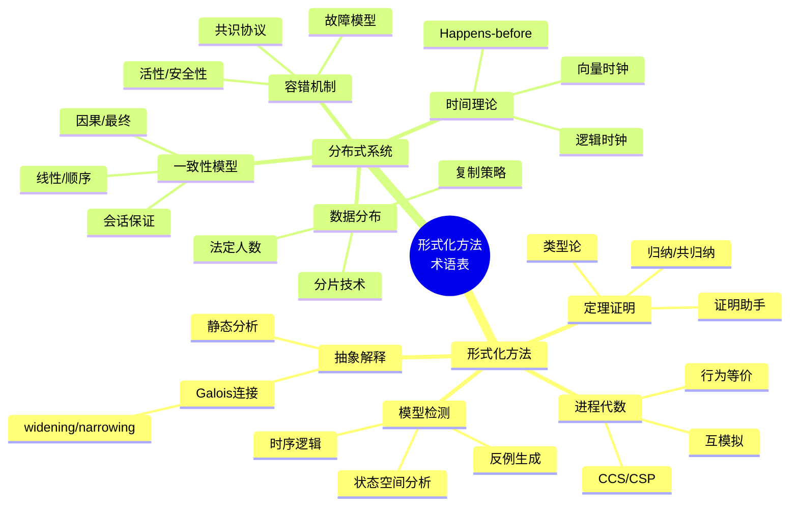
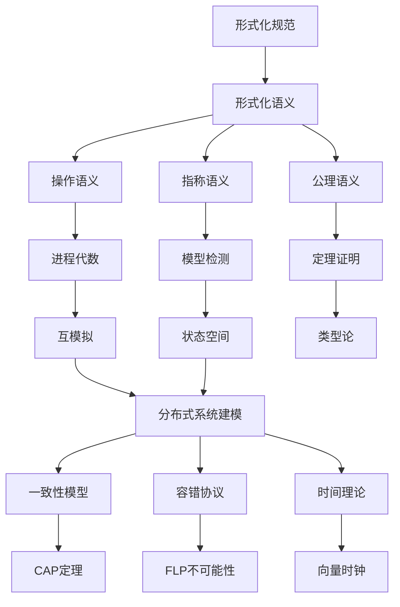

# 术语表：形式化方法与分布式系统

> **所属阶段**: Struct/形式理论 | **前置依赖**: [全书各章节](../) | **形式化等级**: L1-L2

## 1. 形式化方法术语

### 形式化规范 (Formal Specification)

使用严格的数学符号对系统行为进行精确描述的过程。形式化规范消除了自然语言的歧义，为验证提供基础。

**相关概念**：

- **规约语言**：Z、B、VDM、TLA+、Alloy
- **规范风格**：公理化、模型化、代数化

---

### 模型检测 (Model Checking)

一种自动验证技术，通过穷举系统状态空间来检验给定的时序逻辑性质是否成立。

**关键术语**：

| 术语 | 定义 |
|-----|------|
| **状态空间** | 系统所有可能状态的集合 |
| **状态爆炸** | 状态数量随系统规模指数增长的现象 |
| **Kripke 结构** | 用于模型检测的状态转换系统形式化模型 |
| **Büchi 自动机** | 用于验证无限行为的 $\omega$-自动机 |
| **LTL** | 线性时序逻辑 (Linear Temporal Logic) |
| **CTL** | 计算树逻辑 (Computation Tree Logic) |
| **反例** | 违反性质的执行轨迹，模型检测器输出 |

---

### 定理证明 (Theorem Proving)

使用数学逻辑和推理规则来证明系统满足规范的方法，通常需要人工指导。

**关键术语**：

| 术语 | 定义 |
|-----|------|
| **证明助手** | Coq、Isabelle/HOL、Agda、Lean 等交互式证明工具 |
| **类型论** | 作为证明语言和编程语言基础的类型系统理论 |
| **Curry-Howard 同构** | 命题与类型、证明与程序之间的对应关系 |
| **归纳法** | 证明关于递归数据结构或迭代过程的定理的技术 |
| **共归纳法** | 证明关于无限数据结构（如流）的等价性的技术 |

---

### 进程代数 (Process Algebra)

用于描述并发系统行为的形式化语言，提供组合操作和等价理论。

**关键术语**：

| 术语 | 定义 |
|-----|------|
| **CCS** | 通信系统演算 (Calculus of Communicating Systems)，Milner 提出 |
| **CSP** | 通信顺序进程 (Communicating Sequential Processes)，Hoare 提出 |
| **ACP** | 通信进程的代数 (Algebra of Communicating Processes) |
| **π-演算** | 支持移动性的进程演算，可以描述拓扑变化 |
| **互模拟** | 两个进程在行为上不可区分的关系 |
| **迹等价** | 基于可观察动作序列的弱等价 |
| **测试等价** | 基于外部观察器测试的行为等价 |

---

### 抽象解释 (Abstract Interpretation)

通过近似计算来推导程序动态属性的静态分析理论。

**关键术语**：

| 术语 | 定义 |
|-----|------|
| **具体域** | 程序实际执行的精确语义域 |
| **抽象域** | 用于近似分析的简化域 |
| **Galois 连接** | 具体域与抽象域之间的结构关系 |
| **widening** | 确保抽象迭代收敛的加速算子 |
| **narrowing** | 精炼 widening 结果的改进算子 |

---

## 2. 分布式系统术语

### 一致性模型 (Consistency Models)

定义分布式存储系统中读写操作可见性规则的规范。

**关键术语**：

| 术语 | 定义 |
|-----|------|
| **线性一致性** | 操作看起来在全局时间线上瞬时完成，最强一致性 |
| **顺序一致性** | 所有进程看到相同的操作顺序，但不必是实时顺序 |
| **因果一致性** | 因果相关的操作对所有进程顺序一致 |
| **最终一致性** | 若无新更新，所有副本最终收敛到相同值 |
| **读己之写** | 进程总能读到自己的最新写入 |
| **单调读** | 若进程读到某值，后续读不会读到更早的值 |
| **会话保证** | 在会话（连接）级别的一致性承诺 |

---

### 容错与共识 (Fault Tolerance & Consensus)

系统在组件故障时继续正确运行的能力，以及达成一致的协议。

**关键术语**：

| 术语 | 定义 |
|-----|------|
| **崩溃停止** | 故障模式：进程停止运行且不再恢复 |
| **崩溃恢复** | 故障模式：进程停止但可能稍后恢复 |
| **拜占庭故障** | 故障模式：进程可能任意偏离协议，包括恶意行为 |
| **omission 故障** | 故障模式：进程可能遗漏发送或接收消息 |
| **计时故障** | 故障模式：进程在错误的时间点响应 |
| **容错边界** | 系统能够容忍的最大故障数，如 $f < n/2$ |
| **共识** | 所有非故障进程就某个值达成一致的性质 |
| **活性** | 最终某件好事会发生（如达成共识） |
| **安全性** | 坏事永远不会发生（如不一致） |

---

### 时钟与时间 (Clocks & Time)

分布式系统中事件排序和因果关系的理论基础。

**关键术语**：

| 术语 | 定义 |
|-----|------|
| **物理时钟** | 基于真实时间的时钟，如 UTC |
| **逻辑时钟** | Lamport 时间戳，用于捕获因果关系 |
| **向量时钟** | 能够精确识别并发事件的扩展逻辑时钟 |
| **happens-before** | Lamport 定义的偏序关系，记作 $\rightarrow$ |
| **并发** | 两个事件互不 happens-before，记作 $a \parallel b$ |
| **时钟同步** | 使分布式节点时钟保持一致的过程 |
| **边界时钟** | PTP 协议中用于同步的主从层次结构 |

---

### 复制与分区 (Replication & Partitioning)

数据分布策略以提高可用性和性能。

**关键术语**：

| 术语 | 定义 |
|-----|------|
| **主从复制** | 单个主节点处理写，从节点复制并处理读 |
| **多主复制** | 多个节点可同时处理写操作 |
| **法定人数** | 读写操作需要的最小副本确认数 |
| **W + R > N** | 保证强一致性的法定人数条件 |
| **分片** | 将数据分布到多个节点的水平分区策略 |
| **一致性哈希** | 最小化重分配的分片算法 |
| **租约** | 有时间限制的授权机制，用于主节点选举 |

---

## 3. 符号说明

### 3.1 逻辑符号

| 符号 | 名称 | 含义 |
|-----|------|------|
| $\land$ | 合取 | 逻辑与 (AND) |
| $\lor$ | 析取 | 逻辑或 (OR) |
| $\neg$ | 否定 | 逻辑非 (NOT) |
| $\Rightarrow$ | 蕴含 | 如果...那么... |
| $\Leftrightarrow$ | 等价 | 当且仅当 |
| $\forall$ | 全称量词 | 对于所有 |
| $\exists$ | 存在量词 | 存在 |
| $\exists!$ | 唯一存在 | 存在且唯一 |
| $\vdash$ | 推导 | 从前提推出结论 |
| $\models$ | 满足 | 模型满足公式 |
| $\equiv$ | 语义等价 | 逻辑等价 |

### 3.2 时序逻辑符号

| 符号 | 名称 | 含义 |
|-----|------|------|
| $\Box$ / G | 全局 | 在所有未来状态 |
| $\Diamond$ / F | 最终 | 在某个未来状态 |
| $\bigcirc$ / X | 下一状态 | 在下一状态 |
| $\mathcal{U}$ | 直到 | 左侧直到右侧成立 |
| $\mathcal{W}$ | 弱直到 | 弱形式的直到 |
| $\mathcal{R}$ | 释放 | 右侧释放左侧 |
| $\mathbf{A}$ | 所有路径 | 对于所有执行路径 |
| $\mathbf{E}$ | 存在路径 | 存在某条执行路径 |

### 3.3 集合与关系符号

| 符号 | 名称 | 含义 |
|-----|------|------|
| $\in$ | 属于 | 元素属于集合 |
| $\subseteq$ | 子集 | 子集关系 |
| $\cup$ | 并集 | 集合的并 |
| $\cap$ | 交集 | 集合的交 |
| $\setminus$ | 差集 | 集合的差 |
| $\times$ | 笛卡尔积 | 集合的乘积 |
| $\emptyset$ | 空集 | 不含元素的集合 |
| $\mathbb{N}$ | 自然数 | $\{0, 1, 2, \ldots\}$ |
| $\mathbb{Z}$ | 整数 | 正负整数和零 |
| $\mathbb{R}$ | 实数 | 实数集合 |
| $\mapsto$ | 映射 | 函数映射 |
| $\to$ | 函数类型 | 从...到...的函数 |
| $\circ$ | 复合 | 函数复合 |

### 3.4 进程代数符号

| 符号 | 名称 | 含义 |
|-----|------|------|
| $\cdot$ / . | 前缀 | 动作前缀 |
| $+$ | 选择 | 非确定性选择 |
| $\parallel$ / $\mid$ | 并行 | 并行组合 |
| $\setminus$ / $\backslash$ | 限制 | 隐藏动作 |
| $[$ $]$ | 重标 | 动作重命名 |
| $\tau$ | 内部动作 | 不可观察动作 |
| $\sim$ | 强互模拟 | 强互模拟等价 |
| $\approx$ | 弱互模拟 | 弱互模拟等价 |
| $\equiv$ | 结构同余 | 结构等价 |
| $\xrightarrow{\alpha}$ | 转移 | 执行动作 $\alpha$ 转移 |
| $\Rightarrow$ | 弱转移 | 可能经过 $\tau$ 的转移 |

### 3.5 分布式系统符号

| 符号 | 名称 | 含义 |
|-----|------|------|
| $\to$ / $\rightarrow$ | Happens-before | Lamport 的 happens-before 关系 |
| $\parallel$ | 并发 | 事件并发关系 |
| $\xrightarrow{\text{deliver}}$ | 传递 | 消息传递关系 |
| $m \prec m'$ | 消息序 | 消息 $m$ 先于 $m'$ |
| $\lfloor x \rfloor$ | 下取整 | 向下取整 |
| $\lceil x \rceil$ | 上取整 | 向上取整 |
| $f(n) = O(g(n))$ | 大O | 渐进上界 |
| $f(n) = \Omega(g(n))$ | 大Omega | 渐进下界 |
| $f(n) = \Theta(g(n))$ | Theta | 紧确界 |

---

## 4. 可视化 (Visualizations)

### 术语分类图谱



### 符号关系图

```mermaid
graph TB
    subgraph "逻辑层"
        L1[命题逻辑<br/>∧ ∨ ¬ ⇒]
        L2[一阶逻辑<br/>∀ ∃]
        L3[时序逻辑<br/>□ ○ ◇]
    end

    subgraph "代数层"
        A1[集合运算<br/>∪ ∩ ⊆]
        A2[进程代数<br/>· + | \\]
        A3[关系代数<br/>∘ ⁻¹]
    end

    subgraph "分析层"
        S1[复杂度<br/>O Ω Θ]
        S2[分布式序<br/>→ ∥]
        S3[类型系统<br/>→ × +]
    end

    L1 --> L2 --> L3
    L2 --> A1
    A1 --> A2
    A1 --> A3
    A2 --> S2
    A3 --> S2
    L3 --> S3
```

### 术语依赖关系



---

## 5. 引用参考 (References)


---

*文档版本: v1.0 | 创建日期: 2026-04-09 | 最后更新: 2026-04-09*
