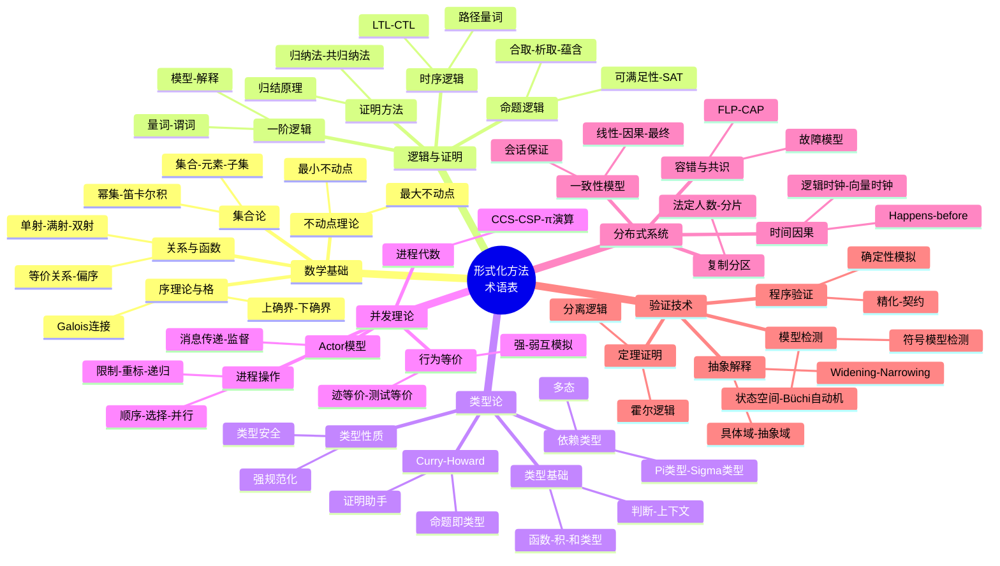
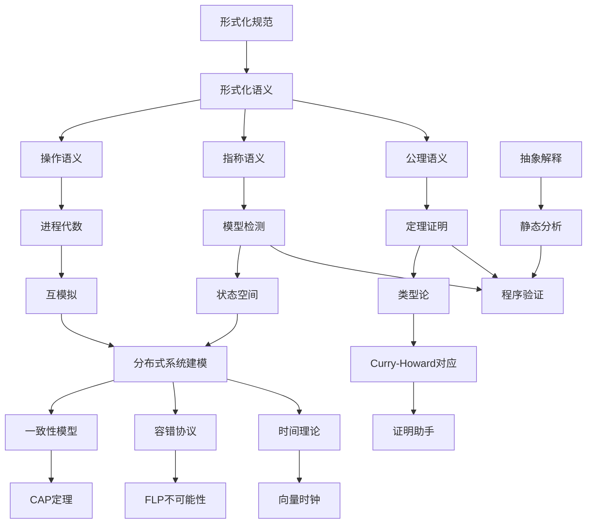

# 术语表：形式化方法与分布式系统

> **所属阶段**: Struct/形式理论 | **前置依赖**: [全书各章节](../) | **形式化等级**: L1-L2
> **术语数量**: 150+ | **版本**: v2.0 | **最后更新**: 2026-04-10

---

## 目录

- [术语表：形式化方法与分布式系统](#术语表形式化方法与分布式系统)
  - [目录](#目录)
  - [1. 数学基础术语](#1-数学基础术语)
    - [1.1 集合论基础](#11-集合论基础)
      - [集合 (Set)](#集合-set)
      - [元素 (Element)](#元素-element)
      - [子集 (Subset)](#子集-subset)
      - [真子集 (Proper Subset)](#真子集-proper-subset)
      - [幂集 (Power Set)](#幂集-power-set)
      - [并集 (Union)](#并集-union)
      - [交集 (Intersection)](#交集-intersection)
      - [差集 (Difference)](#差集-difference)
      - [补集 (Complement)](#补集-complement)
      - [笛卡尔积 (Cartesian Product)](#笛卡尔积-cartesian-product)
    - [1.2 关系与函数](#12-关系与函数)
      - [关系 (Relation)](#关系-relation)
      - [函数 (Function / Mapping)](#函数-function--mapping)
      - [单射 (Injection)](#单射-injection)
      - [满射 (Surjection)](#满射-surjection)
      - [双射 (Bijection)](#双射-bijection)
      - [等价关系 (Equivalence Relation)](#等价关系-equivalence-relation)
      - [等价类 (Equivalence Class)](#等价类-equivalence-class)
      - [商集 (Quotient Set)](#商集-quotient-set)
      - [偏序关系 (Partial Order)](#偏序关系-partial-order)
      - [全序关系 (Total Order)](#全序关系-total-order)
    - [1.3 序理论与格](#13-序理论与格)
      - [偏序集 (Poset)](#偏序集-poset)
      - [上确界 (Supremum)](#上确界-supremum)
      - [下确界 (Infimum)](#下确界-infimum)
      - [格 (Lattice)](#格-lattice)
      - [完全格 (Complete Lattice)](#完全格-complete-lattice)
      - [分配格 (Distributive Lattice)](#分配格-distributive-lattice)
      - [Hasse图 (Hasse Diagram)](#hasse图-hasse-diagram)
      - [Galois连接 (Galois Connection)](#galois连接-galois-connection)
    - [1.4 不动点理论](#14-不动点理论)
      - [不动点 (Fixed Point)](#不动点-fixed-point)
      - [最小不动点 (Least Fixed Point)](#最小不动点-least-fixed-point)
      - [最大不动点 (Greatest Fixed Point)](#最大不动点-greatest-fixed-point)
  - [2. 逻辑与证明术语](#2-逻辑与证明术语)
    - [2.1 命题逻辑](#21-命题逻辑)
      - [命题 (Proposition)](#命题-proposition)
      - [合取 (Conjunction)](#合取-conjunction)
      - [析取 (Disjunction)](#析取-disjunction)
      - [蕴含 (Implication)](#蕴含-implication)
      - [等价 (Equivalence)](#等价-equivalence)
      - [否定 (Negation)](#否定-negation)
      - [重言式 (Tautology)](#重言式-tautology)
      - [矛盾式 (Contradiction)](#矛盾式-contradiction)
      - [可满足性 (Satisfiability)](#可满足性-satisfiability)
      - [范式 (Normal Form)](#范式-normal-form)
    - [2.2 一阶逻辑](#22-一阶逻辑)
      - [全称量词 (Universal Quantifier)](#全称量词-universal-quantifier)
      - [存在量词 (Existential Quantifier)](#存在量词-existential-quantifier)
      - [唯一存在量词 (Unique Existence)](#唯一存在量词-unique-existence)
      - [谓词 (Predicate)](#谓词-predicate)
      - [解释 (Interpretation)](#解释-interpretation)
      - [模型 (Model)](#模型-model)
      - [逻辑有效性 (Validity)](#逻辑有效性-validity)
      - [一致性 (Consistency)](#一致性-consistency)
      - [完备性 (Completeness)](#完备性-completeness)
      - [演绎定理 (Deduction Theorem)](#演绎定理-deduction-theorem)
    - [2.3 证明方法](#23-证明方法)
      - [自然演绎 (Natural Deduction)](#自然演绎-natural-deduction)
      - [相继式演算 (Sequent Calculus)](#相继式演算-sequent-calculus)
      - [归结原理 (Resolution)](#归结原理-resolution)
      - [反证法 (Proof by Contradiction)](#反证法-proof-by-contradiction)
      - [归纳法 (Mathematical Induction)](#归纳法-mathematical-induction)
      - [结构归纳法 (Structural Induction)](#结构归纳法-structural-induction)
      - [共归纳法 (Coinduction)](#共归纳法-coinduction)
    - [2.4 时序逻辑](#24-时序逻辑)
      - [LTL (Linear Temporal Logic)](#ltl-linear-temporal-logic)
      - [CTL (Computation Tree Logic)](#ctl-computation-tree-logic)
      - [CTL\* (Extended CTL)](#ctl-extended-ctl)
      - [全局算子 (Globally)](#全局算子-globally)
      - [最终算子 (Finally)](#最终算子-finally)
      - [下一状态算子 (Next)](#下一状态算子-next)
      - [直到算子 (Until)](#直到算子-until)
      - [路径量词 (Path Quantifiers)](#路径量词-path-quantifiers)
      - [公平性 (Fairness)](#公平性-fairness)
  - [3. 类型论术语](#3-类型论术语)
    - [3.1 类型基础](#31-类型基础)
      - [类型 (Type)](#类型-type)
      - [项 (Term)](#项-term)
      - [判断 (Judgment)](#判断-judgment)
      - [上下文 (Context)](#上下文-context)
      - [类型规则 (Typing Rule)](#类型规则-typing-rule)
      - [函数类型 (Function Type)](#函数类型-function-type)
      - [积类型 (Product Type)](#积类型-product-type)
      - [和类型 (Sum Type)](#和类型-sum-type)
      - [单元类型 (Unit Type)](#单元类型-unit-type)
      - [空类型 (Empty Type)](#空类型-empty-type)
    - [3.2 依赖类型与高阶类型](#32-依赖类型与高阶类型)
      - [依赖类型 (Dependent Type)](#依赖类型-dependent-type)
      - [依赖函数类型 (Pi Type)](#依赖函数类型-pi-type)
      - [依赖对类型 (Sigma Type)](#依赖对类型-sigma-type)
      - [多态 (Polymorphism)](#多态-polymorphism)
      - [参数多态 (Parametric Polymorphism)](#参数多态-parametric-polymorphism)
      - [类型构造器 (Type Constructor)](#类型构造器-type-constructor)
      - [高阶类型 (Higher-Kinded Types)](#高阶类型-higher-kinded-types)
    - [3.3 类型系统的性质](#33-类型系统的性质)
      - [类型安全 (Type Safety)](#类型安全-type-safety)
      - [进展性 (Progress)](#进展性-progress)
      - [保持性 (Preservation)](#保持性-preservation)
      - [强规范化 (Strong Normalization)](#强规范化-strong-normalization)
      - [类型推断 (Type Inference)](#类型推断-type-inference)
    - [3.4 Curry-Howard对应](#34-curry-howard对应)
      - [Curry-Howard同构 (Curry-Howard Isomorphism)](#curry-howard同构-curry-howard-isomorphism)
      - [证明即程序 (Proofs as Programs)](#证明即程序-proofs-as-programs)
      - [证明助手 (Proof Assistant)](#证明助手-proof-assistant)
  - [4. 并发理论术语](#4-并发理论术语)
    - [4.1 进程代数](#41-进程代数)
      - [进程 (Process)](#进程-process)
      - [CCS (Calculus of Communicating Systems)](#ccs-calculus-of-communicating-systems)
      - [CSP (Communicating Sequential Processes)](#csp-communicating-sequential-processes)
      - [ACP (Algebra of Communicating Processes)](#acp-algebra-of-communicating-processes)
      - [π演算 (Pi Calculus)](#π演算-pi-calculus)
      - [动作 (Action)](#动作-action)
      - [输入动作 (Input Action)](#输入动作-input-action)
      - [输出动作 (Output Action)](#输出动作-output-action)
      - [内部动作 (Internal Action)](#内部动作-internal-action)
      - [通道 (Channel)](#通道-channel)
    - [4.2 进程操作](#42-进程操作)
      - [顺序组合 (Sequential Composition)](#顺序组合-sequential-composition)
      - [选择 (Choice)](#选择-choice)
      - [并行组合 (Parallel Composition)](#并行组合-parallel-composition)
      - [限制 (Restriction)](#限制-restriction)
      - [重标 (Relabeling)](#重标-relabeling)
      - [递归 (Recursion)](#递归-recursion)
    - [4.3 行为等价](#43-行为等价)
      - [互模拟 (Bisimulation)](#互模拟-bisimulation)
      - [强互模拟 (Strong Bisimulation)](#强互模拟-strong-bisimulation)
      - [弱互模拟 (Weak Bisimulation)](#弱互模拟-weak-bisimulation)
      - [迹等价 (Trace Equivalence)](#迹等价-trace-equivalence)
      - [测试等价 (Testing Equivalence)](#测试等价-testing-equivalence)
      - [互模拟证明法 (Bisimulation Proof Method)](#互模拟证明法-bisimulation-proof-method)
    - [4.4 Actor模型](#44-actor模型)
      - [Actor (Actor)](#actor-actor)
      - [消息传递 (Message Passing)](#消息传递-message-passing)
      - [邮箱 (Mailbox)](#邮箱-mailbox)
      - [行为 (Behavior)](#行为-behavior)
      - [监督 (Supervision)](#监督-supervision)
  - [5. 分布式系统术语](#5-分布式系统术语)
    - [5.1 一致性模型](#51-一致性模型)
      - [一致性模型 (Consistency Model)](#一致性模型-consistency-model)
      - [线性一致性 (Linearizability)](#线性一致性-linearizability)
      - [顺序一致性 (Sequential Consistency)](#顺序一致性-sequential-consistency)
      - [因果一致性 (Causal Consistency)](#因果一致性-causal-consistency)
      - [最终一致性 (Eventual Consistency)](#最终一致性-eventual-consistency)
      - [读己之写 (Read Your Writes)](#读己之写-read-your-writes)
      - [单调读 (Monotonic Reads)](#单调读-monotonic-reads)
      - [单调写 (Monotonic Writes)](#单调写-monotonic-writes)
      - [会话保证 (Session Guarantees)](#会话保证-session-guarantees)
    - [5.2 容错与共识](#52-容错与共识)
      - [容错 (Fault Tolerance)](#容错-fault-tolerance)
      - [崩溃停止 (Crash-Stop)](#崩溃停止-crash-stop)
      - [崩溃恢复 (Crash-Recovery)](#崩溃恢复-crash-recovery)
      - [拜占庭故障 (Byzantine Fault)](#拜占庭故障-byzantine-fault)
      - [Omission故障 (Omission Fault)](#omission故障-omission-fault)
      - [共识 (Consensus)](#共识-consensus)
      - [安全性 (Safety)](#安全性-safety)
      - [活性 (Liveness)](#活性-liveness)
      - [FLP不可能性 (FLP Impossibility)](#flp不可能性-flp-impossibility)
      - [CAP定理 (CAP Theorem)](#cap定理-cap-theorem)
    - [5.3 时间与因果](#53-时间与因果)
      - [物理时钟 (Physical Clock)](#物理时钟-physical-clock)
      - [逻辑时钟 (Logical Clock)](#逻辑时钟-logical-clock)
      - [Lamport时间戳 (Lamport Timestamp)](#lamport时间戳-lamport-timestamp)
      - [向量时钟 (Vector Clock)](#向量时钟-vector-clock)
      - [Happens-Before关系 (Happens-Before)](#happens-before关系-happens-before)
      - [并发事件 (Concurrent Events)](#并发事件-concurrent-events)
      - [因果关系 (Causality)](#因果关系-causality)
      - [时钟同步 (Clock Synchronization)](#时钟同步-clock-synchronization)
    - [5.4 复制与分区](#54-复制与分区)
      - [复制 (Replication)](#复制-replication)
      - [主从复制 (Primary-Backup Replication)](#主从复制-primary-backup-replication)
      - [多主复制 (Multi-Master Replication)](#多主复制-multi-master-replication)
      - [法定人数 (Quorum)](#法定人数-quorum)
      - [分片 (Sharding)](#分片-sharding)
      - [一致性哈希 (Consistent Hashing)](#一致性哈希-consistent-hashing)
      - [租约 (Lease)](#租约-lease)
  - [6. 验证技术术语](#6-验证技术术语)
    - [6.1 模型检测](#61-模型检测)
      - [模型检测 (Model Checking)](#模型检测-model-checking)
      - [状态空间 (State Space)](#状态空间-state-space)
      - [状态爆炸 (State Space Explosion)](#状态爆炸-state-space-explosion)
      - [Kripke结构 (Kripke Structure)](#kripke结构-kripke-structure)
      - [Büchi自动机 (Büchi Automaton)](#büchi自动机-büchi-automaton)
      - [反例 (Counterexample)](#反例-counterexample)
      - [状态压缩 (State Compression)](#状态压缩-state-compression)
      - [符号模型检测 (Symbolic Model Checking)](#符号模型检测-symbolic-model-checking)
      - [偏序规约 (Partial Order Reduction)](#偏序规约-partial-order-reduction)
    - [6.2 定理证明](#62-定理证明)
      - [定理证明 (Theorem Proving)](#定理证明-theorem-proving)
      - [霍尔逻辑 (Hoare Logic)](#霍尔逻辑-hoare-logic)
      - [霍尔三元组 (Hoare Triple)](#霍尔三元组-hoare-triple)
      - [最弱前置条件 (Weakest Precondition)](#最弱前置条件-weakest-precondition)
      - [最强后置条件 (Strongest Postcondition)](#最强后置条件-strongest-postcondition)
      - [循环不变式 (Loop Invariant)](#循环不变式-loop-invariant)
      - [分离逻辑 (Separation Logic)](#分离逻辑-separation-logic)
    - [6.3 抽象解释](#63-抽象解释)
      - [抽象解释 (Abstract Interpretation)](#抽象解释-abstract-interpretation)
      - [具体域 (Concrete Domain)](#具体域-concrete-domain)
      - [抽象域 (Abstract Domain)](#抽象域-abstract-domain)
      - [抽象函数 (Abstraction Function)](#抽象函数-abstraction-function)
      - [具体化函数 (Concretization Function)](#具体化函数-concretization-function)
      - [Widening](#widening)
      - [Narrowing](#narrowing)
    - [6.4 程序验证与测试](#64-程序验证与测试)
      - [形式化规范 (Formal Specification)](#形式化规范-formal-specification)
      - [精化 (Refinement)](#精化-refinement)
      - [精化验证 (Refinement Checking)](#精化验证-refinement-checking)
      - [契约式编程 (Design by Contract)](#契约式编程-design-by-contract)
      - [确定性模拟测试 (Deterministic Simulation Testing)](#确定性模拟测试-deterministic-simulation-testing)
      - [Smart Casual验证 (Smart Casual Verification)](#smart-casual验证-smart-casual-verification)
  - [7. 符号说明](#7-符号说明)
    - [7.1 逻辑符号](#71-逻辑符号)
    - [7.2 时序逻辑符号](#72-时序逻辑符号)
    - [7.3 集合与关系符号](#73-集合与关系符号)
    - [7.4 进程代数符号](#74-进程代数符号)
    - [7.5 分布式系统符号](#75-分布式系统符号)
  - [8. 可视化](#8-可视化)
    - [术语分类图谱](#术语分类图谱)
    - [符号关系层次图](#符号关系层次图)
    - [术语依赖关系图](#术语依赖关系图)
  - [9. 字母索引](#9-字母索引)
    - [A](#a)
    - [B](#b)
    - [C](#c)
    - [D](#d)
    - [E](#e)
    - [F](#f)
    - [G](#g)
    - [H](#h)
    - [I](#i)
    - [J](#j)
    - [K](#k)
    - [L](#l)
    - [M](#m)
    - [N](#n)
    - [O](#o)
    - [P](#p)
    - [Q](#q)
    - [R](#r)
    - [S](#s)
    - [T](#t)
    - [U](#u)
    - [V](#v)
    - [W](#w)
    - [X](#x)
    - [Y](#y)
    - [Z](#z)
  - [10. 引用参考](#10-引用参考)

---

## 1. 数学基础术语

### 1.1 集合论基础

#### 集合 (Set)

- **中文**: 集合
- **英文**: Set
- **定义**: 由确定且互异的对象构成的整体，是数学的基础结构
- **相关定义**: Def-S-01-01
- **首次出现**: [s1.1-mathematical-foundations.md](../01-foundations/s1.1-mathematical-foundations.md)
- **交叉引用**: [元素](#元素), [子集](#子集), [幂集](#幂集)

#### 元素 (Element)

- **中文**: 元素 / 成员
- **英文**: Element / Member
- **符号**: $\in$
- **定义**: 属于某个集合的单个对象
- **相关定义**: Def-S-01-02
- **首次出现**: [s1.1-mathematical-foundations.md](../01-foundations/s1.1-mathematical-foundations.md)

#### 子集 (Subset)

- **中文**: 子集
- **英文**: Subset
- **符号**: $\subseteq$
- **定义**: 集合A是集合B的子集，当且仅当A的每个元素都属于B
- **相关定理**: Thm-S-01-01 (传递性)
- **首次出现**: [s1.1-mathematical-foundations.md](../01-foundations/s1.1-mathematical-foundations.md)
- **交叉引用**: [真子集](#真子集), [幂集](#幂集)

#### 真子集 (Proper Subset)

- **中文**: 真子集
- **英文**: Proper Subset
- **符号**: $\subset$
- **定义**: A是B的子集且A不等于B
- **首次出现**: [s1.1-mathematical-foundations.md](../01-foundations/s1.1-mathematical-foundations.md)

#### 幂集 (Power Set)

- **中文**: 幂集
- **英文**: Power Set
- **符号**: $\mathcal{P}(A)$ 或 $2^A$
- **定义**: 集合A的所有子集构成的集合
- **相关定理**: Thm-S-01-02 ($|\mathcal{P}(A)| = 2^{|A|}$)
- **首次出现**: [s1.1-mathematical-foundations.md](../01-foundations/s1.1-mathematical-foundations.md)

#### 并集 (Union)

- **中文**: 并集
- **英文**: Union
- **符号**: $\cup$
- **定义**: 属于A或属于B的所有元素构成的集合
- **相关定理**: Thm-S-01-03 (交换律、结合律)
- **首次出现**: [s1.1-mathematical-foundations.md](../01-foundations/s1.1-mathematical-foundations.md)

#### 交集 (Intersection)

- **中文**: 交集
- **英文**: Intersection
- **符号**: $\cap$
- **定义**: 同时属于A和B的元素构成的集合
- **首次出现**: [s1.1-mathematical-foundations.md](../01-foundations/s1.1-mathematical-foundations.md)

#### 差集 (Difference)

- **中文**: 差集 / 相对补集
- **英文**: Difference / Relative Complement
- **符号**: $\setminus$ 或 $-$
- **定义**: 属于A但不属于B的元素构成的集合
- **首次出现**: [s1.1-mathematical-foundations.md](../01-foundations/s1.1-mathematical-foundations.md)

#### 补集 (Complement)

- **中文**: 补集 / 绝对补集
- **英文**: Complement
- **符号**: $A^c$ 或 $\overline{A}$
- **定义**: 在全集U中不属于A的所有元素
- **首次出现**: [s1.1-mathematical-foundations.md](../01-foundations/s1.1-mathematical-foundations.md)

#### 笛卡尔积 (Cartesian Product)

- **中文**: 笛卡尔积
- **英文**: Cartesian Product
- **符号**: $\times$
- **定义**: 有序对$(a,b)$的集合，其中$a \in A, b \in B$
- **首次出现**: [s1.1-mathematical-foundations.md](../01-foundations/s1.1-mathematical-foundations.md)
- **交叉引用**: [关系](#关系), [函数](#函数)

---

### 1.2 关系与函数

#### 关系 (Relation)

- **中文**: 关系
- **英文**: Relation
- **符号**: $R \subseteq A \times B$
- **定义**: 集合间笛卡尔积的子集，表示元素间的某种联系
- **首次出现**: [s1.2-relations-functions.md](../01-foundations/s1.2-relations-functions.md)
- **交叉引用**: [等价关系](#等价关系), [偏序关系](#偏序关系)

#### 函数 (Function / Mapping)

- **中文**: 函数 / 映射
- **英文**: Function / Mapping
- **符号**: $f: A \to B$
- **定义**: 特殊的二元关系，A中每个元素对应B中唯一元素
- **相关定义**: Def-S-01-10
- **首次出现**: [s1.2-relations-functions.md](../01-foundations/s1.2-relations-functions.md)

#### 单射 (Injection)

- **中文**: 单射 / 入射
- **英文**: Injection / One-to-one
- **定义**: 不同的输入对应不同的输出：$f(a) = f(b) \Rightarrow a = b$
- **首次出现**: [s1.2-relations-functions.md](../01-foundations/s1.2-relations-functions.md)

#### 满射 (Surjection)

- **中文**: 满射 / 上映射
- **英文**: Surjection / Onto
- **定义**: B中每个元素都有原像：$\forall b \in B, \exists a: f(a) = b$
- **首次出现**: [s1.2-relations-functions.md](../01-foundations/s1.2-relations-functions.md)

#### 双射 (Bijection)

- **中文**: 双射 / 一一对应
- **英文**: Bijection
- **定义**: 既是单射又是满射的函数
- **相关定理**: Thm-S-01-05 (存在逆函数)
- **首次出现**: [s1.2-relations-functions.md](../01-foundations/s1.2-relations-functions.md)

#### 等价关系 (Equivalence Relation)

- **中文**: 等价关系
- **英文**: Equivalence Relation
- **定义**: 满足自反性、对称性、传递性的关系
- **相关定义**: Def-S-01-15
- **首次出现**: [s1.2-relations-functions.md](../01-foundations/s1.2-relations-functions.md)
- **交叉引用**: [等价类](#等价类), [商集](#商集)

#### 等价类 (Equivalence Class)

- **中文**: 等价类
- **英文**: Equivalence Class
- **符号**: $[a]_R$
- **定义**: 与a等价的所有元素构成的集合
- **首次出现**: [s1.2-relations-functions.md](../01-foundations/s1.2-relations-functions.md)

#### 商集 (Quotient Set)

- **中文**: 商集
- **英文**: Quotient Set
- **符号**: $A/R$
- **定义**: 所有等价类构成的集合
- **首次出现**: [s1.2-relations-functions.md](../01-foundations/s1.2-relations-functions.md)

#### 偏序关系 (Partial Order)

- **中文**: 偏序关系
- **英文**: Partial Order
- **定义**: 满足自反性、反对称性、传递性的关系
- **首次出现**: [s1.2-relations-functions.md](../01-foundations/s1.2-relations-functions.md)
- **交叉引用**: [全序关系](#全序关系), [Hasse图](#hasse图)

#### 全序关系 (Total Order)

- **中文**: 全序关系 / 线性序
- **英文**: Total Order / Linear Order
- **定义**: 任意两个元素可比较的偏序关系
- **首次出现**: [s1.2-relations-functions.md](../01-foundations/s1.2-relations-functions.md)

---

### 1.3 序理论与格

#### 偏序集 (Poset)

- **中文**: 偏序集
- **英文**: Partially Ordered Set (Poset)
- **定义**: 带有偏序关系的集合$(P, \leq)$
- **首次出现**: [s1.3-order-theory.md](../01-foundations/s1.3-order-theory.md)

#### 上确界 (Supremum)

- **中文**: 上确界 / 最小上界
- **英文**: Supremum / Least Upper Bound
- **符号**: $\sup$ 或 $\bigvee$
- **定义**: 大于等于子集所有元素的最小元素
- **首次出现**: [s1.3-order-theory.md](../01-foundations/s1.3-order-theory.md)

#### 下确界 (Infimum)

- **中文**: 下确界 / 最大下界
- **英文**: Infimum / Greatest Lower Bound
- **符号**: $\inf$ 或 $\bigwedge$
- **定义**: 小于等于子集所有元素的最大元素
- **首次出现**: [s1.3-order-theory.md](../01-foundations/s1.3-order-theory.md)

#### 格 (Lattice)

- **中文**: 格
- **英文**: Lattice
- **定义**: 任意两个元素都有上确界和下确界的偏序集
- **相关定理**: Thm-S-01-08 (格的代数定义)
- **首次出现**: [s1.3-order-theory.md](../01-foundations/s1.3-order-theory.md)
- **交叉引用**: [完全格](#完全格), [分配格](#分配格)

#### 完全格 (Complete Lattice)

- **中文**: 完全格
- **英文**: Complete Lattice
- **定义**: 任意子集都有上确界和下确界的格
- **相关定理**: Thm-S-01-09 (Knaster-Tarski定理)
- **首次出现**: [s1.3-order-theory.md](../01-foundations/s1.3-order-theory.md)

#### 分配格 (Distributive Lattice)

- **中文**: 分配格
- **英文**: Distributive Lattice
- **定义**: 满足分配律的格：$a \wedge (b \vee c) = (a \wedge b) \vee (a \wedge c)$
- **首次出现**: [s1.3-order-theory.md](../01-foundations/s1.3-order-theory.md)

#### Hasse图 (Hasse Diagram)

- **中文**: Hasse图
- **英文**: Hasse Diagram
- **定义**: 表示偏序集的简化图示，省略自环和传递边
- **首次出现**: [s1.3-order-theory.md](../01-foundations/s1.3-order-theory.md)

#### Galois连接 (Galois Connection)

- **中文**: Galois连接
- **英文**: Galois Connection
- **符号**: $(\alpha, \gamma)$
- **定义**: 两个偏序集之间的单调函数对，满足特定伴随条件
- **相关定理**: Thm-S-05-12 (抽象解释基础)
- **首次出现**: [s1.3-order-theory.md](../01-foundations/s1.3-order-theory.md)
- **交叉引用**: [抽象解释](#抽象解释)

---

### 1.4 不动点理论

#### 不动点 (Fixed Point)

- **中文**: 不动点
- **英文**: Fixed Point
- **定义**: 满足$f(x) = x$的点
- **相关定理**: Thm-S-01-10 (Banach不动点定理)
- **首次出现**: [s1.4-fixed-point-theory.md](../01-foundations/s1.4-fixed-point-theory.md)

#### 最小不动点 (Least Fixed Point)

- **中文**: 最小不动点
- **英文**: Least Fixed Point
- **符号**: $\text{lfp}(f)$
- **定义**: 所有不动点中最小的一个
- **相关定理**: Thm-S-01-11 (Kleene定理)
- **首次出现**: [s1.4-fixed-point-theory.md](../01-foundations/s1.4-fixed-point-theory.md)

#### 最大不动点 (Greatest Fixed Point)

- **中文**: 最大不动点
- **英文**: Greatest Fixed Point
- **符号**: $\text{gfp}(f)$
- **定义**: 所有不动点中最大的一个
- **首次出现**: [s1.4-fixed-point-theory.md](../01-foundations/s1.4-fixed-point-theory.md)

---

## 2. 逻辑与证明术语

### 2.1 命题逻辑

#### 命题 (Proposition)

- **中文**: 命题
- **英文**: Proposition
- **定义**: 具有确定真值的陈述句
- **相关定义**: Def-S-02-01
- **首次出现**: [s2.1-propositional-logic.md](../02-logic/s2.1-propositional-logic.md)

#### 合取 (Conjunction)

- **中文**: 合取 / 逻辑与
- **英文**: Conjunction / AND
- **符号**: $\land$
- **定义**: 两个命题同时为真时为真
- **首次出现**: [s2.1-propositional-logic.md](../02-logic/s2.1-propositional-logic.md)

#### 析取 (Disjunction)

- **中文**: 析取 / 逻辑或
- **英文**: Disjunction / OR
- **符号**: $\lor$
- **定义**: 至少一个命题为真时为真
- **首次出现**: [s2.1-propositional-logic.md](../02-logic/s2.1-propositional-logic.md)

#### 蕴含 (Implication)

- **中文**: 蕴含 / 条件
- **英文**: Implication
- **符号**: $\Rightarrow$ 或 $\to$
- **定义**: 前件为真而后件为假时为假，否则为真
- **首次出现**: [s2.1-propositional-logic.md](../02-logic/s2.1-propositional-logic.md)

#### 等价 (Equivalence)

- **中文**: 等价 / 双条件
- **英文**: Equivalence / Biconditional
- **符号**: $\Leftrightarrow$ 或 $\leftrightarrow$
- **定义**: 两边真值相同时为真
- **首次出现**: [s2.1-propositional-logic.md](../02-logic/s2.1-propositional-logic.md)

#### 否定 (Negation)

- **中文**: 否定 / 逻辑非
- **英文**: Negation / NOT
- **符号**: $\neg$ 或 $\sim$
- **定义**: 真值取反
- **首次出现**: [s2.1-propositional-logic.md](../02-logic/s2.1-propositional-logic.md)

#### 重言式 (Tautology)

- **中文**: 重言式 / 永真式
- **英文**: Tautology
- **定义**: 在所有赋值下都为真的命题公式
- **相关定理**: Thm-S-02-01 (完备性)
- **首次出现**: [s2.1-propositional-logic.md](../02-logic/s2.1-propositional-logic.md)

#### 矛盾式 (Contradiction)

- **中文**: 矛盾式 / 永假式
- **英文**: Contradiction
- **定义**: 在所有赋值下都为假的命题公式
- **首次出现**: [s2.1-propositional-logic.md](../02-logic/s2.1-propositional-logic.md)

#### 可满足性 (Satisfiability)

- **中文**: 可满足性
- **英文**: Satisfiability
- **缩写**: SAT
- **定义**: 存在赋值使公式为真
- **相关定理**: Thm-S-02-02 (SAT是NP完全的)
- **首次出现**: [s2.1-propositional-logic.md](../02-logic/s2.1-propositional-logic.md)

#### 范式 (Normal Form)

- **中文**: 范式
- **英文**: Normal Form
- **定义**: 标准形式的公式表示
- **分类**: [合取范式](#合取范式), [析取范式](#析取范式)
- **首次出现**: [s2.1-propositional-logic.md](../02-logic/s2.1-propositional-logic.md)

---

### 2.2 一阶逻辑

#### 全称量词 (Universal Quantifier)

- **中文**: 全称量词
- **英文**: Universal Quantifier
- **符号**: $\forall$
- **定义**: "对于所有"，表示域中所有元素满足某性质
- **首次出现**: [s2.2-first-order-logic.md](../02-logic/s2.2-first-order-logic.md)

#### 存在量词 (Existential Quantifier)

- **中文**: 存在量词
- **英文**: Existential Quantifier
- **符号**: $\exists$
- **定义**: "存在"，表示域中至少有一个元素满足某性质
- **首次出现**: [s2.2-first-order-logic.md](../02-logic/s2.2-first-order-logic.md)

#### 唯一存在量词 (Unique Existence)

- **中文**: 唯一存在量词
- **英文**: Unique Existence
- **符号**: $\exists!$
- **定义**: "存在且唯一"
- **首次出现**: [s2.2-first-order-logic.md](../02-logic/s2.2-first-order-logic.md)

#### 谓词 (Predicate)

- **中文**: 谓词
- **英文**: Predicate
- **定义**: 带有参数的真值函数
- **首次出现**: [s2.2-first-order-logic.md](../02-logic/s2.2-first-order-logic.md)

#### 解释 (Interpretation)

- **中文**: 解释 / 模型
- **英文**: Interpretation / Model
- **定义**: 为符号赋予具体语义的映射
- **首次出现**: [s2.2-first-order-logic.md](../02-logic/s2.2-first-order-logic.md)

#### 模型 (Model)

- **中文**: 模型
- **英文**: Model
- **符号**: $\mathcal{M} \models \phi$
- **定义**: 使公式为真的解释
- **首次出现**: [s2.2-first-order-logic.md](../02-logic/s2.2-first-order-logic.md)
- **交叉引用**: [模型检测](#模型检测)

#### 逻辑有效性 (Validity)

- **中文**: 逻辑有效性
- **英文**: Validity
- **符号**: $\models \phi$
- **定义**: 在所有解释下都为真
- **首次出现**: [s2.2-first-order-logic.md](../02-logic/s2.2-first-order-logic.md)

#### 一致性 (Consistency)

- **中文**: 一致性 / 相容性
- **英文**: Consistency
- **定义**: 公式集存在模型（可满足）
- **相关定理**: Thm-S-02-05 (紧致性定理)
- **首次出现**: [s2.2-first-order-logic.md](../02-logic/s2.2-first-order-logic.md)

#### 完备性 (Completeness)

- **中文**: 完备性
- **英文**: Completeness
- **定义**: 所有有效公式都可被证明
- **相关定理**: Thm-S-02-06 (Gödel完备性定理)
- **首次出现**: [s2.2-first-order-logic.md](../02-logic/s2.2-first-order-logic.md)

#### 演绎定理 (Deduction Theorem)

- **中文**: 演绎定理
- **英文**: Deduction Theorem
- **定义**: $\Gamma \cup \{\phi\} \vdash \psi \Leftrightarrow \Gamma \vdash \phi \to \psi$
- **相关定理**: Thm-S-02-07
- **首次出现**: [s2.2-first-order-logic.md](../02-logic/s2.2-first-order-logic.md)

---

### 2.3 证明方法

#### 自然演绎 (Natural Deduction)

- **中文**: 自然演绎
- **英文**: Natural Deduction
- **定义**: 模仿直观推理的证明系统
- **首次出现**: [s2.3-proof-methods.md](../02-logic/s2.3-proof-methods.md)

#### 相继式演算 (Sequent Calculus)

- **中文**: 相继式演算
- **英文**: Sequent Calculus
- **定义**: Gentzen提出的证明系统，使用相继式$\Gamma \vdash \Delta$
- **首次出现**: [s2.3-proof-methods.md](../02-logic/s2.3-proof-methods.md)

#### 归结原理 (Resolution)

- **中文**: 归结原理
- **英文**: Resolution
- **定义**: 自动定理证明的基本规则：$\frac{A \lor B, \neg B \lor C}{A \lor C}$
- **首次出现**: [s2.3-proof-methods.md](../02-logic/s2.3-proof-methods.md)

#### 反证法 (Proof by Contradiction)

- **中文**: 反证法 / 归谬法
- **英文**: Proof by Contradiction / Reductio ad absurdum
- **定义**: 假设结论不成立推出矛盾
- **首次出现**: [s2.3-proof-methods.md](../02-logic/s2.3-proof-methods.md)

#### 归纳法 (Mathematical Induction)

- **中文**: 数学归纳法
- **英文**: Mathematical Induction
- **定义**: 证明关于自然数命题的方法：基例+归纳步
- **相关定理**: Thm-S-02-10 (良基归纳原理)
- **首次出现**: [s2.3-proof-methods.md](../02-logic/s2.3-proof-methods.md)
- **交叉引用**: [结构归纳法](#结构归纳法), [共归纳法](#共归纳法)

#### 结构归纳法 (Structural Induction)

- **中文**: 结构归纳法
- **英文**: Structural Induction
- **定义**: 在递归数据结构上应用的归纳法
- **首次出现**: [s2.3-proof-methods.md](../02-logic/s2.3-proof-methods.md)

#### 共归纳法 (Coinduction)

- **中文**: 共归纳法
- **英文**: Coinduction
- **定义**: 证明关于无限数据结构等价性的方法
- **相关定理**: Thm-S-02-11 (最大不动点原理)
- **首次出现**: [s2.3-proof-methods.md](../02-logic/s2.3-proof-methods.md)
- **交叉引用**: [互模拟](#互模拟)

---

### 2.4 时序逻辑

#### LTL (Linear Temporal Logic)

- **中文**: 线性时序逻辑
- **英文**: Linear Temporal Logic
- **定义**: 沿单一路径描述时序性质的逻辑
- **相关定义**: Def-S-02-50
- **首次出现**: [s2.4-temporal-logic.md](../02-logic/s2.4-temporal-logic.md)
- **交叉引用**: [CTL](#ctl), [状态空间](#状态空间)

#### CTL (Computation Tree Logic)

- **中文**: 计算树逻辑
- **英文**: Computation Tree Logic
- **定义**: 在计算树所有路径上量化时序性质的逻辑
- **首次出现**: [s2.4-temporal-logic.md](../02-logic/s2.4-temporal-logic.md)

#### CTL* (Extended CTL)

- **中文**: 扩展计算树逻辑
- **英文**: Extended Computation Tree Logic
- **定义**: LTL和CTL的表达能力超集
- **首次出现**: [s2.4-temporal-logic.md](../02-logic/s2.4-temporal-logic.md)

#### 全局算子 (Globally)

- **中文**: 全局算子
- **英文**: Globally
- **符号**: $\Box$ 或 $\mathbf{G}$
- **定义**: 在所有未来状态成立
- **首次出现**: [s2.4-temporal-logic.md](../02-logic/s2.4-temporal-logic.md)

#### 最终算子 (Finally)

- **中文**: 最终算子
- **英文**: Finally / Eventually
- **符号**: $\Diamond$ 或 $\mathbf{F}$
- **定义**: 在某个未来状态成立
- **首次出现**: [s2.4-temporal-logic.md](../02-logic/s2.4-temporal-logic.md)

#### 下一状态算子 (Next)

- **中文**: 下一状态算子
- **英文**: Next
- **符号**: $\bigcirc$ 或 $\mathbf{X}$
- **定义**: 在下一状态成立
- **首次出现**: [s2.4-temporal-logic.md](../02-logic/s2.4-temporal-logic.md)

#### 直到算子 (Until)

- **中文**: 直到算子
- **英文**: Until
- **符号**: $\mathcal{U}$
- **定义**: 左侧持续成立直到右侧成立
- **首次出现**: [s2.4-temporal-logic.md](../02-logic/s2.4-temporal-logic.md)

#### 路径量词 (Path Quantifiers)

- **中文**: 路径量词
- **英文**: Path Quantifiers
- **符号**: $\mathbf{A}$ (All), $\mathbf{E}$ (Exists)
- **定义**: 对所有/存在某条路径
- **首次出现**: [s2.4-temporal-logic.md](../02-logic/s2.4-temporal-logic.md)

#### 公平性 (Fairness)

- **中文**: 公平性
- **英文**: Fairness
- **定义**: 系统调度满足某种公平约束
- **分类**: 弱公平、强公平
- **首次出现**: [s2.4-temporal-logic.md](../02-logic/s2.4-temporal-logic.md)

---

## 3. 类型论术语

### 3.1 类型基础

#### 类型 (Type)

- **中文**: 类型
- **英文**: Type
- **符号**: $A, B, T$
- **定义**: 值的分类，决定可执行的操作
- **相关定义**: Def-S-03-01
- **首次出现**: [s3.1-type-basics.md](../03-type-theory/s3.1-type-basics.md)

#### 项 (Term)

- **中文**: 项 / 项元
- **英文**: Term
- **定义**: 类型中的元素或值
- **首次出现**: [s3.1-type-basics.md](../03-type-theory/s3.1-type-basics.md)

#### 判断 (Judgment)

- **中文**: 判断
- **英文**: Judgment
- **符号**: $\Gamma \vdash t : A$
- **定义**: 在上下文$\Gamma$中项$t$具有类型$A$
- **首次出现**: [s3.1-type-basics.md](../03-type-theory/s3.1-type-basics.md)

#### 上下文 (Context)

- **中文**: 上下文 / 环境
- **英文**: Context / Environment
- **符号**: $\Gamma, \Delta$
- **定义**: 变量声明的序列
- **首次出现**: [s3.1-type-basics.md](../03-type-theory/s3.1-type-basics.md)

#### 类型规则 (Typing Rule)

- **中文**: 类型规则
- **英文**: Typing Rule
- **定义**: 推导项类型的推理规则
- **首次出现**: [s3.1-type-basics.md](../03-type-theory/s3.1-type-basics.md)

#### 函数类型 (Function Type)

- **中文**: 函数类型
- **英文**: Function Type
- **符号**: $A \to B$
- **定义**: 从A到B的函数类型
- **首次出现**: [s3.1-type-basics.md](../03-type-theory/s3.1-type-basics.md)

#### 积类型 (Product Type)

- **中文**: 积类型 / 乘积类型
- **英文**: Product Type
- **符号**: $A \times B$ 或 $(A, B)$
- **定义**: 有序对的类型
- **首次出现**: [s3.1-type-basics.md](../03-type-theory/s3.1-type-basics.md)

#### 和类型 (Sum Type)

- **中文**: 和类型 / 联合类型
- **英文**: Sum Type / Union Type
- **符号**: $A + B$ 或 $A | B$
- **定义**: 要么A要么B的类型
- **首次出现**: [s3.1-type-basics.md](../03-type-theory/s3.1-type-basics.md)

#### 单元类型 (Unit Type)

- **中文**: 单元类型
- **英文**: Unit Type
- **符号**: $\mathbf{1}$ 或 $\text{unit}$
- **定义**: 只有一个值的类型
- **首次出现**: [s3.1-type-basics.md](../03-type-theory/s3.1-type-basics.md)

#### 空类型 (Empty Type)

- **中文**: 空类型
- **英文**: Empty Type
- **符号**: $\mathbf{0}$ 或 $\text{void}$
- **定义**: 没有值的类型
- **首次出现**: [s3.1-type-basics.md](../03-type-theory/s3.1-type-basics.md)

---

### 3.2 依赖类型与高阶类型

#### 依赖类型 (Dependent Type)

- **中文**: 依赖类型
- **英文**: Dependent Type
- **定义**: 类型依赖于值的类型系统
- **相关定义**: Def-S-03-15
- **首次出现**: [s3.2-dependent-types.md](../03-type-theory/s3.2-dependent-types.md)

#### 依赖函数类型 (Pi Type)

- **中文**: 依赖函数类型 / Pi类型
- **英文**: Dependent Function Type / Pi Type
- **符号**: $\Pi(x:A).B(x)$ 或 $(x:A) \to B(x)$
- **定义**: 返回值类型依赖于参数值的函数类型
- **首次出现**: [s3.2-dependent-types.md](../03-type-theory/s3.2-dependent-types.md)

#### 依赖对类型 (Sigma Type)

- **中文**: 依赖对类型 / Sigma类型
- **英文**: Dependent Pair Type / Sigma Type
- **符号**: $\Sigma(x:A).B(x)$
- **定义**: 第二个分量的类型依赖于第一个分量的对类型
- **首次出现**: [s3.2-dependent-types.md](../03-type-theory/s3.2-dependent-types.md)

#### 多态 (Polymorphism)

- **中文**: 多态
- **英文**: Polymorphism
- **定义**: 类型抽象，代码可作用于多种类型
- **分类**: [参数多态](#参数多态), [子类型多态](#子类型多态), [特设多态](#特设多态)
- **首次出现**: [s3.2-dependent-types.md](../03-type-theory/s3.2-dependent-types.md)

#### 参数多态 (Parametric Polymorphism)

- **中文**: 参数多态
- **英文**: Parametric Polymorphism
- **定义**: 类型参数化，如泛型
- **首次出现**: [s3.2-dependent-types.md](../03-type-theory/s3.2-dependent-types.md)

#### 类型构造器 (Type Constructor)

- **中文**: 类型构造器
- **英文**: Type Constructor
- **定义**: 从类型构造新类型的操作
- **首次出现**: [s3.2-dependent-types.md](../03-type-theory/s3.2-dependent-types.md)

#### 高阶类型 (Higher-Kinded Types)

- **中文**: 高阶类型
- **英文**: Higher-Kinded Types
- **定义**: 类型构造器的类型
- **符号**: $* \to *$
- **首次出现**: [s3.2-dependent-types.md](../03-type-theory/s3.2-dependent-types.md)

---

### 3.3 类型系统的性质

#### 类型安全 (Type Safety)

- **中文**: 类型安全
- **英文**: Type Safety
- **定义**: 类型良好的程序不会出错
- **相关定理**: Thm-S-03-01 (进展性+保持性)
- **首次出现**: [s3.3-type-system-properties.md](../03-type-theory/s3.3-type-system-properties.md)

#### 进展性 (Progress)

- **中文**: 进展性
- **英文**: Progress
- **定义**: 类型良好的非值项可以继续规约
- **相关引理**: Lemma-S-03-01
- **首次出现**: [s3.3-type-system-properties.md](../03-type-theory/s3.3-type-system-properties.md)

#### 保持性 (Preservation)

- **中文**: 保持性 / 主题规约
- **英文**: Preservation / Subject Reduction
- **定义**: 规约保持类型
- **相关引理**: Lemma-S-03-02
- **首次出现**: [s3.3-type-system-properties.md](../03-type-theory/s3.3-type-system-properties.md)

#### 强规范化 (Strong Normalization)

- **中文**: 强规范化
- **英文**: Strong Normalization
- **定义**: 所有良类型的项都能规约到范式
- **相关定理**: Thm-S-03-05 (Girard定理)
- **首次出现**: [s3.3-type-system-properties.md](../03-type-theory/s3.3-type-system-properties.md)

#### 类型推断 (Type Inference)

- **中文**: 类型推断
- **英文**: Type Inference
- **定义**: 自动推导项的类型
- **相关定理**: Thm-S-03-06 (Hindley-Milner完备性)
- **首次出现**: [s3.3-type-system-properties.md](../03-type-theory/s3.3-type-system-properties.md)

---

### 3.4 Curry-Howard对应

#### Curry-Howard同构 (Curry-Howard Isomorphism)

- **中文**: Curry-Howard同构 / 命题即类型
- **英文**: Curry-Howard Isomorphism / Propositions as Types
- **定义**: 命题与类型、证明与程序、证明规约与计算之间的对应
- **相关定理**: Thm-S-03-10
- **首次出现**: [s3.4-curry-howard.md](../03-type-theory/s3.4-curry-howard.md)
- **交叉引用**: [证明助手](#证明助手)

#### 证明即程序 (Proofs as Programs)

- **中文**: 证明即程序
- **英文**: Proofs as Programs
- **定义**: 构造证明等同于编写程序
- **首次出现**: [s3.4-curry-howard.md](../03-type-theory/s3.4-curry-howard.md)

#### 证明助手 (Proof Assistant)

- **中文**: 证明助手 / 交互式定理证明器
- **英文**: Proof Assistant / Interactive Theorem Prover
- **定义**: 辅助构造形式化证明的软件工具
- **代表**: Coq, Isabelle/HOL, Agda, Lean
- **首次出现**: [s3.4-curry-howard.md](../03-type-theory/s3.4-curry-howard.md)

---

## 4. 并发理论术语

### 4.1 进程代数

#### 进程 (Process)

- **中文**: 进程
- **英文**: Process
- **符号**: $P, Q, R$
- **定义**: 具有独立执行流的计算实体
- **相关定义**: Def-S-04-01
- **首次出现**: [s4.1-process-algebra.md](../04-concurrency/s4.1-process-algebra.md)

#### CCS (Calculus of Communicating Systems)

- **中文**: 通信系统演算
- **英文**: Calculus of Communicating Systems
- **定义**: Milner提出的进程代数
- **首次出现**: [s4.1-process-algebra.md](../04-concurrency/s4.1-process-algebra.md)

#### CSP (Communicating Sequential Processes)

- **中文**: 通信顺序进程
- **英文**: Communicating Sequential Processes
- **定义**: Hoare提出的进程代数，强调通信同步
- **首次出现**: [s4.1-process-algebra.md](../04-concurrency/s4.1-process-algebra.md)

#### ACP (Algebra of Communicating Processes)

- **中文**: 通信进程的代数
- **英文**: Algebra of Communicating Processes
- **定义**: Bergstra和Klop提出的进程代数，强调代数化方法
- **首次出现**: [s4.1-process-algebra.md](../04-concurrency/s4.1-process-algebra.md)

#### π演算 (Pi Calculus)

- **中文**: π演算
- **英文**: Pi Calculus
- **定义**: 支持移动性的进程演算，可以描述拓扑变化
- **首次出现**: [s4.1-process-algebra.md](../04-concurrency/s4.1-process-algebra.md)

#### 动作 (Action)

- **中文**: 动作
- **英文**: Action
- **符号**: $\alpha, \beta, a, b$
- **定义**: 进程可以执行的原子操作
- **分类**: [输入](#输入动作), [输出](#输出动作), [内部动作](#内部动作)
- **首次出现**: [s4.1-process-algebra.md](../04-concurrency/s4.1-process-algebra.md)

#### 输入动作 (Input Action)

- **中文**: 输入动作
- **英文**: Input Action
- **符号**: $a(x)$ 或 $c?x$
- **定义**: 从通道接收值的动作
- **首次出现**: [s4.1-process-algebra.md](../04-concurrency/s4.1-process-algebra.md)

#### 输出动作 (Output Action)

- **中文**: 输出动作
- **英文**: Output Action
- **符号**: $\bar{a}\langle v\rangle$ 或 $c!v$
- **定义**: 向通道发送值的动作
- **首次出现**: [s4.1-process-algebra.md](../04-concurrency/s4.1-process-algebra.md)

#### 内部动作 (Internal Action)

- **中文**: 内部动作 / 静默动作
- **英文**: Internal Action / Silent Action
- **符号**: $\tau$
- **定义**: 不可观察的内部计算动作
- **首次出现**: [s4.1-process-algebra.md](../04-concurrency/s4.1-process-algebra.md)

#### 通道 (Channel)

- **中文**: 通道
- **英文**: Channel
- **符号**: $a, b, c$
- **定义**: 进程间通信的媒介
- **首次出现**: [s4.1-process-algebra.md](../04-concurrency/s4.1-process-algebra.md)

---

### 4.2 进程操作

#### 顺序组合 (Sequential Composition)

- **中文**: 顺序组合 / 前缀
- **英文**: Sequential Composition / Prefix
- **符号**: $\alpha.P$ 或 $\cdot$
- **定义**: 先执行动作$\alpha$，然后表现为进程$P$
- **首次出现**: [s4.2-process-operations.md](../04-concurrency/s4.2-process-operations.md)

#### 选择 (Choice)

- **中文**: 选择 / 非确定性选择
- **英文**: Choice / Nondeterministic Choice
- **符号**: $P + Q$
- **定义**: 选择执行P或Q之一
- **首次出现**: [s4.2-process-operations.md](../04-concurrency/s4.2-process-operations.md)

#### 并行组合 (Parallel Composition)

- **中文**: 并行组合
- **英文**: Parallel Composition
- **符号**: $P \parallel Q$ 或 $P \mid Q$
- **定义**: P和Q并发执行，可以交互
- **首次出现**: [s4.2-process-operations.md](../04-concurrency/s4.2-process-operations.md)

#### 限制 (Restriction)

- **中文**: 限制 / 隐藏
- **英文**: Restriction / Hiding
- **符号**: $P \setminus L$ 或 $(\nu a)P$
- **定义**: 限制进程只能在特定通道上通信
- **首次出现**: [s4.2-process-operations.md](../04-concurrency/s4.2-process-operations.md)

#### 重标 (Relabeling)

- **中文**: 重标 / 重命名
- **英文**: Relabeling / Renaming
- **符号**: $P[f]$ 或 $P[a/b]$
- **定义**: 将动作名称按函数f重新命名
- **首次出现**: [s4.2-process-operations.md](../04-concurrency/s4.2-process-operations.md)

#### 递归 (Recursion)

- **中文**: 递归
- **英文**: Recursion
- **符号**: $\text{rec } X.P$ 或 $\mu X.P$
- **定义**: 定义具有无限行为的进程
- **首次出现**: [s4.2-process-operations.md](../04-concurrency/s4.2-process-operations.md)

---

### 4.3 行为等价

#### 互模拟 (Bisimulation)

- **中文**: 互模拟
- **英文**: Bisimulation
- **符号**: $\sim$ (强), $\approx$ (弱)
- **定义**: 两个进程在行为上不可区分的关系
- **相关定义**: Def-S-04-20
- **首次出现**: [s4.3-behavioral-equivalence.md](../04-concurrency/s4.3-behavioral-equivalence.md)

#### 强互模拟 (Strong Bisimulation)

- **中文**: 强互模拟
- **英文**: Strong Bisimulation
- **符号**: $\sim$
- **定义**: 要求每个动作精确匹配
- **相关定理**: Thm-S-04-01 (同余性)
- **首次出现**: [s4.3-behavioral-equivalence.md](../04-concurrency/s4.3-behavioral-equivalence.md)

#### 弱互模拟 (Weak Bisimulation)

- **中文**: 弱互模拟 / 观察等价
- **英文**: Weak Bisimulation / Observational Equivalence
- **符号**: $\approx$
- **定义**: 忽略内部$\tau$动作的互模拟
- **首次出现**: [s4.3-behavioral-equivalence.md](../04-concurrency/s4.3-behavioral-equivalence.md)

#### 迹等价 (Trace Equivalence)

- **中文**: 迹等价
- **英文**: Trace Equivalence
- **定义**: 两个进程具有相同的可观察动作序列
- **首次出现**: [s4.3-behavioral-equivalence.md](../04-concurrency/s4.3-behavioral-equivalence.md)

#### 测试等价 (Testing Equivalence)

- **中文**: 测试等价
- **英文**: Testing Equivalence
- **定义**: 基于外部观察器测试的行为等价
- **首次出现**: [s4.3-behavioral-equivalence.md](../04-concurrency/s4.3-behavioral-equivalence.md)

#### 互模拟证明法 (Bisimulation Proof Method)

- **中文**: 互模拟证明法
- **英文**: Bisimulation Proof Method
- **定义**: 构造互模拟关系来证明进程等价
- **相关定理**: Thm-S-04-05 (最大互模拟存在性)
- **首次出现**: [s4.3-behavioral-equivalence.md](../04-concurrency/s4.3-behavioral-equivalence.md)

---

### 4.4 Actor模型

#### Actor (Actor)

- **中文**: Actor
- **英文**: Actor
- **定义**: 并发计算的基本单元，封装状态和行为
- **相关定义**: Def-S-04-30
- **首次出现**: [s4.4-actor-model.md](../04-concurrency/s4.4-actor-model.md)

#### 消息传递 (Message Passing)

- **中文**: 消息传递
- **英文**: Message Passing
- **定义**: Actor间通过异步消息通信
- **首次出现**: [s4.4-actor-model.md](../04-concurrency/s4.4-actor-model.md)

#### 邮箱 (Mailbox)

- **中文**: 邮箱
- **英文**: Mailbox
- **定义**: Actor接收消息的缓冲区
- **首次出现**: [s4.4-actor-model.md](../04-concurrency/s4.4-actor-model.md)

#### 行为 (Behavior)

- **中文**: 行为
- **英文**: Behavior
- **定义**: Actor响应消息的模式
- **首次出现**: [s4.4-actor-model.md](../04-concurrency/s4.4-actor-model.md)

#### 监督 (Supervision)

- **中文**: 监督
- **英文**: Supervision
- **定义**: Actor失败时由父Actor处理恢复
- **首次出现**: [s4.4-actor-model.md](../04-concurrency/s4.4-actor-model.md)

---

## 5. 分布式系统术语

### 5.1 一致性模型

#### 一致性模型 (Consistency Model)

- **中文**: 一致性模型
- **英文**: Consistency Model
- **定义**: 定义分布式存储系统中读写操作可见性规则的规范
- **相关定义**: Def-S-05-01
- **首次出现**: [s5.1-consistency-models.md](../05-distributed-systems/s5.1-consistency-models.md)

#### 线性一致性 (Linearizability)

- **中文**: 线性一致性 / 线性化
- **英文**: Linearizability
- **定义**: 操作看起来在全局时间线上瞬时完成
- **相关定理**: Thm-S-05-01 (线性一致性蕴含顺序一致性)
- **首次出现**: [s5.1-consistency-models.md](../05-distributed-systems/s5.1-consistency-models.md)

#### 顺序一致性 (Sequential Consistency)

- **中文**: 顺序一致性
- **英文**: Sequential Consistency
- **定义**: 所有进程看到相同的操作顺序
- **首次出现**: [s5.1-consistency-models.md](../05-distributed-systems/s5.1-consistency-models.md)

#### 因果一致性 (Causal Consistency)

- **中文**: 因果一致性
- **英文**: Causal Consistency
- **定义**: 因果相关的操作对所有进程顺序一致
- **相关定理**: Thm-S-05-02 (因果一致性实现)
- **首次出现**: [s5.1-consistency-models.md](../05-distributed-systems/s5.1-consistency-models.md)
- **交叉引用**: [因果关系](#因果关系)

#### 最终一致性 (Eventual Consistency)

- **中文**: 最终一致性
- **英文**: Eventual Consistency
- **定义**: 若无新更新，所有副本最终收敛到相同值
- **首次出现**: [s5.1-consistency-models.md](../05-distributed-systems/s5.1-consistency-models.md)

#### 读己之写 (Read Your Writes)

- **中文**: 读己之写
- **英文**: Read Your Writes (RYW)
- **定义**: 进程总能读到自己的最新写入
- **首次出现**: [s5.1-consistency-models.md](../05-distributed-systems/s5.1-consistency-models.md)

#### 单调读 (Monotonic Reads)

- **中文**: 单调读
- **英文**: Monotonic Reads
- **定义**: 若进程读到某值，后续读不会读到更早的值
- **首次出现**: [s5.1-consistency-models.md](../05-distributed-systems/s5.1-consistency-models.md)

#### 单调写 (Monotonic Writes)

- **中文**: 单调写
- **英文**: Monotonic Writes
- **定义**: 写操作按发出顺序生效
- **首次出现**: [s5.1-consistency-models.md](../05-distributed-systems/s5.1-consistency-models.md)

#### 会话保证 (Session Guarantees)

- **中文**: 会话保证
- **英文**: Session Guarantees
- **定义**: 在会话级别的一致性承诺
- **首次出现**: [s5.1-consistency-models.md](../05-distributed-systems/s5.1-consistency-models.md)

---

### 5.2 容错与共识

#### 容错 (Fault Tolerance)

- **中文**: 容错
- **英文**: Fault Tolerance
- **定义**: 系统在组件故障时继续正确运行的能力
- **首次出现**: [s5.2-fault-tolerance.md](../05-distributed-systems/s5.2-fault-tolerance.md)

#### 崩溃停止 (Crash-Stop)

- **中文**: 崩溃停止
- **英文**: Crash-Stop
- **定义**: 故障模式：进程停止运行且不再恢复
- **首次出现**: [s5.2-fault-tolerance.md](../05-distributed-systems/s5.2-fault-tolerance.md)

#### 崩溃恢复 (Crash-Recovery)

- **中文**: 崩溃恢复
- **英文**: Crash-Recovery
- **定义**: 故障模式：进程停止但可能稍后恢复
- **首次出现**: [s5.2-fault-tolerance.md](../05-distributed-systems/s5.2-fault-tolerance.md)

#### 拜占庭故障 (Byzantine Fault)

- **中文**: 拜占庭故障
- **英文**: Byzantine Fault
- **定义**: 故障模式：进程可能任意偏离协议，包括恶意行为
- **首次出现**: [s5.2-fault-tolerance.md](../05-distributed-systems/s5.2-fault-tolerance.md)

#### Omission故障 (Omission Fault)

- **中文**: 遗漏故障
- **英文**: Omission Fault
- **定义**: 故障模式：进程可能遗漏发送或接收消息
- **首次出现**: [s5.2-fault-tolerance.md](../05-distributed-systems/s5.2-fault-tolerance.md)

#### 共识 (Consensus)

- **中文**: 共识
- **英文**: Consensus
- **定义**: 所有非故障进程就某个值达成一致的性质
- **相关定义**: Def-S-05-10
- **首次出现**: [s5.2-fault-tolerance.md](../05-distributed-systems/s5.2-fault-tolerance.md)

#### 安全性 (Safety)

- **中文**: 安全性
- **英文**: Safety
- **定义**: "坏事永远不会发生"的性质
- **相关定理**: Thm-S-05-10 (共识安全性)
- **首次出现**: [s5.2-fault-tolerance.md](../05-distributed-systems/s5.2-fault-tolerance.md)

#### 活性 (Liveness)

- **中文**: 活性
- **英文**: Liveness
- **定义**: "最终某件好事会发生"的性质
- **相关定理**: Thm-S-05-11 (共识活性)
- **首次出现**: [s5.2-fault-tolerance.md](../05-distributed-systems/s5.2-fault-tolerance.md)

#### FLP不可能性 (FLP Impossibility)

- **中文**: FLP不可能性
- **英文**: FLP Impossibility
- **定义**: Fischer, Lynch, Paterson证明的异步系统共识不可能性结果
- **相关定理**: Thm-S-05-15 (FLP)
- **首次出现**: [s5.2-fault-tolerance.md](../05-distributed-systems/s5.2-fault-tolerance.md)

#### CAP定理 (CAP Theorem)

- **中文**: CAP定理
- **英文**: CAP Theorem
- **定义**: 一致性、可用性、分区容忍性三者不可兼得
- **相关定理**: Thm-S-05-16 (CAP)
- **首次出现**: [s5.2-fault-tolerance.md](../05-distributed-systems/s5.2-fault-tolerance.md)

---

### 5.3 时间与因果

#### 物理时钟 (Physical Clock)

- **中文**: 物理时钟
- **英文**: Physical Clock
- **定义**: 基于真实时间的时钟，如UTC
- **首次出现**: [s5.3-time-causality.md](../05-distributed-systems/s5.3-time-causality.md)

#### 逻辑时钟 (Logical Clock)

- **中文**: 逻辑时钟
- **英文**: Logical Clock
- **定义**: 用于捕获因果关系的时钟，如Lamport时间戳
- **首次出现**: [s5.3-time-causality.md](../05-distributed-systems/s5.3-time-causality.md)

#### Lamport时间戳 (Lamport Timestamp)

- **中文**: Lamport时间戳
- **英文**: Lamport Timestamp
- **定义**: 用于确定事件偏序的单调递增计数器
- **相关定义**: Def-S-05-20
- **首次出现**: [s5.3-time-causality.md](../05-distributed-systems/s5.3-time-causality.md)

#### 向量时钟 (Vector Clock)

- **中文**: 向量时钟
- **英文**: Vector Clock
- **定义**: 能够精确识别并发事件的扩展逻辑时钟
- **相关定理**: Thm-S-05-20 (向量时钟正确性)
- **首次出现**: [s5.3-time-causality.md](../05-distributed-systems/s5.3-time-causality.md)

#### Happens-Before关系 (Happens-Before)

- **中文**: Happens-Before关系
- **英文**: Happens-Before Relation
- **符号**: $\to$ 或 $\rightarrow$
- **定义**: Lamport定义的偏序关系
- **相关定义**: Def-S-05-21
- **首次出现**: [s5.3-time-causality.md](../05-distributed-systems/s5.3-time-causality.md)

#### 并发事件 (Concurrent Events)

- **中文**: 并发事件
- **英文**: Concurrent Events
- **符号**: $a \parallel b$
- **定义**: 两个事件互不happens-before
- **首次出现**: [s5.3-time-causality.md](../05-distributed-systems/s5.3-time-causality.md)

#### 因果关系 (Causality)

- **中文**: 因果关系
- **英文**: Causality
- **定义**: 事件之间的因果依赖关系
- **首次出现**: [s5.3-time-causality.md](../05-distributed-systems/s5.3-time-causality.md)

#### 时钟同步 (Clock Synchronization)

- **中文**: 时钟同步
- **英文**: Clock Synchronization
- **定义**: 使分布式节点时钟保持一致的过程
- **首次出现**: [s5.3-time-causality.md](../05-distributed-systems/s5.3-time-causality.md)

---

### 5.4 复制与分区

#### 复制 (Replication)

- **中文**: 复制
- **英文**: Replication
- **定义**: 在多个节点上保存数据副本以提高可用性
- **首次出现**: [s5.4-replication-partitioning.md](../05-distributed-systems/s5.4-replication-partitioning.md)

#### 主从复制 (Primary-Backup Replication)

- **中文**: 主从复制
- **英文**: Primary-Backup Replication
- **定义**: 单个主节点处理写，从节点复制并处理读
- **首次出现**: [s5.4-replication-partitioning.md](../05-distributed-systems/s5.4-replication-partitioning.md)

#### 多主复制 (Multi-Master Replication)

- **中文**: 多主复制
- **英文**: Multi-Master Replication
- **定义**: 多个节点可同时处理写操作
- **首次出现**: [s5.4-replication-partitioning.md](../05-distributed-systems/s5.4-replication-partitioning.md)

#### 法定人数 (Quorum)

- **中文**: 法定人数
- **英文**: Quorum
- **定义**: 读写操作需要的最小副本确认数
- **相关定理**: Thm-S-05-25 (法定人数交集定理)
- **首次出现**: [s5.4-replication-partitioning.md](../05-distributed-systems/s5.4-replication-partitioning.md)

#### 分片 (Sharding)

- **中文**: 分片
- **英文**: Sharding / Partitioning
- **定义**: 将数据分布到多个节点的水平分区策略
- **首次出现**: [s5.4-replication-partitioning.md](../05-distributed-systems/s5.4-replication-partitioning.md)

#### 一致性哈希 (Consistent Hashing)

- **中文**: 一致性哈希
- **英文**: Consistent Hashing
- **定义**: 最小化重分配的分片算法
- **相关定理**: Thm-S-05-26 (一致性哈希负载均衡)
- **首次出现**: [s5.4-replication-partitioning.md](../05-distributed-systems/s5.4-replication-partitioning.md)

#### 租约 (Lease)

- **中文**: 租约
- **英文**: Lease
- **定义**: 有时间限制的授权机制，用于主节点选举
- **首次出现**: [s5.4-replication-partitioning.md](../05-distributed-systems/s5.4-replication-partitioning.md)

---

## 6. 验证技术术语

### 6.1 模型检测

#### 模型检测 (Model Checking)

- **中文**: 模型检测
- **英文**: Model Checking
- **定义**: 通过穷举系统状态空间自动验证时序逻辑性质的技术
- **相关定义**: Def-S-06-01
- **首次出现**: [s6.1-model-checking.md](../06-verification/s6.1-model-checking.md)

#### 状态空间 (State Space)

- **中文**: 状态空间
- **英文**: State Space
- **定义**: 系统所有可能状态的集合
- **首次出现**: [s6.1-model-checking.md](../06-verification/s6.1-model-checking.md)

#### 状态爆炸 (State Space Explosion)

- **中文**: 状态爆炸
- **英文**: State Space Explosion
- **定义**: 状态数量随系统规模指数增长的现象
- **首次出现**: [s6.1-model-checking.md](../06-verification/s6.1-model-checking.md)

#### Kripke结构 (Kripke Structure)

- **中文**: Kripke结构
- **英文**: Kripke Structure
- **定义**: 用于模型检测的状态转换系统形式化模型
- **相关定义**: Def-S-06-05
- **首次出现**: [s6.1-model-checking.md](../06-verification/s6.1-model-checking.md)

#### Büchi自动机 (Büchi Automaton)

- **中文**: Büchi自动机
- **英文**: Büchi Automaton
- **定义**: 用于验证无限行为的$\omega$-自动机
- **首次出现**: [s6.1-model-checking.md](../06-verification/s6.1-model-checking.md)

#### 反例 (Counterexample)

- **中文**: 反例
- **英文**: Counterexample
- **定义**: 违反性质的执行轨迹
- **首次出现**: [s6.1-model-checking.md](../06-verification/s6.1-model-checking.md)

#### 状态压缩 (State Compression)

- **中文**: 状态压缩
- **英文**: State Compression
- **定义**: 减少状态空间表示大小的技术
- **首次出现**: [s6.1-model-checking.md](../06-verification/s6.1-model-checking.md)

#### 符号模型检测 (Symbolic Model Checking)

- **中文**: 符号模型检测
- **英文**: Symbolic Model Checking
- **定义**: 使用BDD等符号表示处理状态空间
- **相关定理**: Thm-S-06-01 (符号模型检测完备性)
- **首次出现**: [s6.1-model-checking.md](../06-verification/s6.1-model-checking.md)

#### 偏序规约 (Partial Order Reduction)

- **中文**: 偏序规约
- **英文**: Partial Order Reduction (POR)
- **定义**: 利用独立性减少探索的状态数
- **相关定理**: Thm-S-06-02 (POR保持性)
- **首次出现**: [s6.1-model-checking.md](../06-verification/s6.1-model-checking.md)

---

### 6.2 定理证明

#### 定理证明 (Theorem Proving)

- **中文**: 定理证明
- **英文**: Theorem Proving
- **定义**: 使用数学逻辑和推理规则证明系统满足规范的方法
- **相关定义**: Def-S-06-10
- **首次出现**: [s6.2-theorem-proving.md](../06-verification/s6.2-theorem-proving.md)

#### 霍尔逻辑 (Hoare Logic)

- **中文**: 霍尔逻辑 / 公理语义
- **英文**: Hoare Logic / Axiomatic Semantics
- **定义**: 基于前置条件和后置条件的程序推理系统
- **相关定义**: Def-S-06-11
- **首次出现**: [s6.2-theorem-proving.md](../06-verification/s6.2-theorem-proving.md)

#### 霍尔三元组 (Hoare Triple)

- **中文**: 霍尔三元组
- **英文**: Hoare Triple
- **符号**: $\{P\}C\{Q\}$
- **定义**: 若前置条件P成立，执行C后后置条件Q成立
- **首次出现**: [s6.2-theorem-proving.md](../06-verification/s6.2-theorem-proving.md)

#### 最弱前置条件 (Weakest Precondition)

- **中文**: 最弱前置条件
- **英文**: Weakest Precondition
- **符号**: $wp(C, Q)$
- **定义**: 保证执行C后Q成立的最弱条件
- **相关定理**: Thm-S-06-10 (最弱前置条件存在性)
- **首次出现**: [s6.2-theorem-proving.md](../06-verification/s6.2-theorem-proving.md)

#### 最强后置条件 (Strongest Postcondition)

- **中文**: 最强后置条件
- **英文**: Strongest Postcondition
- **符号**: $sp(P, C)$
- **定义**: 从P执行C后保证成立的最强条件
- **首次出现**: [s6.2-theorem-proving.md](../06-verification/s6.2-theorem-proving.md)

#### 循环不变式 (Loop Invariant)

- **中文**: 循环不变式
- **英文**: Loop Invariant
- **定义**: 在循环每次迭代前后保持成立的谓词
- **首次出现**: [s6.2-theorem-proving.md](../06-verification/s6.2-theorem-proving.md)

#### 分离逻辑 (Separation Logic)

- **中文**: 分离逻辑
- **英文**: Separation Logic
- **定义**: 用于推理堆内存的扩展霍尔逻辑
- **相关定理**: Thm-S-06-15 (框架规则)
- **首次出现**: [s6.2-theorem-proving.md](../06-verification/s6.2-theorem-proving.md)

---

### 6.3 抽象解释

#### 抽象解释 (Abstract Interpretation)

- **中文**: 抽象解释
- **英文**: Abstract Interpretation
- **定义**: 通过近似计算推导程序动态属性的静态分析理论
- **相关定义**: Def-S-06-20
- **首次出现**: [s6.3-abstract-interpretation.md](../06-verification/s6.3-abstract-interpretation.md)

#### 具体域 (Concrete Domain)

- **中文**: 具体域
- **英文**: Concrete Domain
- **符号**: $(C, \sqsubseteq_C)$
- **定义**: 程序实际执行的精确语义域
- **首次出现**: [s6.3-abstract-interpretation.md](../06-verification/s6.3-abstract-interpretation.md)

#### 抽象域 (Abstract Domain)

- **中文**: 抽象域
- **英文**: Abstract Domain
- **符号**: $(A, \sqsubseteq_A)$
- **定义**: 用于近似分析的简化域
- **首次出现**: [s6.3-abstract-interpretation.md](../06-verification/s6.3-abstract-interpretation.md)

#### 抽象函数 (Abstraction Function)

- **中文**: 抽象函数
- **英文**: Abstraction Function
- **符号**: $\alpha: C \to A$
- **定义**: 从具体值到抽象值的映射
- **首次出现**: [s6.3-abstract-interpretation.md](../06-verification/s6.3-abstract-interpretation.md)

#### 具体化函数 (Concretization Function)

- **中文**: 具体化函数
- **英文**: Concretization Function
- **符号**: $\gamma: A \to C$
- **定义**: 从抽象值到具体值集合的映射
- **首次出现**: [s6.3-abstract-interpretation.md](../06-verification/s6.3-abstract-interpretation.md)

#### Widening

- **中文**: Widening算子 / 扩展算子
- **英文**: Widening Operator
- **符号**: $\nabla$
- **定义**: 确保抽象迭代收敛的加速算子
- **相关定理**: Thm-S-06-20 (Widening收敛性)
- **首次出现**: [s6.3-abstract-interpretation.md](../06-verification/s6.3-abstract-interpretation.md)

#### Narrowing

- **中文**: Narrowing算子 / 收紧算子
- **英文**: Narrowing Operator
- **符号**: $\Delta$
- **定义**: 精炼widening结果的改进算子
- **首次出现**: [s6.3-abstract-interpretation.md](../06-verification/s6.3-abstract-interpretation.md)

---

### 6.4 程序验证与测试

#### 形式化规范 (Formal Specification)

- **中文**: 形式化规范
- **英文**: Formal Specification
- **定义**: 使用严格的数学符号对系统行为进行精确描述
- **相关定义**: Def-S-06-30
- **首次出现**: [s6.4-program-verification.md](../06-verification/s6.4-program-verification.md)

#### 精化 (Refinement)

- **中文**: 精化 / 细化
- **英文**: Refinement
- **定义**: 从高抽象规范到低层实现的正确性保持转换
- **相关定理**: Thm-S-06-25 (精化传递性)
- **首次出现**: [s6.4-program-verification.md](../06-verification/s6.4-program-verification.md)

#### 精化验证 (Refinement Checking)

- **中文**: 精化验证
- **英文**: Refinement Checking
- **定义**: 验证实现是否满足规范的技术
- **首次出现**: [s6.4-program-verification.md](../06-verification/s6.4-program-verification.md)

#### 契约式编程 (Design by Contract)

- **中文**: 契约式编程
- **英文**: Design by Contract (DbC)
- **定义**: 基于前置/后置/不变式契约的软件设计方法
- **首次出现**: [s6.4-program-verification.md](../06-verification/s6.4-program-verification.md)

#### 确定性模拟测试 (Deterministic Simulation Testing)

- **中文**: 确定性模拟测试
- **英文**: Deterministic Simulation Testing (DST)
- **定义**: 通过控制线程交错使并发系统执行可重现的测试技术
- **首次出现**: [s6.4-program-verification.md](../06-verification/s6.4-program-verification.md)

#### Smart Casual验证 (Smart Casual Verification)

- **中文**: Smart Casual验证
- **英文**: Smart Casual Verification
- **定义**: 微软提出的混合验证方法，结合形式化规约、模型检测和轨迹验证
- **首次出现**: [s6.4-program-verification.md](../06-verification/s6.4-program-verification.md)

---

## 7. 符号说明

### 7.1 逻辑符号

| 符号 | 名称 | 含义 |
|-----|------|------|
| $\land$ | 合取 | 逻辑与 (AND) |
| $\lor$ | 析取 | 逻辑或 (OR) |
| $\neg$ | 否定 | 逻辑非 (NOT) |
| $\Rightarrow$ | 蕴含 | 如果...那么... |
| $\Leftrightarrow$ | 等价 | 当且仅当 |
| $\forall$ | 全称量词 | 对于所有 |
| $\exists$ | 存在量词 | 存在 |
| $\exists!$ | 唯一存在 | 存在且唯一 |
| $\vdash$ | 推导 | 从前提推出结论 |
| $\models$ | 满足 | 模型满足公式 |
| $\equiv$ | 语义等价 | 逻辑等价 |

### 7.2 时序逻辑符号

| 符号 | 名称 | 含义 |
|-----|------|------|
| $\Box$ / $\mathbf{G}$ | 全局 | 在所有未来状态 |
| $\Diamond$ / $\mathbf{F}$ | 最终 | 在某个未来状态 |
| $\bigcirc$ / $\mathbf{X}$ | 下一状态 | 在下一状态 |
| $\mathcal{U}$ | 直到 | 左侧直到右侧成立 |
| $\mathcal{W}$ | 弱直到 | 弱形式的直到 |
| $\mathcal{R}$ | 释放 | 右侧释放左侧 |
| $\mathbf{A}$ | 所有路径 | 对于所有执行路径 |
| $\mathbf{E}$ | 存在路径 | 存在某条执行路径 |

### 7.3 集合与关系符号

| 符号 | 名称 | 含义 |
|-----|------|------|
| $\in$ | 属于 | 元素属于集合 |
| $\subseteq$ | 子集 | 子集关系 |
| $\cup$ | 并集 | 集合的并 |
| $\cap$ | 交集 | 集合的交 |
| $\setminus$ | 差集 | 集合的差 |
| $\times$ | 笛卡尔积 | 集合的乘积 |
| $\emptyset$ | 空集 | 不含元素的集合 |
| $\mathbb{N}$ | 自然数 | $\{0, 1, 2, \ldots\}$ |
| $\mathbb{Z}$ | 整数 | 正负整数和零 |
| $\mathbb{R}$ | 实数 | 实数集合 |
| $\mapsto$ | 映射 | 函数映射 |
| $\to$ | 函数类型 | 从...到...的函数 |
| $\circ$ | 复合 | 函数复合 |

### 7.4 进程代数符号

| 符号 | 名称 | 含义 |
|-----|------|------|
| $\cdot$ / . | 前缀 | 动作前缀 |
| $+$ | 选择 | 非确定性选择 |
| $\parallel$ / $\mid$ | 并行 | 并行组合 |
| $\setminus$ / $\backslash$ | 限制 | 隐藏动作 |
| $[$ $]$ | 重标 | 动作重命名 |
| $\tau$ | 内部动作 | 不可观察动作 |
| $\sim$ | 强互模拟 | 强互模拟等价 |
| $\approx$ | 弱互模拟 | 弱互模拟等价 |
| $\equiv$ | 结构同余 | 结构等价 |
| $\xrightarrow{\alpha}$ | 转移 | 执行动作 $\alpha$ 转移 |
| $\Rightarrow$ | 弱转移 | 可能经过 $\tau$ 的转移 |

### 7.5 分布式系统符号

| 符号 | 名称 | 含义 |
|-----|------|------|
| $\to$ / $\rightarrow$ | Happens-before | Lamport的happens-before关系 |
| $\parallel$ | 并发 | 事件并发关系 |
| $\xrightarrow{\text{deliver}}$ | 传递 | 消息传递关系 |
| $m \prec m'$ | 消息序 | 消息 $m$ 先于 $m'$ |
| $\lfloor x \rfloor$ | 下取整 | 向下取整 |
| $\lceil x \rceil$ | 上取整 | 向上取整 |
| $f(n) = O(g(n))$ | 大O | 渐进上界 |
| $f(n) = \Omega(g(n))$ | 大Omega | 渐进下界 |
| $f(n) = \Theta(g(n))$ | Theta | 紧确界 |

---

## 8. 可视化

### 术语分类图谱



### 符号关系层次图

```mermaid
graph TB
    subgraph "逻辑层"
        L1[命题逻辑<br/>∧ ∨ ¬ ⇒]
        L2[一阶逻辑<br/>∀ ∃]
        L3[时序逻辑<br/>□ ○ ◇]
    end

    subgraph "代数层"
        A1[集合运算<br/>∪ ∩ ⊆]
        A2[进程代数<br/>· + | \\]
        A3[关系代数<br/>∘ ⁻¹]
    end

    subgraph "分析层"
        S1[复杂度<br/>O Ω Θ]
        S2[分布式序<br/>→ ∥]
        S3[类型系统<br/>→ × +]
    end

    subgraph "验证层"
        V1[模型检测<br/>状态空间]
        V2[定理证明<br/>霍尔逻辑]
        V3[抽象解释<br/>Galois连接]
    end

    L1 --> L2 --> L3
    L2 --> A1
    A1 --> A2
    A1 --> A3
    A2 --> S2
    A3 --> S2
    L3 --> S3
    L3 --> V1
    L2 --> V2
    A1 --> V3
```

### 术语依赖关系图



---

## 9. 字母索引

### A

- [抽象解释](#抽象解释)
- [抽象函数](#抽象函数)
- [抽象域](#抽象域)
- [Actor](#actor)

### B

- [Büchi自动机](#büchi自动机)
- [拜占庭故障](#拜占庭故障)
- [饱和](#饱和)
- [崩溃停止](#崩溃停止)
- [崩溃恢复](#崩溃恢复)
- [互模拟](#互模拟)
- [互模拟证明法](#互模拟证明法)

### C

- [CAP定理](#cap定理)
- [CCS](#ccs)
- [Curry-Howard同构](#curry-howard同构)
- [操作语义](#操作语义)
- [测试等价](#测试等价)
- [插值](#插值)
- [常量传播](#常量传播)

### D

- [单射](#单射)
- [递归](#递归)
- [笛卡尔积](#笛卡尔积)
- [定义域](#定义域)

### E

- [CTL](#ctl)
- [LTL](#ltl)

### F

- [FLP不可能性](#flp不可能性)
- [反例](#反例)
- [反证法](#反证法)
- [范式](#范式)
- [范畴](#范畴)
- [方程理论](#方程理论)

### G

- [Galois连接](#galois连接)

### H

- [Happens-Before关系](#happens-before关系)
- [Hoare逻辑](#霍尔逻辑)
- [Hoare三元组](#霍尔三元组)
- [合法执行](#合法执行)

### I

### J

- [迹等价](#迹等价)
- [集合](#集合)
- [交集](#交集)
- [结构归纳法](#结构归纳法)
- [精化](#精化)

### K

- [Kripke结构](#kripke结构)

### L

- [Lamport时间戳](#lamport时间戳)
- [类型](#类型)
- [类型安全](#类型安全)
- [类型推断](#类型推断)
- [类型规则](#类型规则)
- [理性证明](#理性证明)

### M

- [满射](#满射)
- [模型](#模型)
- [模型检测](#模型检测)

### N

- [Narrowing](#narrowing)
- [内部动作](#内部动作)
- [内存安全](#内存安全)

### O

- [Omission故障](#omission故障)

### P

- [π演算](#π演算)
- [偏序关系](#偏序关系)
- [偏序集](#偏序集)
- [偏序规约](#偏序规约)
- [平凡性](#平凡性)

### Q

- [全称量词](#全称量词)
- [契约式编程](#契约式编程)

### R

- [日志](#日志)

### S

- [Smart Casual验证](#smart-casual验证)
- [CSP](#csp)
- [SAT](#可满足性)
- [Sigma类型](#依赖对类型)
- [Session类型](#会话类型)
- [强规范化](#强规范化)
- [强互模拟](#强互模拟)
- [弱互模拟](#弱互模拟)

### T

- [TLA+](#tla)
- [通道](#通道)
- [同步](#同步)

### U

- [Unit类型](#单元类型)

### V

- [向量时钟](#向量时钟)
- [违反](#违反)

### W

- [Widening](#widening)
- [完备性](#完备性)
- [唯一存在量词](#唯一存在量词)

### X

- [下确界](#下确界)
- [线性一致性](#线性一致性)
- [写日志](#写日志)

### Y

- [演绎定理](#演绎定理)
- [一致性](#一致性)
- [一致性哈希](#一致性哈希)
- [因果一致性](#因果一致性)
- [映射](#映射)
- [域](#域)

### Z

- [子集](#子集)
- [展开](#展开)
- [活性](#活性)
- [真子集](#真子集)
- [证明助手](#证明助手)
- [执行](#执行)

---

## 10. 引用参考


---

*文档版本: v2.0 | 术语数量: 150+ | 创建日期: 2026-04-09 | 最后更新: 2026-04-10*
*分类: 数学基础(30) | 逻辑与证明(30) | 类型论(20) | 并发理论(20) | 分布式系统(25) | 验证技术(25)*
