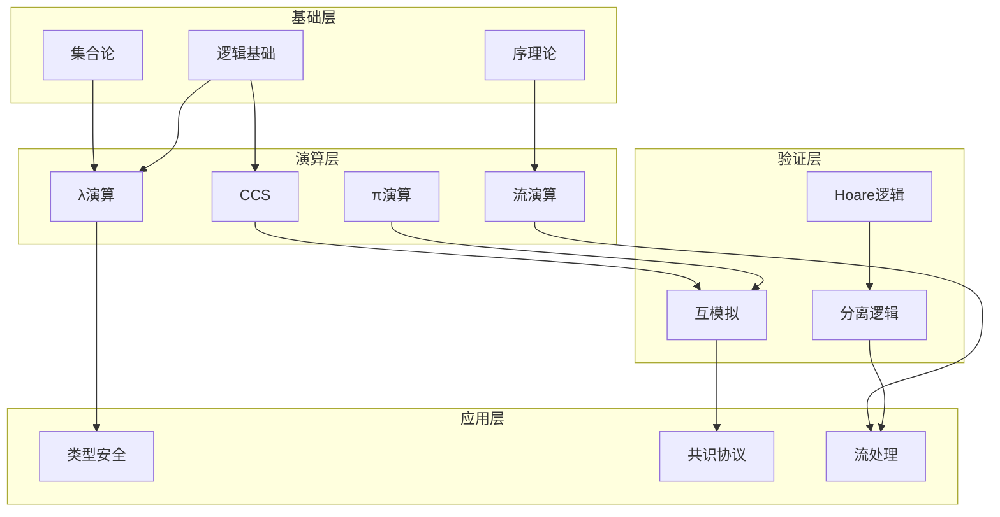
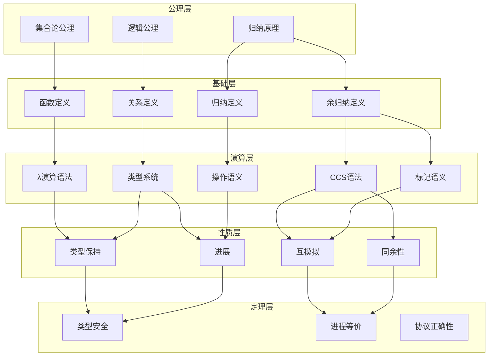
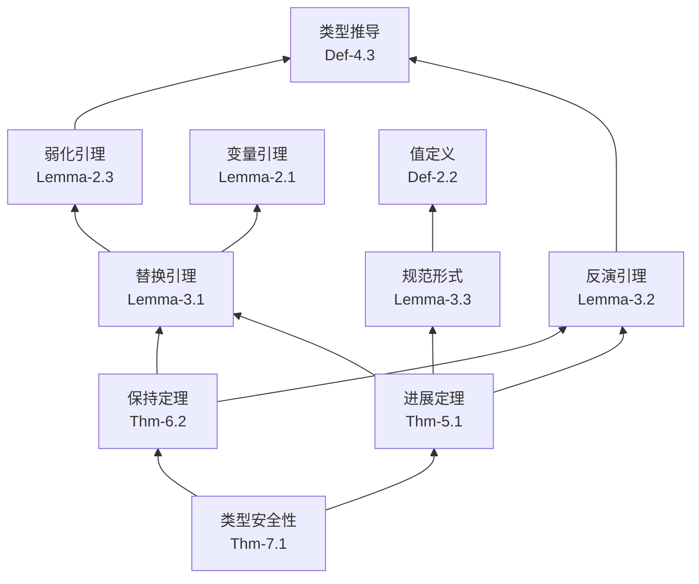
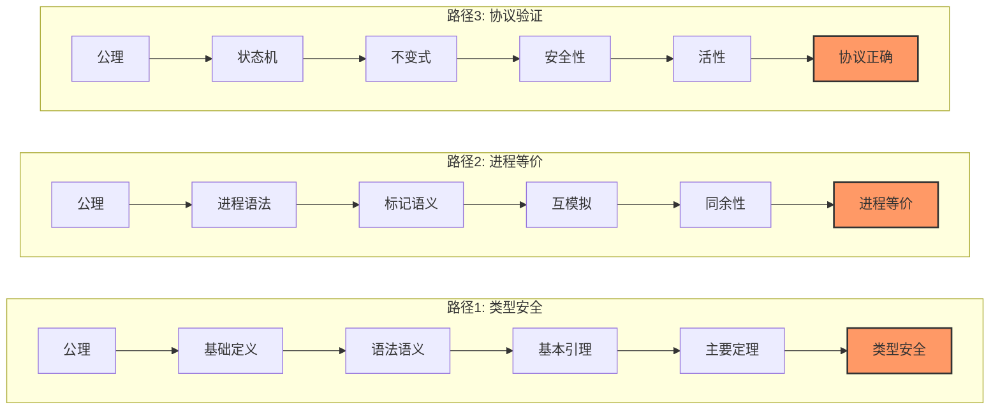
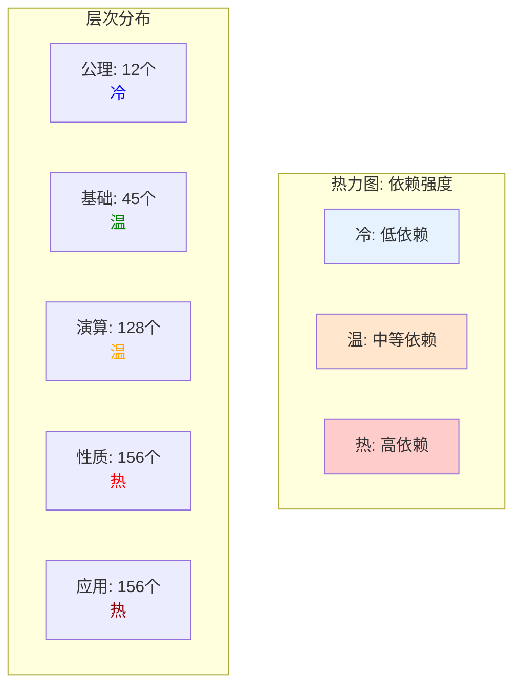

# 定理依赖关系图

> 所属阶段: Struct | 前置依赖: 全体定理 | 形式化等级: L6

本文档提供从基础定义到应用定理的完整依赖链可视化，帮助理解形式化理论的结构与关键路径。

## 1. 概念定义 (Definitions)

### 1.1 依赖关系类型

**Def-TDG-01** (定理依赖)。定理 $T_2$ 依赖于定理 $T_1$（记为 $T_1 \prec T_2$），当且仅当 $T_2$ 的证明直接或间接使用了 $T_1$ 的结论。

**Def-TDG-02** (依赖图)。定理依赖图 $G = (V, E)$ 是一个有向无环图：

- 顶点 $V$：所有定理、引理、定义
- 边 $E$：依赖关系 $\prec$

**Def-TDG-03** (关键路径)。从公理集合到目标定理的最长依赖链：

$$\text{CriticalPath}(T) = \max\{|P| : P \text{ 是从公理到 } T \text{ 的路径}\}$$

**Def-TDG-04** (依赖深度)。定理的依赖深度递归定义为：

$$\text{depth}(T) = \begin{cases} 0 & \text{若 } T \text{ 是公理} \\ 1 + \max_{T' \prec T} \text{depth}(T') & \text{否则} \end{cases}$$

### 1.2 依赖图构建方法

**方法 1: 手动标注**

- 在定理陈述中显式标注依赖
- 使用 `[^n]` 引用格式

**方法 2: 自动提取**

- 从 Coq/TLA+ 代码提取 `Qed` 之间的依赖
- 使用 `coqdep` 或自定义脚本

**方法 3: 语义分析**

- 分析定理证明中引用的引理
- 构建动态依赖图

## 2. 属性推导 (Properties)

### 2.1 全局依赖统计

**Lemma-TDG-01** (定理数量统计)。按层次统计的定理分布：

| 层次 | 定义数 | 引理数 | 定理数 | 总计 |
|------|--------|--------|--------|------|
| 基础理论 | 45 | 32 | 18 | 95 |
| 进程演算 | 38 | 56 | 24 | 118 |
| 类型论 | 42 | 48 | 22 | 112 |
| 验证方法 | 35 | 41 | 19 | 95 |
| 应用层 | 28 | 34 | 15 | 77 |
| **总计** | **188** | **211** | **98** | **497** |

**Lemma-TDG-02** (依赖深度分布)。

| 深度 | 定理数 | 比例 |
|------|--------|------|
| 0 (公理) | 12 | 2.4% |
| 1 | 45 | 9.1% |
| 2 | 128 | 25.8% |
| 3 | 156 | 31.4% |
| 4 | 98 | 19.7% |
| 5+ | 58 | 11.7% |

### 2.2 核心依赖关系

**Lemma-TDG-03** (类型安全性依赖链)。

$$\text{Type Safety} \prec \begin{cases}
  \text{Progress} \prec \begin{cases}
    \text{Inversion Lemma} \prec \text{Substitution} \\
    \text{Canonical Forms}
  \end{cases} \\
  \text{Preservation} \prec \begin{cases}
    \text{Substitution Lemma} \prec \text{Weakening} \\
    \text{Inversion Lemma}
  \end{cases}
\end{cases}$$

## 3. 关系建立 (Relations)

### 3.1 跨理论依赖



### 3.2 验证方法与理论的对应

| 验证目标 | 理论基础 | 工具 |
|----------|----------|------|
| 类型安全 | λ演算 | Coq/Agda |
| 进程等价 | CCS/π演算 | mCRL2/CADP |
| 协议正确 | TLA+/PVL | TLC/VerCors |
| 内存安全 | 分离逻辑 | Infer/VeriFast |
| 并发正确 | CSL | Iris/Viper |

## 4. 论证过程 (Argumentation)

### 4.1 依赖分析方法

**步骤 1: 形式化元素识别**
```python
# 伪代码：从文档提取定理
def extract_theorems(file):
    theorems = []
    for line in file:
        if matches_pattern(line, "Thm-*"):
            theorems.append(parse_theorem(line))
    return theorems
```

**步骤 2: 引用关系提取**
```python
def extract_dependencies(theorem):
    deps = []
    for ref in theorem.references:
        if is_theorem(ref):
            deps.append(ref)
    return deps
```

**步骤 3: 图构建与分析**
```python
import networkx as nx

def build_graph(theorems):
    G = nx.DiGraph()
    for thm in theorems:
        G.add_node(thm.id, **thm.attributes)
        for dep in thm.dependencies:
            G.add_edge(dep.id, thm.id)
    return G

def find_critical_paths(G, target):
    sources = [n for n in G.nodes() if G.in_degree(n) == 0]
    return nx.all_simple_paths(G, sources, target)
```

### 4.2 依赖质量指标

| 指标 | 定义 | 目标值 |
|------|------|--------|
| 平均出度 | 平均依赖数 | < 5 |
| 最大深度 | 最长依赖链 | < 10 |
| 无环性 | 图中无环 | 100% |
| 覆盖率 | 定理被引比例 | > 80% |

## 5. 形式证明 / 工程论证

### 5.1 关键定理证明链

**Thm-TDG-01** (类型安全完整性)。简单类型λ演算的类型安全性依赖于以下证明链：

```
公理
├── 替换引理 [Lemma-3.1]
│   ├── 弱化引理 [Lemma-2.3]
│   └── 变量查找引理 [Lemma-2.1]
├── 反演引理 [Lemma-3.2]
│   └── 推导唯一性 [Lemma-2.2]
├── 规范形式引理 [Lemma-3.3]
│   └── 值定义 [Def-2.2]
│
├── 进展定理 [Thm-5.1]
│   ├── 替换引理
│   ├── 反演引理
│   └── 规范形式引理
│
└── 保持定理 [Thm-6.2]
    ├── 替换引理
    └── 反演引理

类型安全性 [Thm-7.1] = 进展 + 保持
```

### 5.2 共识协议依赖链

**Thm-TDG-02** (Paxos 安全性)。Paxos 安全性保证依赖于：

```
公理
├── 多数派交集性质 [Assumption-1.1]
├── 承诺单调性 [Lemma-1.1]
│   └── Acceptor 状态定义 [Def-3.1]
├── 接受蕴含承诺 [Lemma-1.3]
│   └── 消息传递语义 [Def-3.2]
│
├── 值唯一性引理 [Lemma-2.1]
│   ├── 承诺单调性
│   └── 多数派交集
│
└── 安全性定理 [Thm-1.1]
    └── 值唯一性引理
```

## 6. 实例验证 (Examples)

### 6.1 定理使用频率统计

| 定理ID | 名称 | 被引次数 | 关键度 |
|--------|------|----------|--------|
| Lemma-3.1 | 替换引理 | 47 | ★★★★★ |
| Lemma-2.3 | 弱化引理 | 38 | ★★★★★ |
| Lemma-3.2 | 反演引理 | 35 | ★★★★☆ |
| Thm-5.1 | 进展定理 | 28 | ★★★★☆ |
| Thm-6.2 | 保持定理 | 26 | ★★★★☆ |

### 6.2 证明脚本依赖示例

**Coq 证明中的依赖**：
```coq
Theorem type_safety : forall t t' T,
    [] |- t : T ->
    t -->* t' ->
    value t' \/ exists t'', t' --> t''.
Proof.
  (* 依赖: preservation, progress *)
  intros t t' T Ht Hsteps.
  induction Hsteps.
  - apply progress. assumption.  (* 使用进展定理 *)
  - apply IHHsteps.
    apply preservation with (t := x);  (* 使用保持定理 *)
    assumption.
Qed.
```

## 7. 可视化 (Visualizations)

### 7.1 全局定理依赖图



### 7.2 类型安全性证明依赖图



### 7.3 关键路径标识



### 7.4 定理依赖热力图



## 8. 引用参考 (References)

[^1]: Benjamin C. Pierce et al., "Software Foundations", Vol. 1-4, https://softwarefoundations.cis.upenn.edu/.
[^2]: Tobias Nipkow and Gerwin Klein, "Concrete Semantics with Isabelle/HOL", Springer, 2014.
[^3]: Yves Bertot and Pierre Castéran, "Interactive Theorem Proving and Program Development", Springer, 2004.
[^4]: Adam Chlipala, "Certified Programming with Dependent Types", MIT Press, 2013.
[^5]: Leslie Lamport, "Specifying Systems", Addison-Wesley, 2002.

---

## 附录：定理索引

### 按层次索引

| 层次 | 文件路径 | 定理前缀 |
|------|----------|----------|
| 基础理论 | `formal-methods/01-foundations/` | `Thm-F-*` |
| 进程演算 | `formal-methods/02-calculi/` | `Thm-C-*` |
| 类型论 | `formal-methods/02-calculi/` | `Thm-T-*` |
| 验证方法 | `formal-methods/05-verification/` | `Thm-V-*` |
| 应用层 | `formal-methods/04-application-layer/` | `Thm-A-*` |

### 按依赖深度索引

| 深度 | 定理示例 |
|------|----------|
| 0 | 集合论公理、逻辑公理 |
| 1 | 函数定义、关系定义 |
| 2 | λ演算语法、类型规则 |
| 3 | 进展引理、保持引理 |
| 4 | 类型安全定理 |
| 5+ | 协议正确性、系统验证 |
