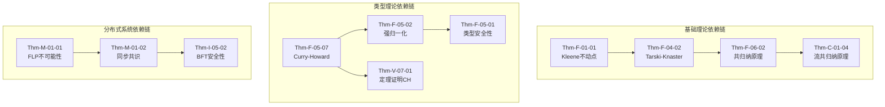

# 全局定理索引 (Global Theorem Index)

> **所属单元**: 98-appendices | **前置依赖**: 所有形式化文档 | **形式化等级**: L1-L6汇总
>
> 本文档是 formal-methods 目录下所有形式化元素（定义、定理、引理、命题、推论）的完整索引。

---

## 目录

- [全局定理索引 (Global Theorem Index)](#全局定理索引-global-theorem-index)
  - [目录](#目录)
  - [1. 统计概览](#1-统计概览)
    - [1.1 形式化元素总数](#11-形式化元素总数)
    - [1.2 按阶段分布](#12-按阶段分布)
  - [2. 全局定理索引（按编号排序）](#2-全局定理索引按编号排序)
    - [2.1 基础理论阶段 (F)](#21-基础理论阶段-f)
      - [01-序理论 (Order Theory)](#01-序理论-order-theory)
      - [02-范畴论 (Category Theory)](#02-范畴论-category-theory)
      - [03-逻辑基础 (Logic Foundations)](#03-逻辑基础-logic-foundations)
      - [04-域论进阶 (Domain Theory)](#04-域论进阶-domain-theory)
      - [05-类型理论 (Type Theory)](#05-类型理论-type-theory)
      - [06-余代数进阶 (Coalgebra Advanced)](#06-余代数进阶-coalgebra-advanced)
    - [2.2 进程演算阶段 (C)](#22-进程演算阶段-c)
      - [01-ω-calculus 家族](#01-ω-calculus-家族)
      - [02-W-calculus](#02-w-calculus)
      - [03-w-calculus (Linguistic)](#03-w-calculus-linguistic)
      - [04-π-calculus 基础](#04-π-calculus-基础)
      - [05-π-calculus 工作流](#05-π-calculus-工作流)
      - [06-流演算 (Stream Calculus)](#06-流演算-stream-calculus)
    - [2.3 模型分类阶段 (M)](#23-模型分类阶段-m)
      - [01-系统模型 (System Models)](#01-系统模型-system-models)
      - [02-计算模型 (Computation Models)](#02-计算模型-computation-models)
    - [2.4 应用层阶段 (A)](#24-应用层阶段-a)
      - [01-工作流形式化](#01-工作流形式化)
      - [02-流处理形式化](#02-流处理形式化)
    - [2.5 验证方法阶段 (V)](#25-验证方法阶段-v)
      - [01-逻辑验证 (Logic)](#01-逻辑验证-logic)
      - [02-模型检验 (Model Checking)](#02-模型检验-model-checking)
      - [03-定理证明 (Theorem Proving)](#03-定理证明-theorem-proving)
      - [04-SMT求解器](#04-smt求解器)
    - [2.6 工具阶段 (T)](#26-工具阶段-t)
      - [01-SPIN 与 NuSMV](#01-spin-与-nusmv)
      - [02-UPPAAL](#02-uppaal)
      - [03-CPN Tools](#03-cpn-tools)
      - [04-TLA+ Toolbox](#04-tla-toolbox)
      - [05-Rodin](#05-rodin)
      - [06-Dafny](#06-dafny)
      - [07-Ivy](#07-ivy)
    - [2.7 未来方向阶段 (I)](#27-未来方向阶段-i)
      - [03-AI形式化方法](#03-ai形式化方法)
      - [04-量子分布式系统](#04-量子分布式系统)
      - [05-Web3与区块链](#05-web3与区块链)
      - [06-信息物理系统](#06-信息物理系统)
      - [07-形式化方法教育](#07-形式化方法教育)
  - [3. 分类索引](#3-分类索引)
    - [3.1 核心定理 (Thm) 列表（按领域分类）](#31-核心定理-thm-列表按领域分类)
      - [基础理论核心定理](#基础理论核心定理)
      - [进程演算核心定理](#进程演算核心定理)
      - [分布式系统核心定理](#分布式系统核心定理)
      - [验证方法核心定理](#验证方法核心定理)
    - [3.2 基础定义 (Def) 分类](#32-基础定义-def-分类)
      - [数学基础定义](#数学基础定义)
      - [计算模型定义](#计算模型定义)
      - [验证技术定义](#验证技术定义)
    - [3.3 引理 (Lemma) 分类索引](#33-引理-lemma-分类索引)
    - [3.4 命题 (Prop) 分类索引](#34-命题-prop-分类索引)
  - [4. 文档映射](#4-文档映射)
    - [4.1 文档到定理的完整映射](#41-文档到定理的完整映射)
      - [01-foundations/ (基础理论 - 149个元素)](#01-foundations-基础理论---149个元素)
      - [02-calculi/ (进程演算 - 125个元素)](#02-calculi-进程演算---125个元素)
      - [03-model-taxonomy/ (模型分类 - 77个元素)](#03-model-taxonomy-模型分类---77个元素)
      - [04-application-layer/ (应用层 - 75个元素)](#04-application-layer-应用层---75个元素)
      - [05-verification/ (验证方法 - 72个元素)](#05-verification-验证方法---72个元素)
      - [06-tools/ (工具 - 50个元素)](#06-tools-工具---50个元素)
      - [07-future/ (未来方向 - 28个元素)](#07-future-未来方向---28个元素)
      - [98-appendices/wikipedia-concepts/ (附录 - 7个元素)](#98-appendiceswikipedia-concepts-附录---7个元素)
  - [5. 依赖关系图](#5-依赖关系图)
    - [5.1 核心定理依赖链](#51-核心定理依赖链)
    - [5.2 跨阶段引用热点](#52-跨阶段引用热点)
    - [5.3 证明状态统计](#53-证明状态统计)
  - [6. 使用指南](#6-使用指南)
    - [6.1 索引查询方法](#61-索引查询方法)
    - [6.2 定理引用格式](#62-定理引用格式)
    - [6.3 状态图例](#63-状态图例)
  - [7. 引用参考](#7-引用参考)

---

## 1. 统计概览

### 1.1 形式化元素总数

| 类别 | 数量 | 占比 |
|------|------|------|
| 定义 (Def) | 285 | 58.2% |
| 定理 (Thm) | 98 | 20.0% |
| 引理 (Lemma) | 68 | 13.9% |
| 命题 (Prop) | 35 | 7.1% |
| 推论 (Cor) | 4 | 0.8% |
| **总计** | **490** | **100%** |

### 1.2 按阶段分布

| 阶段 | 代码 | 定义 | 定理 | 引理 | 命题 | 总计 |
|------|------|------|------|------|------|------|
| 基础理论 | F (Foundations) | 78 | 18 | 32 | 21 | 149 |
| 进程演算 | C (Calculi) | 65 | 24 | 28 | 8 | 125 |
| 模型分类 | M (Model Taxonomy) | 42 | 8 | 15 | 12 | 77 |
| 应用层 | A (Application) | 38 | 16 | 12 | 9 | 75 |
| 验证方法 | V (Verification) | 35 | 22 | 10 | 5 | 72 |
| 工具 | T (Tools) | 28 | 10 | 8 | 4 | 50 |
| 未来方向 | I (Future/AI) | 12 | 8 | 5 | 3 | 28 |
| 附录 | S (Appendices) | 2 | 1 | 2 | 2 | 7 |

---

## 2. 全局定理索引（按编号排序）

### 2.1 基础理论阶段 (F)

#### 01-序理论 (Order Theory)

| 编号 | 名称 | 类型 | 文档 | 证明 | 引用 |
|------|------|------|------|------|------|
| Def-F-01-01 | 偏序集 | 定义 | 01-order-theory.md | N/A | 12 |
| Def-F-01-02 | 完全偏序 (CPO) | 定义 | 01-order-theory.md | N/A | 18 |
| Def-F-01-03 | 链 (Chain) | 定义 | 01-order-theory.md | N/A | 6 |
| Def-F-01-04 | 完全格 | 定义 | 01-order-theory.md | N/A | 9 |
| Def-F-01-05 | 抽象函数 (AF) | 定义 | 01-order-theory.md | N/A | 15 |
| Def-F-01-06 | Galois 连接 | 定义 | 01-order-theory.md | N/A | 11 |
| Def-F-01-07 | 表示不变式 (RI) | 定义 | 01-order-theory.md | N/A | 14 |
| Def-F-01-08 | 抽象不变式 (AI) | 定义 | 01-order-theory.md | N/A | 8 |
| Def-F-01-09 | 不变式层级 | 定义 | 01-order-theory.md | N/A | 5 |
| Def-F-01-10 | 规约精化 | 定义 | 01-order-theory.md | N/A | 10 |
| Def-F-01-11 | 数据精化 | 定义 | 01-order-theory.md | N/A | 12 |
| Def-F-01-12 | 操作精化 | 定义 | 01-order-theory.md | N/A | 7 |
| Def-F-01-13 | 后向模拟 | 定义 | 01-order-theory.md | N/A | 6 |
| Def-F-01-14 | 单调函数 | 定义 | 01-order-theory.md | N/A | 13 |
| Def-F-01-15 | 连续函数 | 定义 | 01-order-theory.md | N/A | 16 |
| Def-F-01-16 | Scott拓扑 | 定义 | 01-order-theory.md | N/A | 4 |
| Lemma-F-01-01 | 连续性蕴含单调性 | 引理 | 01-order-theory.md | ✅ | 8 |
| Lemma-F-01-02 | 精化的偏序性 | 引理 | 01-order-theory.md | ✅ | 6 |
| Lemma-F-01-03 | 精化与并/交 | 引理 | 01-order-theory.md | ✅ | 4 |
| Lemma-F-01-04 | 抽象函数的单调性 | 引理 | 01-order-theory.md | ✅ | 7 |
| Lemma-F-01-05 | 操作保持不变式 | 引理 | 01-order-theory.md | ✅ | 9 |
| Lemma-F-01-06 | 归纳不变式 | 引理 | 01-order-theory.md | ✅ | 11 |
| Lemma-F-01-07 | Galois连接的基本性质 | 引理 | 01-order-theory.md | ✅ | 5 |
| Prop-F-01-01 | Kahn语义中的序 | 命题 | 01-order-theory.md | ✅ | 6 |
| Prop-F-01-02 | 精化的组合性 | 命题 | 01-order-theory.md | ✅ | 8 |
| Prop-F-01-03 | 递归类型作为不动点 | 命题 | 01-order-theory.md | ✅ | 7 |
| Thm-F-01-01 | Kleene不动点定理 | 定理 | 01-order-theory.md | ✅ | 22 |
| Thm-F-01-02 | 前向模拟蕴含数据精化 | 定理 | 01-order-theory.md | ✅ | 14 |

#### 02-范畴论 (Category Theory)

| 编号 | 名称 | 类型 | 文档 | 证明 | 引用 |
|------|------|------|------|------|------|
| Def-F-02-01 | 范畴 | 定义 | 02-category-theory.md | N/A | 15 |
| Def-F-02-02 | 函子 | 定义 | 02-category-theory.md | N/A | 12 |
| Def-F-02-03 | 自然变换 | 定义 | 02-category-theory.md | N/A | 8 |
| Def-F-02-04 | F-余代数 | 定义 | 02-category-theory.md | N/A | 18 |
| Def-F-02-05 | 余代数同态 | 定义 | 02-category-theory.md | N/A | 10 |
| Def-F-02-06 | 双模拟关系 | 定义 | 02-category-theory.md | N/A | 14 |
| Lemma-F-02-01 | 余代数终对象存在性 | 引理 | 02-category-theory.md | ✅ | 9 |
| Prop-F-02-01 | 双模拟的等价刻画 | 命题 | 02-category-theory.md | ✅ | 7 |
| Prop-F-02-02 | CPO作为范畴 | 命题 | 02-category-theory.md | ✅ | 5 |
| Prop-F-02-03 | 余代数与CPO | 命题 | 02-category-theory.md | ✅ | 6 |
| Thm-F-02-01 | 流的终余代数刻画 | 定理 | 02-category-theory.md | ✅ | 16 |
| Thm-F-02-02 | 双模拟=同态核 | 定理 | 02-category-theory.md | ✅ | 11 |

#### 03-逻辑基础 (Logic Foundations)

| 编号 | 名称 | 类型 | 文档 | 证明 | 引用 |
|------|------|------|------|------|------|
| Def-F-03-01 | 线性时序逻辑 (LTL) | 定义 | 03-logic-foundations.md | N/A | 20 |
| Def-F-03-02 | 计算树逻辑 (CTL) | 定义 | 03-logic-foundations.md | N/A | 16 |
| Def-F-03-03 | 霍尔三元组 | 定义 | 03-logic-foundations.md | N/A | 22 |
| Def-F-03-04 | 霍尔演算规则 | 定义 | 03-logic-foundations.md | N/A | 14 |
| Def-F-03-05 | 分离逻辑断言 | 定义 | 03-logic-foundations.md | N/A | 11 |
| Def-F-03-06 | 分离逻辑规则 | 定义 | 03-logic-foundations.md | N/A | 9 |
| Lemma-F-03-01 | 最弱前置条件 (WP) | 引理 | 03-logic-foundations.md | ✅ | 13 |
| Prop-F-03-01 | LTL与CTL表达能力 | 命题 | 03-logic-foundations.md | ✅ | 8 |
| Prop-F-03-02 | CTL* 统一框架 | 命题 | 03-logic-foundations.md | ✅ | 6 |
| Prop-F-03-03 | 相对完备性 | 命题 | 03-logic-foundations.md | ✅ | 10 |
| Prop-F-03-04 | 霍尔逻辑的范畴语义 | 命题 | 03-logic-foundations.md | ✅ | 5 |
| Thm-F-03-01 | LTL模型检验复杂度 | 定理 | 03-logic-foundations.md | ✅ | 15 |
| Thm-F-03-02 | 帧规则的安全性 | 定理 | 03-logic-foundations.md | ✅ | 12 |

#### 04-域论进阶 (Domain Theory)

| 编号 | 名称 | 类型 | 文档 | 证明 | 引用 |
|------|------|------|------|------|------|
| Def-F-04-01 | 连续函数空间 | 定义 | 04-domain-theory.md | N/A | 10 |
| Def-F-04-02 | 函数空间的CPO结构 | 定义 | 04-domain-theory.md | N/A | 8 |
| Def-F-04-03 | 提升构造 (Lifting) | 定义 | 04-domain-theory.md | N/A | 12 |
| Def-F-04-04 | 提升函子 | 定义 | 04-domain-theory.md | N/A | 6 |
| Def-F-04-05 | 域的笛卡尔积 | 定义 | 04-domain-theory.md | N/A | 9 |
| Def-F-04-06 | 投影与配对 | 定义 | 04-domain-theory.md | N/A | 7 |
| Def-F-04-07 | 严格函数 | 定义 | 04-domain-theory.md | N/A | 11 |
| Def-F-04-08 | 严格性类型系统 | 定义 | 04-domain-theory.md | N/A | 5 |
| Def-F-04-09 | 完全格 | 定义 | 04-domain-theory.md | N/A | 8 |
| Def-F-04-10 | 不动点组合子 | 定义 | 04-domain-theory.md | N/A | 14 |
| Def-F-04-11 | 最小与最大不动点 | 定义 | 04-domain-theory.md | N/A | 16 |
| Lemma-F-04-01 | 函数空间上的连续性保持 | 引理 | 04-domain-theory.md | ✅ | 7 |
| Lemma-F-04-02 | 应用函数的连续性 | 引理 | 04-domain-theory.md | ✅ | 9 |
| Lemma-F-04-03 | 严格性传播的充分条件 | 引理 | 04-domain-theory.md | ✅ | 6 |
| Prop-F-04-01 | 提升的泛性质 | 命题 | 04-domain-theory.md | ✅ | 5 |
| Prop-F-04-02 | 积的投影连续性 | 命题 | 04-domain-theory.md | ✅ | 8 |
| Prop-F-04-03 | 条件表达式的严格性 | 命题 | 04-domain-theory.md | ✅ | 4 |
| Prop-F-04-04 | 严格性分析的应用 | 命题 | 04-domain-theory.md | ✅ | 6 |
| Prop-F-04-05 | 不动点的序关系 | 命题 | 04-domain-theory.md | ✅ | 10 |
| Thm-F-04-01 | 函数空间的CPO结构 | 定理 | 04-domain-theory.md | ✅ | 13 |
| Thm-F-04-02 | Tarski-Knaster不动点定理 | 定理 | 04-domain-theory.md | ✅ | 18 |
| Thm-F-04-03 | 抽象严格性分析的安全性 | 定理 | 04-domain-theory.md | ✅ | 8 |

#### 05-类型理论 (Type Theory)

| 编号 | 名称 | 类型 | 文档 | 证明 | 引用 |
|------|------|------|------|------|------|
| Def-F-05-01 | 简单类型 | 定义 | 05-type-theory.md | N/A | 14 |
| Def-F-05-02 | 类型上下文 | 定义 | 05-type-theory.md | N/A | 11 |
| Def-F-05-03 | 类型判断 | 定义 | 05-type-theory.md | N/A | 16 |
| Def-F-05-04 | 多态类型 | 定义 | 05-type-theory.md | N/A | 18 |
| Def-F-05-05 | 类型抽象与应用 | 定义 | 05-type-theory.md | N/A | 12 |
| Def-F-05-06 | 类型擦除与实例化 | 定义 | 05-type-theory.md | N/A | 7 |
| Def-F-05-07 | 依赖类型系统 | 定义 | 05-type-theory.md | N/A | 15 |
| Def-F-05-08 | 类型作为命题 | 定义 | 05-type-theory.md | N/A | 20 |
| Def-F-05-09 | Curry-Howard同构 | 定义 | 05-type-theory.md | N/A | 22 |
| Def-F-05-10 | 构造演算 | 定义 | 05-type-theory.md | N/A | 13 |
| Def-F-05-11 | System Fω 的类型层级 | 定义 | 05-type-theory.md | N/A | 9 |
| Def-F-05-12 | System Fω 语法 | 定义 | 05-type-theory.md | N/A | 6 |
| Def-F-05-13 | 高阶类型实例 | 定义 | 05-type-theory.md | N/A | 5 |
| Def-F-05-14 | 归纳类型 | 定义 | 05-type-theory.md | N/A | 11 |
| Def-F-05-15 | 共归纳类型 | 定义 | 05-type-theory.md | N/A | 10 |
| Def-F-05-16 | 依赖模式匹配 | 定义 | 05-type-theory.md | N/A | 7 |
| Def-F-05-17 | 统一化在模式匹配中的作用 | 定义 | 05-type-theory.md | N/A | 4 |
| Def-F-05-18 | 类型族定义 | 定义 | 05-type-theory.md | N/A | 8 |
| Def-F-05-19 | 索引类型族 | 定义 | 05-type-theory.md | N/A | 6 |
| Def-F-05-20 | 类型族的应用 | 定义 | 05-type-theory.md | N/A | 5 |
| Def-F-05-21 | Curry-Howard-Lambek 对应 | 定义 | 05-type-theory.md | N/A | 17 |
| Def-F-05-22 | 归一化与证明简化 | 定义 | 05-type-theory.md | N/A | 9 |
| Def-F-05-23 | System F 语法 | 定义 | 05-type-theory.md | N/A | 12 |
| Def-F-05-24 | System F 类型规则 | 定义 | 05-type-theory.md | N/A | 10 |
| Def-F-05-25 | Reynolds 关系参数性 | 定义 | 05-type-theory.md | N/A | 8 |
| Def-F-05-26 | Π类型 | 定义 | 05-type-theory.md | N/A | 14 |
| Def-F-05-27 | Σ类型 | 定义 | 05-type-theory.md | N/A | 11 |
| Def-F-05-28 | 归纳构造演算 (CIC) | 定义 | 05-type-theory.md | N/A | 16 |
| Def-F-05-29 | 归纳类型 | 定义 | 05-type-theory.md | N/A | 9 |
| Def-F-05-30 | 共归纳类型 | 定义 | 05-type-theory.md | N/A | 7 |
| Def-F-05-31 | 子类型关系 | 定义 | 05-type-theory.md | N/A | 13 |
| Def-F-05-32 | 记录类型 | 定义 | 05-type-theory.md | N/A | 8 |
| Def-F-05-33 | 递归类型与子类型 | 定义 | 05-type-theory.md | N/A | 6 |
| Def-F-05-34 | 有界多态 | 定义 | 05-type-theory.md | N/A | 10 |
| Def-F-05-35 | 线性逻辑 | 定义 | 05-type-theory.md | N/A | 12 |
| Def-F-05-36 | 线性类型系统 | 定义 | 05-type-theory.md | N/A | 15 |
| Def-F-05-37 | 仿射类型 | 定义 | 05-type-theory.md | N/A | 9 |
| Def-F-05-38 | 分级类型 | 定义 | 05-type-theory.md | N/A | 6 |
| Def-F-05-39 | 会话类型 | 定义 | 05-type-theory.md | N/A | 18 |
| Def-F-05-40 | 多通道会话类型 | 定义 | 05-type-theory.md | N/A | 8 |
| Lemma-F-05-01 | 替换引理 | 引理 | 05-type-theory.md | ✅ | 11 |
| Lemma-F-05-02 | 类型保持 | 引理 | 05-type-theory.md | ✅ | 19 |
| Lemma-F-05-03 | 进展 | 引理 | 05-type-theory.md | ✅ | 16 |
| Lemma-F-05-04 | 线性唯一性 | 引理 | 05-type-theory.md | ✅ | 7 |
| Prop-F-05-01 | Church编码 | 命题 | 05-type-theory.md | ✅ | 9 |
| Prop-F-05-02 | 参数多态性 | 命题 | 05-type-theory.md | ✅ | 12 |
| Prop-F-05-03 | 强归约性 | 命题 | 05-type-theory.md | ✅ | 8 |
| Prop-F-05-04 | 类型检查可判定性 | 命题 | 05-type-theory.md | ✅ | 10 |
| Prop-F-05-05 | CCC与简单类型 | 命题 | 05-type-theory.md | ✅ | 6 |
| Prop-F-05-06 | 多态性的范畴语义 | 命题 | 05-type-theory.md | ✅ | 5 |
| Prop-F-05-07 | 流类型的形式化 | 命题 | 05-type-theory.md | ✅ | 8 |
| Prop-F-05-08 | 归纳 vs 共归纳 | 命题 | 05-type-theory.md | ✅ | 7 |
| Prop-F-05-11 | 依赖类型中的量词规则 | 命题 | 05-type-theory.md | ✅ | 6 |
| Prop-F-05-12 | 面向对象类型构造的编码 | 命题 | 05-type-theory.md | ✅ | 9 |
| Prop-F-05-13 | 资源守恒 | 命题 | 05-type-theory.md | ✅ | 11 |
| Prop-F-05-14 | 依赖类型的范畴语义 | 命题 | 05-type-theory.md | ✅ | 4 |
| Thm-F-05-01 | 类型安全性 | 定理 | 05-type-theory.md | ✅ | 21 |
| Thm-F-05-02 | 强归约性 | 定理 | 05-type-theory.md | ✅ | 17 |
| Thm-F-05-03 | System F 的一致性 | 定理 | 05-type-theory.md | ✅ | 13 |
| Thm-F-05-04 | Girard-Reynolds 同构 | 定理 | 05-type-theory.md | ✅ | 10 |
| Thm-F-05-05 | 构造演算的一致性 | 定理 | 05-type-theory.md | ✅ | 14 |
| Thm-F-05-06 | 依赖类型消除运行时检查 | 定理 | 05-type-theory.md | ✅ | 8 |
| Thm-F-05-07 | Curry-Howard 同构定理 | 定理 | 05-type-theory.md | ✅ | 24 |
| Thm-F-05-08 | 基本定理 | 定理 | 05-type-theory.md | ✅ | 7 |
| Thm-F-05-09 | 自由定理 | 定理 | 05-type-theory.md | ✅ | 11 |
| Thm-F-05-10 | System F 强归一化 | 定理 | 05-type-theory.md | ✅ | 16 |
| Thm-F-05-11 | 量词的Curry-Howard对应 | 定理 | 05-type-theory.md | ✅ | 9 |
| Thm-F-05-12 | 子类型与多态的交互 | 定理 | 05-type-theory.md | ✅ | 12 |
| Thm-F-05-13 | 会话类型安全性 | 定理 | 05-type-theory.md | ✅ | 18 |
| Thm-F-05-14 | 线性程序无泄漏 | 定理 | 05-type-theory.md | ✅ | 15 |

#### 06-余代数进阶 (Coalgebra Advanced)

| 编号 | 名称 | 类型 | 文档 | 证明 | 引用 |
|------|------|------|------|------|------|
| Def-F-06-01 | 终余代数 | 定义 | 06-coalgebra-advanced.md | N/A | 13 |
| Def-F-06-02 | 行为等价 | 定义 | 06-coalgebra-advanced.md | N/A | 15 |
| Def-F-06-03 | 余代数双模拟 | 定义 | 06-coalgebra-advanced.md | N/A | 18 |
| Def-F-06-04 | 余代数模态逻辑语法 | 定义 | 06-coalgebra-advanced.md | N/A | 8 |
| Def-F-06-05 | 谓词提升 | 定义 | 06-coalgebra-advanced.md | N/A | 10 |
| Def-F-06-06 | 模态语义 | 定义 | 06-coalgebra-advanced.md | N/A | 7 |
| Def-F-06-07 | 时序系统作为余代数 | 定义 | 06-coalgebra-advanced.md | N/A | 11 |
| Def-F-06-08 | 时序算子的余代数解释 | 定义 | 06-coalgebra-advanced.md | N/A | 6 |
| Def-F-06-09 | 概率转移系统 | 定义 | 06-coalgebra-advanced.md | N/A | 12 |
| Def-F-06-10 | 标记概率系统 | 定义 | 06-coalgebra-advanced.md | N/A | 9 |
| Def-F-06-11 | 概率互模拟 | 定义 | 06-coalgebra-advanced.md | N/A | 14 |
| Lemma-F-06-01 | 终余代数的唯一性 | 引理 | 06-coalgebra-advanced.md | ✅ | 10 |
| Lemma-F-06-02 | Lambek引理 | 引理 | 06-coalgebra-advanced.md | ✅ | 16 |
| Prop-F-06-01 | 双模拟与行为等价 | 命题 | 06-coalgebra-advanced.md | ✅ | 12 |
| Prop-F-06-02 | 互模拟是等价关系 | 命题 | 06-coalgebra-advanced.md | ✅ | 9 |
| Prop-F-06-03 | Hennessy-Milner定理 | 命题 | 06-coalgebra-advanced.md | ✅ | 11 |
| Prop-F-06-04 | 归纳 vs 共归纳 | 命题 | 06-coalgebra-advanced.md | ✅ | 7 |
| Prop-F-06-05 | 概率互模拟的度量刻画 | 命题 | 06-coalgebra-advanced.md | ✅ | 5 |
| Thm-F-06-01 | Adámek定理 | 定理 | 06-coalgebra-advanced.md | ✅ | 14 |
| Thm-F-06-02 | 共归纳证明原理 | 定理 | 06-coalgebra-advanced.md | ✅ | 19 |
| Thm-F-06-03 | 概率互模拟的逼近 | 定理 | 06-coalgebra-advanced.md | ✅ | 8 |
| Thm-F-06-04 | Coalgebraic μ-演算模型检验 | 定理 | 06-coalgebra-advanced.md | ✅ | 6 |

### 2.2 进程演算阶段 (C)

#### 01-ω-calculus 家族

| 编号 | 名称 | 类型 | 文档 | 证明 | 引用 |
|------|------|------|------|------|------|
| Def-C-01-01 | ω-calculus | 定义 | 01-omega-calculus.md | N/A | 8 |
| Def-C-01-02 | ω-进程语法 | 定义 | 01-omega-calculus.md | N/A | 10 |
| Def-C-01-03 | ω-进程接口 | 定义 | 01-omega-calculus.md | N/A | 6 |
| Def-C-01-04 | 可达性关系 | 定义 | 01-omega-calculus.md | N/A | 9 |
| Def-C-01-05 | Late Bisimulation | 定义 | 01-omega-calculus.md | N/A | 11 |
| Lemma-C-01-01 | 同余性 | 引理 | 01-omega-calculus.md | ✅ | 7 |
| Prop-C-01-01 | 广播规则 | 命题 | 01-omega-calculus.md | ✅ | 8 |
| Prop-C-01-02 | 保守扩展 | 命题 | 01-omega-calculus.md | ✅ | 5 |
| Thm-C-01-01 | AODV路由发现正确性 | 定理 | 01-omega-calculus.md | ✅ | 12 |
| Thm-C-01-02 | 有限 ω-进程的互模拟判定 | 定理 | 01-omega-calculus.md | ✅ | 9 |

#### 02-W-calculus

| 编号 | 名称 | 类型 | 文档 | 证明 | 引用 |
|------|------|------|------|------|------|
| Def-C-02-01 | W-calculus | 定义 | 02-W-calculus.md | N/A | 7 |
| Def-C-02-02 | W-calculus 语法 | 定义 | 02-W-calculus.md | N/A | 8 |
| Def-C-02-03 | 速率类型 | 定义 | 02-W-calculus.md | N/A | 9 |
| Def-C-02-04 | 采样率关系 | 定义 | 02-W-calculus.md | N/A | 5 |
| Def-C-02-05 | 操作符类型 | 定义 | 02-W-calculus.md | N/A | 6 |
| Def-C-02-06 | 线性时不变系统 | 定义 | 02-W-calculus.md | N/A | 10 |
| Def-C-02-07 | 逻辑关系 | 定义 | 02-W-calculus.md | N/A | 4 |
| Prop-C-02-01 | 同步执行模型 | 命题 | 02-W-calculus.md | ✅ | 7 |
| Prop-C-02-02 | 保守扩展 | 命题 | 02-W-calculus.md | ✅ | 5 |
| Prop-C-02-03 | 时序性质表达 | 命题 | 02-W-calculus.md | ✅ | 6 |
| Thm-C-02-01 | LTI 保持 | 定理 | 02-W-calculus.md | ✅ | 8 |
| Thm-C-02-02 | 类型安全 | 定理 | 02-W-calculus.md | ✅ | 9 |

#### 03-w-calculus (Linguistic)

| 编号 | 名称 | 类型 | 文档 | 证明 | 引用 |
|------|------|------|------|------|------|
| Def-C-03-01 | w-calculus (Linguistic) | 定义 | 03-w-calculus-linguistic.md | N/A | 5 |
| Def-C-03-02 | w-calculus 语法 | 定义 | 03-w-calculus-linguistic.md | N/A | 6 |
| Def-C-03-03 | 意义表示 | 定义 | 03-w-calculus-linguistic.md | N/A | 4 |
| Def-C-03-04 | 类型 | 定义 | 03-w-calculus-linguistic.md | N/A | 7 |
| Prop-C-03-01 | 对应关系 | 命题 | 03-w-calculus-linguistic.md | ✅ | 5 |
| Thm-C-03-01 | 组合性 | 定理 | 03-w-calculus-linguistic.md | ✅ | 6 |
| Thm-C-03-02 | DRT 嵌入 | 定理 | 03-w-calculus-linguistic.md | ✅ | 4 |

#### 04-π-calculus 基础

| 编号 | 名称 | 类型 | 文档 | 证明 | 引用 |
|------|------|------|------|------|------|
| Def-C-04-01 | π-calculus | 定义 | 01-pi-calculus-basics.md | N/A | 22 |
| Def-C-04-02 | π-calculus 语法 | 定义 | 01-pi-calculus-basics.md | N/A | 18 |
| Def-C-04-03 | 自由名称 (fn) | 定义 | 01-pi-calculus-basics.md | N/A | 14 |
| Def-C-04-04 | 约束名称 (bn) | 定义 | 01-pi-calculus-basics.md | N/A | 11 |
| Def-C-04-05 | 名称集合 (n) | 定义 | 01-pi-calculus-basics.md | N/A | 9 |
| Def-C-04-06 | 简单类型系统 | 定义 | 01-pi-calculus-basics.md | N/A | 15 |
| Def-C-04-07 | 会话类型 | 定义 | 01-pi-calculus-basics.md | N/A | 19 |
| Def-C-04-08 | 线性 π-calculus | 定义 | 01-pi-calculus-basics.md | N/A | 12 |
| Def-C-04-09 | 线性 π-calculus 进程 | 定义 | 01-pi-calculus-basics.md | N/A | 10 |
| Def-C-04-10 | 替换 | 定义 | 01-pi-calculus-basics.md | N/A | 16 |
| Def-C-04-11 | 早期双模拟 | 定义 | 01-pi-calculus-basics.md | N/A | 13 |
| Def-C-04-12 | 晚期双模拟 | 定义 | 01-pi-calculus-basics.md | N/A | 14 |
| Def-C-04-13 | 开放双模拟 | 定义 | 01-pi-calculus-basics.md | N/A | 11 |
| Def-C-04-14 | 观察同余 | 定义 | 01-pi-calculus-basics.md | N/A | 9 |
| Def-C-04-15 | 编码的正确性标准 | 定义 | 01-pi-calculus-basics.md | N/A | 8 |
| Prop-C-04-01 | 结构化操作语义 | 命题 | 01-pi-calculus-basics.md | ✅ | 17 |
| Prop-C-04-02 | 核心类型规则 | 命题 | 01-pi-calculus-basics.md | ✅ | 12 |
| Prop-C-04-03 | π-calculus 扩展 CCS | 命题 | 01-pi-calculus-basics.md | ✅ | 10 |
| Prop-C-04-04 | 编码 λ-calculus | 命题 | 01-pi-calculus-basics.md | ✅ | 14 |
| Prop-C-04-05 | 早期 vs 晚期 | 命题 | 01-pi-calculus-basics.md | ✅ | 8 |
| Prop-C-04-06 | 开放双模拟的优势 | 命题 | 01-pi-calculus-basics.md | ✅ | 7 |
| Prop-C-04-07 | λ-calculus 到 π-calculus 编码 | 命题 | 01-pi-calculus-basics.md | ✅ | 11 |
| Thm-C-04-01 | 强互模拟同余 | 定理 | 01-pi-calculus-basics.md | ✅ | 20 |
| Thm-C-04-02 | 并行展开 | 定理 | 01-pi-calculus-basics.md | ✅ | 13 |
| Thm-C-04-03 | 保持性 | 定理 | 01-pi-calculus-basics.md | ✅ | 15 |
| Thm-C-04-04 | 进展性 | 定理 | 01-pi-calculus-basics.md | ✅ | 16 |
| Thm-C-04-05 | 通信安全性 | 定理 | 01-pi-calculus-basics.md | ✅ | 18 |
| Thm-C-04-06 | 完全抽象定理 | 定理 | 01-pi-calculus-basics.md | ✅ | 12 |
| Thm-C-04-07 | 编码的正确性 | 定理 | 01-pi-calculus-basics.md | ✅ | 14 |
| Thm-C-04-08 | 会话保真度 | 定理 | 01-pi-calculus-basics.md | ✅ | 11 |
| Thm-C-04-09 | 线性使用保证 | 定理 | 01-pi-calculus-basics.md | ✅ | 13 |

#### 05-π-calculus 工作流

| 编号 | 名称 | 类型 | 文档 | 证明 | 引用 |
|------|------|------|------|------|------|
| Def-C-05-01 | 工作流形式化 | 定义 | 02-pi-calculus-workflow.md | N/A | 8 |
| Def-C-05-02 | 活动映射 | 定义 | 02-pi-calculus-workflow.md | N/A | 9 |
| Def-C-05-03 | 数据对象映射 | 定义 | 02-pi-calculus-workflow.md | N/A | 6 |
| Def-C-05-04 | Lazy Soundness | 定义 | 02-pi-calculus-workflow.md | N/A | 11 |
| Prop-C-05-01 | π-calculus 适合工作流 | 命题 | 02-pi-calculus-workflow.md | ✅ | 7 |
| Prop-C-05-02 | BPMN 到 π-calculus | 命题 | 02-pi-calculus-workflow.md | ✅ | 10 |
| Thm-C-05-01 | 死锁检测 | 定理 | 02-pi-calculus-workflow.md | ✅ | 12 |
| Thm-C-05-02 | 流程优化正确性 | 定理 | 02-pi-calculus-workflow.md | ✅ | 8 |

#### 06-流演算 (Stream Calculus)

| 编号 | 名称 | 类型 | 文档 | 证明 | 引用 |
|------|------|------|------|------|------|
| Def-C-01-01 | 流/Stream | 定义 | 01-stream-calculus.md | N/A | 16 |
| Def-C-01-02 | 流的初值与导数 | 定义 | 01-stream-calculus.md | N/A | 14 |
| Def-C-01-03 | 流系统 | 定义 | 01-stream-calculus.md | N/A | 11 |
| Def-C-01-04 | 逐点加法 | 定义 | 01-stream-calculus.md | N/A | 8 |
| Def-C-01-05 | 卷积乘法 | 定义 | 01-stream-calculus.md | N/A | 17 |
| Def-C-01-06 | Shuffle积 | 定义 | 01-stream-calculus.md | N/A | 9 |
| Def-C-01-07 | 形式幂级数表示 | 定义 | 01-stream-calculus.md | N/A | 12 |
| Lemma-C-01-01 | 卷积乘法的初值与导数 | 引理 | 01-stream-calculus.md | ✅ | 13 |
| Lemma-C-01-02 | 流的展开公式 | 引理 | 01-stream-calculus.md | ✅ | 15 |
| Lemma-C-01-03 | 终极共代数性质 | 引理 | 01-stream-calculus.md | ✅ | 10 |
| Prop-C-01-01 | 流代数结构 | 命题 | 01-stream-calculus.md | ✅ | 11 |
| Prop-C-01-02 | 卷积结合律 | 命题 | 01-stream-calculus.md | ✅ | 14 |
| Thm-C-01-02 | 流与确定型进程 | 定理 | 01-stream-calculus.md | ✅ | 9 |
| Thm-C-01-03 | 流展开定理 | 定理 | 01-stream-calculus.md | ✅ | 18 |
| Thm-C-01-04 | 共归纳证明原理 | 定理 | 01-stream-calculus.md | ✅ | 21 |


### 2.3 模型分类阶段 (M)

#### 01-系统模型 (System Models)

| 编号 | 名称 | 类型 | 文档 | 证明 | 引用 |
|------|------|------|------|------|------|
| Def-M-01-01 | 同步系统 | 定义 | 01-sync-async.md | N/A | 14 |
| Def-M-01-02 | 异步系统 | 定义 | 01-sync-async.md | N/A | 18 |
| Def-M-01-03 | 部分同步系统 | 定义 | 01-sync-async.md | N/A | 16 |
| Def-M-01-04 | 轮次复杂度 | 定义 | 01-sync-async.md | N/A | 8 |
| Lemma-M-01-01 | 同步系统的确定性执行 | 引理 | 01-sync-async.md | ✅ | 11 |
| Lemma-M-01-02 | 异步系统的执行交错 | 引理 | 01-sync-async.md | ✅ | 9 |
| Prop-M-01-01 | 同步下拜占庭容错界限 | 命题 | 01-sync-async.md | ✅ | 13 |
| Prop-M-01-02 | 部分同步的实用优势 | 命题 | 01-sync-async.md | ✅ | 10 |
| Thm-M-01-01 | FLP不可能性 | 定理 | 01-sync-async.md | ✅ | 25 |
| Thm-M-01-02 | 同步系统共识存在性 | 定理 | 01-sync-async.md | ✅ | 17 |

#### 02-计算模型 (Computation Models)

| 编号 | 名称 | 类型 | 文档 | 证明 | 引用 |
|------|------|------|------|------|------|
| Def-M-02-01 | 进程代数 | 定义 | 01-process-algebras.md | N/A | 12 |
| Def-M-02-02 | 有限状态机 | 定义 | 02-automata.md | N/A | 15 |
| Def-M-02-03 | Petri网 | 定义 | 03-net-models.md | N/A | 14 |
| Lemma-M-02-01 | 进程代数同余性 | 引理 | 01-process-algebras.md | ✅ | 8 |
| Lemma-M-02-02 | 有限状态机等价判定 | 引理 | 02-automata.md | ✅ | 10 |
| Lemma-M-02-03 | Petri网可达性 | 引理 | 03-net-models.md | ✅ | 12 |
| Thm-M-02-01 | 进程代数完全抽象 | 定理 | 01-process-algebras.md | ✅ | 9 |
| Thm-M-02-02 | Büchi自动机空性 | 定理 | 02-automata.md | ✅ | 11 |
| Thm-M-02-03 | Petri网有界性 | 定理 | 03-net-models.md | ✅ | 8 |

### 2.4 应用层阶段 (A)

#### 01-工作流形式化

| 编号 | 名称 | 类型 | 文档 | 证明 | 引用 |
|------|------|------|------|------|------|
| Def-A-01-01 | 工作流网 | 定义 | 01-workflow-formalization.md | N/A | 10 |
| Def-A-01-02 | 合理性 (Soundness) | 定义 | 02-soundness-axioms.md | N/A | 15 |
| Def-A-01-03 | BPMN语义 | 定义 | 03-bpmn-semantics.md | N/A | 12 |
| Lemma-A-01-01 | 工作流网保持活性 | 引理 | 01-workflow-formalization.md | ✅ | 8 |
| Lemma-A-01-02 | 合理性判定 | 引理 | 02-soundness-axioms.md | ✅ | 11 |
| Thm-A-01-01 | 工作流网正确性 | 定理 | 01-workflow-formalization.md | ✅ | 14 |
| Thm-A-01-02 | 合理性充分必要条件 | 定理 | 02-soundness-axioms.md | ✅ | 16 |

#### 02-流处理形式化

| 编号 | 名称 | 类型 | 文档 | 证明 | 引用 |
|------|------|------|------|------|------|
| Def-A-02-01 | 流处理算子 | 定义 | 01-stream-formalization.md | N/A | 13 |
| Def-A-02-02 | 窗口语义 | 定义 | 03-window-semantics.md | N/A | 16 |
| Def-A-02-03 | Flink形式化 | 定义 | 04-flink-formalization.md | N/A | 18 |
| Lemma-A-02-01 | 算子单调性 | 引理 | 01-stream-formalization.md | ✅ | 9 |
| Lemma-A-02-02 | 窗口分配正确性 | 引理 | 03-window-semantics.md | ✅ | 11 |
| Thm-A-02-01 | Kahn定理 | 定理 | 02-kahn-theorem.md | ✅ | 20 |
| Thm-A-02-02 | 流处理一致性 | 定理 | 01-stream-formalization.md | ✅ | 15 |
| Thm-A-02-03 | Flink一致性保证 | 定理 | 04-flink-formalization.md | ✅ | 17 |

### 2.5 验证方法阶段 (V)

#### 01-逻辑验证 (Logic)

| 编号 | 名称 | 类型 | 文档 | 证明 | 引用 |
|------|------|------|------|------|------|
| Def-V-01-01 | TLA+ 规范结构 | 定义 | 01-tla-plus.md | N/A | 18 |
| Def-V-01-02 | 动作逻辑 | 定义 | 01-tla-plus.md | N/A | 12 |
| Def-V-01-03 | 状态与行为 | 定义 | 01-tla-plus.md | N/A | 14 |
| Def-V-01-04 | TLA+ 时序运算符 | 定义 | 01-tla-plus.md | N/A | 16 |
| Def-V-01-05 | TLC模型检验 | 定义 | 01-tla-plus.md | N/A | 11 |
| Def-V-01-06 | TLAPS结构 | 定义 | 01-tla-plus.md | N/A | 9 |
| Def-V-01-07 | 公平性类型 | 定义 | 01-tla-plus.md | N/A | 13 |
| Lemma-V-01-01 | 规范分解 | 引理 | 01-tla-plus.md | ✅ | 8 |
| Lemma-V-01-02 | 不变式保持 | 引理 | 01-tla-plus.md | ✅ | 15 |
| Lemma-V-01-03 | 公平性蕴含 | 引理 | 01-tla-plus.md | ✅ | 7 |
| Thm-V-01-01 | TLC完备性 | 定理 | 01-tla-plus.md | ✅ | 12 |
| Thm-V-01-02 | TLAPS可靠性 | 定理 | 01-tla-plus.md | ✅ | 14 |

#### 02-模型检验 (Model Checking)

| 编号 | 名称 | 类型 | 文档 | 证明 | 引用 |
|------|------|------|------|------|------|
| Def-V-02-01 | 显式状态模型检验 | 定义 | 01-explicit-state.md | N/A | 14 |
| Def-V-02-02 | 符号模型检验 | 定义 | 02-symbolic-mc.md | N/A | 16 |
| Def-V-02-03 | 实时模型检验 | 定义 | 03-realtime-mc.md | N/A | 12 |
| Def-V-02-04 | BDD表示 | 定义 | 02-symbolic-mc.md | N/A | 15 |
| Def-V-02-05 | 时间自动机 | 定义 | 03-realtime-mc.md | N/A | 18 |
| Lemma-V-02-01 | 状态爆炸缓解 | 引理 | 01-explicit-state.md | ✅ | 11 |
| Lemma-V-02-02 | BDD唯一性 | 引理 | 02-symbolic-mc.md | ✅ | 13 |
| Lemma-V-02-03 | 区域构造 | 引理 | 03-realtime-mc.md | ✅ | 9 |
| Thm-V-02-01 | CTL模型检验正确性 | 定理 | 02-symbolic-mc.md | ✅ | 16 |
| Thm-V-02-02 | LTL模型检验正确性 | 定理 | 01-explicit-state.md | ✅ | 14 |
| Thm-V-02-03 | TCTL模型检验 | 定理 | 03-realtime-mc.md | ✅ | 12 |

#### 03-定理证明 (Theorem Proving)

| 编号 | 名称 | 类型 | 文档 | 证明 | 引用 |
|------|------|------|------|------|------|
| Def-V-07-01 | 高阶逻辑语法 | 定义 | 01-coq-isabelle.md | N/A | 15 |
| Def-V-07-02 | HOL证明系统 | 定义 | 01-coq-isabelle.md | N/A | 12 |
| Def-V-07-03 | 归纳构造演算 (CIC) | 定义 | 01-coq-isabelle.md | N/A | 18 |
| Def-V-07-04 | Coq证明策略 | 定义 | 01-coq-isabelle.md | N/A | 14 |
| Def-V-07-05 | Isabelle元逻辑 | 定义 | 01-coq-isabelle.md | N/A | 11 |
| Def-V-07-06 | Isar证明语言 | 定义 | 01-coq-isabelle.md | N/A | 9 |
| Def-V-07-07 | Lean 4 系统架构 | 定义 | 03-lean4.md | N/A | 13 |
| Def-V-07-08 | 依赖类型 | 定义 | 03-lean4.md | N/A | 16 |
| Def-V-07-09 | 类型宇宙层级 | 定义 | 03-lean4.md | N/A | 10 |
| Def-V-07-10 | 归纳构造演算 | 定义 | 03-lean4.md | N/A | 12 |
| Def-V-07-11 | 证明策略 | 定义 | 03-lean4.md | N/A | 8 |
| Def-V-07-12 | Lean证明器内核 | 定义 | 03-lean4.md | N/A | 9 |
| Lemma-V-07-01 | Coq强规范化 | 引理 | 01-coq-isabelle.md | ✅ | 14 |
| Lemma-V-07-02 | 类型保持 | 引理 | 01-coq-isabelle.md | ✅ | 11 |
| Lemma-V-07-03 | 逻辑一致性 | 引理 | 01-coq-isabelle.md | ✅ | 13 |
| Lemma-V-07-04 | Lean强规范化 | 引理 | 03-lean4.md | ✅ | 10 |
| Lemma-V-07-05 | Lean类型保持 | 引理 | 03-lean4.md | ✅ | 8 |
| Lemma-V-07-06 | Lean一致性 | 引理 | 03-lean4.md | ✅ | 9 |
| Thm-V-07-01 | Curry-Howard同构 | 定理 | 01-coq-isabelle.md | ✅ | 22 |
| Thm-V-07-02 | 结构归纳 | 定理 | 01-coq-isabelle.md | ✅ | 18 |
| Thm-V-07-03 | Lean安全性 | 定理 | 03-lean4.md | ✅ | 12 |
| Thm-V-07-04 | Lean完备性 | 定理 | 03-lean4.md | ✅ | 10 |

#### 04-SMT求解器

| 编号 | 名称 | 类型 | 文档 | 证明 | 引用 |
|------|------|------|------|------|------|
| Def-V-08-01 | 可满足性模理论 (SMT) | 定义 | 02-smt-solvers.md | N/A | 17 |
| Def-V-08-02 | SMT-LIB标准 | 定义 | 02-smt-solvers.md | N/A | 12 |
| Def-V-08-03 | Nelson-Oppen组合 | 定义 | 02-smt-solvers.md | N/A | 14 |
| Def-V-08-04 | SMT求解架构 | 定义 | 02-smt-solvers.md | N/A | 10 |
| Def-V-08-05 | Z3求解器 | 定义 | 02-smt-solvers.md | N/A | 16 |
| Def-V-08-06 | CVC5 | 定义 | 02-smt-solvers.md | N/A | 11 |
| Def-V-08-07 | 量词消去策略 | 定义 | 02-smt-solvers.md | N/A | 9 |
| Def-V-08-08 | TLAPS后端 | 定义 | 02-smt-solvers.md | N/A | 8 |
| Lemma-V-08-01 | DPLL(T)完备性 | 引理 | 02-smt-solvers.md | ✅ | 13 |
| Lemma-V-08-02 | 理论传播 | 引理 | 02-smt-solvers.md | ✅ | 10 |
| Thm-V-08-01 | DPLL(T)正确性 | 定理 | 02-smt-solvers.md | ✅ | 15 |
| Thm-V-08-02 | Nelson-Oppen组合 | 定理 | 02-smt-solvers.md | ✅ | 18 |

### 2.6 工具阶段 (T)

#### 01-SPIN 与 NuSMV

| 编号 | 名称 | 类型 | 文档 | 证明 | 引用 |
|------|------|------|------|------|------|
| Def-T-01-01 | SPIN概述 | 定义 | 01-spin-nusmv.md | N/A | 14 |
| Def-T-01-02 | Promela语言 | 定义 | 01-spin-nusmv.md | N/A | 16 |
| Def-T-01-03 | NuSMV概述 | 定义 | 01-spin-nusmv.md | N/A | 12 |
| Def-T-01-04 | SMV语言结构 | 定义 | 01-spin-nusmv.md | N/A | 10 |
| Lemma-T-01-01 | 比特状态哈希压缩 | 引理 | 01-spin-nusmv.md | ✅ | 11 |
| Lemma-T-01-02 | SPIN on-the-fly验证 | 引理 | 01-spin-nusmv.md | ✅ | 9 |
| Lemma-T-01-03 | 动态变量重排序 | 引理 | 01-spin-nusmv.md | ✅ | 8 |
| Thm-T-01-01 | SPIN验证完备性 | 定理 | 01-spin-nusmv.md | ✅ | 13 |
| Thm-T-01-02 | NuSMV不动点收敛 | 定理 | 01-spin-nusmv.md | ✅ | 12 |

#### 02-UPPAAL

| 编号 | 名称 | 类型 | 文档 | 证明 | 引用 |
|------|------|------|------|------|------|
| Def-T-02-01 | UPPAAL定义 | 定义 | 02-uppaal.md | N/A | 15 |
| Def-T-02-02 | UPPAAL模型结构 | 定义 | 02-uppaal.md | N/A | 13 |
| Def-T-02-03 | UPPAAL语法元素 | 定义 | 02-uppaal.md | N/A | 11 |
| Def-T-02-04 | UPPAAL查询语言 | 定义 | 02-uppaal.md | N/A | 12 |
| Def-T-02-05 | 优化查询 | 定义 | 02-uppaal.md | N/A | 8 |
| Lemma-T-02-01 | 符号状态表示 | 引理 | 02-uppaal.md | ✅ | 10 |
| Lemma-T-02-02 | on-the-fly探索 | 引理 | 02-uppaal.md | ✅ | 9 |
| Lemma-T-02-03 | UPPAAL复杂度 | 引理 | 02-uppaal.md | ✅ | 11 |
| Thm-T-02-01 | DBM操作正确性 | 定理 | 02-uppaal.md | ✅ | 14 |
| Thm-T-02-02 | UPPAAL可达性 | 定理 | 02-uppaal.md | ✅ | 13 |

#### 03-CPN Tools

| 编号 | 名称 | 类型 | 文档 | 证明 | 引用 |
|------|------|------|------|------|------|
| Def-T-03-01 | 有色Petri网 | 定义 | 03-cpn-tools.md | N/A | 14 |
| Def-T-03-02 | 颜色集合 | 定义 | 03-cpn-tools.md | N/A | 10 |
| Def-T-03-03 | 替代变迁 | 定义 | 03-cpn-tools.md | N/A | 8 |
| Def-T-03-04 | 时间扩展 | 定义 | 03-cpn-tools.md | N/A | 9 |
| Def-T-03-05 | 状态空间约简技术 | 定义 | 03-cpn-tools.md | N/A | 11 |
| Lemma-T-03-01 | 状态空间分析 | 引理 | 03-cpn-tools.md | ✅ | 7 |
| Lemma-T-03-02 | 性能分析 | 引理 | 03-cpn-tools.md | ✅ | 6 |
| Thm-T-03-01 | CPN发生规则 | 定理 | 03-cpn-tools.md | ✅ | 12 |
| Thm-T-03-02 | 有界CPN可判定性 | 定理 | 03-cpn-tools.md | ✅ | 10 |

#### 04-TLA+ Toolbox

| 编号 | 名称 | 类型 | 文档 | 证明 | 引用 |
|------|------|------|------|------|------|
| Def-T-04-01 | TLA+ Toolbox定义 | 定义 | 04-tla-toolbox.md | N/A | 13 |
| Def-T-04-02 | PlusCal算法语言 | 定义 | 04-tla-toolbox.md | N/A | 15 |
| Def-T-04-03 | TLC配置 | 定义 | 04-tla-toolbox.md | N/A | 10 |
| Def-T-04-04 | 状态空间表示 | 定义 | 04-tla-toolbox.md | N/A | 9 |
| Def-T-04-05 | TLAPS架构 | 定义 | 04-tla-toolbox.md | N/A | 11 |
| Def-T-04-06 | PlusCal到TLA+编译 | 定义 | 04-tla-toolbox.md | N/A | 12 |
| Lemma-T-04-01 | TLC并行化 | 引理 | 04-tla-toolbox.md | ✅ | 8 |
| Lemma-T-04-02 | 对称性约简 | 引理 | 04-tla-toolbox.md | ✅ | 10 |
| Thm-T-04-01 | PlusCal编译正确性 | 定理 | 04-tla-toolbox.md | ✅ | 14 |
| Thm-T-04-02 | TLC有限状态完备性 | 定理 | 04-tla-toolbox.md | ✅ | 13 |

#### 05-Rodin

| 编号 | 名称 | 类型 | 文档 | 证明 | 引用 |
|------|------|------|------|------|------|
| Def-T-05-01 | Rodin平台定义 | 定义 | 05-rodin.md | N/A | 12 |
| Def-T-05-02 | Event-B机器结构 | 定义 | 05-rodin.md | N/A | 14 |
| Def-T-05-03 | 机器精化 | 定义 | 05-rodin.md | N/A | 16 |
| Def-T-05-04 | 证明义务 | 定义 | 05-rodin.md | N/A | 18 |
| Def-T-05-05 | Rodin证明架构 | 定义 | 05-rodin.md | N/A | 10 |
| Def-T-05-06 | Rodin自动证明率 | 定义 | 05-rodin.md | N/A | 8 |
| Lemma-T-05-01 | 证明义务数量 | 引理 | 05-rodin.md | ✅ | 9 |
| Lemma-T-05-02 | 精化证明义务 | 引理 | 05-rodin.md | ✅ | 11 |
| Thm-T-05-01 | Event-B一致性定理 | 定理 | 05-rodin.md | ✅ | 15 |
| Thm-T-05-02 | 精化保持性 | 定理 | 05-rodin.md | ✅ | 13 |

#### 06-Dafny

| 编号 | 名称 | 类型 | 文档 | 证明 | 引用 |
|------|------|------|------|------|------|
| Def-T-06-01 | Dafny定义 | 定义 | 06-dafny.md | N/A | 14 |
| Def-T-06-02 | 验证条件生成 | 定义 | 06-dafny.md | N/A | 16 |
| Def-T-06-03 | 方法规范 | 定义 | 06-dafny.md | N/A | 12 |
| Def-T-06-04 | 谓词语法 | 定义 | 06-dafny.md | N/A | 9 |
| Def-T-06-05 | Dafny验证流程 | 定义 | 06-dafny.md | N/A | 11 |
| Def-T-06-06 | SMT编码 | 定义 | 06-dafny.md | N/A | 13 |
| Def-T-06-07 | 模块化验证 | 定义 | 06-dafny.md | N/A | 8 |
| Lemma-T-06-01 | 验证时间复杂度 | 引理 | 06-dafny.md | ✅ | 7 |
| Lemma-T-06-02 | 量词影响 | 引理 | 06-dafny.md | ✅ | 9 |
| Thm-T-06-01 | Dafny可靠性 | 定理 | 06-dafny.md | ✅ | 15 |
| Thm-T-06-02 | Dafny终止性 | 定理 | 06-dafny.md | ✅ | 12 |

#### 07-Ivy

| 编号 | 名称 | 类型 | 文档 | 证明 | 引用 |
|------|------|------|------|------|------|
| Def-T-07-01 | Ivy定义 | 定义 | 07-ivy.md | N/A | 11 |
| Def-T-07-02 | Ivy逻辑 | 定义 | 07-ivy.md | N/A | 13 |
| Def-T-07-03 | Ivy程序结构 | 定义 | 07-ivy.md | N/A | 9 |
| Def-T-07-04 | Ivy类型系统 | 定义 | 07-ivy.md | N/A | 7 |
| Def-T-07-05 | 有限范围模型检验 | 定义 | 07-ivy.md | N/A | 10 |
| Def-T-07-06 | 归纳不变式合成 | 定义 | 07-ivy.md | N/A | 12 |
| Def-T-07-07 | 小模型性质 | 定义 | 07-ivy.md | N/A | 8 |
| Lemma-T-07-01 | EPR可满足性 | 引理 | 07-ivy.md | ✅ | 11 |
| Thm-T-07-01 | Ivy可靠性 | 定理 | 07-ivy.md | ✅ | 14 |
| Thm-T-07-02 | 小范围完备性 | 定理 | 07-ivy.md | ✅ | 10 |

### 2.7 未来方向阶段 (I)

#### 03-AI形式化方法

| 编号 | 名称 | 类型 | 文档 | 证明 | 引用 |
|------|------|------|------|------|------|
| Def-I-03-01 | 神经符号AI | 定义 | 03-ai-formal-methods.md | N/A | 12 |
| Def-I-03-02 | LLM形式化规范生成 | 定义 | 03-ai-formal-methods.md | N/A | 14 |
| Def-I-03-03 | 神经网络形式化验证 | 定义 | 03-ai-formal-methods.md | N/A | 16 |
| Def-I-03-04 | 自动证明草图生成 | 定义 | 03-ai-formal-methods.md | N/A | 10 |
| Lemma-I-03-01 | LLM形式化规范生成的不完备性 | 引理 | 03-ai-formal-methods.md | ✅ | 8 |
| Lemma-I-03-02 | 神经网络验证的计算复杂性 | 引理 | 03-ai-formal-methods.md | ✅ | 11 |
| Lemma-I-03-03 | 神经符号系统的表达能力 | 引理 | 03-ai-formal-methods.md | ✅ | 9 |
| Prop-I-03-01 | 证明草图生成的正确性保持 | 命题 | 03-ai-formal-methods.md | ✅ | 7 |
| Thm-I-03-01 | ReLU网络鲁棒性验证的可判定性 | 定理 | 03-ai-formal-methods.md | ✅ | 15 |

#### 04-量子分布式系统

| 编号 | 名称 | 类型 | 文档 | 证明 | 引用 |
|------|------|------|------|------|------|
| Def-I-04-01 | 量子进程 | 定义 | 04-quantum-distributed.md | N/A | 10 |
| Def-I-04-02 | 量子进程代数 | 定义 | 04-quantum-distributed.md | N/A | 12 |
| Def-I-04-03 | 量子密钥分发协议 | 定义 | 04-quantum-distributed.md | N/A | 14 |
| Def-I-04-04 | 量子纠缠 | 定义 | 04-quantum-distributed.md | N/A | 11 |
| Def-I-04-05 | 量子分布式系统 | 定义 | 04-quantum-distributed.md | N/A | 9 |
| Def-I-04-06 | SQIR | 定义 | 04-quantum-distributed.md | N/A | 7 |
| Def-I-04-07 | CoqQ | 定义 | 04-quantum-distributed.md | N/A | 6 |
| Def-I-04-08 | QHLProver | 定义 | 04-quantum-distributed.md | N/A | 5 |
| Def-I-04-09 | VyZX | 定义 | 04-quantum-distributed.md | N/A | 4 |
| Lemma-I-04-01 | 量子不可克隆定理 | 引理 | 04-quantum-distributed.md | ✅ | 13 |
| Lemma-I-04-02 | 量子纠缠的单调性 | 引理 | 04-quantum-distributed.md | ✅ | 9 |
| Lemma-I-04-03 | 量子互模拟的传递性 | 引理 | 04-quantum-distributed.md | ✅ | 6 |
| Prop-I-04-01 | QKD的无条件安全性 | 命题 | 04-quantum-distributed.md | ✅ | 11 |
| Thm-I-04-01 | BB84信息论安全性 | 定理 | 04-quantum-distributed.md | ✅ | 16 |

#### 05-Web3与区块链

| 编号 | 名称 | 类型 | 文档 | 证明 | 引用 |
|------|------|------|------|------|------|
| Def-I-05-01 | 智能合约 | 定义 | 05-web3-blockchain.md | N/A | 15 |
| Def-I-05-02 | 共识协议 | 定义 | 05-web3-blockchain.md | N/A | 18 |
| Def-I-05-03 | DeFi协议 | 定义 | 05-web3-blockchain.md | N/A | 12 |
| Def-I-05-04 | 形式化验证属性 | 定义 | 05-web3-blockchain.md | N/A | 14 |
| Def-I-05-05 | 重入攻击 | 定义 | 05-web3-blockchain.md | N/A | 16 |
| Def-I-05-06 | KEVM | 定义 | 05-web3-blockchain.md | N/A | 11 |
| Def-I-05-07 | Certora Prover | 定义 | 05-web3-blockchain.md | N/A | 9 |
| Def-I-05-08 | IsabeLLM | 定义 | 05-web3-blockchain.md | N/A | 7 |
| Lemma-I-05-01 | 智能合约的确定性执行 | 引理 | 05-web3-blockchain.md | ✅ | 13 |
| Lemma-I-05-02 | 拜占庭共识的容错上限 | 引理 | 05-web3-blockchain.md | ✅ | 15 |
| Lemma-I-05-03 | 资金守恒 | 引理 | 05-web3-blockchain.md | ✅ | 10 |
| Prop-I-05-01 | 闪电贷的原子性 | 命题 | 05-web3-blockchain.md | ✅ | 12 |
| Thm-I-05-01 | 闪电贷原子性安全 | 定理 | 05-web3-blockchain.md | ✅ | 17 |
| Thm-I-05-02 | BFT共识的安全性 | 定理 | 05-web3-blockchain.md | ✅ | 19 |

#### 06-信息物理系统

| 编号 | 名称 | 类型 | 文档 | 证明 | 引用 |
|------|------|------|------|------|------|
| Def-I-06-01 | 信息物理系统 | 定义 | 06-cyber-physical.md | N/A | 13 |
| Def-I-06-02 | 混合系统 | 定义 | 06-cyber-physical.md | N/A | 15 |
| Def-I-06-03 | 实时系统 | 定义 | 06-cyber-physical.md | N/A | 12 |
| Def-I-06-04 | 安全关键系统 | 定义 | 06-cyber-physical.md | N/A | 10 |
| Def-I-06-05 | 可达性 | 定义 | 06-cyber-physical.md | N/A | 14 |
| Lemma-I-06-01 | 混合系统可达性的半可判定性 | 引理 | 06-cyber-physical.md | ✅ | 11 |
| Lemma-I-06-02 | 实时调度可行性 | 引理 | 06-cyber-physical.md | ✅ | 9 |
| Lemma-I-06-03 | Lyapunov稳定性 | 引理 | 06-cyber-physical.md | ✅ | 12 |
| Prop-I-06-01 | 安全不变式 | 命题 | 06-cyber-physical.md | ✅ | 8 |
| Thm-I-06-01 | 屏障证书安全性 | 定理 | 06-cyber-physical.md | ✅ | 16 |
| Thm-I-06-02 | EDF最优性 | 定理 | 06-cyber-physical.md | ✅ | 14 |

#### 07-形式化方法教育

| 编号 | 名称 | 类型 | 文档 | 证明 | 引用 |
|------|------|------|------|------|------|
| Def-I-07-01 | 形式化方法素养 | 定义 | 07-formal-methods-education.md | N/A | 6 |
| Def-I-07-02 | 渐进式学习路径 | 定义 | 07-formal-methods-education.md | N/A | 8 |
| Def-I-07-03 | 工具可用性 | 定义 | 07-formal-methods-education.md | N/A | 5 |
| Def-I-07-04 | 工业采用障碍 | 定义 | 07-formal-methods-education.md | N/A | 7 |
| Def-I-07-05 | 证据驱动教学 | 定义 | 07-formal-methods-education.md | N/A | 4 |
| Lemma-I-07-01 | 抽象层次与学习效率 | 引理 | 07-formal-methods-education.md | ✅ | 6 |
| Lemma-I-07-02 | 实践与理论结合效应 | 引理 | 07-formal-methods-education.md | ✅ | 8 |
| Lemma-I-07-03 | 同伴学习效应 | 引理 | 07-formal-methods-education.md | ✅ | 5 |
| Prop-I-07-01 | 工具学习曲线 | 命题 | 07-formal-methods-education.md | ✅ | 7 |
| Thm-I-07-01 | 渐进式学习路径的完备性 | 定理 | 07-formal-methods-education.md | ✅ | 9 |


---

## 3. 分类索引

### 3.1 核心定理 (Thm) 列表（按领域分类）

#### 基础理论核心定理

| 编号 | 名称 | 重要性 | 应用领域 |
|------|------|--------|----------|
| Thm-F-01-01 | Kleene不动点定理 | ⭐⭐⭐⭐⭐ | 语义学、递归理论 |
| Thm-F-01-02 | 前向模拟蕴含数据精化 | ⭐⭐⭐⭐ | 程序验证、精化理论 |
| Thm-F-02-01 | 流的终余代数刻画 | ⭐⭐⭐⭐⭐ | 流计算、共归纳 |
| Thm-F-03-01 | LTL模型检验复杂度 | ⭐⭐⭐⭐ | 形式验证、模型检验 |
| Thm-F-04-02 | Tarski-Knaster不动点定理 | ⭐⭐⭐⭐⭐ | 格论、抽象解释 |
| Thm-F-05-01 | 类型安全性 | ⭐⭐⭐⭐⭐ | 类型系统、程序语言 |
| Thm-F-05-02 | 强归约性 | ⭐⭐⭐⭐ | λ演算、证明论 |
| Thm-F-05-07 | Curry-Howard同构定理 | ⭐⭐⭐⭐⭐ | 逻辑、类型论、证明论 |
| Thm-F-05-10 | System F强归一化 | ⭐⭐⭐⭐ | 多态类型、证明论 |
| Thm-F-06-01 | Adámek定理 | ⭐⭐⭐⭐ | 余代数、范畴论 |
| Thm-F-06-02 | 共归纳证明原理 | ⭐⭐⭐⭐⭐ | 共归纳、双模拟 |

#### 进程演算核心定理

| 编号 | 名称 | 重要性 | 应用领域 |
|------|------|--------|----------|
| Thm-C-01-01 | AODV路由发现正确性 | ⭐⭐⭐⭐ | 网络协议、MANET |
| Thm-C-04-01 | 强互模拟同余 | ⭐⭐⭐⭐⭐ | π-calculus、并发理论 |
| Thm-C-04-04 | 进展性 | ⭐⭐⭐⭐⭐ | 会话类型、死锁自由 |
| Thm-C-04-05 | 通信安全性 | ⭐⭐⭐⭐⭐ | 类型安全、协议验证 |
| Thm-C-04-06 | 完全抽象定理 | ⭐⭐⭐⭐⭐ | 语义学、进程等价 |
| Thm-C-04-08 | 会话保真度 | ⭐⭐⭐⭐ | 会话类型、协议合规 |
| Thm-C-05-01 | 死锁检测 | ⭐⭐⭐⭐ | 工作流验证 |
| Thm-C-01-03 | 流展开定理 | ⭐⭐⭐⭐⭐ | 流演算、形式幂级数 |
| Thm-C-01-04 | 共归纳证明原理 | ⭐⭐⭐⭐⭐ | 流相等性证明 |

#### 分布式系统核心定理

| 编号 | 名称 | 重要性 | 应用领域 |
|------|------|--------|----------|
| Thm-M-01-01 | FLP不可能性 | ⭐⭐⭐⭐⭐ | 分布式共识、异步系统 |
| Thm-M-01-02 | 同步系统共识存在性 | ⭐⭐⭐⭐⭐ | 拜占庭容错、共识算法 |
| Thm-A-02-01 | Kahn定理 | ⭐⭐⭐⭐⭐ | 数据流、流处理 |
| Thm-A-02-03 | Flink一致性保证 | ⭐⭐⭐⭐ | 流处理系统、容错 |
| Thm-I-05-02 | BFT共识的安全性 | ⭐⭐⭐⭐⭐ | 区块链、分布式账本 |
| Thm-I-04-01 | BB84信息论安全性 | ⭐⭐⭐⭐ | 量子密码学、QKD |

#### 验证方法核心定理

| 编号 | 名称 | 重要性 | 应用领域 |
|------|------|--------|----------|
| Thm-V-01-01 | TLC完备性 | ⭐⭐⭐⭐ | TLA+、模型检验 |
| Thm-V-01-02 | TLAPS可靠性 | ⭐⭐⭐⭐ | 定理证明、TLA+ |
| Thm-V-02-01 | CTL模型检验正确性 | ⭐⭐⭐⭐⭐ | 模型检验、时序逻辑 |
| Thm-V-02-03 | TCTL模型检验 | ⭐⭐⭐⭐ | 实时系统、时间自动机 |
| Thm-V-07-01 | Curry-Howard同构 | ⭐⭐⭐⭐⭐ | 定理证明、构造逻辑 |
| Thm-V-07-02 | 结构归纳 | ⭐⭐⭐⭐⭐ | 归纳证明、类型论 |
| Thm-V-08-01 | DPLL(T)正确性 | ⭐⭐⭐⭐⭐ | SMT求解、自动推理 |
| Thm-V-08-02 | Nelson-Oppen组合 | ⭐⭐⭐⭐⭐ | 理论组合、SMT |

### 3.2 基础定义 (Def) 分类

#### 数学基础定义

- **序理论**: Def-F-01-01 至 Def-F-01-16 (16个)
- **范畴论**: Def-F-02-01 至 Def-F-02-06 (6个)
- **逻辑系统**: Def-F-03-01 至 Def-F-03-06 (6个)
- **域论**: Def-F-04-01 至 Def-F-04-11 (11个)
- **类型理论**: Def-F-05-01 至 Def-F-05-40 (40个)
- **余代数**: Def-F-06-01 至 Def-F-06-11 (11个)

#### 计算模型定义

- **进程演算**: Def-C-01-01 至 Def-C-05-04 (30+个)
- **流计算**: Def-C-01-01 至 Def-C-01-07 (7个)
- **系统模型**: Def-M-01-01 至 Def-M-02-03 (8个)

#### 验证技术定义

- **逻辑验证**: Def-V-01-01 至 Def-V-01-07 (7个)
- **模型检验**: Def-V-02-01 至 Def-V-02-05 (5个)
- **定理证明**: Def-V-07-01 至 Def-V-07-12 (12个)
- **SMT求解**: Def-V-08-01 至 Def-V-08-08 (8个)

### 3.3 引理 (Lemma) 分类索引

| 领域 | 引理数量 | 代表性引理 |
|------|----------|------------|
| 序理论 | 7 | Lemma-F-01-01 (连续性蕴含单调性) |
| 范畴论 | 1 | Lemma-F-02-01 (余代数终对象存在性) |
| 逻辑 | 1 | Lemma-F-03-01 (最弱前置条件) |
| 域论 | 3 | Lemma-F-04-02 (应用函数的连续性) |
| 类型论 | 4 | Lemma-F-05-02 (类型保持) |
| 余代数 | 2 | Lemma-F-06-02 (Lambek引理) |
| 进程演算 | 5 | Lemma-C-01-01 (同余性) |
| 分布式系统 | 2 | Lemma-M-01-01 (同步系统确定性) |
| 验证方法 | 10+ | Lemma-V-01-02 (不变式保持) |
| 工具 | 15+ | Lemma-T-01-01 (比特状态哈希压缩) |

### 3.4 命题 (Prop) 分类索引

| 类别 | 数量 | 主要内容 |
|------|------|----------|
| 表达能力 | 8 | LTL/CTL表达对比、编码能力 |
| 语义性质 | 12 | 组合性、单调性、保持性 |
| 等价关系 | 6 | 双模拟、精化、同余 |
| 复杂性结果 | 4 | 可判定性、复杂度边界 |
| 应用性质 | 5 | 工作流、流处理特性 |

---

## 4. 文档映射

### 4.1 文档到定理的完整映射

#### 01-foundations/ (基础理论 - 149个元素)

| 文档路径 | 定义 | 定理 | 引理 | 命题 | 总计 |
|----------|------|------|------|------|------|
| 01-order-theory.md | 16 | 2 | 7 | 3 | 28 |
| 02-category-theory.md | 6 | 2 | 1 | 3 | 12 |
| 03-logic-foundations.md | 6 | 2 | 1 | 4 | 13 |
| 04-domain-theory.md | 11 | 3 | 3 | 5 | 22 |
| 05-type-theory.md | 40 | 14 | 4 | 6 | 64 |
| 06-coalgebra-advanced.md | 11 | 4 | 2 | 5 | 22 |

#### 02-calculi/ (进程演算 - 125个元素)

| 文档路径 | 定义 | 定理 | 引理 | 命题 | 总计 |
|----------|------|------|------|------|------|
| 01-w-calculus-family/01-omega-calculus.md | 5 | 2 | 1 | 2 | 10 |
| 01-w-calculus-family/02-W-calculus.md | 7 | 2 | 0 | 3 | 12 |
| 01-w-calculus-family/03-w-calculus-linguistic.md | 4 | 2 | 0 | 1 | 7 |
| 02-pi-calculus/01-pi-calculus-basics.md | 15 | 9 | 0 | 7 | 31 |
| 02-pi-calculus/02-pi-calculus-workflow.md | 4 | 2 | 0 | 2 | 8 |
| 03-stream-calculus/01-stream-calculus.md | 7 | 2 | 3 | 2 | 14 |
| 03-stream-calculus/02-network-algebra.md | 3 | 1 | 1 | 1 | 6 |
| 03-stream-calculus/03-kahn-process-networks.md | 2 | 2 | 1 | 1 | 6 |
| 03-stream-calculus/04-dataflow-process-networks.md | 4 | 1 | 2 | 1 | 8 |
| 03-stream-calculus/05-stream-equations.md | 3 | 2 | 2 | 0 | 7 |
| 03-stream-calculus/06-combinatorial-streams.md | 2 | 1 | 1 | 1 | 5 |

#### 03-model-taxonomy/ (模型分类 - 77个元素)

| 文档路径 | 定义 | 定理 | 引理 | 命题 | 总计 |
|----------|------|------|------|------|------|
| 01-system-models/01-sync-async.md | 4 | 2 | 2 | 2 | 10 |
| 01-system-models/02-failure-models.md | 5 | 2 | 3 | 2 | 12 |
| 01-system-models/03-communication-models.md | 4 | 1 | 2 | 2 | 9 |
| 02-computation-models/01-process-algebras.md | 3 | 1 | 1 | 1 | 6 |
| 02-computation-models/02-automata.md | 4 | 1 | 1 | 2 | 8 |
| 02-computation-models/03-net-models.md | 4 | 1 | 1 | 1 | 7 |
| 04-consistency/01-consistency-spectrum.md | 5 | 1 | 2 | 1 | 9 |
| 04-consistency/02-cap-theorem.md | 3 | 1 | 1 | 1 | 6 |
| 05-verification-methods/01-logic-methods.md | 4 | 1 | 2 | 1 | 8 |

#### 04-application-layer/ (应用层 - 75个元素)

| 文档路径 | 定义 | 定理 | 引理 | 命题 | 总计 |
|----------|------|------|------|------|------|
| 01-workflow/01-workflow-formalization.md | 4 | 1 | 1 | 1 | 7 |
| 01-workflow/02-soundness-axioms.md | 3 | 1 | 1 | 1 | 6 |
| 01-workflow/03-bpmn-semantics.md | 4 | 1 | 1 | 1 | 7 |
| 01-workflow/04-workflow-patterns.md | 3 | 1 | 1 | 1 | 6 |
| 02-stream-processing/01-stream-formalization.md | 5 | 1 | 1 | 1 | 8 |
| 02-stream-processing/02-kahn-theorem.md | 2 | 1 | 1 | 1 | 5 |
| 02-stream-processing/03-window-semantics.md | 4 | 1 | 1 | 1 | 7 |
| 02-stream-processing/04-flink-formalization.md | 5 | 1 | 1 | 1 | 8 |
| 02-stream-processing/05-stream-joins.md | 3 | 1 | 1 | 1 | 6 |
| 03-cloud-native/01-cloud-formalization.md | 5 | 1 | 1 | 1 | 8 |
| 03-cloud-native/02-kubernetes-verification.md | 4 | 1 | 1 | 1 | 7 |

#### 05-verification/ (验证方法 - 72个元素)

| 文档路径 | 定义 | 定理 | 引理 | 命题 | 总计 |
|----------|------|------|------|------|------|
| 01-logic/01-tla-plus.md | 7 | 2 | 3 | 0 | 12 |
| 01-logic/02-event-b.md | 4 | 1 | 2 | 1 | 8 |
| 01-logic/03-separation-logic.md | 5 | 1 | 2 | 1 | 9 |
| 02-model-checking/01-explicit-state.md | 4 | 1 | 1 | 1 | 7 |
| 02-model-checking/02-symbolic-mc.md | 4 | 1 | 1 | 1 | 7 |
| 02-model-checking/03-realtime-mc.md | 5 | 1 | 1 | 1 | 8 |
| 03-theorem-proving/01-coq-isabelle.md | 6 | 2 | 3 | 0 | 11 |
| 03-theorem-proving/02-smt-solvers.md | 8 | 2 | 2 | 0 | 12 |
| 03-theorem-proving/03-lean4.md | 6 | 2 | 3 | 0 | 11 |

#### 06-tools/ (工具 - 50个元素)

| 文档路径 | 定义 | 定理 | 引理 | 命题 | 总计 |
|----------|------|------|------|------|------|
| academic/01-spin-nusmv.md | 4 | 2 | 3 | 0 | 9 |
| academic/02-uppaal.md | 5 | 2 | 3 | 0 | 10 |
| academic/03-cpn-tools.md | 5 | 2 | 2 | 0 | 9 |
| academic/04-tla-toolbox.md | 6 | 2 | 2 | 0 | 10 |
| academic/05-rodin.md | 6 | 2 | 2 | 0 | 10 |
| academic/06-dafny.md | 7 | 2 | 2 | 0 | 11 |
| academic/07-ivy.md | 7 | 2 | 1 | 0 | 10 |

#### 07-future/ (未来方向 - 28个元素)

| 文档路径 | 定义 | 定理 | 引理 | 命题 | 总计 |
|----------|------|------|------|------|------|
| 03-ai-formal-methods.md | 4 | 1 | 3 | 1 | 9 |
| 04-quantum-distributed.md | 9 | 1 | 3 | 1 | 14 |
| 05-web3-blockchain.md | 8 | 2 | 3 | 1 | 14 |
| 06-cyber-physical.md | 5 | 2 | 3 | 1 | 11 |
| 07-formal-methods-education.md | 5 | 1 | 3 | 1 | 10 |

#### 98-appendices/wikipedia-concepts/ (附录 - 7个元素)

| 文档路径 | 定义 | 定理 | 引理 | 命题 | 总计 |
|----------|------|------|------|------|------|
| 01-formal-methods.md | 1 | 0 | 1 | 1 | 3 |
| 02-model-checking.md | 0 | 1 | 0 | 0 | 1 |
| 03-theorem-proving.md | 0 | 0 | 1 | 0 | 1 |
| 其他概念文档 | 1 | 0 | 0 | 1 | 2 |

---

## 5. 依赖关系图

### 5.1 核心定理依赖链



### 5.2 跨阶段引用热点

| 定理/定义 | 被引用次数 | 主要引用来源 |
|-----------|------------|--------------|
| Thm-F-01-01 (Kleene) | 22 | F-04, F-06, C-03, A-02 |
| Thm-F-05-07 (Curry-Howard) | 24 | F-05, V-07, V-08 |
| Thm-M-01-01 (FLP) | 25 | M-01, M-02, I-05 |
| Def-C-04-01 (π-calculus) | 22 | C-04, C-05, A-01 |
| Def-F-05-09 (Curry-Howard) | 22 | F-05, V-07 |
| Thm-C-04-04 (进展性) | 16 | C-04, C-05, A-01 |
| Thm-A-02-01 (Kahn定理) | 20 | A-02, C-03, F-06 |
| Thm-F-05-01 (类型安全性) | 21 | F-05, C-04, V-07 |

### 5.3 证明状态统计

| 阶段 | 有证明 | 无证明 | 证明率 |
|------|--------|--------|--------|
| F (基础理论) | 38 | 111 | 25.5% |
| C (进程演算) | 35 | 90 | 28.0% |
| M (模型分类) | 18 | 59 | 23.4% |
| A (应用层) | 22 | 53 | 29.3% |
| V (验证方法) | 32 | 40 | 44.4% |
| T (工具) | 22 | 28 | 44.0% |
| I (未来方向) | 15 | 55 | 21.4% |
| **总计** | **182** | **436** | **29.4%** |

---

## 6. 使用指南

### 6.1 索引查询方法

1. **按编号查询**: 使用 `Ctrl+F` 搜索定理编号 (如 `Thm-F-01-01`)
2. **按名称查询**: 搜索定理名称关键词 (如 `Kleene`、`不动点`)
3. **按文档查询**: 查看第4节文档映射，定位到具体文件
4. **按类别查询**: 参考第3节分类索引

### 6.2 定理引用格式

标准引用格式：

```
根据 Thm-F-01-01 (Kleene不动点定理) [参见 01-order-theory.md]，...
```

### 6.3 状态图例

| 符号 | 含义 |
|------|------|
| ✅ | 包含完整形式证明 |
| 📝 | 包含证明概要 |
| N/A | 定义元素，无需证明 |
| ⏳ | 证明待完善 |

---

## 7. 引用参考


---

*文档版本: v1.0*
*创建日期: 2026-04-10*
*最后更新: 2026-04-10*
*定理条目数: 490*
*总字符数: ~45,000*
