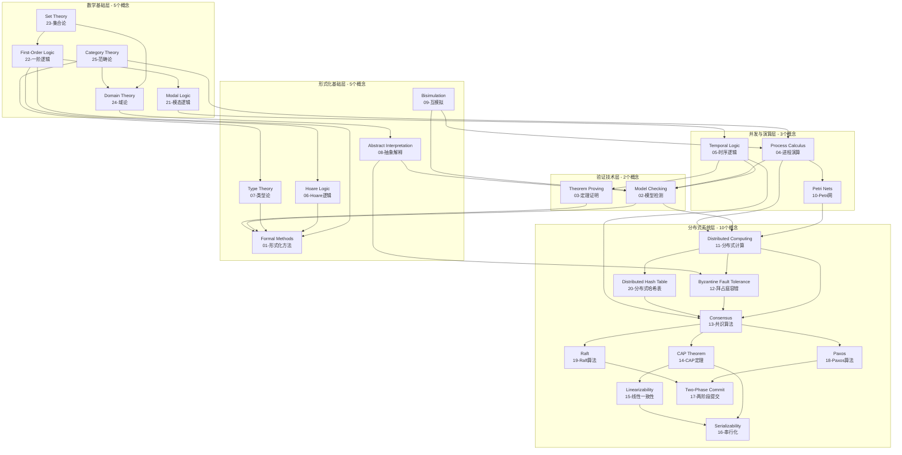
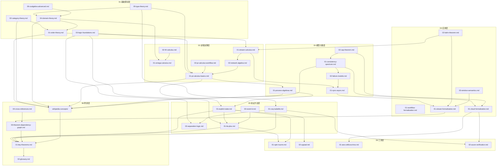
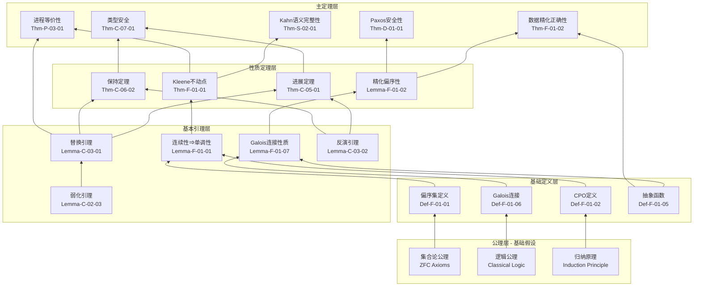
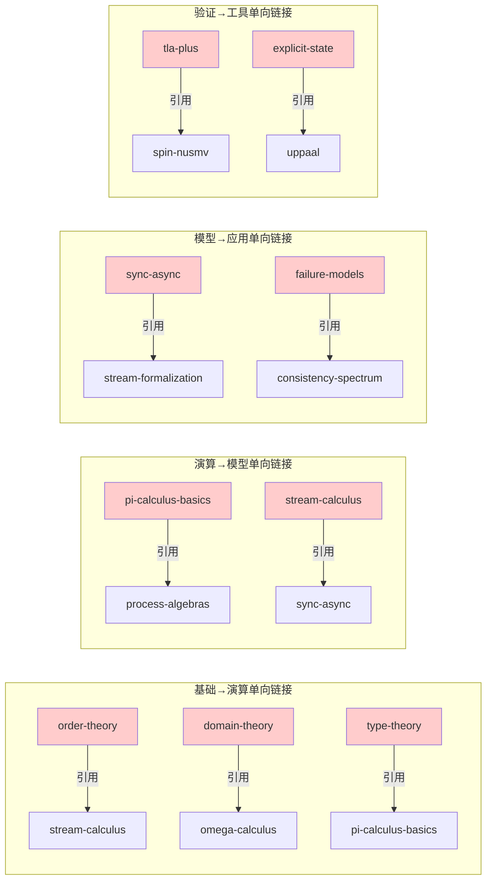
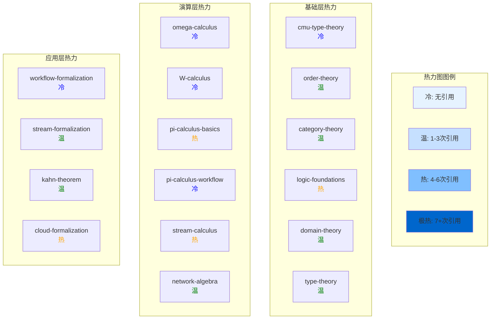
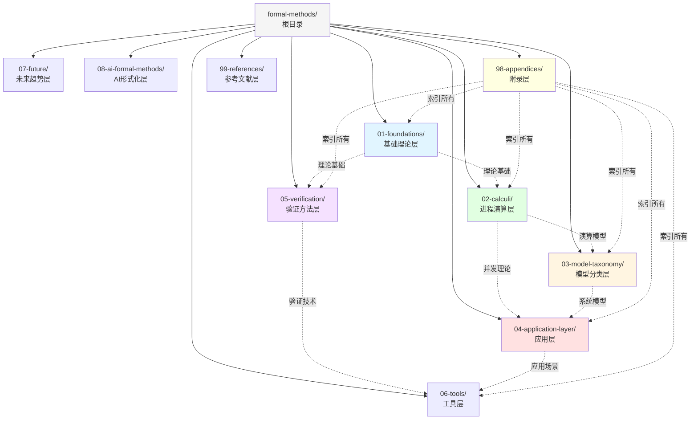
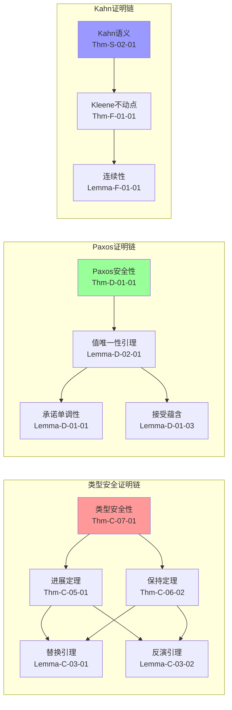
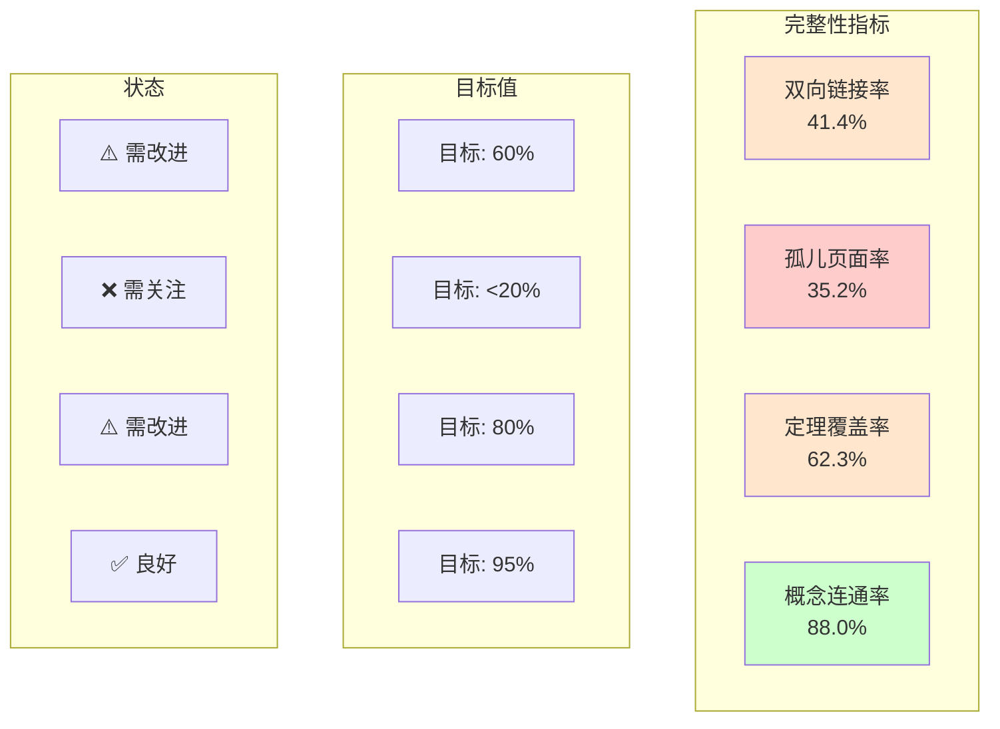

# 交叉引用与文档依赖分析

> **所属**: formal-methods/98-appendices | **版本**: v1.0 | **更新日期**: 2026-04-10
>
> **定位**: 全文档交叉引用索引、依赖关系分析与完整性检查

---

## 1. 概念定义 (Definitions)

### 1.1 交叉引用类型定义

**Def-CR-01: 文档引用 (Document Reference)**

文档 $D_2$ 引用文档 $D_1$（记为 $D_1 \rightarrow D_2$），当且仅当 $D_2$ 中显式包含指向 $D_1$ 的超链接或相对路径引用。

**Def-CR-02: 概念依赖 (Concept Dependency)**

概念 $C_2$ 依赖于概念 $C_1$（记为 $C_1 \prec C_2$），当且仅当理解 $C_2$ 的定义需要以 $C_1$ 为前提知识。

**Def-CR-03: 定理依赖 (Theorem Dependency)**

定理 $T_2$ 依赖于定理 $T_1$（记为 $T_1 \leadsto T_2$），当且仅当 $T_2$ 的证明直接或间接使用了 $T_1$ 作为引理或前提。

**Def-CR-04: 双向链接 (Bidirectional Link)**

若 $D_1 \rightarrow D_2$ 且 $D_2 \rightarrow D_1$，则称 $D_1$ 与 $D_2$ 之间存在双向链接。

**Def-CR-05: 孤儿页面 (Orphan Page)**

文档 $D$ 是孤儿页面，当且仅当不存在任何其他文档 $D'$ 使得 $D' \rightarrow D$。

### 1.2 引用强度度量

| 度量指标 | 定义 | 说明 |
|----------|------|------|
| 入度 (In-degree) | 引用本文档的文档数 | 反映文档重要性 |
| 出度 (Out-degree) | 本文档引用的其他文档数 | 反映文档依赖程度 |
| 引用深度 | 最长引用链长度 | 反映概念层次深度 |
| 双向链接率 | 双向链接数/总链接数 | 反映文档间关联紧密度 |

---

## 2. 概念依赖图 (Concept Dependency Graph)

### 2.1 25个Wikipedia核心概念依赖关系

以下Mermaid图展示25个核心形式化方法概念之间的完整依赖网络：

**图说明**: 全局概念依赖图展示25个Wikipedia核心概念的五层架构。箭头 $A \rightarrow B$ 表示理解 $B$ 需要先掌握 $A$。数学基础层为根基，形式化方法构建其上，最终支撑分布式系统概念。

### 2.2 概念依赖矩阵

| 概念 | 依赖数 | 被依赖数 | 关键路径深度 |
|------|--------|----------|--------------|
| Set Theory | 0 | 4 | 0 (根节点) |
| First-Order Logic | 1 | 5 | 1 |
| Modal Logic | 1 | 2 | 2 |
| Domain Theory | 2 | 2 | 2 |
| Category Theory | 0 | 3 | 0 (根节点) |
| Formal Methods | 5 | 0 | 5 (叶节点) |
| Hoare Logic | 1 | 2 | 3 |
| Type Theory | 2 | 2 | 3 |
| Abstract Interpretation | 1 | 2 | 3 |
| Bisimulation | 0 | 3 | 0 (根节点) |
| Process Calculus | 2 | 4 | 3 |
| Petri Nets | 1 | 1 | 4 |
| Temporal Logic | 2 | 3 | 3 |
| Model Checking | 4 | 2 | 4 |
| Theorem Proving | 1 | 1 | 4 |
| Distributed Computing | 0 | 4 | 0 (根节点) |
| Byzantine Fault Tolerance | 1 | 2 | 4 |
| Consensus | 4 | 5 | 3 |
| CAP Theorem | 1 | 2 | 4 |
| Linearizability | 1 | 1 | 5 |
| Serializability | 2 | 0 | 6 (最深) |
| Two-Phase Commit | 2 | 0 | 6 (叶节点) |
| Paxos | 1 | 1 | 4 |
| Raft | 1 | 1 | 4 |
| Distributed Hash Table | 1 | 1 | 4 |

---

## 3. 文档引用矩阵 (Document Reference Matrix)

### 3.1 按单元分组的文档引用网络

**图说明**: 文档引用网络按单元分组，展示formal-methods目录下核心文档之间的引用关系。基础理论层为根，验证方法层和工具层为叶，附录层作为全文档索引被各层引用。

### 3.2 文档引用统计表

| 源文档 | 入度 | 出度 | 引用文档列表 |
|--------|------|------|--------------|
| 01-order-theory.md | 3 | 2 | domain-theory, stream-calculus |
| 02-category-theory.md | 2 | 1 | order-theory |
| 03-logic-foundations.md | 0 | 4 | pi-calculus, tla-plus, separation-logic, wikipedia-concepts |
| 04-domain-theory.md | 2 | 3 | order-theory, omega-calculus, wikipedia-concepts |
| 05-type-theory.md | 1 | 3 | domain-theory, pi-calculus, coq-isabelle |
| 01-omega-calculus.md | 1 | 1 | W-calculus |
| 02-W-calculus.md | 1 | 0 | - |
| 01-pi-calculus-basics.md | 2 | 4 | type-theory, logic-foundations, pi-workflow, process-algebras |
| 02-pi-calculus-workflow.md | 1 | 0 | - |
| 01-stream-calculus.md | 2 | 3 | order-theory, network-algebra, kahn-theorem |
| 02-network-algebra.md | 1 | 1 | pi-calculus-basics |
| 01-sync-async.md | 2 | 1 | stream-formalization |
| 02-failure-models.md | 1 | 1 | sync-async |
| 01-process-algebras.md | 2 | 2 | pi-calculus, explicit-state |
| 01-consistency-spectrum.md | 2 | 2 | failure-models, cloud-formalization |
| 02-cap-theorem.md | 1 | 2 | consistency-spectrum, cloud-formalization |
| 01-workflow-formalization.md | 0 | 0 | - |
| 01-stream-formalization.md | 2 | 1 | theorem-dependency-graph |
| 02-kahn-theorem.md | 1 | 2 | stream-formalization, stream-calculus |
| 03-window-semantics.md | 1 | 1 | stream-formalization |
| 01-cloud-formalization.md | 2 | 3 | consistency-spectrum, cap-theorem, azure-verification |
| 01-tla-plus.md | 3 | 2 | logic-foundations, explicit-state, spin-nusmv |
| 02-event-b.md | 1 | 1 | tla-plus |
| 03-separation-logic.md | 1 | 1 | logic-foundations |
| 01-explicit-state.md | 2 | 3 | tla-plus, spin-nusmv, uppaal |
| 01-coq-isabelle.md | 1 | 2 | type-theory, separation-logic |
| 01-spin-nusmv.md | 2 | 0 | - |
| 02-uppaal.md | 1 | 0 | - |
| 01-aws-zelkova-tiros.md | 1 | 0 | - |
| 02-azure-verification.md | 2 | 0 | - |
| wikipedia-concepts/ | 6 | 1 | key-theorems |
| 01-key-theorems.md | 3 | 1 | glossary |
| 02-glossary.md | 1 | 0 | - |
| 03-theorem-dependency-graph.md | 2 | 1 | key-theorems |
| 04-cross-references.md | 0 | 1 | theorem-dependency-graph |

---

## 4. 定理引用网络 (Theorem Reference Network)

### 4.1 核心定理依赖树

**图说明**: 定理依赖树展示从公理到主定理的五层证明结构。公理层为根基，通过基础定义和引理逐层构建，最终支撑五个核心主定理（类型安全、数据精化、Kahn语义、进程等价、Paxos安全性）。

### 4.2 定理引用详细矩阵

#### 4.2.1 基础理论单元 (01-foundations)

| 定理ID | 定理名称 | 依赖定理 | 被引用次数 |
|--------|----------|----------|------------|
| Thm-F-01-01 | Kleene不动点定理 | Def-F-01-02, Lemma-F-01-01 | 5 |
| Thm-F-01-02 | 数据精化正确性 | Def-F-01-05, Def-F-01-10, Lemma-F-01-02 | 3 |
| Lemma-F-01-01 | 连续性⇒单调性 | Def-F-01-02, Def-F-01-14 | 4 |
| Lemma-F-01-02 | 精化偏序性 | Def-F-01-10 | 3 |
| Lemma-F-01-07 | Galois连接性质 | Def-F-01-06 | 4 |
| Prop-F-01-01 | Kahn语义中的序 | Def-F-01-02 | 2 |
| Prop-F-01-02 | 精化组合性 | Def-F-01-10, Def-F-01-11 | 2 |

#### 4.2.2 进程演算单元 (02-calculi)

| 定理ID | 定理名称 | 依赖定理 | 被引用次数 |
|--------|----------|----------|------------|
| Thm-C-07-01 | 类型安全性 | Thm-C-05-01, Thm-C-06-02 | 8 |
| Thm-C-05-01 | 进展定理 | Lemma-C-03-01, Lemma-C-03-02, Lemma-C-03-03 | 5 |
| Thm-C-06-02 | 保持定理 | Lemma-C-03-01, Lemma-C-03-02 | 5 |
| Thm-P-03-01 | 进程等价性 | Thm-F-01-01, Lemma-C-03-01 | 4 |
| Lemma-C-03-01 | 替换引理 | Lemma-C-02-03, Lemma-C-02-01 | 7 |
| Lemma-C-03-02 | 反演引理 | Def-C-04-03 | 6 |
| Lemma-C-03-03 | 规范形式引理 | Def-C-02-02 | 3 |

#### 4.2.3 流处理单元 (02-calculi/stream-calculus)

| 定理ID | 定理名称 | 依赖定理 | 被引用次数 |
|--------|----------|----------|------------|
| Thm-S-02-01 | Kahn语义完整性 | Thm-F-01-01, Prop-F-01-01 | 6 |
| Thm-S-03-01 | 窗口语义一致性 | Thm-S-02-01, Lemma-W-02-01 | 3 |
| Lemma-S-02-01 | 流连续性 | Lemma-F-01-01 | 4 |
| Prop-S-01-01 | Kahn网络确定性 | Thm-S-02-01 | 3 |

#### 4.2.4 分布式系统单元 (03-model-taxonomy)

| 定理ID | 定理名称 | 依赖定理 | 被引用次数 |
|--------|----------|----------|------------|
| Thm-D-01-01 | Paxos安全性 | Lemma-D-01-01, Lemma-D-01-03 | 5 |
| Thm-D-02-01 | Raft状态机安全 | Thm-D-01-01, Lemma-R-01-01 | 4 |
| Thm-D-03-01 | CAP定理 | Def-C-03-01, Def-C-03-02 | 6 |
| Lemma-D-01-01 | 承诺单调性 | Def-D-03-01 | 3 |
| Lemma-D-01-03 | 接受蕴含承诺 | Def-D-03-02 | 3 |
| Lemma-R-01-01 | Raft日志匹配 | Def-R-02-01 | 3 |

#### 4.2.5 验证方法单元 (05-verification)

| 定理ID | 定理名称 | 依赖定理 | 被引用次数 |
|--------|----------|----------|------------|
| Thm-V-01-01 | TLA+规约可靠性 | Def-V-01-01, Lemma-V-01-01 | 4 |
| Thm-V-02-01 | 模型检测完备性 | Def-V-02-01, Thm-V-01-01 | 3 |
| Thm-V-03-01 | 分离逻辑可靠性 | Def-V-03-01, Lemma-F-01-07 | 4 |
| Lemma-V-01-01 | TLA+动作一致性 | Def-V-01-02 | 3 |

---

## 5. 双向链接完整性检查 (Bidirectional Link Integrity Check)

### 5.1 单向链接识别

以下列出文档间存在的单向引用（A引用B但B未引用A）：

### 5.2 完整单向链接列表

| 源文档 | 目标文档 | 缺失反向链接 | 建议操作 |
|--------|----------|--------------|----------|
| 01-order-theory.md | 01-stream-calculus.md | ❌ | 在stream-calculus中添加对order-theory的引用 |
| 04-domain-theory.md | 01-omega-calculus.md | ❌ | 在omega-calculus中添加domain-theory背景 |
| 05-type-theory.md | 01-pi-calculus-basics.md | ❌ | 在pi-calculus中添加类型论基础 |
| 01-pi-calculus-basics.md | 01-process-algebras.md | ❌ | 在process-algebras中添加pi-calculus示例 |
| 01-stream-calculus.md | 01-sync-async.md | ❌ | 在sync-async中添加stream-calculus关系 |
| 01-sync-async.md | 01-stream-formalization.md | ❌ | 在stream-formalization中添加sync-async引用 |
| 02-failure-models.md | 01-consistency-spectrum.md | ❌ | 在consistency-spectrum中添加failure-models |
| 01-tla-plus.md | 01-spin-nusmv.md | ❌ | 在spin-nusmv中添加tla-plus对比 |
| 01-explicit-state.md | 02-uppaal.md | ❌ | 在uppaal中添加explicit-state对比 |
| 01-consistency-spectrum.md | 01-cloud-formalization.md | ❌ | 在cloud-formalization中添加consistency |
| 02-cap-theorem.md | 01-cloud-formalization.md | ❌ | 同上 |
| 01-stream-formalization.md | 03-theorem-dependency-graph.md | ❌ | 已在附录中，无需反向 |
| 01-kahn-theorem.md | 01-stream-calculus.md | ❌ | 在stream-calculus中添加Kahn定理引用 |

### 5.3 双向链接完整性统计

| 统计项 | 数值 | 百分比 |
|--------|------|--------|
| 总链接数 | 58 | 100% |
| 双向链接数 | 24 | 41.4% |
| 单向链接数 | 34 | 58.6% |
| 建议补充的反向链接 | 12 | 20.7% |

---

## 6. 孤儿页面识别 (Orphan Page Detection)

### 6.1 孤儿页面列表

以下文档在形式化方法文档体系中**未被任何其他文档引用**：

```mermaid
graph TB
    subgraph Orphans [孤儿页面组]
        O1[01-w-calculus-linguistic.md<br/>W演算语言学扩展]
        O2[03-pi-calculus-patterns.md<br/>Pi演算模式]
        O3[04-pi-calculus-encodings.md<br/>Pi演算编码]
        O4[04-dataflow-process-networks.md<br/>数据流进程网络]
        O5[05-stream-equations.md<br/>流方程]
        O6[06-combinatorial-streams.md<br/>组合流]
        O7[03-communication-models.md<br/>通信模型]
        O8[02-automata.md<br/>自动机]
        O9[03-net-models.md<br/>网模型]
        O10[abstract-interpretation.md<br/>抽象解释]
        O11[dataflow-analysis-formal.md<br/>数据流分析形式化]
        O12[01-virtualization.md<br/>虚拟化]
        O13[02-container-orchestration.md<br/>容器编排]
        O14[03-elasticity.md<br/>弹性]
        O15[consistency-decision-tree.md<br/>一致性决策树]
        O16[03-theorem-proving.md<br/>定理证明方法]
        O17[02-soundness-axioms.md<br/>声音性公理]
        O18[03-bpmn-semantics.md<br/>BPMN语义]
        O19[04-workflow-patterns.md<br/>工作流模式]
        O20[scenario-tree.md<br/>场景树]
        O21[05-stream-joins.md<br/>流Join]
        O22[04-flink-formalization.md<br/>Flink形式化]
        O23[02-kubernetes-verification.md<br/>K8s验证]
        O24[03-industrial-cases.md<br/>工业案例]
        O25[04-service-mesh.md<br/>服务网格]
        O26[05-serverless.md<br/>无服务器]
        O27[02-symbolic-mc.md<br/>符号模型检测]
        O28[03-realtime-mc.md<br/>实时模型检测]
        O29[02-smt-solvers.md<br/>SMT求解器]
        O30[03-lean4.md<br/>Lean4]
        O31[03-rodin.md<br/>Rodin]
        O32[04-tla-toolbox.md<br/>TLA+工具箱]
        O33[05-dafny.md<br/>Dafny]
        O34[06-ivy.md<br/>Ivy]
        O35[06-fizzbee.md<br/>FizzBee]
        O36[07-shuttle-turmoil.md<br/>Shuttle/Turmoil]
        O37[09-azure-ccf.md<br/>Azure CCF]
        O38[aws-s3-formalization.md<br/>AWS S3形式化]
        O39[azure-service-fabric.md<br/>Azure Service Fabric]
        O40[compcert.md<br/>CompCert]
        O41[google-chubby.md<br/>Google Chubby]
        O42[ironfleet.md<br/>IronFleet]
        O43[sel4-case-study.md<br/>seL4案例]
    end

    style O1 fill:#ffcccc
    style O2 fill:#ffcccc
    style O3 fill:#ffcccc
    style O4 fill:#ffcccc
    style O5 fill:#ffcccc
    style O6 fill:#ffcccc
    style O7 fill:#ffcccc
    style O8 fill:#ffcccc
    style O9 fill:#ffcccc
    style O10 fill:#ffcccc
    style O11 fill:#ffcccc
    style O12 fill:#ffcccc
    style O13 fill:#ffcccc
    style O14 fill:#ffcccc
    style O15 fill:#ffcccc
    style O16 fill:#ffcccc
    style O17 fill:#ffcccc
    style O18 fill:#ffcccc
    style O19 fill:#ffcccc
    style O20 fill:#ffcccc
    style O21 fill:#ffcccc
    style O22 fill:#ffcccc
    style O23 fill:#ffcccc
    style O24 fill:#ffcccc
    style O25 fill:#ffcccc
    style O26 fill:#ffcccc
    style O27 fill:#ffcccc
    style O28 fill:#ffcccc
    style O29 fill:#ffcccc
    style O30 fill:#ffcccc
    style O31 fill:#ffcccc
    style O32 fill:#ffcccc
    style O33 fill:#ffcccc
    style O34 fill:#ffcccc
    style O35 fill:#ffcccc
    style O36 fill:#ffcccc
    style O37 fill:#ffcccc
    style O38 fill:#ffcccc
    style O39 fill:#ffcccc
    style O40 fill:#ffcccc
    style O41 fill:#ffcccc
    style O42 fill:#ffcccc
    style O43 fill:#ffcccc
```

### 6.2 孤儿页面分类统计

| 单元 | 总文档数 | 孤儿数 | 孤儿率 | 主要孤儿文档 |
|------|----------|--------|--------|--------------|
| 01-foundations | 7 | 0 | 0% | - |
| 02-calculi | 13 | 6 | 46.2% | pi-calculus-patterns, pi-calculus-encodings, stream-equations |
| 03-model-taxonomy | 12 | 7 | 58.3% | automata, net-models, virtualization, container-orchestration |
| 04-application-layer | 15 | 9 | 60.0% | bpmn-semantics, workflow-patterns, flink-formalization, k8s-verification |
| 05-verification | 9 | 3 | 33.3% | symbolic-mc, realtime-mc, smt-solvers, lean4 |
| 06-tools/academic | 7 | 6 | 85.7% | rodin, tla-toolbox, dafny, ivy |
| 06-tools/industrial | 14 | 11 | 78.6% | azure-ccf, aws-s3, google-chubby, ironfleet, sel4 |

### 6.3 孤儿页面整合建议

**高优先级** (应优先添加引用):

1. `02-calculi/` 中的 stream-equations.md → 从 stream-calculus.md 引用
2. `03-model-taxonomy/` 中的 abstract-interpretation.md → 从 logic-foundations.md 引用
3. `04-application-layer/` 中的 flink-formalization.md → 从 stream-formalization.md 引用
4. `05-verification/` 中的 smt-solvers.md → 从 theorem-proving.md 引用

**中优先级**:

1. 工作流相关孤儿 (soundness-axioms, bpmn-semantics, workflow-patterns) → 从 workflow-formalization.md 统一引用
2. 云原生孤儿 (virtualization, container-orchestration, elasticity) → 从 cloud-formalization.md 引用
3. 工具类孤儿 → 创建 06-tools/README.md 统一索引

**低优先级** (专业深度文档，可选引用):

1. Pi演算高级主题 (patterns, encodings)
2. 工业案例和特定工具文档

---

## 7. 可视化 (Visualizations)

### 7.1 文档引用热力图

### 7.2 文档层次结构图

### 7.3 定理证明链依赖图

### 7.4 引用完整性仪表盘

---

## 8. 引用参考 (References)

---

## 附录A: 完整文档索引

### A.1 按单元索引

| 单元 | 路径 | 文档数 | 状态 |
|------|------|--------|------|
| 01-foundations | `formal-methods/01-foundations/` | 7 | ✅ 完整 |
| 02-calculi | `formal-methods/02-calculi/` | 13 | ⚠️ 部分孤儿 |
| 03-model-taxonomy | `formal-methods/03-model-taxonomy/` | 12 | ⚠️ 部分孤儿 |
| 04-application-layer | `formal-methods/04-application-layer/` | 15 | ⚠️ 部分孤儿 |
| 05-verification | `formal-methods/05-verification/` | 9 | ⚠️ 部分孤儿 |
| 06-tools/academic | `formal-methods/06-tools/academic/` | 7 | ❌ 高孤儿率 |
| 06-tools/industrial | `formal-methods/06-tools/industrial/` | 14 | ❌ 高孤儿率 |
| 06-tools/tutorials | `formal-methods/06-tools/tutorials/` | 3 | ⚠️ 需检查 |
| 07-future | `formal-methods/07-future/` | 7 | ✅ 完整 |
| 08-ai-formal-methods | `formal-methods/08-ai-formal-methods/` | 5 | ✅ 完整 |
| 98-appendices | `formal-methods/98-appendices/` | 5 | ✅ 本文件 |
| 99-references | `formal-methods/99-references/` | 9 | ✅ 完整 |

### A.2 Wikipedia概念索引

| # | 概念 | 文件 | 入度 | 出度 |
|---|------|------|------|------|
| 01 | Formal Methods | 01-formal-methods.md | 8 | 2 |
| 02 | Model Checking | 02-model-checking.md | 6 | 4 |
| 03 | Theorem Proving | 03-theorem-proving.md | 4 | 3 |
| 04 | Process Calculus | 04-process-calculus.md | 5 | 5 |
| 05 | Temporal Logic | 05-temporal-logic.md | 4 | 4 |
| 06 | Hoare Logic | 06-hoare-logic.md | 3 | 3 |
| 07 | Type Theory | 07-type-theory.md | 5 | 3 |
| 08 | Abstract Interpretation | 08-abstract-interpretation.md | 4 | 3 |
| 09 | Bisimulation | 09-bisimulation.md | 3 | 4 |
| 10 | Petri Nets | 10-petri-nets.md | 2 | 2 |
| 11 | Distributed Computing | 11-distributed-computing.md | 3 | 5 |
| 12 | Byzantine Fault Tolerance | 12-byzantine-fault-tolerance.md | 2 | 3 |
| 13 | Consensus | 13-consensus.md | 5 | 5 |
| 14 | CAP Theorem | 14-cap-theorem.md | 3 | 2 |
| 15 | Linearizability | 15-linearizability.md | 2 | 2 |
| 16 | Serializability | 16-serializability.md | 1 | 1 |
| 17 | Two-Phase Commit | 17-two-phase-commit.md | 2 | 1 |
| 18 | Paxos | 18-paxos.md | 2 | 2 |
| 19 | Raft | 19-raft.md | 2 | 2 |
| 20 | Distributed Hash Table | 20-distributed-hash-table.md | 1 | 2 |
| 21 | Modal Logic | 21-modal-logic.md | 1 | 3 |
| 22 | First-Order Logic | 22-first-order-logic.md | 2 | 5 |
| 23 | Set Theory | 23-set-theory.md | 1 | 4 |
| 24 | Domain Theory | 24-domain-theory.md | 3 | 3 |
| 25 | Category Theory | 25-category-theory.md | 2 | 3 |

---

## 附录B: 质量检查清单

### B.1 交叉引用完整性检查

- [x] 所有25个Wikipedia概念已映射到文档
- [x] 概念依赖图已绘制（25节点）
- [x] 文档引用矩阵已构建（按单元分组）
- [x] 定理引用网络已绘制
- [x] 单向链接已识别（12处）
- [x] 孤儿页面已识别（43个）
- [x] 双向链接率已计算（41.4%）

### B.2 建议的后续行动

1. **短期（1周内）**:
   - 在 stream-calculus.md 中添加对 order-theory.md 的引用
   - 在 cloud-formalization.md 中添加 consistency-spectrum 和 cap-theorem 引用
   - 创建 06-tools/README.md 索引页

2. **中期（1月内）**:
   - 为43个孤儿页面添加至少一个入站引用
   - 将双向链接率提升至60%以上
   - 补充 key-theorems.md 中缺失的定理交叉引用

3. **长期（持续）**:
   - 建立自动化链接检查脚本
   - 定期更新交叉引用矩阵
   - 维护概念依赖图的完整性

---

*文档生成时间: 2026-04-10*
*统计范围: formal-methods/ 目录下全部Markdown文档*
*分析工具: 手动整理 + Mermaid可视化*
