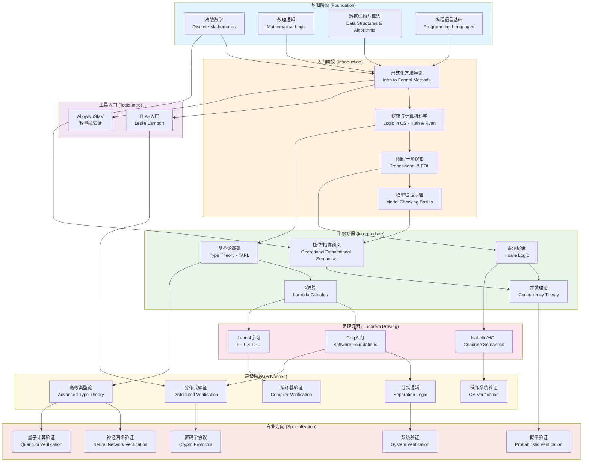
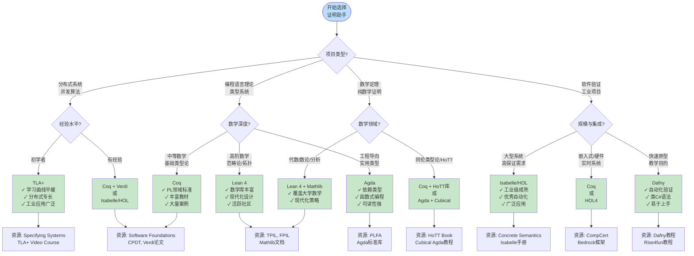

# 教育资源与自学指南

> **所属阶段**: formal-methods/98-appendices/ | **前置依赖**: [形式化方法概览](../01-overview.md), [工具使用指南](../97-guides/) | **形式化等级**: L2（参考资料）

---

## 1. 课程地图 (Course Curriculum Map)

形式化方法的学习需要系统性的知识构建。本节提供一个结构化的课程地图，涵盖从本科入门到研究生高级课程，以及丰富的在线学习资源。

### 1.1 大学本科课程

#### 1.1.1 形式化方法导论 (Introduction to Formal Methods)

| 课程要素 | 内容描述 |
|---------|---------|
| **课程目标** | 建立形式化思维，掌握基本的逻辑推理和规约方法 |
| **核心主题** | 命题逻辑与一阶逻辑、霍尔逻辑基础、状态机模型、模型检验入门 |
| **先修要求** | 离散数学、数据结构与算法、编程语言基础 |
| **推荐学时** | 48-64学时（含实验） |
| **典型教材** | Huth & Ryan《Logic in Computer Science》[^1] |
| **实践工具** | Alloy, nuXmv, SAT求解器 |

**课程大纲示例**:

- 第1-2周: 命题逻辑与可满足性问题
- 第3-4周: 一阶逻辑与自动推理
- 第5-6周: 霍尔逻辑与程序正确性
- 第7-8周: 时序逻辑与模型检验
- 第9-10周: 抽象解释基础
- 第11-12周: 类型系统入门
- 第13-14周: 案例分析（协议验证）
- 第15-16周: 课程项目展示

#### 1.1.2 离散数学 (Discrete Mathematics)

| 课程要素 | 内容描述 |
|---------|---------|
| **课程目标** | 奠定数学基础，培养抽象思维能力 |
| **核心主题** | 集合论、关系与函数、图论、组合数学、代数结构、数理逻辑 |
| **与形式化方法的关联** | 为后续类型论、进程代数、抽象解释提供数学基础 |
| **推荐学时** | 64-80学时 |
| **典型教材** | Rosen《Discrete Mathematics and Its Applications》[^2] |

### 1.2 研究生课程

#### 1.2.1 高级类型论 (Advanced Type Theory)

| 课程要素 | 内容描述 |
|---------|---------|
| **课程目标** | 深入理解类型系统的理论基础与高级特性 |
| **核心主题** | λ演算、简单类型λ演算、System F、依赖类型、线性类型、子类型、递归类型 |
| **先修要求** | 形式化方法导论、数理逻辑、函数式编程 |
| **推荐学时** | 48-64学时 |
| **典型教材** | Pierce《Types and Programming Languages》[^3] |
| **实践工具** | Coq, Agda, Lean |

**进阶主题**:

- Homotopy Type Theory (HoTT)
- Cubical Type Theory
- Modal Type Theory
- Session Types for Concurrency

#### 1.2.2 程序验证 (Program Verification)

| 课程要素 | 内容描述 |
|---------|---------|
| **课程目标** | 掌握验证实际程序正确性的理论与技术 |
| **核心主题** | 霍尔逻辑深入、最弱前置条件、分离逻辑、验证条件生成、符号执行 |
| **先修要求** | 高级类型论、编译原理 |
| **推荐学时** | 48-64学时 |
| **典型教材** | Winskel《The Formal Semantics of Programming Languages》[^4] |
| **实践工具** | Dafny, Viper, Boogie, Why3 |

#### 1.2.3 分布式系统验证 (Distributed Systems Verification)

| 课程要素 | 内容描述 |
|---------|---------|
| **课程目标** | 学习验证分布式系统的核心技术与方法 |
| **核心主题** | 进程代数、TLA+规约、共识算法验证、复制数据类型、拜占庭容错 |
| **先修要求** | 分布式系统、程序验证 |
| **推荐学时** | 48-64学时 |
| **典型教材** | Lynch《Distributed Algorithms》[^5], Lamport《Specifying Systems》[^6] |
| **实践工具** | TLA+, Coq (Verdi), Isabelle/HOL |

**关键验证案例**:

- Paxos/Raft共识算法
- 分布式键值存储
- 复制状态机
- 区块链共识协议

### 1.3 在线课程资源

#### 1.3.1 Coursera平台

| 课程名称 | 提供机构 | 讲师 | 难度 | 时长 | 特色 |
|---------|---------|------|------|------|------|
| **Software Testing** | University of Maryland | Michael Hicks | 中级 | 4周 | 覆盖测试理论与形式化验证基础 |
| **Computer Science: Programming with a Purpose** | Princeton | Robert Sedgewick | 入门 | 10周 | 为形式化思维打基础 |
| **Algorithms, Part I & II** | Princeton | Robert Sedgewick | 中级 | 12周 | 算法正确性证明 |

#### 1.3.2 edX平台

| 课程名称 | 提供机构 | 讲师 | 难度 | 特色 |
|---------|---------|------|------|------|
| **Formal Methods in Software Engineering** | MIT | Daniel Jackson | 中级 | Alloy工具实战 |
| **Software Construction** | MIT | MIT Faculty | 中级 | Dafny验证实践 |
| **Category Theory** | MIT | Brendan Fong | 高级 | 范畴论基础 |

#### 1.3.3 YouTube讲座与系列

| 系列名称 | 讲师/机构 | 内容概述 | 语言 |
|---------|----------|---------|------|
| **The TLA+ Video Course** | Leslie Lamport | TLA+从入门到精通 | 英语 |
| **Lean 4 Tutorials** | Leonardo de Moura (MSR) | Lean 4官方教程 | 英语 |
| **Coq Proof Assistant** | Yves Bertot | Coq核心概念讲解 | 英语/法语 |
| **Category Theory for Programmers** | Bartosz Milewski | 范畴论在编程中的应用 | 英语 |
| **OPLSS (Oregon Programming Languages Summer School)** | 多位专家 | PL领域暑期学校录播 | 英语 |
| **DeepSpec Summer School** | Princeton/UPenn | 深度规约实践课程 | 英语 |

#### 1.3.4 开放式课程ware (OCW)

| 课程 | 机构 | 资源链接 |
|------|------|---------|
| 6.042J Mathematics for Computer Science | MIT | MIT OpenCourseWare |
| 6.006 Introduction to Algorithms | MIT | MIT OpenCourseWare |
| 6.852J Distributed Algorithms | MIT | MIT OpenCourseWare |
| 15-317 Constructive Logic | CMU | CMU Course Site |
| CS 242 Advanced Topics in Programming Languages | Stanford | Stanford Engineering |

---

## 2. 教材推荐 (Textbook Recommendations)

形式化方法领域拥有丰富的经典教材。本节按难度分级推荐，帮助学习者选择适合的学习路径。

### 2.1 入门级教材

#### 2.1.1 《Logic in Computer Science》 - Michael Huth & Mark Ryan

| 属性 | 内容 |
|------|------|
| **难度等级** | ★★☆☆☆ (入门) |
| **页数** | ~450页 |
| **适用对象** | 本科生、自学者 |
| **核心内容** | 命题逻辑、一阶逻辑、模态逻辑、模型检验基础 |
| **特色** | 大量实例、配套练习、强调应用 |
| **推荐理由** | 最经典的入门教材，理论与实践结合完美 |

**学习建议**: 配合NuSMV工具完成课后验证练习。

#### 2.1.2 《Types and Programming Languages》 - Benjamin C. Pierce

| 属性 | 内容 |
|------|------|
| **难度等级** | ★★★☆☆ (入门-中级) |
| **页数** | ~650页 |
| **适用对象** | 有一定编程基础的学习者 |
| **核心内容** | 类型系统基础、λ演算、子类型、递归类型、多态 |
| **特色** | 系统全面、循序渐进、代码示例丰富 |
| **推荐理由** | 类型理论的标准教材，被全球顶尖高校广泛采用 |

**配套资源**: TAPL官网提供完整代码示例和勘误表。

#### 2.1.3 《Concrete Semantics》 - Tobias Nipkow & Gerwin Klein

| 属性 | 内容 |
|------|------|
| **难度等级** | ★★★☆☆ |
| **页数** | ~300页 |
| **适用对象** | 希望动手实践的验证初学者 |
| **核心内容** | 操作语义、霍尔逻辑、编译器验证、Isabelle/HOL入门 |
| **特色** | 理论+Isabelle实践结合、可下载完整Isabelle代码 |
| **推荐理由** | 免费获取，边学边练 |

**获取方式**: 作者主页和Springer均可免费下载PDF。

### 2.2 中级教材

#### 2.2.1 《The Formal Semantics of Programming Languages》 - Glynn Winskel

| 属性 | 内容 |
|------|------|
| **难度等级** | ★★★★☆ (中级) |
| **页数** | ~380页 |
| **适用对象** | 研究生、有一定基础的研究者 |
| **核心内容** | 操作语义、指称语义、公理语义、域理论、完全抽象 |
| **特色** | 数学严谨、理论深度适中、历史视角 |
| **推荐理由** | 理解编程语言语学的经典之作 |

**前置知识**: 离散数学、基本数理逻辑。

#### 2.2.2 《Semantics with Applications》 - Hanne Riis Nielson & Flemming Nielson

| 属性 | 内容 |
|------|------|
| **难度等级** | ★★★★☆ |
| **页数** | ~280页 |
| **适用对象** | 研究生 |
| **核心内容** | 操作语义、指称语义、静态分析、程序转换 |
| **特色** | 简洁精炼、强调应用、程序分析视角 |
| **推荐理由** | 抽象解释的绝佳入门 |

#### 2.2.3 《Introduction to Lattices and Order》 - B. A. Davey & H. A. Priestley

| 属性 | 内容 |
|------|------|
| **难度等级** | ★★★★☆ |
| **页数** | ~300页 |
| **适用对象** | 研究抽象解释和静态分析的学习者 |
| **核心内容** | 格论基础、不动点定理、Galois连接、模态逻辑代数 |
| **特色** | 数学优美、习题丰富 |
| **推荐理由** | 抽象解释理论的数学基础 |

#### 2.2.4 《Principles of Model Checking》 - Christel Baier & Joost-Pieter Katoen

| 属性 | 内容 |
|------|------|
| **难度等级** | ★★★★☆ |
| **页数** | ~800页 |
| **适用对象** | 模型检验方向研究生 |
| **核心内容** | 时序逻辑、模型检验算法、符号模型检验、概率模型检验 |
| **特色** | 模型检验领域最全面的参考书 |
| **推荐理由** | 从事模型检验研究的必读经典 |

### 2.3 高级教材与专著

#### 2.3.1 《Distributed Algorithms》 - Nancy A. Lynch

| 属性 | 内容 |
|------|------|
| **难度等级** | ★★★★★ (高级) |
| **页数** | ~900页 |
| **适用对象** | 分布式系统验证研究者 |
| **核心内容** | I/O自动机、同步网络算法、异步共享内存、异步网络、容错、共识 |
| **特色** | 数学严谨、覆盖全面、证明详细 |
| **推荐理由** | 分布式算法理论分析的圣经级著作 |

#### 2.3.2 《Communication and Concurrency》 - Robin Milner

| 属性 | 内容 |
|------|------|
| **难度等级** | ★★★★★ |
| **页数** | ~280页 |
| **适用对象** | 并发理论研究 |
| **核心内容** | CCS进程代数、双模拟、模态逻辑、验证方法 |
| **特色** | 进程代数创始人亲笔、思想深邃 |
| **推荐理由** | 理解并发计算本质的必读书 |

#### 2.3.3 《The π-Calculus: A Theory of Mobile Processes》 - Davide Sangiorgi & David Walker

| 属性 | 内容 |
|------|------|
| **难度等级** | ★★★★★ |
| **页数** | ~600页 |
| **适用对象** | 移动计算与高级并发研究 |
| **核心内容** | π演算理论、类型系统、编码、高级变体 |
| **特色** | π演算最权威的参考 |
| **推荐理由** | 研究移动进程理论的必读 |

#### 2.3.4 《Specifying Systems》 - Leslie Lamport

| 属性 | 内容 |
|------|------|
| **难度等级** | ★★★★☆ |
| **页数** | ~400页 |
| **适用对象** | 分布式系统工程师与研究者 |
| **核心内容** | TLA+语言、时序逻辑、规范书写、TLC模型检验、证明系统 |
| **特色** | 免费获取、实践导向、案例丰富 |
| **推荐理由** | 学习TLA+的唯一权威指南 |

**获取方式**: 作者官网和Microsoft Research均可免费下载。

#### 2.3.5 《Interactive Theorem Proving and Program Development》 - Yves Bertot & Pierre Castéran

| 属性 | 内容 |
|------|------|
| **难度等级** | ★★★★☆ |
| **页数** | ~500页 |
| **适用对象** | Coq用户 |
| **核心内容** | Coq基础、归纳定义、证明自动化、程序提取 |
| **特色** | Coq官方教材、例子丰富 |
| **推荐理由** | Coq学习的标准教材 |

#### 2.3.6 《Software Foundations》系列 - Benjamin Pierce 等

| 属性 | 内容 |
|------|------|
| **难度等级** | ★★★☆☆ - ★★★★★ |
| **卷数** | 6卷 (Volume 1-4 + QC + VFA) |
| **适用对象** | Coq学习全阶段 |
| **核心内容** | 逻辑基础、编程语言基础、函数式算法验证、分离逻辑、量子计算、验证函数式算法 |
| **特色** | 完全免费、交互式学习、大量练习 |
| **推荐理由** | 最全面的Coq在线教材 |

**获取方式**: softwarefoundations.cis.upenn.edu

---

## 3. 工具入门指南 (Tool Getting Started Guides)

### 3.1 TLA+ 入门路径

TLA+是Leslie Lamport开发的形式化规约语言，专门用于设计和验证并发与分布式系统。

#### 3.1.1 安装与环境配置

**Windows/Linux/macOS**:

1. 下载TLA+ Toolbox: github.com/tlaplus/tlaplus/releases
2. 安装Java 11或更高版本
3. 启动Toolbox并创建工作区

**命令行工具**:

```bash
# 使用Homebrew (macOS)
brew install tlaplus

# 使用apt (Ubuntu)
sudo apt-get install tla-tools
```

#### 3.1.2 学习路径 (建议4-6周)

| 周次 | 学习内容 | 实践任务 |
|------|---------|---------|
| **第1周** | 阅读《Specifying Systems》第1-3章 | 安装环境，运行Euclid算法示例 |
| **第2周** | 学习PlusCal算法语言 | 编写第一个PlusCal规约（简单互斥） |
| **第3周** | 理解TLA逻辑和时序算子 | 编写时序属性，学习TLC模型检验 |
| **第4周** | 学习状态空间探索与反例分析 | 分析死锁案例，调试规约错误 |
| **第5周** | 高级主题：精化、公平性、活性 | 编写多层级精化规约 |
| **第6周** | TLA+ Proof System (TLAPS) 入门 | 尝试简单定理证明 |

#### 3.1.3 推荐练习项目

1. **Two-Phase Commit**: 理解分布式事务基础
2. **Raft算法**: 分析共识算法的TLA+规约
3. **Paxos**: 学习Leslie Lamport的经典案例
4. **缓存一致性协议**: 分析多级缓存验证

#### 3.1.4 学习资源

- **视频**: Leslie Lamport的TLA+视频课程
- **案例**: github.com/tlaplus/Examples
- **社区**: TLA+ Google Group, Reddit r/tlaplus

### 3.2 Lean 4 入门路径

Lean是由Microsoft Research开发的定理证明器和编程语言，最新版本Lean 4在性能和可用性上有显著提升。

#### 3.2.1 安装与环境配置

```bash
# 使用elan (Lean版本管理器)
curl https://raw.githubusercontent.com/leanprover/elan/master/elan-init.sh -sSf | sh

# 创建新项目
elan default leanprover/lean4:stable
lake new my_project
```

**编辑器支持**:

- VS Code + Lean 4扩展 (推荐)
- Emacs + lean-mode
- Neovim + lean.nvim

#### 3.2.2 学习路径 (建议8-12周)

| 阶段 | 内容 | 资源 |
|------|------|------|
| **阶段1: 基础** (2周) | 函数式编程、依赖类型基础 | "Functional Programming in Lean" |
| **阶段2: 证明** (3周) | 战术证明、归纳、结构证明 | "Theorem Proving in Lean 4" |
| **阶段3: 抽象** (3周) | 类型类、单子、泛型编程 | Mathlib文档、FPIL续 |
| **阶段4: 应用** (4周) | 数学证明、程序验证 | Mathlib源码、论文复现 |

#### 3.2.3 核心学习资源

| 资源名称 | 类型 | 难度 | 链接 |
|---------|------|------|------|
| Theorem Proving in Lean 4 | 官方教程 | 入门 | leanprover.github.io |
| Functional Programming in Lean | 官方教程 | 入门 | leanprover.github.io |
| Mathematics in Lean | 教程 | 中级 |leanprover-community.github.io |
| Lean 4 Manual | 参考文档 | 全阶段 | lean-lang.org |

#### 3.2.4 实践项目建议

1. **数据结构验证**: 验证红黑树、AVL树不变量
2. **排序算法**: 证明快速排序、归并排序的正确性
3. **数理逻辑**: 形式化哥德尔不完备定理（高级）
4. **编译器**: 参与Lean编译器开发或验证简单编译器

### 3.3 Coq 入门路径

Coq是最成熟的定理证明器之一，拥有庞大的生态系统和丰富的教学资源。

#### 3.3.1 安装配置

```bash
# 使用opam (OCaml包管理器)
opam install coq

# 或使用系统包管理器
# Ubuntu/Debian
sudo apt-get install coq

# macOS
brew install coq
```

#### 3.3.2 学习路径 (建议10-14周)

| 周次范围 | 主题 | 练习资源 |
|---------|------|---------|
| 1-3 | Gallina语言、基本证明战术 | Software Foundations Vol.1 |
| 4-6 | 归纳类型、递归函数证明 | Software Foundations Vol.1 |
| 7-9 | 列表、多态、高阶函数 | Software Foundations Vol.1 |
| 10-12 | 逻辑、关系、操作语义 | Software Foundations Vol.2 |
| 13-14 | 类型系统、Stlc证明 | Software Foundations Vol.2 |

#### 3.3.3 核心战术速查

| 战术 | 用途 | 示例 |
|------|------|------|
| `intros` | 引入假设 | `intros x y H` |
| `apply` | 应用定理/假设 | `apply H` |
| `rewrite` | 重写等式 | `rewrite -> H` |
| `induction` | 归纳证明 | `induction n` |
| `destruct` | 分解结构 | `destruct H` |
| `reflexivity` | 证明等式自反 | `reflexivity` |
| `simpl` | 简化表达式 | `simpl` |
| `auto` | 自动搜索证明 | `auto with arith` |

#### 3.3.4 进阶主题

- **SSReflect**: MathComp的战术语言，结构化证明
- **Ltac**: 自定义战术语言
- **Program/Equations**: 依赖类型编程
- **Extract**: 程序提取到OCaml/Haskell/Scheme

### 3.4 Isabelle/HOL 入门路径

Isabelle/HOL是一个通用的交互式定理证明器，特别适合验证硬件和软件系统。

#### 3.4.1 安装配置

```bash
# 下载Isabelle发行版
# https://isabelle.in.tum.de/download.html

# 启动Isabelle/jEdit (包含在发行版中)
./Isabelle2024/bin/isabelle jedit
```

#### 3.4.2 学习路径 (建议6-10周)

| 周次 | 内容 |
|------|------|
| 1-2 | Isabelle/Isar证明语言、基础逻辑 |
| 3-4 | 类型定义、递归函数、归纳证明 |
| 5-6 | 结构化证明、证明自动化 (auto, simp, blast) |
| 7-8 | 记录类型、类型类、高阶逻辑 |
| 9-10 | 高级自动化、Sledgehammer、Nitpick |

#### 3.4.3 学习资源

| 资源 | 说明 |
|------|------|
| "Concrete Semantics" | 理论与实践结合的入门教材 |
| "Isabelle/HOL - A Proof Assistant for Higher-Order Logic" | 官方教程 |
| Archive of Formal Proofs (AFP) | 形式化证明库 |
| isabelle-dev mailing list | 开发者社区 |

#### 3.4.4 特色工具

- **Sledgehammer**: 自动调用外部ATP求解器
- **Nitpick**: 反例搜索工具
- **Quickcheck**: 基于随机测试的验证辅助
- **Code Generator**: 生成可执行代码

---

## 4. 实践项目 (Hands-on Projects)

### 4.1 初学者项目

#### 4.1.1 互斥锁验证 (Mutual Exclusion Verification)

**项目目标**: 验证Dekker算法或Peterson算法满足互斥性质

**难度**: ★★☆☆☆

**所需工具**: TLA+, Spin, 或 Promela

**步骤**:

1. 用形式化语言描述算法
2. 定义互斥、无死锁、无饥饿等安全性和活性属性
3. 使用模型检验器验证属性
4. 分析验证结果和反例

**预期产出**:

- 完整的算法规约
- 形式化属性定义
- 验证报告（包括发现的潜在问题）

#### 4.1.2 简单通信协议验证

**项目目标**: 验证交替位协议 (Alternating Bit Protocol) 的正确性

**难度**: ★★☆☆☆

**所需工具**: SPIN, TLA+, 或 UPPAAL

**验证要点**:

- 消息不会丢失
- 消息按序到达
- 协议无死锁

#### 4.1.3 有界缓冲区验证

**项目目标**: 验证生产者-消费者问题的有界缓冲区实现

**难度**: ★★☆☆☆

**所需工具**: Dafny, Verifast, 或分离逻辑框架

### 4.2 中级项目

#### 4.2.1 共识算法验证

**项目目标**: 完整验证Raft或Viewstamped Replication共识算法

**难度**: ★★★★☆

**所需工具**: TLA+, Coq (Verdi框架), 或 Isabelle/HOL

**验证内容**:

- 安全性: 已提交日志条目的一致性
- 活性: 领导者 eventually 被选举
- 持久性: 崩溃恢复后的状态一致性

**参考资源**:

- Raft TLA+规约: github.com/ongardie/raft-tlaplus
- Verdi框架: github.com/uwplse/verdi

#### 4.2.2 分布式锁实现验证

**项目目标**: 验证基于Redis或ZooKeeper的分布式锁算法

**难度**: ★★★☆☆

**关键属性**:

- 互斥性
- 无死锁
- 容错性

#### 4.2.3 类型安全编译器片段

**项目目标**: 实现并验证一个简单函数式语言的类型保持编译器

**难度**: ★★★★☆

**所需工具**: Coq (Software Foundations Vol.2)

**任务分解**:

1. 定义源语言语法和类型系统
2. 定义目标语言（简单指令集或λ演算）
3. 实现编译函数
4. 证明类型保持性 (Type Preservation)

### 4.3 高级项目

#### 4.3.1 操作系统内核验证

**项目目标**: 验证操作系统内核的关键组件（如seL4微内核验证子集）

**难度**: ★★★★★

**所需工具**: Isabelle/HOL, Coq

**参考项目**:

- seL4形式化验证 (NICTA/UNSW)
- CertiKOS (Yale)
- Ironclad Apps (Microsoft Research)

**里程碑**:

1. 形式化内核API规约
2. 验证上下文切换正确性
3. 验证IPC机制
4. 验证内存管理（虚拟内存）

#### 4.3.2 编译器完整验证

**项目目标**: 实现CompCert式的高度可信编译器

**难度**: ★★★★★

**参考**: CompCert项目 (INRIA)

**技术要点**:

- 多趟编译的语义保持
- 每个优化趟的验证
- 汇编代码生成验证

#### 4.3.3 区块链共识协议验证

**项目目标**: 验证PBFT、HotStuff或Tendermint等BFT共识协议

**难度**: ★★★★★

**所需工具**: Coq, TLA+, Ivy

**验证挑战**:

- 拜占庭容错假设下的安全性
- 网络分区与恢复
- 活性与公平性

**参考**:

- Tendermint验证项目
- DiemBFT (Facebook/Meta) 形式化规约

#### 4.3.4 密码学协议验证

**项目目标**: 用计算模型或符号模型验证TLS、Signal协议

**难度**: ★★★★★

**工具**: CryptoVerif, ProVerif, Tamarin

---

## 5. 研究前沿追踪 (Research Frontier Tracking)

### 5.1 顶级学术会议

#### 5.1.1 核心理论会议 (CORE A*)

| 会议 | 全称 | 主题侧重 | 时间 | 接受率 |
|------|------|---------|------|--------|
| **CAV** | Computer Aided Verification | 自动验证、模型检验 | 夏季 | ~25% |
| **POPL** | Principles of Programming Languages | 编程语言理论、类型系统 | 1月 | ~22% |
| **PLDI** | Programming Language Design and Implementation | 语言设计与实现 | 夏季 | ~18% |
| **LICS** | Logic in Computer Science | 计算逻辑 | 夏季 | ~28% |
| **CONCUR** | Concurrency Theory | 并发理论 | 秋季 | ~30% |
| **TACAS** | Tools and Algorithms for Construction and Analysis of Systems | 工具与算法 | 春季 | ~28% |
| **FM** | Formal Methods | 形式化方法综合 | 春季 | ~25% |
| **OOPSLA** | Object-Oriented Programming, Systems, Languages and Applications | OO理论与验证 | 秋季 | ~25% |
| **ICFP** | International Conference on Functional Programming | 函数式编程 | 秋季 | ~28% |
| **SOSP/OSDI** | Symp. on Operating Systems Principles / Operating Systems Design and Implementation | 系统验证 | 交替年份 | ~15% |

#### 5.1.2 安全与系统验证会议

| 会议 | 全称 | 主题侧重 |
|------|------|---------|
| **CCS** | ACM Conference on Computer and Communications Security | 安全协议验证 |
| **IEEE S&P** | IEEE Symposium on Security and Privacy | 系统安全验证 |
| **USENIX Security** | USENIX Security Symposium | 实际系统安全 |
| **NDSS** | Network and Distributed System Security | 分布式安全 |
| **EuroS&P** | IEEE European Symposium on Security and Privacy | 欧洲安全研究 |

#### 5.1.3 软件工程验证会议

| 会议 | 全称 | 主题侧重 |
|------|------|---------|
| **FSE/ESEC** | Foundations of Software Engineering | 软件验证方法 |
| **ICSE** | International Conference on Software Engineering | 软件工程综合 |
| **ASE** | Automated Software Engineering | 自动化验证 |
| **ISSTA** | International Symposium on Software Testing and Analysis | 测试与分析 |

### 5.2 重要学术期刊

| 期刊 | 全称 | 影响因子 | 主题范围 |
|------|------|---------|---------|
| **Formal Methods in System Design** | FM in System Design | ~1.5 | 形式化方法综合 |
| **Science of Computer Programming** | SCP | ~1.2 | 程序理论、验证 |
| **Journal of Automated Reasoning** | JAR | ~1.5 | 自动推理 |
| **ACM TOPLAS** | Transactions on Programming Languages and Systems | ~1.8 | 语言理论 |
| **Logical Methods in Computer Science** | LMCS | OA | 计算逻辑 |
| **Information and Computation** | I&C | ~1.0 | 理论计算机科学 |
| **Distributed Computing** | DC | ~1.5 | 分布式算法 |
| **Acta Informatica** | AI | ~0.8 | 理论计算机科学 |
| **Journal of Functional Programming** | JFP | ~1.2 | 函数式编程 |

### 5.3 活跃研究组

#### 5.3.1 美国

| 机构 | 研究组/实验室 | 研究方向 | 代表人物 |
|------|--------------|---------|---------|
| **MIT** | CSAIL - PL/SE Group | 程序验证、分布式系统 | M. Kaashoek, N. Zeldovich |
| **MIT** | PDOS (Parallel and Distributed OS) | 操作系统验证 | N. Zeldovich |
| **CMU** | Computer Science Dept. | 形式化验证、类型理论 | B. Parno, J. Aldrich |
| **CMU** | Programming Languages Group | 并发验证 | F. Pfenning |
| **Stanford** | CS Department | 形式化方法 | D. Dill, C. Barrett |
| **Princeton** | PL Group | 深度规约 | A. Appel, D. Walker |
| **UC Berkeley** | Sky Group | 形式化数据库验证 | I. Stoica, J. Li |
| **Yale** | FLINT Group | 编译器验证 | Z. Shao |
| **UT Austin** | PLS Group | 并发、类型系统 | I. Dillig |

#### 5.3.2 欧洲

| 机构 | 研究组 | 研究方向 | 代表人物 |
|------|--------|---------|---------|
| **INRIA** | Gallium (Paris) | 证明助手、类型理论 | X. Leroy, H. Herbelin |
| **INRIA** | Marelle (Sophia) | 数学证明 | Y. Bertot |
| **INRIA** | Toccata | 程序证明 | J.-C. Filliâtre |
| **Cambridge** | Computer Lab | 系统验证 | P. Sewell, T. Ridge |
| **Oxford** | CS Department | 自动机、模型检验 | M. Benedikt |
| **TU Munich** | Chair of Logic | Isabelle/HOL开发 | T. Nipkow |
| **TU Munich** | Cyber-Physical Systems | 混合系统验证 | J.-P. Katoen |
| **ETH Zurich** | SRL | 系统可靠性 | P. Müller |

#### 5.3.3 产业研究实验室

| 实验室 | 所属公司 | 研究重点 |
|--------|---------|---------|
| **Microsoft Research** | Microsoft | TLA+, 分布式验证, Lean |
| **AWS Automated Reasoning** | Amazon | SMT求解, 云服务验证 |
| **Facebook/Meta** | Meta | 静态分析, 并发验证 |
| **Google** | Google | 分布式系统, 测试生成 |
| **IBM Research** | IBM | 形式化方法工具 |

### 5.4 前沿研究方向

#### 5.4.1 自动推理与SMT

- **Z3** (Microsoft): 最先进的SMT求解器
- **CVC5**: 开源SMT求解器
- **SMT-LIB**: 标准输入语言和基准库

#### 5.4.2 神经网络验证

- 深度神经网络的鲁棒性验证
- 符号执行与神经网络结合
- 形式化保证的机器学习系统

#### 5.4.3 量子计算验证

- 量子程序验证 (QWire, Qiskit验证)
- 量子协议形式化分析

#### 5.4.4 概率与随机化验证

- PRISM: 概率模型检验器
- 随机化算法的形式化分析
- 差分隐私验证

---

## 6. 社区资源 (Community Resources)

### 6.1 邮件列表与论坛

#### 6.1.1 TLA+ 社区

| 资源 | 链接/方式 | 说明 |
|------|----------|------|
| **Google Group** | groups.google.com/g/tlaplus | 主要讨论区 |
| **Reddit** | reddit.com/r/tlaplus | 问答与分享 |
| **GitHub Discussions** | github.com/tlaplus/tlaplus | 技术讨论 |

#### 6.1.2 Coq 社区

| 资源 | 链接/方式 | 说明 |
|------|----------|------|
| **Coq-Club** | sympa.inria.fr/sympa/arc/coq-club | 主要邮件列表 |
| **Coq Zulip** | coq.zulipchat.com | 实时聊天 |
| **Stack Overflow** | stackoverflow.com/questions/tagged/coq | 问答 |
| **Proof Assistants SE** | proofassistants.stackexchange.com | StackExchange站点 |

#### 6.1.3 Lean 社区

| 资源 | 链接/方式 | 说明 |
|------|----------|------|
| **Zulip Chat** |leanprover.zulipchat.com | 主要社区平台 |
| **Lean 4 Discussions** | github.com/leanprover/lean4/discussions | GitHub讨论 |
| **Mathlib Zulip** | 同上 | 数学库讨论 |

#### 6.1.4 Isabelle 社区

| 资源 | 链接/方式 | 说明 |
|------|----------|------|
| **isabelle-users** | lists.cam.ac.uk/mailman/listinfo/cl-isabelle-users | 用户邮件列表 |
| **isabelle-dev** | lists.cam.ac.uk/mailman/listinfo/cl-isabelle-dev | 开发者列表 |
| **AFP Mailing List** | afp-devel | Archive of Formal Proofs |

### 6.2 即时通讯平台

#### 6.2.1 Discord 服务器

| 服务器 | 邀请链接 | 主题 |
|--------|---------|------|
| **Type Theory** | 公开邀请 | 类型论、证明助手 |
| **Program Verification** | 公开邀请 | 程序验证综合 |
| **Category Theory** | 公开邀请 | 范畴论与应用 |
| **Rust Verification** | 公开邀请 | Rust形式化验证 |

#### 6.2.2 Slack 工作区

| 工作区 | 说明 |
|--------|------|
| **DeepSpec** | 深度规约项目 |
| **TLA+** | TLA+用户交流 |
| **各种PL会议** | 临时性会议频道 |

### 6.3 GitHub 重要仓库

#### 6.3.1 证明助手核心

| 仓库 | 组织/作者 | 描述 |
|------|----------|------|
| **lean4** | leanprover | Lean 4核心 |
| **coq** | coq | Coq证明助手 |
| **isabelle** | isabelle-prover | Isabelle/HOL |

#### 6.3.2 验证工具

| 仓库 | 描述 |
|------|------|
| **tlaplus/tlaplus** | TLA+工具集 |
| **Z3Prover/z3** | Microsoft Z3 SMT求解器 |
| **cvc5/cvc5** | CVC5 SMT求解器 |
| **prismmodelchecker/prism** | PRISM概率模型检验器 |
| **nusmv/nusmv** | NuSMV符号模型检验器 |

#### 6.3.3 形式化数学库

| 仓库 | 描述 |
|------|------|
| **leanprover-community/mathlib4** | Lean 4数学库 |
| **math-comp/math-comp** | Coq数学组件库 |
| **agda/agda-stdlib** | Agda标准库 |
| **isabelle-prover/afp** | Archive of Formal Proofs |

#### 6.3.4 验证案例研究

| 仓库 | 描述 |
|------|------|
| **tlaplus/Examples** | TLA+案例集合 |
| **ongardie/raft-tlaplus** | Raft算法TLA+规约 |
| **uwplse/verdi** | Verdi分布式系统验证框架 |
| **seL4/l4v** | seL4内核验证 |

### 6.4 Stack Overflow 标签

| 标签 | 说明 | 问题数量 |
|------|------|---------|
| **formal-verification** | 形式化验证综合 | ~3,000 |
| **tlaplus** | TLA+语言 | ~500 |
| **coq** | Coq证明助手 | ~4,000 |
| **lean** | Lean定理证明器 | ~800 |
| **isabelle** | Isabelle/HOL | ~1,500 |
| **agda** | Agda证明助手 | ~600 |
| **model-checking** | 模型检验 | ~1,000 |
| **smt** | SMT求解器 | ~1,200 |
| **z3** | Z3求解器 | ~3,500 |

### 6.5 博客与个人资源

| 博客 | 作者 | 内容特色 |
|------|------|---------|
| **The TLA+ Home Page** | Leslie Lamport | TLA+官方资源 |
| **Matters Computational** | Various | 计算理论 |
| **Gödel's Lost Letter** | Lipton & Regan | 理论计算机科学 |
| **Shtetl-Optimized** | Scott Aaronson | 量子计算与理论 |
| **The Universe of Discourse** | Mark Dominus | 编程语言与逻辑 |

### 6.6 在线课程平台

| 平台 | 相关课程 |
|------|---------|
| **Coursera** | Software Testing, Algorithms |
| **edX** | Formal Methods (MIT), Software Construction |
| **Udacity** | Software Testing (有限) |
| **YouTube** | TLA+课程, OPLSS, DeepSpec |

---

## 7. 可视化 (Visualizations)

### 7.1 形式化方法学习路径图

以下图表展示了从入门到精通形式化方法的推荐学习路径，包括课程依赖关系和能力发展轨迹。



**图说明**: 此学习路径图展示了形式化方法领域从基础到专业的完整学习路线图。箭头表示推荐的学习顺序和依赖关系。不同颜色区域代表不同学习阶段：蓝色为基础、橙色为入门、紫色为工具、绿色为中级、粉色为证明助手、黄色为高级、红色为专业方向。

### 7.2 证明助手选择流程图

根据具体需求选择合适的定理证明器是形式化项目成功的关键。以下决策树帮助用户根据项目特点选择最适合的工具。



**图说明**: 此决策树根据项目类型、经验水平和数学深度帮助选择合适的定理证明器。每个叶节点包含推荐工具的简要理由。资源节点指向该工具的推荐学习材料。

---

## 8. 引用参考 (References)

[^1]: Michael Huth and Mark Ryan. *Logic in Computer Science: Modelling and Reasoning about Systems* (2nd Edition). Cambridge University Press, 2004. ISBN: 978-0521543101.

[^2]: Kenneth H. Rosen. *Discrete Mathematics and Its Applications* (8th Edition). McGraw-Hill, 2019. ISBN: 978-1259676512.

[^3]: Benjamin C. Pierce. *Types and Programming Languages*. MIT Press, 2002. ISBN: 978-0262162098.

[^4]: Glynn Winskel. *The Formal Semantics of Programming Languages: An Introduction*. MIT Press, 1993. ISBN: 978-0262731034.

[^5]: Nancy A. Lynch. *Distributed Algorithms*. Morgan Kaufmann, 1996. ISBN: 978-1558603486.

[^6]: Leslie Lamport. *Specifying Systems: The TLA+ Language and Tools for Hardware and Software Engineers*. Addison-Wesley, 2002. ISBN: 978-0321143068. Available online at: lamport.azurewebsites.net/tla/book.html


---

*文档版本*: v1.0 | *创建日期*: 2026-04-10 | *维护者*: formal-methods maintainers

*关联文档*: [01-key-theorems.md](./01-key-theorems.md) | [02-glossary.md](./02-glossary.md) | [工具使用指南](../97-guides/)
