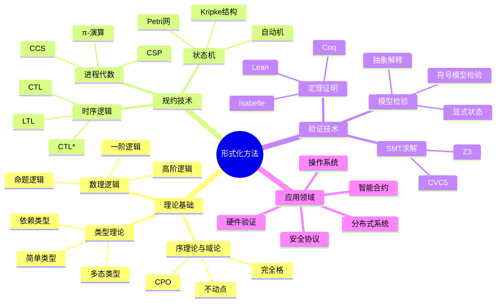
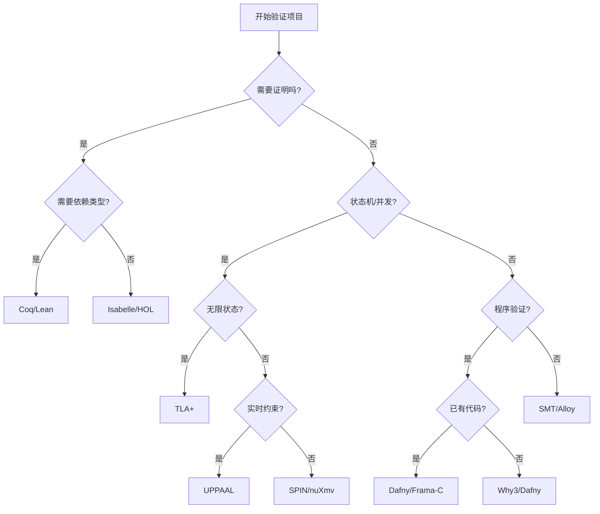

# 形式化方法快速参考手册

> **所属阶段**: 98-appendices | **前置依赖**: [全书各章节](../) | **形式化等级**: L1-L6汇总
>
> 本手册提供形式化方法领域最常用的符号、定理、命令和模板的快速查询。

---

## 目录

- [形式化方法快速参考手册](#形式化方法快速参考手册)
  - [目录](#目录)
  - [1. 符号速查表](#1-符号速查表)
    - [1.1 逻辑符号 (Logic Symbols)](#11-逻辑符号-logic-symbols)
    - [1.2 模态符号 (Modal Symbols)](#12-模态符号-modal-symbols)
    - [1.3 时序逻辑符号 (Temporal Logic Symbols)](#13-时序逻辑符号-temporal-logic-symbols)
    - [1.4 类型符号 (Type Symbols)](#14-类型符号-type-symbols)
    - [1.5 进程代数符号 (Process Algebra Symbols)](#15-进程代数符号-process-algebra-symbols)
  - [2. 定理编号速查](#2-定理编号速查)
    - [2.1 核心定理列表（按编号排序）](#21-核心定理列表按编号排序)
      - [基础理论阶段 (F)](#基础理论阶段-f)
      - [进程演算阶段 (C)](#进程演算阶段-c)
      - [模型分类阶段 (M)](#模型分类阶段-m)
      - [应用层阶段 (A)](#应用层阶段-a)
      - [验证方法阶段 (V)](#验证方法阶段-v)
      - [附录阶段 (S)](#附录阶段-s)
    - [2.2 最常用定理 TOP20](#22-最常用定理-top20)
  - [3. 工具命令速查](#3-工具命令速查)
    - [3.1 TLA+ 常用命令](#31-tla-常用命令)
      - [Toolbox 命令](#toolbox-命令)
      - [PlusCal 转换](#pluscal-转换)
      - [证明命令 (TLAPS)](#证明命令-tlaps)
    - [3.2 Coq 常用命令](#32-coq-常用命令)
      - [基本命令](#基本命令)
      - [核心证明策略](#核心证明策略)
      - [高级策略](#高级策略)
    - [3.3 Lean 4 常用命令](#33-lean-4-常用命令)
      - [基本结构](#基本结构)
      - [核心证明策略](#核心证明策略-1)
      - [Lean 4 特有](#lean-4-特有)
    - [3.4 Isabelle/HOL 常用命令](#34-isabellehol-常用命令)
      - [基本命令](#基本命令-1)
      - [证明方法](#证明方法)
      - [Isar 结构化证明](#isar-结构化证明)
    - [3.5 Z3 常用命令](#35-z3-常用命令)
      - [SMT-LIB 格式](#smt-lib-格式)
      - [Python API (z3-solver)](#python-api-z3-solver)
      - [常用选项](#常用选项)
  - [4. 公式模板](#4-公式模板)
    - [4.1 Hoare 三元组模板](#41-hoare-三元组模板)
      - [基本结构](#基本结构-1)
      - [推理规则模板](#推理规则模板)
      - [示例：数组求和](#示例数组求和)
    - [4.2 时序逻辑公式模板](#42-时序逻辑公式模板)
      - [LTL 常用模式](#ltl-常用模式)
      - [CTL 常用模式](#ctl-常用模式)
      - [TLA+ 动作公式](#tla-动作公式)
    - [4.3 类型判断模板](#43-类型判断模板)
      - [简单类型](#简单类型)
      - [多态类型 (System F)](#多态类型-system-f)
      - [依赖类型](#依赖类型)
    - [4.4 进程表达式模板](#44-进程表达式模板)
      - [CCS 进程](#ccs-进程)
      - [CSP 进程](#csp-进程)
      - [π-演算进程](#π-演算进程)
  - [5. 代码片段](#5-代码片段)
    - [5.1 TLA+ 规约片段](#51-tla-规约片段)
      - [互斥协议](#互斥协议)
      - [两阶段提交](#两阶段提交)
    - [5.2 Coq 证明片段](#52-coq-证明片段)
      - [列表长度](#列表长度)
      - [归纳谓词](#归纳谓词)
    - [5.3 Lean 4 证明片段](#53-lean-4-证明片段)
      - [自然数性质](#自然数性质)
      - [类型类示例](#类型类示例)
  - [6. 单位换算](#6-单位换算)
    - [6.1 时间复杂度对照](#61-时间复杂度对照)
      - [常见复杂度等级](#常见复杂度等级)
      - [运行时间估算 (假设 10^8 ops/sec)](#运行时间估算-假设-108-opssec)
      - [形式化方法算法复杂度](#形式化方法算法复杂度)
    - [6.2 空间复杂度对照](#62-空间复杂度对照)
      - [内存占用估算](#内存占用估算)
      - [形式化方法空间需求](#形式化方法空间需求)
      - [状态空间规模](#状态空间规模)
  - [7. 一页纸总结](#7-一页纸总结)
    - [7.1 形式化方法全景](#71-形式化方法全景)
    - [7.2 工具选择决策树](#72-工具选择决策树)
    - [7.3 快速参考速查卡](#73-快速参考速查卡)
  - [8. 可视化](#8-可视化)
    - [8.1 形式化方法知识体系图](#81-形式化方法知识体系图)
    - [8.2 工具选择流程图](#82-工具选择流程图)
  - [引用参考](#引用参考)

---

## 1. 符号速查表

### 1.1 逻辑符号 (Logic Symbols)

| 符号 | 名称 | LaTeX | 含义 | 示例 |
|------|------|-------|------|------|
| ¬ | 否定 | `\neg` | 非 | ¬P |
| ∧ | 合取 | `\land` | 与 | P ∧ Q |
| ∨ | 析取 | `\lor` | 或 | P ∨ Q |
| → | 蕴含 | `\rightarrow` | 如果...则... | P → Q |
| ↔ | 等价 | `\leftrightarrow` | 当且仅当 | P ↔ Q |
| ∀ | 全称量词 | `\forall` | 对所有 | ∀x.P(x) |
| ∃ | 存在量词 | `\exists` | 存在 | ∃x.P(x) |
| ∃! | 唯一存在 | `\exists!` | 存在唯一的 | ∃!x.P(x) |
| ⊢ | 推导 | `\vdash` | 可证明 | Γ ⊢ φ |
| ⊨ | 满足 | `\vDash` | 语义蕴涵 | M ⊨ φ |
| ⊤ | 真 | `\top` | 永真 | P ∨ ¬P ≡ ⊤ |
| ⊥ | 假 | `\bot` | 矛盾 | P ∧ ¬P ≡ ⊥ |

**优先级**: ¬ > ∧ > ∨ > → > ↔

### 1.2 模态符号 (Modal Symbols)

| 符号 | 名称 | LaTeX | 含义 | 读法 |
|------|------|-------|------|------|
| □ | 必然 | `\Box` | 必然成立 | "box" |
| ◇ | 可能 | `\Diamond` | 可能成立 | "diamond" |
| □ₐ | 主体a知道 | `\Box_a` | 主体a知道... | "box a" |
| ◇ₐ | 主体a认为可能 | `\Diamond_a` | 主体a认为...可能 | "diamond a" |

**公理系统对应关系**:

- K: □(P → Q) → (□P → □Q)
- T: □P → P (自反性)
- 4: □P → □□P (传递性)
- 5: ◇P → □◇P (欧几里得性)

### 1.3 时序逻辑符号 (Temporal Logic Symbols)

| 符号 | 名称 | LaTeX | LTL含义 | CTL含义 |
|------|------|-------|---------|---------|
| ○ | 下一状态 | `\bigcirc` | 下一时刻 | AX/EX |
| ◇ | 最终 | `\Diamond` | 最终成立 | AF/EF |
| □ | 总是 | `\Box` | 永远成立 | AG/EG |
| U | 直到 | `\mathcal{U}` | 直到...为止 | AU/EU |
| R | 释放 | `\mathcal{R}` | 除非/释放 | AR/ER |
| W | 弱直到 | `\mathcal{W}` | 弱直到 | - |

**LTL公式示例**:

- □◇P：无限频繁地满足P（活性）
- ◇□P：最终永远满足P（稳定性）
- □(P → ◇Q)：每当P发生，Q最终发生（响应性）
- □(P → ○Q)：每当P发生，下一状态Q发生（即时响应）

### 1.4 类型符号 (Type Symbols)

| 符号 | 名称 | LaTeX | 含义 | 示例 |
|------|------|-------|------|------|
| → | 函数类型 | `\rightarrow` | 从...到... | A → B |
| × | 积类型 | `\times` | 笛卡尔积 | A × B |
| + | 和类型 | `+` | 不相交并 | A + B |
| ∀ | 全称类型 | `\forall` | 全称量化类型 | ∀α.T |
| ∃ | 存在类型 | `\exists` | 存在量化类型 | ∃α.T |
| λ | 抽象 | `\lambda` | Lambda抽象 | λx: A. M |
| Π | 依赖积 | `\Pi` | 依赖函数类型 | Π(x:A).B |
| Σ | 依赖和 | `\Sigma` | 依赖对类型 | Σ(x:A).B |
| μ | 最小不动点 | `\mu` | 归纳类型 | μX.F(X) |
| ν | 最大不动点 | `\nu` | 共归纳类型 | νX.F(X) |
| ⊸ | 线性函数 | `\multimap` | 线性蕴涵 | A ⊸ B |
| ⊗ | 张量积 | `\otimes` | 乘法合取 | A ⊗ B |
| & | 合取 | `\&` | 加法合取 | A & B |
| ⊕ | 析取 | `\oplus` | 加法析取 | A ⊕ B |
| ! | 指数 | `!` | 复制 | !A |

**类型判断**:

```
Γ ⊢ M : A    (在上下文Γ中，项M具有类型A)
```

### 1.5 进程代数符号 (Process Algebra Symbols)

| 符号 | 名称 | 含义 | CCS | CSP |
|------|------|------|-----|-----|
| \| | 并行组合 | P \| Q 同时执行 | ✓ | ✓ |
| + | 选择 | P + Q 非确定性选择 | ✓ | ✓ |
| . | 前缀 | a.P 动作后执行P | ✓ | → |
| ! | 复制 | !P 无限复制 | ✓ | - |
| ? | 输入 | ?x 接收x | - | ✓ |
| ! | 输出 | !x 发送x | - | ✓ |
| \ | 限制 | P \\ L 限制动作集合L | ✓ | - |
| [f] | 重标记 | P[f] 动作重命名 | ✓ | - |
| □ | 外部选择 | P □ Q 环境决定 | - | ✓ |
| ⊓ | 内部选择 | P ⊓ Q 内部决定 | - | ✓ |
| ; | 顺序 | P ; Q 顺序执行 | - | ✓ |
| → | 前缀 | a → P 动作前缀 | - | ✓ |
| \\ | 隐藏 | P \\ A 隐藏动作 | - | ✓ |
|  | 语义 | P 进程的指称语义 | - | ✓ |

**π-演算特有**:

- νx (new x): 创建新名称
- x(y): 在通道x上接收y
- x̄⟨y⟩: 在通道x上发送y

---

## 2. 定理编号速查

### 2.1 核心定理列表（按编号排序）

#### 基础理论阶段 (F)

| 编号 | 名称 | 文档 | 应用领域 |
|------|------|------|----------|
| Thm-F-01-01 | Kleene不动点定理 | 01-order-theory.md | 递归语义 |
| Thm-F-01-02 | 前向模拟蕴含数据精化 | 01-order-theory.md | 精化验证 |
| Thm-F-02-01 | 流的终余代数刻画 | 02-category-theory.md | 流系统语义 |
| Thm-F-02-02 | 双模拟=同态核 | 02-category-theory.md | 等价验证 |
| Thm-F-03-01 | LTL模型检验复杂度 | 03-logic-foundations.md | 模型检验 |
| Thm-F-03-02 | 帧规则的安全性 | 03-logic-foundations.md | 分离逻辑 |
| Thm-F-04-01 | 函数空间的CPO结构 | 04-domain-theory.md | 指称语义 |
| Thm-F-04-02 | Tarski-Knaster不动点定理 | 04-domain-theory.md | 不动点计算 |
| Thm-F-05-01 | 归一化定理 | 05-type-theory.md | 类型系统 |

#### 进程演算阶段 (C)

| 编号 | 名称 | 文档 | 应用领域 |
|------|------|------|----------|
| Thm-C-01-01 | ω-演算协调性定理 | 01-omega-calculus.md | 分布式计算 |
| Thm-C-02-01 | π-演算图灵完备性 | 02-pi-calculus-basics.md | 表达能力 |
| Thm-C-02-02 | 互模拟同余定理 | 02-pi-calculus-basics.md | 等价验证 |
| Thm-C-03-01 | Kahn网络确定性定理 | 03-kahn-process-networks.md | 流处理 |
| Thm-C-03-02 | 数据流网络有界性判定 | 04-dataflow-process-networks.md | 资源分析 |

#### 模型分类阶段 (M)

| 编号 | 名称 | 文档 | 应用领域 |
|------|------|------|----------|
| Thm-M-01-01 | 同步vs异步表达能力 | 01-sync-async.md | 模型选择 |
| Thm-M-02-01 | 互模拟判定算法 | 01-process-algebras.md | 等价检验 |
| Thm-M-03-01 | CAP定理形式化 | 02-cap-theorem.md | 分布式设计 |
| Thm-M-04-01 | 一致性谱系完备性 | 01-consistency-spectrum.md | 一致性选择 |

#### 应用层阶段 (A)

| 编号 | 名称 | 文档 | 应用领域 |
|------|------|------|----------|
| Thm-A-01-01 | 工作流网Soundness判定 | 01-workflow-formalization.md | 流程验证 |
| Thm-A-02-01 | 流处理一致性定理 | 01-stream-formalization.md | 流系统验证 |
| Thm-A-02-02 | 窗口操作语义完整性 | 03-window-semantics.md | 窗口分析 |
| Thm-A-03-01 | Kubernetes调度安全性 | 02-kubernetes-verification.md | 容器编排 |

#### 验证方法阶段 (V)

| 编号 | 名称 | 文档 | 应用领域 |
|------|------|------|----------|
| Thm-V-01-01 | TLA+组合定理 | 01-tla-plus.md | 规约组合 |
| Thm-V-02-01 | 符号模型检验正确性 | 02-symbolic-mc.md | 模型检验 |
| Thm-V-03-01 | Hoare逻辑相对完备性 | 01-coq-isabelle.md | 程序验证 |

#### 附录阶段 (S)

| 编号 | 名称 | 描述 |
|------|------|------|
| Thm-S-98-01 | FLP不可能性定理 | 异步共识不可能 |
| Thm-S-98-02 | CAP定理 | 一致性-可用性-分区容错权衡 |
| Thm-S-98-03 | 拜占庭容错下界 | n ≥ 3f + 1 |
| Thm-S-98-04 | 强同余定理 | 互模拟同余性 |
| Thm-S-98-05 | 扩张定理 | 并行展开 |
| Thm-S-98-06 | CSP失败语义完备性 | 发散进程刻画 |
| Thm-S-98-07 | 工作流网Soundness判定定理 | 流程正确性 |
| Thm-S-98-08 | 可覆盖性定理 | Petri网判定 |

### 2.2 最常用定理 TOP20

| 排名 | 定理 | 使用频率 | 典型应用场景 |
|------|------|----------|--------------|
| 1 | **Thm-S-98-02: CAP定理** | ⭐⭐⭐⭐⭐ | 分布式系统架构设计 |
| 2 | **Thm-S-98-01: FLP不可能性** | ⭐⭐⭐⭐⭐ | 共识算法设计边界 |
| 3 | **Thm-F-01-01: Kleene不动点** | ⭐⭐⭐⭐⭐ | 递归函数语义定义 |
| 4 | **Thm-S-98-03: 拜占庭容错下界** | ⭐⭐⭐⭐ | 区块链共识设计 |
| 5 | **Thm-C-03-01: Kahn网络确定性** | ⭐⭐⭐⭐ | 流处理系统设计 |
| 6 | **Thm-S-98-04: 强同余定理** | ⭐⭐⭐⭐ | 进程代数等价验证 |
| 7 | **Thm-A-01-01: 工作流网Soundness** | ⭐⭐⭐⭐ | 业务流程验证 |
| 8 | **Thm-F-03-01: LTL模型检验复杂度** | ⭐⭐⭐⭐ | 模型检验可行性分析 |
| 9 | **Thm-F-02-02: 双模拟=同态核** | ⭐⭐⭐ | 余代数验证方法 |
| 10 | **Thm-C-02-02: 互模拟同余** | ⭐⭐⭐ | CCS/CSP验证 |
| 11 | **Thm-M-03-01: CAP定理形式化** | ⭐⭐⭐ | 形式化CAP分析 |
| 12 | **Thm-V-03-01: Hoare逻辑完备性** | ⭐⭐⭐ | 程序验证理论 |
| 13 | **Thm-S-98-05: 扩张定理** | ⭐⭐⭐ | 并行进程分析 |
| 14 | **Thm-A-02-01: 流处理一致性** | ⭐⭐⭐ | 流系统验证 |
| 15 | **Thm-F-04-02: Tarski-Knaster** | ⭐⭐⭐ | 抽象解释 |
| 16 | **Thm-M-04-01: 一致性谱系** | ⭐⭐⭐ | 数据库设计 |
| 17 | **Thm-V-02-01: 符号模型检验** | ⭐⭐ | BDD验证 |
| 18 | **Thm-A-03-01: K8s调度安全** | ⭐⭐ | 云原生验证 |
| 19 | **Thm-S-98-07: 工作流网判定** | ⭐⭐ | BPMN验证 |
| 20 | **Thm-C-01-01: ω-演算协调** | ⭐⭐ | 分布式算法 |

---

## 3. 工具命令速查

### 3.1 TLA+ 常用命令

#### Toolbox 命令

```bash
# 启动 Toolbox
toolbox

# 命令行模型检验 (TLC)
java -cp tla2tools.jar tlc2.TLC [options] specfile

# 常用选项
-config <file>     # 指定配置文件
-workers <n>       # 并行工作线程数
-depth <n>         # 状态空间搜索深度
-simulate          # 随机模拟模式
-difftrace         # 显示状态差异
-terse             # 简洁输出
```

#### PlusCal 转换

```bash
# PlusCal 转 TLA+
java -cp tla2tools.jar pcal.trans [options] file

# 常用选项
-unixLineEndings   # 使用Unix换行
-termination       # 检查终止性
```

#### 证明命令 (TLAPS)

```tla
(* 证明结构 *)
THEOREM Thm == ASSUME A PROVE B
PROOF
  <1>1. A => B
  <1>2. A
  <1>3. QED BY <1>1, <1>2

(* 常用策略 *)
BY <facts>         (* 使用给定事实 *)
OBVIOUS            (* 显然成立 *)
DEF <defs>         (* 展开定义 *)
SMT                (* 调用SMT求解器 *)
Zenon              (* 调用Zenon证明器 *)
```

### 3.2 Coq 常用命令

#### 基本命令

```coq
(* 定义 *)
Definition name : type := term.
Fixpoint name (arg: type) : type := ...
Inductive name : type := | cons1 : ... | cons2 : ...

(* 定理与证明 *)
Theorem name : statement.
Proof.
  tactic1.
  tactic2.
Qed.  (* 或 Admitted. / Abort. *)

(* 查询 *)
Check term.           (* 显示类型 *)
Print name.           (* 显示定义 *)
Search "pattern".     (* 搜索 *)
About name.           (* 显示信息 *)
```

#### 核心证明策略

| 策略 | 作用 | 示例 |
|------|------|------|
| `intros` | 引入假设 | `intros H.` |
| `apply` | 应用定理 | `apply H.` |
| `rewrite` | 重写 | `rewrite H.` |
| `simpl` | 简化 | `simpl.` |
| `reflexivity` | 自反性 | `reflexivity.` |
| `destruct` | 分解 | `destruct H.` |
| `induction` | 归纳 | `induction n.` |
| `auto` | 自动证明 | `auto.` |
| `tauto` | 命题逻辑 | `tauto.` |
| `omega` | 算术 | `omega.` |
| `lia` | 线性整数 | `lia.` |

#### 高级策略

```coq
(* SSReflect 风格 *)
move => H.           (* 引入 *)
move: H.             (* 回退 *)
by [].               (* 完成证明 *)

(* Ltac 自定义 *)
Ltac mytac := intros; simpl; auto.

(* 类型类 *)
Class EqDec (A: Type) := {
  eqb : A -> A -> bool;
  eqb_eq : forall x y, eqb x y = true <-> x = y
}.
```

### 3.3 Lean 4 常用命令

#### 基本结构

```lean
-- 定义
def name (arg : Type) : Type := ...
structure Name where
  field1 : Type1
  field2 : Type2

-- 定理与证明
theorem name : statement := by
  tactic1
  tactic2

-- 归纳类型
inductive Name : Type
  | ctor1 : ... -> Name
  | ctor2 : ... -> Name
```

#### 核心证明策略

| 策略 | 作用 | 示例 |
|------|------|------|
| `intro` | 引入假设 | `intro h` |
| `apply` | 应用定理 | `apply h` |
| `rw` | 重写 | `rw [h]` |
| `simp` | 简化 | `simp [h1, h2]` |
| `exact` | 精确匹配 | `exact h` |
| `have` | 引入中间结论 | `have h : P := ...` |
| `cases` | 情况分析 | `cases h` |
| `induction` | 归纳法 | `induction n with ...` |
| `trivial` | 平凡证明 | `trivial` |
| `aesop` | 自动证明 | `aesop` |
| `linarith` | 线性算术 | `linarith` |
| `omega` | Presburger算术 | `omega` |

#### Lean 4 特有

```lean
-- 类型类实例
instance : ToString MyType where
  toString x := ...

-- do 记法
def foo : IO Unit := do
  let x <- getLine
  println s!"Hello, {x}"

-- 模式匹配
def factorial : Nat -> Nat
  | 0 => 1
  | n + 1 => (n + 1) * factorial n

-- Lake (构建工具)
-- lake build        构建项目
-- lake exe name     运行可执行文件
-- lake test         运行测试
```

### 3.4 Isabelle/HOL 常用命令

#### 基本命令

```isabelle
definition name :: "type" where
  "name = definition"

fun name :: "type => type" where
  "name x = ..."

theorem name: "statement"
  apply (tactic1)
  apply (tactic2)
  done

lemma name: "statement"
proof (method)
  show ?thesis by auto
qed
```

#### 证明方法

| 方法 | 作用 | 示例 |
|------|------|------|
| `simp` | 简化 | `apply simp` |
| `auto` | 自动 | `apply auto` |
| `blast` | 表证法 | `apply blast` |
| `force` | 强制搜索 | `apply force` |
| `arith` | 算术 | `apply arith` |
| `induct` | 归纳 | `apply (induct n)` |
| `cases` | 情况分析 | `apply (cases x)` |
| `rule` | 应用规则 | `apply rule` |
| `erule` | 消去规则 | `apply (erule conjE)` |
| `drule` | 消解规则 | `apply (drule mp)` |

#### Isar 结构化证明

```isabelle
proof (rule ccontr)
  assume "¬ P"
  then have "..." by simp
  then show "False" by blast
qed
```

### 3.5 Z3 常用命令

#### SMT-LIB 格式

```smtlib
; 设置逻辑
(set-logic QF_LIA)  ; 无量词线性整数算术

; 声明变量
(declare-fun x () Int)
(declare-const y Real)

; 定义约束
(assert (> x 0))
(assert (= (+ x y) 10))

; 求解
(check-sat)
(get-model)
```

#### Python API (z3-solver)

```python
from z3 import *

# 创建变量
x = Int('x')
y = Real('y')
b = Bool('b')

# 创建求解器
s = Solver()

# 添加约束
s.add(x > 0)
s.add(x + y == 10)
s.add(Implies(b, x < 5))

# 求解
if s.check() == sat:
    m = s.model()
    print(m[x], m[y])
else:
    print("Unsatisfiable")

# 优化
opt = Optimize()
opt.add(x + y == 10)
opt.add(x > 0)
opt.maximize(x)
print(opt.check())
```

#### 常用选项

```bash
# 命令行
z3 -smt2 input.smt2
cvc5 --lang smt2 input.smt2

# Z3 选项
(set-option :produce-models true)
(set-option :timeout 5000)
```

---

## 4. 公式模板

### 4.1 Hoare 三元组模板

#### 基本结构

```
{P} C {Q}

其中:
- P: 前置条件 (Precondition)
- C: 命令/程序 (Command)
- Q: 后置条件 (Postcondition)
```

#### 推理规则模板

```
[赋值规则]
{Q[e/x]} x := e {Q}

[顺序规则]
{P} C1 {R}    {R} C2 {Q}
------------------------
{P} C1; C2 {Q}

[条件规则]
{P ∧ b} C1 {Q}    {P ∧ ¬b} C2 {Q}
----------------------------------
{P} if b then C1 else C2 {Q}

[循环规则]
{I ∧ b} C {I}
----------------
{I} while b do C {I ∧ ¬b}

[循环不变式]
{P} while b do C {Q}
需要找到 I 使得:
- P => I
- {I ∧ b} C {I}
- I ∧ ¬b => Q
```

#### 示例：数组求和

```
{ n ≥ 0 }
i := 0;
s := 0;
while i < n do
  s := s + a[i];
  i := i + 1
{ s = Σ(k=0 to n-1) a[k] }

循环不变式 I:
  0 ≤ i ≤ n ∧ s = Σ(k=0 to i-1) a[k]
```

### 4.2 时序逻辑公式模板

#### LTL 常用模式

| 性质类型 | 公式模板 | 含义 |
|----------|----------|------|
| 安全性 | `□¬P` | P 永不发生 |
| 安全性 | `□(P → ○¬P)` | P 不会连续发生 |
| 活性 | `◇P` | P 最终发生 |
| 活性 | `□◇P` | P 无限频繁发生 |
| 稳定性 | `◇□P` | 最终 P 永远成立 |
| 响应性 | `□(P → ◇Q)` | P 导致 Q 最终发生 |
| 即时响应 | `□(P → ○Q)` | P 导致 Q 下一时刻发生 |
| 优先级 | `□(P ∧ Q → ○R)` | 当P和Q同时成立时R下一时刻成立 |
| 公平性 | `□◇enabled(A) → □◇executed(A)` | 弱公平 |
| 强公平 | `◇□enabled(A) → □◇executed(A)` | 强公平 |

#### CTL 常用模式

```
可达性: EF P          (存在路径最终满足P)
安全性: AG ¬P         (所有路径上P永不发生)
活性: AF P            (所有路径上P最终发生)
分支: AG(P → EF Q)    (所有路径上P导致某路径上Q)
循环: EG P            (存在循环路径P始终成立)
```

#### TLA+ 动作公式

```tla
[动作公式模板]
Action == ∧ var1' = expr1    (*  primed 表示下一状态 *)
          ∧ var2' = expr2
          ∧ UNCHANGED other  (*  其他变量不变 *)

[时序公式]
Spec == Init ∧ □[Next]_vars ∧ Fairness

[公平性约束]
WeakFairness  == WF_vars(Next)
StrongFairness == SF_vars(Action)
```

### 4.3 类型判断模板

#### 简单类型

```
[变量规则]
Γ, x:A ⊢ x : A

[抽象规则]
Γ, x:A ⊢ M : B
----------------
Γ ⊢ λx.M : A → B

[应用规则]
Γ ⊢ M : A → B    Γ ⊢ N : A
---------------------------
Γ ⊢ M N : B
```

#### 多态类型 (System F)

```
[类型抽象]
Γ ⊢ M : T
----------------
Γ ⊢ Λα.M : ∀α.T

[类型应用]
Γ ⊢ M : ∀α.T
----------------
Γ ⊢ M[U] : T[U/α]
```

#### 依赖类型

```
[Π-类型]
Γ, x:A ⊢ B : Type
-------------------
Γ ⊢ Π(x:A).B : Type

[λ-构造]
Γ, x:A ⊢ M : B
------------------------
Γ ⊢ λx.M : Π(x:A).B

[应用]
Γ ⊢ M : Π(x:A).B    Γ ⊢ N : A
-------------------------------
Γ ⊢ M N : B[N/x]
```

### 4.4 进程表达式模板

#### CCS 进程

```
[基本进程]
0              (* 空进程 *)
α.P            (* 前缀 *)
P + Q          (* 选择 *)
P | Q          (* 并行 *)
P \ {a,b}      (* 限制 *)
P[f]           (* 重标记 *)
A              (* 进程变量，定义: A = P *)

[递归]
fix X.P        (* 递归进程 *)
μX.P           (* 最小不动点 *)
```

#### CSP 进程

```
[基本进程]
STOP           (* 死锁 *)
SKIP           (* 成功终止 *)
a → P          (* 前缀 *)
P □ Q          (* 外部选择 *)
P ⊓ Q          (* 内部选择 *)
P ||| Q        (* 交错并行 *)
P |[A]| Q      (* 同步并行 *)
P ; Q          (* 顺序 *)
P \ A          (* 隐藏 *)

[递归]
μX • F(X)      (* 递归定义 *)
```

#### π-演算进程

```
[基本进程]
0              (* 空进程 *)
α.P            (* 前缀 *)
P + Q          (* 选择 *)
P | Q          (* 并行 *)
(νx)P          (* 限制/新名称 *)
!P             (* 复制 *)
[x=y]P         (* 匹配 *)
[x≠y]P         (* 不匹配 *)

[动作前缀]
x(y).P         (* 输入: 在x上接收y *)
x̄⟨y⟩.P         (* 输出: 在x上发送y *)
τ.P            (* 内部动作 *)
```

---

## 5. 代码片段

### 5.1 TLA+ 规约片段

#### 互斥协议

```tla
------------------------- MODULE Mutex -------------------------
EXTENDS Naturals, FiniteSets

CONSTANTS N, Procs

VARIABLES state, req, grant

vars == <<state, req, grant>>

Init ==
  ∧ state = [i ∈ Procs |-> "idle"]
  ∧ req = [i ∈ Procs |-> FALSE]
  ∧ grant = {}

Request(i) ==
  ∧ state[i] = "idle"
  ∧ state' = [state EXCEPT ![i] = "waiting"]
  ∧ req' = [req EXCEPT ![i] = TRUE]
  ∧ UNCHANGED grant

Enter(i) ==
  ∧ state[i] = "waiting"
  ∧ grant = {}
  ∧ state' = [state EXCEPT ![i] = "critical"]
  ∧ grant' = {i}
  ∧ UNCHANGED req

Exit(i) ==
  ∧ state[i] = "critical"
  ∧ state' = [state EXCEPT ![i] = "idle"]
  ∧ req' = [req EXCEPT ![i] = FALSE]
  ∧ grant' = {}

Next == ∃i ∈ Procs : Request(i) ∨ Enter(i) ∨ Exit(i)

Spec == Init ∧ □[Next]_vars

(* 安全性: 互斥 *)
MutualExclusion ==
  ∀i, j ∈ Procs : (i ≠ j) ⇒ ¬(state[i] = "critical" ∧ state[j] = "critical")

(* 活性: 无饥饿 *)
NoStarvation ==
  ∀i ∈ Procs : state[i] = "waiting" ~> state[i] = "critical"

THEOREM Spec ⇒ □MutualExclusion ∧ NoStarvation
===============================================================
```

#### 两阶段提交

```tla
TwoPhaseCommit ==
  ∧ TMInit
  ∧ □[∃ r ∈ RM : Prepare(r)
               ∨ Commit(r)
               ∨ Abort(r)
               ∨ TMRcvPrepared
               ∨ TMCommit
               ∨ TMAbort]_vars
  ∧ TMCommitOrAbort
```

### 5.2 Coq 证明片段

#### 列表长度

```coq
Require Import List Arith.
Import ListNotations.

(* 定义 *)
Fixpoint length {A : Type} (l : list A) : nat :=
  match l with
  | [] => 0
  | _ :: t => S (length t)
  end.

(* 定理: append 长度 *)
Theorem app_length : forall A (l1 l2 : list A),
  length (l1 ++ l2) = length l1 + length l2.
Proof.
  intros A l1 l2.          (* 引入变量 *)
  induction l1 as [| h t IH].
  - (* 基本情况: l1 = [] *)
    simpl.                 (* 简化 *)
    reflexivity.           (* 自反性 *)
  - (* 归纳步骤 *)
    simpl.                 (* 简化左边 *)
    rewrite IH.            (* 应用归纳假设 *)
    reflexivity.
Qed.
```

#### 归纳谓词

```coq
(* 偶数定义 *)
Inductive even : nat -> Prop :=
  | even_0 : even 0
  | even_SS : forall n, even n -> even (S (S n)).

(* 证明: 4是偶数 *)
Example even_4 : even 4.
Proof.
  apply even_SS.           (* 应用归纳构造子 *)
  apply even_SS.
  apply even_0.
Qed.

(* 策略风格证明 *)
Theorem even_plus : forall n m,
  even n -> even m -> even (n + m).
Proof.
  intros n m Hn Hm.
  induction Hn.            (* 在even n上归纳 *)
  - simpl. assumption.     (* 基本情况 *)
  - simpl. constructor.    (* 应用even_SS *)
    apply IHHn. assumption.
Qed.
```

### 5.3 Lean 4 证明片段

#### 自然数性质

```lean
def factorial : Nat → Nat
  | 0 => 1
  | n + 1 => (n + 1) * factorial n

-- 定理: factorial 总是正数
theorem factorial_pos : ∀ n : Nat, factorial n > 0 := by
  intro n
  induction n with
  | zero =>
    simp [factorial]
  | succ n ih =>
    simp [factorial]
    apply Nat.mul_pos
    · linarith  -- n + 1 > 0
    · exact ih

-- 结构归纳示例
inductive Tree (α : Type)
  | leaf : Tree α
  | node : α → Tree α → Tree α → Tree α

def Tree.size : Tree α → Nat
  | .leaf => 0
  | .node _ l r => 1 + l.size + r.size

theorem Tree.size_nonneg : ∀ t : Tree α, t.size ≥ 0 := by
  intro t
  induction t with
  | leaf => simp [Tree.size]
  | node _ l r ihl ihr =>
    simp [Tree.size]
    linarith [ihl, ihr]
```

#### 类型类示例

```lean
class Group (G : Type) where
  mul : G → G → G
  one : G
  inv : G → G
  mul_assoc : ∀ a b c : G, mul (mul a b) c = mul a (mul b c)
  one_mul : ∀ a : G, mul one a = a
  mul_one : ∀ a : G, mul a one = a
  mul_left_inv : ∀ a : G, mul (inv a) a = one

instance : Group Int where
  mul := (· + ·)
  one := 0
  inv := (-·)
  mul_assoc := Int.add_assoc
  one_mul := Int.zero_add
  mul_one := Int.add_zero
  mul_left_inv := Int.neg_add_cancel

-- 使用类型类
theorem Group.mul_right_inv [Group G] : ∀ a : G, mul a (inv a) = one := by
  intro a
  -- 证明略
  sorry
```

---

## 6. 单位换算

### 6.1 时间复杂度对照

#### 常见复杂度等级

| 符号 | 名称 | 可处理规模 (n) | 典型算法 |
|------|------|----------------|----------|
| O(1) | 常数 | ∞ | 哈希查找 |
| O(log n) | 对数 | 10^18 | 二分查找 |
| O(√n) | 平方根 | 10^12 | 素数测试 |
| O(n) | 线性 | 10^8 | 线性扫描 |
| O(n log n) | 线性对数 | 10^6 | 排序 |
| O(n^2) | 平方 | 10^4 | 双重循环 |
| O(n^3) | 立方 | 500 | Floyd-Warshall |
| O(2^n) | 指数 | 30 | 子集枚举 |
| O(n!) | 阶乘 | 11 | 排列枚举 |

#### 运行时间估算 (假设 10^8 ops/sec)

| n | O(log n) | O(n) | O(n log n) | O(n^2) | O(2^n) |
|---|----------|------|------------|--------|--------|
| 10 | <1μs | <1μs | <1μs | <1μs | <1μs |
| 100 | <1μs | 1μs | 7μs | 100μs | 4ms |
| 1,000 | 10μs | 10μs | 100μs | 10ms | 宇宙年龄 |
| 10^5 | 17μs | 1ms | 17ms | 17min | - |
| 10^6 | 20μs | 10ms | 200ms | 11天 | - |
| 10^9 | 30μs | 10s | 5min | 3万年 | - |

#### 形式化方法算法复杂度

| 问题 | 复杂度 | 说明 |
|------|--------|------|
| 命题可满足性 (SAT) | NP-完全 | 实际中DPLL很快 |
| 一阶逻辑可满足性 | 半可判定 | 停机问题 |
| LTL 模型检验 | PSPACE-完全 | 实际中可处理 |
| CTL 模型检验 | P-完全 | O(\|S\| + \|R\|) |
| μ-演算模型检验 | NP ∩ co-NP | - |
| 互模拟检验 | P-完全 | 采用Paige-Tarjan |
| Petri网可达性 | 可判定但非初等 | 近年有突破 |
| 类型推导 | P-完全 | Hindley-Milner |

### 6.2 空间复杂度对照

#### 内存占用估算

| 数据规模 | 空间需求 | 示例 |
|----------|----------|------|
| 10^3 | 4KB | 小型配置 |
| 10^6 | 4MB | 中等数组 |
| 10^8 | 400MB | 大规模数据 |
| 10^9 | 4GB | 超大规模 |

#### 形式化方法空间需求

| 技术 | 空间瓶颈 | 典型需求 |
|------|----------|----------|
| 显式状态模型检验 | 状态存储 | 内存限制 |
| 符号模型检验 (BDD) | BDD节点数 | 随变量指数增长 |
| SMT求解 | 子句学习 | 数GB |
| 定理证明 | 证明项 | 可能无限 |
| 抽象解释 | 抽象域元素 | 可控 |

#### 状态空间规模

| 变量数 | 布尔状态空间 | 说明 |
|--------|--------------|------|
| 10 | 1,024 | 平凡 |
| 20 | 1,048,576 | 可处理 |
| 30 | 10^9 | 符号方法可处理 |
| 50 | 10^15 | 需要抽象 |
| 100 | 10^30 | 完全不可能显式处理 |
| 1000 | 10^301 | 需要高层次规约 |

---

## 7. 一页纸总结

### 7.1 形式化方法全景

```
┌─────────────────────────────────────────────────────────────────────────┐
│                         形式化方法全景图                                 │
├─────────────────────────────────────────────────────────────────────────┤
│                                                                         │
│  ┌──────────────┐    ┌──────────────┐    ┌──────────────┐              │
│  │  规约语言     │───▶│  形式模型    │───▶│  验证技术    │              │
│  └──────────────┘    └──────────────┘    └──────────────┘              │
│        │                   │                   │                        │
│        ▼                   ▼                   ▼                        │
│  ├─ TLA+              ├─ Kripke结构      ├─ 模型检验                    │
│  ├─ Event-B           ├─ Petri网         ├─ 定理证明                    │
│  ├─ Z/VDM             ├─ 进程代数        ├─ 类型系统                    │
│  └─ Coq/Lean          └─ 自动机          └─ 抽象解释                    │
│                                                                         │
├─────────────────────────────────────────────────────────────────────────┤
│                           应用领域                                      │
├─────────────────────────────────────────────────────────────────────────┤
│                                                                         │
│  ┌──────────┐  ┌──────────┐  ┌──────────┐  ┌──────────┐                │
│  │ 硬件设计  │  │ 操作系统  │  │ 分布式系统│  │ 安全协议  │                │
│  │ (seL4)   │  │ (VeriSoft)│  │ (Raft)  │  │ (TLS)   │                │
│  └──────────┘  └──────────┘  └──────────┘  └──────────┘                │
│                                                                         │
│  ┌──────────┐  ┌──────────┐  ┌──────────┐  ┌──────────┐                │
│  │ 编译器   │  │ 数据库   │  │ 智能合约 │  │ AI系统   │                │
│  │ (CompCert)│  │ (Cassandra)│  │ (Solidity)│  │ (神经网络)│                │
│  └──────────┘  └──────────┘  └──────────┘  └──────────┘                │
│                                                                         │
└─────────────────────────────────────────────────────────────────────────┘
```

### 7.2 工具选择决策树

```
┌─────────────────────────────────────────────────────────────────────────┐
│                      形式化验证工具选择决策树                             │
└─────────────────────────────────────────────────────────────────────────┘

是否需要构造性证明?
│
├─ 是 → 需要编程语言集成?
│       │
│       ├─ 是 → 需要依赖类型?
│       │       │
│       │       ├─ 是 → 【Coq】或【Lean 4】
│       │       │       - 依赖类型 + 证明无关性 (Coq)
│       │       │       - 现代化元编程 (Lean 4)
│       │       │
│       │       └─ 否 → 【Isabelle/HOL】
│       │               - 经典逻辑
│       │               - 强大的自动化 (Sledgehammer)
│       │
│       └─ 否 → 偏好函数式语言?
│               │
│               ├─ 是 → 【Coq】
│               └─ 否 → 【Isabelle/HOL】
│
└─ 否 → 主要验证状态机/并发系统?
        │
        ├─ 是 → 需要无限状态?
        │       │
        │       ├─ 是 → 【TLA+】
        │       │       - 处理时序逻辑
        │       │       - 支持活性性质
        │       │       - 工业级应用 (AWS, Azure)
        │       │
        │       └─ 否 → 需要实时约束?
        │               │
        │               ├─ 是 → 【UPPAAL】
        │               │       - 时间自动机
        │               │       - 模型检验
        │               │
        │               └─ 否 → 【SPIN】/【nuXmv】
        │                       - 显式状态模型检验
        │                       - LTL性质检验
        │
        └─ 否 → 需要程序验证?
                │
                ├─ 是 → 已有代码?
                │       │
                │       ├─ 是 → 【Dafny】/【Frama-C】
                │       │       - Dafny: .NET生态
                │       │       - Frama-C: C代码验证
                │       │
                │       └─ 否 → 【Why3】/【Dafny】
                │               - 验证导向的程序设计
                │
                └─ 否 → 需要SMT求解?
                        │
                        ├─ 是 → 【Z3】/【CVC5】
                        │       - 约束求解
                        │       - 程序分析
                        │       - 测试生成
                        │
                        └─ 否 → 【Alloy】
                                - 轻量级规约
                                - 可视化分析
                                - 教学友好
```

### 7.3 快速参考速查卡

```
┌────────────────────────────────────────────────────────────────────────┐
│                     形式化方法速查卡 (Quick Reference)                  │
├────────────────────────────────────────────────────────────────────────┤
│ 常用符号                          │ 常用工具命令                        │
├───────────────────────────────────┼─────────────────────────────────────┤
│ ¬ ∧ ∨ → ↔ ∀ ∃ ⊢ ⊨                │ Coq: intros, apply, rewrite, simpl  │
│ □ ◇ (模态) ○ U R (时序)           │ Lean: intro, rw, simp, exact, linarith│
│ → × + ∀ ∃ λ (类型)                │ TLA+: Init ∧ □[Next]_vars            │
│ | + . ! ? (进程)                  │ Isabelle: apply simp, auto, blast   │
├───────────────────────────────────┼─────────────────────────────────────┤
│ 关键定理                          │ 复杂度速记                          │
├───────────────────────────────────┼─────────────────────────────────────┤
│ CAP: CP/AP 不可兼得               │ O(1) < O(log n) < O(n)              │
│ FLP: 异步共识不可能               │ O(n log n) < O(n²) < O(2ⁿ)          │
│ Kleene: 不动点定理                │                                     │
│ Bisimulation: 行为等价            │ 模型检验: LTL = PSPACE, CTL = P     │
├───────────────────────────────────┴─────────────────────────────────────┤
│ 公式模板                                                               │
├────────────────────────────────────────────────────────────────────────┤
│ Hoare: {P} C {Q}                                                      │
│ LTL安全性: □¬P     LTL活性: ◇P     响应: □(P → ◇Q)                     │
│ 类型: Γ ⊢ M : A                                                       │
│ 进程: P | Q (并行), P + Q (选择)                                       │
└────────────────────────────────────────────────────────────────────────┘
```

---

## 8. 可视化

### 8.1 形式化方法知识体系图



### 8.2 工具选择流程图



---

## 引用参考


---

*本文档最后更新: 2026-04-10*
*版本: v1.0*
